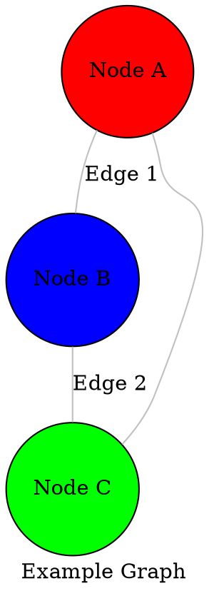
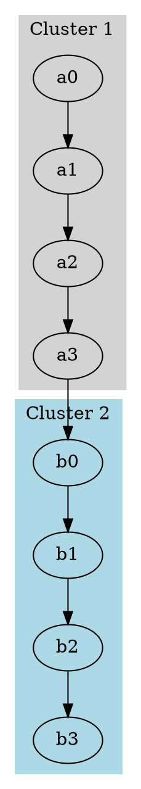
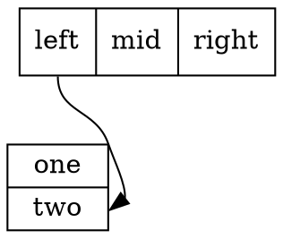

# Graph Data Formats: Comprehensive Design Reference

**Version:** 1.0
**Date:** 2025-11-11
**Purpose:** Comprehensive reference for implementing graph data format support in Graphty

## Table of Contents

1. [Overview](#overview)
2. [Format Priority Rankings](#format-priority-rankings)
3. [Format Specifications](#format-specifications)
4. [Sample Data Repositories](#sample-data-repositories)
5. [Implementation Recommendations](#implementation-recommendations)

---

## Overview

This document provides comprehensive information about graph data formats discovered through research of 40+ visualization tools. Formats are organized by popularity (number of tools supporting each format) and include detailed specifications, variants, and sample data sources.

### Research Scope

- **Tools Researched:** 40+ (desktop apps, web libraries, CLI tools, graph databases)
- **Formats Discovered:** 35+
- **Format Categories:** XML-based, JSON-based, CSV-based, text-based, binary/specialized

### Format Selection Criteria

For each format, the following information is provided:

- **Priority ranking** based on tool support
- **Official specifications** with URLs
- **Tool compatibility** listing
- **Format variants** used by different programs
- **Sample data sources** with file sizes and node counts
- **Technical characteristics** (extensions, MIME types, encoding)

---

## Format Priority Rankings

Formats are ranked by the number of tools supporting them:

| Rank | Format               | Tools | Category    | Priority    |
| ---- | -------------------- | ----- | ----------- | ----------- |
| 1    | JSON (Various)       | 30+   | JSON        | Essential   |
| 2    | GraphML              | 25+   | XML         | Essential   |
| 3    | CSV/Edge Lists       | 22+   | Text        | Essential   |
| 4    | GML                  | 18+   | Text        | High        |
| 5    | GEXF                 | 15+   | XML         | High        |
| 6    | Pajek NET            | 14+   | Text        | High        |
| 7    | DOT                  | 12+   | Text        | High        |
| 8    | UCINET DL            | 11+   | Text        | Medium      |
| 9    | Excel/XLSX           | 11+   | Spreadsheet | Medium      |
| 10   | GraphSON             | 10+   | JSON        | Medium      |
| 11   | XGMML                | 9+    | XML         | Medium      |
| 12   | SIF                  | 8+    | Text        | Medium      |
| 13   | GDF                  | 7+    | Text        | Low         |
| 14   | VNA                  | 6+    | Text        | Low         |
| 15   | CX/CX2               | 6+    | JSON        | Low         |
| 16   | TGF                  | 6+    | Text        | Low         |
| 17   | BioPAX               | 6+    | RDF/OWL     | Specialized |
| 18   | RDF/Turtle/N-Triples | 6+    | RDF         | Specialized |
| 19   | SBML                 | 5+    | XML         | Specialized |
| 20   | Matrix Market        | 4+    | Text        | Low         |
| 21+  | Other formats        | 2-4   | Various     | Niche       |

---

## Format Specifications

### Tier 1: Essential Formats (20+ tools)

---

#### 1. JSON (Custom/Generic)

**Priority:** Essential (30+ tools)
**Category:** JSON-based
**File Extension:** `.json`
**MIME Type:** `application/json`

##### Description

JSON is the most widely supported format across modern graph visualization tools. However, each tool often uses its own schema/structure. The basic pattern involves nodes and edges/links arrays with varying attribute structures.

##### Common Variants

###### 1.1. D3.js Node-Link Format

**Used by:** D3.js, Observable, many D3-based visualizations

**Specification:** https://d3js.org/d3-force
**Documentation:** https://d3-graph-gallery.com/graph/network_data_format.html

**Structure:**

```json
{
    "nodes": [
        { "id": "node1", "group": 1, "name": "Node 1" },
        { "id": "node2", "group": 1, "name": "Node 2" }
    ],
    "links": [{ "source": "node1", "target": "node2", "value": 1 }]
}
```

**Key Features:**

- Uses `links` instead of `edges`
- `source` and `target` can be node IDs or indices
- D3 modifies the data structure in-place during simulation
- Optional `value` for link weight
- Optional `group` for node categorization

###### 1.2. Cytoscape.js (CYJS) Format

**Used by:** Cytoscape.js, GraphSpace

**Specification:** https://js.cytoscape.org/#notation/elements-json
**JSON Schema:** https://github.com/cytoscape/cytoscape.js/blob/master/documentation/md/notation/elements-json.md

**Structure:**

```json
{
  "elements": {
    "nodes": [
      {
        "data": {"id": "node1", "label": "Node 1"},
        "position": {"x": 100, "y": 100},
        "style": {"background-color": "#888"}
      }
    ],
    "edges": [
      {
        "data": {"id": "edge1", "source": "node1", "target": "node2", "label": "Edge 1"}
      }
    ]
  },
  "style": [...],
  "layout": {...}
}
```

**Key Features:**

- Separates `data`, `position`, and `style` properties
- Supports nested data attributes
- Can include layout and style definitions
- Elements can be specified as array or object

###### 1.3. Sigma.js Format

**Used by:** Sigma.js (via Graphology)

**Documentation:** https://graphology.github.io/serialization.html#format
**GitHub:** https://github.com/graphology/graphology

**Structure:**

```json
{
    "attributes": { "name": "My Graph" },
    "nodes": [
        {
            "key": "node1",
            "attributes": { "label": "Node 1", "x": 0, "y": 0, "size": 10, "color": "#f00" }
        }
    ],
    "edges": [
        {
            "key": "edge1",
            "source": "node1",
            "target": "node2",
            "attributes": { "weight": 1, "color": "#ccc" }
        }
    ]
}
```

**Key Features:**

- Uses `key` for node/edge identifiers
- Separate `attributes` object for all properties
- Supports x, y, z coordinates in attributes
- Follows Graphology library conventions

###### 1.4. Vis.js Format

**Used by:** Vis.js Network

**Documentation:** https://visjs.github.io/vis-network/docs/network/
**Examples:** https://visjs.github.io/vis-network/examples/

**Structure:**

```json
{
    "nodes": [
        { "id": 1, "label": "Node 1", "group": "A" },
        { "id": 2, "label": "Node 2", "group": "B" }
    ],
    "edges": [{ "from": 1, "to": 2, "label": "Edge 1-2" }]
}
```

**Key Features:**

- Uses `from` and `to` instead of `source` and `target`
- Numeric or string IDs
- Direct property assignment (no nested data object)
- Optional `group` for styling

###### 1.5. NetworkX Node-Link JSON

**Used by:** NetworkX (Python)

**Documentation:** https://networkx.org/documentation/stable/reference/readwrite/json_graph.html
**Module:** `networkx.readwrite.json_graph`

**Structure (node-link):**

```json
{
    "directed": false,
    "multigraph": false,
    "graph": {},
    "nodes": [{ "id": "node1", "attr1": "value1" }],
    "links": [{ "source": "node1", "target": "node2", "weight": 1 }]
}
```

**Variants:**

- **node-link:** Default format (shown above)
- **adjacency:** Adjacency list representation
- **tree:** Tree data structure
- **cytoscape:** Compatible with Cytoscape.js

**Key Features:**

- Includes graph type metadata (`directed`, `multigraph`)
- Preserves all node and edge attributes
- Multiple format options for different use cases

###### 1.6. Graphology JSON

**Used by:** Graphology library

**Specification:** https://graphology.github.io/serialization.html#json
**GitHub:** https://github.com/graphology/graphology

**Structure:**

```json
{
  "attributes": {"name": "My Graph", "description": "Example"},
  "options": {
    "type": "mixed",
    "multi": false,
    "allowSelfLoops": true
  },
  "nodes": [
    {"key": "node1", "attributes": {...}}
  ],
  "edges": [
    {"key": "edge1", "source": "node1", "target": "node2", "attributes": {...}, "undirected": false}
  ]
}
```

**Key Features:**

- Rich metadata in `options`
- Explicit `undirected` flag per edge for mixed graphs
- Comprehensive attribute preservation

###### 1.7. G6 (AntV) Format

**Used by:** G6, AntV visualization platform

**Documentation:** https://g6.antv.antgroup.com/en/manual/getting-started
**GitHub:** https://github.com/antvis/G6

**Structure:**

```json
{
  "nodes": [
    {
      "id": "node1",
      "label": "Node 1",
      "x": 100,
      "y": 100,
      "style": {...}
    }
  ],
  "edges": [
    {
      "source": "node1",
      "target": "node2",
      "label": "Edge 1"
    }
  ]
}
```

**Key Features:**

- Includes x, y coordinates directly
- Optional `style` object for visual properties
- Supports `combos` for grouped nodes

###### 1.8. 3d-force-graph / react-force-graph Format

**Used by:** 3d-force-graph, react-force-graph, 2d-force-graph

**GitHub:** https://github.com/vasturiano/3d-force-graph
**Documentation:** https://github.com/vasturiano/3d-force-graph#input-json-syntax

**Structure:**

```json
{
    "nodes": [{ "id": "node1", "name": "Node 1", "val": 1, "color": "#ff0000" }],
    "links": [{ "source": "node1", "target": "node2", "value": 1 }]
}
```

**Key Features:**

- Uses `links` like D3.js
- `val` for node size
- Supports 3D coordinates (x, y, z)
- Compatible with D3-force

###### 1.9. JSON Graph Format (JGF)

**Used by:** Generic specification for JSON graphs

**Specification:** https://jsongraphformat.info/
**GitHub:** https://github.com/jsongraph/json-graph-specification

**Structure:**

```json
{
    "graph": {
        "directed": true,
        "type": "graph type",
        "label": "graph label",
        "metadata": {},
        "nodes": [
            {
                "id": "node1",
                "label": "Node 1",
                "metadata": {}
            }
        ],
        "edges": [
            {
                "source": "node1",
                "target": "node2",
                "relation": "edge relationship",
                "directed": true,
                "metadata": {}
            }
        ]
    }
}
```

**Key Features:**

- Formal specification attempting to standardize JSON graphs
- Rich metadata support
- Per-edge `directed` flag
- Optional `relation` for edge types

##### Sample Data Sources

- **D3.js examples:** https://d3-graph-gallery.com/graph/network_data_format.html
- **Les Misérables (D3 format):** https://gist.github.com/korydondzila/4988c41b399d9ed5c192a6eaf4e09aa2
- **NetworkX examples:** Generated via NetworkX library
- **Observable collections:** https://observablehq.com/@d3/gallery

##### Supported Tools

D3.js, Sigma.js, Cytoscape.js, Vis.js, 3d-force-graph, 2d-force-graph, react-force-graph, G6, Graphology, NetworkX, igraph (export), Neo4j, ArangoDB, OrientDB, JanusGraph, Blender addons, ELK, KeyLines, ReGraph, Linkurious, and many others

---

#### 2. GraphML

**Priority:** Essential (25+ tools)
**Category:** XML-based
**File Extension:** `.graphml`, `.xml`
**MIME Type:** `application/graphml+xml`, `application/xml`

##### Description

GraphML is an XML-based file format for graphs. It's a comprehensive, well-documented standard with excellent tool support across desktop and web applications.

##### Specification

**Official Specification:** http://graphml.graphdrawing.org/
**XSD Schema:** http://graphml.graphdrawing.org/xmlns/1.1/graphml.xsd
**Primer:** http://graphml.graphdrawing.org/primer/graphml-primer.html

**Current Version:** 1.1 (2013)
**Previous Version:** 1.0

**Schema Namespace:** `http://graphml.graphdrawing.org/xmlns`

##### Structure

```xml
<?xml version="1.0" encoding="UTF-8"?>
<graphml xmlns="http://graphml.graphdrawing.org/xmlns"
         xmlns:xsi="http://www.w3.org/2001/XMLSchema-instance"
         xsi:schemaLocation="http://graphml.graphdrawing.org/xmlns
         http://graphml.graphdrawing.org/xmlns/1.1/graphml.xsd">

  <!-- Key definitions for attributes -->
  <key id="d0" for="node" attr.name="color" attr.type="string"/>
  <key id="d1" for="edge" attr.name="weight" attr.type="double"/>

  <graph id="G" edgedefault="undirected">
    <node id="n0">
      <data key="d0">green</data>
    </node>
    <node id="n1">
      <data key="d0">yellow</data>
    </node>
    <edge id="e0" source="n0" target="n1">
      <data key="d1">1.0</data>
    </edge>
  </graph>
</graphml>
```

##### Key Features

- **Extensibility:** Custom attributes via `<key>` declarations
- **Typed attributes:** string, boolean, int, long, float, double
- **Nested graphs:** Supports hierarchical graph structures
- **Ports:** Node connection points
- **Hyperedges:** Edges connecting multiple nodes
- **Standard extensions:** yFiles, XHTML labels, graphics attributes

##### Common Extensions

###### yFiles Extension

**Namespace:** `http://www.yworks.com/xml/graphml`

Used by yEd for visual properties:

```xml
<key id="d6" for="node" yfiles.type="nodegraphics"/>
<node id="n0">
  <data key="d6">
    <y:ShapeNode>
      <y:Geometry height="30.0" width="30.0" x="0.0" y="0.0"/>
      <y:Fill color="#FFCC00" transparent="false"/>
      <y:BorderStyle color="#000000" type="line" width="1.0"/>
      <y:NodeLabel>Node 1</y:NodeLabel>
    </y:ShapeNode>
  </data>
</node>
```

##### Sample Data Sources

- **Karate Club:** https://github.com/chengw07/NetWalk/blob/master/data/karate.GraphML (8KB, 34 nodes)
- **Game of Thrones:** https://github.com/melaniewalsh/sample-social-network-datasets/blob/master/sample-datasets/game-of-thrones/got-network.graphml (~50KB)
- **Sample collection:** https://github.com/melaniewalsh/sample-social-network-datasets
- **KONECT datasets:** http://konect.cc/ (many available in GraphML)
- **Network Repository:** https://networkrepository.com/ (GraphML exports available)

##### Supported Tools

Gephi, Cytoscape, yEd, NetworkX, igraph, graph-tool, Tulip, NodeXL, SocNetV, Neo4j (via APOC), Graphology, OrientDB, TinkerPop, JanusGraph, Graphviz (import), and many others

##### Technical Notes

- **Character Encoding:** UTF-8 recommended
- **Compression:** Can be compressed (.graphmlz)
- **Validation:** XSD schema available for validation
- **Performance:** XML parsing can be slower than binary formats for large graphs

---

#### 3. CSV / Edge Lists

**Priority:** Essential (22+ tools)
**Category:** Text-based
**File Extension:** `.csv`, `.txt`, `.edges`, `.edgelist`
**MIME Type:** `text/csv`, `text/plain`

##### Description

CSV and edge list formats are the simplest and most universal way to represent graph data. However, different tools use different conventions and structures.

##### Common Variants

###### 3.1. Simple Edge List

**Used by:** Most tools as basic import format

**Structure:**

```csv
source,target
node1,node2
node2,node3
node1,node3
```

or space/tab delimited:

```
node1 node2
node2 node3
node1 node3
```

**Features:**

- Minimal format
- No headers (sometimes)
- Assumes unweighted, unlabeled edges
- Node attributes not supported

###### 3.2. Weighted Edge List

**Used by:** NetworkX, igraph, most analysis tools

**Structure:**

```csv
source,target,weight
node1,node2,1.0
node2,node3,2.5
node1,node3,0.8
```

**Features:**

- Third column for edge weight
- Can add more columns for additional edge attributes

###### 3.3. Edge List with Attributes

**Used by:** Gephi, Cytoscape, custom importers

**Structure:**

```csv
source,target,weight,type,color
node1,node2,1.0,friend,#ff0000
node2,node3,2.5,colleague,#00ff00
```

**Features:**

- Multiple attribute columns
- Attribute types inferred or specified separately

###### 3.4. Gephi CSV Format

**Used by:** Gephi

**Documentation:** https://gephi.org/users/supported-graph-formats/csv-format/

**Edge List (edges.csv):**

```csv
Source,Target,Type,Id,Label,Weight
node1,node2,Undirected,edge1,Friend,1.0
```

**Node List (nodes.csv):**

```csv
Id,Label,Color,Size
node1,Node 1,#ff0000,10
node2,Node 2,#00ff00,15
```

**Features:**

- Separate files for nodes and edges
- Specific column names (case-sensitive)
- `Type` column for directed/undirected
- Rich attribute support

###### 3.5. Cytoscape CSV Import

**Used by:** Cytoscape

**Documentation:** https://manual.cytoscape.org/en/stable/Creating_Networks.html#import-data-table-files

**Structure:**

```csv
source,target,interaction,sourceType,targetType
A,B,pp,protein,protein
B,C,pd,protein,drug
```

**Features:**

- `interaction` column for edge type
- Type annotations for nodes
- Can import attributes separately

###### 3.6. Neo4j CSV Import Format

**Used by:** Neo4j

**Documentation:** https://neo4j.com/docs/operations-manual/current/tools/neo4j-admin/neo4j-admin-import/

**Nodes CSV:**

```csv
personId:ID,name,:LABEL
1,John,Person
2,Jane,Person
```

**Relationships CSV:**

```csv
:START_ID,:END_ID,:TYPE
1,2,KNOWS
```

**Features:**

- Special header syntax (`:ID`, `:LABEL`, `:TYPE`)
- Type annotations with colon prefix
- Optimized for bulk import

###### 3.7. Separate Node and Edge Files

**Used by:** Many tools for rich attributes

**Nodes (nodes.csv):**

```csv
id,label,type,x,y,size,color
1,Node 1,A,100,200,10,#ff0000
2,Node 2,B,300,150,15,#00ff00
```

**Edges (edges.csv):**

```csv
source,target,weight,type
1,2,1.0,friend
2,3,2.5,colleague
```

**Features:**

- Separate files allow different attribute sets
- More flexible than single-file format
- Better for large graphs with many attributes

###### 3.8. Adjacency List Format

**Used by:** NetworkX, graph-tool, academic datasets

**Structure:**

```
# Each line: node followed by its neighbors
node1 node2 node3
node2 node1 node4
node3 node1
node4 node2
```

With labels:

```
0 1 2
1 0 3
2 0
3 1
```

**Features:**

- Space-efficient for sparse graphs
- Natural representation of adjacency
- Can include weights: `node1 node2:1.0 node3:2.5`

##### Sample Data Sources

- **Melanie Walsh's collection:** https://github.com/melaniewalsh/sample-social-network-datasets (many CSV examples)
- **SNAP datasets:** https://snap.stanford.edu/data/ (edge lists)
- **Network Repository:** https://networkrepository.com/ (various formats)
- **Gephi sample data:** https://github.com/gephi/gephi/wiki/Datasets

##### Supported Tools

Gephi, Cytoscape, NetworkX, igraph, graph-tool, NodeXL, UCINET, Neo4j, ArangoDB, Tulip, SocNetV, D3.js, Sigma.js, Vis.js, and virtually all graph analysis tools

##### Technical Notes

- **Delimiter:** Usually comma, but can be tab, space, or semicolon
- **Headers:** Some formats require headers, others don't
- **Quoting:** Use quotes for values containing delimiters
- **Character Encoding:** UTF-8 recommended
- **Escaping:** Follow CSV RFC 4180 for proper escaping

---

### Tier 2: High Priority Formats (12-19 tools)

---

#### 4. GML (Graph Modeling Language)

**Priority:** High (18+ tools)
**Category:** Text-based
**File Extension:** `.gml`
**MIME Type:** `text/plain`

##### Description

GML is a simple, hierarchical text format that's human-readable and widely supported. It's particularly popular in academic and research contexts.

##### Specification

**Original Paper:** "GML: A portable Graph File Format" (1996)
**Documentation:** https://web.archive.org/web/20190303094704/http://www.infosun.fim.uni-passau.de/Graphlet/GML/gml-tr.html
**Informal Spec:** http://docs.yworks.com/yfiles/doc/developers-guide/gml.html

##### Structure

```gml
graph [
  directed 0
  id 42
  label "Example Graph"

  node [
    id 1
    label "Node 1"
    value 10
  ]

  node [
    id 2
    label "Node 2"
    value 20
  ]

  edge [
    source 1
    target 2
    label "Edge 1-2"
    weight 1.5
  ]
]
```

##### Key Features

- **Simple syntax:** Key-value pairs and nested structures
- **Human-readable:** Easy to edit manually
- **Flexible attributes:** Any key-value pairs allowed
- **Graphics extensions:** Support for visual properties (x, y, w, h, fill, etc.)

##### Common Extensions

###### Visual Attributes

```gml
node [
  id 1
  label "Node 1"
  graphics [
    x 100.0
    y 200.0
    w 30.0
    h 30.0
    type "rectangle"
    fill "#FF0000"
    outline "#000000"
  ]
]

edge [
  source 1
  target 2
  graphics [
    type "line"
    arrow "last"
    width 2.0
    fill "#000000"
  ]
]
```

##### Sample Data Sources

- **Karate Club:** https://gephi.org/datasets/karate.gml.zip (3KB, 34 nodes)
- **Mark Newman's collection:** http://www-personal.umich.edu/~mejn/netdata/ (dolphins, football, etc.)
- **Network Repository:** https://networkrepository.com/ (many GML files)

##### Supported Tools

Gephi, Cytoscape, yEd, NetworkX, igraph, graph-tool, Tulip, SocNetV, NodeXL, Graphviz, Pajek, UCINET, and others

##### Technical Notes

- **Node IDs:** Must be integers
- **Comments:** C++ style (`//` and `/* */`)
- **Data Types:** Integer, float, string
- **Lists:** Supported with `[ ]` syntax
- **Character Encoding:** ASCII or UTF-8

---

#### 5. GEXF (Graph Exchange XML Format)

**Priority:** High (15+ tools)
**Category:** XML-based
**File Extension:** `.gexf`
**MIME Type:** `application/gexf+xml`, `application/xml`

##### Description

GEXF is an XML format designed specifically for Gephi but adopted by other tools. It supports dynamic networks, hierarchical graphs, and rich attributes.

##### Specification

**Official Specification:** https://gexf.net/
**XSD Schema:** https://gexf.net/schema.html
**Format Documentation:** https://gexf.net/format/

**Current Version:** 1.3 (2015)
**Previous Versions:** 1.2, 1.1 (deprecated)

**Schema Namespace:** `http://gexf.net/1.3`

##### Structure

```xml
<?xml version="1.0" encoding="UTF-8"?>
<gexf xmlns="http://gexf.net/1.3"
      xmlns:viz="http://gexf.net/1.3/viz"
      version="1.3">

  <meta lastmodifieddate="2025-11-11">
    <creator>Graphty</creator>
    <description>Example Graph</description>
  </meta>

  <graph mode="static" defaultedgetype="undirected">

    <attributes class="node">
      <attribute id="0" title="label" type="string"/>
      <attribute id="1" title="value" type="integer"/>
    </attributes>

    <nodes>
      <node id="0" label="Node 1">
        <attvalues>
          <attvalue for="1" value="10"/>
        </attvalues>
        <viz:position x="0.0" y="0.0" z="0.0"/>
        <viz:color r="255" g="0" b="0"/>
        <viz:size value="10.0"/>
      </node>
      <node id="1" label="Node 2">
        <attvalues>
          <attvalue for="1" value="20"/>
        </attvalues>
        <viz:position x="100.0" y="100.0" z="0.0"/>
        <viz:color r="0" g="255" b="0"/>
        <viz:size value="15.0"/>
      </node>
    </nodes>

    <edges>
      <edge id="0" source="0" target="1" weight="1.0"/>
    </edges>

  </graph>
</gexf>
```

##### Key Features

- **Dynamic networks:** Time-based graphs with `mode="dynamic"`
- **Hierarchical graphs:** Parent-child node relationships
- **Visual properties:** Position, color, size via `viz:` namespace
- **Typed attributes:** string, integer, float, double, boolean, anyURI
- **Phylogenics:** Support for evolutionary trees

##### Dynamic Networks

```xml
<graph mode="dynamic" timeformat="double" start="0.0" end="10.0">
  <node id="0" label="Dynamic Node" start="0.0" end="5.0">
    <attvalues>
      <attvalue for="0" value="A" start="0.0" end="2.0"/>
      <attvalue for="0" value="B" start="2.0" end="5.0"/>
    </attvalues>
  </node>

  <edge id="0" source="0" target="1" start="2.0" end="8.0"/>
</graph>
```

##### Hierarchical Graphs

```xml
<node id="parent1" label="Parent">
  <nodes>
    <node id="child1" label="Child 1"/>
    <node id="child2" label="Child 2"/>
  </nodes>
</node>
```

##### Sample Data Sources

- **Les Misérables:** https://raw.githubusercontent.com/gephi/gephi-lite/refs/heads/main/packages/gephi-lite/public/samples/Les%20Miserables.gexf (50KB, 77 nodes, 254 edges)
- **Gephi datasets:** https://github.com/gephi/gephi/wiki/Datasets
- **Gephi sample files:** https://gephi.org/datasets/

##### Supported Tools

Gephi (native), Sigma.js, NetworkX, igraph, NodeXL, Graphology, graph-tool (export), and others

##### Technical Notes

- **Version 1.3 recommended:** Version 1.1 is deprecated
- **Character Encoding:** UTF-8
- **Validation:** XSD schema available
- **Compression:** Not natively supported (use .gexf.gz)
- **Namespaces:** Uses `viz:` for visual properties

---

#### 6. Pajek NET Format

**Priority:** High (14+ tools)
**Category:** Text-based
**File Extension:** `.net`, `.paj`
**MIME Type:** `text/plain`

##### Description

Pajek NET is the native format for Pajek, a program for large network analysis. It's a simple text format widely used in social network analysis.

##### Specification

**Documentation:** http://mrvar.fdv.uni-lj.si/pajek/
**Format Description:** http://vlado.fmf.uni-lj.si/pub/networks/pajek/doc/draweps.htm
**Manual:** http://mrvar.fdv.uni-lj.si/pajek/pajekman.pdf

##### Structure

```
*Vertices 3
1 "Node 1" 0.5 0.5 0.5
2 "Node 2" 0.3 0.7 0.5
3 "Node 3" 0.8 0.4 0.5

*Arcs
1 2 1.0
2 3 2.5

*Edges
1 3 0.8

*Matrix
0 1 0
0 0 1
1 0 0
```

##### Key Features

- **Multiple sections:** `*Vertices`, `*Arcs` (directed), `*Edges` (undirected), `*Matrix`
- **Coordinates:** x, y, z coordinates for node positions
- **Partitions:** Support for node classifications
- **Permutations:** Node ordering information
- **Hierarchies:** Hierarchical structures

##### Detailed Format

###### Vertices Section

```
*Vertices n
id "label" x y z shape x_fact y_fact color [attributes]
```

Where:

- `n` = number of vertices
- `id` = vertex number (1-indexed)
- `label` = vertex label in quotes
- `x y z` = coordinates (0.0 to 1.0)
- `shape` = ellipse (default), box, diamond, triangle, etc.
- `color` = RGB or color name

###### Arcs Section (Directed Edges)

```
*Arcs
source target weight
```

or with labels:

```
*Arcslist
source target1 target2 target3
```

###### Edges Section (Undirected Edges)

```
*Edges
node1 node2 weight
```

###### Matrix Section

```
*Matrix
row1_values
row2_values
...
```

##### Sample Data Sources

- **Pajek datasets:** http://vlado.fmf.uni-lj.si/pub/networks/data/
- **UCINET datasets (convertible):** https://sites.google.com/site/ucinetsoftware/datasets
- **Network Repository:** https://networkrepository.com/ (some NET files)

##### Supported Tools

Gephi, Pajek, NetworkX, igraph, NodeXL, UCINET, NetDraw, SocNetV, graph-tool, and others

##### Technical Notes

- **1-indexed:** Node IDs start at 1, not 0
- **Coordinates:** Normalized to 0.0-1.0 range
- **Mixed graphs:** Can have both arcs and edges
- **Character Encoding:** ASCII or UTF-8
- **Comments:** Lines starting with `%`

---

#### 7. DOT (Graphviz)

**Priority:** High (12+ tools)
**Category:** Text-based
**File Extension:** `.dot`, `.gv`
**MIME Type:** `text/vnd.graphviz`

##### Description

DOT is the graph description language used by Graphviz. It's a human-readable text format with support for rich visual attributes and hierarchical layouts.

##### Specification

**Official Documentation:** https://graphviz.org/doc/info/lang.html
**Attribute Reference:** https://graphviz.org/docs/attrs/
**Grammar:** https://graphviz.org/doc/info/lang.html

**Maintained by:** Graphviz project (AT&T Labs Research)

##### Structure



##### Key Features

- **Hierarchical layouts:** Optimized for directed acyclic graphs
- **Rich attributes:** 200+ attributes for styling
- **Subgraphs:** Support for clustering and compound graphs
- **HTML-like labels:** Rich text formatting
- **Ports:** Node connection points

##### Advanced Features

###### Subgraphs and Clusters



###### HTML-like Labels


###### Record Shapes



##### Sample Data Sources

- **Graphviz examples:** https://graphviz.org/gallery/
- **Tutorial examples:** https://renenyffenegger.ch/notes/tools/Graphviz/examples/index
- **GitHub samples:** https://github.com/pinczakko/GraphViz-Samples
- **Gist examples:** https://gist.github.com/foowaa/063c921b511e129a1943342b10b1ee98

##### Supported Tools

Graphviz (native), Gephi, NetworkX, igraph, Tulip, Vis.js, graph-tool, PlantUML, Mermaid (partial), and others

##### Technical Notes

- **Layout engines:** dot, neato, fdp, sfdp, circo, twopi, osage, patchwork
- **Output formats:** PNG, SVG, PDF, PS, and 40+ others
- **Comments:** C++ style (`//` and `/* */`)
- **Character Encoding:** UTF-8
- **Keywords:** graph, digraph, node, edge, subgraph, strict

---

### Tier 3: Medium Priority Formats (8-11 tools)

---

#### 8. UCINET DL Format

**Priority:** Medium (11+ tools)
**Category:** Text-based
**File Extension:** `.dl`, `.dat`
**MIME Type:** `text/plain`

##### Description

DL (Data Language) is the native format for UCINET, a social network analysis package. It supports multiple data representations including matrices, edge lists, and node lists.

##### Specification

**Documentation:** Included in UCINET manual
**UCINET Website:** https://sites.google.com/site/ucinetsoftware/

##### Structure

###### Edge List Format

```
DL n=4
format=edgelist1
labels:
A,B,C,D
data:
A B 1
A C 1
B C 2
C D 1
```

###### Matrix Format

```
DL n=4
format=fullmatrix
labels:
A,B,C,D
data:
0 1 1 0
1 0 1 0
1 1 0 1
0 0 1 0
```

###### Node List Format

```
DL n=4
format=nodelist1
labels:
A,B,C,D
data:
A B C
B A C
C A B D
D C
```

##### Key Features

- **Multiple formats:** edgelist, nodelist, fullmatrix, etc.
- **Labels:** Optional node labels
- **Matrix types:** Full, upper triangular, lower triangular
- **Multiple relations:** Support for multiplex networks

##### Sample Data Sources

- **UCINET datasets:** Included with UCINET software
- **UCI Network Data Repository:** http://networkdata.ics.uci.edu/

##### Supported Tools

UCINET (native), Gephi, NetDraw, NodeXL, NetworkX, SocNetV, and others

##### Technical Notes

- **Case-insensitive:** Keywords not case-sensitive
- **Comments:** Lines starting with `*`
- **Delimiters:** Space, comma, or tab

---

#### 9. Excel / XLSX Format

**Priority:** Medium (11+ tools)
**Category:** Spreadsheet
**File Extension:** `.xlsx`, `.xls`
**MIME Type:** `application/vnd.openxmlformats-officedocument.spreadsheetml.sheet`

##### Description

Excel files are widely used for graph data due to their familiarity and ease of editing. Different tools expect different worksheet structures.

##### Common Structures

###### Single Sheet Edge List

| Source | Target | Weight | Type      |
| ------ | ------ | ------ | --------- |
| Node A | Node B | 1.0    | friend    |
| Node B | Node C | 2.5    | colleague |

###### Multiple Sheets (Nodes + Edges)

**Nodes sheet:**

| ID  | Label  | Type   | Color   |
| --- | ------ | ------ | ------- |
| 1   | Node A | Person | #FF0000 |
| 2   | Node B | Person | #00FF00 |

**Edges sheet:**

| Source | Target | Weight | Type  |
| ------ | ------ | ------ | ----- |
| 1      | 2      | 1.0    | knows |

###### Adjacency Matrix

|     | A   | B   | C   | D   |
| --- | --- | --- | --- | --- |
| A   | 0   | 1   | 1   | 0   |
| B   | 1   | 0   | 1   | 0   |
| C   | 1   | 1   | 0   | 1   |
| D   | 0   | 0   | 1   | 0   |

##### Tool-Specific Formats

###### NodeXL Format

Uses specific worksheet names:

- "Vertices" sheet with columns: Vertex, Color, Shape, Size, etc.
- "Edges" sheet with columns: Vertex 1, Vertex 2, Relationship, etc.

###### Gephi Import

- Accepts edge lists with Source, Target, Type, Weight
- Can import node tables separately

##### Sample Data Sources

- **Melanie Walsh's collection:** https://github.com/melaniewalsh/sample-social-network-datasets (includes Excel files)

##### Supported Tools

Gephi, Cytoscape, yEd, NodeXL, Neo4j, Tom Sawyer, ArangoDB, and custom importers

##### Technical Notes

- **Modern format:** Use `.xlsx` (Office Open XML) over `.xls` (binary)
- **Sheet names:** Often significant for import
- **Data types:** Preserve number vs text types
- **File size:** Can be large for big networks

---

#### 10. GraphSON

**Priority:** Medium (10+ tools)
**Category:** JSON-based
**File Extension:** `.json`
**MIME Type:** `application/json`

##### Description

GraphSON is a JSON-based format for TinkerPop-enabled graph databases. It has three incompatible versions with different structures.

##### Specification

**TinkerPop Documentation:** https://tinkerpop.apache.org/docs/current/dev/io/
**GraphSON 3.0 Spec:** https://tinkerpop.apache.org/docs/current/dev/io/#graphson-3d0

**Versions:**

- **1.0:** Original version (legacy)
- **2.0:** Added type information
- **3.0:** Current version (default since TinkerPop 3.3.0)

##### Structure

###### GraphSON 3.0 (Current)

```json
{
    "@type": "g:Graph",
    "@value": {
        "vertices": [
            {
                "@type": "g:Vertex",
                "@value": {
                    "id": { "@type": "g:Int32", "@value": 1 },
                    "label": "person",
                    "properties": {
                        "name": [
                            {
                                "@type": "g:VertexProperty",
                                "@value": {
                                    "id": { "@type": "g:Int64", "@value": 0 },
                                    "value": "John",
                                    "label": "name"
                                }
                            }
                        ]
                    }
                }
            }
        ],
        "edges": [
            {
                "@type": "g:Edge",
                "@value": {
                    "id": { "@type": "g:Int32", "@value": 7 },
                    "label": "knows",
                    "inV": { "@type": "g:Int32", "@value": 2 },
                    "outV": { "@type": "g:Int32", "@value": 1 },
                    "properties": {
                        "weight": { "@type": "g:Double", "@value": 0.5 }
                    }
                }
            }
        ]
    }
}
```

###### GraphSON 1.0 (Legacy)

```json
{
    "vertices": [
        {
            "id": 1,
            "label": "person",
            "type": "vertex",
            "properties": {
                "name": [{ "id": 0, "value": "John" }]
            }
        }
    ],
    "edges": [
        {
            "id": 7,
            "label": "knows",
            "type": "edge",
            "inV": 2,
            "outV": 1,
            "properties": { "weight": 0.5 }
        }
    ]
}
```

##### Key Features

- **Type preservation:** Explicit type information in v2.0+
- **Property graphs:** Full support for TinkerPop property graph model
- **Multi-properties:** Vertices can have multiple values per property key
- **Meta-properties:** Properties on properties

##### Sample Data Sources

- **TinkerPop examples:** https://tinkerpop.apache.org/docs/current/tutorials/getting-started/
- **Oracle documentation:** https://docs.oracle.com/en/database/oracle/property-graph/21.1/spgdg/graphson-data-format.html

##### Supported Tools

TinkerPop (native), JanusGraph, Neo4j, Amazon Neptune, Azure Cosmos DB, DataStax Graph, OrientDB, and other graph databases

##### Technical Notes

- **Version incompatibility:** v1.0, v2.0, v3.0 are not compatible
- **Default version:** v3.0 since TinkerPop 3.3.0
- **Type system:** Supports Java types with `@type` annotations
- **Streaming:** Can be used in streaming contexts

---

#### 11. XGMML (eXtensible Graph Markup and Modeling Language)

**Priority:** Medium (9+ tools)
**Category:** XML-based
**File Extension:** `.xgmml`, `.xml`
**MIME Type:** `application/xml`

##### Description

XGMML is an XML-based format that extends GML. It's the preferred format for Cytoscape and supports rich attributes and visual properties.

##### Specification

**Documentation:** http://www.cs.rpi.edu/research/groups/pb/punin/public_html/XGMML/
**DTD:** http://www.cs.rpi.edu/research/groups/pb/punin/public_html/XGMML/xgmml.dtd

**Evolution of GML**

##### Structure

```xml
<?xml version="1.0" encoding="UTF-8" standalone="yes"?>
<graph label="Example" directed="1"
       xmlns:dc="http://purl.org/dc/elements/1.1/"
       xmlns:xlink="http://www.w3.org/1999/xlink"
       xmlns:rdf="http://www.w3.org/1999/02/22-rdf-syntax-ns#"
       xmlns="http://www.cs.rpi.edu/XGMML">

  <att name="documentVersion" value="1.1"/>

  <node id="1" label="Node 1">
    <att name="type" value="protein"/>
    <att name="score" value="0.95"/>
    <graphics type="RECTANGLE" fill="#FF0000" w="40.0" h="40.0" x="100.0" y="100.0"/>
  </node>

  <node id="2" label="Node 2">
    <att name="type" value="protein"/>
    <graphics type="ELLIPSE" fill="#00FF00" w="30.0" h="30.0" x="200.0" y="150.0"/>
  </node>

  <edge label="1-2" source="1" target="2">
    <att name="interaction" value="pp"/>
    <att name="weight" value="1.0"/>
    <graphics width="2.0" fill="#000000"/>
  </edge>

</graph>
```

##### Key Features

- **Attributes:** Generic `<att>` elements for custom properties
- **Visual properties:** `<graphics>` elements for nodes and edges
- **Metadata:** Dublin Core and RDF support
- **Hypergraphs:** Support for edges containing edges

##### Sample Data Sources

- **Cytoscape sample sessions:** https://cytoscape.org/
- **Biological pathway databases:** Often export as XGMML

##### Supported Tools

Cytoscape (preferred format), yEd, ArangoDB, biological network tools

##### Technical Notes

- **Namespace:** `http://www.cs.rpi.edu/XGMML`
- **Character Encoding:** UTF-8
- **Validation:** DTD available

---

#### 12. SIF (Simple Interaction Format)

**Priority:** Medium (8+ tools)
**Category:** Text-based
**File Extension:** `.sif`
**MIME Type:** `text/plain`

##### Description

SIF is a simple tab-delimited format used primarily for biological interaction networks. Each line represents an interaction.

##### Specification

**Cytoscape Documentation:** https://manual.cytoscape.org/en/stable/Supported_Network_File_Formats.html#sif-format

##### Structure

```
nodeA interactionType nodeB
nodeA interactionType nodeC nodeD
nodeB otherType nodeE
```

Example:

```
ProteinA pp ProteinB
ProteinA pd DrugX DrugY
GeneC reg GeneD
```

##### Key Features

- **Simple format:** One line per interaction
- **Multiple targets:** Can specify multiple targets in one line
- **Interaction types:** Middle column specifies relationship type
- **Tab-delimited:** Fields separated by tabs (or spaces)

##### Variants

###### Extended SIF

Includes additional columns for attributes:

```
nodeA interactionType nodeB attribute1 attribute2
```

##### Sample Data Sources

- **Pathway Commons:** https://www.pathwaycommons.org/ (SIF exports)
- **BioGRID:** https://thebiogrid.org/ (convertible to SIF)
- **STRING:** https://string-db.org/ (export option)

##### Supported Tools

Cytoscape (native), Pathway Commons, BioGRID, STRING, biological pathway tools

##### Technical Notes

- **Delimiter:** Tab preferred, space acceptable
- **Case-sensitive:** Interaction types are case-sensitive
- **Node attributes:** Require separate file
- **Simple but limited:** No visual properties or rich metadata

---

### Tier 4: Low Priority / Specialized Formats (2-7 tools)

---

#### 13. GDF (GUESS Data Format)

**Priority:** Low (7+ tools)
**Category:** Text-based
**File Extension:** `.gdf`
**MIME Type:** `text/plain`

##### Description

GDF is a CSV-like format used by GUESS and supported by Gephi. It combines node and edge definitions in a single file.

##### Specification

**GUESS Documentation:** http://graphexploration.cond.org/
**Gephi Support:** https://gephi.org/users/supported-graph-formats/gdf-format/

##### Structure

```
nodedef>name VARCHAR,label VARCHAR,class VARCHAR,visible BOOLEAN,x DOUBLE,y DOUBLE,color VARCHAR
s1,Site 1,website,true,2.0,3.0,'114,116,177'
s2,Site 2,website,true,2.1,3.1,'114,116,177'
s3,Site 3,blog,true,2.2,3.2,'219,116,251'

edgedef>node1 VARCHAR,node2 VARCHAR,directed BOOLEAN,weight DOUBLE
s1,s2,true,1.0
s2,s3,true,2.5
s1,s3,false,0.8
```

##### Key Features

- **Combined format:** Nodes and edges in same file
- **Type declarations:** Explicit type for each column
- **Visual properties:** x, y coordinates, colors
- **Simple syntax:** CSV-like with headers

##### Supported Data Types

- VARCHAR (string)
- BOOLEAN (true/false)
- INTEGER
- DOUBLE
- FLOAT

##### Sample Data Sources

- **Gephi documentation examples**
- **GUESS sample files** (if available)

##### Supported Tools

Gephi, GUESS (native), NodeXL, and some custom parsers

##### Technical Notes

- **Headers required:** `nodedef>` and `edgedef>` sections
- **Delimiter:** Comma
- **Color format:** 'R,G,B' in quotes
- **Limited adoption:** Less common than other formats

---

#### 14. VNA (NetDraw format)

**Priority:** Low (6+ tools)
**Category:** Text-based
**File Extension:** `.vna`
**MIME Type:** `text/plain`

##### Description

VNA is the native format for NetDraw (companion to UCINET). It combines network structure and display properties.

##### Specification

**NetDraw Documentation:** Included with UCINET/NetDraw

##### Structure

```
*node data
ID x y color size shape
1 100 200 red 10 circle
2 300 150 blue 15 square
3 250 300 green 12 triangle

*tie data
from to strength
1 2 1.0
2 3 2.5
1 3 0.8

*node properties
ID label visible
1 "Node One" 1
2 "Node Two" 1
3 "Node Three" 1
```

##### Key Features

- **Multiple sections:** `*node data`, `*tie data`, `*node properties`
- **Display properties:** Positions, colors, shapes, sizes
- **Flexible structure:** Can include various attribute sections

##### Sample Data Sources

- **UCINET/NetDraw sample files** (included with software)

##### Supported Tools

NetDraw (native), Gephi, UCINET, NodeXL, and others

##### Technical Notes

- **Section markers:** Lines starting with `*`
- **Tab/space delimited**
- **Display-oriented:** Designed for visualization

---

#### 15. CX / CX2 (Cytoscape Exchange Format)

**Priority:** Low (6+ tools)
**Category:** JSON-based
**File Extension:** `.cx`, `.cx2`, `.json`
**MIME Type:** `application/json`

##### Description

CX and CX2 are JSON-based formats for the Cytoscape ecosystem. CX2 is the current version with improved efficiency and clarity.

##### Specification

**CX2 Specification:** https://cytoscape.org/cx/cx2/specification/cytoscape-exchange-format-specification-(version-2)/
**CX Specification (legacy):** https://github.com/CyComponent/CyWiki
**NDEx Documentation:** https://home.ndexbio.org/

##### Structure (CX2)

```json
{
    "CXVersion": "2.0",
    "hasFragments": false,

    "attributeDeclarations": [{ "nodes": { "name": { "d": "string" }, "score": { "d": "double" } } }],

    "nodes": [
        { "id": 0, "v": { "name": "Node 1", "score": 0.95 } },
        { "id": 1, "v": { "name": "Node 2", "score": 0.87 } }
    ],

    "edges": [{ "id": 0, "s": 0, "t": 1, "v": { "interaction": "pp", "weight": 1.0 } }],

    "visualProperties": {
        "nodes": {
            "0": { "NODE_FILL_COLOR": "#FF0000", "NODE_SIZE": 40 }
        },
        "edges": {
            "0": { "EDGE_WIDTH": 2.0, "EDGE_LINE_COLOR": "#000000" }
        }
    },

    "networkAttributes": {
        "name": "Example Network",
        "description": "A simple example"
    }
}
```

##### Key Differences: CX vs CX2

**CX (Legacy):**

- Aspect-oriented structure
- More verbose
- Streaming-friendly but complex

**CX2 (Current):**

- Simplified structure
- More compact
- Better performance
- Clearer semantics

##### Key Features

- **Aspect-based:** Modular structure with different aspects
- **Rich metadata:** Network, node, and edge attributes
- **Visual properties:** Complete Cytoscape styling
- **Efficient:** Optimized for network exchange
- **Versioned:** CX2 is current, CX is legacy

##### Sample Data Sources

- **NDEx (Network Data Exchange):** https://home.ndexbio.org/ (thousands of networks)
- **Cytoscape sample sessions** (export as CX/CX2)

##### Supported Tools

Cytoscape (native), Cytoscape.js, NDEx, GraphSpace, CyREST, and Cytoscape ecosystem tools

##### Technical Notes

- **Prefer CX2:** For new implementations
- **Backward compatibility:** CX still supported
- **Streaming:** CX designed for streaming, CX2 less so
- **Validation:** JSON schema available for CX2

---

#### 16. TGF (Trivial Graph Format)

**Priority:** Low (6+ tools)
**Category:** Text-based
**File Extension:** `.tgf`, `.txt`
**MIME Type:** `text/plain`

##### Description

TGF is an extremely simple format with nodes and edges separated by a `#` delimiter.

##### Specification

**Informal specification** (no official standard)
**yEd Documentation:** https://yed.yworks.com/support/manual/import_tgf.html

##### Structure

```
1 Node 1
2 Node 2
3 Node 3
#
1 2 Edge from 1 to 2
2 3 Edge from 2 to 3
1 3
```

Format:

```
[node_id] [node_label]
...
#
[source_id] [target_id] [edge_label]
...
```

##### Key Features

- **Minimal format:** Just IDs and labels
- **Simple parser:** Easy to implement
- **No attributes:** Very limited metadata
- **`#` separator:** Divides nodes from edges

##### Sample Data Sources

- **Limited availability:** Mainly created manually or by conversion

##### Supported Tools

yEd, various parsers (PHP, Go, JavaScript), custom importers

##### Technical Notes

- **No specification:** Format is convention-based
- **Whitespace delimiter:** Space or tab
- **Node labels optional:** Can be just IDs
- **Edge labels optional:** Can be just source and target

---

#### 17. BioPAX (Biological Pathway Exchange)

**Priority:** Specialized (6+ tools)
**Category:** RDF/OWL-based
**File Extension:** `.owl`, `.rdf`, `.xml`
**MIME Type:** `application/rdf+xml`

##### Description

BioPAX is a standard language for representing biological pathways. It's based on OWL (Web Ontology Language) and RDF.

##### Specification

**Official Website:** http://www.biopax.org/
**Level 3 Specification:** http://www.biopax.org/release/biopax-level3-documentation.pdf
**OWL Files:** http://www.biopax.org/release/biopax-level3.owl

**Current Version:** Level 3
**Previous Versions:** Level 2, Level 1

##### Structure

```xml
<?xml version="1.0" encoding="UTF-8"?>
<rdf:RDF xmlns:rdf="http://www.w3.org/1999/02/22-rdf-syntax-ns#"
         xmlns:bp="http://www.biopax.org/release/biopax-level3.owl#">

  <bp:Protein rdf:ID="Protein1">
    <bp:displayName>EGFR</bp:displayName>
    <bp:entityReference rdf:resource="#ProteinReference1"/>
  </bp:Protein>

  <bp:Protein rdf:ID="Protein2">
    <bp:displayName>GRB2</bp:displayName>
  </bp:Protein>

  <bp:MolecularInteraction rdf:ID="Interaction1">
    <bp:participant rdf:resource="#Protein1"/>
    <bp:participant rdf:resource="#Protein2"/>
    <bp:interactionType>
      <bp:InteractionVocabulary rdf:ID="IT1">
        <bp:term>direct interaction</bp:term>
      </bp:InteractionVocabulary>
    </bp:interactionType>
  </bp:MolecularInteraction>

</rdf:RDF>
```

##### Key Features

- **Rich semantics:** Formal ontology for biological concepts
- **Multiple entity types:** Proteins, small molecules, DNA, RNA, complexes
- **Pathway representation:** Reactions, interactions, regulations
- **Cross-references:** Links to databases (UniProt, ChEBI, etc.)
- **Provenance:** Data source and evidence tracking

##### BioPAX Classes

- **Physical Entities:** Protein, SmallMolecule, Complex, Dna, Rna
- **Interactions:** MolecularInteraction, TemplateReaction, Degradation
- **Pathways:** Pathway (container for interactions)
- **Controlled Vocabularies:** Terms from standard ontologies

##### Sample Data Sources

- **Pathway Commons:** https://www.pathwaycommons.org/ (largest BioPAX repository)
- **Reactome:** https://reactome.org/ (BioPAX export)
- **PID (NCI Pathway Interaction Database):** Available via Pathway Commons

##### Supported Tools

Cytoscape (via plugins), Pathway Commons, Reactome, ChiBE, BioPAX validator, Paxtools

##### Technical Notes

- **Complex format:** Steep learning curve
- **RDF-based:** Can use RDF tools for querying
- **Large files:** Pathway files can be very large (MB+)
- **Validation:** BioPAX validator available
- **Conversion:** Can convert to SIF, SBGN, other formats

---

#### 18. RDF / Turtle / N-Triples

**Priority:** Specialized (6+ tools)
**Category:** Semantic Web
**File Extension:** `.rdf`, `.ttl`, `.nt`, `.n3`
**MIME Type:** `application/rdf+xml`, `text/turtle`, `application/n-triples`

##### Description

RDF (Resource Description Framework) formats for representing knowledge graphs and semantic networks.

##### Specification

**RDF Primer:** https://www.w3.org/TR/rdf11-primer/
**Turtle Spec:** https://www.w3.org/TR/turtle/
**N-Triples Spec:** https://www.w3.org/TR/n-triples/

##### Structure

###### RDF/XML

```xml
<?xml version="1.0"?>
<rdf:RDF xmlns:rdf="http://www.w3.org/1999/02/22-rdf-syntax-ns#"
         xmlns:ex="http://example.org/">

  <rdf:Description rdf:about="http://example.org/Person1">
    <ex:knows rdf:resource="http://example.org/Person2"/>
    <ex:name>Alice</ex:name>
  </rdf:Description>

  <rdf:Description rdf:about="http://example.org/Person2">
    <ex:name>Bob</ex:name>
  </rdf:Description>

</rdf:RDF>
```

###### Turtle (TTL)

```turtle
@prefix ex: <http://example.org/> .
@prefix rdf: <http://www.w3.org/1999/02/22-rdf-syntax-ns#> .

ex:Person1
  ex:knows ex:Person2 ;
  ex:name "Alice" .

ex:Person2
  ex:name "Bob" .
```

###### N-Triples

```
<http://example.org/Person1> <http://example.org/knows> <http://example.org/Person2> .
<http://example.org/Person1> <http://example.org/name> "Alice" .
<http://example.org/Person2> <http://example.org/name> "Bob" .
```

##### Key Features

- **Triple-based:** Subject-Predicate-Object statements
- **URIs:** Global identifiers for resources
- **Semantic:** Rich meaning via ontologies
- **Interoperable:** W3C standard

##### Sample Data Sources

- **KONECT:** http://konect.cc/ (includes N3 format)
- **DBpedia:** https://www.dbpedia.org/ (knowledge graph)
- **Wikidata:** https://www.wikidata.org/ (RDF dumps)

##### Supported Tools

Graph databases (Neo4j, ArangoDB), semantic web tools, SPARQL endpoints, Tom Sawyer, RDF libraries

##### Technical Notes

- **Turtle preferred:** Most human-readable
- **N-Triples simplest:** Easy to parse
- **Large datasets:** Can be very large (GB+)
- **SPARQL:** Query language for RDF

---

#### 19. SBML (Systems Biology Markup Language)

**Priority:** Specialized (5+ tools)
**Category:** XML-based
**File Extension:** `.sbml`, `.xml`
**MIME Type:** `application/sbml+xml`

##### Description

SBML is an XML format for representing computational models of biological processes. Widely adopted in systems biology.

##### Specification

**Official Website:** http://sbml.org/
**Specification:** http://sbml.org/Documents/Specifications
**Schema:** Available at sbml.org

**Current Version:** Level 3 Version 2
**Supported Levels:** 1, 2, 3

##### Structure

```xml
<?xml version="1.0" encoding="UTF-8"?>
<sbml xmlns="http://www.sbml.org/sbml/level3/version2/core" level="3" version="2">

  <model id="model1" name="Example Model">

    <listOfCompartments>
      <compartment id="cell" spatialDimensions="3" size="1" constant="true"/>
    </listOfCompartments>

    <listOfSpecies>
      <species id="S1" name="Species 1" compartment="cell"
               initialConcentration="1.0" hasOnlySubstanceUnits="false"/>
      <species id="S2" name="Species 2" compartment="cell"
               initialConcentration="0" hasOnlySubstanceUnits="false"/>
    </listOfSpecies>

    <listOfReactions>
      <reaction id="R1" reversible="false">
        <listOfReactants>
          <speciesReference species="S1" stoichiometry="1"/>
        </listOfReactants>
        <listOfProducts>
          <speciesReference species="S2" stoichiometry="1"/>
        </listOfProducts>
        <kineticLaw>
          <math xmlns="http://www.w3.org/1998/Math/MathML">
            <apply>
              <times/>
              <ci>k1</ci>
              <ci>S1</ci>
            </apply>
          </math>
        </kineticLaw>
      </reaction>
    </listOfReactions>

  </model>
</sbml>
```

##### Key Features

- **Computational models:** Rates, equations, parameters
- **Compartments:** Spatial organization
- **Species:** Chemical entities
- **Reactions:** Transformations with kinetics
- **MathML:** Embedded mathematical expressions
- **Extensive software support:** 300+ tools

##### Sample Data Sources

- **BioModels:** https://www.ebi.ac.uk/biomodels/ (1000+ curated models)
- **SBML Test Suite:** https://github.com/sbmlteam/sbml-test-suite

##### Supported Tools

Cytoscape (via plugins), COPASI, CellDesigner, VCell, MATLAB SimBiology, and 300+ others

##### Technical Notes

- **Complex format:** Full specification is extensive
- **Validation:** libSBML library for reading/writing
- **Simulation-focused:** Designed for computational modeling
- **Extensions:** SBML packages for layout, flux balance, etc.

---

#### 20. Matrix Market (MTX)

**Priority:** Low (4+ tools)
**Category:** Text-based (sparse matrix)
**File Extension:** `.mtx`, `.mm`
**MIME Type:** `text/plain`

##### Description

Matrix Market is an ASCII format for sparse matrices. Used in graph contexts to represent adjacency matrices.

##### Specification

**Official Website:** https://math.nist.gov/MatrixMarket/
**Format Documentation:** https://math.nist.gov/MatrixMarket/formats.html

##### Structure

```
%%MatrixMarket matrix coordinate pattern general
%
% Comments start with %
%
5 5 7
1 2
1 3
2 3
2 4
3 1
4 5
5 3
```

Format explanation:

- Line 1: Header (`%%MatrixMarket matrix <format> <field> <symmetry>`)
- Lines starting with `%`: Comments
- First data line: `rows cols entries`
- Following lines: `row col [value]`

##### Variants

**Coordinate formats:**

- `pattern`: No values (just structure)
- `real`: Real numbers
- `complex`: Complex numbers
- `integer`: Integers

**Symmetry:**

- `general`: No symmetry
- `symmetric`: Symmetric matrix
- `skew-symmetric`: Skew-symmetric
- `hermitian`: Hermitian matrix

##### Sample Data Sources

- **Matrix Market:** https://math.nist.gov/MatrixMarket/ (classic collection)
- **SuiteSparse Matrix Collection:** https://sparse.tamu.edu/ (huge collection)
- **Network Repository:** https://networkrepository.com/ (many MTX files)

##### Supported Tools

NetworkX, igraph, scipy (Python), MATLAB, Network Repository tools

##### Technical Notes

- **1-indexed:** Row and column indices start at 1
- **Sparse format:** Efficient for large sparse graphs
- **Coordinate format:** Most common for graphs
- **Mathematical focus:** Designed for numerical linear algebra

---

#### 21-35. Additional Formats

For completeness, here are other formats with lower priority:

##### 21. Adjacency Matrix (Various text formats)

- **Priority:** Low (4+ tools)
- **Extensions:** `.txt`, `.csv`, `.mat`
- **Tools:** NetworkX, igraph, MATLAB, R, most analysis tools
- **Sample:** Generated from other formats

##### 22. LEDA Format

- **Priority:** Low (3+ tools)
- **Extension:** `.gw`, `.lgr`
- **Tools:** NetworkX, igraph, LEDA library
- **Specification:** LEDA library documentation

##### 23. Graph6/Sparse6/Digraph6

- **Priority:** Low (2+ tools)
- **Extension:** `.g6`, `.s6`, `.d6`
- **Tools:** NetworkX, graph theory tools
- **Specification:** http://users.cecs.anu.edu.au/~bdm/data/formats.txt
- **Sample:** https://houseofgraphs.org/

##### 24. GT (graph-tool binary)

- **Priority:** Low (2+ tools)
- **Extension:** `.gt`, `.xml.gz`
- **Tools:** graph-tool (native)
- **Features:** Fast binary format with compression

##### 25. JSON-LD (JSON for Linked Data)

- **Priority:** Low (3+ tools)
- **Extension:** `.jsonld`
- **Specification:** https://json-ld.org/
- **Tools:** Semantic web tools, knowledge graphs

##### 26. Gryo (TinkerPop binary)

- **Priority:** Low (2+ tools)
- **Extension:** `.kryo`
- **Tools:** TinkerPop, JanusGraph
- **Features:** Binary serialization

##### 27. GEDCOM (Genealogical Data)

- **Priority:** Specialized (2+ tools)
- **Extension:** `.ged`
- **Tools:** yEd, genealogy software
- **Sample:** https://www.familysearch.org/

##### 28. PSI-MI (Proteomics Standard Initiative)

- **Priority:** Specialized (2+ tools)
- **Extension:** `.xml`
- **Tools:** Cytoscape, molecular interaction databases
- **Sample:** https://www.ebi.ac.uk/intact/

##### 29. NeuroML

- **Priority:** Specialized (2+ tools)
- **Extension:** `.nml`, `.xml`
- **Tools:** Blender addons, neuroscience tools
- **Specification:** https://neuroml.org/
- **Sample:** https://github.com/NeuroML/

##### 30. Mermaid Syntax

- **Priority:** Low (2+ tools)
- **Extension:** `.mmd`, `.md`
- **Tools:** Mermaid.js, documentation tools
- **Specification:** https://mermaid.js.org/
- **Sample:** https://mermaid.live/

##### 31. PlantUML Syntax

- **Priority:** Low (2+ tools)
- **Extension:** `.puml`, `.plantuml`
- **Tools:** PlantUML, documentation tools
- **Specification:** https://plantuml.com/
- **Sample:** https://github.com/joelparkerhenderson/plantuml-examples

##### 32. TLP/TLPB/TLPZ (Tulip formats)

- **Priority:** Low (3+ tools)
- **Extensions:** `.tlp` (text), `.tlpb` (binary), `.tlp.gz` (compressed)
- **Tools:** Tulip (native), Gephi
- **Features:** Text, binary, and compressed variants

##### 33. GraphML-BZ2 (Compressed GraphML)

- **Priority:** Low
- **Extension:** `.graphml.bz2`, `.graphmlz`
- **Tools:** yEd, tools supporting GraphML
- **Notes:** BZip2 or GZip compressed GraphML

##### 34. AGE agtype (PostgreSQL AGE)

- **Priority:** Low (2+ tools)
- **Extension:** `.json`
- **Tools:** Apache AGE, PostgreSQL
- **Features:** JSON-like format for graph data in PostgreSQL

##### 35. Custom Binary Formats

Various tools have proprietary binary formats (e.g., Gephi .gephi, Cytoscape .cys). These are typically session files rather than pure data formats.

---

## Sample Data Repositories

### Comprehensive Collections

#### 1. Network Repository

**URL:** https://networkrepository.com/
**Formats:** MTX, GraphML, XML, JSON, MAT, edge lists
**Size:** 3,000+ networks
**Categories:** Social, biological, technological, web, etc.
**Quality:** High-quality, documented datasets

#### 2. SNAP Stanford

**URL:** https://snap.stanford.edu/data/
**Formats:** Edge lists, binary, text formats
**Size:** 50+ large networks
**Categories:** Social, web, citation, collaboration, road, autonomous systems
**Quality:** Well-maintained, widely cited

#### 3. Gephi Datasets

**URL:** https://github.com/gephi/gephi/wiki/Datasets
**Formats:** GEXF, GDF, GML, NET, GraphML, DL, DOT
**Size:** Curated collection of classic networks
**Examples:** Les Misérables, Karate Club, Power Grid, C. elegans
**Quality:** Excellent for testing and tutorials

#### 4. Mark Newman's Collection

**URL:** http://www-personal.umich.edu/~mejn/netdata/
**Formats:** GML, Pajek NET
**Size:** ~20 classic networks
**Examples:** Dolphins, Football, Jazz musicians, Collaboration networks
**Quality:** Academic standard datasets

#### 5. KONECT

**URL:** http://konect.cc/
**Formats:** TSV (unified format), N3 (RDF), original formats
**Size:** 1,300+ networks in 24 categories
**Quality:** Comprehensive, well-documented

#### 6. Melanie Walsh's Sample Networks

**URL:** https://github.com/melaniewalsh/sample-social-network-datasets
**Formats:** CSV (nodes/edges), GraphML
**Size:** 10+ curated small networks
**Examples:** Game of Thrones, Marvel, Quakers, Harry Potter
**Quality:** Perfect for teaching and small examples

#### 7. NDEx (Network Data Exchange)

**URL:** https://home.ndexbio.org/
**Formats:** CX/CX2
**Size:** 70,000+ biological networks
**Categories:** Pathways, protein interactions, disease networks
**Quality:** High-quality biological data

### Specialized Repositories

#### 8. Pathway Commons

**URL:** https://www.pathwaycommons.org/
**Formats:** BioPAX, SIF, SBGN, GMT
**Size:** 7,000+ pathways from 22 databases
**Category:** Biological pathways
**Quality:** Integrated biological pathway data

#### 9. BioModels

**URL:** https://www.ebi.ac.uk/biomodels/
**Formats:** SBML
**Size:** 1,000+ curated models
**Category:** Systems biology models
**Quality:** Peer-reviewed, annotated

#### 10. SuiteSparse Matrix Collection

**URL:** https://sparse.tamu.edu/
**Formats:** Matrix Market (MTX), MATLAB
**Size:** 3,000+ sparse matrices
**Category:** Numerical linear algebra, graphs
**Quality:** High-quality, performance benchmarks

#### 11. GraphChallenge

**URL:** https://graphchallenge.mit.edu/data-sets/
**Formats:** TSV, MMIO (Matrix Market)
**Size:** Benchmark datasets
**Category:** Performance testing, graph algorithms
**Quality:** Standard benchmarks

#### 12. House of Graphs

**URL:** https://houseofgraphs.org/
**Formats:** graph6, sparse6, GraphML
**Size:** 100,000+ small graphs
**Category:** Graph theory, special graph classes
**Quality:** Enumerated and classified graphs

### Quick Reference: Small Sample Files

**< 10KB, < 50 nodes:**

- Karate Club (34 nodes): GML, GraphML
- Dolphins (62 nodes): GML
- Simple examples: Various formats

**10-100KB, 50-500 nodes:**

- Les Misérables (77 nodes): GEXF, GraphML, JSON
- Game of Thrones (various sizes): GraphML, CSV
- Football (115 nodes): GML

---

## Implementation Recommendations

### Phase 1: Essential Formats (Must Implement)

Implement these first for maximum compatibility:

1. **JSON variants**
    - D3.js node-link format (most common)
    - Cytoscape.js (CYJS)
    - Generic {nodes, edges} structure
    - **Rationale:** 30+ tools, web-friendly, flexible

2. **GraphML**
    - Full spec with attributes
    - Basic yFiles extension support
    - **Rationale:** 25+ tools, excellent interoperability

3. **CSV/Edge Lists**
    - Simple edge list
    - Weighted edge list
    - Separate node+edge files
    - **Rationale:** 22+ tools, user-friendly, universal

### Phase 2: High Priority Formats

Add these for broad ecosystem support:

4. **GML**
    - With visual attributes
    - **Rationale:** 18+ tools, simple, widely used

5. **GEXF**
    - Focus on GEXF 1.3
    - Support viz namespace
    - **Rationale:** 15+ tools, Gephi ecosystem

6. **DOT**
    - Basic graph/digraph support
    - Common attributes
    - **Rationale:** 12+ tools, Graphviz integration

### Phase 3: Medium Priority Formats

Consider for specific use cases:

7. **Pajek NET** - For academic/social network analysis
8. **GraphSON** - For graph database integration
9. **XGMML** - For Cytoscape compatibility

### Phase 4: Specialized Formats

Implement based on user needs:

- **BioPAX, SBML** - For biological networks
- **RDF/Turtle** - For knowledge graphs
- **Matrix Market** - For numerical applications

### Implementation Strategy

#### Parser Architecture

```typescript
interface GraphDataParser<T = unknown> {
    readonly format: string;
    readonly extensions: string[];
    readonly mimeTypes: string[];

    canParse(data: string | ArrayBuffer): boolean;
    parse(data: string | ArrayBuffer): GraphData<T>;
    stringify(graph: GraphData<T>): string;
}

interface GraphData<T = unknown> {
    nodes: Node<T>[];
    edges: Edge<T>[];
    metadata?: GraphMetadata;
}
```

#### Format Detection

```typescript
function detectFormat(data: string | ArrayBuffer, filename?: string): string | null {
    // 1. Check file extension
    if (filename) {
        const ext = getExtension(filename);
        if (ext) return formatByExtension[ext];
    }

    // 2. Check content signatures
    if (typeof data === "string") {
        // XML formats
        if (data.trim().startsWith("<?xml")) {
            if (data.includes('xmlns="http://graphml.graphdrawing.org')) {
                return "graphml";
            }
            if (data.includes('xmlns="http://gexf.net')) {
                return "gexf";
            }
            // ... other XML formats
        }

        // JSON formats
        if (data.trim().startsWith("{") || data.trim().startsWith("[")) {
            const obj = JSON.parse(data);
            return detectJSONFormat(obj);
        }

        // Text formats
        if (data.includes("graph [")) return "gml";
        if (data.includes("*Vertices")) return "pajek";
        if (data.includes("%%MatrixMarket")) return "mtx";
    }

    return null;
}
```

#### Format Conversion

Implement a conversion layer to normalize different formats to a common internal representation:

```typescript
interface InternalGraph {
    nodes: Map<string, InternalNode>;
    edges: InternalEdge[];
    directed: boolean;
    multigraph: boolean;
    attributes: Record<string, unknown>;
}

function toInternal(graph: GraphData, format: string): InternalGraph {
    // Convert from any format to internal representation
}

function fromInternal(graph: InternalGraph, format: string): GraphData {
    // Convert from internal representation to any format
}
```

### Testing Strategy

For each format:

1. **Parse Test:** Load sample file, verify structure
2. **Round-trip Test:** Parse → internal → stringify → parse
3. **Compatibility Test:** Ensure output works in target tools
4. **Performance Test:** Measure parse/stringify time
5. **Edge Cases:** Empty graphs, large graphs, special characters

### Sample Data for Testing

Maintain a test data directory:

```
test/data/
├── json/
│   ├── d3-miserables.json
│   ├── cytoscape-simple.json
│   └── sigma-example.json
├── graphml/
│   ├── karate.graphml
│   ├── got-network.graphml
│   └── visual-attributes.graphml
├── csv/
│   ├── simple-edges.csv
│   ├── nodes.csv + edges.csv
│   └── weighted.csv
├── gml/
│   ├── karate.gml
│   ├── dolphins.gml
│   └── football.gml
└── gexf/
    ├── lesmiserables.gexf
    └── dynamic-network.gexf
```

---

## Format Selection Decision Tree

```
Are you building a web application?
├─ YES → Use JSON (D3.js or custom format)
│        Secondary: GraphML, GEXF
└─ NO → Desktop application?
       ├─ YES → Use GraphML
       │        Secondary: GEXF, GML
       └─ NO → Graph database?
              ├─ YES → Use GraphSON or native format
              │        Secondary: CSV for import
              └─ NO → Scientific/academic?
                     ├─ YES → Use GML or Pajek NET
                     │        Secondary: GraphML
                     └─ NO → Biological networks?
                            ├─ YES → Use BioPAX or SBML
                            │        Secondary: XGMML, SIF
                            └─ NO → Simple use case?
                                   └─ Use CSV or edge lists
```

---

## Version History

- **v1.0** (2025-11-11): Initial comprehensive documentation

---

## References

### Format Specifications

- GraphML: http://graphml.graphdrawing.org/
- GEXF: https://gexf.net/
- GML: http://www.infosun.fim.uni-passau.de/Graphlet/GML/
- DOT: https://graphviz.org/doc/info/lang.html
- GraphSON: https://tinkerpop.apache.org/docs/current/dev/io/
- CX2: https://cytoscape.org/cx/cx2/
- BioPAX: http://www.biopax.org/
- SBML: http://sbml.org/

### Tools Documentation

- Gephi: https://gephi.org/
- Cytoscape: https://cytoscape.org/
- NetworkX: https://networkx.org/
- D3.js: https://d3js.org/
- Graphviz: https://graphviz.org/

### Data Repositories

- Network Repository: https://networkrepository.com/
- SNAP: https://snap.stanford.edu/data/
- KONECT: http://konect.cc/
- NDEx: https://home.ndexbio.org/
