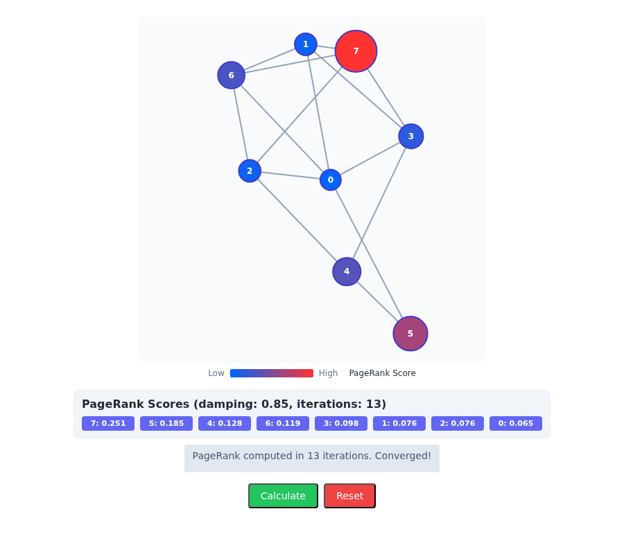
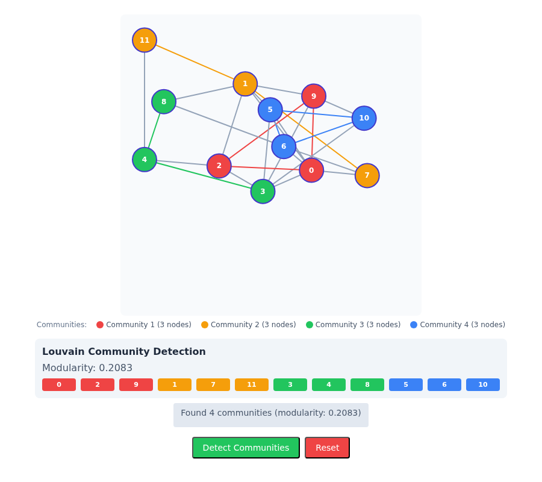
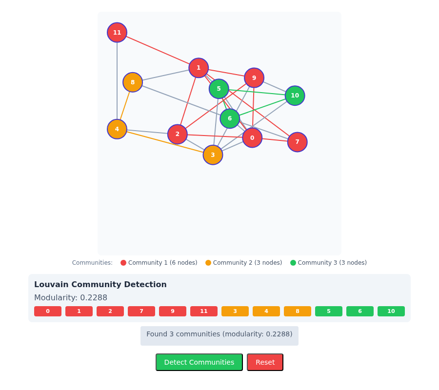

# algorithms stories: 2.x functions against the 3.0 snapshot functions

algorithms 3.0.0 removes the id-keyed functions and the `Graph` class, so every algorithms story
now freezes its generated graph into a graph-format snapshot and calls the snapshot function of
the same algorithm. This record says which story pictures that changes.

## How it was checked

Each of the 30 stories was rendered twice in happy-dom with its default arguments, and its `play`
function run to the end: once from the story source before the change against the algorithms 2.1.2
build, once from the new source against the new build. The DOM after `play` was compared as text.
28 are identical to the byte, so their pictures cannot change. Two differ; their DOMs were then
rendered in headless Chromium for the pictures below.

Flow / Ford Fulkerson (`flow--ford-fulkerson`) throws while it builds its graph, before any
algorithm runs, both before and after this change: its generator reads `nodes[j]` past the end of
the node list at the default six nodes. It is not changed here.

## Centrality / Page Rank (`centrality--page-rank`)

| Before                         | After                        |
| ------------------------------ | ---------------------------- |
|  |  |

What changed: the panel and the status line say "14 iterations" where they said 13. The scores
agree to the sixth decimal place, so the colours and node sizes are the same to the eye (node
radii differ by about 2e-6 pixels).

Why: 2.x `pageRank` ran the delta PageRank engine; 3.0 `pageRank` is the snapshot port's power
iteration, which on this graph reaches the tolerance one iteration later.

## Community / Louvain (`community--louvain`)

| Before                        | After                       |
| ----------------------------- | --------------------------- |
|  |  |

What changed: three communities (6, 3 and 3 nodes, modularity 0.2288) where there were four of
three nodes each (modularity 0.2083); node and edge colours follow.

Why: 2.x `louvain` was the old implementation; 3.0 `louvain` is the snapshot port, which visits
nodes in another seeded order and stops at another partition, here one of higher modularity.
