# graphty-element layout story changes from the snapshot layout engines

Commit `d055587d` moved graphty-element's static layout engines (arf, bfs, bipartite, circular,
grid, kamada-kawai, multipartite, planar, radial, random, shell, spectral, spiral, and the fixed
layout) off the legacy positional functions of `@graphty/layout` and onto the snapshot layouts
(`arf(snapshot, options)`, `kamadaKawai(...)`, `random(...)`, ...). This page records every
graphty-element story whose picture changed, why, and what the owner is asked to accept.
The owner has not reviewed any of it yet.

**Update (owner review of pull request 641): rejected, and restored.** The owner rejected the new
ARF and Kamada-Kawai 3D pictures. `arf` and the 3D `kamadaKawai` now draw their seeded start in
float64, as layout 1.x did, and Kamada-Kawai rescales in float64 before its one float32 rounding.
They reproduce layout 1.x's positions to the float32 rounding of the result (3e-8), and
`layout/test/layouts/legacy-start.test.ts` pins them. The analysis below records the change as it
was found.

| Story                                                                  | What you see                          | Recommended verdict |
| ---------------------------------------------------------------------- | ------------------------------------- | ------------------- |
| Layout/2D / Arf (`layout-2d--arf`)                                     | a different drawing of the same graph | accept              |
| Layout/3D / Kamada Kawai Weighted (`layout-3d--kamada-kawai-weighted`) | a different drawing of the same graph | accept              |
| Layout/3D / Kamada Kawai (`layout-3d--kamada-kawai`)                   | a few nodes shifted by about a pixel  | accept              |
| Layout/3D / Random (`layout-3d--random`)                               | 8 anti-aliased pixels                 | accept              |

Every other static layout story is unchanged, and so is every Styles, Data and Sets story. One
fixed-layout story, Styles/Layered / Label Enabled Layers, was drawn with its nodes away from their
data positions by `d055587d`; that was a defect, and it is fixed on this branch (see "Switching to
the fixed layout kept the previous layout's coordinates"). The force-directed stories
(ForceAtlas2, Spring, D3, NGraph) use engines this commit did not touch. The three GPU stories are
captured on the real GPU (see "Layout/GPU"). Three engines the commit rewrote, grid, radial and
spectral, have no story; they were compared numerically (see "Engines with no story").

visual-review's own capture now shows these stories. It used to crop each graphty-element story to
a strip with no graph in it, because it looked for content only outside the element's shadow root;
that is fixed on this branch (see "visual-review's capture of graphty-element").

## What was compared

- The integration branch `feat/graph-format-migration` at `77c84820`, the parent of `d055587d`
  (the "before"), against the integration branch at `48ff1b3a` (the "after"), which holds
  `d055587d` and every layout and element commit after it.
- All 27 stories under Layout/2D, Layout/3D and Layout/GPU with `tools/diff-stories.mjs`
  (1000x800, SwiftShader WebGL, node and camera positions read from the element), then each
  differing pair through `tools/pixel-diff.mjs` (threshold 12).
- The three GPU stories (`layout-gpu--*`) on the real GPU (an RTX 4070 SUPER through ANGLE on
  Vulkan), on 77c84820, on `d055587d` alone, and on the after build, each rendered twice.
- Every Styles, Data and Sets story (107) with `diff-stories.mjs`, because most of them use the
  fixed layout.
- Every Layout story and Label Enabled Layers, before and after, with visual-review's own capture
  (`capture --project graphty-element`, the before capture used as the baseline), once its
  capture could see the element. See "visual-review's capture of graphty-element".

## Why the four stories changed: the start and the result are now float32

The snapshot layouts keep positions in a `Float32Array`; the legacy functions kept `number`
(float64). The start positions are drawn from the same seed as before, then rounded to float32,
which moves each coordinate by at most 3e-8. That was checked by running the story's own graph
(the Les Miserables data, 77 nodes and 254 edges, `graphty-element/test/helpers/data3.json`) and
options through three calls: the legacy function as the old engine called it, the legacy function
started from the float32-rounded start, and the snapshot layout as the new engine calls it.

| Story                    | Largest node move, before to after | Legacy from the float32 start vs after        | Drawing width |
| ------------------------ | ---------------------------------- | --------------------------------------------- | ------------- |
| Arf (2D)                 | 0.961 units (96 scene units)       | 4e-8                                          | 1.20          |
| Kamada-Kawai 3D weighted | 0.632 units (32 scene units)       | 5e-8                                          | 1.70          |
| Kamada-Kawai 3D          | 1.6e-4 units (0.008 scene units)   | 5e-8                                          | 1.72          |
| Random 3D                | 4e-8 units                         | 0 (the float32 rounding of the old positions) | --            |

The scene-unit moves are what `diff-stories.mjs` read from the rendered element on each side
(96.1, 31.6, 0.0075 and under 0.001), the layout-unit moves times the engines' scaling factor
(100 for arf, 50 for Kamada-Kawai). So the algorithms did not change and the engine hands them
the same graph and options: in every case the old code, given the float32 start, reproduces the
new picture to the float32 rounding of the result.

- **Arf** never converges at the story's 1000 iterations and is chaotic on this graph: a start
  that differs by less than a pixel ends in a different drawing. It is still a valid ARF result
  for the graph. The layout package's own ARF story changed for the same reason
  ([layout story record](../layout-stories/README.md)).
- **Kamada-Kawai 3D weighted** settles in a different local minimum from the float32 start,
  0.63 units away in a drawing 1.7 wide.
- **Kamada-Kawai 3D** unweighted settles in the same minimum, a few thousandths of a scene unit
  away.
- **Random 3D** draws the same positions, rounded to float32; the rim shading of a few spheres
  changes.

The weighted Kamada-Kawai distances are the same numbers on both sides. The old engine summed the
weights of the edges between each pair of nodes and handed Floyd-Warshall `1 / sum`; the new one
builds the same `1 / sum` as an f64 edge column of the snapshot. The 2D Kamada-Kawai stories start
on the unit circle, not from a random start, and did not change.

### Arf (`layout-2d--arf`)

Before and after: the same 77-node graph, drawn differently.

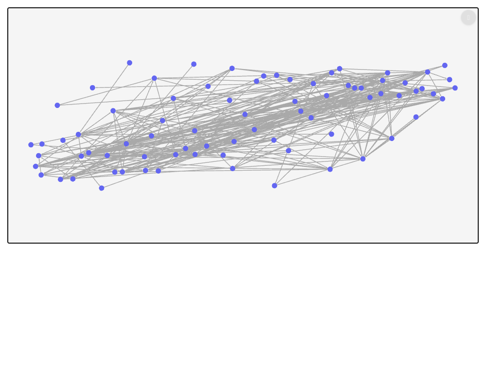
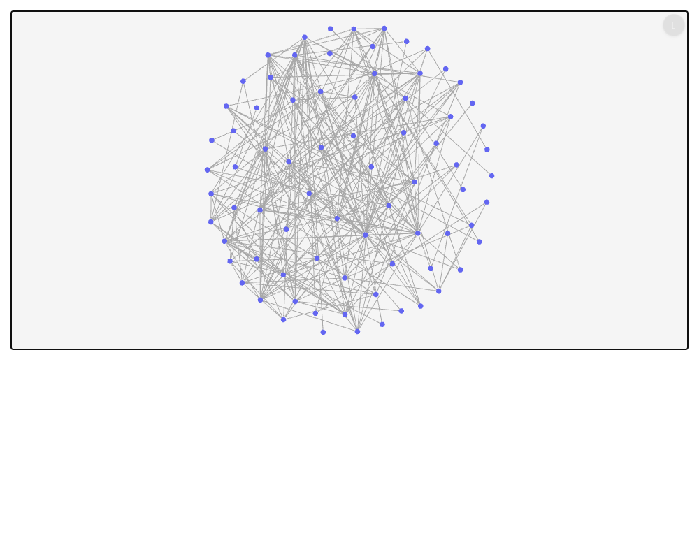

### Kamada-Kawai 3D weighted (`layout-3d--kamada-kawai-weighted`)

Before and after: the same graph, in a different local minimum.

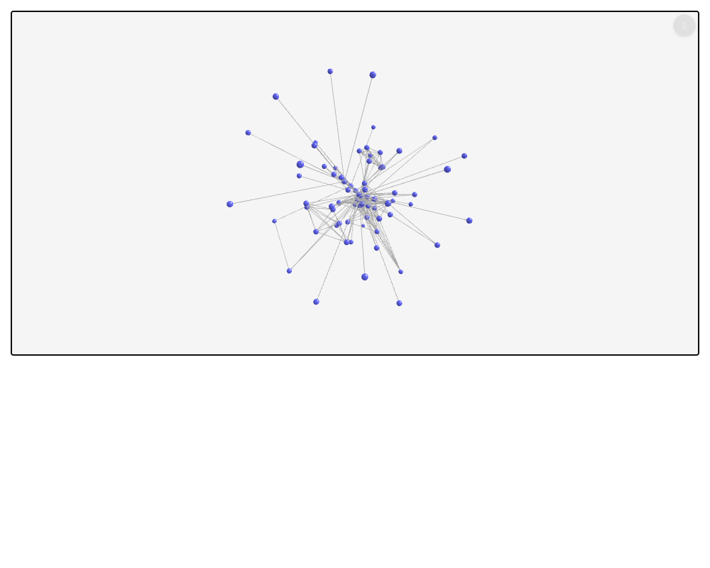
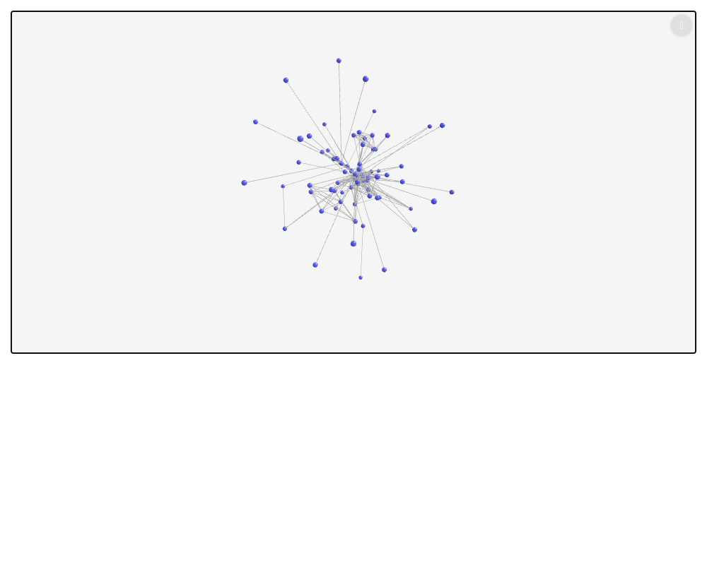

### Kamada-Kawai 3D (`layout-3d--kamada-kawai`)

Before, after, and the pixel diff (changed pixels in red), around the graph: 357 pixels, on node
rims and on edges whose ends moved by a fraction of a pixel.

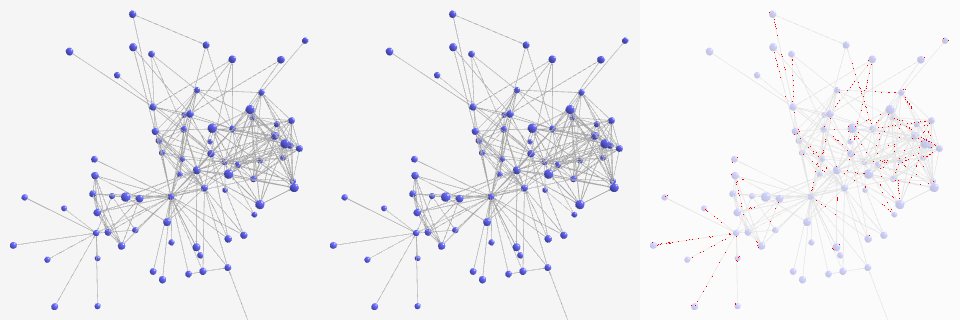

### Random 3D (`layout-3d--random`)

Before, after, and the pixel diff, 3x around the eight changed pixels.

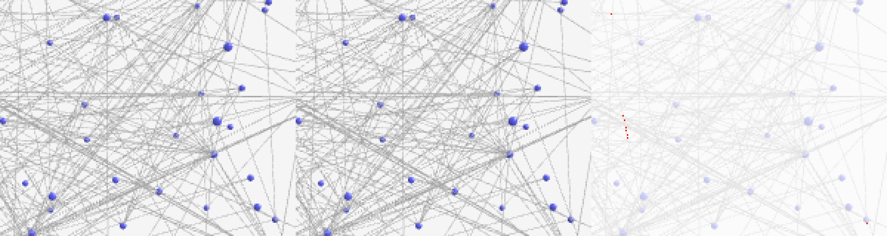

## Switching to the fixed layout kept the previous layout's coordinates

Styles/Layered / Label Enabled Layers uses the fixed layout with five nodes at data positions
(A at 0,2,0, B at -2,0,0, ...). On the build with `d055587d`, some renders drew the nodes scattered
several units from those positions (1 of 8 renders run alone, and repeatedly inside
`diff-stories.mjs` batches); on the before build every render was the intended diamond.

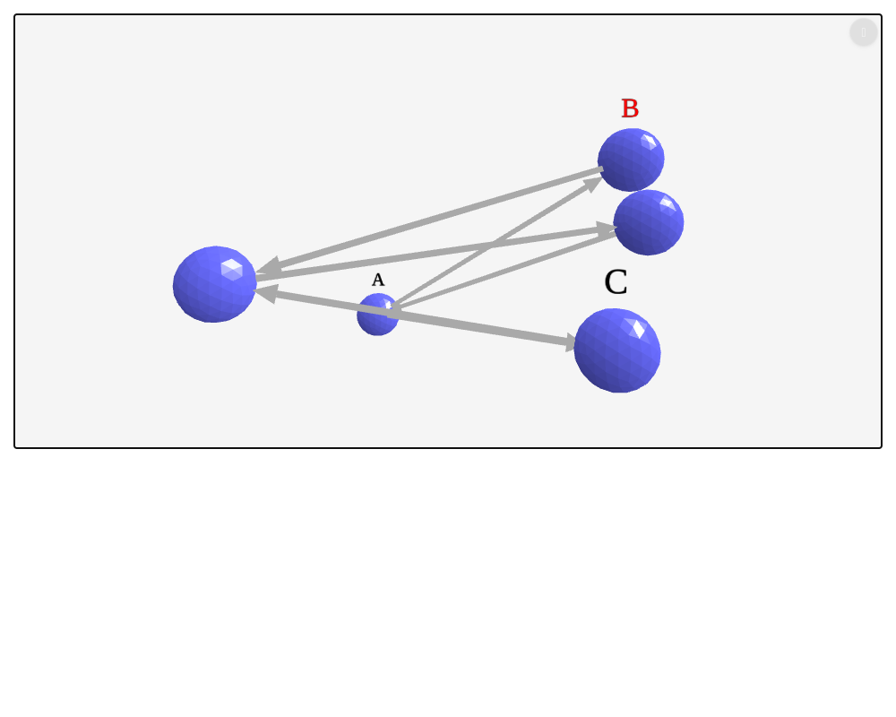
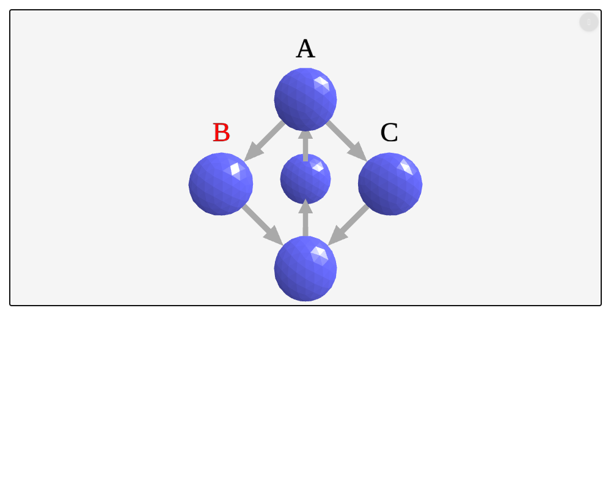

The cause was not a race in the story but a change of behaviour for every consumer. Before
`d055587d`, the fixed layout put every node at its `data.position` each time it ran. After it, the
fixed layout kept whatever the element's position array held, and a node's `data.position` reached
that array only when the node's row was still empty. So a graph that another layout had already
arranged kept that arrangement when the layout was switched to `"fixed"`: in the graphty app,
switching the layout control from ngraph to fixed always left the ngraph positions. The story hit
it only sometimes because its helper sets the data before the layout, so the default ngraph layout
runs first for as long as it takes the layout setting to arrive.

Fixed on this branch in `graphty-element/src/layout/FixedLayoutEngine.ts`: the first time a fixed
layout engine lays out, every node carrying a `data.position` goes there (scaled by
`data.knownFields.positionScale`), whatever an earlier layout left in the array. After that it keeps
the array, so a drag still survives a later recompute, which is what `d055587d` was after. A test in
`graphty-element/test/layout/pin-state.test.ts` switches from circular to fixed and checks each
node's data position, then drags a node, adds another and checks the drag held; it fails on the
unfixed engine.

On the fixed build: 8 of 8 renders of Label Enabled Layers are byte-identical to the before build,
and all 107 Styles, Data and Sets stories render the same bytes as the before build except Data /
Json, which runs ngraph, and Styles / Label Animation, whose label pulses outside Chromatic; both
of those match the before build when the two builds are rendered in the same run.

## Stories that did not change

Identical bytes before and after: Layout/2D Bfs, Bipartite, Circular, Kamada Kawai, Kamada Kawai
Weighted, Multipartite, Planar, Random, Shell, Spiral; Layout/3D Circular, Fixed, Spring,
Force Atlas 2 Weighted. Layout/3D Circular's nodes move by under 0.001 scene units (float32
rounding) and render the same bytes.

The fixed layout reads the element's position array instead of moving meshes itself. Layout/3D
Fixed renders the same bytes before and after.

## Stories that differ from run to run

Layout/2D Force Atlas 2, Force Atlas 2 Weighted and Spring, and Layout/3D D3, Force Atlas 2 and
NGraph differ between the before and after builds, but they also differ when one build is
rendered twice: the physics engines are still moving nodes when the screenshot is taken. Two
renders of the before build give different pictures for Force Atlas 2 Weighted (2D), Spring (2D),
D3, Force Atlas 2 (3D) and NGraph; two renders of the after build for Force Atlas 2 (2D), Force
Atlas 2 Weighted (2D), Spring (2D) and NGraph. None of these engines is a static engine, and
`d055587d` did not change them.

## Layout/GPU

Under SwiftShader, `diff-stories.mjs` timed out on the screenshot of these three stories on both
builds. On the real GPU each renders in about two seconds:

- **ForceAtlas2 (fake accelerator)** and **Spring (fake accelerator)**: the same bytes on 77c84820,
  on `d055587d` and on the after build, and the same bytes on every repeat. visual-review's own
  capture (SwiftShader, with its stable-frame wait) also reports both `unchanged`.
- **ForceAtlas2 (WebGPU)** runs ForceAtlas2 on the device, and is excluded from visual-review by its
  story's `disableSnapshot`. It draws one of two nearly identical pictures (the same arrangement,
  2.3% of the pixels different). Which one depends on CPU scheduling, not on the build: the story
  animates outside Chromatic, and how many device batches land before the layout settles depends
  on how the frame loop and the batch readbacks interleave. Pinned to one CPU core with `taskset -c
0`, 77c84820, `d055587d` and the after build render the same bytes, twice each.

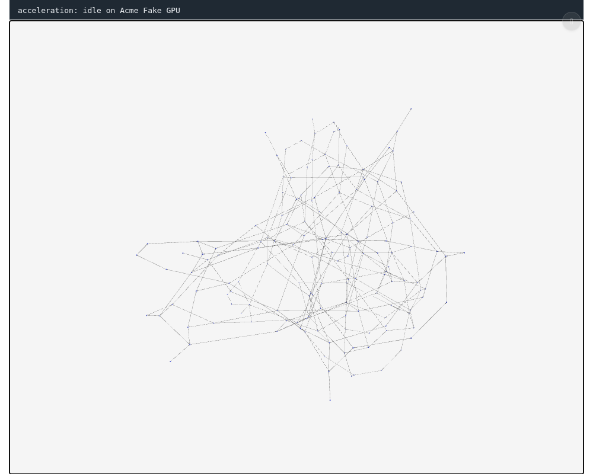
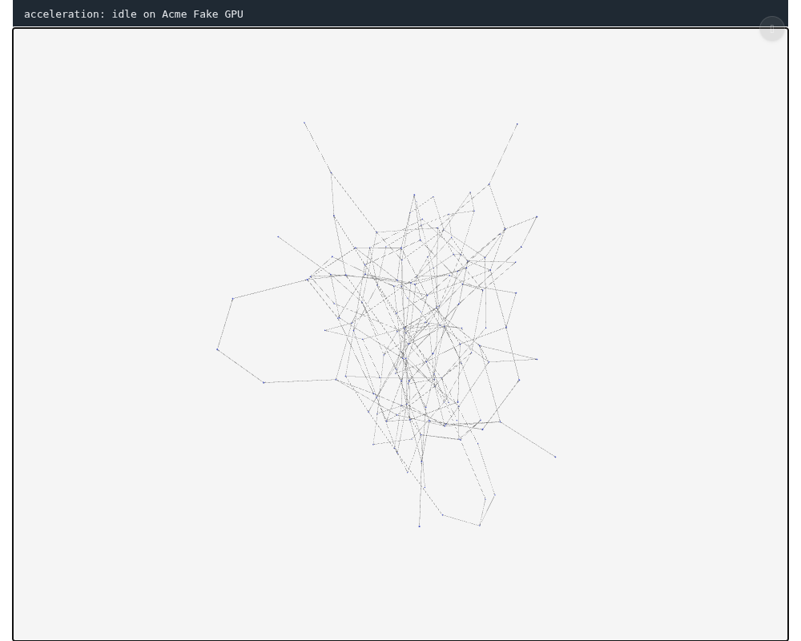
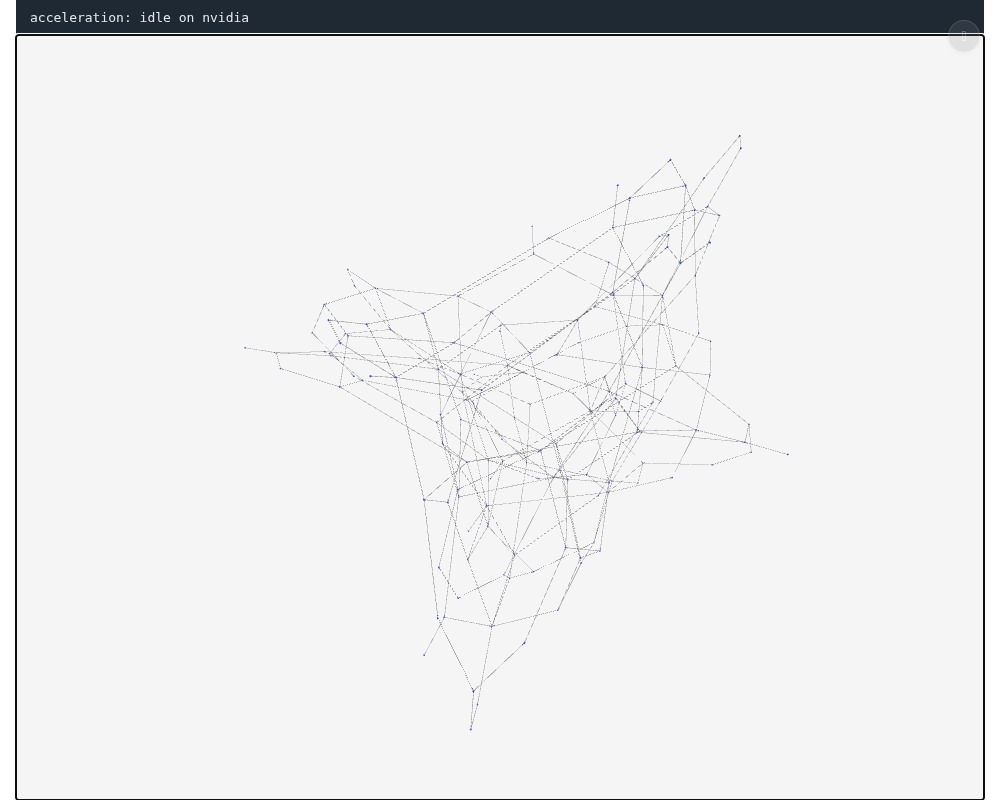


## Engines with no story

`d055587d` also rewrote the grid, radial and spectral engines, and no graphty-element story uses
them, so no capture can show them. Their layouts were compared on the same Les Miserables graph
with each engine's default options, the legacy function against the snapshot layout:

- grid: the same positions exactly.
- radial: the same positions to 3e-8 (float32 rounding).
- spectral: the same positions to 3e-8 when both are given the same seed. The engine passes no
  seed, so both the old and the new layout start power iteration from a random vector, and two runs
  of the same code draw the graph either as it is or mirrored; that was already so before this
  commit.

## visual-review's capture of graphty-element

visual-review crops each capture to the story's content. `contentClip` in
`visual-review/capture/capture.mjs` looked for that content only among ordinary child elements and
never entered a shadow root, and graphty-element draws into a canvas inside its shadow root. So 168
of the 174 element stories it captured were the same 2400x168 strip of the top of the frame with no
graph in it, and it reported Kamada-Kawai 3D and Random 3D `unchanged` because their changes fell
outside that strip. It now walks open shadow roots too; a test in
`visual-review/test/capture-run.test.mjs` crops a story whose only drawing is inside a shadow root,
and fails on the old capture.

With the fix, the element's Layout stories capture at their full height (2400x1264). Before build
as the baseline, after build captured against it: Layout/2D Arf and Layout/3D Kamada Kawai Weighted
`changed`, 24 stories `unchanged` (Kamada-Kawai 3D and Random 3D among them: their few hundred and
eight changed pixels are within visual-review's threshold), ForceAtlas2 (WebGPU) `excluded`, and
Label Enabled Layers `unchanged`. Every graphty-element capture will change once this lands, which
does not matter today: master has no graphty-element baselines yet.

## Reproducing

Build graphty-element and its Storybook on both commits (`pnpm exec nx run graphty-element:build`,
then `npx storybook build -o storybook-static` in `graphty-element/`), then:

```bash
node tools/diff-stories.mjs <before>/graphty-element/storybook-static \
    <after>/graphty-element/storybook-static layout-2d--arf layout-3d--kamada-kawai ... --out <dir>
node tools/pixel-diff.mjs <dir>/layout-2d-arf.baseline.png <dir>/layout-2d-arf.head.png
node visual-review/trusted/cli.mjs capture --project graphty-element \
    --storybook <before>/graphty-element/storybook-static --baselines <empty dir> --out <b>
node visual-review/trusted/cli.mjs capture --project graphty-element \
    --storybook <after>/graphty-element/storybook-static --baselines <b> --out <a>
```

Running `diff-stories.mjs` with the same Storybook on both sides shows which stories differ from
run to run. The GPU captures come from the same stories opened in headless Chromium with the flags
`--enable-unsafe-webgpu --enable-features=Vulkan --use-angle=vulkan --disable-vulkan-surface` and
`LD_LIBRARY_PATH` pointing at an extracted libEGL (this machine has none installed). The position figures come from a `tsx` script that imports the legacy
`kamadaKawaiLayout`, `arfLayout` and `randomLayout` from `layout/src` at `77c84820` and
`kamadaKawai`, `arf` and `random` from `layout/src` at the after commit, and compares their
results on `data3.json` with the story's options.
