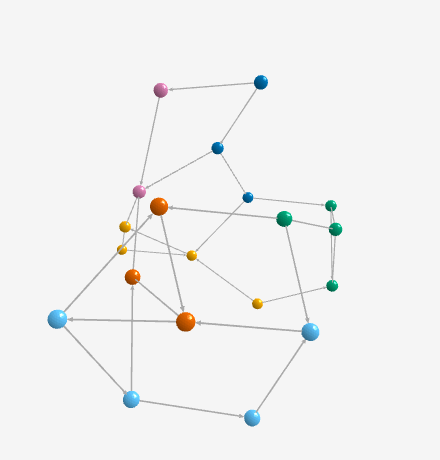
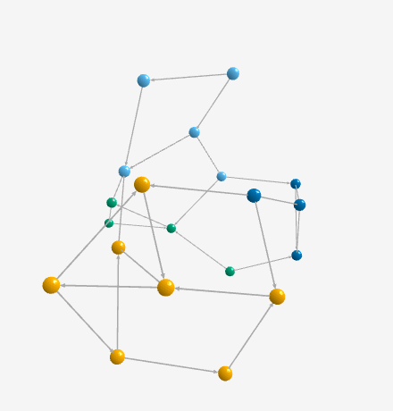
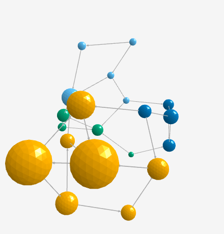
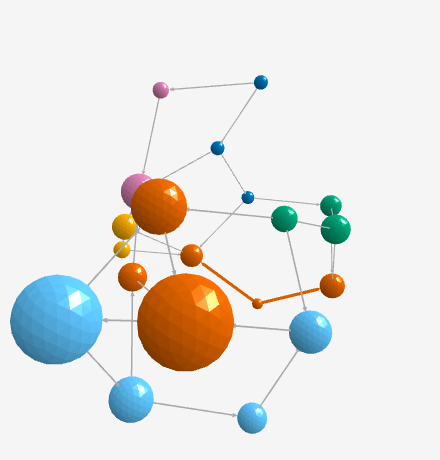
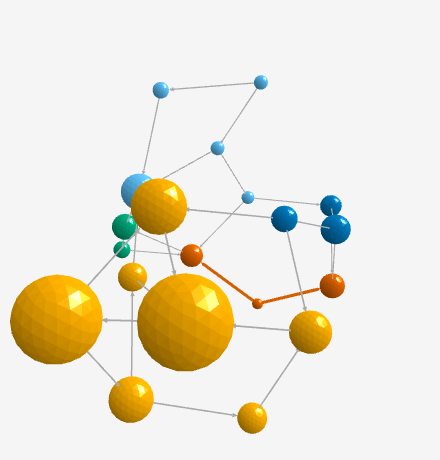

# graphty-element story changes from the HITS, Katz, k-core, Louvain and degree adapters

graphty-element's HITS, Katz, k-core, Louvain and degree algorithms used to copy the graph into a
legacy `@graphty/algorithms` `Graph` and call the legacy function on it. They now run over the
graph snapshot: the first four through the algorithms dispatcher, degree by counting the
snapshot's edges. This page records every graphty-element story whose picture changed, why, and
what the owner is asked to accept. The owner has not reviewed any of it yet.

| Story                                                                                                      | What you see                            | Recommended verdict |
| ---------------------------------------------------------------------------------------------------------- | --------------------------------------- | ------------------- |
| Algorithms/Community / Louvain (`algorithms-community--louvain`)                                           | four community colours where six were   | accept              |
| Algorithms/Combined / Centrality Vs Community (`algorithms-combined--centrality-vs-community`)             | the same change, under PageRank's sizes | accept              |
| Algorithms/Combined / Community Structure With Path (`algorithms-combined--community-structure-with-path`) | the same change, under the path         | accept              |

Every other story that runs one of the five algorithms is byte-identical before and after:
Algorithms/Centrality Degree, HITS and Katz; Algorithms/Community K Core, Leiden and Louvain More
Communities Than Colours; Algorithms/Combined Degree And Page Rank; Sets/Kept Sets Keep A
Community.

## What was compared

- Before: the integration branch `feat/graph-format-migration` at `48ff1b3a`, the parent of the
  merge that brought the adapters in. After: this branch, with the adapters.
- The eleven stories above with `tools/diff-stories.mjs` (1000x800, SwiftShader WebGL, node and
  camera positions read from the element), each differing pair through `tools/pixel-diff.mjs`.
- No node moved and the camera did not move in any of the three changed stories (largest node
  move 0, camera move 0). `pixel-diff.mjs` reads each change as local: only node colours changed.

## Why the colours changed: Louvain finds a better partition

The cat network (20 nodes, 29 edges) is the data every algorithm story loads. The legacy `louvain`
function stops in a local optimum there; the snapshot port keeps moving nodes and merging
groups until modularity stops rising, and lands on four communities.

Scored by one function (`indexed.modularity`, over the same undirected snapshot the run reads,
edges unweighted), the port's four-community partition has modularity 0.462, and the partition
the legacy function returns has 0.402. A higher modularity is the better answer to the question
Louvain asks, so the new picture is the more correct one. The Leiden story, which also maximises
modularity, already drew these four communities, so the Leiden story no longer asserts that its
colours differ from Louvain's.

The Combined stories apply Louvain last, so Louvain's colours are the ones they show; their
sizes (PageRank) and the highlighted path (Dijkstra) are unchanged.

## Captures

Louvain, before and after:

 

Centrality Vs Community, before and after:

Community Structure With Path, before and after:

