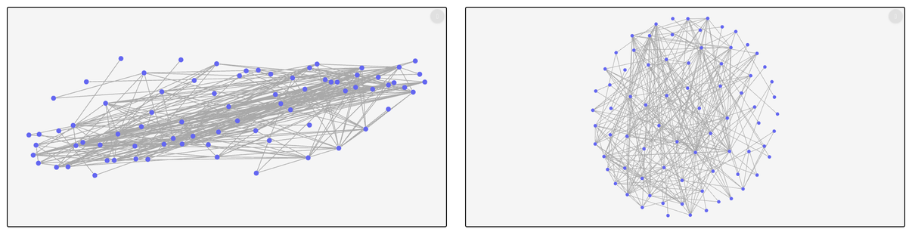
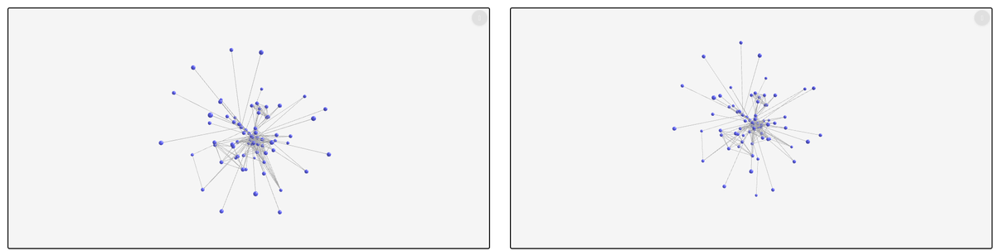
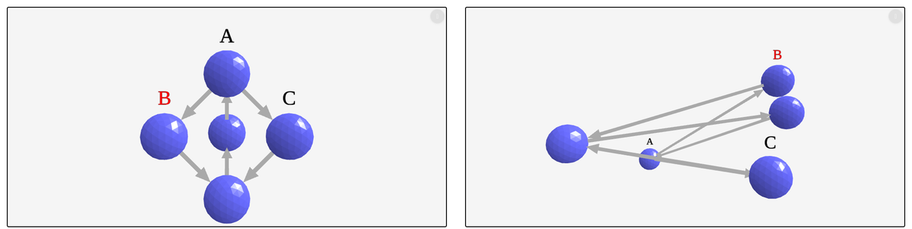
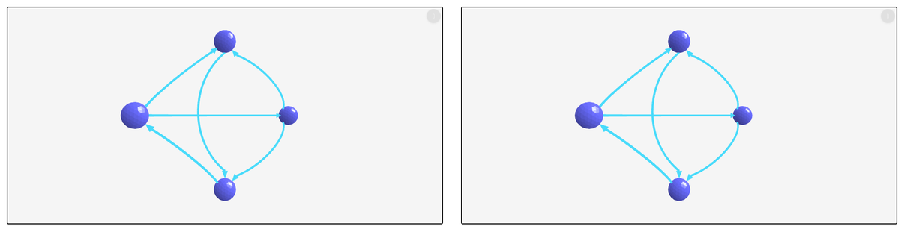

# graphty-element story changes across the graph-format migration

The graph-format migration moved graphty-element's algorithm adapters, static layout engines, data
sources and edge store onto `@graphty/graph-format` snapshots ([the migration plan](../../migration-plan.md)).
This page lists every graphty-element story whose picture differs between the start of the
migration and the integration branch, says why, and asks the owner for a verdict on each. The
owner has not reviewed any of it yet.

The layout stories are also recorded, with the same conclusions, in
[element-layout-stories](../element-layout-stories/README.md). This page covers every element story
and supersedes that page's table; that page keeps its captures on a real GPU and its numeric check
of the three layout engines no story uses.

| Story                                                                          | What changed                                         | Recommended verdict |
| ------------------------------------------------------------------------------ | ---------------------------------------------------- | ------------------- |
| Layout/2D / Arf (`layout-2d--arf`)                                             | a different drawing of the same graph                | accept              |
| Layout/3D / Kamada Kawai Weighted (`layout-3d--kamada-kawai-weighted`)         | a different drawing of the same graph                | accept              |
| Layout/3D / Kamada Kawai (`layout-3d--kamada-kawai`)                           | 357 pixels on node rims, nodes move under 0.01 units | accept              |
| Layout/3D / Random (`layout-3d--random`)                                       | 8 anti-aliased pixels                                | accept              |
| Styles/Layered / Label Enabled Layers (`styles-layered--label-enabled-layers`) | some renders scattered the nodes; fixed, see below   | none: unchanged now |

Every other story draws the same settled picture on both sides, except the two fake-accelerator
GPU stories, which could not be screenshotted on either build and were compared by node position
only. Parallel edges are drawn exactly as before (see "Parallel edges").

## What was compared

- Before: `master` at `9fc948ee`, whose packages match the migration's starting point `5861d655`
  (the two differ only in release version numbers and changelogs).
- After: the integration branch `feat/graph-format-migration` at `48ff1b3a`.
- All 178 graphty-element stories, both sides, with `tools/diff-stories.mjs` (1000x800 full
  frame, SwiftShader WebGL, node and camera positions read from the element) and each differing
  pair through `tools/pixel-diff.mjs`. 164 stories render identical bytes. The 12 that differ were
  rendered again: twice more on the same build (to find the stories that differ from one render
  to the next), and once on both sides after 15 seconds instead of 4.5 (to see the settled
  picture). Node positions were then read from the element on both sides.
- The two fake-accelerator GPU stories (`layout-gpu--force-atlas-2-fake`,
  `layout-gpu--spring-fake`) time out on the screenshot on both builds. Their node positions,
  read after 30 seconds, are identical on both sides (150 nodes, largest difference 0).
- visual-review's own capture (`capture --project graphty-element`) was run too, but it cannot
  show these changes: it crops each capture to the page content it finds in the light DOM, the
  element draws into a canvas inside its shadow root, and so 168 of its 174 captures are the same
  2400x168 strip of the top of the frame with no graph in it. It reported one story changed (Arf,
  whose strip happens to reach the top nodes).

## Why Arf and the Kamada-Kawai 3D stories changed: float32 positions and, for Arf, a new start

The layout engines now call the snapshot layouts (`arf`, `kamadaKawai`, `random`), which keep
positions in a `Float32Array`; the legacy functions kept float64. Same graph, same options:
the ARF story on both builds hands the engine `{ scaling: 1, a: 1.1, maxIter: 1000, seed: 12 }`
over the same 77 nodes and 254 edges in the same order, and the Kamada-Kawai stories the same
weights (`value`, 1 to 31) and options.

- **Kamada-Kawai 3D weighted.** The start is drawn from the same seed (42) as before, then rounded
  to float32. The legacy `kamadaKawaiLayout`, started from that rounded start, reproduces the new
  positions to 5e-8. The weighted solve is sensitive enough that this rounding moves nodes up to
  0.63 layout units (32 scene units): changing one ideal distance by one part in 1e12 already
  moves nodes 0.14. The distance matrix itself is unchanged: the legacy Floyd-Warshall matrix,
  handed to the new layout, gives the same new picture.
- **Kamada-Kawai 3D** (unweighted) lands in the same minimum; nodes move by 0.007 scene units.
- **Random 3D**: the same positions rounded to float32 (largest move 9e-6 scene units).
- **Arf** never converges on this graph: after the story's 1000 iterations the summed force is
  still about 27000 (the stopping tolerance is 1e-6), and the iteration is chaotic. Moving one
  start coordinate by 1e-12 moves nodes by 1.07 units, where the nodes lie about 0.3 units from their centre on average. The new
  layout also draws its start from the layout package's shared seeding rather than the legacy
  `randomLayout`, so the two sides start from different points and end in different drawings. Both
  are what ARF gives for these options; neither is more correct. The before drawing is a band 4.3
  times longer than it is wide, the after drawing a disc.





## The fixed layout ignored data positions once another layout had run (fixed)

Styles/Layered / Label Enabled Layers places five nodes at fixed data positions (a diamond). On
the integration branch 1 of 5 renders drew them scattered, up to 7.3 units from their data
positions; before the migration 0 of 5 did.



The cause was deterministic, and wider than this story. The migration changed the fixed layout
to keep whatever the element's shared position array already held for a node, instead of moving
every node to its `data.position` as it did before. The array is seeded from `data.position` only
for a row no layout has placed yet, so a node another layout had already placed stayed where that
layout put it:

- The story: the element's default layout (ngraph) sometimes wrote its first positions before the
  story's `layout: "fixed"` took effect.
- Any graph switched from another layout to `fixed` at runtime stayed in the old layout's shape.

graphty-element's fixed layout now works like this:

- The first time a fixed layout engine lays out, every node that has a `data.position` goes there
  (scaled by `data.knownFields.positionScale`), whatever an earlier layout left in the array.
  Switching to `fixed` therefore always means "put the nodes where the data says".
- Later runs keep what the array holds, so a node the reader dragged stays where it was dropped
  when the layout recomputes (for example because a node was added).
- A node added later is seeded from its own `data.position` when it arrives.
- A node with no coordinates at all goes to the origin.
- A `data.position` changed on a node that is already placed does not move it on a later run.

A test in `graphty-element/test/layout/pin-state.test.ts` switches from the circular layout to
the fixed one and checks every node's data position, then drags a node, adds another and checks
that the drag held. With this behaviour 8 of 8 renders of the story are byte-identical to the
before build ([element-layout-stories](../element-layout-stories/README.md), "Switching to the
fixed layout kept the previous layout's coordinates"), so the story no longer differs from before
the migration. `probes/fixed-probe.mjs` reports the largest distance of any node from its data
position over repeated loads of the story; on a Storybook built from the integration branch after
the undo work merged, 8 of 8 loads put all five nodes exactly on their data positions (largest
distance 0).

## Stories that differ only while they are still moving

At a fixed 4.5 seconds, Data / Json, Data / Modified Json, Layout/3D / NGraph, Layout/2D / Force
Atlas 2 and Layout/2D / Force Atlas 2 Weighted differ between the builds, with nodes up to 24 scene
units apart: the force layouts had not finished. After 15 seconds both builds render identical
bytes for all five, and the node positions read from the element are identical. visual-review
waits for a stable frame, so it compares the settled pictures.

Two stories differ between two renders of the same build and say nothing about the migration:
Styles/Label / Animation (an animated label) and Performance/Large Graph / Physics 250 (a live
simulation, excluded from visual-review by its `disableSnapshot`).

## Parallel edges

The element draws parallel edges on top of each other: `Edge.parallelRank` and
`Edge.parallelCount` exist for style layers, and no renderer offsets or curves an edge by them.
The data-layer change moved both from the deleted `EdgeMap` onto the store
(`DataManager.getEdgesBetween`).

- No story holds two edges between the same ordered pair of nodes, on either build (every edge
  of all 178 stories was checked for `parallelCount > 1`, with `probes/parallel-probe.mjs`).
- So three edge stories were given parallel edges on both builds: two more copies of their first
  edge, added through `graph.addEdges`. Styles/Edge / Default (straight), Styles/Edge / Bezier
  (curved) and Styles/Edge / Bidirectional each hold one group of three. Every edge of each group
  has the same rank (0, 1, 2), count (3) and mesh bounding box on both builds, and within a group
  the three meshes coincide, as before (`probes/parallel-probe.mjs --add`).
- Rank and count are guarded by `graphty-element/test/unit/edge-identity.test.ts` and
  `graphty-element/test/browser/parallel-edges.test.ts`. The coinciding meshes are not pinned by a
  test: there is no offset to keep unchanged, and pinning edges drawn on top of each other would
  lock in what the element is expected to change.



## Reproducing

Build graphty-element and its Storybook on both commits (`pnpm exec nx run graphty-element:build`,
then `npx storybook build -o storybook-static` in `graphty-element/`), then, from the repository
root:

```bash
node tools/diff-stories.mjs <before>/graphty-element/storybook-static \
    <after>/graphty-element/storybook-static <story-id> [...] --out <dir> [--settle 15000]
node tools/pixel-diff.mjs <dir>/<story>.baseline.png <dir>/<story>.head.png
```

The two probes in `probes/` run against built Storybooks the same way:

```bash
# parallel edges in every story, and with two copies of the first edge added to three stories
node design/graph-format/visual-changes/element-stories/probes/parallel-probe.mjs \
    <before>/graphty-element/storybook-static <after>/graphty-element/storybook-static \
    [--add styles-edge--default,styles-edge--bezier,styles-edge--bidirectional]
# the largest distance of any node from its data.position, over repeated loads of one story
node design/graph-format/visual-changes/element-stories/probes/fixed-probe.mjs \
    <after>/graphty-element/storybook-static styles-layered--label-enabled-layers 10
```
