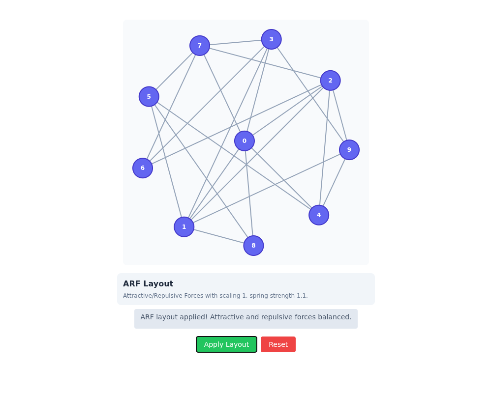
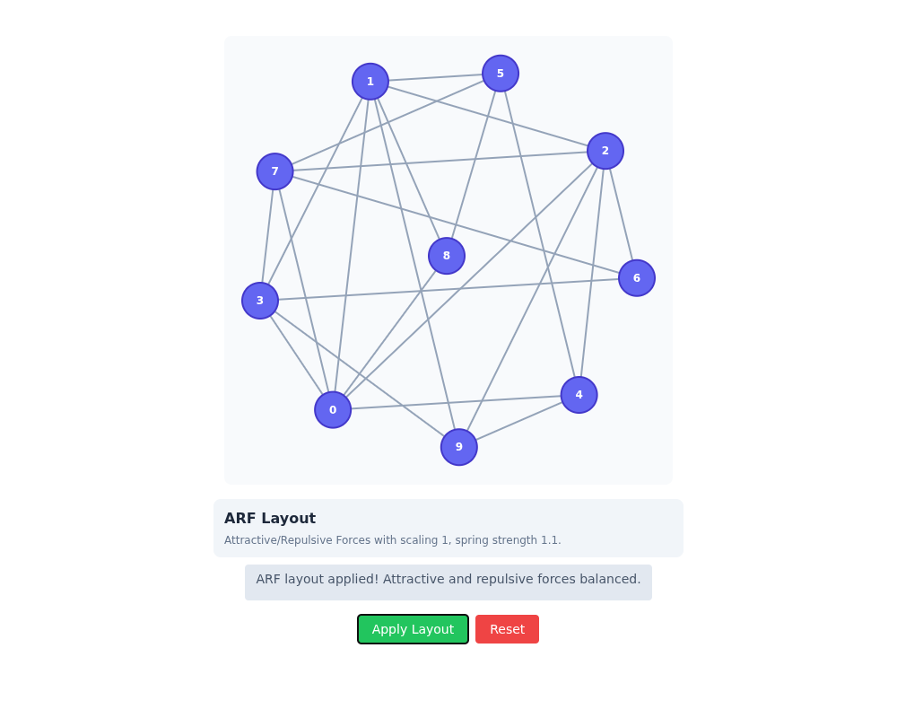
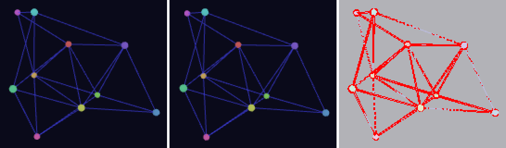
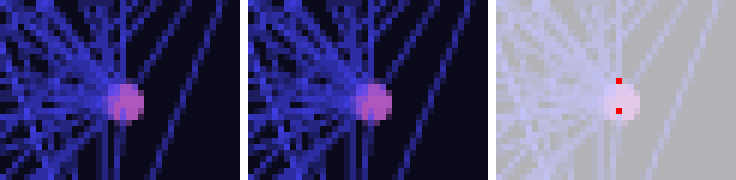

# Layout story changes since master

Layout's Storybook stories changed in two steps of the graph-format migration
([the migration plan](../../migration-plan.md)):

1. **Phase 5 -- layout**: the legacy functions (`bfsLayout`, `planarLayout`, `springLayout`, ...)
   started running on the `indexed.*` layouts over a graph-format snapshot.
2. **layout 2.0**: commit `45ded070` removed the legacy functions and rewrote all 17 stories onto
   the snapshot layouts (`arf(snapshot, options)`, `kamadaKawai(...)`, `circular(...)`, ...).

This page records every story whose picture differs from master, why, and what the owner is asked
to accept. The owner has not reviewed any of it yet.

| Story                                                     | Changed by | What you see                          | Recommended verdict |
| --------------------------------------------------------- | ---------- | ------------------------------------- | ------------------- |
| Layout2D / ARF (`layout2d--arf`)                          | layout 2.0 | a different drawing of the same graph | accept              |
| Layout3D / Kamada-Kawai 3D (`layout3d--kamada-kawai-3-d`) | layout 2.0 | every node shifted by 1 to 3 px       | accept              |
| Layout3D / Spherical (`layout3d--spherical`)              | layout 2.0 | 5 anti-aliased pixels                 | accept              |
| Layout3D / Spring 3D (`layout3d--spring-3-d`)             | phase 5    | 4 anti-aliased pixels                 | accept              |

The other 13 stories are unchanged at their default arguments. BFS changes under some
non-default arguments (see "Stories that did not change" in part 1).

layout is a visual-review project on the integration branch (`visual-review/projects.json`, and
the `layout` entry of the visual-review job in `.github/workflows/ci.yml`), but master has no
layout baselines yet, so no pull request can show these as diffs against master. Every layout
story arrives there as `new` or `no baseline yet`. These captures stand in until the owner seeds
layout's baselines; each change below must still be accepted on the visual-review page of the
pull request that first captures layout.

## Part 2: layout 2.0 (commit `45ded070`)

### What was compared

- The integration branch at `77c84820` (end of phase 5, the "before") against this branch (the
  "after"), which holds `45ded070` and every layout commit after it.
- All 17 stories at their default arguments, with visual-review's own capture (`capture
--project layout`, two captures per story), the before capture used as the baseline, at
  visual-review's default threshold: 14 `unchanged`, 3 `changed`, none flaky.
- The same 17 stories with `tools/diff-stories.mjs` (1000x800) and `tools/pixel-diff.mjs`
  (threshold 12): the same three differ above the threshold. Nine others differ by at most 6
  levels in one channel (at most 12 for Spring), below every threshold.
- Diffing master's `diff-stories.mjs` captures against this branch gives the same four stories as
  the table above and nothing else.

### Why ARF and Kamada-Kawai 3D moved: the start is now float32

`arf` and the 3D `kamadaKawai` start from the same seeded random positions as before (the same
draws for seed 42), but the snapshot layouts keep the start in a `Float32Array`, where the old
functions kept `number` (float64). Rounding a start coordinate to float32 moves it by at most
3e-8. That was checked directly: the old `arfLayout` and `kamadaKawaiLayout`, run from the
float32-rounded start, reproduce the new positions to within 4e-8, the float32 rounding of the
result. So the algorithms did not change; the start did, by less than a pixel, and both layouts
carry that difference to a different place:

- **ARF** never converges at the story's 1000 iterations (its stop rule is a total force under
  1e-6), and it is chaotic here: the old and new runs agree to 1e-7 for the first 200 iterations
  and have split by 0.036 layout units (16% of the drawing) by iteration 400. Every graph type in
  the story's controls moves by 15 to 17% of the drawing, so the ARF drawing a reader sees under
  any controls is different from 1.x. It is still a valid ARF result for the graph.
- **Kamada-Kawai 3D** settles in a slightly different local minimum: the largest node move is
  0.016 units in a drawing 1.75 wide, which the story's scale 1 draws as 1 to 3 px. Under the
  other graph types it moves from 3e-8 (cycle) to 1e-3 (path) of the drawing.

**Kamada-Kawai 2D** does not change: it starts on the unit circle as before, and every graph type
in its controls moves by under 5e-8 of the drawing. The documented 2.0 result changes of
`kamadaKawai` (a zero edge weight is a zero distance, unreachable pairs get 1e6) do not reach the
stories: they hand the layouts no edge weights, and the default random graph is connected.

#### ARF (`layout2d--arf`)

Before and after: the same 10-node random graph (seed 42), drawn differently.




#### Kamada-Kawai 3D (`layout3d--kamada-kawai-3-d`)

Before, after, and the pixel diff (changed pixels in red), 3x around the graph:



Full frames: [before](kamada-kawai-3d-before.png), [after](kamada-kawai-3d-after.png).

### Spherical (`layout3d--spherical`): float32 output

`circular(..., { dim: 3 })` returns float32 positions where `circularLayout` returned float64.
The story's 20 nodes on a sphere of radius 200 move by at most 7e-6 units, exactly the float32
rounding of the old positions. Five pixels on the rims of node spheres change shade (visual-review
counts one over its threshold). Nothing moves visibly.



### Reproducing part 2

The position figures come from three scripts run with `tsx` against `layout/src` and the layout
build of `77c84820`: the before-vs-after node moves of each story call, the same with the old
code started from the float32-rounded start, and a sweep over each story's graph types. The
captures come from `visual-review/trusted/cli.mjs capture --project layout` and
`tools/diff-stories.mjs` on the two Storybook builds, as in part 1's "Reproducing".

## Part 1: phase 5 (the legacy functions on the indexed layouts)

### What was compared

- master at `9fc948ee` against the integration branch `feat/graph-format-migration` at `77c84820`.
- All 17 layout stories at their default arguments, captured with visual-review's own capture
  (`visual-review/trusted/cli.mjs capture --project layout`, 1200x900, two captures per story),
  master's capture used as the baseline, at visual-review's default threshold.
- Result: 16 `unchanged`, 1 `changed`. No story was flaky; master captured twice gives identical
  bytes for every story.

### The one changed story: Layout3D / Spring 3D (`layout3d--spring-3-d`)

Four pixels differ, all on the anti-aliased rim of three node dots (at 572,279, 640,294-295 and
708,301); visual-review counts one of them over its threshold. Nothing moves visibly.


Full frames: [master](spring-3d-master.png), [branch](spring-3d-branch.png).

Why: `springLayout` now runs `indexed.fruchtermanReingold`, which keeps positions as float32
values, where the old loop kept float64. With the story's arguments (random graph, 10 nodes, seed
42, 50 iterations, scale 200) the largest node move is 2e-4 of a unit, a fraction of a pixel,
which shifts the rim shading of three dots. The seeding change for nodes missing from `pos` does
not apply here: the story passes no `pos`, and with no `pos` the start positions are drawn as
before. The 2D Spring story moves by 3.5e-5 of a unit and stays under the threshold.

### Stories that did not change, and why

- **BFS** and **Planar**: `bfsLayout` and `planarLayout` now visit neighbours in node order. The
  default graph of both stories is a tree, on which the old order and node order agree, so the
  layout is identical. visual-review captures default arguments only, so it will never show the
  two cases below, where a reader who changes the BFS story's controls does see nodes move:
    - graph type "random": nodes trade places within a layer, up to 1.6 units (about 320 px) at the
      story's other defaults ([overlay](bfs-random.svg)).
    - graph type "cycle" with the start node moved off 0: for each node count and seed, one start
      node puts the two branches of the cycle on swapped sides, a move of 0.2 to 1.0 units (at 10
      nodes, seed 42, start node 9: [overlay](bfs-cycle.svg)).

    In each overlay a grey ring is master's position, a blue dot the branch's, and a red dashed line
    a node's move. The other graph types (tree, grid, complete, star, path) give identical positions
    for every start node, checked over 4 to 20 nodes and 20 seeds. Planar's graph
    types (tree, grid, cycle, path, star) give identical positions, and so do bipartite and
    multipartite graphs.

- **Kamada-Kawai** (2D and 3D): `kamadaKawaiLayout` keeps its previous code.
- **Shell**: positions are identical; the `diff-stories.mjs` capture differs in 47 pixels by at most 3 levels of
  one channel, below every threshold.
- **Force Atlas 2** (2D and 3D), **ARF**, **Bipartite**, **Circular**, **Multipartite**,
  **Random**, **Spectral**, **Spherical**, **Spiral**: identical bytes.

### Reproducing part 1

Build layout and its Storybook on both commits (`pnpm exec nx run layout:build`, then
`npx storybook build -o storybook-static` in `layout/`), then:

```bash
node visual-review/trusted/cli.mjs capture --project layout \
    --storybook <master>/layout/storybook-static --baselines <empty dir> --out <m>
node visual-review/trusted/cli.mjs capture --project layout \
    --storybook <branch>/layout/storybook-static --baselines <m> --out <b>
```

This uses the `layout` entry in `visual-review/projects.json`. `tools/diff-stories.mjs` and `tools/pixel-diff.mjs` give the same verdict at 1000x800.
