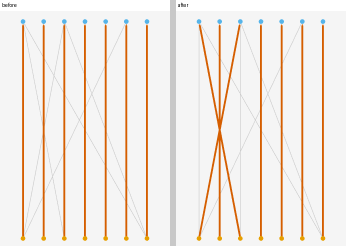
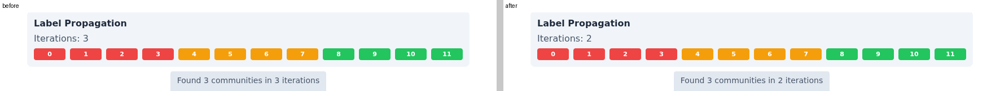
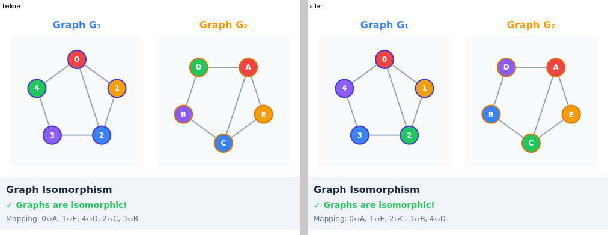

# Every story before and after the graph-format migration

This page compares every story of the graphty-element, layout, graphty app and algorithms
Storybooks between master before the migration and the integration branch
`feat/graph-format-migration` with every migration work item merged. It lists what differs, why,
and whether master already has it. The owner has not reviewed any of it yet; the summary table is
in [the visual-changes index](../README.md).

## What was compared

Three builds, each with every package built from source and each Storybook built with
`npx storybook build`:

- **Before the migration**: master at `db0c83b5`, the commit just before pull request #587 merged
  the first half of the migration into master.
- **Master now**: master at `622e88e6` (2026-09-29). Its package code is the same as at the #587
  merge, `719c506d`; the three commits after it change only visual-review tooling.
- **After**: the integration branch at `76bfc5f2`, with the flow, matching and link adapters, the
  DOT, GML and Pajek sources, the plugin snapshot accessor, the snapshot layout contract, the
  format writers, the data-source extension point, the undo work of pull request #553 and the
  algorithms 3.0 removal all merged.

Every story present in both builds was rendered on both sides with `tools/diff-stories.mjs`
(1000x800, SwiftShader WebGL, 4.5 seconds, node and camera positions read from the element), and
every pair whose bytes differ went through `tools/pixel-diff.mjs` (a pixel counts as changed above
a per-channel difference of 12). Every differing graphty-element story was rendered again after 15
seconds, and Force Atlas 2 Weighted once more after 30 seconds, to separate a force layout that
had not finished from a real change. A story that differed was also rendered twice on the same
build, to find the stories that differ from one render to the next.

| Storybook       | Stories | Differ from before the migration | Differ from master now | Vary between two renders of one build |
| --------------- | ------- | -------------------------------- | ---------------------- | ------------------------------------- |
| graphty-element | 189     | 8                                | 4                      | 2                                     |
| layout          | 17      | 4                                | 0                      | 0                                     |
| graphty app     | 76      | 0                                | 0                      | 0                                     |
| algorithms      | 30      | 5                                | 4                      | 2                                     |

No story was added or removed on either side. The graphty app's 76 stories render identical bytes
on all three builds.

## graphty-element

Differ from before the migration, after the force layouts settled:

| Story                                               | Pixels | On master now | Record                                                                      |
| --------------------------------------------------- | ------ | ------------- | --------------------------------------------------------------------------- |
| Layout/2D / Arf                                     | 126340 | yes           | [element-stories](../element-stories/README.md)                             |
| Layout/3D / Kamada Kawai Weighted                   | 16642  | yes           | [element-stories](../element-stories/README.md)                             |
| Layout/3D / Kamada Kawai                            | 357    | yes           | [element-stories](../element-stories/README.md)                             |
| Layout/3D / Random                                  | 8      | yes           | [element-stories](../element-stories/README.md)                             |
| Algorithms/Community / Louvain                      | 3550   | no            | [element-shipped-port-adapters](../element-shipped-port-adapters/README.md) |
| Algorithms/Combined / Centrality Vs Community       | 25721  | no            | [element-shipped-port-adapters](../element-shipped-port-adapters/README.md) |
| Algorithms/Combined / Community Structure With Path | 24682  | no            | [element-shipped-port-adapters](../element-shipped-port-adapters/README.md) |
| Algorithms/Flow / Bipartite Matching                | 7335   | no            | this page                                                                   |

The pixel counts are the same as in the earlier records for all seven recorded stories.

At 4.5 seconds Data / Json, Data / Modified Json, Layout/3D / NGraph, Layout/2D / Force Atlas 2,
Layout/2D / Force Atlas 2 Weighted and Layout/2D / Spring also differ, with nodes up to 105 scene
units apart; after 15 seconds (30 for Force Atlas 2 Weighted) both sides render identical bytes.
Styles/Label / Animation (an animated label) and Performance/Large Graph / Physics 250 (a live
simulation) differ between two renders of the same build and say nothing about the migration.

### Algorithms/Flow / Bipartite Matching: two pairs swap partners



The story matches seven candidates to seven positions. Both builds find a matching of seven
pairs; four edge flags differ, read from the run on each build: before, alice was matched with
senior_dev and carol with backend; after, alice is matched with backend and carol with
senior_dev. Both are maximum matchings of the same size. The element now runs the matching port,
which visits nodes in index order and, by default, ignores the direction of an edge, so it settles
on the other of two equally good answers. This is one of the three accepted matching and
isomorphism result differences of the 2026-09-28 owner decisions.

### Result changes that no graphty-element story shows

The algorithm results themselves were read on both builds (`probes/results-probe.mjs`: every
algorithm run of every `algorithms-` story, its status, its graph values and every node's and
edge's values; the runs of the two builds are paired by algorithm and by their place among that
algorithm's runs, and a run on one side only or a status that differs is reported). Every run
succeeded on both builds and no story gained or lost a run. Combined Edge Flow runs no algorithm on
either build (it colours edges by their `value`), and Palette Picker holds no graph. Apart from
Louvain and the matching above, the only differences are in the last one or two digits of a float
(PageRank, betweenness, eigenvector, HITS, link-prediction scores), too small to move a colour or
a size. Every node and edge value of Label Propagation, Floyd Warshall, Prim, Bellman Ford, SCC,
Max Flow and Min Cut is identical.

The algorithm stories load the cat network: 20 nodes and 29 directed edges, with no self-loop, no
parallel edge and no reciprocal pair, each edge weighing its `value` (1 to 10). What each recorded
result change does, and why it leaves its story unchanged:

- **Label propagation.** The port uses a work queue instead of full sweeps, a uniform tie draw and
  another random generator, so the same seed can give other communities on a graph with more than
  one valid partition. On the cat network the port reaches the same communities as the legacy
  function for the story's seed.
- **Floyd-Warshall.** The cheapest of several parallel edges now sets the distance (the last one
  added did), and a positive self-loop no longer overwrites a node's distance to itself, so
  eccentricity, diameter and radius change on graphs with either. The cat network has neither.
- **PageRank and strongly connected components.** The ports read a graph loaded undirected as
  edges both ways. The stories load the cat network with the element's default
  `directed: "auto"`, which is directed, so the undirected reading never runs. The PageRank
  values differ only in the last digit.
- **Prim and Bellman-Ford.** The ports break a tie between equally cheap edges by edge index and
  relax arcs in row order; the old code used its heap's insertion order and edge order. Both
  builds flag the same edges, with the same tree weight (84) and the same route cost (11), because
  the `value` weights leave no tie that the two orders settle differently. An earlier version of
  the index said 8 of the 29 Prim edge flags change on the cat network; that count is for every
  edge weighing 1. `probes/prim-ties.mjs` runs the 2.x `primMST` and the 3.0 port on the cat
  network and reproduces it: 8 of 29 flags differ with unit weights, none with the `value`
  weights. No story runs Prim unweighted.
- **Max flow.** The flow port reports the net flow of a pair of opposite directed edges, each
  within its capacity. The story's water network has no pair of opposite edges.
- **Min cut.** Three changes: Stoer-Wagner adds the weights of two opposite directed edges, the s-t
  cut reports its cut edges on graphs with numeric ids (it reported none), and Karger's cut is
  seeded. The Min Cut story sets no source and no sink, so the element runs Stoer-Wagner's global
  minimum cut, on the cat network, which has no reciprocal pair: the cut value is 9 on both
  builds. The s-t cut runs only when a source and a sink are set, and Karger's only with
  `useKarger`.
- **Data stories.** graph-io now reads the files: JSON keys with null values are dropped,
  mixed-type CSV columns widen to text, CSV ids stay text and a Neo4j node gains its `:ID` key. The
  drawings are identical once settled. The differences are in text a tooltip or data panel shows,
  which appears only when a reader hovers or selects a node; no story does either at its default
  arguments.
- **The undo work of pull request #553**: it is merged into both master and the branch, and the
  comparison of all 189 stories finds nothing beyond the rows above.

## layout

Four stories differ from before the migration, and none differs from master now: all four arrived
with pull request #587. Their captures and causes are in
[layout-stories](../layout-stories/README.md): Layout2D / ARF (33007 pixels), Layout3D /
Kamada-Kawai 3D (2537), Layout3D / Spherical (5) and Layout3D / Spring 3D (3). Nine more stories
differ in their PNG bytes but in no pixel above the threshold. These counts are at 1000x800 with
the threshold above; the record counts on visual-review's own 1200x900 capture, which is why it
says 4 pixels for Spring 3D.

## graphty app

All 76 stories render identical bytes on all three builds. The three Components/Graphty stories
hold an element with no data, so they show an empty canvas on every build.

## algorithms

The algorithms Storybook is not a visual-review project, but it runs the functions the migration
replaced, so it was compared too.

| Story                         | What changed                                      | Why                                                                                              | On master now |
| ----------------------------- | ------------------------------------------------- | ------------------------------------------------------------------------------------------------ | ------------- |
| Centrality / Page Rank        | "14 iterations" where it said 13                  | recorded in [algorithms-stories](../algorithms-stories/README.md)                                | no            |
| Community / Louvain           | three communities where there were four           | recorded in [algorithms-stories](../algorithms-stories/README.md)                                | no            |
| Community / Label Propagation | "2 iterations" where it said 3; same three groups | the port stops as soon as every label is dominant                                                | yes           |
| Matching / Isomorphism        | nodes 2, 3 and 4 and their images change colour   | the same mapping, now listed in node order; the story colours each pair by its place in the list | no            |
| Matching / Bipartite          | the pairs listed in another order; the same pairs | the 3.0 matching returns its pairs in node order                                                 | no            |

The order in the last two rows is not one of the three matching and isomorphism differences the
owner accepted on 2026-09-28. It comes with the 3.0 result shape: a mapping or a matching is a
typed array indexed by node, where 2.x returned a Map filled in the order its search found the
pairs. The algorithms migration guide now says so; the owner decides it on the pull request that brings the rest
of `feat/graph-format-migration` to master.






Two more stories differ but are not changes. ShortestPath / Bellman Ford animates the highlighted
path, so two renders of one build differ by about 540 pixels. Flow / Ford Fulkerson throws
`TypeError: Cannot read properties of undefined (reading 'x')` while rendering, on every build
including master before the migration; only the port numbers and file hashes in the printed stack
differ. That story is broken on master and needs its own fix.

## Reproducing

Build every package and the Storybooks on the commits to compare, then, from the repository root:

```bash
# every story present in both builds; writes <out>/results.json and a PNG pair per story
node design/graph-format/visual-changes/story-comparison/probes/compare.mjs \
    <before>/graphty-element/storybook-static <after>/graphty-element/storybook-static <out> \
    [--settle 15000] [--ids <id>,<id>] [--jobs 8]
# every algorithm run's status and values, per story whose id starts with the prefix
# (--self-test checks the pairing of runs without a browser)
node design/graph-format/visual-changes/story-comparison/probes/results-probe.mjs \
    <before>/graphty-element/storybook-static <after>/graphty-element/storybook-static algorithms-
# the 2.x primMST against the 3.0 port on the cat network, unit and value weights
node design/graph-format/visual-changes/story-comparison/probes/prim-ties.mjs \
    <before>/algorithms/dist/algorithms.js <after>/algorithms/dist/algorithms.js \
    <after>/graph-format/dist/graph-format.js
# a before-and-after image of one pair, optionally cropped to x0 y0 x1 y1
python3 design/graph-format/visual-changes/story-comparison/probes/pair.py <out> <story> <png> [x0 y0 x1 y1]
```

Headless Chromium on this machine needs
`LD_LIBRARY_PATH=/home/apowers/Projects/graphty-monorepo/tmp/egl/root/usr/lib/x86_64-linux-gnu`
set before either script runs.
