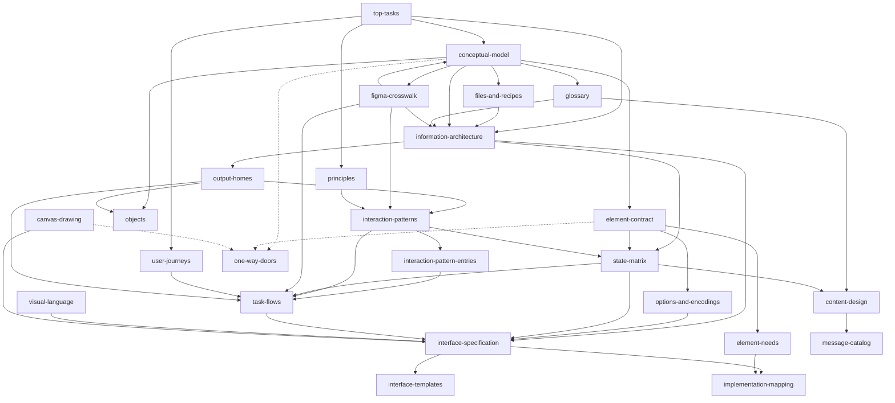

# The graphty design framework

graphty is a graph visualization and analysis tool built as two packages. **graphty-element** is a
standalone web component that owns every graph capability: loading data, styling through style
layers, algorithms, layouts, selection, the tree of analysis results and the project file. The
**graphty app** is only the window around it: panels, menus and settings. A design that puts graph
logic in the app is wrong (`CLAUDE.md` at the repository root, "Architectural Principles").

This folder is the framework every screen, mock and API change is designed against. It settles,
before anything is drawn, what exists and what it is called, how arguments are settled, where
everything lives, how things behave and look at every size, what graphty-element must publish to
make all of that true, and which decisions are expensive to undo.

Two commitments shape all of it. **Figma is the source of the chrome grammar and the interaction
conventions**: where the Figma editor has already solved a problem of panels, rows, menus, keys
and editing, graphty solves it the same way, and every difference is one row of a ledger with the
fact that forces it (`figma-crosswalk.md` 4). Graph behavior follows graphty's own model, because a
graph is not a design file (`principles.md` 0). **Graph objects are the work**: nodes,
edges, sets and paths are what the analyst selects and acts on, and the analysis vocabulary is the
field's own (degree, betweenness, PageRank, connected components), never a friendly substitute.

The design target is the intermediate analyst who opens graphty about once a week. Every other
skill level is served by aids everyone gets (undo, working defaults, (i) icons on technical terms,
tooltips, Quick actions, sample graphs, documentation), never by features for one kind of
user.

## The document set

Read in this order; each document rests on the documents that feed it in the diagram below. The
plane is Garrett's (*The Elements of User Experience*). **The ceiling column is the only statement of
each document's size limit**, and it is set by how a document is read: one read whole takes at
most 50 KB, about half an hour; a reference consulted by section takes at most 80 KB; a register
consulted by row, which nobody reads whole, takes at most 120 KB; this front door takes 25 KB. A KB is
1,024 bytes, as the lint measures it. **A ceiling is a trigger to review, not a quota**: a document
within 2% of its ceiling, or answering a second question, is **due to split by its growth rule**,
and the next edit that adds text to it splits it first; it is never compressed to fit, because
compressed prose fails the stranger it is written for.

| # | Document | Its one job | Plane | Owner role | Ceiling | Status |
|---|---|---|---|---|---|---|
| 1 | `top-tasks.md` | what analysts come to do, ranked, with success measures | Strategy | UX researcher | 50 KB | draft, unvalidated |
| 2 | `user-journeys.md` | how a piece of work unfolds across sessions, one journey per rhythm | Strategy | UX researcher | 50 KB | draft, unvalidated |
| 3 | `principles.md` | how trade-offs are settled, and the fixed rules (accessibility among them) | Strategy | design professor | 50 KB | draft |
| 4 | `conceptual-model.md` | what exists: objects, operations, relationships, lifecycles, state, extension points; the one list of object types | Scope | information architect, with the API steward | 50 KB | draft, teach-back not run |
| 4a | `files-and-recipes.md` | which files graphty reads and writes, what each carries, the overview recipe, and what an output holds | Scope | information architect, with the API steward | 50 KB | draft |
| 5 | `glossary.md` | what each concept is called, and the aliases | Scope | content designer | 80 KB | draft |
| 5a | `graph-conventions.md` | how every analysis reads a graph | Scope | network scientist | 50 KB | draft |
| 6 | `figma-crosswalk.md` | how graphty's ontology maps onto Figma's, both ways, and the departures ledger | Scope | Figma product designer | 80 KB, a reference consulted by row | draft; ledger pruning under way |
| 7 | `element-contract.md` | what graphty-element publishes and does, including a bare embed | Scope | graphty-element API steward | 80 KB | draft |
| 7a | `element-needs.md` | the one list of element work the framework still needs, by area | Scope | graphty-element API steward | 120 KB | draft; most issues not yet filed |
| 8 | `information-architecture.md` | where things live and how they are found; the three representations; the table's scope | Structure | information architect | 80 KB | draft, tree test not run |
| 8a | `output-homes.md` | the register: every object's and output's home, and every command's label and starting places | Structure | information architect | 80 KB | draft |
| 8b | `objects.md` | one card per object type: the builder's entry point, pointing to where each fact about it lives | Structure | information architect | 80 KB | started: two cards |
| 9 | `interaction-patterns.md` | the interaction grammar: the outcome test, the behavior map, the grammars (selection, commit, cost, undo, Esc and focus), the dispatch table, the modes as state charts | Structure | interaction designer | 80 KB | draft |
| 9a | `interaction-pattern-entries.md` | the pattern library: one entry per recurring pattern, then keyboard and assistive technology | Structure | interaction designer | 80 KB | draft |
| 10 | `options-and-encodings.md` | styling controls and options: how large option spaces are controlled (style channels, default scales, algorithm and layout options, import, export) | Structure | visual designer | 80 KB | draft |
| 11 | `task-flows.md` | the steps of each top task in one sitting, with the element call behind each | Structure | interaction designer | 80 KB; past it, flows split by task tier | draft |
| 12 | `state-matrix.md` | what changes with size, state, window and mode: the size invariant, the scale rules and a cell per state | Skeleton | interaction designer, with the front-end architect | 80 KB | draft; numbers mostly unmeasured |
| 12a | `scale-levels.md` | what each scale concern does at each level, small graphs, and channel readability by size | Skeleton | interaction designer, with the front-end architect | 50 KB | draft; numbers mostly unmeasured |
| 13 | `interface-specification.md` | the frame, row types, sections and the inspector's kinds, as differences from Figma | Skeleton | Figma product designer | 80 KB | draft |
| 13a | `interface-templates.md` | one card per template: regions, rows, components, tab order, states | Skeleton | Figma product designer | 80 KB | draft |
| 14 | `content-design.md` | voice, copy conventions, message types and their words, numbers, marks | Skeleton | content designer | 50 KB | draft |
| 14a | `message-catalog.md` | every message key: template, type, verb, delivery route, trigger | Skeleton | content designer | 50 KB | draft |
| 15 | `visual-language.md` | the chrome's look over compact-mantine | Surface | visual designer | 50 KB | draft |
| 15a | `canvas-drawing.md` | what graphty-element draws: theme defaults, marks, palettes, legend, labels, figures, 3D and XR | Surface | visual designer, with the graphty-element API steward | 50 KB | draft |
| 16 | `implementation-mapping.md` | from specification to code: state, data flow, modules, build order, tests; the one release-status line | beyond the planes | front-end architect | 80 KB | draft |
| 17 | `one-way-doors.md` | the owner's open expensive-to-undo decisions, in the order the build needs them | -- | design director; decided by the owner | 120 KB | open |
| 17a | `decided-doors.md` | the record of doors walked through or found cheap to undo | -- | design director | 50 KB | record |
| -- | `README.md` | this front door | -- | design director | 25 KB | -- |

**Where the code is.** Every citation of graphty-element, graphty or the sets and undo designs is to
origin/master at `9fc948ee` (graphty-element 2.6.1) unless it names another commit, as the status
line of `implementation-mapping.md` says. The main checkout where these documents sit is behind
origin/master and lacks `design/sets/`, so a citation followed there finds older code. These
documents are untracked files: they need a branch and a commit, which is the owner's to make.

**Everything here is a hypothesis until its study runs.** No top-task vote, tree test, card sort,
first-click test or teach-back has run yet (`research/study-schedule.md`). Studies come in two
kinds: a **pilot** (about five people, or a paper trace) finds gross errors and decides nothing; a
**decision study** is sized and given its threshold before any data, and only it settles a design
question.

**The freeze.** Only the two artifacts the first studies test are frozen: **the outline**
(`information-architecture.md` 4.1) and **the object map** (`conceptual-model.md` 1.3). An edit to
either only corrects a contradiction, replaces a copy with a pointer, applies a growth rule of
`information-architecture.md` 10, or repairs what the pilot tests. Every other document grows as the
owner's request for the next level of detail needs, and grows by splitting. The freeze lifts on
evidence that can be had this week: the owner's single-rater top-task ranking (a pick-five form,
sent now), the paper trace of the outline against the 25 workflows, and a five-person hallway
pilot, each with a date and a named owner in `research/study-schedule.md`. If recruiting for the
pilot fails by its date, the paper trace alone lifts it, labeled as testing reachability only. The
decision studies (the tree test at 50 or more per tree, the card sorts, the first-click decision
studies) run when recruiting exists, as re-checks, never as gates. The team decided this, because
the freeze is reversible by an edit; the earlier rule, under which no document could grow until
three studies reported, contradicted the owner's request.

- **Code** follows `implementation-mapping.md` 9; no slice waits on a decision study.
- **The guard**: a downstream document may cite a place, an object type, a command label or a home,
  but never introduce one.

`design/ui/object-first-ux/` holds an earlier round's interaction patterns, visual language and top
tasks; they are inputs this folder supersedes, kept as a record, and where they disagree this
folder wins.

`research/` holds the evidence the documents cite, never authority; its index is
`research/index.md`.

The personas and workflows in `design/designloom/` are the requirements base. They validate the
framework (each placement and ranking is walked against them) and never generate features.

**To build one screen**, read in this order: the screen's template card (`interface-templates.md`);
the cards of the objects it shows (`objects.md`); their commands (`output-homes.md` 3); the
patterns its rows follow (`interface-specification.md` 2.2, then `interaction-pattern-entries.md`);
its states (`state-matrix.md` 3 and 7); its strings (`message-catalog.md`); what the element must
publish first (`implementation-mapping.md` 5 and `element-needs.md`).

## Rules every document follows

- **Plain ASCII, American spelling**, written for a reader who never saw how the documents were made.
- **Every document opens with a header**: its job in one sentence, what is not in it, its owner, a
  pointer to its ceiling here, and how it is validated; it closes with its sources.
- **One home per fact.** A sentence that belongs in two documents is two sentences, and every other
  document cites the owner instead of copying it. The owners of the facts most often copied:
  command labels and starting places, `output-homes.md` 3; words, `glossary.md`; departures from
  Figma, `figma-crosswalk.md` 4; element work, `element-needs.md`; open decisions,
  `one-way-doors.md`; states and their verbs, `glossary.md` 10; the size invariant,
  `state-matrix.md` 1; release status, the top of `implementation-mapping.md`.
- **A validation bar lives with the document it validates**, and `research/study-schedule.md`
  holds each study's method, material, dates and owner, citing the bar. The one exception is a study
  serving several documents at once (the structure studies; the visual studies, which serve
  `visual-language.md` and `canvas-drawing.md`), whose bars live in the schedule.
- **Documents own rules and reasons; code owns values.** Key chords, token values, style channels,
  option schemas and palettes live in code; a document names a key by its role and points to the
  value.
- **Every behavior and place names its owner**: graphty-element, the app, or the element surfaced by
  the app. Anything a third party embedding the element would have to rebuild belongs to the
  element.
- **Status of the element** is written only in `element-needs.md`, `implementation-mapping.md` and
  a door's published baseline in `one-way-doors.md`; elsewhere a row is cited by its opening words
  (a step table's **Element need** column, a pattern's **Element need** line), because a copy goes
  stale with every release; the lint enforces it.
- **A door is named by its exact title** at least once in each document that cites it ("door 33,
  Choosing the overview recipe"), or listed with its title in the document's Sources; a decided
  door is cited by its row's title in `decided-doors.md`, never by its old number; a build slice
  is named by what it delivers ("the Rank slice", "slice 4a, Rank"). **A section number names its
  file** in every citation.

## Where a sentence goes

Every sentence is classified by its kind, which alone chooses the document, and its owner. A
sentence with two kinds is two sentences; a value with a home in code becomes a pointer.

| Kind | Document |
|---|---|
| An open decision that would re-key saved files, rename a published name or change a published default | one-way doors |
| A fact about an object, attribute, operation, relationship or lifecycle, true with no screen | conceptual model |
| What a file or an output carries | files and recipes |
| A published identifier, shape, event, file field, limit or default | element contract |
| Something graphty-element does not yet do | element needs |
| What a concept is called | glossary |
| A rule that decides between two good designs, or a fixed rule | principles |
| A correspondence with a Figma object, or a departure from Figma | figma crosswalk |
| Which place something lives in, how a collection is organized, how it is found | information architecture |
| A command's label or starting places; an object's or output's home | output homes |
| What happens in response to an input or a mode | interaction patterns |
| A rule of the generated form, an encoding or a legend | options and encodings |
| An ordered sequence of steps toward one goal in one sitting | task flows |
| Work across days and sessions | user journeys |
| What changes with graph size, collection size, loading, failure, emptiness or a mode | state matrix |
| A region inside a place, a row type, a section order, which component does a job | interface specification; one template's card, interface templates |
| A string the analyst reads | content design; a word or target budget is principles |
| When a chrome token is used | visual language |
| What graphty-element draws, and how it must look | canvas drawing |
| A code module, component file, story or test, or the build order | implementation mapping |
| Evidence or precedent | `research/`; the reason for a decision stays next to the decision |

## How the documents depend on each other

Arrows point from a document to the documents that read it.

The crosswalk and the model are written together; a gap found downstream is fixed upstream and
the downstream document re-derived.

## The frame at a glance

One page for a stranger; each line cites its owner.

- **Regions** (`interface-specification.md` 1.1, 1.2): a rail (the main menu, then Graph,
  Assistant, Results, Notes); a left panel for the rail's collection, under a left panel header
  (project name, save state, and the filter chip, which names what every number is computed on)
  that stays in place above every rail panel, the Graph panel holding Graphs, Sets and paths, the
  **Styles** list and Views; the canvas, drawn by graphty-element, with one legend and its
  not-drawn line; a right-hand inspector; a bottom dock holding the table; a
  floating toolbar (Select with Lasso and Hand, Path, Note, Quick actions, the view mode); a header
  with Export and the zoom menu.
- **Inspector kinds** (`interface-specification.md` 4.0, the one statement of the count): Nothing
  (the graph), One node, One edge, Several elements, Set and Path, the last two with an offered
  variant (a group, a found path) that is kept only by an explicit Create set or Create path. The kind follows the canvas
  selection alone; a definition (a result, a style layer, a filter step, a saved view) opens its
  editor popover from its row and never replaces the inspector.
- **Three representations of one selection** (`information-architecture.md` 8.1): the canvas
  shows an element among its neighbors, the inspector one element raw, the table many raw; the
  table's scope is the filtered graph, the selection, or one object's members.
- **The style stack** (`conceptual-model.md` 5.1): Overrides first, Base style last, listed in the
  left panel's Styles list so it stays in view while data is selected (`information-architecture.md`
  11, where a decision study could still move it). Hidden elements
  are not a layer: whether an element is drawn is its own state (door 86, Whether an element is
  drawn), counted on the canvas legend's not-drawn line (`output-homes.md` 1).
- **Paint reaches a node** by a layer's selector, a kept object's own layer, Override, or a Look's
  palette swap (`interaction-patterns.md` 3.2). A long stack: `interaction-pattern-entries.md` 6.8.
- **Size**: what is drawn is the filtered graph minus the hidden elements (`state-matrix.md` 4.1).

## The owner's questions, and where each is answered

Each question has one answering section, headed by the question where it is the owner's note on
that document; this index is a list of links, not a second answer.

| Question | Where |
|---|---|
| Could "Replace data" also be "load style" or "load recipe", so communities share starting points without data? | `top-tasks.md`, the question |
| Should characterizing a graph be a default overview recipe that a domain can replace? | `top-tasks.md`, the question; the rule, `files-and-recipes.md` 2 |
| Can an ordered index turn a set into a path? | `conceptual-model.md` 4.2 |
| Do self-loops, multi-edges, direction, trees and DAGs belong in the model? | `conceptual-model.md` 3.1 |
| Where do location and the coordinate system live? | `conceptual-model.md` 5.2 |
| Two kinds of filter: one that changes the view, one that removes nodes? A derived graph? | `conceptual-model.md` 4.4 |
| Which things can be imported and exported, alone or together? | `files-and-recipes.md` 1 |
| Are all extension points in the model? | `conceptual-model.md` 9 |
| How are sets with continuous values told apart from sets with group values? | `conceptual-model.md` 5.1 |
| Should view and control be first-order concepts of the ontology? | `conceptual-model.md` 1.1 |
| Can edges have types and attributes? | `conceptual-model.md` 3.3; `information-architecture.md` 8.3 |
| How do we look at data in context and at raw data? | `information-architecture.md` 8.1 |
| How does graphty's ontology fit Figma's framework? | `figma-crosswalk.md` 1 (with its picture) |
| What happens with large and small graphs? | `state-matrix.md` 4; `scale-levels.md` |
| How many style controls are there, and how is the variety managed? | `options-and-encodings.md` 2, 3 |
| How do we view data and styles at the same time? | `information-architecture.md` 8.1, and 11 for where the style stack lives |
| What happens with a large number of layers? | `interaction-pattern-entries.md` 6.8; `state-matrix.md` 7; `information-architecture.md` 7 (finding a layer by name) |
| How are algorithm and layout options managed? | `options-and-encodings.md` 9 |
| Flows and journeys broken out? | `user-journeys.md` and `task-flows.md`; why they are two, and the rule that links a stage to its flow, is the header of `task-flows.md` |

## Validation of the set, and what comes next

One command runs every check: `node design/ui/framework/research/scripts/check-framework.mjs`. It
runs the flows check and the structure check with their self-tests and writes the date and result
to `research/last-check.txt`; no document states a result by hand. **The lint checks the documents'
form and consistency, never whether the design is right**: "passed" validates nothing a study must.
Until 2026-09-28 it checked only a door title's first three words, so an earlier "passed" did not
cover title equality. No hook or CI job runs it yet; adding it to `tools/prepush.sh` is outside this
folder.

- **The document lint**, `check-framework.mjs`: ceilings, ASCII, spelling, retired phrases, every
  pointer and quoted row title resolving, element status only where it is owned, every cited door
  named by its exact title, and no retired door number cited.
- **The structure check**, `check-structure.mjs` (`information-architecture.md` 12): the outline's
  selection branches and sections against the inspector kinds in both directions, no verb in the
  outline, the rail's places across this page, `interface-specification.md` 1.2 and the outline,
  the route cells of `output-homes.md` 1, rejected words, the object list and the pattern index.
- **The flows check**, `check-flows.mjs` (`task-flows.md` 12, item 1), including the step tables' Command
  and Undo label columns against the register.
- **The readability pass**: one reader outside the team reads each document's first section alone
  and explains it back; a document that fails is rewritten, and an edit that adds explanation is
  always allowed when it removes a dependency on another document.
- **The studies** (`research/study-schedule.md`): first the pilots that lift the freeze, then the
  decision studies.

**Next, in order.** The object cards of `objects.md` for every type (two exist); the departures
awaiting a forcing fact, each re-justified or reverted before its slice (`figma-crosswalk.md` 4.0);
the two documents due to split, `task-flows.md` (by task tier) and `principles.md` (its conflict
ledger into a reference of its own), and `conceptual-model.md`, a few hundred bytes under its
trigger, at its next addition; the readability pass over the documents that were packed to
their old ceilings.

**Waiting on the owner.** The top-task ranking form; filing the eight app workarounds of
`implementation-mapping.md` 8 as issues before the first slice merges; approving or vetoing
compact-mantine's second block of accessibility token overrides (`visual-language.md` A8), a token
change; committing these documents to a branch; and the doors of `one-way-doors.md` for slices 1
and 2 only ("The queue").
