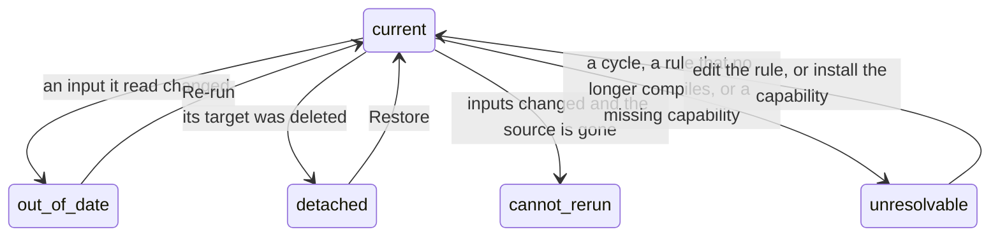

# Conceptual model

**Job.** Say what exists in graphty, what each thing holds, how the things relate, which operations
change them and which state is kept, in words that stay true with no screen at all.

**Not here.** Screens, keys, strings and step sequences (`information-architecture.md`,
`interaction-patterns.md`, `content-design.md`, `task-flows.md`); definitions (`glossary.md`, the
only place a term is defined); published shapes and exact semantics (`element-contract.md`); element
work still owed (`element-needs.md`); algorithm conventions (`graph-conventions.md`); open expensive
decisions (`one-way-doors.md`). On element behavior the sets design and the undo design win: a
disagreement is a defect here. **Owner:** information architect, with the graphty-element API
steward. **Ceiling:** the README's table. **Validated by:** a task-first teach-back with analysts
(Appendix A, not yet run), and the walk of every top task in the model's operations,
`research/model-task-walk.md`.

Every concept belongs to **graphty-element**, never to the **graphty app** around it (`CLAUDE.md`,
"Architectural Principles"). Every statement is the target model. **"Door N"** cites a
recommendation in `one-way-doors.md` that the owner has not decided. Where the element differs from
the model is `element-needs.md`.

## The model in brief

This page is for builders and reviewers; the teach-back never reads it aloud (Appendix A).

**The concept budget.** Top tasks 1 to 4 put twelve concepts on screen: graph, node, edge,
attribute, Statistics (the read of a scope, 4.6), catalog entry (an algorithm the analyst picks),
result, group, set, selection, filter step, style layer. Every other concept below (run, item,
offer, record, operation, data version, recipe, derived graph) is met only from its own object,
never needed to finish those tasks (`research/model-task-walk.md`). Two of them are Screen words in
`glossary.md` and still stay off those tasks' screens: a scope word shows in a search bar only where
it differs from the filter chip, and a run is met only inside its result's editor. The overview row
reads "Overview: General", so the word recipe waits behind Replace (`files-and-recipes.md` 2). An
automatic layer is a style layer and costs nothing new. A design that needs a thirteenth concept for
tasks 1 to 4 names it and its reason here.

In one paragraph: a **project** holds **graphs** of **nodes** and **edges**, both carrying
**attributes**. **Algorithms** run over a stated **scope** and keep their values under a **result**,
which offers its groups and found paths until the analyst keeps one by an explicit **Create set** or
**Create path**. **Filter steps** narrow what every computation reads; **style layers** paint, top
layer winning; **Hide on canvas** changes only what is drawn; a **layout** arranges positions;
**notes** record conclusions; a **saved view** captures the working state. Every change is one
undoable **operation**, and a **recipe** carries an analysis without its data.

## 1. What belongs in the model

### 1.1 Should view and control be first-order concepts?

Partly. The view specification (style layers, layout settings, saved views) is model; the
representations (canvas, inspector, table) and the controllers (gestures, menus, keys) are not. Four
tiers keep the owner's MVC question apart, following the grammar-of-graphics convention that a
visualization's specification is data (Wilkinson, *The Grammar of Graphics*; Vega-Lite):

| Tier | What it is in graphty | In the model? | Where it is written |
|---|---|---|---|
| **Data and analysis** | graphs, attributes, data versions, results, runs, items, sets, paths, filter steps, notes | yes | this document |
| **View specification** | style layers, Looks, layout settings and positions, saved views, display toggles a view captures | yes: saved, shared and undone like data | this document, section 5 |
| **Representations** | the canvas, the inspector and the table: three projections of one selection and one scope | no | `information-architecture.md` 8 |
| **Controllers** | how an operation is invoked: gestures, menus, Quick actions, keys | no; the operations themselves are model (section 7) | `interaction-patterns.md`; the command register in `output-homes.md` 3 |

Two tests place any piece of state:

- **The consumer test.** Would a third-party consumer of graphty-element need it to rebuild
  graphty's behavior? If yes, graphty-element owns it.
- **The two-readers test.** Would two analysts opening the same file see it differ? If yes, it is a
  reader preference, not model.

| Outcome | Tests | Owner, undo, file | Examples |
|---|---|---|---|
| **Model** | consumer yes, two-readers no | element; undoable; saved | graphs, sets, results, style layers, notes, labels shown |
| **Element transient** | consumer yes, but only operations read it or a view captures it | element; not undoable; not saved | selection, camera, hover, a run in flight |
| **App state** | two-readers yes, or chrome only | app; never in the project | theme, an open panel, row focus |

**Reader aids on the canvas** (note markers, the minimap) pass the consumer test: graphty-element
draws both, and whether each shows is element transient state the host sets from a preference.

**Presentation state that is not a style layer**, one list:

| State | Belongs to | Undoable | A saved view captures it | A style file carries it |
|---|---|---|---|---|
| Background (`GraphStyle.background`) | each graph, as Figma's page color is (recommended, door 5, Project parts and graph parts) | yes | no | no: a shared style never overrides the recipient's theme (`canvas-drawing.md` 1) |
| Collapsed sets | graph | yes | yes | no |
| Display toggles (labels on canvas, arrows, legend) | project | yes | yes | no |
| Dimension (2D or 3D) | graph, in the layout settings | yes | yes | no |
| Hidden elements (5.1) | graph | yes | yes | no |
| The Look (5.1) | project | yes | yes | yes |

The file's top level is door 2, the file's top level.

### 1.2 Type and containment

Kinds, with the counterparts analysts know:

```
Graph ............ NetworkX Graph family; a Cytoscape network
  derived graph .. NetworkX projected_graph, quotient_graph; Cytoscape "new network from selection"
Set .............. a NetworkX node set; a Cytoscape named selection; a Gephi partition group
  fixed | rule ... a member list | NetworkX subgraph_view(filter_node=...), a Gephi attribute filter
  path ........... a NetworkX path (a node list)
Item ............. one block of a NetworkX partition (group); one found path; one candidate pair
Filter step ...... one filter of a Gephi filter chain
Result ........... a Gephi statistic; a column a Cytoscape app writes
  single-run result: metric, partition, graph statistic, series
  multi-run result: path family, flow, pair list, comparison
Recipe ........... a Cytoscape session with its styles, minus the data
```

**Containment** is the test of `research/design-method.md` 3.7: deleting the container deletes its
contents. It holds for **a graph and its parts**: its data versions, nodes, edges, filter steps,
layout settings, sets, results, run-made layers, Overrides, Base style and positions all go with
the graph. It holds for **result > runs** and **run > items**. Everything else is a **reference
that survives its target** and reads detached when the target goes (7.2): a layer's or a step's
reference to a kept set, a note's targets, a set's Created from, a set's Used by. Where notes, saved
views and comparisons are stored when a project holds several graphs is door 5, Project parts and
graph parts; the recommendation is the project, because a note or a findings report can span
graphs.

### 1.3 The object map

**This table is the one list of object types**; every other list cites its rows and never adds a
type. With the outline of `information-architecture.md` 4.1, it is what the freeze holds (README,
"The freeze"). The groups say how the analyst meets each object, which is what the information architecture
places (`information-architecture.md` 2, rules 4 and 5). Verbs per type are 7.1's table. Data
versions, runs and records are never deleted one by one: deleting a result removes its values and
keeps its records. The working state is section 2's table, rows marked not undoable.

**Content: selected, and can serve as a scope.** These are the **primary objects**: a node, an
edge, or a named object whose body is an existing subgraph (`glossary.md`). A graph is chosen by
switching to it, not by selecting.

| Object | Holds | Related to |
|---|---|---|
| **Graph** | nodes, edges, declared properties, default attribute per role | n data versions; a derived graph adds a derivation map |
| **Node** | id, attributes, live position, pin | n edges, n sets |
| **Edge** | id, or ends plus key; direction; type; attributes | 2 ends, n sets |
| **Set** | name, definition (fixed, rule, path), edges included, created from; **offered** or **kept** (4.1) | n elements; n operand sets |
| **Path** | the path kind of set: nodes in order, each step's edge, derived kind (4.2) | is a set |

**A group** and **a found path** are a set and a path in their **offered** state: a run's item that
is a subgraph, shown as a set or path until an explicit Create set or Create path keeps it. They
carry the item's key and item attributes (a group's name) and belong to 1 run. They are not types of
their own; whether analysts think of a community as its own kind of thing is what the teach-back's
community task tests (Appendix A), and this ruling is provisional until it reports.

**Definitions: edited from a row, never selected** (section 2).

| Object | Holds | Related to |
|---|---|---|
| **Result** | kind, accumulation | n runs, 1 catalog entry |
| **Style layer** | selector (an inline rule, 4.1), encodings, enabled, source (analyst, run, recipe, plugin, element), kind (ordinary, highlight, Overrides, Base style) | 0..1 kept set its selector references |
| **Filter step** | rule (an inline rule, 4.1), outcome, input, enabled, labeled additions | ordered, one list per graph; 0..1 kept set |
| **Layout settings** | layout, parameters, seed, dimension, encoded axes, scope | 1 per graph |
| **Saved view** | title, caption, capture (5.3) | n graphs |
| the **Look** | a palette substitution (5.1); registered, not authored in 2.x | 1 per project |
| **Note** | prose, author, times, targets, citations, quotes; its row selects its targets | n targets, n cited runs |
| **Comparison** | two operands and their matching; transient on screen; **Save comparison** keeps it as a run of a comparison result | 2 operands |

**Values: read as columns and rows.**

| Object | Holds | Related to |
|---|---|---|
| **Attribute** | name, element kind, origin, level, role | 0..1 producing run |
| **Pair** | an item that is not a subgraph: a scored row, read in its result's item tab | 1 run |

**History: kept, restored, never edited.**

| Object | Holds | Related to |
|---|---|---|
| **Data version** | record, source, query, import report | the one before it |
| **Run** | record, status, freshness, values | n items, 1 frozen scope |

The project's operation log (7.1) is history too, read in Version history; it is a part of the
project, not an object the analyst acts on.

**Files and the catalog.**

| Object | Holds | Related to |
|---|---|---|
| **Project** | id, graphs, the operation log, metadata, the overview recipe choice | n graphs |
| **Recipe** | id, version, definitions and slots (`files-and-recipes.md` 1) | n projects that applied it |
| **Set collection** | named rule sets loaded from one list file | n sets |
| **Catalog entry** | kind, key, version, descriptor, option descriptors | n results or layout settings |

A pinned node is a node whose pin is set, not an object; the pinned count reads the pins. A hidden
element is an element whose visibility is off (5.1), not an object either. A named text style is
not a type until a workflow shows one look reused (`decided-doors.md`, "Named text styles").

```mermaid
classDiagram
  Project "1" o-- "1..*" Graph
  Project "1" o-- "*" Note
  Project "1" o-- "*" SavedView
  Project "1" o-- "*" StyleLayer : authored
  Project "1" o-- "1" Look
  Project "1" o-- "*" Result : comparison
  Project "1" o-- "*" SetCollection
  Project --> Recipe : overview; applied
  Graph "1" *-- "1..*" DataVersion
  Graph "1" *-- "*" Node
  Graph "1" *-- "*" Edge
  Graph "1" *-- "*" FilterStep
  Graph "1" *-- "1" LayoutSettings
  Graph "1" *-- "*" Set
  Graph "1" *-- "*" StyleLayer : run-made, Overrides, Base style
  Graph "1" *-- "*" Result
  Node "1" *-- "*" Attribute
  Edge "1" *-- "*" Attribute
  Result "1" *-- "1..*" Run
  Result --> CatalogEntry : kind
  Run "1" *-- "*" Pair
  Run ..> Set : offers groups and found paths
  Run --> Scope : read
  SetCollection o-- Set
  Set <|-- Path
  StyleLayer ..> Set : selector may reference
  FilterStep ..> Set : rule may reference
  Note ..> Target : about
  Target <|-- Set
  Target <|-- Definition
  Note ..> Run : cites
  Edge --> Node : 2 ends
  Attribute ..> Run : written by
```

Filled diamonds are containment, deleted with their container; open diamonds are the project's
parts under door 5's recommendation; dotted arrows are references that survive their target. The
diagram draws door 5's recommendation for several graphs: authored style layers, the Look, notes,
saved views and comparison results on the project; the rest per graph. A note's target is a node,
an edge, a set in either state, the graph or a definition (6).

### 1.4 Rules beneath the map

- **Every change is an operation**, undoable. A new need gets a new operation, not a new object.
- **Looking leaves nothing behind**: Find, Select and Compare with... write only transient state.
- **Not every object is inspected.** The Look is a value of the project, chosen from a menu, and an
  undo step is a label; neither has properties of its own to show. A pair is a scored row of its
  result, read in the item tab; selecting it selects its two nodes. A set collection is read
  through its sets.
- **Every number names the graph it was computed on** (4.5), and outside it is missing, never 0.
  Find never reports "absent" for what a filter step leaves out.
- **No algorithm reads a style layer**, and no style layer changes a number.

### 1.5 Not in the model

- **Time-respecting paths**: a window is an aggregated static graph, so a path in it may run
  backwards in time.
- **Pattern search**: no catalog algorithm exists. "Matching" keeps its textbook sense.
- **Hyperedges**: a node of a second type stands in (two-mode, 4.6); bipartite projection gives the
  pairwise graph.
- **Multilayer measures and interlayer edges**: edge types give per-layer runs only (3.3).
- **Numeric vectors** (embeddings, expression profiles): kept and exported, never analyzed or
  encoded. A series (4.7) is not a vector.
- **Schema authoring**: type roles and the quotient graph by type show a schema.
- **Branching history**: undo is linear.

## 2. What state exists, who owns it, what undo and the file keep

**One live copy.** Each graph has one live copy of each piece of state: positions, filter steps,
layout settings. Anything plural is a named capture (a saved view, a run, a comparison), which can
be displayed without touching live state and changes it only through an explicit, undoable Apply.
A part keyed by element id needs its data (`files-and-recipes.md` 1). Every "yes" under Saved is file format (doors 1, 2).

| State | Keyed by | Undoable | Saved |
|---|---|---|---|
| Graph, attributes, declared properties, import report | element id | yes | yes |
| Graphs, data versions | graph id | yes | yes |
| Runs, results, item attributes | run id; result id | yes | yes, values by retention |
| Sets and paths | set id; members by element id | yes | yes |
| Filter steps, time window | step id | yes, per step | yes |
| Collapsed sets; the display toggles a view captures (labels on canvas, arrows, legend) | set id; toggle | yes | yes |
| Style layers, the Look | layer id | yes | yes (door 5) |
| Layout settings with scope, dimension, encoded axes | graph | yes | yes |
| Live positions (x, y and z), pins | element id | yes, when a layout settles or a drag ends | yes |
| Saved views, notes, saved comparisons, the overview recipe choice | object id; target ids | yes | yes |
| Operation log | record id | undo appends, never removes | yes |
| Undo history | -- | -- | no |
| **Selection** | element id, or one primary object's id | no | no |
| Hover, camera, VR and AR sessions; whether the minimap and note markers show (1.1) | -- | no | the camera only in a saved view |
| The graph on screen | project | no | as the project's reopen state, like the camera in a view; switching graphs never dirties the file |
| A comparison on screen; a run in flight | -- | no | only by Save comparison |
| Panels, dock height, theme, row focus | app | no | never |

**The selection** holds elements, or one primary object as a whole (a set, a path, a group, a found
path), one kind at a time. **Definitions are never selected**: a result, a style layer, a filter
step, a saved view, a Look and a note are operands a command names, and they are edited in place.
Runs
scoped to the selection read it when they start; Create set freezes it.

Selection stays out of undo, which it would flood; **Previous selection** mitigates it.

## 3. Data tier

### 3.1 Do self-loops, multi-edges, direction, trees and DAGs belong in the model?

Yes, as properties of a graph, never as object types. **Declared properties** (direction, the
parallel-edge and self-loop policies, two-mode, the default attribute per role) are set by the
analyst and recorded by every run; **detected properties** (self-loops, parallel edges, connected,
a DAG, a tree, two-colorable) are measured on a scope and never stored, because a filter step can
turn a cyclic graph acyclic. The lists are `graph-conventions.md` 1. Algorithms declare **preconditions** against detected properties of
the scope they will read (a topological sort needs a DAG), checked
by a detected-properties read over any scope (`element-needs.md`, "A detected-properties read"). A **project** is the file: an
id, graphs with persisted ids, the log and metadata.

### 3.2 Data version

A **data version** is one frozen state of a graph, made by a data operation (7.1). Its record holds
the source and its **query** (an id list, a cutoff), the field mapping, the declared properties and
an **import report**. Expanding a partly loaded graph is Add data with a neighborhood query. How a
refreshing source maps onto versions is door 28, Refreshing sources and data versions. Add data writes a **source** attribute, a cover
when several sources supply one element (door 29, The Add data source attribute).

**Cleaning is not filtering**: Remove and Correct change the full graph. An edit makes a run out of
date only if it changed what the run read. **Merge nodes** takes a selection or a pair list; its
record names the pair run, each attribute's reduction and the conflicting values.

### 3.3 Can edges have types and attributes?

Yes: **edges are full peers of nodes**. They carry identity, attributes of every origin, results,
set membership, style layers and notes. An edge's identity is its id, else its ends plus a key, so
**parallel edges** are distinct; the key keeps the ends in the order they were ingested, and an
undirected reading only matches them unordered, so re-declaring direction never re-keys an edge
(door 3, Edge identity); a **self-loop** has equal ends. The **edge type** is the attribute in the edge-type role; being
categorical, it reads as a partition, so edges are filtered, styled, counted, tabulated and
traversed by type. A multiplex layer is an edge type.

### 3.4 Attribute

Every per-element value is an **attribute**, with:

- an **origin**: imported, joined, result, computed, authored;
- a **measurement level**: **categorical**, **ordinal**, **quantitative** or **time**, which decides
  its encodings (5.1); declared, inferred only as a fallback (door 20, A measurement level per attribute);
- a **role**, declared or absent: **weight** (distance, similarity or capacity; a similarity may be
  signed), node type, edge type, time, **position** (a coordinate that came with the data, such
  as longitude and latitude), or **color** and **size** (values a file brings to be drawn as they
  are, such as Gephi's). Which negative weights are allowed is `graph-conventions.md` 2 (door 21, The weight role on the attribute).

**Missing is not zero**: outside its scope a value is missing, left out of every population, rank
and scale, and counted. An **expression attribute** follows its inputs. A list of categorical values
reads as a **cover**, groups that may overlap. **Live attributes** (the degree family, components) are
read on the filtered graph and labeled so; where a node's filtered degree differs from its
full-graph degree, both are shown, because a low degree inside an investigation boundary is not a
peripheral node (`element-needs.md`, "The full-graph degree beside the filtered one"). Binding one
to a style layer or a column binds a run, which keeps its scope.

## 4. Analysis tier

### 4.1 Set

A **set** is a named collection of nodes and edges; an element is in it or not.

- **Fixed**: a member list by id; never out of date, only missing members.
- **Rule**: a predicate, so members follow the data. Leaves are the element's rule tree
  (`element-contract.md` 9): attribute, threshold, presence, text, time window, neighborhood,
  membership of another set, and one item of a result.
- **Path** (4.2).

Every set states which **edges** it includes (published as `EdgeReading`): **induced** (every edge between its nodes), **listed**
(exactly its edges) or, for a rule, **clipped** (the edges it keeps whose two ends it also keeps). A
rule with no scope reads the full graph wherever it is stored.

A kept set records what it was **created from**. A result **offers** its items as sets; Create set
freezes an offer or any set. An identifier list is a rule set ("symbol is in {...}"); a **set
collection** (a GMT file, an indicator list, a watchlist) loads as rule sets with no data version,
counts unmatched identifiers and travels in a recipe (door 27, Identifier lists as rule sets).

**A layer's selector and a step's rule are inline rules**, properties of their layer or step, not
objects. An inline rule never appears in Sets and paths and never counts in a set's Used by. It may
instead reference a kept set by id, and only that reference is listed under the set's Used by and
reads detached if the set is deleted. An inline rule becomes a kept rule set only by an explicit
**Create set from rule**. So Sets and paths holds what the analyst kept, not one entry per layer and
per step.

**A subnetwork is a set**, never a copy. **Extract as graph** (4.7) is the only copy, and it leaves
the parent's definitions behind.

**The lifecycle of a set or path.** A kept object is never created as a side effect
(`interaction-patterns.md` 3.2).

```mermaid
stateDiagram-v2
  [*] --> offered: a run offers a group or found path
  offered --> kept: Create set or Create path
  offered --> lost: the run is replaced; the loss is announced
  [*] --> kept: Create set from a selection or rule
  kept --> deleted: Delete; references read detached (7.2)
  deleted --> kept: Undo, or Restore
```



### 4.2 Can an ordered index turn a set into a path?

Yes, the way a Python list extends a set, for exactly one kind of set. A **path** is the path kind of set: it stores its walk, nodes in
order with each step naming its edge, and read as a set it is its distinct nodes and its steps'
edges, so it is accepted wherever a set is. It is its own object type on screen, because an order
changes what the analyst can do with it. A walk may repeat nodes, which a set cannot, so the order is
stored rather than an index added to members. Its kind is derived, never stored, first match:
**Cycle** (closed, no repeated node but its ends, no repeated edge), **Simple path** (no repeated
node), **Trail** (no repeated edge), **Walk**. On a directed graph it records whether every step
follows its edge.

**A walk grows only at its ends** (**Extend path**), as a list is appended to; reordered, it is
another path.

**No other set carries an order.** A ranking is an attribute sorted on read, because a stored order
drifts from the values it came from; only a walk's order cannot be recovered from the data. An analyst's own order (a triage priority)
is an authored ordinal attribute sorted on read, so no set needs an index.

### 4.3 Result, run and items

A **result** is the kept container for one analysis of one **kind** (1.2); a **run** is one
execution and owns the record (`element-contract.md` 3). A **single-run result** keeps one current
run: a new parameter adds a run and makes it current, and Re-run after the scope changed adds a run,
so what follows the result repaints and the earlier run stays as the baseline. Only an explicit
what-if (Without this) or Run as new result makes a **sibling result**, which nothing follows. A
**sweep** adds a run per parameter value. A **multi-run result** keeps every run, each with its own
scope; one that finds nothing is a finding. Exact and sampled methods are always two results. The
two kind names are Docs tier; on screen a result is named by its algorithm.

**A run over a list of scopes is one run of one result**: per-element values are tagged with their
scope, per-scope values are item attributes. The scope reads **Within each group** for a partition
and **Each of...** for any other list.

**Running an algorithm that already has a result on this graph** opens that result and re-runs it on
the current scope, so what follows it repaints; **Run as new result** is the explicit way to get a
second one. The element API resolves an unnamed run the same way, so a host and the app write the
same project (door 92, An unnamed run's result); a derived result id is only a
first name and says nothing about the result's current scope.

Values live on elements as result attributes. **Items** are groups, found paths or candidate pairs.
A partition may be **hierarchical** (an item key is level plus group) or a **cover** (a list-valued
result attribute). **Item attributes** belong to one run, computed by Profile groups or authored (a
group's name); they move to a new run only by **Carry over to new run**, which matches groups (7.3).
**Any categorical attribute reads as a partition with no run**, so an authored verdict and a set of
the same elements are two views of one fact.

**Undoing the command that created a result removes the result** when its first run is still queued
or running; the log keeps "canceled by undo", and Redo brings the result back unrun, starting
nothing. Undo of a later Run leaves the result current on its previous run.

**A run never restarts**: a failed or canceled run stays in the log, and Re-run adds a new run. The
run's lifecycle chart, and what Cancel, Undo and Redo do to a run, its result and the log, are
`element-contract.md` 3 and nowhere else; the log only ever appends.

### 4.4 Two kinds of filter: one that changes the view, one that removes nodes?

The owner's two examples are two different things, and only one of them is a filter.

- **"Filter the data to a component, then lay it out, and have the layout ignore the rest"** is a
  **filter step**. Filter steps are an ordered list; each is a set with an outcome, **Filter to** or
  **Filter out**, and each reads the previous step's output, or the full graph where its input says
  so. Together they decide the **filtered graph**, the default scope of every run. Every filter step
  changes what is computed.
- **The layout half of the example.** The layout settings hold two scopes (5.2): what the layout
  **reads** and what it **moves**. Whenever a filter step is on, both default to the filtered graph
  for the layouts the catalog marks as scoped (the simulation layouts): filtered-out nodes exert no
  force and keep their positions. A static layout (Circular, Grid) moves the whole graph until it has
  a rule for where a subset lands among nodes that do not move (door 17, The default scope of a
  layout). **Hidden elements are read and moved by a layout** like drawn ones, because hiding
  changes no computation. The Layout row states how many hidden nodes the layout will read; when
  that read scope is past what a layout can handle, Run layout is unavailable with its reason and
  offers **Filter to drawn** (`state-matrix.md` 4.2). Filter out is the way to leave hidden nodes
  out (`element-needs.md`, "A layout scope carried in the one layout settings per graph").
- **"All nodes of type X, then a style on them"** is a **style layer** whose selector is the type-X
  rule. It changes paint and no number. Fading or graying what is not of interest is a style layer
  too.
- **Hide on canvas**, the owner's "filter that changes the view", is neither a filter step nor a
  style layer. It turns off whether elements are drawn (5.1), and names how many it hides. Hidden
  elements stay in every count, table row, run and layout; they are not drawn and cannot be
  picked. So at any size hiding narrows the view and a filter step narrows the analysis; how each
  is charged to the drawing limit is `state-matrix.md` 4.1.
- **A derived graph** is neither: it exists only when an operation creates elements that are in no
  data (a projection, a quotient, Extract as graph), and it has its own positions and runs.

**One kind of filter step (recommended, door 25, One kind of filter step or two).** An investigation's boundary ("this account's
neighborhood") is an ordinary Filter to step. One command grows it: **Add selection to step**, one
undo step that edits the newest Filter to step in place; **Filter to neighbors** is the same command
with the selection's neighbors as its operand. It reads the graph as it stood before that step, so
the neighbors it adds are reachable; the step lists each addition, labeled by the command that made
it. The next alert starts with Delete step and Filter to, two ordinary commands.

**A search states its scope.** A search walks outward from endpoints: Select neighbors, paths
between named endpoints, the within-k-hops rule leaf, and any algorithm whose catalog descriptor
declares it a search. It reads the filtered graph by default, and its scope, **Filtered graph** or
**Full graph**, is stated before it runs and recorded on its run; a search whose endpoint lies
outside, or that finds nothing inside, offers the full graph, and a found path that leaves the
filtered graph is marked where it leaves.

**A step made on an item column is a step over items** (a list of found paths filtered to "verdict
is not false positive"): the filtered graph keeps an element if at least one passing item holds it.

Not filters, and never called one: **style layers** (paint), **Collapse** (a set drawn as one node;
its analyzable form is the quotient graph), **Remove** (a data edit), **derived graphs**.

### 4.5 Scope and population

**Scope** is the graph an operation reads, frozen into its record. **Population** is what a
threshold is measured against: the evaluated scope, or each group of a named partition ("top k per
group"). Every value names one of three graphs:

- the **full graph** (scope keyword `"graph"`);
- the **filtered graph** (published as `"visible"`; `"filtered"` is door 22, The filtered-graph scope's name);
- a **named scope**: a set, the largest component, "the graph without S", a time window, the
  selection, or a list of scopes.

Set to set, a search returns the nearest pairs as one query run. **A different scope is not out of
date.**

### 4.6 Statistics and detected properties

Every scope has **Statistics**, a read. A graph statistic beyond the overview rows (transitivity,
diameter, assortativity) is a result once requested, kept in the Results panel like any other; its
Statistics row shows the value with its scope and opens that result.

### 4.7 Comparison, derived graphs and time

**Compare with...** takes two operands: sets or groups; runs of one result; results of one kind; a
result or a set statistic and its randomized baseline; two attributes over one scope; a partition
or set collection against a partition, set collection or categorical attribute; or two **states**,
each a scope plus a position source (5.2). It never changes the filtered graph. **Save comparison**
adds a run to a comparison result on the project (`graph-conventions.md` 3).

A **derived graph** is made by a **transform**: a projection, quotient or line graph, Combine
graphs, Extract as graph, a null-model sample. It is a new graph with a derivation map and its own
positions.

A declared time attribute enables **time windows**, which are scopes and filter steps, and a
**series**: one run over a list of window scopes, its values tagged by window (4.3); which window
paints is working state, not a run.

## 5. Presentation tier

### 5.1 Style layers, encodings and the Look

Appearance is applied only through **style layers**: a **selector** (a set definition) plus
**encodings**. The top layer wins each channel it writes; the channels are a closed list the
element publishes.

**The stack order, stated once.** Top to bottom: **Overrides** (hand edits, kept first once used),
then authored and algorithm layers, then **Base style** (the bottom layer that gives every channel
its default; door 31, Overrides, Base style and the stack order). "On top", where every new layer lands, means directly below Overrides.
**The order is one list kept on the project**, whose entries may name the graph they belong to;
each graph draws its own view of that list, so dragging a run-made layer above an authored one
changes one order, not two (door 5, Project parts and graph parts).

A **highlight** is a style layer of the highlight kind: it writes only the highlight mark, never a
channel, and stacks and undoes like any layer. Selection, hover and focus are **canvas marks**,
transient state drawn outside the stack; they never write a channel and never change a fill
(`canvas-drawing.md` 6).

**Visibility is not paint.** Whether an element is drawn is its own per-element state, written only
by **Hide on canvas** and **Show on canvas**, outside the stack, so no layer's opacity can bring a
hidden element back and an opacity of 0 is still paint: drawn and
pickable. How hidden elements are charged to the drawing limit is `state-matrix.md` 4.1. Each graph
keeps one list of hidden elements; each Hide on canvas adds to it as one undo step, so hiding never
adds layers. An edge with a hidden end is not drawn. The published name of the
state is door 86, Whether an element is drawn.

#### How are sets with continuous values told apart from sets with group values?

By the attribute's level, not by the set. A set is yes-or-no membership, so a set is painted with a
constant ("Suspects are red"). A value per element is an
attribute, and its measurement level picks the encoding: a categorical attribute (a community, a
type) gets a palette of distinguishable colors; an ordinal one an ordered palette; a quantitative
one a ramp on a scale, diverging when signed; time a scale over dates. A group comes from a
categorical attribute or from a partition, whose groups are offered as sets. A threshold or a band
on a scale turns a quantity into a rule set. On screen the difference appears in the binding
picker and the scale row (`options-and-encodings.md` 5), and a binding the level forbids reads
`message-catalog.md`'s `style.cannotBind`.

#### Rules every encoding follows

- **An encoding never paints an element with no value**: the layers beneath show through and the
  legend counts those elements. A "no value" look is an explicit constant layer an analyst adds.
- **A category's color is fixed when its layer first paints it** and kept in the layer's map as a
  palette slot, so a filter or a re-run that reorders the groups never recolors a category and a
  Look can still substitute the palette; only a swatch the analyst sets is stored as a literal
  (doors 84, 85).
- **An algorithm's layers write only to elements carrying its result.** A finished run paints
  except where a higher enabled authored layer paints that channel, and says so (door 26, Whether a finished run paints).
- **A collapsed set** is drawn as one node styled by the layers that select its set; a partition's
  groups take a hull and a label (`element-needs.md`, was door 32).

#### The Look

**A Look substitutes palettes** (door 85, What a Look is). It replaces the palette each encoding uses (the default
per palette kind, and a map from one palette to another) and writes no layers, as a Figma mode swaps
values under existing bindings. Colorblind safe, Print and High contrast are Looks; literal colors
set in a layer stay as set, and palette slots follow the Look. One Look is in force per project.

### 5.2 Where do location and the coordinate system live?

- **A coordinate that came with the data** (longitude and latitude, a floor number) is an attribute
  with the position role. It is data, like any attribute.
- **A drawn position** is presentation state: one live xyz per node plus a pin, keyed by element id,
  saved with its depth (section 2). Layouts write positions; 2D draws them flat. A switch between 2D
  and 3D never reruns the layout by itself (`principles.md` 6). When the kept positions have no
  spread in the new dimension (every z equal), or were computed in the other one, the Layout row
  reads **Out of date** for the new dimension and offers Run layout in one step, because a 2D and a
  3D force layout are different embeddings and a projection of one is a poor copy of the other.
- **A running layout is uncommitted**, like an open gesture: its positions become one undo step and
  one autosave write when it settles, is stopped or fails, and a tab closed mid-layout reopens on
  the positions from before the run (`element-contract.md` 15). **Layout settings**, one
  per graph, hold the layout, parameters, seed, **dimension** (2D or 3D), **encoded axes** and a
  **scope**. An encoded axis binds x, y or z to an attribute, longitude and latitude through a named
  projection, so **the coordinate system is a property of the layout settings**.

**Run layout** reads its read scope and moves its move scope (a set, or everything it reads);
pinned nodes and read nodes it does not move are fixed anchors, and unread nodes play no part.
Laying out a set sets the scope to that set; a later layout of another set replaces the scope and
leaves the first set's positions where they were. A new Run layout replaces the scope and a
parameter change keeps it. Every layout run records its scope and whether it started from the
current positions (door 75, Where a layout run starts). A layout is not a result, but it goes **out of date** when the
filtered graph changes after it ran. A saved view holds **stored positions**, which may cover only
a scope's nodes; applying the view writes back only those. VR and AR are device modes.

### 5.3 Saved view

A **saved view** has a title and caption and captures the filter steps, the style layers switched
on, collapsed sets, hidden elements, the Look, the camera, the dimension, stored positions, the
display toggles (labels on canvas, arrows, legend), the notes it shows, in order, and its export
setting, agreeing with 1.1's table. Outside a view, an export setting is the reader's for the session
and is not saved.

## 6. Commentary: notes

A **note** is prose, with author and times, about primary objects, items, the graph, or a
definition: a rule set, a result, a filter step or a style layer ("this threshold follows the lab's
convention"; "red is our lab's color for down-regulated"). It is never about another note. It **cites** runs and filter steps, may **quote** values, and stores
target ids, never coordinates. A **findings report** exports notes with their quotes and citations (`files-and-recipes.md` 3).

## 7. Operations, records and references

### 7.1 Operations

**An operation writes a record when it changes data or declared semantics, or computes values.**
Reads default to the filtered graph; direction follows `graph-conventions.md` 2; time enters only as
a window scope.

| Operation | Reads | Writes | Undoable | Record |
|---|---|---|---|---|
| Load, Add data, Replace data, Join, Re-map, Merge nodes, Remove, Correct | source; full graph | a data version | yes | yes |
| Load set collection | a list file | rule sets | yes | no |
| Add attribute | named elements or an item | an authored attribute; runs reading it go out of date | yes | yes |
| Declare a level, role or property | -- | the attribute or graph | yes | yes |
| Find | full graph; a hit a step leaves out names that step | the selection | no | no |
| Select, Select neighbors, Previous selection | the filtered graph, or the full graph when stated | the selection | no | no |
| Compare with...; Statistics | operands; a scope | nothing kept | no | no |
| Run a single-run algorithm, an expression, Profile groups | filtered graph; inputs; items | result attributes, items, item attributes | yes | yes |
| Run a search | its stated scope | a query run | yes | yes |
| Run layout | its scope (door 17) | that scope's positions | yes | yes |
| Transform, Extract as graph | filtered graph | a derived graph | yes | yes |
| Create set or path, Extend path, set operations, filter steps (including Add selection to step and Filter to neighbors), Collapse, Expand, toggles, Pin, Hide on canvas, Show on canvas, style edits (including the Look), layout-setting and note edits, Save view | operands, selection | the object | yes | no |
| Apply view | the view | its capture; the camera | yes, except the camera | no |
| Save comparison | a comparison | a comparison run | yes | yes |
| Re-run, Use current, Carry over to new run, Restore | a run | a run; item attributes | yes | yes |
| Apply recipe | recipe, bindings | definitions, then runs | yes | yes |
| Export, Copy ids | a scope (`files-and-recipes.md` 3); the selection | an output only | -- | cites records |

A **record** says from what, over what scope, by what (catalog entry, version, engine, resolved
parameters, seed, direction, weight and role, edge reading), by whom and when. Records form the
append-only **operation log**. Undo of an operation with a record appends an entry naming what it
reverted; undoing a pending run cancels it and appends a canceled entry (`element-contract.md` 3).
The log is saved, the undo history is not (door 9, The record and the operation log).

#### Which operations apply to which object

The one statement of it; `interaction-patterns.md` 2 says how each verb behaves, with "--" exactly
where this says no. Reorder applies only where order is meaning.

| Object | Add | Rename | Duplicate | Delete | Reorder | Edit |
|---|---|---|---|---|---|---|
| Node or edge | yes | its label attribute | no: needs choices | as Remove | no | yes |
| Set | yes | yes | yes | yes | no | yes |
| Path | yes; Extend path (4.2) | yes | yes | yes | no | no: grows at its ends |
| Item | no: made by runs | its name attribute | no: Create set copies | no | no | yes |
| Result | yes | yes | yes | yes | no | yes |
| Attribute | yes | no: Re-map | no: Re-map | authored ones | no | yes |
| Filter step | yes | no: the label is the rule | no: cuts twice | yes | yes | yes |
| Layout settings | no: one per graph | no | no | no | no | yes |
| Note | yes | no: text is content | no | yes | no | yes |
| Style layer, saved view, graph | yes | yes | yes | yes | yes | yes |
| Recipe | applied only | no | no | no | no | at apply only |
| Look, data version, catalog entry | no: made elsewhere | no | no | no | no | no |
| Comparison | yes | no: transient | no | Done ends it | no | yes |

### 7.2 Follow, hold and freshness

A reference to a **definition follows** it (a result, a rule set); a reference to an **instance
holds** it (a run, stored positions, a data version). An item reference follows the current run
unless it names one. **Freshness** is derived on read, never stored, from per-attribute revisions,
so an edit makes a run out of date only if it changed what the run read. Definitions and references
take one of five values; the screen words and their one recovery each are `glossary.md`'s, mapped in
`element-contract.md` 7.



A detached reference keeps resolving through the deleted object's kept record, so what it painted
or filtered does not change. Nothing that referred to a lost target is deleted silently.

**The project is live; an export freezes what it wrote.** Re-running changes the project's results,
never a file already written, so the evidence for an investigation is its export.

### 7.3 Forwarding and matching

Edits that replace elements record a **forwarding map**. **Replace data** replays the definitions,
and ids carry across every piece of state 2's table keys by element id: fixed sets, authored
values, notes, positions, pins and hidden elements. **Matching** across
versions, windows and graphs is one mechanism: elements by id, groups by overlap, splits and joins
reported.

## 8. Files and outputs

Which files graphty reads and writes, what each carries, the overview recipe and what an output
holds are `files-and-recipes.md`.

## 9. Are all extension points in the model?

An extension adds a **kind** to an existing concept, never a new concept. Each registered one is a
**catalog entry**: kind, key, version, descriptor and option descriptors, the only source of its
controls. graphty-element publishes these (`graphty-element/extend.ts`):

| Extension | Adds a kind of | How |
|---|---|---|
| algorithm | a catalog entry whose runs produce one of the closed result kinds | `Algorithm.register` |
| layout | layout settings | `LayoutEngine.register` |
| file format | load source; a live or queried source behind Connect to data source... is a reader that also answers queries (writers are graph-io's) | `DataSource.register` |
| palette | a style layer's values, and a Look's substitutions, checked by the element at registration (`canvas-drawing.md` 4) | `registerPalette` |
| Look | a named set of palette substitutions (5.1) | proposed, additive: `registerLook` |
| recipe | an overview or example recipe the element lists wherever a recipe is chosen | proposed, additive: `registerRecipe` |
| sample dataset | a graph offered by Open sample, in the element's order | proposed, additive: `registerSample` |
| camera view | camera framing (transient) | `registerCameraView` |
| log destination | where the element's log goes; no reader-facing place | `registerLogSink` |

Registration is global, with no unregister. **Internal**, not extension points: scales, node
shapes, the assistant's commands, accelerators. **Reserved for a plugin registry**, built in until one exists: rule leaves, set
kinds and scope keywords, spelled `package:kind`. **Closed**: result kinds, style channels,
attribute value types and measurement levels, because every encoding, rule and export reads them.
**Data types**, in the owner's sense: a new file format or data source is an extension; a new
attribute value type (a date, a geographic point, a list) is not a plugin but element work on the
closed list, because every scale, rule leaf and exporter must learn it. A
file naming a kind this installation lacks keeps it and reads unresolvable, naming the package to
install. Registering an export format is not offered through the element: a third party adds an
exporter to graph-io, whose per-format subpaths are its registration, and the element's Export
lists what graph-io publishes. **A consumer finds every extension point** on the element's
documentation page for `@graphty/graphty-element/extend`, which lists this table; nothing about
extending graphty requires reading this repository.

## Appendix A. Teach-back with analysts

Not yet run. A task-first teach-back: five analysts do a task on a paper prototype, then explain
what happened and predict the next outcome; nothing is read aloud first, so it tests the model their
doing formed. Its six tasks, expected answers and pass bar are `research/study-schedule.md`,
"Model teach-back"; a miss changes the model or its names.

## Sources

- `research/design-method.md` 3.1 to 3.4 and 3.7 (Johnson and Henderson's structure; containment)
- The sets design (`design/sets/sets-design.md`, at origin/master 9fc948ee) 2.2, 4.3, 4.4, 8, 11,
  12.5, 15.3; the undo design (`.worktrees/element-undo/design/undo/undo-design.md`) 3.1, 3.2 and
  its rule that the session selects what changed after undo
- graphty-element at origin/master 9fc948ee (the status line of `implementation-mapping.md`): `extend.ts` (`DataSource`), `src/catalog/pluginRegistry.ts`,
  `src/catalog/types.ts` (`SetDefinition`, `PathKind`, `ResultItem`, `LayerSource`),
  `src/session/styles/palettes.ts` (`prepareRamp`)
- NetworkX `ego_graph`, `projected_graph`, `quotient_graph`, `subgraph_view`; Cytoscape groups and
  "new network from selection"; Gephi filter chains
- Wilkinson, *The Grammar of Graphics*, 2005; Satyanarayan et al., "Vega-Lite", IEEE TVCG
  23(1), 2017
- `design/designloom/workflows/` W05 to W07, W17, W20 to W25
- Open decisions cited (`one-way-doors.md`): 1, The file's container and media type; 19, The recipe profile and how it binds; 34, A shareable URL; 84, A category's color fixed at first paint
