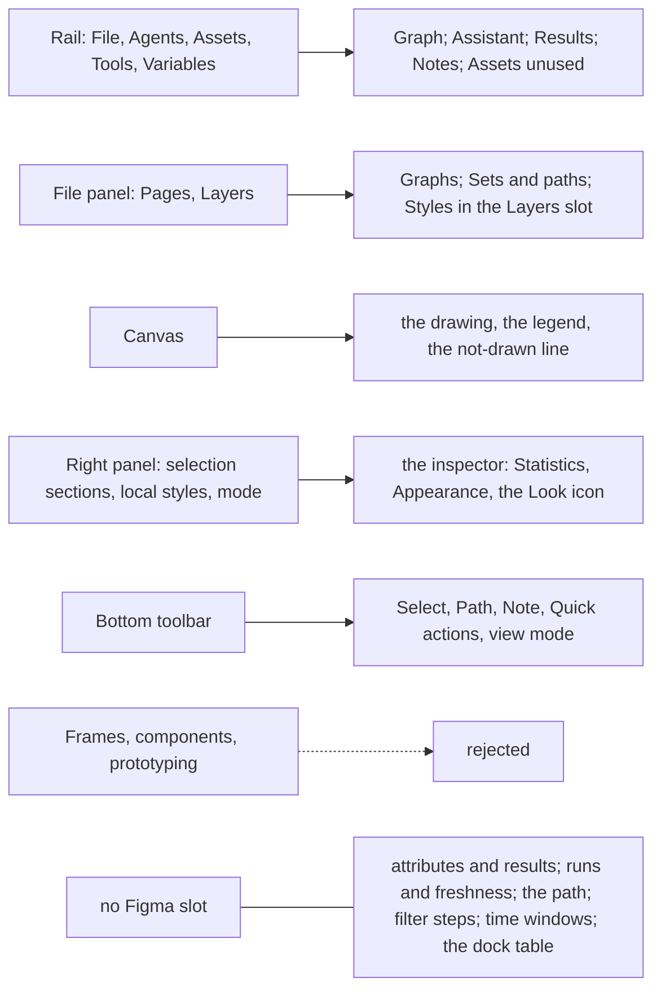

# Figma crosswalk

**Job.** Say how graphty's ontology fits Figma's framework, in both directions: each Figma object
and where it lands in graphty, each graphty object and its Figma counterpart or none, and the one
ledger of every departure from Figma with the graph fact that forces it. **Not here:** placements
(`information-architecture.md`), behavior (`interaction-patterns.md`), row anatomy
(`interface-specification.md`). **Owner:** Figma product designer. **Ceiling:** the README's table.
**Validated by:** walking Figma's object list (`research/figma.md` 2.1) and the model's object map,
each mapped exactly once; and the Figma-fidelity review of `principles.md` 0.

Verdicts: **adopt** (same concept and behavior), **adapt** (same role, changed by a graph fact),
**reject** (no counterpart). A departure, a difference from Figma's behavior on screen, has one row
in section 4.

## 1. Figma's objects, and where each lands

| Figma object | Verdict | graphty | The graph fact behind an adaptation |
|---|---|---|---|
| Organization, team, project folder, drafts | reject | -- | a single-user browser tool; no account space |
| File | adopt | project | -- |
| Page | adapt | graph (one entry in the project), whose Background is its own, as a page's color is (recommended, door 5, Project parts and graph parts) | the graph's inspector holds Background and Layout under the Look icon, then Statistics, denser than a page panel |
| Section, Frame | reject | -- | a graph has no regions or fixed-size containers; a region of interest is a set |
| Group | adapt | set, made by Create set on the group chord, listed where Figma lists groups | membership is many-to-many, so a set contains nothing and the list is flat; a canvas click selects the node, never a set |
| Layer, and its leaf kinds (shape, text, vector, image, boolean group, slice, slot) | adapt | node and edge; a node's shape and label are style channels; the Layers panel's grouping goes to Sets and paths, and its flat list has no counterpart (the dock table is graphty's own) | a node has no single parent, so there is no layer tree; drawn shapes and free text are not graph content |
| Component (main) | reject | -- | nothing in graphty is an instance of a style layer, and a set has no instances or overrides, so set maps to Group |
| Instance, overrides, reset, detach, restore | adapt | no instances: an automatic layer is read-only, and Edit a copy puts an authored layer with the same rows in its place; per-element overrides are entries of the Overrides layer, and Reset on an entry clears it; a reference to a deleted set keeps resolving, with Restore | no style or set inherits from a source (row above); only a result's freshness follows its run as an instance follows its main component (ledger 4.3); a row's returns are the ledger row "Instance reset" |
| Component property | adapt | the field types of the option form, drawn from the catalog's option schema; where the options are edited is section 2's Result and Layout settings rows, not a selected instance's properties | options also take graph objects (a node, a set, an attribute) as arguments, and a costly edit waits for Run |
| Component set, variant | reject | -- | exact and sampled methods are sibling results; a path's kind is derived and shown read-only on its type row, the one borrowed piece |
| Style, Variable (a named reusable value, one value per mode) | adapt | a palette entry, picked by name from a property row; named text styles only once a workflow shows one look reused (`decided-doors.md`, "Named text styles") (until then a text channel holds an inline label record) | a palette is registered by code in 2.x, not authored |
| Variable collection, Mode | adapt | the palette set and the Look: a Look swaps palettes under every encoding, as a mode swaps values under existing bindings, applied from the graph's inspector | one Look per project rather than per frame, because a graph has no frames; a saved view captures the Look, so a print figure and a screen figure live side by side as Figma's frames do |
| A fill or stroke list on one layer | adapt | **style layer**: the paint list lifted off one object and scoped by a selector, stacked, top wins, with an eye, reordered by drag; the stack is listed in **the Layers slot** of the left panel, because graphty has no node tree and the stack is its one ordered, top-wins list (`information-architecture.md` 11) | a graph's paint is decided per element by overlapping selectors, so it has no single Figma counterpart: named reuse comes from Looks, text styles and style files |
| Apply styles and variables (the four-dot grid on a section header; a number field's in-field button) | adapt, the gesture only | on a row that can write (a kept set's or path's Appearance; an offered group's or found path's after its Create set to style; an element selection's, where a constant goes to Overrides and a binding's choice names the set it creates (`interaction-pattern-entries.md` 6.6); a layer's channel row), one picker: the Look's palette colors, then the fitting attributes and results; number rows keep the in-field button | every write lands in a style layer; until the Overrides layer ships (door 31, Overrides, Base style and the stack order), an element selection's Appearance routes instead |
| (none) | -- | **attribute** and **result**: no Figma noun. A Figma Variable holds one value per mode; an attribute holds one value per element, often computed, and does not change with the Look. What graphty borrows is only Apply variable's gesture, binding from a property row | Figma layers carry no per-element data; nor has Figma's Variables table view a counterpart |
| Library | adapt | recipe: definitions without data, copied in on apply with provenance | binding by attribute name replaces shared ids; updates wait for a remote source |
| Plugin | adopt | catalog entry, listed on the Tools panel's pattern | -- |
| Comment | adapt | note | a note targets graph objects, never canvas positions |
| Annotation (Dev Mode) | adapt | a note's quoted values, marked when the live value differs | values are computed and change |
| Version | adopt | data version, in Version history | restoring appends a new version |
| Branch, branch review | adapt | the comparison surface | two states are compared without copying the project |
| Flow, prototype view, interaction (reaction) | reject, except Flow | a saved view is the counterpart of a Flow's starting point; there is no prototyping | presenting is exporting (section 4) |
| Undo history | adopt once Redo can restore a canceled run | undo, with no visible list and no header button; Edit > Undo names the next step; until then the interim Undo history submenu of 4.3 | -- |
| Export setting | adopt | an object's Export section | -- |
| Selection | adapt | selection: elements, or one primary object as a whole; several rows of one type (set, path, item, style layer, filter step or Catalog entry) are focused, not selected (4.2) | a set is a definition whose members are canvas elements, so a selection of several sets would need Mixed rules, which have no meaning |
| Layer-panel filter | adapt | filter step, in the chip's popover | a graph filter changes what is computed, not only what is listed |
| Viewport | adopt | camera; saved only inside a saved view | -- |
| Collaborator, cursor | reject | -- | no multiplayer |

**The fit in one picture.** UI3's regions on the left, what graphty puts in each on the right;
dashed edges are Figma objects graphty rejects, and the last box is what Figma has no slot for.

## 2. graphty's objects, and their Figma counterpart

One row per object of `conceptual-model.md` 1.3. Where each lives is `output-homes.md` 1 alone;
what a click, Enter and the primary command do on its row is `interaction-patterns.md` section 2's.

| graphty object | Figma counterpart | Why it differs |
|---|---|---|
| Project | File | -- |
| Graph | Page | -- |
| Node, edge | Layer | no tree: a node has no single parent |
| Set | Group | membership is many-to-many |
| Path | none as a noun; drawn in Figma's one-layer selection state, whose type row shows the derived kind (section 1, Component set) | a walk's order is graph content Figma has no word for |
| Group, found path | none as a noun; drawn in Figma's one-layer selection state with the sibling stepper, a Set or Path in its offered variant | items belong to one run and leave with it |
| Pair | none | a pair is about an edge that does not exist |
| Attribute | none as a noun; bound through Apply variable's gesture (section 1) | a Figma Variable holds one value per mode, an attribute one per element |
| Data version | Version | -- |
| Result, run | none as a noun; the Results panel is Figma's Tools panel plus the project's results (section 1) | results have runs, scopes and freshness |
| Catalog entry | Plugin | runs can be expensive |
| Filter step | Layer-panel filter | a step changes computation, in order |
| Style layer | a fill or stroke list lifted off one object (section 1) | layers overlap; order is precedence |
| Look | Mode | one per project |
| Layout settings | Auto layout: the method inline on the Layout row, the options in the layout editor popover with the options that change the result first and engine tuning folded under them (ledger row "Auto layout's options sit inline") | a layout runs once over a scope; it never reflows |
| Saved view | Flow | a view restores working state |
| Note | Comment | notes anchor to objects |
| Comparison | Branch review | transient until saved |
| Recipe | Library | binds by name |
| Set collection | none | a list file of many named sets |

Selection and the camera are working state, not objects; Figma's counterparts are Selection and
the viewport (section 1).

**No Figma counterpart at all** (the picture's last box) rests on `principles.md` 1 and 2, and
the table is the canvas's text equivalent (WCAG 1.1.1).

## 3. Where each part comes from

| Part | Taken from Figma | From graph tools and research | graphty's own |
|---|---|---|---|
| Screen layout | rail, left panel, canvas, right inspector, small bottom toolbar, palette, bottom dock, header with one filled button, Minimize UI | the table in the dock (Cytoscape's table panel) | the filter chip in the slot of Figma's Drafts line, under the project name; one legend on the canvas |
| Interaction | selection drives the inspector; definitions open a popover from their row; "+" adds with defaults; no confirmations; one overlay at a time; Quick actions and context menu as routes; Enter and Shift+Enter, Shift+click, marquee, Esc | select from a histogram band (Cytoscape) | a count selects what it counts; a click selects the node, never a set |
| Objects | only things with a body are kept; definitions applied from property rows; a named lasting definition made by a Create command | node, edge, set, path, community, component; induced and edge subgraphs; results as attributes with provenance | the primary-object test; three set kinds with an edge reading; items of a result; notes on graph objects |
| Appearance | style rows like Fill rows; per-property reset; a bound value opens its definition | visual mapping from data (Cytoscape, Gephi) | one ordered stack of style layers; an automatic layer per run; highlights stack |
| Vocabulary | interface words, sentence case, verb plus object commands | every graph and statistics term, as the field's tools and Newman spell it | short plain words for concepts only graphty has |
| Analysis | -- | overview first and search first; compute over a stated scope; weight read as distance, similarity or capacity | the record on every run; freshness and scope marks; the run queue and cost bands |
| History and file | undo covers the document; versions append; a version number and a tolerant reader | analysis provenance; undo as exploration's safety net | data versions; the operation log; identity rules |
| Output | the Export dialog; an object's Export section | present equals export | views capture working state; methods text from the records |

## 4. The departures ledger

The single list of every difference from Figma's chrome grammar and interaction conventions.
"Forced by" names the principle, fixed rule or workflow evidence; "ontology" means
`conceptual-model.md`. Workflow evidence cites a `design/designloom/` workflow (W01 to W25) or
persona. A departure that cannot name a forcing fact goes back to Figma's way (`principles.md` 0).

### 4.0 The forcing facts

**One row per fact.** Each fact is stated once, with every departure it forces named by the start
of that row's Figma cell; the rows below keep each consequence's detail. The target is under 40
facts, and the lint counts this table. Measured when this table was made: 136 detail rows, of
which about 82 name a graph fact, a WCAG criterion or a named workflow as written; the rest are
sorted below, and a row listed as awaiting a fact is re-justified or reverted to Figma's way before
the build slice that draws it.

| Fact | Kind | The departures it forces |
|---|---|---|
| A node has no single parent: membership is many-to-many | ontology | "A layers tree lists every layer"; "Any layer can be hidden, by an eye"; "A child is listed under its parent"; "A click on a group's child"; "Delete on a selected Group"; "Double-click on a layer drills"; "Mod+click selects the deepest layer"; "A selection's type row is one line"; "A multi-row click in the layers panel" |
| A graph has no drawing, only computed positions that move at every layout | ontology | "The bottom toolbar holds about seventeen targets"; "A node's inspector would open with X and Y fields"; "The arrow keys nudge the selection"; "Auto layout reflows live"; "Comments anchor to a canvas position"; "Branch review overlays two versions"; "Canvas content never animates"; "Lasso belongs to vector edit mode"; "The lock chord stops a layer"; "Header row 2 holds the Design and Prototype tabs"; "Effects are static" |
| A filter step changes what is computed | ontology | "The layers panel's filter changes only what is listed"; "A layer is turned off by an eye"; "The left header names the file and its location" |
| Values are computed: they have a scope, can be estimates, and go out of date | ontology; principle 1 | "Library updates wait behind one badged button"; "The inspector shows only editable values"; "An instance whose main component changed"; "Figma marks no value as estimated"; "A value has no status"; "No legend, no import"; "Detach keeps the one value"; "A bound row has hover Detach"; "A Statistics row would be one target"; "A variable row click opens its editor"; "A section header's Apply styles"; "Property rows take typed values"; "The Missing-fonts dialog lists unresolved items"; "Figma's popovers hold no chart" |
| Appearance is written only through style layers | fixed rule (`CLAUDE.md`) | "Local styles never overlap"; "Hovering a style in Selection colors"; "Overrides are listed per instance"; "A frame's default look is its own fill"; "A bound field shows only its variable"; "Selection colors edits each paint in place"; "A layers panel is grouped by hand"; "A style row names a reusable style"; "Reset all changes resets"; "Layer rows carry no color"; `"+" on a Fill section adds`; "Applying a fill style replaces"; "Outlines is a view mode"; "Creating a variable binds it to nothing" |
| Hue on the canvas belongs to data | principle 1; perception | "Selection, hover and marquee are blue"; "Hover draws a 2 px outline"; "The marquee has a blue stroke"; "Items from a shared definition are marked purple"; "A shape carries no edge"; "Branch review marks changes by color"; "Multi-selection: an outline per member"; "Two kinds of canvas drawing" |
| A run can take minutes, fail, and run beside others | principle 2 | "Tools-panel rows run on click"; "Every property edit applies live"; "A property drag previews on every frame"; "Edit > Undo names nothing"; "One plugin runs at a time"; "Menu rows carry only a shortcut"; "No progress is drawn on an object"; "One toast; a new one replaces it"; "A toast is transient" |
| A change can land where the reader cannot see it | principle 1 | "Delete shows no toast"; "Undo gives no feedback of its own" |
| graphty-element is standalone: a bare embed has no host chrome | fixed rule (`CLAUDE.md`) | "A saved page fill is unchanged by the theme"; "Tab on the canvas selects the next sibling"; "The canvas carries no chrome but the toolbar" |
| The table and inspector are the canvas's text equivalent | WCAG 1.1.1 | "Figma has no dock table"; "A file opens behind one blocked-UI loading indicator"; "An unsupported browser gets one message" |
| Keyboard and assistive-technology criteria | WCAG 2.1.1, 2.1.2, 2.4.7, 2.5.2, 1.4.3, 1.4.11 | "Canvas focus is the selection"; "Fields have no resting edge"; "Enter in a field returns focus"; "A layer-row click and a rename's commit"; "Shift+F10 and the Menu key do nothing"; "Tooltips are hidden from assistive technology" |
| Esc and pointer habits that destroy work, which principle 0 does not copy | principle 0, not copied | "Esc in an inspector field returns focus"; "Esc from a pointer-opened menu"; `"+" add buttons and the eye column fire on pointer down` |
| A project in browser storage has one writer and a memory budget | platform | "Any number of sessions edit a file at once"; "A file past its memory limit is locked" |
| In an ordered sequence, position is meaning | ontology | `"+" puts a new item at the top`; "Flows sit in the prototype sidebar" |
| The field's words are the analyst's | principle 4 | "The group chord wraps in a Group"; "A panel section named Typography"; "Appearance holds layer opacity"; "The typography popover's sections"; "Figma explains with tooltips only" |
| Capabilities Figma has no counterpart for: data sources, derived graphs, a model provider, results | ontology | "Every dialog has a Figma counterpart"; "Variables and the Tools panel are separate places"; "Version history lists autosaves" |
| A 3D view needs an orbit | 3D | "The canvas is 2D" |
| Named workflows | workflow evidence | "The page's inspector is thin"; "The Variables table sits on Figma's row pitch"; "Comments are a mode"; "The Actions menu has tabs"; "Resting-inspector rows hold properties"; "The group chord leaves the new group"; "A list inside the right sidebar has no search field"; "A popover opens beside its trigger"; `"+" adds first with defaults`; "A shape's size is Layout's W and H"; "A binding is made from the property row"; "An invalid field reverts silently"; "Swap library matches by name only"; "Enabling a library only adds"; "No inspector lists commentary"; "Instance reset returns an override"; "Auto layout's options sit inline" |

**Recorded exceptions**, not forcing facts, so principle 0's closed list stays closed. Each names
the owner's request; a new one needs the owner's written request with its date, and applies to
chrome only, never to graph behavior.

- "Share is the filled header button": the owner's decision that exporting and presenting are one
  task (date not recorded; to confirm with the owner).
- "The mode control shows every mode": the owner's decision to keep the toolbar small; the
  dimension being a layout setting is principle 6's.

**Awaiting a forcing fact** (each re-justified with a fact above, or reverted to Figma's way,
before the slice that draws it): "Back to files is the main menu's first entry"; "At narrow widths
both side panels keep their width"; "The right sidebar orders a selection's sections"; "A style's
editor header names the style"; "Effects rows paint the object they sit on"; "Typography's fields
are panel rows"; "An invalid number reverts"; "Variables table rows take no hover tint"; "Hover
draws an outline and nothing else"; "Copy then paste duplicates the layers"; "A toast confirms a
keyboard command"; "An error toast states the rule broken"; "A toast with an action never times
out"; "A multi-selection lists every property"; "Layer rows show a layer-type icon".

Moved out, because they are not behavior departures: tabular figures and Inter's identifier forms
are type roles of `visual-language.md` A4; lucide in place of Figma's icons is `visual-language.md`
A7's licensing fact; the scroll wheel now follows Figma's own map.

### 4.1 Structure and places

| Figma | graphty | Forced by | Evidence |
|---|---|---|---|
| The page's inspector is thin | with nothing selected the inspector is the graph's, with a Statistics section; its rows are six headline readings, the Overview row, the Edges and Last import rows, and a Types row when a type role is declared | workflow evidence, form by 5 | top task 1; cost of error overrides rank (`top-tasks.md`); W01 |
| A layers tree lists every layer | no tree of nodes; the object list holds only kept sets and paths | 3 | a node has no single parent; the flat list is the table's Nodes tab |
| Variables and the Tools panel are separate places | the Results panel holds this project's results above the Catalog | 3 | a run lands in the list it started from (`information-architecture.md` 3) |
| A child is listed under its parent | a group is listed in its result's item tab | 3 | partitions produce hundreds of groups |
| Figma has no dock table | the bottom dock holds the attribute table, linked to the selection | workflow evidence; WCAG 1.1.1 | analysis reads values across many elements; the canvas needs a text equivalent; W21, W23 |
| The Variables table sits on Figma's row pitch | the dock's rows sit on `PANEL_GRID.DATA_PITCH`, denser | workflow evidence | graph tables run to thousands of rows; W06, W07 |
| The bottom toolbar holds about seventeen targets | about five: Select (Lasso and Hand in its flyout), Path, Note, Quick actions, the view mode | ontology | a graph has no drawing tools |
| Version history lists autosaves | entries are data versions, applied recipes and opens, plus the autosave's checkpoints once door 95, Project checkpoints across sessions, ships | ontology | a graph's history is its data; undo keeps no browsable list |
| Every dialog has a Figma counterpart | New graph from, Connect to data source and AI provider have none, and follow the Modal pattern | ontology | derived graphs, live data sources and a model provider do not exist in Figma |
| Comments are a mode that replaces the inspector | notes are a rail panel beside a visible inspector | workflow evidence, 3 | reading every note in time order builds the findings; W06, W15 |
| Flows sit in the prototype sidebar | saved views are a section of the Graph panel, in the report's order | workflow evidence, 5 | a view's order is the report's page order; W15 |
| Header row 2 holds the Design and Prototype tabs, whose set follows the mode | the tab slot names the right column's mode while Version history or the comparison surface holds it, as Figma's single Comments tab does, and is empty at rest | ontology | graphty has no prototype; its only right-column modes are Version history and comparison |
| The left header names the file and its location | Not saved and View only sit beside the project name; the filter chip sits under it, in the slot of Figma's Drafts line | 1 | the chip governs what is drawn, listed, computed and read, so it is file-wide state; autosave to browser storage can fail and needs a visible route to Download project file; Figma has no save-state indicator to copy |
| Share is the filled header button; Present sits beside it | Export... is; there is no Present control | recorded exception (below) | exporting and presenting are one task |
| The Actions menu has tabs | Quick actions is one list: recents, commands, then the Catalog as a group | workflow evidence | the Catalog has about two dozen entries; `analyst-alex`, `expert-emma` |
| Back to files is the main menu's first entry | recent projects are in File and on the start screen | 3 | recents are a list of projects, not a place in one |
| The canvas carries no chrome but the toolbar and Help | one legend in a canvas corner, and a not-drawn line beside it while elements are not drawn, both drawn by graphty-element; past the node drawing limit the line carries one action, Narrow the graph..., opening the filter chip's offered steps (`state-matrix.md` 4.2) | 1 | a key's absence misstates values; undrawn elements must be named; a bare count after a load reads as a failed load |
| A file opens behind one blocked-UI loading indicator (declared, not triggered: `design/ui/figma/contradictions-resolved/README.md` 3.10) | only the canvas region blocks, ingestion and painting counted (`state-matrix.md` 2) | 1 | a graph's values are readable before it is drawn |
| The layers panel's filter changes only what is listed | a filter step, in the filter chip's popover, changes what every later run, count and layout is computed on, and the chip shows N of M | ontology | a graph filter narrows the scope of analysis, not a list (`conceptual-model.md` 4.4) |
| Resting-inspector rows hold properties, not commands | the graph's Layout row carries Run | workflow evidence | laying out is an every-session task with no other home at rest; W20 to W22 |
| Any number of sessions edit a file at once | one browser tab holds the autosave lease; another tab opens View only with Take over editing (`state-matrix.md` 2) | 1 | a project in browser storage has one writer; two tabs saving in turn would each silently overwrite the other's work |
| At narrow widths both side panels keep their width and only the canvas shrinks; Minimize UI is the reader's command | under 1100 px the left panel collapses to the rail, keeping the file-name pill with the name, Not saved or View only, and the filter chip; on a laptop the comparison's difference list is behind a toggle (`state-matrix.md` 8) | workflow evidence | at 800 px Figma's rule leaves a 261 px canvas (`design/ui/figma/header-and-modes/README.md`); graphty's dock also takes height; `explorer-elena` |
| A file past its memory limit is locked, after an alert at 90% | the Help > Memory usage reading and the 90% notice are Figma's; past the budget the load or run that would not fit is refused, and the project stays editable (`scale-levels.md` 2) | 1 | graphty's other limits are per concern and leave the data intact; locking the project would punish the analyst for one operation |
| An unsupported browser gets one message for the whole app | the reason sits in the one place that cannot work, such as a canvas without WebGL; the table and inspector keep working (`state-matrix.md` 2) | 1 | every value stays readable without a drawing, so blocking the whole app would hide data that is available |
| A toast is transient | the one running notice stays, with progress and Cancel, while the Results panel is closed | workflow evidence | a run can take minutes, and work in progress out of sight must stay cancelable; W18, W21 |
| Library updates wait behind one badged button | the Results rail button carries a count of failed and not-current results, opening the pinned list; each value keeps its own mark (`state-matrix.md` 2) | 1 | a stale result out of view is otherwise found only by chance; a count on a button, unlike a banner, never competes with the marks on the values |

### 4.2 Selection, objects and editing

| Figma | graphty | Forced by | Evidence |
|---|---|---|---|
| A click on a group's child selects the group | a click always selects the element; Shift+Enter returns only to where the analyst entered from | ontology | membership is many-to-many |
| The group chord wraps in a Group; ungroup; the frame chord wraps in a Frame | the group chord runs Create set; the ungroup chord deletes the selected set and selects its members; the frame chord is unbound | 4 | "group" is a graph word; graphty has no frame |
| Delete on a selected Group deletes its children | Delete on a set or path, from its row or the canvas, deletes only the definition, the members staying and the canvas selection emptying; an item selected on the canvas is not deleted, and the polite region says why (`interaction-patterns.md` 2, [i]) | ontology | a node belongs to many sets, so deleting it through one would change every other set; an empty selection keeps a second Delete from removing data |
| The group chord leaves the new group with a default name, not in rename | the new set's name opens in rename; Esc keeps the default | workflow evidence | a set is found later by its name; Figma's "Group 5" works because the canvas shows the group; W22, W25 |
| A variable row click opens its editor | an attribute row click opens its column menu (Color by, Size by, Filter to, level and role) | ontology | an attribute's values come from the data and are not edited in one place; what an analyst does with an attribute is bind or filter by it |
| A layer is turned off by an eye | a filter step is turned off by a checkbox | 1 | turning a step off changes what is computed, and an eye reads as cosmetic (`interaction-pattern-entries.md` 6.5) |
| Any layer can be hidden, by an eye or the hide chord | no eye on nodes and edges, only on rows that draw something themselves (a style layer, a path's casing; a set's hull has its eye in the set's Appearance); Hide on canvas, on the same chord, sets a node's or edge's visibility, a state separate from opacity as Figma's is, counted on the not-drawn line with Select hidden and Show all, never in the style stack; on a set row the chord always hides the members | 1 | a node in two sets with opposite eyes has no truthful drawing |
| Local styles never overlap | one ordered stack of style layers, top wins each channel | fixed rule: appearance only through style layers | overlapping selectors need visible precedence |
| Creating a variable binds it to nothing | a result's first run adds one automatic layer below the analyst's layers | workflow evidence | 15 of 20 figure-producing workflows encode an algorithm's result; e.g. W20 to W23 |
| Applying a fill style replaces the fill list | an automatic layer is suppressed when an authored layer writes its channel, and the run says so, with Apply anyway (door 26, Whether a finished run paints) | 1 | the analyst must see why a result did not repaint |
| Hovering a style in Selection colors marks what uses it | hovering or focusing a style-layer row puts the hover mark on what it paints; Select painted selects it | fixed rule: appearance only through style layers | Figma's own hover, extended: "which nodes does this touch?" is constant with overlapping selectors |
| Overrides are listed per instance | every override is collected in one Overrides layer, kept first in the stack (`conceptual-model.md` 5.1) | 1 | per-element bypasses hidden in a selection cause "my mapping does not work" (`research/graph-tools.md` 20.4) |
| A frame's default look is its own fill | the Base style layer, always last in the stack | fixed rule: appearance only through style layers | appearance outside the stack cannot be reordered, removed or saved |
| A panel section named Typography | the section, in Figma's place, is named Text | 4 | "typography" is a rejected word (`glossary.md` 7) |
| A section header's Apply styles and variables lists local styles and variables | it lists the current Look's palette colors, then the attributes and results that fit the channel | ontology | a graph's reusable paint is its palettes, and its variables are attributes and results; there are no local color styles |
| A list inside the right sidebar has no search field | the Attributes section carries a filter field past its cap, and the Notes panel's field is Find over notes | workflow evidence | an element's attribute list comes from the data and runs to 40 columns; W20 |
| A multi-selection lists every property with "Mixed", and typing overwrites | Attributes list shared values and one "N differ" row; Appearance shows the winning layer or Mixed, and typing writes the Overrides layer for every selected element as one step | 5; fixed rule: appearance only through style layers | a node carries tens of attributes; a paint write must land in a layer the stack shows |
| A multi-row click in the layers panel is the selection, and the inspector shows "N selected" | several rows of one type (set, path, item, style layer, filter step or Catalog entry) form a **row selection** for bulk commands while the canvas selection stays one object; screen readers hear both as selected, and the canvas selection is announced "on canvas" (`glossary.md` 6) | ontology | a set is a definition whose members are canvas elements, so a canvas selection of several sets would need Mixed rules that mean nothing |
| The right sidebar orders a selection's sections type row, Position, Layout, Appearance, Fill, Stroke, Effects, Selection colors, Export | readings and attributes (Statistics, Attributes, Connections, Members, Memberships) precede Appearance | 5 | graphty's inspector answers what an element is before how it is drawn; a first-click test checks it (`interface-specification.md` 9) |
| The inspector shows only editable values | Statistics are readings, never fields | 1 | a computed value edited by hand would misstate what was computed |
| A selection's type row is one line: glyph, name, actions | two lines, in the form of Figma's page header: the name at full width, then the kind word, verbs and overflow | 5 | a node has no left-panel row, so the type row is the only place the inspector names it; one line leaves about nine characters (`research/interface-checks.md` 3) |
| A bound field shows only its variable | the bound row's legend also names the painting layer ("Color -- Degree color") | fixed rule: appearance only through style layers | the reader must see which layer an edit changes |
| Selection colors edits each paint in place | on a kept object, the object's own layer's row writes; beneath it, rows for every other layer that paints members are read-only and open that layer | fixed rule: appearance only through style layers | members are painted by layers the analyst did not name, so each row must show which layer it changes |
| A layers panel is grouped by hand | no hand groups: the stack is cut by count behind "N more", as Selection colors collapses, and each row names its source as a word; nothing reorders | fixed rule: appearance only through style layers | a hand folder suggests a precedence only the stack order decides |
| A style row names a reusable style; its picker swaps in another style, and its minus detaches it | a painted channel's row borrows only the style row's look: it names the layer that paints the channel and opens that layer, with no swap and no detach | fixed rule: appearance only through style layers | a channel's value is whichever layer wins the stack, so the row can only point at it |
| A popover opens beside its trigger | an editor opened from a menu or Quick actions whose definition's row is out of view opens in the inspector position | workflow evidence | an editor is tuned while the canvas is read, and scrolling to an anchor would move it; W22 |
| A style's editor header names the style | every editor header names its target and kind; the style-layer editor's also carries the eye and Move up and Move down | 1 | an editor that stays open while the selection changes must say whose it is, and "which layer paints this, and switch it off" then finishes from the node's row |
| Figma's popovers hold no chart | the histogram popover | 1 | a distribution is read, not guessed |
| Reset all changes resets one instance's overrides | Clear all overrides clears the graph's one Overrides layer, a graph command | fixed rule: appearance only through style layers | every override is collected in one layer |
| Property rows take typed values | a node-valued option also takes the selection, a set or a pick on the canvas | ontology | an algorithm's source and target are nodes |
| Detach keeps the one value a variable held | Fix at <value> names the value it keeps first, in the layer editor only | ontology | a bound channel paints a value per element, so there is no single value |
| A bound row has hover Detach and no settings | a bound row keeps a settings button that opens its scale's options in the encoding popover, and Fix at sits in that popover's header | ontology | a binding carries a scale (domain, range, bins) that a Figma variable does not, and the value Fix at keeps must be named where the layer's scope is visible |
| Auto layout's options sit inline in its section | the Layout row shows the method; its options open in the layout editor popover, engine tuning folded in place inside it | ontology | a layout method's option schema runs from none to more than ten fields and changes with the method; inline, the inspector would reflow at every change |
| Effects are static; motion belongs to the Prototype tab | edge animation is a per-layer row in Effects | ontology | graphty has no Prototype tab, and a selector scopes animation to some edges |
| A Statistics row would be one target | a reading's number acts as every count does, and the rest of its row opens the reading's editor | ontology | a count is a question about elements; a reading is a definition |
| Auto layout reflows live; Tidy up records nothing | a layout runs once over a frozen scope with a record and seed; entering nodes are placed near their neighbors | 6 | force layouts are stochastic and costly; a node belongs to many sets |
| A node's inspector would open with X and Y fields | one Position row opens the fields, and a commit pins the node | 6; WCAG 2.5.7 | positions are unitless; the row is the single-pointer alternative to dragging |
| "+" adds first with defaults, for data | every data door passes the load step before anything commits | workflow evidence | a wrong mapping at millions of rows costs minutes per retry; W14, W18 |
| "+" puts a new item at the top | filter steps and a recipe's steps append at the end; style layers go on top | ontology | in an ordered sequence, position is meaning |
| Tools-panel rows run on click | a Catalog row that needs an argument, or whose cost band is "a few minutes" or longer, is created unrun with Run focused; a click on an entry whose result is current opens that result and does not re-run it (`interaction-patterns.md` 3.3) | 2 | one accidental click must not start minutes of work |
| Every property edit applies live | in the first release every algorithm option and layout parameter edit waits for Run at every size, and the editor's Run line says so before the edit; filter rules stay live because a new commit supersedes the last; once the element publishes response classes, an edit under the live line applies as it is made and the Run line says that instead (`interaction-patterns.md` 3.3) | 2 | a run or a force layout can take minutes, and one gesture must mean one thing at every graph size |
| "+" on a Fill section adds a second paint | "+" adds the next unset channel; a full section offers Add in a new layer above | ontology | a layer holds one value per channel |
| Appearance holds layer opacity | a node's and an edge's whole-element opacity has its own section, named Opacity | 4 | "Appearance" already names the inspector region that routes paint |
| A shape's size is Layout's W and H; Stroke holds start and end points | a node's Shape section holds size; an edge's Ends section holds head and tail | workflow evidence, ontology | a node's size is usually an encoding; there are twelve end channels; W20, W23 |
| Outlines is a view mode for the whole file | wireframe and flat are per-layer rows in a Rendering section | ontology | a selector can scope them to some nodes |
| Effects rows paint the object they sit on | glow strength is a graph-level row beside Look, not a layer's Effects row | 1 | the element draws one glow strength for the whole scene; a per-layer row would show values not drawn |
| A binding is made from the property row | Color by, Size by, Width by and Label with on a column header, an inspector value row or a result make a style layer | workflow evidence | analysts start from an attribute or a result: the four common moves (color by community, size the hubs, label the top ten, width by weight) each begin there; W04, W20, W21, W23 |
| Typography's fields are panel rows | a text row shows size; the rest, text color in Fill as in Figma, is in a popover | 5 | the label-style field count is `options-and-encodings.md` 2's; no workflow restyles type |
| The typography popover's sections are Typography and Layout, and sections are never nested inside a popover | the label popover groups its fields in five sections, Text, Fill, Stroke, Effects and Placement: Typography renamed Text, Layout renamed Placement, and panel sections nested inside a popover | workflow evidence; 4 | a label's box has its own paint; a label as a child object would add a sub-selection model for the commonest edit; "typography" is a rejected word and Layout names positions; W22 |
| Instance reset returns an override to the main component's value; a paint row otherwise offers only remove | three returns in a row's context menu (`glossary.md` 9): Reset to the value its layer was made with (absent when not kept), Reset to default, and Clear, also the minus button | ontology | no style layer row is an instance (section 1), and a layer row can differ from its source, from the element default, or be unset so the layers below show |
| An invalid field reverts silently; only a duplicate name toasts (`design/ui/figma/flows.md`) | an expression field keeps the typed text and shows the error; names and visual fields revert | workflow evidence | a rule or formula costs minutes to retype; W07, W23, W24 |
| A property drag previews on every frame | past the style-cost limit a style drag applies on release, never held (`scale-levels.md` 2) | 2 | a repaint costs the size of the scene per element |
| An invalid number reverts | an algorithm, layout, scale or import number out of range keeps the typed text, marked invalid with its bound, and blocks Run where there is one (`interaction-patterns.md` 3.2) | 2 | keeping the text lets an expert fix a typo without retyping the value; a live layout meanwhile runs on the last valid value, which the row names |
| Delete shows no toast | a notice with Undo when dependents were detached, the row was out of sight, or a Remove put results out of date | 1 | the change happened where the reader cannot see it (`interaction-pattern-entries.md` 6.4) |
| Swap library matches by name only | the binding step matches by name, then lets the analyst bind each unmatched slot | workflow evidence | attribute names differ across a community's files; W24 |
| Enabling a library only adds | a style file is applied on top, or replaces the style stack, one undo step either way | workflow evidence | a lab re-applying its house style wants its own look; W20 |
| The Missing-fonts dialog lists unresolved items | import mapping lists unsettled columns first, each with three pickers: element kind, level and role | 1 | an unconfirmed level misstates every encoding built on it |

### 4.3 Canvas, keys and marks

| Figma | graphty | Forced by | Evidence |
|---|---|---|---|
| Selection, hover and marquee are blue; components purple | every canvas mark is neutral, told apart by band count, dash and ring (`canvas-drawing.md` 6) | 1 | canvas color is data; no accent clears the shipped palettes |
| A saved page fill is unchanged by the theme (a new file's default in dark mode is unmeasured, `research/study-schedule.md`) | `GraphStyle.background` is that fill when set; when unset the canvas follows the host theme | fixed rule: graphty-element is standalone | a bare embed must look right in both themes |
| Hover draws a 2 px outline, heavier than selection's 1 px | hover is the thinnest mark, a one-tone 1 px hairline after a 2 px gap in the outermost ring (`canvas-drawing.md` 6) | 1 | on a canvas of thousands of marks a passing hover must never out-draw a selection the reader chose |
| Canvas focus is the selection: Tab moves the selection, and no separate focus mark exists | a separate focus mark, a three-band ring after a gap, outside selection and highlights and never dropped by the ring cap (`canvas-drawing.md` 6) | accessibility (WCAG 2.4.7); ontology | the canvas walk moves focus without changing the selection, so focus needs its own mark |
| The marquee has a blue stroke and a translucent fill | a two-tone loop with no fill | 1 | an alpha fill shifts the hue of the data under it |
| Canvas content never animates | layout settling, camera moves and edge flow animate, and honor reduced motion (`canvas-drawing.md` 10) | 6 | movement shows where a node went; a cut layout loses the analyst's place |
| Two kinds of canvas drawing: content and selection UI | three: data, object marks, state marks (`canvas-drawing.md` 6) | ontology | highlights are kept and exported, unlike selection |
| Layer rows show a layer-type icon | one glyph per object type from graphty-element's register; a style-layer row shows its chip in the icon slot, as Figma's styles list shows the swatch (`visual-language.md` A7) | ontology | graphty's objects are sets, paths and results, not frames and shapes |
| Layer rows carry no color | a set row keeps its glyph in the icon slot and carries the paint of the layer that paints exactly that set in a fixed trailing slot before the count, empty when nothing paints it (`visual-language.md` A7) | fixed rule: appearance only through style layers | a set's look is a layer, and the chit shows which paint it has; the fixed slot keeps names aligned |
| Items from a shared definition are marked purple | a recipe or automatic origin is a word in secondary text; no purple anywhere | 1 | a second saturated hue in a row that holds data chits competes with them and reads as data |
| Fields have no resting edge; secondary text is 50% ink | fields carry a 3:1 edge and secondary ink is 55% (compact-mantine `highContrast`) | fixed rule: WCAG 2.2 AA (1.4.3, 1.4.11) | with Figma's values the focus ring and white text on the brand fill measure 2.99:1 and placeholders 2.3:1 (figma-spec 2.9) |
| A shape carries no edge unless one is set | a neutral 1 px fill edge on every node of a layer whose palette has a color under 3:1 on the canvas (`canvas-drawing.md` 4) | 1 | a pale fill on the canvas cannot be found at small sizes |
| Variables table rows take no hover tint | table rows take the hover background under the pointer and on linked hover (filed against `DataTable`) | 1 | linked hover between canvas and table needs a visible row target |
| Hover draws an outline and nothing else | hover also shows the element's label, exempt from the label budget, and the tooltip after its delay (`canvas-drawing.md` 9) | 5 | a node's identity is read without selecting it; values stay in the inspector |
| The canvas is 2D | in 3D a right drag past the drag threshold, or Alt and a left drag (the trackpad and one-button route), orbits; a right press without travel opens the context menu; a plain wheel pans and a Ctrl or Mod wheel, a pinch among them, zooms, as in Figma | 3D | a 3D view needs an orbit gesture, and a trackpad has no easy right drag; the wheel keeps Figma's meaning because a browser cannot tell a mouse wheel from a two-finger drag (`element-needs.md`, "The canvas input map") |
| The arrow keys nudge the selection | the arrows walk from the focused node to a neighbor | ontology | positions are unitless; a graph is walked along its edges |
| Tab on the canvas selects the next sibling and never leaves | Tab always leaves the canvas, walk or not; the member-walk keys step through the selection (`interaction-pattern-entries.md` 9.2) | fixed rule: standalone; WCAG 2.1.2 | a bare embed has no region-cycle chord, and a Tab that stepped a 400-member set would take hundreds of presses to leave |
| Enter in a field returns focus to the canvas | Enter keeps focus in the field | accessibility | returning after each commit makes a keyboard user re-find the next field |
| A layer-row click and a rename's commit return focus to the canvas | focus stays on the row | accessibility (WAI-ARIA tree, grid and listbox) | a keyboard user would re-find the row after each commit, and a stray key on the canvas acts on the selection |
| Esc in an inspector field returns focus to the canvas | focus goes to the field's section heading, where Delete does nothing | `principles.md` 0, not copied item 2 | an expert editor user's habitual Esc, Esc, Delete would remove a hard-built selection; the double-Esc keystroke task tests it (`research/study-schedule.md`) |
| Shift+F10 and the Menu key do nothing | they open the context menu | accessibility (WCAG 2.1.1) | the platforms' keyboard route to a context menu |
| Double-click on a layer drills into its children | double-click renames on rows and does nothing on the canvas | ontology | a node has no single parent, so there is nothing to drill into |
| The lock chord stops a layer being selected | the lock chord is unbound | ontology | Pin fixes a node's position, which is not lock; one chord with two meanings would teach the wrong one |
| Copy then paste duplicates the layers, and a copied style carries into another file | copy with elements selected puts their ids on the clipboard, and paste on a loaded graph selects the matches; copy on a style-layer or rule-set row writes a style or recipe profile that paste reads as Apply style file on top...; fixed sets, paths and saved views have no copy | ontology | an id carries no values to place, and a duplicated node is a data edit with a made-up identity; a fixed set's ids mean nothing in another project, so a recipe is the portable form |
| Undo gives no feedback of its own | a notice with the undo label when the undone effect is out of sight (`interaction-patterns.md` 3.4) | 1 | the change happened where the reader cannot see it |
| Esc from a pointer-opened menu returns focus to the canvas, so a second Esc deselects | Esc from any overlay returns focus to its trigger; an Esc that closes an overlay never also clears the selection | `principles.md` 0, not copied item 2 | a habitual double press would lose a hard-built selection |
| "+" add buttons and the eye column fire on pointer down | "+" fires on click (pointer up); the eye column's sweep previews while the pointer is down and commits on pointer up | `principles.md` 0, not copied item 3; WCAG 2.5.2 | a press dragged off must cancel |
| Mod+click selects the deepest layer | Mod+click on the canvas toggles, as Shift+click does | ontology; workflow evidence | a node has no nesting to reach into, and Gephi and Cytoscape users add with Mod+click; `analyst-alex`, `genomics-cytoscape-user` |
| Lasso belongs to vector edit mode | Lasso is in the Select tool's flyout | ontology | selecting a region of nodes is selection |
| The mode control shows every mode and never edits the file | one view-mode button showing the current mode; 2D and 3D write the Layout row's dimension | 6; recorded exception (below) | the toolbar stays small; the dimension is a layout setting |
| Edit > Undo names nothing | Edit > Undo and the undo notice name the next step, in its cancel form while a run is pending | 2 | undo cancels a pending run before it reverses a step, so the reader must see which will happen |
| Figma explains with tooltips only | an (i) beside a technical term defines it | 4 | the field's terms need definitions on request |
| One plugin runs at a time | a second run waits as Queued on its row, except that a run under a minute starts beside one of "under an hour" or more | 2 | exact runs are long and analysts start several |
| Menu rows carry only a shortcut | a command expected to take 10 s or more carries a band word | 2 | Figma has no routine long operations |
| An instance whose main component changed waits in library updates until accepted | a result is to its run as an instance to its main component: Out of date marked at each value, Re-run its accept; the legend and domain re-derive, since the values are data; a deleted run offers Restore run, as Restore Component | 1 | a stale value reads as current unless marked |
| Figma marks no value as estimated or scoped | scope, exactness and variant marks on computed values | 1 | computed values can be estimates or partial |
| No progress is drawn on an object (`research/figma.md` 4.9) | progress and Cancel on the running row | 2 | several runs go at once |
| Multi-selection: an outline per member and one union box | over the selection cap, one hull with a count badge | 1 | tens of thousands of rings bury the drawing |
| Comments anchor to a canvas position | a note anchors to graph objects and stores no position | 3, 6 | positions move at every layout |
| No inspector lists commentary | a Notes section in each object's inspector, present once a note targets it | workflow evidence | taking a note is an every-session task; W06, W09, W15 |
| Branch review overlays two versions | an overlay only on aligned positions | 6 | a node-link drawing has no fixed geometry |
| Branch review marks changes by color | comparison membership (A only, B only, both) is drawn by form | 1 | canvas color is data (`canvas-drawing.md` 11) |

**Kept conditionally:** the interim Undo history submenu in Edit (`interaction-patterns.md` 3.4).

### 4.4 Words

| Figma | graphty | Forced by | Evidence |
|---|---|---|---|
| A toast confirms a keyboard command with no visible effect ("Rulers visible") | no state-confirmation notice | 5; `interaction-patterns.md` 3.5 | every graphty toggle changes the canvas or a visible control, so a toast would repeat what shows and take the one toast slot |
| An error toast states the rule broken ("Variable names must be unique within a collection") | kept for a rename (`name.duplicate`), because the rename has closed; a rule broken in an open expression or option field shows under it; every other error reads "Could not {verb} {object}: {cause}" (`content-design.md` 4) | 1; `interaction-patterns.md` 3.2, 3.5 | an open field keeps the typed text to write under; a data failure needs its object and cause |
| One toast; a new one replaces it and nothing comes back | the running notice yields the one slot to a notice and returns when the notice ends | 2 | a long run must stay visible without a second slot |
| A toast with an action never times out | a notice whose action is reachable elsewhere times out; only one whose action exists nowhere else stays (`interaction-patterns.md` 3.5) | 5 | graphty's notices carry actions far more often, and a sticky one would hold the one slot |
| A value has no status | a state line under a result, ending in a Details disclosure for the method record | 1 | a computed value goes out of date and has a scope |
| No legend, no import | legend notes about the picture; report lines for an import or an applied file | 1 | the drawing encodes data, and an import can lose rows |
| Tooltips are hidden from assistive technology | announcements in live regions; a tooltip repeats a fact found elsewhere, and a disabled control's reason is also its description | accessibility | `design/ui/figma/flows.md` 9, "Do not copy" |

## 5. Canvas marks and states, from Figma's side

Canvas marks (`design/ui/figma/canvas-selection/README.md`); graphty's forms are
`canvas-drawing.md` 6.

| Figma mark | Verdict | graphty |
|---|---|---|
| Selection: a thin blue box | adapt | a two-tone ring or casing |
| Hover: blue, heavier than selection | adapt | a one-tone hairline after a gap, in its own ring |
| Focus: none apart from selection | adapt | a three-band ring after a gap, outside every persistent ring |
| Children of a selected layer: tinted rows (selected secondary) | adopt | member rows of the selected set, group or path take the selected-secondary role; the canvas draws the member ring |
| Multi-selection: an outline per member and one union box | adapt | a ring per element; over the selection cap one hull with a count badge |
| Group selected: its bounds | adopt | a selected set whose hull is drawn is marked by the hull |
| Marquee: blue stroke and translucent fill | adapt | a two-tone loop, no fill |
| Resize, radius and size badges; distance hints and smart guides | reject | nodes are sized by channels; positions are computed |
| Frame name labels | adapt | hull and group labels |
| Component purple, Agents sparkle, multiplayer cursors | reject | a second hue would read as data; no multiplayer |

States: each state's verdict (adopt, adapt with its row in 4.1 or 4.3, or none with its reason)
is the Figma column of `state-matrix.md` 2, and this ledger holds the rows it cites.

## 6. Main menu, rail and header slots

| Figma slot | graphty | Why |
|---|---|---|
| Actions... | Quick actions... | the same instrument |
| File | File, holding every loading command | -- |
| Edit | Edit: Undo, Redo, the interim Undo history, Select all, Previous selection, Copy ids | Select neighbors walks the graph from the selection, so it is a Selection verb |
| View | View: the display toggles | Memory usage sits in Help, where Figma keeps its memory meter |
| Object | Selection: verbs on the current selection | "object" names a primary object in graphty |
| Plugins; Libraries | Algorithms; Recipes | a plugin is code; a library is reserved |
| Help | Help: Keyboard shortcuts, Documentation, Open sample, Memory usage; the Help button is a second route | -- |
| Text, Arrange, Vector, Widgets | none | no text frames, manual arrangement or vectors |
| Rail: File, Agents, Assets, Tools, Variables | Graph takes File; the Assistant, Agents; Results takes Tools; Notes; Assets and Variables unused | attributes and results have no Figma noun (section 1) |
| Right sidebar: Boolean operations | Union, Subtract, Intersect, Exclude on focused set rows | set algebra is the one operation both ontologies share exactly |
| Bottom toolbar: the mode control | the view-mode control in the same place | -- |

## Sources

- `research/figma.md` 2.1 to 2.4, 2.7, 4.3, 4.4, 4.9, 4.12, 4.14 to 4.16, 5.5, and navigation
- `design/ui/figma/flows.md` 5 and 7; `canvas-selection/README.md`;
  `header-and-modes/README.md` (the page-level "Apply variable mode" control);
  `right-sidebar-selection/README.md`
- Figma Help: "Adjust your zoom and view options"; "Navigate Figma Design files"
- `conceptual-model.md` 1.3; compact-mantine `design/figma-spec.md` 10.6
- Open decisions cited (`one-way-doors.md`): 39, Selection as element state, and the cap
