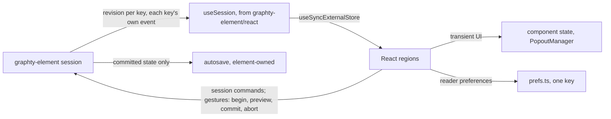
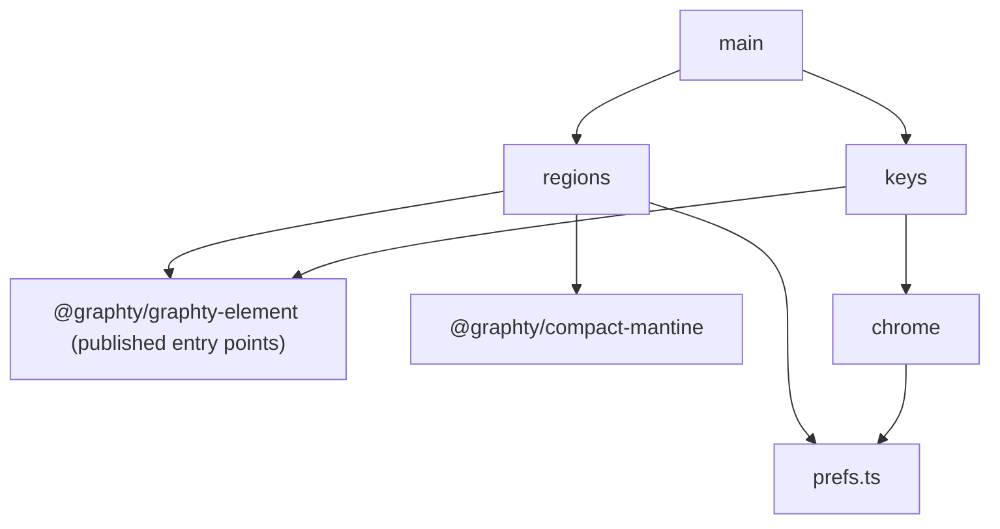

# Implementation mapping

**Job.** Bind the framework to code: who owns which state, how the app reads and writes
graphty-element, where gestures and keys are handled, which published API and slice each template
card uses, how the app's code is divided, the order the pieces are built in, and how each layer is
tested. Each decision is a short record: a status, its context, the decision, its consequences and
the alternatives that lost.
**Not here:** design decisions (every other framework document owns its own; when this document
disagrees with one, the owner changes, not this copy); what graphty-element must publish
(`element-contract.md`) and the work it still owes (`element-needs.md`); which door gates which
slice (`one-way-doors.md`, "The queue"); the selection kinds (`interface-specification.md` 4.0);
components, their variants and the slice each change lands in (`interface-specification.md` 1.2,
2.2, 7.2 and 7.3); the protocol of sessions with people (`research/study-schedule.md`); PR numbers
and dates for individual slices (the issue tracker). **Owner:** front-end architect. **Ceiling:**
the README's table. **Validated by:** section 12.

**Status, the one place it is kept.** This line tracks the latest graphty-element release, not a
commit: 2.6.1 (published 2026-09-28 UTC, a dependency update over 2.6.0, which carried the sets
work of PR #540 and computes every built-in algorithm over its run's scope), checked on
**origin/master at `9fc948ee`**, whose later commits change no element code. The local checkout
these documents sit in is behind origin/master and lacks `design/sets/`, so every code citation in
the framework is to origin/master at this commit unless it names another. The undo design is on the
`feat/element-undo` branch (PR #553, open). compact-mantine is at `a6b63bf6` on the PR #409 branch
(open). Other
documents cite this line instead of restating branch status. Every element claim here says which
timeline it belongs to: **master** (the release above), **PR #553**, **door n** (`one-way-doors.md`),
or **proposed** (not in any branch). graphty file references and line counts are at `9fc948ee`.

**The shape in one picture.**



**The two filters in code.** `session.visibility` on master is the data scope every run reads by
default, not the render set (its file header says so), and no drawn state exists yet; door 86, Whether an element is drawn
recommends the drawn state as `session.drawing` and the filter steps as `session.filters`, so the
two are never one name. A layout call takes a scope on master today; the two layout scopes the
owner's example needs are element work in slice 6 (`element-needs.md`, "A layout scope carried in
the one layout settings per graph"). The owner's questions are indexed only in `README.md`.

## 1. State ownership

**Status:** accepted.

**Context.** The app must hold no copy of element state: anything a third-party consumer would
also need is graphty-element's (`CLAUDE.md`, "Architectural Principles"). Today the app holds
several copies (section 8).

**Decision.** The app keeps exactly two kinds of state. App state that fits neither is a
workaround.

| State | Owner | Why |
|---|---|---|
| The graph, data versions, attributes, results, runs, sets, paths, style layers, filter steps, views, notes, undo history, the project's own overview recipe; the graph on screen and the camera, saved as the project's reopen state | graphty-element (the session) | graph state; a bare embed needs all of it |
| The selection of elements, and of one set, path or item as a whole | graphty-element (`session/selection/SelectionApi.ts`, master; objects are door 39, Selection as element state, and the cap) | every consumer reads it |
| The tool, the gesture in progress and the walk's focused node | graphty-element (`element-needs.md`, "`interaction:changed { tool, gesture, walkFocus }`") | a toolbar that tracked its own clicks would hold a shadow copy |
| The project autosave; the assistant's providers and keys | graphty-element (`element-contract.md` 15, "The autosave"; the `@graphty/graphty-element/ai` entry point, master) | an embed needs them too; the app draws the dialog and reads and writes through the element |
| **Transient UI:** which popover is open and its anchor, which list rows are focused, hover, scroll | app: React component state and compact-mantine's `PopoutManager` | chrome; the inspector never reads it, because it is a function of the element's selection alone (`interaction-patterns.md` 3.1) |
| **Reader preferences:** dock tab and height, section open states, theme, reduced motion (handed to the element's `reducedMotion`, proposed: `element-needs.md`, "A `reducedMotion` property"), the acceleration policy (handed to the element's `acceleration`, which the element never persists: `src/graphty-element.ts`, the `acceleration` getter, master), and a *reference* to the reader's default overview recipe | app, one versioned object under one `localStorage` key (section 6) | the reader's own choices, per browser |

**Identity rule.** App state refers to an element object only by its id, never by holding the
object or its record. The element mints ids for sets, style layers, runs, views, notes, filter
steps and the project, and for a found set or path before it is kept, so Keep, undo and the
"no longer shown" announcement all name one object. The form of those ids is door 89, The form of element-minted ids. When a
change event's cause is undo, redo, restore or rollback, any surface holding an id that no longer
exists closes itself and returns focus by the rule in `interaction-patterns.md` 3.6. One hook,
`useIdGuard(id)` from `@graphty/graphty-element/react` (proposed), does this for every surface of
every React host.

**Consequences.** A value the app wants to cache because a read is slow is a performance defect in
the element and is filed there. There is no state library: nothing is left to put in one.

**Rejected.** A Redux or Zustand store mirroring the session (a second source of truth, and a
cache the element cannot invalidate); React context holding element records (the same copy, with
worse update granularity).

## 2. Reads and writes: one hook over revisions

**Status:** proposed; element work in slice 0.

**Context.** React's `useSyncExternalStore` needs a snapshot that compares equal when nothing has
changed. Master's `SessionEventMap` (`src/session/types.ts:422`) has seven events: `run:changed`,
`selection:changed`, `visibility:changed`, `style:changed`, `style:problem`,
`capabilities:changed` and `set:changed`. None fires when data loads: only the DOM element raises
`data-loaded`, so a headless `createGraphSession()` cannot tell a subscriber its graph changed.
PR #553 adds `project:changed { slices, cause }` over a `ProjectSlice` list (`graph`, `config`,
`layout`, `pins`, `arrangement`, `runs`, `styles`, `visibility`, `sets`, `views`;
`session/types.ts:676` and `:692`), which by design leaves out the selection, a run still
computing, the camera and hover. So a hook over project slices alone gives the inspector, the
toolbar, run progress, the undo label and the acceleration chip nothing to read.

**Decision.** The element publishes `session.revision(key)`, a number that increases on every
change to that key's state, data loads included, over an **open union of keys**: the project
slices, plus `selection`, `progress` (runs still computing), `interaction`, `history` and
`capabilities`. Each key follows its own event. Before PR #553 merges, the element maps master's
events onto keys, in element code: `run:changed` to `runs` and `progress`, `selection:changed` to
`selection`, `visibility:changed` to `visibility`, `style:changed` to `styles`, `set:changed` to
`sets`, `capabilities:changed` to `capabilities`, and the new headless data-load event to `graph`;
`style:problem` is an error (below), not a revision. The hook ships from
`@graphty/graphty-element/react`, the entry point master reserves for React glue, with React an
optional peer dependency (`element-needs.md`, "React glue in `@graphty/graphty-element/react`"):

```ts
// @graphty/graphty-element/react (proposed)
export function useSession(session, key: KeyWithEvent) {
  const subscribe = useCallback(cb => session.on(EVENT_OF[key], cb), [session, key]);
  return useSyncExternalStore(subscribe, () => session.revision(key));
}
```

- `subscribe` is memoized on `[session, key]`, because React resubscribes whenever it receives a
  different function (React documentation, `useSyncExternalStore`).
- `KeyWithEvent` names only the keys whose event exists in the installed element, so a key with
  no event yet (`interaction` before slice 1, `history` before PR #553) is a type error, never a
  subscription to a revision that cannot change.
- Components read synchronous reads directly during render (`session.sets.list()`). A number is
  always a correct snapshot, so no host keeps a copy of element state.
- **A read declares what it depends on.** The element publishes each read as `{ keys, get }`, and
  the hooks take the read, never a key: `useSessionRead(session, read)`, whose snapshot is the sum
  of the declared keys' revisions (each only increases, so the sum moves exactly when one does). A
  scoped statistic depends on the graph, the filters and the runs; an Appearance row on the
  selection, the styles and the graph; no host has to know that, and a missed key cannot show a
  stale value. A contract test holds that a read's value changes only when a declared key moves.
- **An asynchronous read reaches render through the same hook**; the element memoizes and dedupes
  it (`element-contract.md` 14, the one rule), so two sections asking for one scoped statistic
  compute it once. The hook calls `get` when a declared key's revision moves, holds the resolved
  value in component state tagged with the revision it was read at, discards it when the revision
  moves again, and returns `{ status: "loading" }` until the new value resolves, which the
  section draws as its loading row. That value is transient UI state: it never answers a read the
  element was not asked, and it never outlives its revision.

The key names, the open-union rule and both hooks are additive names (`element-needs.md` 3).

**Consequences.**

- **During a gesture every getter returns committed values**; the scrubbed field reads the preview
  through the handle's `value()`, and the element draws it. Any other surface that re-renders
  mid-scrub for its own reason (a run's progress, its own state) reads the committed value, so two
  parts of the screen never disagree (section 3.2).
- Slow reads (scoped statistics, a windowed row read) are asynchronous in the element and reach
  render through `useSessionRead`; the section shows its loading row, and the app never computes a
  stand-in.
- "Mixed" is one element read, never an app loop over the selection (`element-needs.md`, "A Mixed
  read").
- **Errors** arrive as rejected promises and `style:problem`. One listener routes them to the
  notice slot; the notice text is the element's reader cause. Each place has its own error
  boundary (section 10); where focus goes when one draws is `interaction-patterns.md` 3.6.
- **Announcements** are made by whoever made the change. The element owns one polite and one
  assertive region per document when the host provides none; an app toast that repeats an element
  announcement sets `Toast`'s `live="off"`, so it is heard once.

**Rejected.** The rejections of the published shape (stable read identity, one memoized promise per
read for React's `use()`) are `element-contract.md` 14's; this section keeps the host-side ones. *A read cache in the app* (a store that answers reads without the element, outlives
a revision or is shared between components): the most load-bearing workaround the app could hold.
*`useSession` or `useSessionRead` in the app*: every React host would write the same hook (`CLAUDE.md`: "Anything in
the app that another consumer would have to reimplement is in the wrong package"). *Revisions over
`ProjectSlice` alone*: it leaves out the state the inspector reads.

## 3. Writes: commands, gestures and keys

### 3.1 Commands

**Status:** accepted; the registry lands in slice 2b.

**Context.** Menus, Quick actions, tooltips, the type-row verbs and the shortcut sheet all list
commands, and a bare embed needs the same list.

**Decision.** Every write is a session command; nothing mutates a mesh, material or node object
("Graph Styling" in `CLAUDE.md`). **Intent commands** (Filter to neighbors, Show in table) live in
graphty-element with an id, a label, an argument schema and availability with a reason
(`element-needs.md`, "Intent commands in graphty-element"). Once that list ships it is the only
source of command labels, ids and availability; the command register in `output-homes.md` 3 is its
design seed until then and is then replaced by a listing generated from it. **Availability is a
synchronous, cheap read**: a menu and the shortcut sheet are drawn inside one keydown, and an
asynchronous answer would open a menu on stale state. Menus, Quick actions (compact-mantine's
`QuickActions`, fed a `QuickAction[]` built from the list), tooltips, the type-row verbs and the
shortcut sheet are generated from the list. **Before the registry, there are no menus.** Slices 0
to 2 ship no menu, no Quick actions and no type-row verb; they have the element's own canvas keys and
the app's chrome chords only, so no app code ever authors a graph command's label, id or
availability. The app's chrome commands (panel toggles, Minimize UI, about five) are plain
handlers whose chords are registered through the element's dispatcher (section 3.3), so the
dispatch test sees every stage.

**Consequences.** A label changes in one place, the element, and every host sees it. The first
menu and Quick actions arrive together in slice 2b.

**Rejected.** An app-side command register kept in step with the element by a two-way name check
(a deliberate workaround with its own maintenance); a registry object for five chrome commands.

### 3.2 Gestures

**Status:** proposed. Element work in slice 4b, which waits for PR #553. The evidence below is
unreproduced until its script is committed to `research/scripts/`, pinned to the PR #553 commit it
drove; the undo design's owner is not asked to reopen its rejection before then.

**Context.** A person's edit is bounded by pointer-down and pointer-up, or focus and commit, not
by milliseconds. PR #553 merges an edit into the previous step when both share a merge key and it
comes within `coalesceMs` (1000 ms) of the last merge, and a merged chain stops at 5000 ms from its
first edit (`History.ts:37-43`, `:278-285`). Its rejected-alternatives table turns down
gesture-keyed merging because "every consumer would have to report gesture boundaries"
(`design/undo/undo-design.md`, around line 2587). Master has no `session.transaction`, so nothing
below can run before PR #553 merges.

**Evidence (unreproduced).** A simulation drove PR #553's `History` class on a fake clock, one move
every 16 ms, with a layout reaching rest at 400 ms and an autosave at 600 ms in every scenario:

| Scenario | Correct steps | Merge by time (today) | Merge by pointer-up | Gesture handle |
|---|---|---|---|---|
| One press: drag, hold still 1.2 s, drag, release | 1 | 2 | 1 | 1 |
| Two drags 1.2 s apart | 2 | 2 | 2 | 2 |
| Two drags 0.8 s apart | 2 | 1 | 2 | 2 |
| One slow drag lasting 6 s | 1 | 2 | 2 (the 5 s cap splits it) | 1 |
| One press; a run records its own step mid-drag | 1 | 3 | 2 | 1 |
| Two drags; a run records its own step mid-drag | 2 | 3 | 3 | 2 |

Every approach autosaved opacity 59, a value the reader was still dragging through.

**Decision.** A host control opens a gesture on press or focus and closes it on release or Enter:

```ts
const g = session.beginGesture(label, key);
g.preview(command); // drawn live by the element; records nothing; changes no revision
g.value();          // the preview, readable only here; every getter returns committed values
g.commit();         // one undo step, one project:changed
g.abort();          // restores the before-state
// Two kinds (interaction-patterns.md 3.6): pointer-held aborts on Esc, pointercancel or unmount;
// focus-opened commits on blur and aborts on Esc or unmount.
```

- It is built on PR #553's `session.transaction` (`GraphSession.ts:521-528`), which the element
  already uses for its own node drag. A transaction member's writes are visible to getters at once
  there, so the element keeps a committed view while a gesture is open (getters resolve against the
  state from before it) and only the renderer reads the preview; `project:changed` fires only when
  the transaction seals (`Dispatcher.ts:1374-1390`, `:1844-1855`, `:1936`). A node drag's position
  readout therefore holds until release, when the drag becomes one undo step.
- A transaction locks only ids in the `graph` and `pins` slices (`Dispatcher.ts:70`). Layout and
  algorithm runs declare value keys (`commands/layout.ts:177`, `commands/algo.ts:109`), so a scrub
  never blocks a run. A plugin algorithm with no catalog descriptor (`commands/algo.ts:121`)
  declares the whole `graph` slice and is refused while a node-position gesture holds node ids.
- The canvas's own drag, marquee and lasso use the same handle; `coalesceMs` stays only for script
  callers that never open a gesture.
- **A save writes committed state only.** While a gesture is open the autosave waits (door 88, The autosave's envelope).
- The host side is compact-mantine's existing `GestureHandlers` (`src/types/events.ts`), extended so
  the end reports commit or cancel and keyboard entry opens and closes a gesture, and adopted by
  the fields that scrub, `ComboInput` (numeric) and `PanelField` (`interface-specification.md` 7.2,
  the `GestureHandlers` row). It lands in slice 4b, in the same pull request as the element handle
  it feeds, so the two are tested together from the first commit.
- **Proof before merge:** an element test on the PR #553 branch that abort restores the
  before-state, that a preview changes no revision, that a read by any route but `value()` returns
  the committed value mid-gesture, both gesture kinds' end rules, and the six scenarios above as
  contract tests.

`beginGesture` is a session method tagged `@experimental`, with its types exported from
`@graphty/graphty-element/session`, until the API steward takes the names (`element-needs.md` 3).

**Consequences.** Slice 4a (rank) runs on master and changes no field: `ComboInput`'s `onChange`
already commits once, at a step or at the end of a scrub (`inputs/ComboInput.tsx:41`), and no
field previews. Scrubbing that previews arrives in 4b.

**Rejected.** The time window alone; pointer-up feeding the existing merge key (it also makes every
consumer report boundaries, the cost the undo design's rejection avoids); a host holding a bare
transaction open for a drag without abort on `pointercancel` (it stays open when the pointer is
lost); the compact-mantine callbacks shipped in 4a, unused until 4b (a change nothing exercises
for a whole slice, when one pull request can land both sides); a snapshot-and-restore handle on master first (element code written to be deleted when
PR #553 merges, under a published name).

### 3.3 Keys

**Status:** accepted.

**Context.** Key dispatch is `interaction-pattern-entries.md` 9.3, which owns the stages and the rule
that the element never listens on the document.

**Decision.** Where each stage's code lives:

| Stage | Code |
|---|---|
| A, a gesture in progress | graphty-element, reading its interaction state |
| B, the focused field | the compact-mantine component |
| C, the top-most overlay | Mantine `Menu`, `Combobox` and `Modal`, then compact-mantine's `PopoutManager` |
| D, the canvas | graphty-element, on its focus target, including the canvas rungs of Esc, so a bare embed deselects on Esc (door 65, The default keymap and tools) |
| E, everywhere else | the element's opt-in dispatcher, `attachKeymap(session, root)` (proposed), which a host attaches to a root it chooses, with `useKeymap` in `./react` |

**The dispatcher is element code.** It reads the published keymap (door 65), skips a
`defaultPrevented` keydown, applies the focus-context rules of `interaction-patterns.md` 3.6 and
`interaction-pattern-entries.md` 9.3, issues commands by name, and takes a host's extra chords, so every host gets the same
dispatch (`element-needs.md`, "An opt-in key dispatcher"). The element still never listens on the
document by itself: the host chooses the root. The app's `keys.ts` only registers its chrome chords
through it.

**A handled key stops.** A stage that acts on a key calls `preventDefault`; every later stage
skips a keydown whose `defaultPrevented` is true. `PopoutManager` breaks this today:
`popout/hooks/useEscapeKey.ts` listens on `document` and never checks `defaultPrevented`, so one
Esc closes a Combobox and the Popout around it and still reaches the app. The fix keeps one
listener, returns when `defaultPrevented` is set, and acts only when the event target is inside the
top-most popout or one of the portal dropdowns `useClickOutside` already treats as inside
(`[data-combobox-dropdown]`, `[data-menu-dropdown]` and the rest). Whether an Esc from the canvas
reaches an open editor is `interaction-patterns.md` 3.6's rule, which the fix follows. A play test
presses Esc inside a portaled Combobox nested in a Popout. The ledger row is
`interface-specification.md` 7.2's.

**Implementation choice (two-way).** The canvas state chart of `interaction-patterns.md` 3.8 is a
plain transition table in the element (`Record<State, Record<Event, State>>`), exported so tests
can walk it. At about twelve states a statechart library costs more than it saves; reconsider past
about thirty.

**Consequences.** The new shell never gets an Esc ladder of its own. Today's (`bindings.ts`,
`ESCAPE_LADDER`, 1,111 lines in all) is deleted with the old shell (section 8).

**Rejected.** A document-level listener in the app for every stage (it would answer keys the
element and the overlays already handled); a stage E dispatcher in the app (the `defaultPrevented`
and focus-context rules are generic, so every host would rewrite them).

## 4. Routing and the URL

**Status:** accepted; the grammar is door 34, A shareable URL, open, in the queue's slice 7.

**Context.** A link to graphty is a published contract, so its grammar is a door, and the door is
decided with the recipe files it would carry.

**Decision.** No router: the app is one page with modes. The URL is read once at startup and handed
to the element's load. Until door 34 is decided the app reads no URL parameter except the temporary
`shell=new` switch (section 8), which is not part of the grammar and is ignored after the switch.
Data is opened from a file picker, drawn by the start screen card (`interface-templates.md` 19) without its recents list
until the autosave lands in slice 3. The grammar, what a link may carry and its rejected alternatives
are door 34's.

**Consequences.** Slices 0 to 6 need no door about links; a test harness loads fixtures through
the file picker (Playwright's `setInputFiles`) or the element's load.

**Rejected.** A hash router: the app has no pages to route between.

## 5. The inspector, the editors and the option forms

**Status:** accepted, except where a card part is marked proposed.

**Context.** Every template card of `interface-templates.md` is drawn from published element
reads and commands and from compact-mantine components; this section says which.

**Selection kinds.** The inspector is a lookup from the kinds in `interface-specification.md` 4.0
to their sections, a pure function of the element's selection over ids and kinds.

**When a section is done.** A section ships complete for the selection kinds and scale classes
that its slice's element work supports; a kind whose read has not landed shows the inspector's
empty slot (section 7). In the section's last slice, the one that lands its Mixed read, it must
have all five: its rows for each selection kind; its Mixed state; its UI-stack states (blank,
loading, partial, error, ideal; Hurff); its behavior at each scale class of `scale-levels.md`;
and its entries in the command list.

**Cards.** Each template card binds here by its number. A card names only published entry points
(`@graphty/graphty-element`, `/session`, `/catalog`, `/commands`, `/ai`, `/react`, `/webgpu`;
`/commands` holds the intent commands' data, free of the DOM, and the key dispatcher publishes from the main entry, door 91, Where intent commands publish, issue #337) and the element's
own published methods, never an internal class. Which component draws each region is
`interface-specification.md` 1.2, the authority for components. The last column names each element
need a part waits on; the slice that lands it is section 9's table, the one list, and the part is
built in that pull request and is absent until then.

| Card | Element reads | Element commands | Waits on |
|---|---|---|---|
| 1 Nav rail | whether an assistant provider is configured (`@graphty/graphty-element/ai`) | -- | the notes collection |
| 2 Graph panel | the project's name and autosave state; `sets.list()`, `sets.get(id)`; saved views | `sets.rename`, `sets.remove`, `sets.combine`; applying a view | several graphs; a set's paint |
| 2a Find | `data.node(id)`, `data.edge(id)` | `selection.apply` on a hit | paged listings and search |
| 3 Results panel | `runs.list()`, `results.entries()`, each run's state and progress; the catalog's entries | `runs.start`, `runs.cancelOperation`, `runs.remove` | requirement notes; comparison |
| 4 Notes panel | -- | -- | the notes collection |
| 5 Assistant | the `/ai` entry point's manager | the `/ai` entry point's manager | provider settings through the element |
| 6 Header rows | the undo label (PR #553) | Export image through `captureScreenshot()` on the element (master, `src/graphty-element.ts:1745`) | `history.nextUndo`; the exported-figure rules |
| 7 Filter chip | the filter's rule and result count (`visibility`) | `visibility.set`, `visibility.setWindow` | ordered filter steps |
| 8 Inspector | the sections above; for Several, a breakdown of the selection by kind and type | the type-row commands | the breakdown; scoped reads; the Mixed read; object selection |
| 9 Style-layer list | `styles.list()` | `styles.encode` for Color by and for "+" on a data-bound channel; `styles.add` for a constant channel; `styles.move`, `styles.remove` | the Overrides layer; the elements a layer paints; a layer's source; `encode` over a data attribute; the drawn state for Hide on canvas |
| 10 Editor popovers | `styles.get(id)`; a run's options and readings (`results.get(run)`); the layout settings | `styles.encode`, `styles.update`; `runs.start`; `sets.redefine` | the gesture handle; the saved layout scope |
| 11 The option form | option descriptors (`catalog/types.ts`); channel descriptors (`session/styles/channels.ts`); `data.attributes()` | the owning editor's command | the descriptor fields; pick-a-target; `catalog.optionsFor` |
| 12 Histogram popover | a result's `histogram(field)` over the whole graph | `sets.createFrom` for a band | histogram bins over a scope |
| 13 Canvas furniture | the element draws them; the legend's blocks come from `styles.legend()` (bottom-first; reversing the order is presentation) and a value's route to its layer from `styles.explain()`, both published at 2.6 | -- | the tooltip; the legend's drawn form and the resolved value; the minimap; the notes collection |
| 14 Toolbar | the element's tool state | the element's tool commands; `runs.start` for Find path | the notes collection |
| 15 Palette | the command list; the catalog's entries | as each command | intent commands |
| 16 Bottom dock | the windowed sorted read; `data.attributes()`; a result's `ranking(field)` | `selection.apply` | the windowed read; binned density; bulk resolved values |
| 17 Version history | -- | -- | version history |
| 18 Comparison | -- | -- | compare over sets, runs and results |
| 19 Start screen | recents (autosave) | open from a file picker (from slice 0), samples | the autosave adapter, for recents |
| 20 Dialogs | the load and recipe reports | the data doors; `styles.applyTemplate`; `captureScreenshot()` for raster export | the exported-figure rules; graph-file export |
| 20a Load step | -- | the data doors | load preview |
| 21 Menus | as each command | as each command | intent commands |
| 22 Small popovers | the catalog entry | -- | compare over sets, runs and results |

Raster export binds today to the element's published `captureScreenshot()`; what waits is only the
legend and background rules of `element-needs.md`, "Exported figures". Color by and "+" both call
`styles.encode`, so the app never composes a scale or a palette (`element-needs.md`, "One scale
default on both write paths").

**Editors.** One `Popout` per editor, one editor plus at most one nested picker
(`interaction-pattern-entries.md` 6.2), enforced by `PopoutManager`'s `maxDepth`, to be added in
slice 4a (`interface-specification.md` 7.2). Each entry records where focus returns when it closes.

**Option forms.** Every options body, for algorithms, layouts and style channels, is one
`SchemaForm` in compact-mantine. Which row draws each kind, and which side owns it, is
`interface-templates.md` 11, the one table; every row is one of the closed row set of
`interface-specification.md` 2.1. The mechanics:

- **compact-mantine** owns grouping (`ControlSection`, `ControlGroup`), the three tiers (the fields
  that define the result inline, grouped fields, `advanced` fields folded into a
  `ControlSubGroup`), dense and sparse modes, and the generic kinds. It forces labels on, and gives
  numeric fields a generic numeric glyph so they still scrub (`ComboInput` scrubs only with a
  glyph, `inputs/ComboInput.tsx:170`). It takes no dependency on graphty-element.
- **The descriptor** compact-mantine reads is structurally the element's: the element owns the
  vocabulary and the library adapts to it. `OptionDescriptor` spells the key and kind `name` and
  `type`, `ChannelDescriptor` spells them `channel` and `accepts`; the API steward chooses one of
  the two for both (door 14, Published names that mislead), in slice 4a for
  options and 4b for channels (`element-needs.md`, "One descriptor shape"), and `SchemaForm`'s type
  follows it, with no third spelling and no app adapter.
- **A renderer** takes the descriptor and the value and returns `{ field, trailing? }`, which
  `SchemaForm` places in `FieldRow`'s field and `TrailingSlot`. Only the bound channel returns a
  whole row, its `VariablePill` and `RampRow`. The app passes renderers for the graph kinds of
  5.11; each calls the element's list and pick reads and never computes a list.
- **The structural type test** (both element descriptors satisfy compact-mantine's descriptor type)
  lives in the graphty app, which already depends on both packages, so graphty-element takes no
  dependency on a React library to typecheck.

Slice 4a's done condition includes the ForceAtlas2 `SchemaForm` story rendering at 240 px. The
label rule is `interface-specification.md` 1.3's.

**Lists.** Which row draws which list is `interface-specification.md` 2.2 (row roles): graphs are
`PageList` and `PageRow`; sets, paths, views, notes, style layers and filter steps are `Tree` rows;
results and catalog entries are `ActionRow`s; Find hits and the Compare-with picker are
`ResultRow`s; Quick actions is `QuickActions`. `Tree` is to gain a treegrid mode, one Tab stop per
list (`interface-specification.md` 7.2). **The Results list is one roving Tab stop** by default,
as `Tree`'s treegrid mode and compact-mantine's `shell/roving.ts` are (two-way: the slice 4a
sessions may revert it).

**Many layers.** The Styles list is one component, `StyleStackList`, that takes the session and a
mount slot, so moving it is a change of mount, not a rewrite. It is mounted in the left panel's
Styles section (`information-architecture.md` 11). `Tree` grows to fit its rows up to 200 and
applies its `height` only past 200, when it virtualizes (`Tree.tsx` 198, 248, 283 to 287, 577), so
up to 200 rows the section scrolls (`min-height: 0; overflow: auto` on a flex item), and past 200
the section gives `Tree` a definite height (`flex: 1; min-height: 0` in a fixed-height column) and
passes `height="100%"`; a browser test of that second case is owed, since no story passes a string
height today. At rest the list is cut by count (`state-matrix.md` 7), and "N more" expands it in
place in the section's own scroll; fixture `Window/LaptopLeftPanel` and `Window/Laptop` at 1280 by
720 with 200 layers. The
treegrid and flat-drop modes must work while virtualized (section 10.1). Each row's source word
reads the layer's source from the element
(`element-needs.md`, "The attribute path on `ChannelExplanation`, and optionally the layer's
`source`"). The repaint cost of many layers is the element's, measured by the many-layers fixtures
(section 11).

**Data and styles together.** One selection drives the canvas, the inspector and the docked table.
A table cell's chit reads the element's resolved paint through the bulk read (`element-needs.md`,
"A bulk read of encoded values for a column of the table"). The placement and the reason there is
no separate data mode are `information-architecture.md` 8.1's.

**Consequences.** Every card part appears in section 9's element work, so a slice's scope is read
in one place. The option-form type test also checks that `SchemaForm`'s kinds plus the app's
renderer map cover every `OptionType` and `ChannelValueKind`, so a kind 5.11 leaves unowned fails
the build.

**Rejected.** Assembling Quick actions from `ResultRow` and `SearchInput` (a bespoke control beside
the finished `QuickActions`); an option-form layout of the app's own (`FieldRow` already draws the
label above the field); a compact-mantine that knows graph kinds (a generic library taking graph
vocabulary); an app adapter renaming descriptor fields (a workaround every host would copy).

## 6. Preferences and the autosave

**Status:** accepted; the autosave envelope waits for door 88 (slice 3).

**Context.** Six modules parse their own `localStorage` keys today, and an autosaved project is
data on a reader's disk.

**Preferences.** One module, `prefs.ts`: one versioned object under one `localStorage` key, every
access in try/catch, working defaults when storage fails. It replaces six modules that parse their
own key (`ShellContext.tsx:108`, `loadDefaults.ts:107`, `insightsMemory.ts:46`,
`canvasMemory.ts:82`, `AnalyzePanel.tsx:64`, `defaults/accelerationSettings.ts` with its key
`graphty.shell.acceleration.v1`). Label settings move to a style layer.

**The overview recipe** has three levels (door 33, Choosing the overview recipe). The project's own is session state. The
reader's default is a preference holding only a reference (a URL or a built-in name), handed to the
element as its consumer default, which the element loads and validates. A domain that cares about
flows rather than groups ships its own overview recipe, and a reader makes it their default. The
rail always opens on Graph (`information-architecture.md` 5), so the rail panel is not a
preference.

**The autosave is a file format the day it writes.** An autosaved project is data that must be
migrated forever, so its outer shape is published whatever the plan calls it. **Decision:** the
reopen slice waits for door 88, the envelope only: a format version, the element version that wrote
it, namespaced sections, kind-prefixed ids (door 89), a reader that keeps sections it does not
recognize and writes them back, and committed state only. The contents of each section stay open
until the file slice.

**Committed, on master.** Slice 3 runs before the gesture handle exists, so "committed" means: the
element's autosave waits while its interaction state reports a gesture in progress
(`interaction:changed { gesture }`, published in slice 1) and saves when it ends. The element's own
node drag, marquee and lasso report their gestures there. The proof is an element test on master:
a save requested mid-drag writes the position from before the drag, then the one after release.
Slice 4b replaces the wait with the gesture handle's commit (section 3.2).

**Consequences.** Deciding the envelope costs about a day now; deferring it costs a migrator that
lives forever.

**Rejected.** One preference module per concern (six parsers, six failure modes); keeping the
autosave internal until the file ships (the first saved project makes it public anyway); the
element persisting the acceleration policy (it deliberately writes nothing to a host page's
storage).

## 7. Missing element needs: the empty-slot rule

**Status:** accepted.

**Context.** A fallback is a second implementation that someone later deletes, and a workaround in
the app hides the defect it works around (`CLAUDE.md`, "The app MUST NOT work around
graphty-element").

**Decision.** A surface part is built in the pull request that lands the element need it depends
on, and not before. Until then its slot shows nothing: no degraded copy, no stand-in value, and its
command is absent from every menu and Quick actions. A loading or partial state is not a fallback: it
is a real state of a finished surface and is designed with it (Hurff's UI stack). There are no
fallbacks; `interface-specification.md` 7.4 points here for that reason.

**A route over what the element already publishes is not a fallback.** It is a binding (section 5);
every "until then" clause in the framework documents is one, and one that imitates element work
is a stand-in, which this rule forbids and whose element gap moves into the slice that needs it.
For example, until "Selection of one primary object as a whole" (`element-needs.md`) lands, the Set
and Path kinds are absent from the inspector, and a found path is kept from its row's menu in the
result's item tab through `sets.createPath`, which ships on master and keeps the path's order.

**The one precondition.** Node dragging ships today and the element has no option to turn it off,
so dragging without a single-pointer alternative fails WCAG 2.2 criterion 2.5.7, which
`principles.md` makes a fixed rule. Setting a node's position without dragging
(`element-needs.md`, "Set a node's position and pin it") therefore lands in slice 1, and no release
of the new shell as the default entry point ships without it.

**Consequences.** What is missing is read from `element-needs.md` and the card table in section
5. The app is sparser for longer, and a slice waits when its element work slips.

**Rejected.** A table of per-need fallbacks with tests that fail when each API lands (thirty
second implementations, each hiding a defect until it is deleted).

## 8. The new shell beside the old one

**Status:** accepted; the switch waits for the owner's acceptance below.

**Context.** `AppShell.tsx` is 5,015 lines. Its load path, `refreshGraphData`, copies every node
and edge record into React state through `getData()`, which reads the element's private data
manager. Taking regions out one at a time would keep that shared copy alive until the last region
is gone. The old shell is what graphty.app serves.

**Decision.**

- The new shell is written in `graphty/src/app/` (section 10) as a second entry point, served on
  graphty.app behind `?shell=new` from slice 0, so each slice reaches real readers and sessions run
  on the deployed build. It imports nothing from `components/shell/`.
- It renders `<graphty-element>` directly: React 19 sets a matching JSX prop as a property
  (`graphty-element/react.ts`, master), so no wrapper replaces `components/Graphty.tsx`.
- The old shell takes fixes for data loss and security only.
- **The switch** (the new shell becomes the default entry point) happens **after slice 6**, when
  every every-session task of `top-tasks.md` (1 to 7) and both bookends that open work (Load and
  Start from a recipe's Load half) are reachable in the new shell, and the owner has accepted the
  list of old-shell features not yet rebuilt. The list, written into the switch pull request, is
  expected to hold graph-file and vector export and recipes (slice 7), the time slider (8) and the
  undo history list (section 8's table, the undo row), each with the slice that returns it, and
  holds the Assistant if slice 4c is not merged; 4c never blocks the switch. Switching after 4b, as
  an earlier plan had it, would have dropped filtering, layout tuning and notes, and left a graph
  past the drawing limit with nothing drawn and no way to draw it, because the offered filter steps
  arrive with slice 6. **Notes with targets move right after slice 5**, so they are in the new
  shell before the switch; citations stay in 7.
- **The switch date is coupled to the autosave rule** of door 88, The autosave's envelope: a section
  is written only once its doors are decided, and no reader relies on the new shell's autosave
  before the switch. Moving the switch earlier moves each section's door with it.
- **The deletion** of `components/shell/` is a separate pull request, after the later of one deploy
  of graphty.app with no rollback and two weeks of serving the new default, with the owner
  re-accepting the list at that point; until then going back is one entry-point line.
- The app keeps `@graphty/webgpu-graph-algorithms` as a dependency, because installing the optional
  package is how a consumer opts into acceleration (`CLAUDE.md`, "Architectural Principles"), and
  enables it only by importing `@graphty/graphty-element/webgpu`; the architecture lint bans
  importing the GPU package itself (section 11).
- **Element defects get issues now.** Each row below is classified against `CLAUDE.md`'s list of
  forbidden workarounds ("The app MUST NOT work around graphty-element"): reimplementing, wrapping,
  copying constants, defaults or option schemas, re-declaring types, private reaches. A row that
  matches is marked *defect* and gets an issue now, with the repository's type, priority and effort
  labels; its Issue cell holds the number, or "to file" until the owner files it, and slice 0 does
  not merge while any cell reads "to file" (section 12). Missing capabilities, the unmarked rows,
  are filed per slice (section 9).

**Deleted with the old shell**, each with the element need that makes it unnecessary:

| Module | What it works around | Replaced by | Issue |
|---|---|---|---|
| `AppShell.tsx` `refreshGraphData`; the degree result the shell keeps | *defect:* every record copied into React state on each load through `getData()`, which reads the element's private data manager; a run's result kept to skip a second run | the windowed read and scoped reads; the run's result read from the session | to file |
| `defaults/encodingReport.ts` `removeOtherRunLayers`; `runFindGroups`, `runNodeMetricCard` in `AppShell.tsx` | *defect:* a style-changed repaint without `algorithmResults` or calculated values, so the app deletes every other run's layers | layers stack (`CLAUDE.md`, "Algorithm Styles"); the element's repaint fix and door 26, Whether a finished run paints | to file |
| `components/Graphty.tsx`; `canvas/CanvasRegion.tsx` | *defect:* re-declared property types and node and edge shapes | the tag rendered directly, and exported props | to file |
| `graphCommands.ts`, `analysis/elementBridge.ts` | the handle typed `unknown`; `Graph` methods called by string name; *defect:* zoom to selection reads a node mesh | the typed handle with camera commands | #545 |
| `data/layoutMetadata.ts`, `components/algorithmCatalog.ts` | *defect:* registries that answer to engine names, not the catalog's | registries that accept the catalog's names | to file |
| `types/ai.ts`; `utils/ai-storage.ts` | *defect:* duck types of the assistant's classes; the element's key prefix and encryption password copied | the `/ai` entry point's types; the element's key manager | to file |
| `utils/channelControls.ts`, `defaults/styleDescriptors.ts` | *defect:* channel groups, labels and "unavailable" reasons authored in the app, copying the element's option schema | the channel descriptor fields | to file |
| `analysis/runs.ts`; `defaults/loadDefaults.ts` | which algorithms run at import; a label budget from the node count; *defect:* a layout default copied from the catalog | the built-in General overview and the element's defaults at load | to file |
| `analysis/nodeMetrics.ts`, `graphShape.ts`, `metricCost.ts`, `readings/*.ts` | metrics, shape and readings computed in the app; *defect:* a copy of the cost estimate | scoped reads; the cost estimate as a read | to file |
| `insights/insightsRules.ts` | rules about the graph | nothing: the suggestion cards are removed (`principles.md` 5) | -- |
| `canvas/Legend.tsx`, `legend*.ts`, `Minimap.tsx` | a legend and a minimap drawn from graph content | the element's legend and minimap (door 58, The legend and not-drawn notice) | -- |
| `statusbar/formatCounts.ts`, `readings/readingFormat.ts`, `statusbar/formatAcceleration.ts` | counts and the acceleration chip's text formatted in the app | the element's value formatter; its reader text for capabilities (`element-needs.md`, "Reader-facing text for graph facts") | -- |
| `bindings.ts` `ESCAPE_LADDER` | an Esc ladder in the app | the element's keymap and dispatcher (door 65) | -- |
| `topbar/undoStore.ts`, `topbar/UndoSplitButton.tsx`, `topbar/HistoryPopover.tsx` | project history in the app | the element's history (PR #553); the history list returns only if graphty-element restores a canceled run on Redo (`element-needs.md`, the Undo rows) | -- |
| `constants.ts` | a 280 px panel and 108 px fields from a superseded build spec | widths derived from `PANEL_GRID` (`interface-specification.md` 1.3) | -- |
| `canvas/DataTableDrawer.tsx`, `canvas/TimeSlider.tsx` | a table and a time slider in the app | the bottom dock over the windowed read; the time-window component in compact-mantine | -- |

**Consequences.** graphty.app gets new work only behind the switch until slice 6, and readers who
never add it see no change; sessions with people still run on the new shell behind the flag from
slice 0. The switch's critical path runs through PR #553.

**Rejected.** Replacing `AppShell.tsx` region by region (every slice edits a 5,015-line file and
keeps the whole-graph copy alive); parity with the old shell before the switch (it would rebuild
the old shell's workarounds); a per-module audit marker with a ratchet in CI (the table is a
deletion list, not a migration plan).

## 9. Build order

**Status:** accepted; the order is two-way, an edit to this table.

**Context.** Each slice must reach a reader with a whole task, and each depends on element work that
lands in the same pull request.

**Principles.**

- **A slice is one pull request across packages**, element work first, then compact-mantine, then
  the app: every package is `workspace:*`, so nothing is published first. Its done tests are one
  named Playwright task test per top task in it, plus any named gate test; a slice that restores
  an old-shell feature before the switch and serves no top task is done by a parity test.
- **An element capability is done only when a third party can use it.** Every `element-needs.md`
  row a slice lands ships with its graphty-element documentation page and a graphty-element story or
  headless test that uses it without the app; the slice is not done until those pass (`CLAUDE.md`:
  "Treat a capability that only the graphty app knows how to switch on as unfinished").
- **The first slice runs one thin task end to end** (Cockburn's walking skeleton), on a real
  session and a real fixture.
- **Then the tasks that open every session** in `top-tasks.md` order: characterize, find and
  inspect, come back, rank, color. **One dependency overrides rank**: notes (task 5), filter steps
  (6) and layout (7) open every session but need undoable steps (PR #553) and, for notes, citable
  runs and sets, so they follow color; filters come as soon as the undo release allows, ahead of
  sets if PR #553 lands before 4b is done.
- **Reopen early**, because the design target returns weekly and it forces the envelope decision
  (door 88) before anyone's project is on disk.
- **Rank and color are two slices.** 4a runs on master; 4b holds the first previewing scrub, so it
  carries the gesture handle and waits for PR #553.
- **Recipe and style files last**, so the earlier slices show what a recipe must hold.
- **Doors.** A slice waits for its row of `one-way-doors.md`, "The queue", the only list of which
  door gates which slice; this table carries no door numbers.
- **No slice waits on a decision study.** Only the outline and the object map are frozen, and the
  freeze lifts on pilots that can run this week (`README.md`, "The freeze"); decision studies
  re-check the design later, and what they can change (mount points, outline labels) is built to be
  cheap to change.
- **Reading before building.** A builder starts from the object cards of `objects.md`, one per
  object type, which point to where each fact lives, and from the "To build one screen" path of
  `README.md`. The cards are pointer lists kept by hand and checked by the lint, because a
  generator for them was measured and found not to pay: most of a card's fields are prose no table
  holds.
- **Sessions with people run after a slice merges** and feed the next slice; they never gate the
  slice they test. Each slice's done task is its session task, scheduled in
  `research/study-schedule.md`, "Sessions after each build slice".
- **Issues.** Element defects are filed now (section 8); new capabilities are filed per area at the
  start of the slice that needs them (`element-needs.md` 1).
- **compact-mantine work** for a slice is the rows whose Slice cell names it (10.1;
  `interface-specification.md` 7.3).

| # | Slice | Top tasks | Done tests | Element work |
|---|---|---|---|---|
| 0 | Open a node: a Small fixture opened from a file picker, drawn, one node clicked, its attributes read in the inspector | part of 4 | `open-and-inspect-a-node` | `revision(key)` for the graph and selection keys; the headless data-load event; `useSession`, `useSessionRead` and `useIdGuard` in `./react`; the fixture generator's Small variant (each other variant arrives with the slice that first draws it) |
| 1 | Open and characterize, and the keyboard floor | 1 | `open-and-characterize` on the Cliff fixture; gate: `keyboard-floor` on a bare embed | a **minimal intent-command registry**: element-owned ids, labels and synchronous availability for only the commands this slice draws (Set position, Pin, Unpin, Replace, Use as default overview, Compute the overview), so no app code writes a graph command's label (menus and Quick actions stay 2b); the filter chip as a read-only statement ("Full graph") of what every number is computed on, with no menu until filters exist; registered recipes, so the reader's default overview is replaceable from a list (the project's own overview, stored in the file, is slice 7's); the built-in General overview and the reciprocity reading (`element-needs.md`, data area); separating what the element holds from what it draws, which the alert-investigation journey needs to start; `useKeymap`; the component-size list; the keymap, the opt-in dispatcher and canvas Esc rungs; live regions; the interaction state with its gesture flag; the tooltip; set a node's position |
| 2 | Find, inspect, table | 4 | `find-and-inspect` | paged listings and search; the windowed sorted read; a selection count without the id list; the selection breakdown by kind and type; the walk and camera step controls with the typed handle (a keyboard reader inspects by walking) |
| 2b | Menus and Quick actions | part of 4 (act on what was found) | `select-neighbors-from-menu` (Filter to neighbors needs undoable ordered steps, slice 6) | intent commands from `./commands` with the generated menus and palette; availability with a reason; load preview |
| 3 | Reopen where I left off | the Load bookend, reopened (the journey's Re-enter stage, `task-flows.md` 2.2) | `reopen-where-left`, which states in writing which sections survive a reopen | the project id; the autosave adapter with one writer; the envelope, reserving the checkpoints' place; committed-only saves by the gesture flag (section 6); node and edge identity and the graph qualifier on references; a section whose doors are undecided stays in the session only (door 88) |
| 4a | Rank | 2 | `rank-by-centrality` | the ranking read, `ranking(field)`, for a metric result's Top nodes; scoped reads with histogram bins; binned density; the cost estimate as a read; requirement notes; pick-a-target; `catalog.optionsFor`; `OptionDescriptor`'s shared descriptor names |
| 4b | Color by value (waits for PR #553) | 8 | `color-by-value` | **hard prerequisites, landed first, because a half-working verb is absent until it works (section 7)**: a default range per numeric channel, one scale default on both write paths, and encoding a data attribute keyed by source and channel, so Size by, Width by and a column-header verb never write nothing or stack a second layer; the gesture handle and its proof, with `useGesture`; the Styles list in the left panel under the Graph rail (`information-architecture.md` 11), on `Tree` as it ships, the section doing the scrolling; `ChannelDescriptor`'s `group`, `advanced`, `default`, `description`, a short label and the shared descriptor names; `encode` over a data attribute; `overflow: "other"` the default on the layer-binding path; the Mixed read; bulk resolved values; the repaint with results and calculated values; the Overrides layer; the elements a layer paints and its source; `history.nextUndo`; the drawn legend and minimap; the many-layers fixtures |
| 4c | The Assistant | -- (restores an old-shell feature) | parity: `assistant-parity` | the assistant's provider settings through the element; the `/ai` class types |
| 5 | Sets, paths, shortest path; then notes with targets | 3, 9, 11; 5 | `create-and-combine-sets`, `find-shortest-path`, `take-a-note` | object selection; ids for found sets and paths; the painted query; a set's paint; the live set operation; the notes collection with targets (citations wait for 7) |
| 6 | Filters and layout (waits for PR #553) | 6, 7 | `filter-then-characterize`, `make-layout-readable` | ordered filter steps, each undoable; per-step membership; the offered steps past the drawing limit ("Largest component", "Top N by degree with neighbors"); the drawn state for Hide on canvas, and the layout's count of hidden nodes it reads; the saved layout scope; the layout-option gesture contract test, first |
| -- | **Switch the entry point** (section 8), after 6 | | | |
| 7 | Recipes, notes, export (waits for PR #553) | 5, 10 (previous data version), 12 | `reuse-an-analysis` | the file's writer and tolerant reader over the envelope, blocked on door 5, Project parts and graph parts's reference form and door 88's content-addressed members measured at the Million fixture; composite saved views; citations in notes; recipe and style files; the project's own overview stored in the file; several graphs; the exported-figure rules; graph-file export |
| 8 | The modes: comparison, version history | 10 (other cases) | `compare-with` | version history; one session in two views; compare over sets, runs and results |

**Why citations wait for slice 7.** A note cites runs, sets and paths, and citing a run needs the
record in the file. Notes with targets come right after slice 5, so the weekly analyst has them
before the switch; citations follow in 7.

**What waits on undo.** Slices 0 to 4a and 4c run on master; the switch waits on 6 (section 8). 4b waits for PR #553 because the
gesture handle is built on its transactions; 6 because deleting a filter step never asks
(`interaction-patterns.md` 3.4); 7 because graph entries, data versions and notes need undo
slices. Slice 5 does not need PR #553 and may run before 4b if the branch is late.

## 10. Modules

**Status:** proposed; two-way until slice 0 merges.

**Context.** The new shell needs a structure that keeps regions from sharing state except through
the session and the preferences, so the architecture lint can check it.

**Decision.**

```text
graphty/src/app/
  main.tsx          entry point: reads the shell switch, mounts <graphty-element>, one session
  prefs.ts          the one preferences module (section 6)
  keys.ts           the chrome chords, registered through useKeymap (section 3.3)
  chrome/           the chrome command handlers (panel toggles, Minimize UI) and their chords
  regions/          one folder per place, each wrapped in its own error boundary:
    rail/  left-panel/  results/  notes/  assistant/  inspector/
    toolbar/  dock/  header/  dialogs/  start/
    <region>/renderers/  the graph-kind renderers of the option form (inspector/ and results/)
```



- A region never imports another region; regions meet through the session and `prefs.ts`.
- Nothing in `app/` imports `components/shell/`, and nothing imports `app/` but the entry point.
- There is no `hooks/` folder: the shared hooks are the element's (`./react`); a hook used by one
  region lives in that region.
- The architecture lint (section 11) enforces these directions.

**Consequences.** Deleting a region deletes one folder.

**Rejected.** A folder per technical layer (`components/`, `hooks/`, `state/`): it spreads one
region across four folders and invites shared state.

### 10.1 compact-mantine variants to file

Slice: the build slice that lands the change (`implementation-mapping.md` 9).

| Component | Variant | Needed by | Slice |
|---|---|---|---|
| `Tree` row | a chip (`canvas-drawing.md` 3) in the `icon` slot; a fixed trailing paint slot before the count, empty to hold alignment | style layers (`interface-templates.md` 9); Sets and paths (`interface-templates.md` 2) | 4b |
| `Tree` | a flat-drop mode: the "into" zone disabled, a container row moved with its children as one step (`tree/treeModel.ts` offers "into" on every container); works while virtualized, a keyboard move reaching unrendered rows; a `Count/Layers/TwoHundred` story | style layers (`interface-templates.md` 9) | 4b |
| `Tree` | a treegrid mode (WAI-ARIA Treegrid pattern): rows hold cells, Right Arrow enters a row's eye and Select painted, the list is one Tab stop, each eye a toggle button with `aria-pressed` and a name carrying the row's ("Hide Degree color"); virtualized rows carry `aria-rowcount` and `aria-rowindex`; today each eye is a Tab stop (`research/interface-checks.md` 1) | style layers, filter steps (`interface-templates.md` 9, 7) | 4b |
| `ActionRow` | a determinate progress bar with Cancel, and an out-of-date state, beside its existing `state`, `busy`, `live` and `actions`; a roving variant, one Tab stop per list (`shell/roving.ts`) | Results (`interface-templates.md` 3) | 4a |
| `ActionRow` | Selection colors at rest: a title with up to three chits and "+N" | Appearance (`interface-specification.md` 3.1) | 4b |
| `FieldRow` | the style row: a round chit and a style name that opens an editor, with an optional `VariablePill` and target `TrailingSlot` (Figma 31; `right-sidebar-selection/README.md` 391), in a writable and a read-only routed form | Appearance (`interface-specification.md` 3.1) | 4b |
| `DataRow` | an inset for a path hop's edge | Members (`interface-specification.md` 3) | 5 |
| `DataTable` | a cell holding a chit of its resolved paint beside the raw value | the table (`interface-templates.md` 16) | 4b |
| `DataTable` | an additive windowed `source` beside `data`: async window reads, search and sort answered by the source, the selection as ranges or a count, not an id array | the table at every scale (`interface-templates.md` 16) | 2 |
| `HistogramRow` | a draggable band; today it marks one bin (`ChartRow.tsx` 147) | histogram popover (`interface-templates.md` 12) | 5 |
| `HistogramRow` | a taller form that draws the element's chart description: log axes, a complementary cumulative mode, a dot strip below about twenty values, a zero-count annotation and the encoding ramp drawn over it (`element-needs.md`, "A chart description for heavy-tailed distributions") | the degree distribution (`interface-templates.md` 12) | 4a |
| The type roles | tabular figures on numbers in columns and live counts; Inter's identifier forms; Figma's mono role for code (`visual-language.md` A4) | every table, count and id | 0 |
| `DataTable` | a row hover background under the pointer and on linked hover (`visual-language.md` A5) | the table (`interface-templates.md` 16) | 2 |
| `VariablePill` | a strip swatch for a ramp, beside the chit (`visual-language.md` A11) | a bound channel row (`interface-specification.md` 2.3) | 4b |
| The theme call | the app builds with `createCompactTheme({ highContrast: true })` (`visual-language.md` A8); the app does not make this call at `9fc948ee` | the whole chrome | 0 |
| The hue lint | the color-literal, accent allow-list and never-used-token rule of `visual-language.md` A1, in `graphty` | the whole chrome | 0 |
| The Pages and Layers split handle | a resizable split between two left-panel sections, as Figma's between Pages and Layers | Sets and paths and Styles (`interface-templates.md` 2) | 4b |
| `Tree` | virtualizing against an outside scroll element with no fixed height, filed only if a decision study moves the style stack into the inspector (`information-architecture.md` 11); `Tree` virtualizes against its own root at a fixed height past 200 rows today (`Tree.tsx` 248, 283 to 287, 577) | style layers in the inspector | -- |
| `Toast` | the one running notice: persistent, with progress and Cancel | long-running work while the Results panel is closed (`interaction-pattern-entries.md` 7.1) | 4a |
| `Toast` | `live?: LiveSetting` (`"assertive"`, `"polite"`, `"off"`, as `ActionRow` has), `"off"` dropping the role; today always `role="alert"` (`overlays/Toast.tsx`), so an element announcement repeated by a toast is heard twice | every notice (`implementation-mapping.md`, "Reads and writes") | 1 |
| `QuickAction`, `ToolButton`, the themed menu item, `ActionRow` | a `disabledReason` through the shared `useControlAnnotation` (`aria-describedby`), as `StyleSelect` already has; today `disabled` only | every disabled command (`element-needs.md`, "Availability with a reader-facing reason") | 2 |
| `GestureHandlers` (`types/events.ts`) | the end reports its outcome (`onGestureEnd(outcome: "commit" \| "cancel", event)`), start fires on press or focus, keyboard and focus events accepted (typing then Enter, arrow steps, Esc); adopted by numeric `ComboInput`, `PanelField`'s `onScrub*`, the Mantine `Slider` theme, `ColorPickerPanel` and `GradientEditor`. Retyping `GestureEndHandler` is a minor release with a changelog entry | host gestures (`implementation-mapping.md` 3.2) | 4b, with the element's handle |
| `PopoutManager` | a `maxDepth` prop enforcing one editor plus one nested picker (it nests at any depth today) | editors (`interaction-pattern-entries.md` 6.2) | 4a |
| `PopoutManager` | Esc: one listener, returning when `defaultPrevented`, acting only on keys from the top-most popout or its portal dropdowns; `useClickOutside` on `pointerdown`. Today one Esc closes a Combobox and its Popout together | every popover (`interaction-patterns.md` 3.6) | 4a |
| The compact scale | a swatch radius token; today `graphty/src/components/shell/inspector/inspectorConstants.ts` keeps its own | swatches and chits (`interface-specification.md` 3.1; `interface-templates.md` 9) | 4b |

## 11. Testing, budgets and validation

**Status:** accepted; the budgets are starting targets, replaced by the first measurements.

**Context.** Graphs run from a few hundred nodes to past the drawing limit (`scale-levels.md`),
and an app that is fast on the small fixture can still be O(graph) in a way only the large one
shows.

**The scale rule, gated in CI.** App code is O(visible) and O(changed), never O(graph). The app
stores no `getData()` output and never iterates the members of the graph or of a selection beyond
its visible window. Interaction tests count, per gesture, React commits and element read calls on
the fixtures `scale-levels.md` 2 names for the CI scale gate, the one list of them; a count that
grows with the fixture fails the build. The gated counts:

- React commits per gesture: at most one per affected region; during a scrub, none outside the
  scrubbed field until commit;
- element reads per selection change: at most one per visible section;
- rows read per table scroll: at most the visible rows plus overscan;
- style evaluations per edit, on `Count/Layers/Twenty` and `Count/Layers/TwoHundred` crossed with
  Cliff, against the element's real bound (`src/session/styles/repaint.ts`): the elements visited
  are at most the edit's dirty set, never the whole graph, and layer evaluations at most the dirty
  set times the stack depth. A full repaint at 200 layers (a load, a Look swap) gets a recorded
  timing, not a gate; the layer fixtures are the ones `state-matrix.md` 7 names.

**Timings are starting targets, recorded and never gated.** They are measured on the reference
desktop each slice and printed in the pull request with the machine named beside every number; a
missed target is filed as a finding. Timings on shared runners are noise. Each number is replaced
by the first measurement. The anchors are Nielsen's three response limits (0.1 s, 1 s, 10 s) and
Google's RAIL model (respond within 100 ms, 16 ms per frame).

| Budget (starting target) | Small (300 nodes) | Medium (5,000) | Cliff (just under the drawing limit) | Huge (250,000, headless) |
|---|---|---|---|---|
| Selection change to a settled inspector | 1 frame | under 100 ms | under 100 ms | n/a, gated by counts |
| An editor popover opens | under 100 ms | under 100 ms | under 100 ms | under 100 ms |
| A table window fetched and drawn | under 50 ms | under 100 ms | under 100 ms | under 100 ms |
| First paint after load | under 1 s | under 3 s | under 10 s, with progress shown | load report under 10 s |
| Style repaint with 20 layers | 1 frame | under 100 ms | under 1 s | not drawn |
| Orbit | 60 fps | 60 fps | 30 fps | not drawn |

The app's initial JavaScript, excluding graphty-element, starts at 250 KB gzipped; the Assistant,
version history, comparison and the dialogs load lazily. The size classes are `scale-levels.md`
1.

**Test layers.**

| Layer | What proves it | Where |
|---|---|---|
| Element contract | revisions increase on every change to their key, headless included, and never during a preview; `useSessionRead` shows loading, then the value, and drops it when the revision moves; every command undoes; a gesture interrupted by a run, an autosave or `pointercancel` yields exactly one step or none, and never a saved preview value; a plugin run during a node-position gesture is refused with its reason; Color by and "+" both go through `styles.encode` and produce the same layer | graphty-element `default` |
| Third-party use | each element need a slice lands: its documentation page, and a story or headless test that uses it without the app | graphty-element docs, `default` and `storybook` |
| State charts and keys | a walk of every edge of the exported transition tables, asserting the target state and the announcement; a harness, generated from the published keymap, that fires each chord in each focus context of `interaction-patterns.md` 3.6 on a bare embed with `attachKeymap`, and asserts exactly one dispatch | graphty-element `interactions` |
| compact-mantine | one story per variant and per UI-stack state; play tests for keyboard, focus return, nested Esc (including from a portaled dropdown) and the Mixed state; axe on every story in every state, as a gate | compact-mantine Storybook |
| Inspector sections | a story matrix of section by selection kind by {Small, Cliff}, over a real headless `createGraphSession()`, never a mock, which would hide the element defects the app exists to find | graphty Storybook |
| Interaction patterns | play tests written by hand, each named after its entry in `interaction-pattern-entries.md`; focus return asserted on `document.activeElement` | graphty Storybook |
| Architecture | ESLint in `graphty/src/app/`: `no-restricted-imports` bans `@graphty/graph-format`, `@graphty/algorithms`, `@graphty/layout`, `@graphty/graph-io`, `@graphty/webgpu-graph-algorithms`, any `@graphty/graphty-element` path outside its exports map, `components/shell/`, the `Graph` named import from `@graphty/graphty-element`, and one region importing another (section 10); `no-restricted-syntax` bans `getData(`, member access `.graph` on the element, `navigator.gpu` and `requestAdapter`; the option-form type test | lint; graphty `default` |
| Tasks | each slice's done and gate tests (section 9) | Playwright |
| Visual | the repository's visual-regression pipeline (Chromatic today; a replacement is proposed in `design/visual-testing/chromatic-alternatives.md`, which owns that choice). Screenshots only where the look is the claim (section layouts at 240 px, dark theme where a token differs, the cell chit, focus rings and selection marks) | CI |
| Framework documents | `research/scripts/check-framework.mjs` (including this document's checks, section 12) and `research/scripts/check-structure.mjs`, run by hand before a review; never a CI gate on code | by hand |

**Validation with people.** Each slice's done task is its session task after it merges; the
protocol and schedule are `research/study-schedule.md`, "Sessions after each build slice".

**Rejected.** Timings gated on shared CI runners (noise: a gate that fails at random is turned
off); no size budget (the first heavy dependency lands unnoticed); counts checked only on Small
(an O(graph) loop looks constant there).

## 12. Validating this document, and open questions

**Mechanical checks,** in `research/scripts/check-framework.mjs`:

- the card rows of section 5 equal the template headings of `interface-templates.md` (5.0,
  which is not a card, excepted);
- every area of `element-needs.md` 2 carries a "Slice:" line naming only slices in section 9's
  table;
- the slices in section 9's table equal the slices of `one-way-doors.md`, "The queue", and this
  document's table carries no door column;
- every module in section 8's deletion table exists in the graphty tree at the commit named in the
  status line;
- every *defect* row of section 8 has an Issue cell reading `#n` or "to file"; each "to file" is
  printed as pending, and the human check below refuses slice 0 while any is;
- every slice in section 9's table has at least one area of `element-needs.md` 2 naming it.

**Human check.** Before slice 0 merges, no *defect* row reads "to file". Before slice 0 merges and
again before the switch, an architecture review of
sections 1 to 3 and 10 against the quality-attribute scenarios of section 11 (the scale rule, the
counts and the budgets), in the manner of the Architecture Tradeoff Analysis Method, with graphty-element's
API steward present.

| Question | What settles it |
|---|---|
| How finely revisions are split | the commit-count gate on the 20- and 200-layer fixtures in slice 4b; split only the keys it flags |
| Whether the undo design accepts a host-opened gesture over a transaction | the committed simulation, the six scenarios as contract tests on PR #553, and the undo design's owner amending its rejected-alternatives row |
| Six inspector kinds, or found and kept paths and groups apart | the proposal in `interface-specification.md` 4.0: the tree test's Group task and the slice 5 sessions' found-path task |
| Whether the Results list keeps one roving Tab stop (the default, section 5) | the keyboard-only participant of the slice 4a sessions |
| Whether timings can be gated | a dedicated runner, and ten runs of the Cliff fixture with under about 10 percent variance |

## Sources

- graphty-element (origin/master, `9fc948ee`; these lines were first read at `6897cf04`, and the
  status line says why no element code differs): `src/session/types.ts:422` (`SessionEventMap`),
  `src/session/selection/SelectionApi.ts`, `src/session/styles/StylesApi.ts:310` (`encode`),
  `src/session/styles/EncodingSpec.ts`, `src/session/styles/channels.ts`,
  `src/catalog/optionsFromZod.ts`, `src/catalog/types.ts`, `src/graphty-element.ts` (the
  `acceleration` property; `captureScreenshot` at line 1745; the `graph` getter at line 2102),
  `index.ts:48` (`Graph` exported), `react.ts`, `package.json` (exports map)
- graphty-element, `feat/element-undo` (PR #553): `session/types.ts:676`, `:692`;
  `session/project/History.ts:37-43`, `:278-285`; `session/project/Dispatcher.ts:70`,
  `:1374-1390`, `:1844-1855`, `:1936`; `session/commands/layout.ts:177`;
  `session/commands/algo.ts:109`, `:121`; `GraphSession.ts:521-528`;
  `design/undo/undo-design.md` 5.1-5.3 and the rejected-alternatives table
- graphty (origin/master, `9fc948ee`): `src/components/shell/AppShell.tsx` (5,015 lines), `bindings.ts`
  (1,111 lines), `package.json`, and the files named in sections 6 and 8
- compact-mantine at `a6b63bf6` (first read at `1b28bdd0`; the only source change since is the
  overlay theme): `src/types/events.ts` (`GestureHandlers`),
  `rows/FieldRow.tsx` (`labelPosition`), `inputs/ComboInput.tsx:41`, `:170` (commit on a step or
  the end of a scrub; scrub only with a glyph), `StyleNumberInput.tsx` (no scrub),
  `shell/QuickActions.tsx`, `shell/roving.ts`, `popout/PopoutManager.tsx` (no `maxDepth`),
  `popout/hooks/useEscapeKey.ts`, `popout/hooks/useClickOutside.ts`, `tree/Tree.tsx:22`, `:196`,
  `:198`
- The slider simulation in section 3.2 was run against PR #553 in Node; its script is not yet in
  `research/scripts/`, so the result is unreproduced
- In this folder: the documents and sections cited above; `design/visual-testing/chromatic-alternatives.md`
- React documentation, `useSyncExternalStore`; Nygard, "Documenting Architecture Decisions" (2011);
  Cockburn, the walking skeleton (*Crystal Clear*, 2004); Hurff, "Why Your UI Is Awkward: The UI
  Stack" (2015); Nielsen, "Response Times: The 3 Important Limits" (Nielsen Norman Group); Google,
  the RAIL model (web.dev); WAI-ARIA Authoring Practices, the tree view and
  listbox patterns; WCAG 2.2, criteria 2.1.1 and 2.5.7
