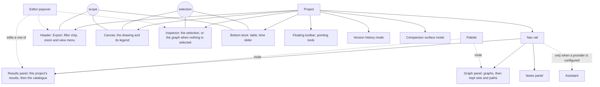

# Information architecture

**Job.** Say where every part of graphty lives and how an analyst finds it: the collections and
how each is ordered, the places and their structure, the routes between places, search, the
entry points, and the three representations of one graph. **Not here:** what the objects are
(`conceptual-model.md` 1.3) and what they are called (`glossary.md`); how anything behaves
(`interaction-patterns.md`); step sequences and step counts (`task-flows.md`); sizes, row types
and the order of sections inside a surface (`interface-specification.md`); strings and word
counts (`content-design.md`); behaviour at a graph size or a collection size (`state-matrix.md`);
what Figma's objects map to (`figma-crosswalk.md`); what graphty-element publishes and the list of
what it lacks (`element-contract.md`). **Owner:** information architect. **Ceiling:** 45 KB.
**Validated by:** tree tests and first-click tests of the structure alone, and a card sort of the
catalogue (section 12).

**Acceptance test.** This document must still read correctly with every pixel value, key chord
and interface string deleted. So it names instruments ("Find", "the palette"), never their keys,
and names places, never their widths. A sentence that stops making sense without a number or a
key belongs in another document.

The long form this document replaces, with every placement argument and the placed gap register,
is kept read-only in `research/archive/information-architecture-long-form.md`.

## 1. Orientation

**graphty has no layer tree.** In Figma, the Layers panel is how a person browses the canvas. A
graph cannot be browsed that way: it has no single-parent containment, and a list of 300,000 nodes
cannot be scanned. So nodes and edges are found through three things instead: **Find**, **the
table**, and the **kept sets and paths**. This is graphty's largest departure from Figma, and
most of the structure below follows from it.

Every placement follows from four sources, in this order:

1. **The object map** (`conceptual-model.md` 1.3). Only an object the model lists can have a
   place. The primary objects (graph, node, edge, set, path, item) are selected; the supporting
   objects (results, style layers, notes, views, filter steps) are edited, never selected as if
   they were graph objects (`principles.md` 3).
2. **The glossary** (`glossary.md`). Every label on a place is a preferred term.
3. **The top-task ranking** (`top-tasks.md`). Rank buys closeness to the analyst's attention,
   never a surface of its own.
4. **Figma's placements** (`research/figma.md` 4.1, 4.2, 4.14, 4.15). Where Figma has solved a
   placement, graphty copies it; each departure is justified by a graph fact (section 9).

**The app draws; the element supplies.** Every collection below is read from graphty-element's
session. The app never assembles, orders by computation, indexes or ranks a collection itself
(`CLAUDE.md`, "Architectural Principles"). Where the element does not yet supply a collection,
the collection table says "element need", and the need is an entry in the ledger of
`element-contract.md` 13, never app code.

## 2. Placement rules

Five rules generate almost every home. A placement no rule produces is either a recorded
departure or a mistake.

1. **One output, one home; many routes.** An output is anything the analyst reads: a table, a
   figure, a count, a list. It has exactly one home. Menus, the palette, Find, the context menu
   and a surface that shows the home's rows filtered to one target are routes, never second homes.
   An input that differs by case gets one home per case.
2. **An output's home is where it is read.** Where it is launched is a route. The catalogue
   launches betweenness; the result is read in its editor, which is its home. A load's home is its
   import report; a transform's home is the new graph.
3. **One surface for one thing, one surface for many.** The inspector shows one thing (or one
   selection). The table shows many rows of any collection the element publishes: nodes, edges,
   and the items of a result.
4. **Results are edited, never selected.** Opening a result, a style layer, a note or a filter
   step leaves the canvas selection where it was, as editing a Figma style leaves the frame
   selected. Items are selected; results are not.
5. **Attributes belong to what is selected; members are reached by selecting them.** An object's
   attributes section holds its own attributes. A set has none beyond its name and definition;
   changing its members' values means selecting the members. An item that is a subgraph (a group,
   a found path) is placed like a set; an item that is not (a pair, a saved comparison) is a table
   row and never a selected object.

**Prominence.** Rank decides distance from rest, not chrome. A higher-ranked task sits fewer steps
from the analyst's attention; no task, persona or capability earns a surface because of its rank.
Cost of error overrides rank: checking the import, direction and weight role stay visible
whatever their rank (`top-tasks.md`, "How the ranking is used").

**Live against frozen.** The project follows the current run of each result; an export freezes
what it wrote. The rule itself is `conceptual-model.md` 7.2; its placement consequence is that
evidence for a finding is kept by exporting it, and the export's home is the object's Export
section or the Export dialog (appendix).

## 3. Collections and their organisation schemes

A collection is anything shown as a list. Each has one scheme, named in Rosenfeld, Morville and
Arango's terms: **exact** schemes (chronological, alphabetical, an order that carries meaning) and
**ambiguous** ones (by topic). Two rules hold across the table:

- **When order carries meaning, the list is never sortable.** Style layers, filter steps and path
  members are in an order the element keeps because it changes the outcome. Any other sort would
  misstate which layer wins or which step runs first.
- **Every other list shows the element's order.** Presenting it newest first is a presentation
  choice, not a computation over the graph.

The **element source** column says one of three things: **today** (the element publishes it on
master), **branch** (it exists on an unmerged branch) or **element need** (it is not published;
the ledger in `element-contract.md` 13 holds the entry). A collection with an element need is
placed here as design, and built only when the element supplies it.

| Collection (place)                                     | Object                  | Element source                                                                      | Scheme                                                                                                                              | Growth rule                                                                                                                           |
| ------------------------------------------------------ | ----------------------- | ----------------------------------------------------------------------------------- | ----------------------------------------------------------------------------------------------------------------------------------- | ------------------------------------------------------------------------------------------------------------------------------------- |
| **Graphs** (Graph panel, top)                          | graph entry             | element need: projects with several graph entries; derived-graph lineage            | chronological, order added, original first; flat, a derived graph shows the graph it came from as a subtitle                        | rarely more than a few; with one graph the section collapses to its name, as Figma's Pages does                                       |
| **Kept sets and paths** (Graph panel, object list)     | set, path               | branch: the sets API, `ElementSet.order`, a creation counter (`sets-design.md` 4.6) | chronological, newest first (the element's order reversed); one mixed list, the kind shown on each row, never a grouping            | past a few dozen, Find narrows it; never paged, never lists nodes; reordering by hand is not offered, because no workflow asks for it |
| **Path members** (a path's inspector)                  | path                    | branch                                                                              | the walk order; never sortable                                                                                                      | a long path shows its first hops and "N more" into the table                                                                          |
| **Results in this project** (Results panel, top)       | result, runs            | today: `session.results`, `session.runs`                                            | chronological by latest run: one row per result, its runs folded beneath; results that need action pinned in a strip above the list | the strip holds every result the element reports as failed or not current; pinning never reorders the list below it                   |
| **Catalogue** (Results panel, below)                   | catalogue entry         | today: `session.catalog`, grouped by the entry's `category`                         | by topic: the element's categories, alphabetical inside each                                                                        | new entries join an element category; a new family is an element category, never an app grouping                                      |
| **Notes** (Notes panel)                                | note                    | element need                                                                        | chronological, newest first; each row names its targets; filtered by target                                                         | past a screen, the panel's search (Find with a preset scope) and the target filter                                                    |
| **Style layers** (the graph's inspector)               | style layer             | today: `session.styles`; origin from each layer's `source.by`                       | the stack: order is precedence, the top layer wins each channel; never sortable; origin shown per row as a facet                    | never moves to another place; a layer is found by "what paints this?" from a value (section 5); count classes in `state-matrix.md`    |
| **Filter steps** (the filter chip's popover)           | filter step             | element need: ordered steps with a kind per step (today one filter)                 | pipeline order, which is evaluation order; never sortable                                                                           | a few; the chip states the net effect                                                                                                 |
| **Saved views** (the view menu's views list)           | saved view              | element need (a camera preset only today)                                           | the element's creation order, which is also a report's page order                                                                   | a few to tens; the list takes a search                                                                                                |
| **Table tabs** (bottom dock)                           | node, edge, item        | element need: paged row listing (`session/types.ts:290-297`)                        | fixed: Nodes, Edges, then one item tab named by the result that opened it                                                           | rows sort by the column the analyst picks; a tab never renames itself                                                                 |
| **Attributes and columns** (inspector, table)          | attribute               | today: `session.data`                                                               | computed before imported, then alphabetical                                                                                         | past a screen, the inspector's attribute list takes a filter field                                                                    |
| **Categories inside an attribute** (legend, histogram) | attribute value         | today                                                                               | count descending for a nominal attribute, natural order for an ordinal one                                                          | past the palette's distinguishable hues, the element's overflow policy applies (`catalog/types.ts`)                                   |
| **Version history** (its own mode)                     | data version, operation | element need                                                                        | chronological, newest first; data versions are landmarks, operations fold beneath them                                              | unbounded; opened filtered to the current graph                                                                                       |

**The catalogue's families are the element's.** graphty-element declares six category values
(`graphty-element/src/catalog/types.ts:508`); its 21 algorithms use five of them: centrality 7,
community 4, path 4, structure 4, flow 2 (`catalog/algorithms.ts`). `prediction` is declared and
unused. Layouts group by `family`: geometric 6, hierarchical 3, force 2, special 1
(`catalog/layouts.ts`). The earlier families "paths and flow", "similarity and link prediction"
and "time" were an app taxonomy and are withdrawn. A family the element does not publish is not
shown. The category union is open (`(string & {})`), so adding a family is additive; renaming or
removing one is `one-way-doors.md` 35.

**Many style layers.** Each finished run adds at most one or two layers, re-runs replace their own
layer, and batches merge per channel (`session/styles/derive.ts`, `autoApply.ts`). A realistic
heavy session holds about 10 to 14 layers; more than 15 comes only from hand-written or imported
layers. So the stack's home never changes with its size. It is found through the reverse route
from a value to its layer, not by scanning. The origin facet reads the element's five sources
(`user`, `run`, `template`, `plugin`, `element`); origins interleave in the stack, so they are
never drawn as contiguous bands, which would misstate precedence. A Look is `template`; the
element ships no Looks today.

## 4. Places

A **place** is somewhere an analyst can be and return to. A **device** is a way of reaching or
editing something whose home is elsewhere: the editor popover, the palette, the context menu and
menus. Counting a device as a place would give its contents two homes.

The two circles are shared state that graphty-element owns: **selection** and **scope** (the
filtered graph). Every place is a view of that state; none holds a copy.

| Place              | The question it answers                                   | What it lists or shows                                                                                | Owner                                   | Figma source                                          | Region order                                                    |
| ------------------ | --------------------------------------------------------- | ----------------------------------------------------------------------------------------------------- | --------------------------------------- | ----------------------------------------------------- | --------------------------------------------------------------- |
| Nav rail           | Which collection is the left panel listing?               | Graph, Results, Notes; Assistant when configured, last                                                | App                                     | the rail (a collection per button, never an activity) | 1                                                               |
| Graph panel        | What does this project contain?                           | graphs; kept sets and paths                                                                           | Element, surfaced by the app            | File panel: Pages above Layers                        | 1                                                               |
| Results panel      | What have I computed, and what can I compute?             | this project's results; the catalogue                                                                 | Element, surfaced by the app            | Assets: this file, then libraries                     | 1                                                               |
| Notes panel        | What has been written, and about what?                    | every note, newest first                                                                              | Element, surfaced by the app            | the comments list                                     | 1                                                               |
| Assistant          | What can I ask?                                           | conversations                                                                                         | App over the element's assistant        | the Agents panel                                      | 1                                                               |
| Header             | What do I do with the whole project and the whole canvas? | Export; the filter chip; the zoom and view menu                                                       | App; the chip reads the element's scope | the header and the Design/Prototype slot              | 2                                                               |
| Inspector          | What is this?                                             | the selection's properties; with nothing selected, the graph's, including Statistics and style layers | Element, surfaced by the app            | the right sidebar                                     | 2                                                               |
| Floating toolbar   | What can I make by pointing?                              | pointing tools, the palette, the view mode                                                            | App                                     | the toolbelt                                          | 3                                                               |
| Help               | Where are the aids?                                       | docs, shortcuts, samples                                                                              | App                                     | the help button                                       | 4                                                               |
| Canvas             | Where is it, and what is it next to?                      | the drawing, selection outlines, note markers, one legend                                             | Element                                 | the canvas                                            | 5                                                               |
| Bottom dock        | What are many things, side by side?                       | the table; the time slider                                                                            | Element, surfaced by the app            | the Variables grid, kept docked (section 9)           | after the toolbar, before Help (a departure; Figma has no dock) |
| Version history    | What happened, and in what order?                         | data versions, import and restore reports, the operation log                                          | Element, surfaced by the app            | version history                                       | replaces the inspector                                          |
| Comparison surface | How do two drawings differ?                               | two sides, their difference list                                                                      | Element, surfaced by the app            | branch review                                         | its own mode                                                    |
| Empty canvas       | How do I start?                                           | the front doors (section 6)                                                                           | App                                     | a new file                                            | 5                                                               |

Region order follows Figma's measured cycle of five focus regions (rail, right sidebar, toolbar,
help, canvas; `design/ui/figma/accessibility/README.md` 1.1); the keys that move between them are
`interaction-patterns.md`'s.

**Owner** means: **Element**, a bare `<graphty-element>` on a third-party page does it;
**App**, chrome only; **Element, surfaced by the app**, the element publishes the state and the
commands and the app draws the control. There is no status bar, no inspector tab and no
activity panel; the reasons are in section 11.

The shipping shell still has the rejected activity rail:
`graphty/src/components/shell/rail/ActivityRail.tsx` and six activity panels in
`graphty/src/components/shell/panel/` (Data, Explore, Analyze, Style, Present, AI). Replacing it
with the three collection panels comes before any new panel is built (`implementation-map.md`).

## 5. Navigation model

Four systems, each with one job:

- **Global**, present in every place and never changing with the selection: the rail, the main
  menu (the complete inventory of commands), the header (the filter chip states the scope of every
  number on screen), the palette, the project's chevron menu, and Help.
- **Local**, inside one place: the inspector's sections for the current selection; a result's
  runs, one disclosure down; the table's tabs; the Graphs section above the object list.
- **Contextual**, from an object to a related one. Graphs are made of relations, so almost every
  number is a link; this is where graphty is richer than Figma. The table below is the complete
  list.
- **Supplemental**: Find, Version history, the shortcuts list and Help.

**Every relationship in the object map is walkable in both directions.** A relationship with no
route is a hole in the structure, and each row is a first-click test task (section 12).

| Relationship                         | Forward route                                   | Back route                                          | Element source                                                      |
| ------------------------------------ | ----------------------------------------------- | --------------------------------------------------- | ------------------------------------------------------------------- |
| a count and what it counts           | the number opens the table on what it counts    | the table's scope line names the count it came from | element need: paged listing                                         |
| result to run                        | disclosure in the Results panel                 | a run's Created from names its result               | today                                                               |
| run to its values and items          | the result editor, then "N more" into the table | an item's Created from names its run                | today; item paging is a need                                        |
| style layer to the run that made it  | the layer's origin names the run                | the result's Appearance lists its layer             | today (`LayerSource` `run`)                                         |
| painted value to its layer           | a value row names the layer that paints it      | a layer's "select painted" selects what it paints   | today: `explain` returns the layer id; the attribute path is a need |
| run to a suggestion it did not paint | the run says which layer holds the channel      | the layer lists the runs it suppressed              | element need: a withheld-suggestion outcome (`one-way-doors.md` 26) |
| set to what made it                  | a set's Created from                            | the source's Used by                                | branch (`SetCreatedFrom`)                                           |
| object to what depends on it         | Used by, one counted row                        | each dependent's Created from                       | element need: a dependency graph                                    |
| element to its memberships           | the element's Memberships                       | a set's or group's Members                          | element need: `memberships(id)`                                     |
| node to its neighbours               | the neighbour count                             | the incident-edge list                              | element need: neighbour pages                                       |
| note to its targets                  | selecting a note selects its targets            | a target's Notes section                            | element need                                                        |
| derived graph to its source          | its Created from                                | its source's Used by                                | element need: derivation map                                        |
| run to the scope it read             | the run's state line names its scope            | the chip marks results computed on another scope    | branch (`RunScopeRecord`)                                           |
| legend entry to its elements         | a legend entry adds a filter step               | the element's value row names its layer             | today (legend); the step is a need                                  |
| data version to its import report    | Version history entry                           | the graph's last-import row                         | element need                                                        |

**Wayfinding.** The structure answers six questions without navigating:

- **What is selected**: the inspector's type row, the canvas outline, the highlighted list row and
  table row, four views of one selection.
- **What mode I am in**: the view-mode control; an armed tool; Version history and the comparison
  surface each with its own exit.
- **What the numbers are computed on**: the filter chip, always; a result computed on another
  scope says so on itself.
- **Where a value came from**: at most three contextual steps, value to layer to result to record.
- **Where I put it**: Find, over every kept thing by name.
- **Where I was**: selecting never moves the camera and is not undone; a trail is kept as a
  working-set step, a path or a saved view, never as a selection history.

**The rail opens on Graph, always.** A panel that opens in a different place depending on project
state breaks spatial memory; Figma always opens on Layers. On a fresh project the Graphs section
already has a row, and the empty object list shows its creation verbs and a route to Results, so
the panel is never dead. The first-click study compares this with opening on Results.

## 6. Front doors

A front door is any way a person or a program arrives. Brown's principle: many arrive somewhere
other than the start, so each door lands in a named place. After any door, three questions must be
answerable without navigating: what graph is this (the graph's inspector), what is it computed on
(the filter chip), and what has been done (the Results panel).

**One Open, many profiles.** A project, a recipe, a style and a data file are four profiles of one
file format (`conceptual-model.md` 8). There is one Open; what it does depends on the profile and
on whether a graph is loaded. A style is a recipe with fewer parts, so it takes the recipe row.
Deciding the profile of a file is the element's job, because every consumer would otherwise
reimplement it (`one-way-doors.md` 36).

| What arrives                                                                   | No graph loaded                                                                                                   | A graph loaded                                                                                      |
| ------------------------------------------------------------------------------ | ----------------------------------------------------------------------------------------------------------------- | --------------------------------------------------------------------------------------------------- |
| **Project**                                                                    | opens where it was left: its last graph and saved state                                                           | opens it as another project                                                                         |
| **Data** (file, dropped file, pasted graph text, a connected source, a sample) | loads it; lands on the graph's inspector with the overview recipe's readings; the import report is one route away | offers add as another graph, add data, join, or replace data; lands on the import report's headline |
| **Recipe or style**                                                            | lands on an empty canvas with the recipe pending; asks for data, then the binding step                            | the binding step over the current data; lands on the Results panel with what it ran                 |
| **Recipe and data together**                                                   | the binding step once, then as data                                                                               | --                                                                                                  |
| **A link**                                                                     | read as the profile it resolves to, never as pasted text                                                          | the same                                                                                            |
| **A saved view shared inside a project**                                       | that view's camera and scope; the chip states the scope                                                           | the same                                                                                            |
| **A bare `<graphty-element>` on another site**                                 | the canvas and what the element itself does; no rail, no inspector                                                | "What a bare embed does" in `element-contract.md`                                                   |

**Recipe first and data first reach the same state.** An analyst who drops the team's recipe and
then this week's export ends where one who does it in the other order ends.

**The owner's note on top tasks.** Loading a style or a recipe instead of data is the same front
door as loading data, which is how a community shares a starting point without sharing its data.
Characterizing the whole graph reads the project's **overview recipe**: graphty-element ships a
general one, a consumer sets the element's default, and a project may name its own, domain by
domain (groups, flows), which wins (`conceptual-model.md` 8; `one-way-doors.md` 33). Replacing the
default is therefore one more use of this door. The earlier route "duplicate a project, then
replace data" as the only way to reuse work across projects is withdrawn.

**URLs.** A shareable URL is a published contract. The recommendation, not the decision, is that a
public URL carry only a data source and a recipe, and that places and selections stay internal
until a study shows analysts share them (`one-way-doors.md` 34).

## 7. Search and findability

There are two instruments, split by part of speech, and they never share a purpose:

|                                            | **Find**                                                                                                                                      | **The palette**                                                                                                                                                  |
| ------------------------------------------ | --------------------------------------------------------------------------------------------------------------------------------------------- | ---------------------------------------------------------------------------------------------------------------------------------------------------------------- |
| Searches                                   | **nouns**: node and edge ids, names and attribute values; queries; pasted id lists; the names of sets, paths, items, results, notes and views | **verbs and definitions**: commands, catalogue entries, layouts, recipes, preferences; the glossary's rejected synonyms as aliases ("brokers" finds betweenness) |
| Scope                                      | this graph or all graphs, as Figma's page scope; a hit the filter excludes stays, marked with the step that excluded it                       | always the whole app                                                                                                                                             |
| Grouping                                   | by kind, in object-map order: nodes, edges, sets and paths, items, results, notes, views                                                      | recents, then commands, then the catalogue                                                                                                                       |
| Ranking                                    | exact, then prefix, then substring on the name, then attribute value; within that, the element's order                                        | recency, then match quality                                                                                                                                      |
| Ends as                                    | a selection, or the hit's home                                                                                                                | a command runs or an editor opens                                                                                                                                |
| Hand-off when it finds nothing of its kind | "Run ..." for a verb typed into Find                                                                                                          | "Find '...'" for a noun typed into the palette                                                                                                                   |

**A panel's own search field is Find with a preset scope.** The Results panel's search is Find
over results and the catalogue; the Notes panel's is Find over notes. One index, one ranking.

**The palette never lists nouns.** If both boxes found "my suspects set", an analyst would learn
two homes for one thing. The hand-off row gives the reach without the second home.

**The index and its ranking belong to the element.** Search over graph content is not published
today (`session/types.ts:290-297`); it is an element need. The app never builds an index, and
never breaks ties itself, by degree or anything else, because that computes over the graph. Aliases
belong on the catalogue descriptor, not in app strings, so a third-party picker finds the same
things (`one-way-doors.md` 35).

**Findability by scale.** Browsing and Find are equal routes while every list is browsable. Above
the drawing limit, browsing the canvas fails, so Find becomes the main way in and its "N more"
opens the table, the only place built for many rows. Behaviour does not change with size; only
which route leads does. The thresholds are `state-matrix.md`'s.

## 8. Representations: the drawing, the inspector and the table

This answers the owner's note on information architecture: how looking at data drawn among its
neighbours relates to looking at raw data. There is one selection and one scope, and three
representations of them. Munzner's term is linked multiple views.

| Representation | Shows                                                          | Answers                                | Figma analogue     |
| -------------- | -------------------------------------------------------------- | -------------------------------------- | ------------------ |
| **Canvas**     | elements among their neighbours; structure, not exact values   | "where is it, and what is it next to?" | the canvas         |
| **Inspector**  | one thing, raw: every attribute and where each value came from | "what exactly is this?"                | the right sidebar  |
| **Table**      | many things, raw: attributes as columns                        | "compare, rank, profile"               | the Variables grid |

Selecting in any one selects in all three. The canvas and the table are peers; the inspector
follows them. The table docks under the canvas so both stay visible, and it can be expanded to full
height as a presentation state, never as a separate data mode, because a separate mode would break
the shared selection. When a selection is too large to draw, the table keeps it and says so. A
summary of an attribute (its distribution and completeness) is not a fourth representation: it
sits in the table's column header and in the graph's inspector.

**Seeing data and style together.** Paint is shown where the value is read, in all three:

- an inspector value row shows the value, its swatch and the name of the layer that paints it,
  as Figma's bound-variable row shows the variable;
- a table column that a style layer reads shows its encoding in the header, and a column can show
  the encoded value beside the raw one;
- the legend names the attribute, and choosing an entry is a route to the elements it encodes.

All three read the element's resolved paint (`StylesApi.explain`); none recomputes a colour. Two
element needs block the full model: the attribute path on `ChannelExplanation`, and a bulk read of
encoded values for a column (`one-way-doors.md` 37).

**Accessibility is structural.** The canvas is drawn with WebGL, which is non-text content under
WCAG 1.1.1. The table and the inspector are its text equivalent, so every fact the drawing
conveys, including every encoding the legend shows, must also be readable there. That is why the
table has a place of its own and not only a toggle.

**Narrowing, placed** (the owner's note on two kinds of filter, `conceptual-model.md` 4.4). The
analyst learns three meanings by where each lives:

| The analyst wants                                              | It is                                        | It lives                            | What it changes                                                             |
| -------------------------------------------------------------- | -------------------------------------------- | ----------------------------------- | --------------------------------------------------------------------------- |
| to colour or fade "type X"                                     | a style layer                                | the graph's inspector, style layers | paint only; every count is unchanged                                        |
| to analyse without some nodes, and have layout ignore them too | a filter step (a data step or a working set) | the filter chip                     | what layout and every metric compute on; each run records the scope it read |
| a separate graph with its own positions and runs               | a derived graph                              | a new row under Graphs              | a new graph entry (an element need)                                         |

The chip states that layout reads the filtered graph (`one-way-doors.md` 17). A run keeps the
scope it started with, and a different scope is not "out of date" (`conceptual-model.md` 4.5), so
changing the chip does not mark results stale. Analysts will expect the opposite, so the result
says which scope it was computed on.

## 9. graphty's ontology in Figma's frame

`figma-crosswalk.md` owns what each Figma object maps to. This table records only the placement
consequence of each verdict.

| Figma place                                        | graphty place                                    | Consequence for structure                                                                                                                     |
| -------------------------------------------------- | ------------------------------------------------ | --------------------------------------------------------------------------------------------------------------------------------------------- |
| File, file menu                                    | project; the chevron menu                        | the project's file commands and Version history live there                                                                                    |
| Pages section                                      | Graphs section                                   | several graphs are pages, not tabs or windows                                                                                                 |
| Layers panel                                       | the object list: kept sets and paths             | **never nodes**; findability rests on Find, the table and kept objects                                                                        |
| Frame, Section                                     | none                                             | a region of interest is a set                                                                                                                 |
| Assets (this file, then libraries)                 | Results panel (this project, then the catalogue) | the same two-part shape; the catalogue produces the file's own contents                                                                       |
| Local styles in the nothing-selected inspector     | style layers in the graph's inspector            | same place at any count; ordered as a stack, which Figma's styles are not                                                                     |
| Modes                                              | Looks                                            | a Look adds `template` layers to the stack; it is honest only once `template` layers stop suppressing run suggestions (`one-way-doors.md` 26) |
| Variables grid                                     | the table                                        | kept docked, not full screen, because selection is shared with the drawing                                                                    |
| Libraries                                          | recipes                                          | a front door, not a panel; no Library place until saved recipes form a collection                                                             |
| Comments list (sorted by date, filtered to a page) | Notes panel (newest first, filtered by target)   | the one rail panel that is an exception to the collection rule (section 11)                                                                   |
| Find with its page scope                           | Find with its graph scope                        | the same instrument                                                                                                                           |
| Quick actions                                      | the palette                                      | verbs only (section 7)                                                                                                                        |
| Branch review                                      | comparison surface                               | its own mode                                                                                                                                  |
| Version history                                    | Version history                                  | its own mode, replacing the inspector                                                                                                         |

**No Figma counterpart**, so each place is justified by a principle, not an invented precedent:
the filter chip and scope (`principles.md` 1, every number names its graph); runs and freshness
(`principles.md` 2); the table (WCAG 1.1.1, section 8); the path as its own object type
(`conceptual-model.md` 4.2); comparing two data versions; time windows.

**Objections filed with the crosswalk, not settled here:** whether a Figma Component maps to a set
(a Figma user expects instances, overrides and detaching, and a set has none), and whether a
Figma Variable maps to every attribute or only to computed ones. Placement is the same either way:
attributes are read in the inspector and the table.

## 10. Rules for growth

A new thing is placed by these questions, in order, stopping at the first yes:

1. **Is it a verb?** A command, with no place of its own: the palette, a menu, a verb on an
   object's row.
2. **Is it an extension (an algorithm, a layout, a format, a palette)?** A catalogue entry in an
   element category. Ten times as many algorithms must need no new place.
3. **Is it a property of one object?** A section in the inspector, absent until it has content.
4. **Is it many rows of one kind?** A table tab or a column. A new way of reading many rows (a
   matrix, between groups) is a view of the table.
5. **Is it a collection the analyst returns to across sessions?** A list in an existing panel. It
   earns a rail place only if it has no other findable home and passes a tree-test task; the rail
   holds at most four collections.
6. **Is it a transient reading?** Shown where it was asked, kept only by a named verb.

A new object kind enters only through the object map's primary-object test. A new front door names
its landing place and answers the three orientation questions (section 6). **No persona earns a
place**, and a rail button always names a collection, never an activity.

## 11. Rationale and rejected alternatives

- **A rail of activities** (Data, Explore, Analyze, Style, Present, AI), graphty's first version
  and today's shell. Rejected: each button is an activity, and one object would have three homes.
- **Nodes in a layer tree.** Rejected: a graph has no containment and a node list does not scale.
- **Inspector tabs for Data and Appearance.** Rejected: an activity split pushed into the
  inspector, and it separates a value from the layer that paints it, which the owner wants seen
  together. Figma adds a tab only for a whole domain with its own verbs.
- **A full-screen table, as Figma's Variables.** Rejected: it breaks the shared selection.
- **A Style rail place, or moving the stack at large counts.** Rejected: the stack belongs to one
  graph, realistic counts stay in the teens, and the reverse route finds a layer.
- **Origin bands in the style stack.** Rejected: origins interleave, so bands misstate precedence.
- **A Library rail place.** Deferred until saved recipes form a collection.
- **The palette listing kept objects.** Rejected: two homes for one noun.
- **Results grouped by family, or regrouped past a count.** Rejected: family is the catalogue's
  scheme, and a list that changes scheme as it grows breaks spatial memory. A study can reopen it.
- **Notes grouped by target.** Rejected: each object's Notes section already reads per target, and
  a note with three targets would be listed three times. The panel's own job is the log.
- **Derived graphs indented under their source.** Rejected: the element stores no parent tree, and
  a tree of unknown depth would be the app inventing lineage.
- **Dragging to reorder sets or views.** Not offered: no workflow asks for it.
- **Opening the rail on Results when nothing is kept.** Replaced by always opening on Graph.
- **Views in the graph's inspector.** Rejected: three of the four workflows that use saved views
  use them to navigate, which is the view menu's job.
- **A status bar.** Rejected: every job it would do has an owner (the chip, the type row, a
  result's row, the canvas's own "not drawn" line).
- **Why Notes is on the rail.** The rail admits a secondary collection only when it has no other
  findable home. An object's Notes section shows that object's notes; the panel is the only place
  to read every note at once, and three of the four note-reading steps in the fraud and criminal
  network workflows need a value computed after the note was written. Figma's comment mode hides
  the inspector, which graphty cannot afford. The exception holds only if its first-click test
  passes.
- **Why results and the catalogue share a panel.** The analyst thinks "the betweenness I ran" and
  "run betweenness" in one breath, and every run lands in the list it was started from.

## 12. Validation

The structure is tested with no visual design. Scheduling, recruiting and sample sizes are in
`research/study-schedule.md`.

**Tree tests** on the text outline of sections 3 and 4, with two scripts: a **small** graph (about
300 nodes, one graph) and a **large** one (300,000 nodes, above the drawing limit, where browsing
the canvas is removed). Tasks are worded in analyst language that does not give away the label:

1. Did the file load with the right direction? _(cost of error)_
2. Why is this node orange? _(cost of error)_
3. You applied your team's print style, then ran community detection. Why did the colours not
   change? _(cost of error)_
4. You ran something an hour ago that ranked people. Get back to it.
5. Reopen last week's Louvain run and change its resolution (a project seeded with 30 or more
   results).
6. Restrict the analysis to the largest component.
7. Read what you wrote about account ACC-4471.
8. Reuse your team's standard analysis on this week's file.
9. Export the ranked hub table.
10. Find the node TP53 (large script only).

**First-click tests** carry equal weight, because graphty's strongest routes are contextual and a
tree test cannot see them. One task per row of the relationship table in section 5, plus: open
the Suspects set with the palette focused; the first panel on a fresh project (Graph against
Results); notes, with one per-entity task and one "what happened this week" task; and whether
Figma-literate and Gephi-literate analysts read the filter step's control the same way.

**Pass bars, fixed before testing, per task:**

- tree tests: at least 80% success and at least 60% directness; the three cost-of-error tasks at
  least 90% success;
- first-click tests: at least 80% of first clicks on the correct place; cost-of-error tasks 90%;
- between 60% and the bar, a relabel or a new contextual route is allowed, then a retest;
- below 60%, the structure changes, never only a label;
- each task on the large script scores within 10 points of the same task on the small script,
  because behaviour must not depend on graph size.

**Card sort of the catalogue**: an open sort of about 40 algorithm cards described in analyst
words, then a hybrid sort, closed on the element's five populated categories with a "does not
fit" pile. A card placed in its family by fewer than 60% of participants gets an alias; a pile
nobody can place becomes an element category proposal (`one-way-doors.md` 35). Participants are
screened for Figma familiarity, which is recorded as a variable, because Figma-literate testers may
pass a Figma-shaped structure for the wrong reason.

**Questions these studies settle**, each a two-way door decided now and reversible by the result:

| Decision taken                             | Test that can reverse it           |
| ------------------------------------------ | ---------------------------------- |
| Results ordered by latest run, runs folded | tree task 5                        |
| Notes newest first with a target filter    | the notes first-click pair         |
| The palette lists no nouns                 | the Suspects first-click task      |
| The rail opens on Graph                    | the fresh-project first-click task |
| A withheld suggestion gets its own route   | tree task 3                        |

## Appendix. One home for every output

Every output named by the capability files in `design/designloom/capabilities/`, split where a
file bundles several. Routes are listed by place, not by key. The placement arguments are in the
long form, section 11.

| Output                                                                | Home                                                            | Routes                                                                                         |
| --------------------------------------------------------------------- | --------------------------------------------------------------- | ---------------------------------------------------------------------------------------------- |
| algorithm progress                                                    | the result's row                                                | the finish notice                                                                              |
| all paths, shortest path                                              | the path family's result editor                                 | the Path tool; Find path from a node                                                           |
| analysis history                                                      | Version history                                                 | a run's Details                                                                                |
| animated transitions, graph rendering, hover, tooltips, zoom and pan  | the canvas                                                      | the view menu; reduced motion in Preferences                                                   |
| notes                                                                 | the Notes panel                                                 | the Note tool; Add note; each object's Notes section; canvas markers; Find                     |
| free text, shapes, canvas-anchored labels                             | rejected: a note anchors to targets                             | --                                                                                             |
| anomaly detection                                                     | its result editor                                               | the catalogue; the outlier bands of any histogram                                              |
| headline statistics and counts                                        | the graph's inspector, Statistics                               | returning to nothing selected                                                                  |
| average, minimum, maximum degree; degree analysis                     | the attribute histogram on degree                               | the degree distribution in Statistics; a node's degree                                         |
| centralities, local clustering                                        | the metric result editor                                        | the catalogue; the palette                                                                     |
| transitivity, average clustering, diameter and other graph statistics | Statistics, behind "more"                                       | catalogue search                                                                               |
| community detection                                                   | the partition result editor                                     | the catalogue; the palette                                                                     |
| community profiling                                                   | the Groups tab, with its between-groups view and group columns  | a partition's "N more"; a group's inspector                                                    |
| comparison of two selected objects                                    | their inspector                                                 | selecting both                                                                                 |
| comparison of a reading, a what-if                                    | the editor popover where it was asked                           | Compare with... on a result, reading, node or set                                              |
| comparison of two columns                                             | the table's scatter view                                        | Compare with... on a column                                                                    |
| comparison of two drawings                                            | the comparison surface                                          | Compare with... on a graph, version, window, set or group                                      |
| removal impact, every scenario                                        | the comparison result's scenario table                          | the "without each of" scope                                                                    |
| connected components                                                  | the permanent components result                                 | the component counts in Statistics                                                             |
| computed columns, neighbour aggregates                                | the Nodes or Groups tab column                                  | New column on a column                                                                         |
| tables of values                                                      | a tab's Export table                                            | the palette                                                                                    |
| tables of readings                                                    | Export table in a Statistics section                            | the palette                                                                                    |
| figures, images, graph files                                          | an object's Export section                                      | the Export dialog; copy as image                                                               |
| the whole project, report, methods text                               | the Export dialog                                               | the header's Export; the chevron menu                                                          |
| the project file                                                      | the chevron menu, Download project file                         | --                                                                                             |
| data import, preview, validation                                      | the import report, in its Version history entry                 | Open; the empty canvas; drop; paste; the load notice; mark rows in Statistics                  |
| completeness per attribute                                            | the column header                                               | the incomplete-attributes mark in Statistics                                                   |
| a graph's direction and weight                                        | the Edges reading's editor                                      | the weight mark; re-map; each run's direction and weight rows                                  |
| details on demand, node selection                                     | the selection's inspector                                       | the canvas; Find; the table; list rows                                                         |
| ego network, neighbourhood expansion                                  | the several-elements Statistics after Select neighbors          | Select neighbors; Filter to neighbors                                                          |
| filtering, saved filters                                              | the filter chip's popover; kept as rule sets in the object list | Filter to and Filter out wherever they appear; column headers; histogram bands; legend entries |
| guided onboarding                                                     | no surface of its own                                           | samples; (i); the palette; docs; Additional labels                                             |
| keyboard shortcuts                                                    | the shortcuts panel                                             | Help                                                                                           |
| large-graph rendering                                                 | the canvas, with its "not drawn" line                           | Performance mode in Preferences                                                                |
| layouts                                                               | the Layout row of the graph, a set, a group or a partition      | Run layout on the empty canvas; the palette                                                    |
| legend, minimap                                                       | the canvas                                                      | the view menu                                                                                  |
| link prediction                                                       | the pair-list result editor                                     | the catalogue                                                                                  |
| metric histograms                                                     | the attribute histogram popover                                 | column headers; attribute values; the metric editor                                            |
| node merging                                                          | the merged node's inspector                                     | several-elements overflow; a pair row; the pair-list editor                                    |
| path highlighting                                                     | the path's layer in Style layers                                | the path's Appearance                                                                          |
| pattern search                                                        | not placed: outside the model (`conceptual-model.md` 1.5)       | --                                                                                             |
| progressive loading                                                   | the load notice                                                 | --                                                                                             |
| sample datasets                                                       | the empty canvas                                                | Open sample; Help                                                                              |
| search                                                                | Find                                                            | the palette's hand-off                                                                         |
| selection statistics                                                  | the several-elements inspector                                  | Export table                                                                                   |
| style presets (Looks)                                                 | the style-layer picker                                          | Add style layer                                                                                |
| temporal analysis                                                     | the series result editor                                        | "each of" the windows; Over time in Statistics and the histogram                               |
| temporal navigation                                                   | the time slider in the dock                                     | the view menu                                                                                  |
| view bookmarks                                                        | the views list from the view menu                               | Find; the palette                                                                              |
| visual encoding of nodes and edges                                    | the graph's Style layers                                        | Appearance rows; column headers; the result editor                                             |
| data operations (add, join, replace, re-map)                          | the import report                                               | the Data menu; the drop point; the palette                                                     |
| new graph from (combine, projection, quotient, sample)                | the new graph, whose Created from reopens its inputs            | the graph's menu; a column's menu; a partition's menu                                          |
| add node, add edge                                                    | the new element's inspector                                     | the empty canvas; a pair row                                                                   |
| remove                                                                | its Version history entry                                       | the several-elements and set overflows                                                         |
| preferences                                                           | the Preferences submenu                                         | the palette                                                                                    |
| the assistant                                                         | the Assistant panel                                             | the palette                                                                                    |

## Sources

- `design/ui/framework/document-architecture.md` 3, 3.1, 7.4, 8.1
- `design/ui/framework/conceptual-model.md` 1.3, 1.4, 1.5, 4.2, 4.4, 4.5, 4.7, 7.2, 8, 10
- `design/ui/framework/figma-crosswalk.md`; `principles.md` 1, 2, 3; `top-tasks.md`
- `design/ui/framework/element-contract.md` 13; `one-way-doors.md` 17, 26, 33, 34-37
- `graphty-element/src/catalog/types.ts` (`LayerSource` at 467-473, `category` at 508);
  `catalog/algorithms.ts`; `catalog/layouts.ts`
- `graphty-element/src/session/types.ts:290-297`; `session/GraphSession.ts`;
  `session/styles/explain.ts`, `StylesApi.ts`, `autoApply.ts:147`, `derive.ts`
- `.worktrees/element-sets/design/sets/sets-design.md` 4.6, 5.1, 10.1 (branch `feat/element-sets`)
- `graphty/src/components/shell/rail/ActivityRail.tsx`, `graphty/src/components/shell/panel/`
- `design/ui/figma/accessibility/README.md` 1.1; `left-sidebar/README.md` 1, 5, 6;
  `header-and-modes/README.md` (the comments list); `right-sidebar-selection/README.md`
- `design/designloom/capabilities/*.yaml`, `workflows/*.yaml` (no workflow reorders sets or views)
- Rosenfeld, Morville and Arango, _Information Architecture_, 4th edition, chapters 6 to 9
  (organisation, labelling, navigation and search systems)
- Garrett, _The Elements of User Experience_ (structure and skeleton planes); Brown, "Eight
  principles of information architecture" (front doors, growth); Munzner, _Visualization Analysis
  and Design_ (linked views); WCAG 2.2, 1.1.1
- Nielsen Norman Group, "Tree Testing": https://www.nngroup.com/articles/tree-testing/ ; "Card
  Sorting: How Many Users to Test":
  https://www.nngroup.com/articles/card-sorting-how-many-users-to-test/ (cited as read by the
  studio's design professor)
