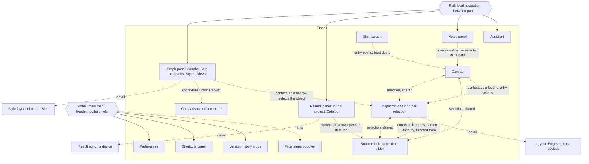

# Information architecture

**Job.** Say where every part of graphty lives and how an analyst finds it: collections and their
schemes, places and their outline, routes, findability, entry points, and the three
representations of one graph. **Not here:** what the objects are (`conceptual-model.md` 1.3) and
what they are called (`glossary.md`); how anything behaves (`interaction-patterns.md`); step
sequences and step counts (`task-flows.md`); sizes, row types and the order and contents of
sections inside a surface (`interface-specification.md`); strings and word counts
(`content-design.md`); sizes of graphs and collections and what changes at each
(`state-matrix.md`); what each Figma object and slot maps to, and the departures from Figma
(`figma-crosswalk.md`); what graphty-element publishes and lacks (`element-contract.md`,
`element-needs.md`); the study methods, tasks, answer keys, pass bars and schedule
(`research/study-schedule.md`). **Owner:** information architect. **Ceiling:** the README's
table. **Validated by:** a tree test of the places and objects of 4.1, one study of the Catalog's
grouping, a hybrid card sort of the main menu, and first-click tests of the controls a tree test
cannot score (section 12); and, before any study runs, the consistency check
of section 12, `research/scripts/check-structure.mjs`.

**Acceptance test.** It reads correctly with every pixel value, key chord and string deleted.

**One fact, one owner.** Words are defined only in `glossary.md`; homes, starting places and
relationship routes, and every command's label, are assigned only in `output-homes.md`, this
document's register; Figma slots
are mapped only in `figma-crosswalk.md`; rows and section order are described only in
`interface-specification.md`. This document states the rules that produce those facts and cites
them; it restates none. The outline in 4.1 and the study's answer key are derived from the
register, and section 12's check fails when they disagree. The earlier long form
(`research/archive/information-architecture-long-form.md`) binds nothing.

## 1. Orientation

**graphty has no layer tree.** Figma's Layers panel is how a person browses the canvas; a graph
cannot be browsed that way, because a node has no single parent. Nodes and edges are found through
**Find**, **the table** and the **kept sets and paths** instead. This is graphty's largest
departure from Figma, and most of the structure follows from it. It also frees Figma's Layers slot
in the left panel, and the one graphty list with Layers semantics takes it: the **style stack**,
ordered rows where the top row wins (section 11).

Every placement follows from four sources, in this order:

1. **The object map** (`conceptual-model.md` 1.3). Only an object the model lists can have a
   place. The primary objects (graph, node, edge, set, path, and a set or path in its offered
   state: a group or a found path) are selected; an item that is not a subgraph (a pair) is a table row
   (rule 5), and a saved comparison is a run of its comparison result. Definitions (results, style layers, filter steps, saved
   views, the Look) are edited, never selected (rule 4).
2. **The glossary.** Every label on a place is a preferred term in `glossary.md`.
3. **The top-task ranking** (`top-tasks.md`). Rank buys closeness to the analyst's attention,
   never a surface of its own.
4. **Figma's placements**, as mapped in `figma-crosswalk.md`. Where Figma has solved a placement,
   graphty copies it. Every departure is a row in exactly one ledger, `figma-crosswalk.md` 4.

**The app draws; the element supplies.** Every collection and relationship is read from
graphty-element; the app never assembles, indexes or orders one by computing over the graph
(`CLAUDE.md`). What the element lacks is in `element-needs.md`.

## 2. Placement rules

**Homes and starting places are different things.** An object or an output has one **home**, the
place where it is read. A command has **starting places**, where it begins. Menus, the toolbar,
Quick actions and the context menu hold starting places and routes, and never own anything. The register
keeps both: homes in `output-homes.md` 1 and 2, starting places in `output-homes.md` 3.

**A file written out of graphty is the output of a command**: the project file, a recipe, a
style file, a figure, a table or the findings report has starting places, never a home. What is
read inside graphty keeps one: the **methods text** in Version history; the **findings report's**
pages in the Views collection, in page order, with the notes each view shows
(`files-and-recipes.md` 3).

Six rules generate almost every home. A placement no rule produces is either a recorded departure
or a mistake.

1. **One output, one home; many routes.** An output is anything the analyst reads: a table, a
   figure, a count, a list. It has exactly one home, which is a place (section 4). Menus, the
   Quick actions, Find, the context menu and a surface that shows the home's rows filtered to one target
   are routes, never second homes. An input that differs by case gets one home per case.
2. **A home is where the output is read, and a detail belongs to its row.** Where something is
   launched is a route. A result's home is its row in the Results panel; its editor is that row's
   **detail**, opened in place, as Figma's style editor opens from the style's row, and holds the
   result's options, its Appearance and its readings (headline readings, top and bottom items,
   Used by). A device (the
   editor popover, a menu, a dialog) can be a row's detail; it is never a home on its own. The
   latest import is read in the graph's Last import row, whose detail is its import report; every
   import's report is also kept in its data version's Version history entry. A transform's home is
   the new graph.
3. **One surface for one thing, one surface for many.** The inspector shows one thing or one
   selection; the table shows many rows: nodes, edges, and the items of a result.
4. **Definitions are edited, never selected; content is selected**, so a definition's home is its
   row and its editor is a device beside the row. A note's row selects its targets; a note about a
   definition opens that definition's editor instead, and a note about the graph is read in the
   nothing-selected inspector (`output-homes.md` 4). The behavior is `interaction-patterns.md` 3.1.
5. **Attributes belong to what is selected; members are reached by selecting them.** An item that
   is a subgraph (a group, a found path) is placed like a set; one that is not (a pair) is a table
   row, never a selected object. Every item is listed in its result's item
   tab, never in the Results panel.
6. **Options live with what they configure.** An algorithm's options are rows of its result's
   editor. A layout's options are the graph's Layout row, which holds the dimension (2D or 3D),
   encoded axes (so placing nodes by an attribute, a map or a tier, is found there), the scope and
   the pins: the row counts the pinned nodes, and Unpin all is the row's detail, because a pin
   decides what every later layout moves. A node's own pin is read on its inspector
   (`interface-specification.md`). The toolbar's view-mode control is a route to the dimension; VR
   and AR are sessions, not settings. Controls are generated from the catalog
   entry's option schema (`options-and-encodings.md`), so more algorithms need no new place.

**Prominence.** Rank decides distance from rest, not chrome. Cost of error overrides rank.
`top-tasks.md` names four checks that stay visible whatever their rank: "checking the import,
declaring what an edge weight means, choosing a weight threshold and knowing how a result read the
edges". Each has a place at rest, which is its home:

- **the import:** the Last import row and its mark rows in the graph's Statistics;
- **the weight's meaning:** the Edges row there, with direction and the weight role;
- **a weight threshold**, in one of three places by where it was applied: at load, it is part of the
  data version's query (`conceptual-model.md` 3.2), read in the Last import row, and loosening it is
  Replace data; after load, it is a filter step on the filter chip; building a graph (a projection's
  or an overlap graph's threshold), it is read in that graph's Created from. When the loaded graph was
  bounded by a query threshold, the chip says so, so "Full graph" is never read as the whole source;
- **how a result read the edges:** every result's Direction and Weight rows, named on its state
  line when they differ from the graph's declaration.

## 3. Collections and their organization schemes

A collection is anything shown as a list. Each has one scheme, **exact** (chronological,
alphabetical, an order that carries meaning) or **ambiguous** (by topic), in Rosenfeld, Morville
and Arango's terms. Three rules hold:

- **When order carries meaning, the list is never sorted.** Style layers, filter steps and path
  members are in an order that changes the outcome; saved views are in the report's page order.
  Any sort would misstate which layer wins, which step runs first or which page comes first.
- **Every other list is in the element's order, sorted by name, or sorted by a value the element
  supplies** (a count, a metric). The app never computes the value it sorts by. Presenting the
  element's order newest first is presentation, not computation. A list never re-sorts because
  something unrelated finished.
- **A declared role that partitions elements becomes a facet.** Element kind (node, edge) always
  is one; a declared node type or edge type adds one. A facet narrows a list; it never regroups it.

**Scope with several graphs.** The object list shows the current graph's kept objects, as Figma's
Layers shows the current page. Notes, saved views and the analyst's and recipes' style layers are stored on the project, and
results with their run-made layers on each graph (door 5, Project parts and graph parts's recommendation); every graph's results
are reachable through the Results panel's **graph scope**, which defaults to the current graph, and a
result row names its graph. The Styles list shows the project's stack as it applies to
the current graph; where a style edit reaches other graphs, the layer's row and editor name how
many it paints. **Views always lists every view**, in report order, because the report spans
graphs, and each row names its graphs. Whether the nothing-selected inspector splits into Project
and This graph groups waits on door 5 (section 11). With several graphs, Results and Notes take a
graph scope (current graph by default, or All graphs), a scope in the sense Find's is, not a facet;
opening another graph's result switches to it.

Size classes (0, 1, a few, many, very many) and their numbers are `state-matrix.md`'s.

| Collection (place) | Object | Size range | Scheme | Growth rule |
|---|---|---|---|---|
| **Graphs** (Graph panel, first section) | graph entry | 1 to many | a hand order, a new graph last and the list never sorted, because condition comparison and network evolution give graphs a meaningful order (before and after, time slices); flat; a derived graph subtitled by its source | ten or more when comparing conditions; collapses only on its toggle; past a screen, Find |
| **Sets and paths** (Graph panel, object list) | set, path | 0 to many | newest first; one mixed list, the kind on each row | a loaded set collection (a GMT file) is one folded row named by its source; shares the panel's lower region with Styles through a split handle; past a screen, Find; never lists nodes |
| **Styles** (Graph panel, below Sets and paths, in Figma's Layers slot; placement decided in section 11) | style layer | a few to many | the stack: order is precedence, the top layer wins each channel; never sorted; the source shown on each row as a word | one list at every count, with no search field of its own: Find looks layers up by name and its hits narrow the list without reordering it, as Figma's Find takes over its Layers list; at rest a count cut, with a run of layers that paint nothing collapsed in place into one "N layers paint nothing" row (`interaction-pattern-entries.md` 6.8; counts, `state-matrix.md` 7); a **Source** facet narrows it to what one recipe or run brought |
| **Views** (Graph panel, last section, collapsed to its header by default) | saved view | 0 to many | an order the analyst sets, never sorted; a new view goes last; the findings report's page order | Find; the view menu, in the same order |
| **Members** (a set's or group's inspector) | node | a few to very many | by the sort named on its header: degree by default; a metric the analyst picks stays until changed | its cap (`interface-specification.md` 4.1a), then "N more" opens the table on the object's members |
| **Path members** (a path's inspector) | node, edge | a few to very many | the walk order; never sorted | a long path shows its first hops, then opens the table |
| **Results** (Results panel, "In this project") | result, runs | 0 to many | a strip of results that need action; a fixed band of partitions with no run (Connected components, then each Partition by, in creation order), because each offers items that need an item tab; then by latest run, newest first, runs folded beneath (a saved comparison is a run under its comparison result) | the strip holds what the element reports failed or not current and never reorders the list; the graph scope; a **Source** facet narrows it to what one recipe brought |
| **Items** (a result's item tab in the table) | group, found path, pair | a few to very many | the element's order for the result (group index, found-path rank, a pair list's score) | the table, never the Results panel; the result's editor shows its top items and opens the tab |
| **Catalog** (Results panel, lower half) | algorithm | many | by topic: the element's families as headings (Centrality, Community, Path, Structure, Flow, Prediction), names alphabetical inside each | new entries join an element family; the panel's field, a Family filter and a Source filter are present at every count, as on Figma's Tools panel |
| **Layouts** (the Layout row's layout field) | layout | many | by topic: the element's layout families as headings, under their screen words in `glossary.md` 6, names alphabetical inside each; a force layout's method is a field one level down | a new layout joins an element family; a registered layout shows its source |
| **Notes** (Notes panel) | note | 0 to many | newest first; each row names its targets | a target filter, the graph scope, and the panel's field |
| **Filter steps** (their popover place, on the filter chip) | filter step | 0 to a few | pipeline order, which is evaluation order; never sorted | the chip states the net effect |
| **Recent projects**, **Samples** (start screen) | project | 0 to many; a few | recency; the element's order of its registered samples | past a screen, Open...; Samples never list recipes, because a recipe needs a graph to bind to |
| **Recipes available** (the recipe picker, a device opened by the Overview row's Replace and by Recipes > Apply recipe...) | recipe | a few to many | the element's registered recipes in its order, General overview first, then the examples (Flow overview, Community overview); then recently opened recipe files, newest first | a registered recipe joins the element's part; the element supplies the list (`element-needs.md`, "Registered recipes, Looks and samples") |
| **Looks** (the Look icon's menu) | Look | a few | by name, the element's registered Looks | a registered Look joins the menu |
| **Quick actions recents** | command | a few | recency | fixed length |
| **Table tabs** (bottom dock) | node, edge, item | 2 or 3 | fixed: Nodes, Edges, then one item tab named by its kind and result ("Communities: Louvain"); rows follow the table's scope (8.1) | opening another result's items replaces the item tab; rows sort by the column a visible layer reads, else by label, until the analyst picks a column |
| **Attributes and columns** (inspector, table) | attribute | a few to very many | faceted by element kind and declared type; inside a facet, computed before imported, then by name | past a screen, a filter field, the one list inside the inspector that has one, because its length comes from the data (`interaction-pattern-entries.md` 6.8); Find reaches attributes by name |
| **Attributes in a binding picker** (a channel row's attribute field) | attribute | a few to very many | a different collection from the table's columns, because its job is choosing an encoding: grouped by measurement level, with the attributes a layer already reads first inside each group | past a screen, the picker's field |
| **Categories inside an attribute** (legend, histogram) | attribute value | a few to very many | categorical: by the element's count, descending; ordinal: natural order | past the palette's distinguishable hues, the element's overflow policy |
| **Time windows** (the time slider, bottom dock) | window | a few to many | time order | only with a time attribute; "each of the windows" is a result's scope; a series result is a Results row; one element's values across windows open from its inspector value row, as the series editor filtered to it |
| **Version history** (its own mode) | data version, applied recipe, operation | many | newest first; operations fold beneath data versions | opened filtered to the current graph |
| **Main menu** (the first rail button) | command | fixed | Figma's slots (`figma-crosswalk.md`): Quick actions..., File, Edit, View, Selection, Algorithms, Recipes, Preferences, Help | by the menu's scheme (section 10, question 1); starting places are listed in `output-homes.md` 3 |

**The Catalog's families are the element's categories** (`src/catalog/algorithms.ts`: centrality,
community, path, structure, flow, prediction), and their counts are read from the catalog, never
kept here. A family with no entry is not shown, and a new family is an element category. The
Catalog lists **algorithms only**. Layouts are the Layout row's field, because a layout makes
positions, not a result. **Which entries leave the Catalog is the element's call, not the app's.**
An entry the element keeps as a live reading (degree, for one) is read in Statistics and its
histogram rather than run; an entry that offers items without being run (connected components)
takes the permanent partition band in the Results panel, because items need an item tab. Both
follow descriptor flags the element publishes (`element-needs.md`, "Descriptor flags for live
readings and standing partitions"); until the flags ship, both entries stay ordinary Catalog rows,
because an app list of exceptions would be the app curating the element. A graph statistic that is requested becomes a result with its own Results row; its Statistics
row is a route to it. The neighborhood aggregate is a run, homed in its Results row.

**Finding what does not fit is a reading, not a family**, until the element publishes an anomaly
category. Its home is the outlier band of any attribute histogram (in the column header and in
Statistics); Filter to and Create set turn a band into a filter step or a kept set.

**Typed data.** A declared node-type or edge-type role gives the attribute collection and the
table a type facet, and the graph's Statistics a Types row (counts per type, which types
connect).

**A verdict** (confirm, clear, escalate) lives where any authored attribute does: the selection's
Attributes section and its table column (`conceptual-model.md` 3.4).

## 4. Places

Places, devices, homes, starting places, routes and navigation systems are defined in
`glossary.md` 15. The devices are the editor popover, Quick actions, Find, the menus, the context
menu, the recipe picker and the dialogs, the load step among them; counting a device as a place
would give its contents two homes.
Three devices are also places, because what they hold has no other home: **Preferences** and the
**shortcuts panel**, whose contents are the reader's settings and the key list, and the **filter
steps** popover on the chip, the one list that decides what every number is computed on. The header, the
toolbar and the Help button are **navigation systems**, not places; they are section 5's.

The structure, places as boxes and the navigation systems as edge families:



Selection and scope (the filtered graph) are shared state that graphty-element owns. Every place
is a view of that state; none holds a copy.

**The inspector is one place, not one per selection.** As Figma's right sidebar is a function of
the selection, the inspector's sections are chosen by the selection's kind and by nothing else; the
kinds, and which sections and verbs each shows, are `interface-specification.md` 4.0 to 4.2, the
single source the outline's right-hand-panel branches are checked against. The outline writes each
kind as a branch, and only the branch the setup states exists at that moment. A definition's editor
is a device opened from its row, never an inspector branch.

| Place | The question it answers | What it lists or shows | Owner |
|---|---|---|---|
| Graph panel | What does this project contain? | Graphs; Sets and paths; Views | Element, surfaced by the app |
| Results panel | What have I computed, and what can I compute? | this project's results; the catalog | Element, surfaced by the app |
| Notes panel | What has been written, and about what? | every note, newest first | Element, surfaced by the app |
| Assistant | What can I ask? | conversations, app state and never in the project; the one place listing a thing the model does not, recorded in section 11 | App over the element's assistant |
| Filter steps popover | What are the numbers computed on? | the ordered filter steps, each with its checkbox and menu | Element, surfaced by the app |
| Inspector | What is this? | the selection's properties, or the graph's (4.1) | Element, surfaced by the app |
| Canvas | Where is it, and what is it next to? | the drawing, canvas marks, note markers, one legend, the not-drawn line (the home of hidden elements, with their count) and the state cards | Element |
| Start screen | How do I start? | recents, samples, the front doors (section 6) | App |
| Bottom dock | What are many things, side by side? | the table; the time slider | Element, surfaced by the app |
| Version history | What happened, and in what order? | data versions with import and restore reports, applied recipes, the operation log, the methods text | Element, surfaced by the app |
| Comparison surface | How do two drawings differ? | two sides, their difference list | Element, surfaced by the app |
| Preferences | How do I like to work? | the reader's settings, and the GPU policy the element owns | App; the GPU policy Element |
| Shortcuts panel | Which keys do what? | the element's default chords and the app's | Element, surfaced by the app |

**Owner**: **Element**, a bare `<graphty-element>` draws it; **App**, chrome only; **Element,
surfaced by the app**, the element publishes state and commands and the app draws the control.

### 4.1 The outline

The labeled hierarchy the tree test runs on. **This outline, with the object map, is what the
freeze holds** (README, "The freeze"). The left panel header is a top-level branch because it
stays above every rail panel, global navigation, not a child of one panel; checked against `output-homes.md` 3 and
`interface-specification.md` 4.1 and 4.2 by `research/scripts/check-structure.mjs` (section 12),
written as a **seeded instance** in one scenario (investigations) so every leaf is a concrete label.
**The tree test scores places and objects only**; the bracketed controls (toolbar, header, dialogs,
the Look icon, Find, selection-dependent verbs) are first-click tasks on grayscale wireframes, because a
tree test strips the visual layer those controls depend on (Spencer; section 12).
**The seed never contains the target of a first-run task**; those tasks run on a variant whose "In
this project" holds only Connected components. A node's identifier is its full path, so a repeated
label (Export, Notes) is a distinct node. Bracketed lines are shown as their plain description and
not scored for wording. The right-hand panel's branches are the eight scored selection states of
`interface-specification.md` 4.0, the one list of them: a task's setup line says which one exists,
and a click on any other is scored "wrong state" (`research/study-schedule.md`). Devices (the load
step, the binding step, the Export dialog, editor popovers) are listed where they open, bracketed,
and scored only as routes. **Verbs are not in the outline**: what each selection state offers is
`interface-specification.md` 4.2, tested by first-click tasks (section 12). No order inside a level
is implied.

```text
[main menu]
  Quick actions...
  File
    New project / Open... / Open sample / Recent projects / Add data... / Add as another graph... /
    Join... / Replace data... / Connect to data source... / Load set collection... / Export... /
    Download project file /
    Project info... / Version history
  Edit
    Undo / Redo / Undo history / Select all / Previous selection / Copy ids
  View
    Labels on canvas / Show arrows / Legend / Note markers / Minimap / Additional labels /
    Follow selection / Table / Time slider / Views / Zoom to selection
  Selection
    Select neighbors / Select same value / Select edges between / Select none / Invert selection /
    Create set / Create path / Merge nodes / Add attribute... / Add note / Filter to / Filter out /
    Filter to neighbors / Add selection to step / Hide on canvas / Hide others / Show on canvas /
    Fade others / Remove
  Algorithms
    Centrality / Community / Path / Structure / Flow / Prediction
  Recipes
    Apply recipe...
      [recipe picker: the recipes available]
        General overview / Flow overview / Community overview
    Use as this project's overview... / Apply style file on top... /
    Replace style stack with style file... / Export recipe... / Export style...
  Preferences
    Default overview
      Reset to default
    AI provider... / Reduced motion / GPU policy
  Help
    Shortcuts / Documentation / Open sample / Memory usage
[left panel header, above every rail panel]
  [chevron menu: the menu on the project's name]
    Rename / Duplicate / Project info... / Export... / Download project file /
    Version history / Close
  [filter chip, under the project name, reading "Full graph"]
  Filter steps
    Filter to / Largest component / k-core / Create rule set
[Find, a device over the left panel]
  [a hit a filter step leaves out]
    Add selection to step
  [Find's own menu]
    Create rule set
Graph
  Graphs
    March transfers / April transfers
    [context menu on a graph row]
      Rename / Move up / Move down / Compare with... / Version history / New graph from
        Combine graphs... / Bipartite projection... / Quotient graph... / Sample from null model... /
        Extract as graph
  Sets and paths
    Watchlist
    [the section's +]
      Load set collection...
    [context menu on focused set rows]
      Select members / Union / Subtract / Intersect / Exclude
  Styles
    Community colors / Degree sizes / Base style
    [style-layer editor, opened from a layer's row]
      Selector / Encodings / Notes / Used by
  Views
    Context / Findings
    Save view
Assistant
  [with no provider: the provider prompt]
    AI provider...
Results
  In this project
    Connected components
    Closeness / PageRank / Louvain
      [result editor, opened from a result's row]
        Scope / Direction and Weight / Parameters / Appearance / Readings / Top groups / Top nodes /
        Notes / Used by / Run / Compare with...
  [all algorithms, by family]
    Centrality / Community / Path / Structure / Flow / Prediction
Notes
[start screen: before anything is open]
  Recent projects / Open sample / Open... / Connect to data source...
[toolbar]
  Select
    [flyout]
      Lasso / Hand
  Path / Note / [quick actions] / [view mode, reading "2D"]
  [the Path tool's bar]
    From / To / Scope / Parameters / Run
[header]
  Export
  [zoom and view menu, shown as the zoom level]
    Views / Labels on canvas / Show arrows / Legend / Minimap / Note markers / Table /
    Time slider / Additional labels / Follow selection
[right-hand panel]
  [nothing selected]
    [Look icon on the graph's properties header]
    Background
    Layout
      Run layout
      [pinned count, reading "3 pinned"]
        Unpin all
    Statistics
      Overview
        Replace
          [recipe picker: the recipes available]
            General overview / Flow overview / Community overview
          Use as default overview
        Compute the overview / Apply recipe...
      Last import
        Re-map columns
      Edges / Types / Attributes
    Notes
    Export
  [one node selected]
    Position / Attributes / Connections / Memberships / Appearance / Notes / Export
  [one edge selected]
    Endpoints / Attributes / Memberships / Appearance / Notes / Export
  [several elements selected]
    Statistics / Attributes / Memberships / Appearance / Notes / Export
  [one set selected]
    Rule / Created from / Layout / Statistics / Members / Appearance / Notes / Used by / Export
  [one path selected]
    Created from / Layout / Statistics / Members / Appearance / Notes / Used by / Export
  [one group selected]
    Created from / Layout / Statistics / Attributes / Members / Appearance / Notes / Used by / Export
  [one found path selected]
    Created from / Layout / Statistics / Attributes / Members / Appearance / Notes / Used by / Export
[table, in the bottom dock]
  [scope line, reading "Filtered graph"]
    Show filtered graph
  Nodes
    Type
    [a column header]
      New column / Partition by / Filter to / Color by / Size by / Join...
    Export table
  Edges
    Type
    [a column header]
      New column / Partition by / Filter to / Color by / Width by / Join...
    Export table
  Communities: Louvain
    Export table
[load step, a dialog on every data door]
  Load / Filter at import / Read as... / Choose another file
[a file dropped on a loaded graph: its choice step]
  [a data file]
    Add data / Add as another graph / Replace data / Join
  [a project file]
    Open... / Add as another graph
  [a recipe or style file]
    Apply recipe... / Apply style file on top... / Replace style stack with style file... /
    Use as this project's overview...
  [a list file of named sets]
    Load set collection...
[Export dialog, a device on every Export: a figure, a table, graph data, a recipe, a style file, the project]
  Findings report
[comparison surface, a mode]
  Save comparison / Export / Done
[help button]
  Shortcuts / Open sample / Documentation
[Preferences]
[shortcuts panel]
```

A node's rank on a metric reads on that metric's row in Attributes, so it has one home and adds no
section; its wording is `content-design.md`'s.

## 5. Navigation model

Four systems, each with one job, and the entry points:

- **Global**, the same in every place: the main menu (the rail's first button), the header (the
  project's Export), the left panel header with the filter chip under the project name, the
  floating toolbar (Select with Lasso and Hand in its flyout, Path, Note, Quick actions, the view
  mode) and the Help button.
- **Local**, inside one place: the rail between panels; the inspector's sections for the current
  selection; a result's runs, one disclosure down; the table's tabs; the Graph panel's three
  sections; the chevron menu.
- **Contextual**, from an object to a related one: counts that select, "N more", Used by, Created
  from, the table's scope line; almost every number is a link.
- **Supplemental**: Find, Version history, the shortcuts panel and Help.
- **Entry points**: the front doors (section 6), a recent project, a dropped file, a link (door
  34), and a bare embed of the element.

**Every relationship an analyst walks is walkable both ways**; one with no route is a hole. The
routes each way are in `output-homes.md` 4, each a first-click task.

**Wayfinding.** Answered without navigating: what is selected (the canvas selection mark, the type row,
the table row, and the inspector, which describes nothing else); what mode I am in (the view-mode
control, an armed tool, a mode's exit); what the numbers are computed on (the filter chip); where a
value came from (value to layer to result to record); where I put it (Find); where I was (a filter
step, a path or a saved view).

**The rail opens on Graph**, as Figma opens on its file's layers; a panel chosen by project state
or remembered per reader breaks spatial memory. "What changed since last time" is answered in the
Last import row and Version history; what a reopen restores is `interaction-patterns.md` 3.1's.

## 6. Front doors

A front door is any way a person or a program arrives; each lands in a named place (Brown). After
any door three questions are answerable without navigating: what graph is this (the inspector),
what is it computed on (the filter chip), and what has been done (the Results panel).

**Open lands in a new project**; bringing anything into the open project is an explicit command
(Add data..., Add as another graph..., Join..., Replace data..., Apply recipe...) or a drop, which
offers the same choices. Why Open never merges is `interaction-patterns.md` 3.1. A project, a
recipe, a style and a data file are profiles of one format (`files-and-recipes.md` 1), so "load a
style" and "load a recipe" are one door.

**The load step** is a device on every data door, the one place a mapping is set (a departure;
section 11); Re-map columns is the one route afterwards, and what happened is read in the Last
import row. When a door skips it, and what it shows, are `interaction-pattern-entries.md` 4.5's;
its content comes from graphty-element (`element-needs.md`, "A load preview"). Projects and samples
never pass it.

| What arrives | Opened (a new project) | Added, dropped or applied to the open project |
|---|---|---|
| **Project or sample** | opens where it was left: its last graph and saved state | a dropped project offers Open or Add as another graph (its graph joins, with its definitions) |
| **Data** (file, drop, paste, a connected source) | the load step, then the graph's inspector with the overview recipe's readings and the Last import row | Add data, Add as another graph, Join or Replace data through the load step; then the Last import row |
| **A list of ids** (paste, or a one-column file) | nodes with no edges; the graph's inspector, the load notice offering Connect to data source filled with the list | a selection of the ids found, with Add as nodes for those not found (`interaction-pattern-entries.md` 4.5); Join... stays an explicit command on a column header |
| **Style** | an empty canvas with the style pending; asks for data | the binding step; lands on the Styles list with the added layers marked |
| **Recipe** | an empty canvas with the recipe pending; asks for data, then the binding step. It fetches nothing until the binding step names the host and the analyst confirms (door 19, The recipe profile and how it binds) | Apply recipe... or Use as this project's overview...; Apply runs the binding step and lands on the Results panel, the layer changes noted on each row |
| **Recipe and data together** | the binding step once, then as data | -- |
| **A set collection** (a list file: GMT, an indicator list, a watchlist) | asks for data first | Load set collection...: one folded row in Sets and paths, its unmatched identifiers counted |
| **A link** | read as the profile it resolves to, never as pasted text | the same |
| **A saved view** | from Views or the View menu inside a project; a link to a view waits for stable ids (door 34, A shareable URL) | the same |
| **A bare `<graphty-element>` on another site** | the canvas and what the element does alone (`element-contract.md`) | -- |

**Recipe first and data first reach the same state.**

**The way out mirrors the way in.** **Export recipe** and **Export style** start from the Export
dialog and the main menu's Recipes. A community shares a starting point without its data by
saving a recipe; the next analyst opens it, or applies it to data already open. **The project is
live; an export freezes what it wrote** (`conceptual-model.md` 7.2), so evidence is exported before
a pipeline is re-seeded.

**The overview recipe** is read on the first row of the graph's Statistics, "Overview", which
offers Replace; the reader's default is set by Replace's Use as default overview and reset in
Preferences' Default overview row. The rule is `files-and-recipes.md` 2.

**URLs** are a published contract; the recommendation is a data source and a recipe only
(`one-way-doors.md` 34).

## 7. Findability: Find and Quick actions

In this document **search** keeps the glossary's sense, a graph search (a path or neighbor walk
over its stated scope); the instrument that looks things up by name is **Find**. Two instruments,
split by part of speech:

| | **Find** | **Quick actions** |
|---|---|---|
| Looks for | **nouns**: node and edge ids, names and attribute values; the names of graphs, sets and paths, set collections, items, results, style layers, attributes, notes and views; queries; pasted id lists | **verbs**: commands, algorithms, layout methods, "Apply recipe...", preferences; the glossary's rejected synonyms as aliases ("brokers" finds betweenness) |
| Scope | this graph or all graphs, as Figma's page scope; over the full graph, so a hit the filter excludes stays, marked with the step that excluded it | always the whole app |
| Grouping | by kind, in object-map order: graphs, nodes, edges, sets and paths (set collections among them), items, results, style layers, attributes, notes, views | one list: recents, then commands, then the catalog as a group |
| Ranking | exact, then prefix, then substring on the name, then attribute value; within that, the element's order | recency, then match quality |
| Ends as | a selection, or the hit's home (a graph hit switches to it; an attribute hit opens its column; style-layer hits narrow the Styles list in place, in stack order) | a command runs or an editor opens |
| Hand-off when it finds nothing of its kind | "Run ..." for a verb typed into Find | "Find ..." for a noun typed into Quick actions |

**A panel's field is a preset scope of the instrument that owns each kind.** The Notes panel's
field is Find over notes. The Results panel's field shows two groups: results, through Find's
index and ranking, then catalog entries, through Quick actions'. No group mixes two rankings. Where each appears is
`interface-templates.md` 2a, 15.

**A Find is transient until kept**, by **Create rule set**, a row in Sets and paths that
re-applies to new data (top task 12, reuse on new data); how its hits changed across data versions
is read by Compare with... on the rule set.

**The index and its ranking belong to the element**; aliases belong on the catalog descriptor
(`element-needs.md`, "Commands").

**Aliases** rank a preferred word and are never labels: a rejected synonym typed into Find or Quick
actions finds the preferred word. The list is `glossary.md` 16.

**Findability by graph size.** Below the drawing limit the canvas leads; above it Find leads and
opens the table; behavior does not change (`state-matrix.md`).

## 8. Representations, narrowing and edges

### 8.1 How do we look at data in context and at raw data?

With three representations of one selection and one scope (Munzner's linked multiple views): the
drawing shows an element among its neighbors, the inspector shows one element raw, and the table
shows many elements raw.

| Representation | Shows | Answers |
|---|---|---|
| **Canvas** | elements among their neighbors; structure, not exact values | "where is it, and what is it next to?" |
| **Inspector** | one thing, raw: every attribute and where each value came from | "what exactly is this?" |
| **Table** | many things, raw: attributes as columns | "compare, rank, profile" |

Selecting in any one selects in all three. The table docks under the canvas so both stay
visible. An attribute's distribution sits in its column header and the graph's inspector, not in a
fourth representation.

**The table's scope.** The table has three row scopes, and the scope line at its top always names
the one in force:

- **Filtered graph**, the default: every element the filter steps keep.
- **Selected**: the current selection. Every route that opens the table on "these elements" (a
  count, "N differ", Show in table, the Connections counts) selects them first, so it is this
  scope, and the canvas and inspector show the same elements. It follows the live selection; what
  the rows do when the selection empties, and what a filter step does to it, are
  `interaction-patterns.md` 3.1.
- **Members of <object>**: a set's, path's or group's members, reached by its "N more", so a
  different selection can stay active while the members are read.

The one route back is **Show filtered graph** at the end of the scope line, present whenever the
scope is not the default. Previous selection changes the Selected rows, never the scope. No
view-only row filter is added: Find narrows by name, and whether analysts need a narrowing that
changes no count is a study question (`research/study-schedule.md`).

**Seeing data and style together** has two halves. **Paint is shown where the value is read**, in
all three representations at once: the legend, the inspector's value rows and the table's columns,
each from the element's one resolved paint (the drawn forms are `canvas-drawing.md` 7's). **The
style stack stays in view while data is selected**: it is the Styles list in the left panel, which
no selection replaces, so a selected node's Attributes in the inspector, the table in the dock and
the layer order are all on screen at once (section 11, where the placement is decided and how a
study may overturn it). There is no separate data mode that re-skins the screen, as Figma's Dev
Mode does, because it would hide the canvas styling the analyst is judging.

**Accessibility is structural.** The WebGL canvas is non-text content (WCAG 1.1.1); the table and
the inspector are its text equivalent, so the table has a place of its own, and every mark on the
canvas has a text form there (`canvas-drawing.md` 6): in the table, each active highlight and
each comparison side is a membership column ("Path 2: step 3", "A only"), whose drawn form is
`canvas-drawing.md` 6's; in the inspector, the Memberships section; on the canvas walk, the
announcement names the marks on the focused node (`interaction-pattern-entries.md` 9.4). The keyboard walk is
`interaction-pattern-entries.md` 9.2's.

### 8.2 Two kinds of filter: where each lives

A style layer lives in Styles, a hidden element on the canvas legend's not-drawn line, a filter
step on the filter chip, a derived graph under Graphs; what each changes is `conceptual-model.md`
4.4.

### 8.3 Can edges have types and attributes?

Yes, and the structure treats them as nodes: the Edges tab's column-header menu is the Nodes tab's
(New column, Partition by, Filter to, Color by, Join...) with one difference, Width by in place of Size
by, because an edge's size is its width. Partition by on the edge type reads it as a partition, and Join
reads an edge table keyed by edge id, else by its ends (`element-contract.md` 2). A declared edge-type role adds a Type facet; an edge's
inspector has Endpoints, Attributes, Memberships, Appearance and Notes; a node reaches its edges
through its Connections count (`conceptual-model.md` 3.3).

## 9. graphty's ontology in Figma's frame

`figma-crosswalk.md` owns the mappings in both directions; homes are `output-homes.md` 1's alone. The structural consequences: the
Graphs section sits where Pages sits; kept sets sit where Figma lists groups, without a tree; the
Results panel is Figma's Tools panel plus the project's results, which have no Figma noun
(`figma-crosswalk.md` 1); the style stack takes Figma's Layers slot, because it is the one ordered,
top-wins list graphty has, and the Look sits where a page's mode is, on the graph's properties
header; saved views are listed in the Graph panel because their order is the findings report's; Notes is Figma's comments list
without its mode; Version history and the comparison surface are modes, as Figma's version history
and branch review are.

## 10. Rules for growth

A new thing is placed by these questions, in order, stopping at the first yes:

1. **Is it a verb?** No place of its own. It starts from the object it acts on: that object's row,
   type row and context menu, and Quick actions (`output-homes.md` 3). The main menu follows its own
   scheme, not one submenu per object: verbs on the current selection go under Selection; verbs
   that load, save or export under File; undo and select-by commands under Edit; display toggles
   under View; runs under Algorithms; recipe verbs under Recipes. A verb on a graph, result, style
   layer, view, note or set collection starts only from that object and Quick actions.
2. **Is it an extension?** The list of extension points is `conceptual-model.md` 9; each appears
   where its kind is used: an algorithm a catalog row, a layout a method of the Layout row, a file
   format an option of Open and Export (a queried source, of Connect to data source...), a palette
   a choice in the encoding picker and a Look's substitution, a Look an entry of the Look menu, a
   recipe a row of the recipe picker, a sample dataset an entry of Open sample and of the start
   screen's Samples, a camera view an entry of the zoom and view menu; a log destination has no
   reader-facing place.
3. **Is it a property of one object?** A section in the inspector, absent until it has content.
4. **Is it a declared role that partitions elements?** A facet of the collections it partitions
   (section 3).
5. **Is it many rows of one kind?** A table tab or a column. A new way of reading many rows (a
   matrix, between groups) is a view of the table.
6. **Is it a collection the analyst returns to across sessions?** A list in an existing panel. It
   earns a rail place only if it has no other findable home and its tree-test tasks pass. The rail
   holds at most four collections (the main menu and the Assistant do not count); Graph and
   Results never leave. A fifth candidate needs a fresh tree test of the whole rail; a collection
   leaves only after its new home, a list in an existing panel, passes the same bar, recorded as a
   departure.
7. **Is it a transient reading?** Shown where it was asked, kept only by a named verb.

**A list grows by a count cut ("N more"), never by bands**; no list is sectioned or banded by a
property, with two named exceptions in the Results panel: the strip of results that need action,
whose rows are routes while each result keeps its time-ordered row, and the band of partitions with
no run, whose rows are their home, because each offers items that need an item tab.

A new object kind enters only through the object map's primary-object test. No persona earns a
place, and a rail button names a collection, never an activity.

## 11. Rationale and rejected alternatives

Rejections and deferrals of single outputs and features are in `output-homes.md`, "Rejected and
deferred", and rejected interaction choices are in `research/interaction-patterns-rejected.md`. The
structural ones, each with its reason:

- **A rail of activities** (Data, Explore, Analyze, Style, Present, AI), graphty's first shell: one
  object would have three homes.
- **Nodes in a layer tree:** a node has no single parent; the table's Nodes tab is the flat list.
- **Inspector tabs for Data and Appearance:** they separate a value from the layer that paints it.
- **A full-screen table, as Figma's Variables view:** it breaks the shared selection.
- **A stack that moves at large counts, bands or sections by source, folds that reorder, Results
  regrouped past a count, sets reordered by drag, Graphs collapsing by themselves:** a
  list that moves or changes scheme breaks spatial memory; bands misstate precedence; a set's
  position means nothing (views and graphs are reordered because their order is the report's and
  the comparison's).
- **Where the style stack lives: decided, the left panel.** The stack is the **Styles** list in the
  Graph panel, below Sets and paths, the two sharing the panel's lower region through a split
  handle, as Figma's Pages and Layers do. Reasons, strongest first. In the nothing-selected
  inspector every canvas click unmounts the list, so row focus, a drag in progress and a half-made
  reorder are lost, and reordering while a data selection is held is impossible. Only a list no
  selection replaces answers the owner's "data and styles at the same time". graphty has no layer
  tree, so Figma's Layers slot is free, and the stack is the one list with Layers semantics. It
  costs no rail place. compact-mantine's `Tree` works there as it ships, with the section doing the
  scrolling (`implementation-mapping.md` 5). **Rejected placements**: a Styles rail panel, because
  a rail panel replaces the Graph panel and so hides the stack beside the data; the bottom dock
  beside the table, because the dock is short and wide, belongs to the table and the time slider,
  and would scope one list by the selection beside a table that is not, while the left-panel list is
  already in view whenever the dock is open (reopened only if the left panel fails the task of
  reading table values and layer order together). **The one adoption rule, written before any
  data**: the nothing-selected inspector replaces the left panel only on a clear difference in a
  decision study at 50 or more participants per arm; a result without a clear difference keeps the
  left panel and records the question as open. A pilot never moves it. Every other document cites
  this item for the placement and the rule (`research/study-schedule.md`, "Where the style stack
  lives"). **What is still unproven** is room: at 1366 x 768 the left panel shows about five set
  rows with Styles cut to four rows at rest (`state-matrix.md` 8, the Laptop cell).
- **Open structural dependencies.** Two open questions would change the outline, and the pilot
  leaves out the tasks that depend on them rather than silently testing one answer:

  | Open question | Outline nodes it would change |
  |---|---|
  | Door 5, Project parts and graph parts | whether the nothing-selected inspector splits into Project and This graph groups; the Styles list's reach across graphs; the Results and Notes graph scope |
  | A decision study against the left-panel Styles list (above) | Styles under Graph, against Style layers under the nothing-selected inspector |

- **The set operations under the main menu's Selection:** they act on focused set rows, not on the
  selection, which holds one object at most; they start from those rows' menu and Quick actions.
- **A view-only row filter on the table:** not added until a study shows analysts need to narrow
  rows without changing a count (8.1).
- **An inspector that shows the last-activated row:** a hidden mode; the canvas selection and the
  inspector would describe different things (`interaction-patterns.md` 3.1).
- **App-defined algorithm families** ("paths and flow", "time", "anomaly"): families are the
  element's categories, so every consumer sees one grouping. The old time family's outputs are
  readings of a series result (`output-homes.md` 2).
- **Pattern search and a Matches item tab.** Withdrawn: the element has no pattern algorithm
  (`conceptual-model.md` 1.5). If one arrives, its occurrences are items and take the Items row.
- **Layouts as Catalog rows:** a layout makes positions, not a result.
- **A Graph submenu, or one main-menu submenu per object:** a second scheme for the menu; a verb
  starts from its object (section 10).
- **Select neighbors under Edit, beside Figma's Select all with:** Figma's command matches layers
  by a property; Select neighbors walks the graph from the selection, a verb on the selection.
- **A what-if listed as a kind of filter:** it narrows nothing and keeps its baseline, and would
  teach that Filter out is a safe way to ask "what if".
- **Notes grouped by target:** each object's Notes section already reads per target, and a note
  with three targets would be listed three times.
- **Derived graphs indented under their source:** the element stores no parent tree.
- **Canvas-anchored free text and shapes:** positions are computed, so pinned text drifts at the
  next layout; figure text is a label layer, a note shown in a view, or a view's caption.
- **A guided tour or onboarding panel:** a tour is an activity, not a collection. First help is
  where everyone meets it: the start screen's samples, the overview recipe's readings, and the
  empty object list's creation verbs.
- **Duplicate a project, then Replace data, as the only reuse:** it copies data a community cannot
  share; a recipe carries the analysis without the data.
- **A Library rail place, an Applied recipes section, Figma's Assets slot, a Manage recipes dialog
  and an update badge:** deferred until recipes have a remote source. No workflow re-binds a
  recipe's slot after applying it (`research/study-schedule.md`, the workflow scan), so an applied
  recipe is read in Version history and in the source word on the layers it brought.
- **The Assistant's rail place** lists conversations, which are app state, not a model object: a
  recorded departure from "only an object has a place", because a conversation has no other
  findable home and Figma gives its agent the same slot.
- **An adjacency-matrix view:** a view of the table (rule 5), deferred until a dense-graph task
  needs it; the dense case is served by filter-step presets (`scale-levels.md` 2).
- **Views in the graph's inspector, or only in a menu:** a view's actions (update, reorder,
  rename) need a list that is a place.
- **A status bar in the chrome:** every job it would do has an owner (the chip, the type row, a
  result's row); the element's not-drawn line sits by the legend, and Not saved beside the project
  name.
- **Why Notes is on the rail.** Reading every note in time order is how evidence is reviewed and a
  findings narrative built ("Findings Communication"), it has no other findable home, and a note is
  read beside its target's current values, which Figma's comment mode hides. It stays only if its
  tree-test tasks pass.

## 12. Validation

Four methods, each testing what the others cannot: a **tree test** of the places and objects of 4.1
(nouns only, the visual layer removed), which validates the outline alone, including the offered
branches, the left panel header as global navigation, the recipe picker, Preferences and Help; a
**hybrid card sort** of the main-menu commands, which tests the scheme of rule 10.1; **first-click
tests** on grayscale wireframes of the controls a tree test cannot score, the verbs of every
selection state among them, and a decision study of where the style stack lives (section 11),
because a tree test removes the layout that "always visible" depends on;
and a **comprehension test** of the state words and marks. Plus one study of the Catalog's
grouping. **A result against the element's families is filed as an element need**
(`element-needs.md`, element categories or catalog aliases), never as an app regrouping, because
the families are the element's. Methods, bars, tasks, keys and schedule:
`research/study-schedule.md`.

**Findability at scale** validates that the structure holds as collections and graphs grow:
find-first on the largest fixture, find-the-item among long lists and long stacks, and the global
controls at the smallest window classes. Participants, sizes, tasks and pass bars are
`research/study-schedule.md`'s; the cells these decide read "unvalidated" in `state-matrix.md`
until they run.

**Consistency check, before any study.** The structure has one source per fact, and the check is
mechanical, run by `research/scripts/check-structure.mjs`: the right-hand-panel branches of 4.1 and their sections equal `interface-specification.md`
4.0 and 4.1; the rail's places agree across the README, `interface-specification.md` 1.2 and 4.1; every unbracketed label in 4.1 is a preferred term in `glossary.md` or a label in the
command register, and none is a rejected synonym (seeded names such as Watchlist, Closeness and
Louvain are data); every home and every starting place in `output-homes.md` 1 to 3 is a node of 4.1
or a named first-click task; every command label a flow in `task-flows.md` draws is a register label;
every answer-key row in `research/study-schedule.md` names the register row it is derived from, and
its correct nodes are that row's home or starting places. It is rerun on every change to any of
them; no study starts until it passes. **A pilot is not a decision study**: a five-person pilot
finds gross errors and can lift the freeze on the outline, but settles no design question
(`research/study-schedule.md`, "Pilots and decision studies"); its last result is written by the lint to
`research/last-check.txt`.

## Sources

- Framework: `conceptual-model.md`, `principles.md`, `top-tasks.md`, `figma-crosswalk.md`,
  `state-matrix.md`, `element-needs.md`, doors 17, 33
- `graphty-element/src/catalog/` (`types.ts`, `algorithms.ts`, `layouts.ts`); `src/session/styles/`
- `design/ui/figma/`: `left-sidebar/README.md` 3, 7; `bottom-toolbar/README.md`;
  `right-sidebar-selection/README.md`; `popovers-and-menus/README.md` (main menu, Back to files,
  Actions tabs); `../figma/components.md` (Present); `research/figma.md` 4.1, 4.2, 4.14, 4.15
- `design/designloom/workflows/` W06, W07, W12, W15 (narrative construction), W17, W18 (format
  detection, field mapping, preview), W20, W21, W22, W24, W25
- Rosenfeld, Morville and Arango, *Information Architecture*, 4th ed., ch. 6 to 10; Brown, "Eight
  principles of information architecture"; Munzner, *Visualization Analysis and Design*; WCAG 2.2
- Open decisions cited (`one-way-doors.md`): 17, The default scope of a layout; 33, Choosing the overview recipe
