# Interaction patterns

**Job.** Say how things behave, and own the control layer. The conceptual model holds the objects,
the operations on them and which operation applies to which object (`conceptual-model.md` 7.1);
this document holds how an operation is invoked and what the analyst perceives while it happens:
the rules every gesture follows (section 3), the modes as state charts (3.8), keyboard operation of
the canvas, and who owns each key and in what order keys are dispatched (3.6; the keyboard rules are `interaction-pattern-entries.md` 9). The
pattern entries, sections 4 to 8 including the modes, are `interaction-pattern-entries.md`, split
out as the pattern library, where this file is the grammar: the numbering runs on across both
(this file 1 to 3 and 10, the entries file 4 to 9), every citation names its file, and the index is
1.4. Command labels, starting places and undo labels are the
command register's (`output-homes.md` 3). The commit rule, the cost rule and the write rule for
"Mixed" are stated here and nowhere else; other documents cite 3.2 and 3.3. How a field or row
presents them is `options-and-encodings.md`'s.

**Not here.** Which surface a pattern appears on, where a control sits and its ink
(`information-architecture.md`, `interface-specification.md`, `visual-language.md`); the words of
any notice, label, hint or error, and the grammar of command names (`content-design.md`; this
document names a **message slot** instead, such as "the nearest-valid hint"); a task's step
sequence (`task-flows.md`); the rejected alternatives (`research/interaction-patterns-rejected.md`);
estimate calibration (`element-needs.md`); how the documents are checked (the README, "Validation");
literal key chords (`graphty/src/components/shell/bindings.ts` for the app, the element keymap for
graphty-element, 9.3). This document names a key by its **role**, such as "the region-cycle chord"
or "the walk-back key", and writes a literal key only where the rule depends on the key itself:
Esc, Enter, Tab, the arrows, Delete, Backspace, Space, the modifiers, and Shift+F10 and the Menu
key, which are the platforms' context-menu convention. Behavior inside one component, such as
commit on Enter or a number field's scrub, is that component's compact-mantine story; the numbers
behind each scale class are `scale-levels.md`.

**Owner:** interaction designer. **Ceiling:** the README's table. **Status:** draft.

**Validated by** two kinds of check, kept apart (10.3). *Design validation* asks whether the
patterns work for people: a cognitive walkthrough of each top task (`top-tasks.md`), a heuristic
evaluation against Nielsen's ten heuristics by three or more evaluators, a moderated study of the
canvas walk with screen-reader users, and the targeted studies in `research/study-schedule.md`,
"Interaction-pattern studies". *Conformance* asks whether ownership is honored: each pattern owned
by graphty-element is exercised on a bare embed of the element with no app around it. The structure
check that compares this document with the model is a lint, not design validation.

**Provisional parts.** Undo labels, canceling a run with undo, gesture transactions and the
command definitions the register is checked against come from the undo design
(`.worktrees/element-undo/design/undo/undo-design.md`, branch `feat/element-undo`), which has not
merged. Rules that depend on a recommended but undecided one-way door name the door in
`one-way-doors.md`.

Two packages are named throughout. **graphty-element** is the web component that owns every graph
capability, including selection, undo, the canvas tools and the command definitions. The
**graphty app** is only the window around it. When a pattern says "Owner: element", a third-party
page that embeds the element gets the behavior without writing it. An entry has an **Element
need** line naming the `element-needs.md` row it waits on, so the entry is never read as a
description of shipped code.

---

## 1. Three tests every pattern passes, the entry form and the index

The three tests are: one outcome per effect (1.1), recurrence (1.2), and a filled cell in the
behavior map (section 2).

### 1.1 One outcome per committed effect

Each committed effect of a gesture, and each change the element makes on its own (a refresh from a
live source, a run finishing), has exactly one of four outcomes. The fourth, **View**, exists
because the camera, a layout settling and playback change nothing in the project (so they are not
Commands), select nothing (so they are not Selections), and are owned by graphty-element (so they
are not Chrome). Without it the camera would be filed as app chrome, and the app would appear to
own a graph capability.

| Outcome | What it changes | Owner | Undo | Example |
|---|---|---|---|---|
| **Command** | project state: data, sets, results, layers, filter steps including the time window, notes, views, positions, the layout's dimension (2D or 3D) | graphty-element, dispatched as one command | one labeled step | recolor a layer, add a filter step, move the time window, drop a dragged node, switch to 3D |
| **Selection** | what is selected | graphty-element, published transient state | never a step | click, box, Enter to members, Find, a graph's remembered selection returning with it |
| **View** | how the project is looked at, without changing it: the camera, which graph is shown, an old data version shown read-only, the walk's focused node (`decided-doors.md`, "The focused node and its event"), a layout settling, playback, an immersive session (VR, AR), overlay toggles such as Note markers | graphty-element, transient state | never a step | orbit, Zoom to selection, a graph row click, Enter VR |
| **Chrome** | app state only: which panel is open, row focus, dock height | the app | never | open a panel, focus a row, Minimize UI |

**Toggles.** A toggle that changes what a saved view or an export shows (labels on canvas, arrows,
the legend, a Look) is a **Command**, captured by views and undoable. So are the view-mode
control's 2D and 3D, which write the layout's dimension as one undo step; its VR and AR start an
immersive session, a View, and write nothing. A toggle that only helps the reader on screen is
never a step: note markers and the minimap are a **View** outcome, element transient state the app
sets from the reader's preference (`conceptual-model.md` 1.1, the one ruling); Additional labels,
Follow selection and Minimize UI are **Chrome**. Where one menu holds both, a divider separates
them (`interface-templates.md` 21).

An effect that fits none of the four is a design error, with one exemption: feedback on another
effect (an error, a notice, an announcement) is not an effect of its own and has no outcome. An effect that would fit two is two
effects and must be split (a catalog click that both selected a node and ran an algorithm would
be one effect with two meanings). **Sequences are allowed**: a choice step followed by a Command
(`interaction-pattern-entries.md` 4.5), a Command or Selection that also opens its editor as a
Chrome side effect (`interaction-pattern-entries.md` 6.1), and a Selection that brings its target
into view (3.1). Each step of a sequence has its own one outcome. The test enforces the
repository's rule that the app holds no graph behavior: if an effect is a Command, a Selection or a
View, graphty-element must be able to produce it with no app present.

### 1.2 Recurrence

**A pattern recurs.** A behavior that only one object has is that object's specification and lives
in `interface-specification.md` or `task-flows.md`. Where the same behavior appears on three
surfaces (a count, a legend entry, a histogram bar), it is one pattern with three instances.

### 1.3 The entry form

Entries in sections 4 to 8 (`interaction-pattern-entries.md`) use this form, after Tidwell's pattern
form (*Designing Interfaces*: "use when", "why", "how") and Alexander's context and forces. Every
field is filled, or reads "n/a" with a reason; a blank with no reason is a defect. An entry longer
than about 250 words is two patterns or a specification.

| Field | Holds |
|---|---|
| Use when | the analyst's problem and the situation that calls for the pattern |
| Why | the reason this solution, rather than another, fits a graph |
| Trigger | the gestures that start it |
| Behavior | what happens, in order |
| Feedback | where and when the analyst perceives it, as message slots and mark names, never the words |
| Undo | a step, not a step, or cancels a run |
| Exceptions | behavior that changes by scale class (`scale-levels.md`), cited, not restated |
| Owner | element, app, or element surfaced by the app |
| Outcome | Command, Selection, View or Chrome (1.1) |
| Grammar | the grammars of section 3 it inherits, by number; an entry that inherits none is rejected, and anything it does differently from them is stated in Figma or Exceptions with its reason |
| Figma | the measured Figma behavior it copies, or the departure, which has a row in the departures ledger (`figma-crosswalk.md` 4) and, in 10.3, its known uses outside Figma |
| Inherits | the compact-mantine component whose story owns component-level behavior |
| Element need | the heading of the `element-needs.md` row the entry waits on, or "--"; never a description of what the element does now |
| Validated by | the study or test, and the observation that would count as failure; pass bars are `research/study-schedule.md`'s |

Section 3 here and `interaction-pattern-entries.md` 9 are **rules, not entries**: they have no
trigger of their own and constrain every entry. Section 3's grammars are inherited by entries; the
keyboard rules and the scale rules of `state-matrix.md` 4 apply everywhere.

### 1.4 The pattern index

Every entry in `interaction-pattern-entries.md`, the grammars it inherits and its outcome. The
structure check compares the Grammars column with each entry's Grammar line (README, "Validation").

| Pattern | Section | Grammars | Outcome |
|---|---|---|---|
| Select | 4.1 | 3.1 | Selection |
| Enter to members, Shift+Enter to the object | 4.2 | 3.1, 3.6 | Selection |
| A number, a legend entry or a bar selects what it stands for | 4.3 | 3.1 | Selection |
| Previous selection | 4.4 | 3.1, 3.6 | Selection |
| Paste and drop | 4.5 | 3.1, 3.4 | Selection, or a choice step then a Command |
| Grow the selection | 4.6 | 3.1 | Selection |
| From a painted value to its layer and its datum | 4.7 | 3.1, 3.2 | Selection; Chrome |
| Step through findings | 4.8 | 3.1 | Selection, then View |
| Compare two states side by side | 4.9 | 3.1, 3.6 | Selection; View |
| Add with defaults, configure after | 6.1 | 3.3, 3.4 | Command, then Chrome |
| Edit in the inspector and one popover | 6.2 | 3.2, 3.3 | Command |
| Drag | 6.3 | 3.4, 3.6 | Command |
| Delete | 6.4 | 3.4, 3.5 | Command |
| The row toggle | 6.5 | 3.3, 3.4 | Command |
| Bind a property to an attribute | 6.6 | 3.2 | Command |
| Context menu, overflow and tooltips | 6.7 | 3.6, 3.7 | Chrome |
| Many rows: bulk operations, filtering and folding | 6.8 | 3.1, 3.2 | Command; Chrome |
| Narrow, grow and hide | 6.9 | 3.1, 3.4 | Command |
| Bring a recipe or style in | 6.10 | 3.2, 3.3, 3.4, 3.6 | a choice step, then a Command |
| Export and file writes | 6.11 | 3.5, 3.6 | n/a: an output outside the project (1.1) |
| Long-running work | 7.1 | 3.3, 3.4, 3.5 | Command; View |
| Freshness | 7.2 | 3.3, 3.5 | Command |
| Errors at the smallest scope | 8.1 | 3.2, 3.5 | n/a: feedback on another effect (1.1) |

The modes and tools (`interaction-pattern-entries.md` 5) are a table of modes, not an entry; their
states and transitions are drawn in 3.8.

**Owed.** Patterns the task flows need that have no entry yet (`task-flows.md` 11), listed so the
two documents agree until each is written: Re-map columns; placing nodes by attribute; a layout's
fresh start; readings under a replaced overview. A hand edit on several nodes' Appearance is 3.2
(Overrides and Mixed), and the automatic layer is `interaction-pattern-entries.md` 6.2. The two keyboard routes that section
names are answered here: a legend entry (3.1) and moving between the comparison's sides (`interaction-pattern-entries.md` 4.9).

---

## 2. The behavior map

Columns are the object types of `conceptual-model.md` 1.3 that an analyst can act on. **Which
verbs apply to which object, and why a verb does not, is the model's** (`conceptual-model.md` 7.1,
"Which operations apply to which object"); this map says only how each applicable verb behaves. A
cell reads "--" exactly where the model refuses the verb, and the structure check compares the two.

Every object and its commands belong to graphty-element. The row, its focus and the editor popover
a row click opens are the app's Chrome, which calls the element's commands: **element, surfaced by
the app**. A bare embed has the objects and commands with no rows.

| | Node or edge | Set | Path | Item | Result | Attribute | Style layer | Filter step | Layout settings | Note | Saved view | Graph | Recipe | Look | Data version | Comparison | Catalog entry |
|---|---|---|---|---|---|---|---|---|---|---|---|---|---|---|---|---|---|
| **Figma counterpart** (`figma-crosswalk.md` 1) | Layer | Group | none | none | none | none; bound by Apply variable's gesture | a fill list lifted off one object | layer-panel filter | Auto layout's placement | Comment | Flow | Page | Library | Mode | Version | Branch review | Plugin |
| **Differs from Figma** [L] | no | Delete keeps the members; the new set's name opens in rename; several rows focus, not select | no counterpart | no counterpart | no | the click opens a column menu, not an editor | no | off by a checkbox, not an eye [h] | no | no | no | no | no row | no | no | no row | a click runs only within its cost line |
| **A click on its row** (3.1) [a] | selects the elements | selects the object | selects the object | selects the object | focus; its editor opens | focus; its column menu | focus; its editor opens | focus; its editor opens | focus; its popover opens | selects its targets, brings them into view and opens the note beside them [c] | focus; its editor opens | the canvas shows it [e] | -- [f] | the Look menu | opens that version read-only, a View; its caret expands the entry | -- [g] | runs it (3.3) |
| **Primary command**, first in its context menu [a] | Select | Select | Select | Select | Select what it has values for | its column menu | Select painted (`interaction-pattern-entries.md` 4.7) | Select what it keeps | Run layout, a Command | Select its targets | Apply view, a Command [d] | Switch to this graph, a View [e] | -- | the Look menu | Compare with..., a View | -- | Run, a Command (3.3) |
| **Select** (`interaction-pattern-entries.md` 4.1) | click on canvas or table | whole object, from its row | whole object, from its row | whole item, from its row in the result's item tab | -- | -- | -- | -- | -- | its targets | -- | -- | -- | -- | -- | -- | -- |
| **Enter to members** (`interaction-pattern-entries.md` 4.2) | -- [b] | members | members, in path order | members | -- | -- | -- | -- | -- | -- | -- | -- | -- | -- | -- | -- | -- |
| **Add with defaults** (`interaction-pattern-entries.md` 6.1) | Add node | Create set | Path tool; Extend path (`interaction-pattern-entries.md` 5) | -- | catalog click | Add attribute | "+" | Filter to... | -- | Note tool, Add note | Save view | New graph | Apply recipe, after its choice step | -- | -- | Compare with... | -- |
| **Delete** (`interaction-pattern-entries.md` 6.4) | Remove, a data version | the definition only [i] | the definition only [i] | -- | yes | authored ones; computed ones leave with their result | yes | yes | -- | yes | yes | yes | -- | -- | -- | Done ends it | -- |
| **Reorder** (drag, Move up / Move down) | -- | -- | -- | -- | -- | -- | precedence | input order | -- | -- | report order | hand order: time slices, before and after, chapters | -- | -- | -- | -- | -- |
| **Edit** (one editor at a time; `interaction-pattern-entries.md` 6.2) | inspector | rule, in popover | -- | the result editor | result editor | level and role, from its column header | layer editor | step editor | the Layout row's popover | note editor | view editor, in popover | its inspector, with nothing selected | the binding step | -- | -- | its two states, in the surface | -- |

**Object types without a column of their own**, each behaving as a column above: a group and a
found path are the Item column; a **pair** is not: a click on its row selects its two nodes (Several
elements), and it has no members; a text style behaves as Style layer, except that it is never
reordered; a saved comparison is a run, under Result. A **set collection's folded row** is not a
primary object, so it cannot be selected: a click expands it, and it is deleted only with its sets.

Notes on the cells:

- **[a] Enter on a focused row does what a click on it does**, as the WAI-ARIA tree, grid and
  listbox patterns and Figma's rows expect, so a definition's editor opens from the keyboard with
  Enter, and focus moves to its first field (3.6, focus item 2). On a set, path or item row that is already selected, a second Enter goes to its members
  (`interaction-pattern-entries.md` 4.2). The **primary command** is the first item of the row's
  context menu, reached from the keyboard by the context-menu keys and then Enter
  (`interaction-pattern-entries.md` 6.7). On content rows click, Enter and the primary command
  coincide. The word "selected" is used only for the canvas selection; rows are "focused" (what a
  screen reader says for a group of focused rows is `interaction-pattern-entries.md` 9.1).
- **[b]** A node or edge has no members. On the canvas, Enter with elements selected starts the
  walk (`interaction-pattern-entries.md` 9.2).
- **[c]** A click on a note selects its targets, brings them into view and opens the note editor
  beside them as a Chrome side effect, as a click on a Figma comment goes to its anchor and opens
  its thread, because reviewing evidence means looking at what the note is about and reading it.
- **[d]** Applying a view rewrites filter steps, layers and the camera, so it is an explicit
  Command, never the side effect of a click or of Enter. Figma's counterpart, a Flow's starting
  point, is also started explicitly.
- **[e]** A graph row click shows that graph on the canvas, as a Figma page click does. It is a
  View (1.1), not an undo step, because which graph is on screen changes nothing in the project. A
  selection belongs to the graph it was made on and returns with it, the sequence's second step, a
  Selection (`element-needs.md`, "A selection remembered per graph").
- **[f]** A recipe is a file outside the project. Its definitions arrive as ordinary sets, layers,
  steps and runs and follow those columns (`interaction-pattern-entries.md` 4.5).
- **[g]** A comparison on screen is a transient surface over two states, opened by Compare with...
  and left by Done (3.6), with no row. Save comparison keeps it as a run, under Result.
- **[h]** A filter step is turned off by a checkbox, not an eye, because turning a step off changes
  what is computed and an eye reads as cosmetic (`interaction-pattern-entries.md` 6.5).
- **[i]** Deleting a set or path, from its row or with it selected on the canvas, deletes the
  definition and keeps every member, where Figma's Delete on a group deletes its children. A node
  belongs to many sets, so deleting it through one would silently change every other set it is in.
  With the object selected on the canvas the selection then becomes empty, so a habitual second
  Delete removes nothing; the ungroup chord is the one gesture that also selects the members.
  Removing the members is Enter to members, then Delete.
- **[L]** The **Differs from Figma** row is filled in every column: "no" means the cells follow
  their counterpart; anything else names the difference, and each difference is a row in the
  departures ledger (`figma-crosswalk.md` 4.2) with the reason that forces it. A difference with no
  ledger row goes back to Figma's behavior (`principles.md` 0).

**Growth rule.** A new object type gets a column here and a row in the model's operation table. If
it seems to need a behavior no row describes, the conceptual model is wrong first. A new verb gets a
row only when three objects use it.

**Verbs that are not rows.** *Filter to* and *Filter out* act on the selection, whatever it holds,
and on surfaces that stand for elements; they are one command with many triggers
(`interaction-pattern-entries.md` 4.3). *Pin* acts on nodes only (a selection of set members pins
each node). *Hide on canvas* and *Show on canvas* act on elements and on a set's members
(`interaction-pattern-entries.md` 6.9). *Copy* acts on the selection or the focused rows (3.1).
*Export* has one home
per output (`output-homes.md`). The row toggle is pattern `interaction-pattern-entries.md` 6.5.

---

## 3. The grammars

Every entry inherits one or more of these. Each is stated once, here.

### 3.1 Selection

- **Click replaces** the selection with what was clicked.
- **On the canvas, Shift+click toggles** one element in or out. A drag on empty canvas with the
  Select tool draws a box; Shift with a box or the Lasso adds. **Mod+click on the canvas toggles,
  exactly as Shift+click does**, a recorded departure: Figma's Mod+click selects the deepest nested
  layer, which has no meaning in a graph, while Gephi adds to the selection with Mod+click and
  Cytoscape with Shift or Mod+click. The modifier task in `research/study-schedule.md` keeps or
  removes it. From the keyboard, **Space in the canvas walk toggles the focused node** in or out
  and the walk goes on (`interaction-pattern-entries.md` 9.2); the order of addition is kept, so Create path works without a
  pointer.
- **Range and toggle depend on what a row stands for** (Mod is Cmd on macOS and Ctrl elsewhere, as
  `bindings.ts` writes it). In the table, whose rows are elements, **Shift+click selects a range of
  elements and Mod+click toggles one**, changing the canvas selection. In object lists (sets, paths,
  items, style layers, filter steps, the Catalog), **the same gestures focus a range of rows or
  toggle one row's focus**. From the keyboard, Shift+arrow extends and Space or Mod+Space toggles,
  as the WAI-ARIA multi-select listbox, tree and grid patterns do (WCAG 2.1.1). **No pattern uses a
  plain Ctrl+click**, because on macOS it is a secondary click and opens the context menu.
- **Space acts on key-up, and only when no pointer drag happened while it was held.** A drag during
  the hold is the temporary Hand (3.8), which toggles nothing, so an expert editor user's pan never changes
  the selection or the row focus.
- **On surfaces that stand for elements** (a legend entry, a count, a histogram bar;
  `interaction-pattern-entries.md` 4.3), Shift+click toggles, as on the canvas, because the click
  selects the elements, not the entry. From the keyboard a legend entry is a row: Enter selects what
  it stands for and Space toggles that in or out of the selection. A range over ordered bins is the
  band drag on a ramp or histogram (`options-and-encodings.md` 6).
- **Several rows of one type** (set, path, item, style layer, filter step, Catalog entry) taken by
  those gestures become **focused** rows; the selection stays one object. Their bulk commands:
  the eye, Delete and Move up / Move down on layer and step rows (`interaction-pattern-entries.md`
  6.8); the set operations (Union, Subtract, Intersect, Exclude) and **Select members** on set,
  path and item rows; Run on Catalog rows (3.3). While several set, path or item rows are focused,
  the canvas draws the hover mark on the union of their members and the inspector stays on the
  selection; Select members selects the union, an explicit Selection in their shared context menu.
  **On a Catalog row only a plain click and Enter run**; the arrows, Shift+click, Mod+click,
  Shift+arrow and Space only focus, and keyboard focus shows the entry's description and band as
  hover does, with About in its context menu, so reading never needs the gesture that runs. Esc
  first clears the focus down to one row (3.6). This departs from Figma,
  where a multi-row click is the selection (`figma-crosswalk.md` 4.2): a set is a definition whose
  members are canvas elements, and two selected sets would need an inspector of Mixed rules, which
  have no meaning (`one-way-doors.md` 39, Selection of one object as a whole).
- **Linked views.** The canvas and the table share one selection, and hover links them in both
  directions (brushing and linking; Becker and Cleveland). This is how an analyst looks at a node
  in the context of its neighbors and at its raw attributes at the same time: the two surfaces are
  two readings of one selection, never two selections. The comparison's two sides are linked the
  same way (`interaction-pattern-entries.md` 4.9). Where each surface sits is
  `information-architecture.md`'s; the behavior is `interaction-pattern-entries.md` 4.1.
- **The selection holds elements, or one primary object as a whole, never both**
  (`conceptual-model.md` 2).
- **The inspector shows the canvas selection, and only it**, or the graph when nothing is selected,
  as Figma's right sidebar does. Activating a row does one of three things, by what the row stands
  for:

  | Row | Activating it | The inspector |
  |---|---|---|
  | **Content**: a set, path, group, found path, node or edge (in a list, the table, Find or Quick actions) | selects it, a Selection | follows the new selection |
  | **A note** | selects the note's targets, a Selection | follows the new selection |
  | **A definition**: a result, style layer, filter step, layout settings or saved view | focuses the row and opens its editor popover beside it, Chrome | stays on the canvas selection |

  A definition reached from Quick actions or Find opens its editor popover in the inspector's position
  (`interface-templates.md` 10), and the inspector still does not change. A result's readings
  are in its editor and its item tab, never in the inspector. **There is no "last activated"
  state and no exception, the canvas walk included**: the walk moves keyboard focus, which the
  walk-position slot and the announcement describe, while the inspector stays on the selection
  (`interaction-pattern-entries.md` 9.2). What is ringed as selected and what the inspector describes never differ.
- **The camera.** A plain click, on the canvas or on a row, never moves the camera, as a Figma
  layer-row click does not. **Committing a Find hit, Next finding and Previous finding, and a click
  on a note bring the target into view**, as Figma's Find does (`../figma/flows.md` 7): the
  smallest pan that shows it, and a zoom only when it would be drawn below the readable size. The
  move is part of the Selection's sequence (1.1), a View, never an undo step; with reduced motion it
  cuts. A target that is counted but not drawn is announced as not drawn. Zoom to selection is its
  own command.
- **Selection is never an undo step.** After an undo or redo, graphty-element selects the ids the
  undone step touched that still exist, and Previous selection holds the selection from before, as
  after any selection change; steps that touch no ids (style, filter, run, layout choice, config,
  view) leave the selection as it is (undo design, section 8).
- **When selected elements leave.** A filter step drops from the selection the ids it leaves out;
  Remove, Replace data and a refresh from a live source drop the ids that no longer exist. Previous
  selection holds the ids from before, and the selection-count slot announces how many left. The
  inspector never describes an element that is no longer counted, with one named exception below.
  Two things drop nothing: hiding
  (a hidden element stays selected and counted), and **the time window**, the named exception to
  the filter-step rule. Members outside the window stay selected and count as not drawn, because
  playback re-evaluates the window continuously and dropping ids would empty the selection within
  one play, while the analyst is following the same accounts across time.
- **Selecting what the filter leaves out.** Committing a Find hit outside the filtered graph selects
  it as an **out-of-scope selection**, because the analyst asked for that element by name: the
  inspector shows it with the "filtered out" mark and the step that excludes it, it is not drawn and
  the not-drawn line says so, and **Add selection to step** is its type row's first verb. The next
  change to the filter steps drops it under the rule above (`state-matrix.md` 3, the inspector's
  out-of-scope cell).
- **A refresh from a live source** is a data version graphty-element appends, not a step of the
  analyst's: it never enters the undo history ahead of the analyst's own steps, and going back is
  through data versions. A refresh that arrives during a pointer gesture, a pending field edit or
  playback is appended when that ends, and several held refreshes become one data version, so a
  dragged node or a typed value is never pulled from under the analyst (`element-contract.md` 15, "A
  refresh from a live source"). Its feedback is the whole-project level (3.5).
  The notice that selected elements left is coalesced: one notice counts every departure until it
  is dismissed or times out. Results the refresh put out of date show freshness
  (`interaction-pattern-entries.md` 7.2), not a notice.
- **Copy.** With elements selected, the copy chord puts their ids on the clipboard, and table rows
  as tab-separated text. Pasting ids on another graph selects the matches
  (`interaction-pattern-entries.md` 4.5), which is how a selection is carried between graphs; the
  selection itself belongs to the graph it was made on. Copy then paste never duplicates elements,
  as it does in Figma: an id carries no values to place, and a node with a made-up identity is a
  data edit (`figma-crosswalk.md` 4.3). With a style-layer or rule-set row focused, the copy chord
  writes a style or recipe profile holding that definition; pasting one copied layer applies it on
  top, the named exception to the choice step of `interaction-pattern-entries.md` 4.5, which is for
  a file that brings a whole stack. So a style is shared without sharing data. A fixed set, a path and a saved
  view have no copy: their members are ids that mean nothing in another project, and a recipe is
  their portable form.
- **Reopening a project** restores what the model saves (`conceptual-model.md` 2), on the graph that
  was on screen (its reopen state there), fits the camera and selects nothing.
- **Over the selection cap**, see `interaction-pattern-entries.md` 4.1.

**Element need:** Shift-toggle and Mod-toggle on a node click are an element defect
(`element-needs.md`, "Selection"); the app must not read the modifiers and toggle the selection
itself.

Figma's two Shift meanings (toggle on the canvas, range in lists) are inconsistent inside Figma
itself, but they are the inconsistency the target users already know (`design/ui/figma/flows.md`
2), and familiarity outranks a locally tidier rule (`principles.md` 0).

**Open never merges.** Open always starts a new project in the window, as Figma's Open never merges
into the current file, because a verb that sometimes merges cannot be predicted or documented in one
line; bringing anything into the open project is an explicit command or a drop, which offers the
same choices (`information-architecture.md` 6).

**When the table's Selected scope empties** (a click on empty canvas, Esc rung 3), the rows stay,
marked as the previous selection: the scope line reads "Selected: none, showing the previous
selection" (`message-catalog.md`, `table.scope`) and offers Previous selection and Show filtered
graph; focus stays on the same row; Delete is unavailable with its reason, because nothing is
selected. Emptying the rows would destroy what the analyst was reading, and switching to the
filtered graph would change scope unasked. Whether readers can tell the rows are no longer selected
is a first-click task and a screen-reader item (`research/study-schedule.md`).

### 3.2 Commit

This is the composition-level rule. Commit on Enter, Tab or blur, revert on Esc, and a scrub as one
gesture belong to the compact-mantine field stories; what happens when an overlay closes around a
pending edit is 3.6, "Closing an overlay" (`FieldRow`, `useNumberField`, `useScrub`);
this section adds only what depends on what a field means.

- **A scrub or slider drag is one undo step, through the element's gesture handle**
  (`element-contract.md` 14, item 3), in its two kinds: a **pointer-held** gesture (a drag, a scrub) opens
  on pointer down and commits on release, aborting on Esc, `pointercancel` or unmount; a
  **focus-opened** gesture (typing, consecutive arrow-key steps on one slider or number field, the
  time window included) opens with the first change and commits on blur or when another step
  intervenes. Otherwise 60 keyed window steps would bury the last real edit 61 presses deep. A
  time-window merge is not used for these, because it merges two drags a second apart and splits one
  long drag in two (`implementation-mapping.md` 3.2); it applies only to a script caller that opens
  no gesture. The canvas previews
  during the drag only when the edit is live under 3.3; otherwise the field moves and the change is
  held for Run on release.
- **A field never silently changes what will run.** Invalid input falls into two classes:
  - A **purely visual** field (a color, a size, an opacity, any constant on a style row) silently reverts to its last good
    value, as Figma does. A **name** that is already taken reverts with a notice, as Figma's
    duplicate variable name does (`content-design.md` 4).
  - A field that **changes meaning** (an algorithm or layout parameter, a scale option in the
    encoding popover such as a domain end or an exponent, an expression, a rule, a URL)
    follows its option schema: a number outside the descriptor's range, unparseable text, an
    unknown column or a bad expression keeps the typed text, marks the field invalid, states the
    bound or error in the element's words in the nearest-valid hint slot (`content-design.md` 4) and
    blocks Run. A live field (a layout parameter) has no Run to block: the computation keeps the
    last valid value, and the row names it as the value in force. It is never clamped and never reverted: a clamped or reverted resolution runs a
    value nobody typed, which the analyst may not notice and cannot reproduce, and a discarded rule
    costs minutes to retype. This is the one statement of the rule; `options-and-encodings.md` 1
    cites it.
- **The write rule for Appearance.** Every Appearance write goes to one style layer, so the style
  rule of `CLAUDE.md` ("Graph Styling") holds on every route; where the layer sits in the stack is
  `conceptual-model.md` 5.1's. Each commit is one undo step labeled with the layer.
  - **A kept set or path** writes its one set-scoped layer, created on the first edit and changed by
    later ones ("Change color of Hubs"). This is the route for "all nodes of type X, then a style"
    when type is not already bound to that channel (when it is, the legend entry is, below):
    Create set from the type, then its Appearance (until the element exposes an object's own
    layer, the route is `implementation-mapping.md` 7's).
  - **An offered group or found path** has no layer: group keys are not stable across runs, so a
    layer scoped to a group would paint another community after the next run, and a found path is
    not kept. Its Appearance row is one control, **Create set to style** or **Create path to
    style**: one element command that keeps the object, after which focus lands on the same row of
    the kept object and the polite region names what was created. The keep is never a side effect
    of an edit, because a scrub on an object with no layer has nothing to preview into and a set
    appearing unasked clutters the collection people scan most (`conceptual-model.md` 4.1).
  - **A category of an attribute binding** (every node whose type is Kinase, under Color by type)
    is recolored at its legend entry, which writes that binding's map entry as one step ("Change
    color of Kinase in Type colors"), because an attribute value is stable across re-runs and edits.
    A run's group never writes a map entry: community detection numbers its groups arbitrarily, so
    after a re-run the entry would paint strangers. The undo label says which write happened.
  - **An element selection** writes the Overrides layer, as Figma's select-then-change-the-fill
    does ("Override color of 3 nodes"). The row shows which layer wins, and offers Create set as the
    route to a lasting rule, because overrides hidden in a selection are the documented cause of "my
    mapping does not work" (`figma-crosswalk.md` 4.2).
  - **Element need:** the Overrides layer (door 31, Overrides, Base style and the stack order); until it lands the Override row is absent and Create set is the route
    (`interface-specification.md` 3.1).
- **"Mixed"** shows where several targets differ, and writing to a Mixed field writes every target
  in one step: attributes and options on every selected element, an element selection's appearance
  channel in the Overrides layer for every selected element, and a channel across several focused
  layer rows in each layer (`interaction-pattern-entries.md` 6.6). The app never loops the explain
  read over thousands of elements or shows a guessed swatch (`element-needs.md`, "Reads for the
  inspector and the table").

### 3.3 Cost

Whether an edit applies at once, and whether its cost shows first, is decided by two lines of the
response classes (Miller 1968; Card, Moran and Newell 1983; Nielsen 1993), stated once here:

| Time | Feedback while it runs |
|---|---|
| under 0.1 s | the change itself; it feels direct |
| 0.1 to 1 s | nothing extra |
| 1 to 10 s | the running state in place, on the object's row |
| over 10 s | runs in the background, cancellable where the element allows it, band word shown before and during |

**The live line** (1 s) decides whether an edit applies at once or is held for Run. **The
background line** (10 s) decides whether a band word (`glossary.md` 10, "Cost bands") shows before
acting. The two are independent, and one table applies both by kind of gesture:

| Gesture | Under the live line | Between the lines | Past the background line |
|---|---|---|---|
| style edit, filter-step toggle, eye, view change, rename, reorder | live; nothing shows before | live, under the superseding exemption; a drag or scrub on a style value applies on release, because a repaint costs the size of the scene per element (`scale-levels.md` 2, Style cost); never held | as between the lines; the band word shows before the commit once the element estimates it |
| filter-step rule edit | live on commit, under the superseding exemption | the same | the same |
| layout parameter | target: live on commit, under the superseding exemption; **first release: held for Run layout** | held for Run layout, with its band word, because re-settling for seconds on every edit hides which edit did what; also with no layout estimate on a graph past `edgesDrawn` (`scale-levels.md` 2, Layout) | the same |
| algorithm option edit on a result that has run | target: live; **first release: held for Run** | held; the Run line shows the held slot | held; the Run line shows the held slot and the band |
| option edit on a result that has never run | applies at once and runs nothing | the same | the same |
| a single Catalog click | runs | runs; the running state on its row | "under a minute": runs unless the gate refuses it (`state-matrix.md` 4.10), with the band on the row before and during; "a few minutes" or longer: created unrun with Run focused and its band |
| several Catalog rows run together; Apply recipe | the choice step shows the combined band, then each run follows the single-click line | the same | the same |

**The Run line makes the mode visible before the edit.** Every result and layout editor always shows
its Run line, and the line states which rule applies to the next edit: "waits for Run" or "applies
as you edit" (`message-catalog.md`, `edit.runLine`), read out on focus. In the first release every
option and layout-parameter edit waits for Run at every graph size, so one gesture means one thing
at every size; once the element publishes response classes (the Element need below), an edit
under the live line applies as it is made, and the Run line says so before the analyst edits.
Going live later is an additive change shown on this line, never a hidden mode. **The Catalog click
is the one size exception** of `state-matrix.md` 4, because the band shows on hover and focus
before the click.

**Always created unrun, with Run focused, whatever the band**: an entry that needs an argument; a
run the gate refuses; a run the element has no cost model for (the no-model word shows instead of a
band, `one-way-doors.md` 42); and **a run whose estimate says it cannot be canceled or blocks the
frame** (`cancellable: false` or `blocksFrame: true` in `graphty-element/src/session/cost/estimate.ts`),
because one accidental click must not start work the undo chord cannot stop.

- **Why the two gestures have different lines.** A live option edit can re-run on every commit,
  while a catalog click is one run that the undo chord cancels; holding a few-second degree run
  behind Run would add a click to the most frequent task, and one accidental click must not start
  minutes of work (`figma-crosswalk.md` 4.2). The row's (i) and its hover show the description and
  band without running anything. When this graph already has a result of that algorithm, a Catalog
  click opens that result: **a current result is opened and not re-run** (Re-run stays explicit),
  and an out-of-date one is re-run on the current scope (`conceptual-model.md` 4.3). **Shift+click
  with no anchor** focuses from the first row and runs nothing, so a range can start safely.
- **A live option edit adds one run and makes it current**; further live edits to the same result
  replace that run instead of adding more, and coalesce into one step, as a scrub does, until the
  editor closes or another step intervenes ("Change resolution of Louvain"). The run before the
  edits stays as the baseline (`element-contract.md` 3). **An explicit Run or Re-run adds a run**
  ("Run Louvain"). A held edit applies only through Run.
- **The cost shows** on the row, on hover and on keyboard focus. Which response class an edit falls
  in is read from the estimate, never inferred from the band. A number of seconds shows only where
  the element reports a measured time, because modeled estimates are not calibrated
  (`element-needs.md`, "Estimates calibrated"). The estimate is graphty-element's
  (`session.estimate`), never app arithmetic; a wrong one is filed against the element.
- **The superseding exemption.** Style edits, filter-step toggles, a layout re-settling and a
  filter step's rule re-evaluating are not free: a calculated style or a data-bound encoding is
  evaluated per element, and a filter change recomputes live attributes. They are live because a
  new commit cancels the computation in flight and starts from the current state, so cost never
  piles up, and the change on screen (the repaint, the layout's movement, the counts) is the
  feedback, as Figma's live properties are. **Style edits and filter changes are never held**,
  because they have no Run to wait for; holding is reserved for work that has one, which a layout
  does: past the live line its parameter edit waits for Run layout (the table above). Past the
  style-cost limit a style drag applies on release instead. Once graphty-element can estimate them
  (`element-needs.md`, "A cost estimate for a style edit"), the estimate only decides whether a
  band word shows as feedforward before a commit past the background line, such as a calculated
  style on a Cliff-size graph. Validated by a moderated tuning task at the Medium and Cliff
  sizes of `state-matrix.md`: it fails when analysts cannot tell whether an edit is still settling,
  or expect a Run button.
- **Nothing ever asks** about cost; the band word is feedforward, not a dialog.
- **Direct manipulation stays in the 0.1 s class at every size the drawing allows**: hover linking,
  a selection mark, a drag, and pan, zoom and orbit frames.

**Element need:** `element-needs.md`, "The published estimate carries its response class" (door
42, Cost bands and the cost gate's default). Until it lands, **every algorithm option and layout
parameter edit is held for Run, the Run line reads "waits for Run", and no band word shows**; the app never compares seconds to a line itself. A single Catalog click, which needs a
band to choose between running and arriving unrun, reads only the estimate's published fields, in
this order: `confidence: "unknown"` counts as no cost model, so the result arrives unrun;
otherwise `cancellable: true` with `blocksFrame: false` runs, because the undo chord can stop it;
anything else arrives unrun. This is temporary and ends with door 42.
A running layout cannot take new options, so until the element applies them to a layout in flight,
a layout parameter edit is held for the next Run layout with the field marked changed; the app
never stops and restarts a layout itself. Estimates are not yet calibrated (`element-needs.md`,
"Estimates calibrated").

### 3.4 Undo instead of asking

- **Every Command is one labeled undo step, and nothing asks "Are you sure?"** Asking every time
  trains people to click through the question (Cooper, *About Face*; Nielsen Norman Group on
  confirmation dialogs).
- **Edit > Undo and the undo notice read `history.nextUndo`**, so the label says what the next
  press will do; there is no Undo button in the header, as in Figma. On touch, the route is Edit >
  Undo in the main menu, and the notice's Undo is an extra route while a notice shows. Label
  grammar: `content-design.md` 3.
- **A pending run is undone like any step.** The command that created the result (a Catalog click
  or Run) is the undo step. Undo while its first run is queued or running cancels the run and
  removes the result, one press, as undoing a Catalog click should be; the polite region announces
  it and names Redo as the way back. Undo of a later Run leaves the result on its previous run. A
  run that cannot be canceled is never started by a click (3.3); if one started by Run is undone
  while running, the undo waits for it to end, then removes the result, and says so. **Redo brings
  the result back unrun**, Run its primary command and its band shown, focus left where it was (3.6,
  item 7), so Redo never starts work by itself. What each of Cancel, Undo and Redo
  leaves in the result and the log is one table, `element-contract.md` 3; the states are 3.8.
  Edit > Undo names the cancel form, because a keyboard user pressing the undo chord for an earlier
  style edit must see that the next press cancels a run instead.
- **Until the element restores a canceled run on Redo, Edit carries an Undo history submenu**: the
  labels of the steps undo would reverse, newest first, where choosing one undoes back to it. It is
  a recorded departure (`figma-crosswalk.md` 4.3), because until then the label alone would hide an
  irreversible cancel, and it is removed in the release that ships that element need.
- **Undo shows a notice only when its effect is out of sight**, decided by step kind: the step's
  owning panel is closed; the step canceled a run; or every id the step touched lies outside what
  is drawn. Otherwise the change on screen is the feedback, as in Figma; the notice is a recorded
  departure (`figma-crosswalk.md` 4.3).
- **A refresh from a live source is not an undo step** (3.1).
- **Two questions are left, and neither is about loss undo can reach.** Writing over a file outside
  graphty, which the browser's save picker already asks about. And **contacting a network host a
  file names** (a recipe's data source, a link): the binding step names the host and nothing is
  fetched until the analyst confirms, because that is a question of privacy, not of loss
  (`files-and-recipes.md` 1). graphty adds no other dialog.
- **What makes "nothing asks" safe.** Within a session, undo reaches every change. Across sessions it
  does not: undo history is not saved, so a note, style layer, saved view or filter step deleted in
  one sitting is gone once the tab closes, until the autosave keeps checkpoints (door 95, Project
  checkpoints across sessions). The rule rests on undo within a session plus checkpoints across
  sessions, and until checkpoints ship the second half is missing, which the owner decides with
  door 95.
- **Choice steps are not confirmations.** A file dropped on a loaded graph and the attribute
  binding when a recipe is applied have no correct default, so they are presented as a choice
  (Figma's missing-fonts dialog) and nothing commits until one is made.
- **Exporting results that are not current does not ask.** The export form carries the export
  out-of-date slot with Re-run, and the file records each result's freshness.
- **Autosave, so nothing asks on leaving.** There is no Save command and no unsaved-changes prompt;
  the save chord shows when the project was last saved and when a copy was last downloaded.
- **Replace data does not ask**: the undo design keeps the latest step even when it alone exceeds
  the history budget. If measurement shows Replace data cannot be undone at some scale, a question
  returns for that command only, written as an exception here.

### 3.5 Feedback with the object

Use the lowest level the analyst can see ("rung" is kept for the Esc ladder, 3.6):

1. **The change itself**: a repaint, a new row. The default.
2. **The object's row state**: queued, running (with Cancel), a freshness state
   (`interaction-pattern-entries.md` 7.2), failed. Rows show state only (`principles.md`).
3. **The two whole-project lines**: the element's not-drawn line and the app's save state
   (placement: `interface-templates.md` 13). A layout settling reports on the Layout row
   (level 2), not here.
4. **One notice, with one action at most**, only when level 1 happened out of sight, a delete
   detached dependents, the effect was written outside the app, or a rename was reverted and
   closed (the one in-sight notice: a duplicate name has no field left to write under, which is
   Figma's reason too). A new notice replaces the current one; when several runs end out of sight
   while one notice shows, one aggregate notice replaces it (`message-catalog.md`). **A notice
   whose action can also be reached elsewhere** (Undo from the undo chord and Edit, Show result
   from the Results panel, an error from its pinned row) **times out** on Figma's timing, about 3 s
   for a short message and 6 s for a longer one; this meets WCAG 2.2.1 because nothing is lost.
   **Only a notice whose action exists nowhere else stays until dismissed** (`save.failed`). This
   departs from Figma, where any toast with an action stays, because graphty's notices carry
   actions far more often and a sticky one would hold the one slot (`figma-crosswalk.md` 4.4). No
   notice confirms a state change the canvas or a visible control already shows. Details is never a notice button; the record stays at the
   object's source. Long runs use the one running notice that `principles.md` gives the
   earliest-started run (Figma's plugin toast). **One toast slot**, as in Figma
   (`design/ui/figma/components.md` 37): a notice takes the slot while it shows, and the running
   toast returns when it is dismissed or times out. A run's Cancel stays on its row the whole time,
   so no notice hides the only Cancel. The action cap and the words are `content-design.md` 4.
5. **No modal error or confirmation** (3.4). The load step, a choice step, the binding step and
   the Export dialog are modal dialogs, because each commits something that cannot be left half
   set; they trap focus and return it to their trigger (3.6, item 3).

Every state change that matters to a screen-reader user is also announced (`interaction-pattern-entries.md` 9.4).

### 3.6 Esc, exits and where focus goes

**The Esc ladder has Figma's three rungs** (`../figma/flows.md` 1 rule 2 and section 3: close,
leave the edit or tool, deselect). Each press takes the first rung that applies, and only that one.
Rung 2 can take two presses (leave the walk, then disarm the tool), and the three answers below
come before any rung. **Esc acts on the region that has focus**, so a non-modal editor popover open
elsewhere stays open (the last dispatch row); menus and pickers take focus, so a menu opened from
the canvas is closed from the canvas. From the deepest state on the canvas (playback running, a
walk, a tool armed, a selection) four presses reach an empty selection, five with a menu open that
the canvas opened; from a list with several rows selected, at most four:

| Rung | Esc does | Owner |
|---|---|---|
| 1 | close the top-most overlay: a menu, a popover, a picker, Find | app |
| 2 | leave the canvas walk (`interaction-pattern-entries.md` 9.2); if none, disarm the tool (back to Select) | element |
| 3 | deselect; the inspector returns to the graph | element |

Three things answer Esc before a rung is taken, because each happens only where it could happen:

- **A pointer gesture in progress ends first**: a node drag (the node returns), a marquee, a lasso,
  a scrub. Esc cannot reach an overlay during one, because the pointer is held. Owner: element; for
  a gesture a host control drives, the app forwards Esc through the element's abort command
  (`element-needs.md`, "A gesture a host control drives").
- **A field with a pending edit reverts**, which is the field component's behavior (`FieldRow`,
  `useNumberField`): a single-value field reverts and keeps focus; a rename reverts and leaves;
  multi-line prose (a note) keeps what was typed and leaves.
- **A row selection collapses to its focused row** when focus is on one of them (Chrome).

**Playback is not a held gesture.** While it runs, Esc with focus on the canvas or the time slider
**pauses it, as Pause does**: the window where it lands is committed as one step, so the analyst
keeps the moment they stopped on, and one undo returns to where Play began. With a menu open that
the canvas opened, Esc closes the menu first and playback goes on. **The undo chord during
playback** pauses without committing, returns to the window from before Play and pushes nothing,
as the undo chord during a layout settle does (3.8).

**Closing an overlay.** One rule for every way a popover or dialog closes around a pending edit:

| How it closes | A valid pending edit | An invalid edit in a field that changes meaning |
|---|---|---|
| Enter, Tab, blur, a click outside, another editor replacing it | commits, one step | nothing commits; the overlay closes and keeps the typed text as that editor's draft for the session, restored with its invalid mark when the same editor opens next ("Draft restored") |
| Esc | the first press reverts the field and keeps focus in the overlay (the dispatch table's first row); a press with no pending edit closes the overlay, rung 1 | a press with no pending edit closes the overlay and drops the draft |
| its target deleted; the control unmounted | aborts | dropped |

A draft is kept only for typed expressions and formulas (a custom score, a hunt query), the text
worth keeping (`research/study-schedule.md`, the workflow scan); a picker-built rule row reverts.
The element's gesture handle has two kinds: a pointer-held gesture aborts on Esc, `pointercancel` or
unmount, and a focus-opened one (typing, arrow steps) commits on blur (`element-contract.md` 14).
In a modal dialog, Esc after the analyst changed a mapping row keeps what they set for the next
time the same file opens in the session, so nothing built is lost. So an option typed wrong and
abandoned with Esc never runs. Esc in a note keeps the prose because Figma's text layers
do (`design/ui/figma/interaction-flows/README.md` 144) and a paragraph is not cheap to retype.
**Closing an overlay never discards what it selected**: leaving Find with Esc keeps the hit
selected, as Figma's Find does (`../figma/flows.md` 7). **On the comparison surface** Esc closes the
innermost popover or menu and never leaves the surface, because leaving discards the pairing; Done
is its exit.

**Key dispatch by focus and subject.** One table decides what the keys that carry meaning do. It
is keyed by where focus is and by what the key would act on there (elements, one object, several
focused rows), because a row can stand for an element (the table), an object (a list) or a runnable
entry (the Catalog), and the canvas selection can be elements or one object. **This table and
3.8's charts are the normative statement**: prose elsewhere explains a cell and never restates it,
and each cell's verb is one section 2 allows. The field rows are compact-mantine's; the canvas rows
are graphty-element's and work on a bare embed; every other row is applied by the element's opt-in
dispatcher, which a host attaches to a root it chooses, so a third-party host with its own panels
gets this table without rebuilding it; row focus stays the host's, and the app registers only its
chrome chords through the dispatcher (`interaction-pattern-entries.md` 9.3; door 91, Where intent commands publish). Space everywhere acts on key-up (3.1).

| Focus is on | Esc | Enter | Tab | Arrows | Space | Delete, Backspace | Undo, Redo chords |
|---|---|---|---|---|---|---|---|
| a field with a pending edit | the field reverts, stays | commit, stay | commit, next field in the region | the component's | types | edit the text | the field's own text undo |
| a field with no pending edit | rung 1 in an overlay (focus returns to the row that opened it); else focus to its section's heading | -- | next field in the region | the component's; consecutive steps are one undo step (3.2) | types, or the component's | nothing | the project's |
| an overlay's items (menu, picker) | rung 1 | run the item | the component's | move among items | run the item | nothing | the project's |
| an object-list row (set, path, item, result, style layer, filter step, note, saved view, graph) | collapse several focused rows to one; else rung 2 (the tool), then 3, by command | as a click on the row (section 2, [a]); a second Enter on a set, path or item already selected goes to its members; on a definition row, its editor opens and focus moves to its first field; Shift+Enter goes back to the object entered from (`interaction-pattern-entries.md` 4.2), or does nothing and says why | next stop in the region | move row focus, Shift extends the focus; in item and Find lists the selection follows (`interaction-pattern-entries.md` 4.8) | toggle the row in or out of the focus | delete the focused rows where section 2 allows it; otherwise nothing, and the polite region says why; never the canvas selection | the project's |
| a Catalog row | as an object-list row | run it (3.3) | next stop in the region | move row focus without running; Shift extends the focus | toggle the row in or out of the focus | nothing, and the polite region says why | the project's |
| a table row (an element) | rungs 2 and 3, by command | select the row's element, or open the cell editor where the cell has one | next stop in the region | move cell focus; Shift extends the selection | toggle the element in or out of the selection | the focused row's element in the selection: Remove the selection, with its notice (`interaction-pattern-entries.md` 6.4); outside it: nothing, and the polite region names the key that selects the focused row | the project's; the copy chord copies rows as tab-separated text |
| a section heading, button or chip | rung 2 (the tool), then 3, by command | activate | next stop | -- | activate | nothing | the project's |
| a legend entry | rungs 2, 3 | select the elements in that category | next stop | move among entries | toggle those elements in or out of the canvas selection | nothing | the project's |
| a data version row | as an object-list row | open that version read-only (3.7) | next stop | move row focus | -- | nothing | the project's |
| the not-drawn line's hidden count | rungs 2, 3 | Show all; Select moves by arrow | next stop | move between Select and Show all | activate | nothing | the project's |
| a row of the comparison's difference list | rung 1, never leaving the surface (Done is the exit) | select the element on both sides | next stop | move row focus | -- | nothing | the project's |
| the rail | rungs 2, 3 | open that panel | next stop | move among buttons | open that panel | nothing | the project's |
| the time slider | playing: pause and commit; else rungs 2 and 3, by command | Play or Pause | next stop | step the window; consecutive steps are one undo step (3.2) | Play or Pause | nothing | playing: pause without committing, back to the window before Play, nothing pushed; else the project's |
| the canvas, no walk | a pointer gesture ends; playing: pause; else rungs 2, 3; a popover open elsewhere stays open | elements or nothing selected: start the walk (`interaction-pattern-entries.md` 9.2); a set, path or item: members (`interaction-pattern-entries.md` 4.2) | leave the canvas | the camera; Shift with an arrow (the neighbor-walk keys) starts the walk | held with a drag: the temporary Hand; released with no drag: nothing | elements: Remove the selection; a set or path: delete the definition, keep the members, empty the selection, with a notice only under 3.5 level 4 (section 2, [i]); an item: nothing, and the polite region says why | the project's |
| the canvas walk | playing: pause; else rung 2: leave the walk | select the focused node | leave the canvas and the walk (the member-walk keys step through the selection, `interaction-pattern-entries.md` 9.2) | the camera; Shift with an arrow moves to a neighbor | released with no drag: toggle the focused node in the selection; the walk goes on | the focused node in the selection: Remove the selection and announce the count; outside it: nothing, and the polite region names the key that selects the focused node | the project's |
| any region, with a non-modal editor popover open elsewhere | the focused region's rungs; the popover stays open | as that region | as that region | as that region | as that region | as that region | as that region |

The last row needs no signal from the host: the editor edits a definition, which does not depend on
the selection, so deselecting while it stays open is harmless. Delete in the walk, and in the
table, acts only when the focused node or row is in the selection, because a key acts on what has
focus and a screen-reader user cannot see what else is selected. Pause comes before leaving the walk because the window keeps moving under the
analyst. The
hide chord on a row with no eye: on a filter step it does nothing and the polite region says why,
because turning a step off changes numbers; on a set row it always runs Hide on canvas on the
members, whether or not the set draws a hull, because one chord keeps one meaning; a hull's eye is
in the set's Appearance (`interaction-pattern-entries.md` 6.5).

**Where focus goes after a commit or Esc.** Figma's measured focus table (`../figma/flows.md` 8) is
the default; **items 2, 3 and 4 depart**, each with its ledger row (`figma-crosswalk.md` 4.3):

1. Tab and Shift+Tab commit a field and move to the next or previous field in the same region.
2. Enter commits and keeps focus in the field; a rename's commit and a pointer click on a row keep
   focus on the row. Enter on a definition row moves focus into its editor popover's first field,
   so every definition edit is reachable by keyboard (WCAG 2.1.1), and Esc returns focus to the row
   (item 3). graphty's lists are WAI-ARIA trees, grids and listboxes (`interaction-pattern-entries.md` 9.1) and its option popovers are
   multi-field forms, so returning to the canvas after each commit would make the analyst re-find
   the next field or row, and a stray key on the canvas acts on the selection.
3. Esc from an overlay (a menu, however it was opened, a popover, a picker or a dialog) returns
   focus to its trigger, as the WAI-ARIA menu-button pattern does, never to an unrelated region.
   **The trigger is the control or region that held focus when the overlay opened**, so the
   palette, a context menu opened by Shift+F10 and a dialog opened by a chord from the canvas all
   return to the canvas, as Figma's do. So **an Esc that closes an overlay never also clears the
   selection**: the second press acts on the trigger's region. Where the canvas is the trigger, the
   second Esc deselects, and the selection-cleared announcement names Previous selection's chord
   (`interaction-pattern-entries.md` 4.4). **Find is the one exception**: leaving it returns focus
   to the canvas with the hit selected, as Figma's does (`../figma/flows.md` 1 rule 5), because the
   hit is on the canvas.
4. Esc from an inspector field with no pending edit returns focus to its section's heading, where
   Delete does nothing, so the double press an expert editor user makes never removes the selection.
5. When a place fails and its error boundary draws in its stead, focus moves to that place's
   heading (WCAG 2.4.3).
6. When the focused control disappears, focus never falls to the page. A row that was deleted or
   removed by undo passes focus to the next row, else the previous row, else the list's heading.
   When the inspector changes subject (an Esc on its heading deselected, so it returns to the
   graph), focus goes to the inspector's first heading. An editor popover whose target is deleted
   closes, and focus goes to the list that held the target (WCAG 2.4.3). When the table's Selected
   scope empties, focus stays on the same row, now marked as the previous selection (3.1).
7. When a result is created from a Catalog row or an editor, focus moves to its Run, because the
   analyst is already there. After Redo or Cancel focus stays where it is: Run becomes the row's
   primary command and the polite region names it (WCAG 3.2.2).

**Long-lived surfaces exit only through a visible Done**: version history and the comparison
surface. A gesture ending, a field reverting and rungs 1 and 2 still apply inside them; rung 3 is
replaced: Esc moves keyboard focus to Done and draws its focus ring, so the press is answered, an
analyst who keeps pressing lands on the exit, and the surface is never a keyboard trap (WCAG 2.1.2).
Losing a comparison, or one's place in 200 history entries, to a stray key costs more than one extra
press. Figma's precedent is Follow mode, which ends by Stop, not by Esc (`../figma/flows.md`). VR
and AR sessions can be ended by the browser or the headset; **a system exit keeps all state**, and
the analyst returns to the desktop view exactly as it was.

### 3.7 Size and availability

- **Hide or disable.** For commands, catalog entries, menu items and toolbar modes, where Figma
  also grays items out: a capability no action could make apply is hidden (Enter VR in a browser
  with no WebXR); one some action, a declaration or a configuration could make apply is shown
  disabled with its reason slot naming that action, so the analyst does not learn what is
  impossible by trying it (Cooper). A disabled control stays focusable (`aria-disabled`), states its
  reason on focus, and is listed with the reason in Quick actions. **Inspector sections and
  property rows** follow Figma's rule instead: one that does not apply is absent
  (`research/figma.md` 1.2), except a style channel that holds a value but cannot be read at this
  size, whose row stays enabled with a word saying so, because a dimmed row reads as unavailable
  (its forms: `visual-language.md`).
- **Whether a run may start at all** is graphty-element's cost gate (`element-contract.md` 3); a
  refusal is an error on the run's row (`interaction-pattern-entries.md` 8.1) carrying Run exactly
  with its band, and an approximated run is a sibling result.
- **Read-only** has two triggers: an old version opened by a click or Enter on its data version
  row, as a Figma version-history click opens that version (a View, left by Edit current version
  or Done, back to the current version; 3.8), and a second tab opened
  while another tab holds the project's autosave lease (`element-needs.md`). The canvas shows the
  project without editing tools; read-only is stated once, on the place the project name lives
  (`interface-specification.md`), with Edit current version or, for the second tab, Take over
  editing, never per panel. Select, hover, inspect, Find and export still work. Sharing and locking
  are not designed, so they are not triggers.

### 3.8 The modes as state charts

The modes interact, so they are drawn as state charts (Harel 1987; Horrocks 1999) rather than
restated per paragraph. Each edge cites one rule: the canvas chart's edges are cells of 3.6's
dispatch table, and the result chart's edges are rows of `element-contract.md` 3's lifecycle
table, where the one run chart lives. The keyboard audit walks every edge of all three (`research/study-schedule.md`),
including the cases "a set selected on the canvas, Delete: the set deleted, its members kept, the
selection empty", "Space held with a drag during the walk: a pan, the selection unchanged", "Esc on
an inspector heading after an inspector field: focus on the inspector's first heading", "Esc during
the walk with playback running: playback pauses, the walk goes on", "a box drag released: the
selection changed, no undo step" and "Delete during the walk on a node outside the selection:
nothing removed".

**Canvas focus.** Two regions run together: where keyboard focus is on the canvas, and what the
pointer tool is. **Focus leaving the canvas, by Tab or any other route, ends the walk**; coming
back needs a deliberate key again, as arriving always does (`interaction-pattern-entries.md` 9.2). So Esc on a list row never meets a
walk.

```mermaid
stateDiagram-v2
  state "Canvas has focus" as C {
    state "Keyboard" as K {
      Idle --> Walk : neighbor-walk key; Enter with elements or nothing selected
      Idle --> Idle : Enter with a set, path or item selected (members); Esc rung 3 deselects; Delete by subject (3.6)
      Walk --> Walk : neighbor-walk key (neighbor); plain arrow (camera, walk kept); member-walk keys (next or previous member of the selection); walk-back key; walk-home key; Space released with no drag (toggle); Enter (select); Delete by subject (3.6); Esc while playing (pause)
      Walk --> Idle : Esc, not playing (rung 2); pointer down
    }
    --
    state "Playback" as PB {
      Still --> Playing : Play
      Playing --> Still : Pause; Esc (the landing window commits, one step)
      Playing --> Still : the undo chord (back to the window before Play, nothing pushed)
    }
    --
    state "Pointer tool" as P {
      Select --> Armed : tool key
      Armed --> Armed : click with the Path or Note tool (each click is one committed step)
      Armed --> Select : Esc (rung 2, when no walk); select tool key; the Path tool's run finishes
      Select --> NodeDrag : pointer down on a node and drag
      NodeDrag --> Select : pointer up, a Command, one undo step; Esc aborts, positions restored
      Select --> Sweep : pointer down on empty canvas and drag (box)
      Armed --> Sweep : Lasso armed, pointer down and drag
      Sweep --> Select : pointer up, a Selection, no undo step (from Select); Esc restores the previous selection
      Sweep --> Armed : pointer up, a Selection, no undo step (from the Lasso)
      Select --> Pan : Space held with a drag; middle-button drag
      Armed --> Pan : Space held with a drag; the Hand tool armed and a drag
      Pan --> Select : release, a View, no undo step (from Select); Esc stops the pan
      Pan --> Armed : release, a View, no undo step (from a tool, the Hand included)
    }
  }
  [*] --> C : focus arrives (never starts the walk)
  C --> [*] : Tab, walk or not; region chord; pointer elsewhere (the walk ends)
```

Esc's order inside the chart is the ladder, drawn as the regions' edges: a gesture ends first
(Pointer tool), then playback pauses (Playback), then the walk (Keyboard), then the tool, then the
selection. **A row selection** in a list has its own small chart in `interaction-pattern-entries.md`
9.1: anchor on a click, extend on Shift, collapse on Esc. The three gesture states carry three outcomes (1.1): only
a node drag is an undo step. With the Path or Note tool, each click is already a committed step, so Esc
only disarms and keeps what was added; a note's text is a field and follows the field rule (3.6).

**A run's lifecycle** is one chart, in `element-contract.md` 3, and a run never restarts: a failed or
canceled run stays in the log and Re-run adds a new run. The row shows the result's state, below.

**A layout run** has its own chart, because it writes positions, not a result:

```mermaid
stateDiagram-v2
  [*] --> Idle
  Idle --> Settling : Run layout (one undo step opens)
  Settling --> Rest : settled; the positions are captured into the step that last started a settle
  Settling --> Rest : Stop; the positions reached go into that same step, never a second one
  Settling --> Settling : a live option edit (its own coalesced step; the settle restarts); a drag (a pin step; the settle goes on)
  Settling --> Idle : the undo chord (cancels the settle and restores the positions from before it)
  Rest --> Settling : Run layout
```



Esc has no effect on a layout: its rungs are the tool and the selection, and a press that also
stopped a layout would mean two things by timing.

Canceled and Removed are log states, never row states. A result's current run, which its row
shows (3.5; failure is `interaction-pattern-entries.md` 8.1, going out
of date its 7.2):

```mermaid
stateDiagram-v2
  [*] --> Unrun : created unrun (3.3)
  [*] --> Current : created by a run that starts
  Unrun --> Unrun : option edit (applies, runs nothing)
  Unrun --> Current : Run
  Current --> Current : Run, Re-run or a live option edit adds a run and points to it; the undo chord on that step points back to the previous run
  Current --> OutOfDate : an input changed
  OutOfDate --> Current : Re-run; the undo chord on the change
  Current --> Unrun : Cancel of its only run; undo of a later Run on a result with no finished run
  Current --> [*] : the undo chord on the step that created the result, its first run pending or done
  OutOfDate --> [*] : the undo chord on the step that created the result
  Unrun --> [*] : the undo chord on the step that created the result
  [*] --> Unrun : Redo of the step that created it, its run canceled by undo; nothing starts (3.4)
  [*] --> Current : Redo of a step whose run succeeded, from its kept values
```



"Current" carries the current run's state from `element-contract.md` 3's chart on the row, in the
screen words of `glossary.md` 10 (Queued, Running, Failed; a done run shows no word).

---

Sections 4 to 9 are `interaction-pattern-entries.md`, the pattern library, which continues this
document's numbering so that a bare section number in `task-flows.md` names one section in either
file.

## 10. Commands, rejected alternatives and validation

### 10.1 Commands

Every command's label, starting places, model operation, undo label and key role are the command
register, `output-homes.md` 3, the one list. Each pattern above names its commands by those labels.
The register is replaced by generation from graphty-element's intent commands once they exist
(`element-needs.md`, "Intent commands in graphty-element"). Until the undo release merges, the
register is checked by name against master's `src/ai/commands/CommandRegistry.ts`; after it, against
the element's command definitions in both directions. What is checked mechanically is the
README's "Validation".

### 10.2 Rejected alternatives

`research/interaction-patterns-rejected.md` lists them; the reason that decides each pattern stays
in the pattern's own Why.

### 10.3 Validation

**Lint, not design validation**: the structure check (README, "Validation") and the consistency
inspection of each object's context menu against section 2 confirm that the documents agree with
each other. They cannot show that a pattern works.

**Design validation**, each with its failure observation and bar in `research/study-schedule.md`,
"Interaction-pattern studies":

- a heuristic evaluation of the entries against Nielsen's ten heuristics by three or more
  evaluators working separately, findings merged by severity;
- a moderated study of the canvas walk with five or more screen-reader users (entry, back, home,
  toggling nodes, leaving), which fails when a participant gets lost, cannot find the exit, or loses
  the selection;
- the first-click, modifier, keystroke and moderated tasks listed there, including "show me both of
  these sets" for several focused rows.

**Departures and their known uses outside Figma.** A pattern that departs from Figma needs uses in
other tools, the pattern-language rule of three; the ones the set has evidence for:

| Departure | Known uses outside Figma |
|---|---|
| Mod+click toggles on the canvas | Gephi; Cytoscape (3.1) |
| Esc from an overlay returns focus to its trigger | the WAI-ARIA menu-button pattern |
| Focus stays on a row after a click, a rename or Enter | the WAI-ARIA tree, grid and listbox patterns |
| Walking a structure by keys, with a way back | Zong et al. 2022; the TADA study |
| Several rows focused while one object is selected | none found yet; decided by the first-click task above |
| An undo notice when the effect is out of sight | none found yet; decided by the moderated undo task |

A departure left with "none found yet" after its study goes back to Figma's way (`principles.md` 0).

## Sources

- `design/ui/figma/flows.md` sections 1 to 8; `design/ui/figma/accessibility/README.md` 1.1;
  `design/ui/figma/interaction-flows/README.md` 144; `research/figma.md` 1.2
- `.worktrees/element-undo/design/undo/undo-design.md` sections 5.2 and 8
- `design/ui/framework/conceptual-model.md` 1.1, 1.3, 2, 4.3, 5.1, 7.1; `glossary.md` 10;
  `principles.md` 0; `state-matrix.md` 4; `scale-levels.md`; `content-design.md` 3, 4 and 6;
  `figma-crosswalk.md`; `output-homes.md`; `graph-conventions.md` 2; `element-contract.md` 3
- `graphty/src/components/shell/bindings.ts` (`Mod`, `ESCAPE_LADDER`, the region chords)
- `graphty-element/src/NodeBehavior.ts`, `src/session/planning.ts`,
  `src/session/cost/estimate.ts` (lines 544-545 and 714-715: `blocksFrame`, `cancellable`),
  `src/ai/commands/CommandRegistry.ts`, `src/cameras/OrbitInputController.ts`,
  `src/cameras/TwoDInputController.ts`
- compact-mantine components in PR #409: `tree`, `DataTable`, `popout`, `rows`, `inputs`,
  `overlays`, `buttons`, `selection`, `shell`
- W3C, Understanding WCAG 2.2: 2.1.1, 2.1.2, 2.1.4, 2.4.3, 2.5.7, 4.1.3; W3C WAI-ARIA Authoring
  Practices: listbox, tree, grid and menu-button patterns
- Zong et al., "Rich Screen Reader Experiences for Accessible Data Visualization" (arXiv
  2205.04917); TADA (arXiv 2311.04502)
- Harel, "Statecharts: A Visual Formalism for Complex Systems" (1987); Horrocks, *Constructing the
  User Interface with Statecharts* (1999); Nielsen, "10 Usability Heuristics for User Interface
  Design"
- Tidwell et al., *Designing Interfaces*; Alexander et al., *A Pattern Language*; Cooper et al.,
  *About Face*; Nielsen, *Usability Engineering*; Becker and Cleveland, "Brushing Scatterplots"
- Open decisions cited (`one-way-doors.md`): 39, Selection of one object as a whole
- Decided doors cited: `decided-doors.md`, "The focused node and its event"
