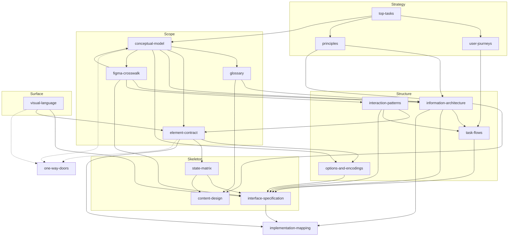

# Document architecture (retired)

> **Retired record.** This was the temporary map of the framework while the document set was
> rebuilt. It binds nothing. The document set, each document's ceiling, the test that decides where
> a sentence goes, the dependency diagram and the index of the owner's questions are in
> `../../README.md`; the model, view and control answer is in `../../conceptual-model.md` 1.1.
> Several statements below were later reversed (the canvas background, the selection above the
> cap, the highlight palette, the state table); where this record and a framework document
> disagree, the framework document wins.

This document is the map of graphty's UX design documentation while it is being rebuilt. It says
which documents exist, the one job each does, where it stops and its neighbour starts, how to
decide where a sentence goes, the order the documents are written in, and where every section of
today's documents moves.

graphty is a graph visualization and analysis tool built as two packages. **graphty-element** is
a standalone web component that owns every graph capability. The **graphty app** is only the
window around it (`CLAUDE.md` at the repository root, "Architectural Principles"). The design
documents serve both: they define what graphty-element must do and publish, and how the app
presents it.

This document is temporary. When the migration in section 8 is finished, the set table, the
routing test and the dependency diagram move into `README.md`, and the migration tables move to
`research/` as a record. The folder then has one front door.

## 1. Why the set changes

The framework had eight documents. Three had grown into catch-alls:
`information-architecture.md` (about 137 KB), `glossary.md` (about 119 KB) and
`conceptual-model.md` (about 109 KB) each did the jobs of two to five documents. The costs:

- **A decision had several homes.** What graphty-element must publish was written in
  `information-architecture.md` 12 and again in `element-contract.md`. Open owner decisions sat in
  three documents. When one copy was edited the others went wrong silently.
- **The structure could not be tested.** An information architecture (IA) is validated by tree
  testing and card sorting against the structure alone (Rosenfeld, Morville and Arango). That is
  impossible while it is interleaved with pixel widths, toast texts, shortcuts and word counts.
- **The next level of detail had nowhere to go.** What happens on 50 nodes and on 500,000, how
  35 style channels are controlled, how data and style are read together, what a stack of 40
  style layers does, how an algorithm's options are shown: these need a state matrix, an options
  document and an interface specification, none of which existed.
- **The model mixed presentation into the ontology.** `conceptual-model.md` named keys (5.1, 6.2),
  screen rows (6.1), screen strings (5.2) and inspector placement (6.3). Johnson and Henderson
  are explicit that a conceptual model describes "what users can do with the system" in terms of
  tasks, "not keystrokes, mouse-actions, or screen graphics".

The fix is moving content to the document whose job it is, writing the few documents that are
missing, and keeping each one small.

### 1.1 The canon the set follows

| Source | What it contributes |
|---|---|
| Garrett, *The Elements of User Experience* (2nd ed., 2011) | Five planes -- strategy, scope, structure, skeleton, surface -- each resting on the one below. The set is layered on them (section 6) |
| Johnson and Henderson, "Conceptual models: begin by designing what to design", *interactions* 9(1), 2002 | The model is objects, attributes, operations and relationships, and nothing about screens. It is designed first; its lexicon is the glossary |
| Rosenfeld, Morville and Arango, *Information Architecture* (4th ed., 2015) | IA is organisation, labelling, navigation and search systems. Faceted classification, which the routing test in section 5 uses |
| Brown, "Eight principles of information architecture", 2010 | Front doors (entry points) and growth (rules for adding things), both missing from the old IA |
| Covert, *How to Make Sense of Any Mess* (2014); Klyn | Ontology, taxonomy and choreography as separate deliverables: the model and glossary, the IA, the flows |
| Object-oriented UX (Prater and others) | The object map: objects, relationships, calls to action, attributes |
| Cooper and others, *About Face* (4th ed., 2014) | The interaction framework; "optimise for intermediates" |
| Tidwell, Brewer and Valencia, *Designing Interfaces* (3rd ed., 2020) | Patterns as named, reusable solutions with context and rationale |
| Norman, *The Design of Everyday Things* (2013) | Feedback, mappings, and mode errors |
| Munzner, *Visualization Analysis and Design* (2014) | Attribute types, channel effectiveness, linked multiple views, scale limits |
| Frost, *Atomic Design* (2016) | Atoms live in the design system; templates articulate content structure |
| Hurff, "the UI stack" (2015) | Every screen has ideal, empty, error, partial and loading states |
| Nielsen Norman Group, "User journeys vs. user flows" | Journeys span sessions; flows are one task in one sitting. Two documents |
| Nielsen, "Response times: the 3 important limits" (1993) | 0.1 s, 1 s and 10 s: the response classes |
| W3C, WCAG 2.2 (2023) | The conformance target; 1.1.1 (non-text content) and 1.4.11 (non-text contrast) matter most for a canvas |
| McGovern, *Top Tasks* (2018) | Task performance indicators as the measure of the whole design |
| Richards, *Content Design* (2017) | Content design as its own discipline and document |

## 2. Decisions that shape the set

Each decision below is reversible and was made on the evidence in
`research/document-set-trials.md`. Where a decision opens a one-way door, the door is named and
goes to `one-way-doors.md` as a recommendation.

1. **Documents own rules and reasons; code owns values.** When a value has a home in code, the
   document states the rule and points to it. Key chords live in
   `graphty/src/components/shell/bindings.ts` ("the one keybinding table"). Chrome token values
   live in compact-mantine's `design/figma-spec.md` (sections 2.1 to 2.9, on the PR #409 branch
   until it merges). Style channels, option schemas and palettes live in graphty-element
   (`session/styles/channels.ts`, `catalog/types.ts`, `catalog/palettes.ts`). Strings move to a
   strings module once the app has one. A second copy of a value in a document is the defect this
   rebuild removes.
2. **Every behaviour and every place has an Owner:** Element (a bare `<graphty-element>` on a
   third-party page behaves this way), App (chrome only), or Element surfaced by the app (the
   element publishes the state and the operation; the app draws the control). The test: if a
   third party embedding the element would have to rebuild it, the owner is Element. The evidence
   that this is needed: the documentation of `Graph.deselectNode` (`graphty-element/src/Graph.ts`,
   around line 2252) tells a third party to wire up Escape on their own page, and
   `graphty-element.ts` has no Escape handling at all.
3. **The model's operations are the element's commands.** The undo design
   (`.worktrees/element-undo/design/undo/undo-design.md`) makes every project mutation an undoable
   command with a label. So "control" in the owner's MVC question is already in the model, as
   operations. What the control documents add is only how a command is invoked: the command
   catalogue in `interaction-patterns.md` (operation, command name, undo-label template with one
   example, where it can be invoked, Owner, and the chord's role, whose key lives in the element's
   default keymap or in `bindings.ts`). The catalogue is checked by name against the element's
   command definitions (undo design 4.1), not the assistant's `CommandRegistry`, and is replaced by
   generation from them once they exist. It is marked provisional
   until the undo work merges.
4. **State is classified by owner, by undo, and by whether it is saved.** Section 7.2 has the
   table. The "saved" question has two columns: saved today (almost nothing is, because there is
   no project file, issue #301) and recommended saved. Every "recommended saved" is a
   file-format door.
5. **A recipe is Figma's library, adapted.** A Figma library publishes styles, variables and
   components apart from any file, and other files use them. A recipe does the same for style
   layers and analysis steps, so communities share starting points without sharing data. The
   policy when a recipe changes or disappears is already decided in `research/figma.md` (the row
   on references that outlive their target, around line 1048): Figma's component policy, not its
   style policy. Applied to recipes: copy on apply, keep provenance, offer updates, and let a
   missing recipe be re-pointed by hand. "Load style" and "load recipe" are one artifact with
   optional parts. The default overview recipe ships in graphty-element so every consumer gets
   it. The file format and whether provenance is stored are one-way doors.
6. **Recipes enter through two commands, not a rail place.** "New from recipe" (inside New) and
   "Apply recipe" (a project command: project menu, command palette, and the graph-level inspector
   when nothing is selected). A desk walk showed Open and New alone cannot express "keep the data,
   change the analysis". A Library place on the rail waits until a collection of saved recipes
   exists and a tree test supports it.
7. **Three representations of the graph, and the accessibility decision lives with them.** The
   drawing shows an element among its neighbours; the inspector shows one element raw; the table
   shows many elements raw. They share selection and scope. The canvas and the table are peers;
   the inspector follows. A summary of the attributes (type, measurement level, distribution,
   missing values, which encoding uses it) is not a fourth representation: it lives in the
   inspector when nothing is selected and in the table's column header. Because a WebGL canvas is
   non-text content (WCAG 1.1.1), the table and inspector are also the canvas's accessible
   equivalent, and every fact the drawing conveys, selection included, must be readable there.
   The IA owns this decision. There is no separate accessibility document.
8. **No canvas document.** Every fact in the Figma canvas study found a home in the patterns (with
   Owner = Element), the visual language's graph part, the state matrix or the element contract.
   The element contract gains a section, "What a bare embed does", listing the patterns and
   graph-surface rules whose Owner is Element.
9. **The Figma crosswalk owns two tables only:** the object map and the departures ledger. The
   object map is written from Figma's side, in Figma's own object list (Page, Section, Frame,
   Group, Layer, Component, Instance, Variant, Style, Variable, Collection, Mode, Flow, Comment,
   Annotation, Version, Branch, Library, plus File, Selection and Viewport), so that an unmapped
   Figma object shows up as a rejection rather than an omission. The library gap was found this
   way. Places and patterns carry a "Figma source" field on themselves instead of rows in the
   crosswalk.
10. **The visual language has two parts and no token values.** Part A, chrome: when graphty uses
    compact-mantine's tokens and where it departs (the accent means interface state and never
    data; chrome never borrows a data colour; the high-contrast interface option is not the
    graph's "High contrast" Look; density rules for the data table). Part B, the graph surface,
    written as requirements on graphty-element: palettes by measurement level, disjointness of the
    highlight palette, default greys, the selection mark, label contrast, and one data colour drawn
    identically on the four **colour surfaces** (canvas, legend, table swatch, inspector).
11. **Scale classes are defined by which mechanism fails, not by node counts.** Small (everything
    drawn, every list browsable); over the selection cap but drawable; over the drawing limit (not
    drawn; the table leads); does not load. Each boundary cites the constant or issue that sets it
    and is marked "unmeasured" until a calibration run fills in its number. Response classes use
    Nielsen's 0.1 s, 1 s and 10 s limits. With these, the IA can use the classes by name now and
    the numbers can change without restructuring anything.
12. **Element needs are issues, named inline, listed once.** A document names a need in one line
    with its issue link where the need arises. The one list of those issues is the "Element
    needs" ledger in `element-contract.md`. No document has its own element-needs section, and
    the implementation map points to the ledger.
13. **Every document has a size ceiling and a split rule.** A review fails a document over its
    ceiling that has not moved content to its owner. Ceilings are in section 3.
14. **Three labels are settled.** "Catalogue" is the browsable registry of extensions
    (algorithms, layouts, palettes, formats), matching `graphty-element/src/catalog/`. "Library"
    is reserved for portable, shareable artifacts such as recipes; the Results panel's copy
    changes to match. Bare "view" is banned: the object is a "saved view" (published as
    `SavedView`), the drawing, inspector and table are "representations", and MVC's sense is "the
    view layer".

## 3. The canonical set

Eighteen content documents, the README, and this document while the migration runs. Owners are
roles in the design studio; one person may hold several. The "Plane" column is Garrett's plane, not a status; each
document's status is set once, in `README.md`. Numbers here count the README and this document
first, so they run ahead of `README.md`'s; cite the README's number.

| # | Document | Plane | Its one job | Owner role | Ceiling |
|---|---|---|---|---|---|
| 1 | `README.md` | -- | The front door: what the framework is, the reading order, rules every document follows | Design director | 10 KB once the Figma table moves out |
| 2 | `document-architecture.md` | -- | This map, until the migration ends | Design director | retired |
| 3 | `top-tasks.md` | Strategy | Why analysts come: ranked goals, evidence, success measures | UX researcher | 30 KB |
| 4 | `user-journeys.md` | Strategy | How work unfolds across sessions, one journey per rhythm of the work | UX researcher | 15 KB |
| 5 | `principles.md` | Strategy | How trade-offs are settled: baseline, ranked principles, ledger, fixed rules including accessibility (the response classes are `interaction-patterns.md` 3.3) | Design professor | 40 KB |
| 6 | `conceptual-model.md` | Scope | What exists: objects, attributes, operations, relationships, lifecycles, the object map and the state table | Information architect, with the graphty-element API steward | 4,000 words |
| 6a | `graph-conventions.md` | Scope | How every analysis reads a graph: declared and detected properties, weight roles, degree, density, normalization, comparison statistics; what every run's record cites | Network scientist, with the graphty-element API steward | 20 KB |
| 7 | `glossary.md` | Scope | What each concept is called | Content designer | 40 KB |
| 8 | `element-contract.md` | Scope | What graphty-element publishes and does, including a bare embed's behaviour, and the element-needs ledger | graphty-element API steward (front-end architect) | 60 KB |
| 9 | `figma-crosswalk.md` | Scope | How graphty's objects map onto Figma's, and the departures ledger | Figma product designer | 15 KB |
| 10 | `information-architecture.md` | Structure | Where things live and how they are found, and the representation model | Information architect | 45 KB |
| 11 | `interaction-patterns.md` | Structure | How things behave: composition-level patterns, modes, key ownership and dispatch, the command catalogue | Interaction designer | 80 KB (raised from 50 KB: it now holds the command catalogue, the full object-by-verb matrix and a complete entry form per pattern) |
| 12 | `options-and-encodings.md` | Structure | How large option spaces are controlled: the one form generated from a schema, for style channels, algorithm and layout options, import mapping and export | Visual designer, with the interaction designer | 30 KB |
| 13 | `task-flows.md` | Structure | The step sequence of each top task and end-to-end route | Interaction designer | 70 KB (raised from 35 KB: every top task gets a step table, which is the hand-off to implementation; past 70 KB it splits by task tier) |
| 14 | `state-matrix.md` | Skeleton | What every surface does in every state, concern level, collection count and mode, and the story that proves each | Interaction designer, with the front-end architect | 40 KB |
| 15 | `interface-specification.md` | Skeleton | Templates as deltas from Figma: regions, row types, which component does which job, with a component status column | Figma product designer | 72 KB (the Figma selection mapping, the load step and the full option vocabulary are its own content) |
| 16 | `content-design.md` | Skeleton | Voice, copy conventions, word budgets, and the message catalogue until a strings module exists | Content designer | 25 KB |
| 17 | `visual-language.md` | Surface | Part A, chrome rules over compact-mantine's tokens; Part B, the graph surface as element requirements | Visual designer | 20 KB |
| 18 | `implementation-mapping.md` | Beyond the planes | From specification to code: state ownership, data flow, module structure, the shell audit, Storybook structure, traceability | Front-end architect | 30 KB |
| 19 | `one-way-doors.md` | -- | The owner's expensive-to-undo decisions, with recommendations | Design director; decided by the owner | 60 KB |

Studies are planned in one schedule, `research/study-schedule.md` (the top-task vote, tree tests,
card sorts, first-click tests, cognitive walkthroughs, the accessibility audit), because studies
share participants. It is a plan of work, not a design fact, so it is not a canonical document.
Each canonical document has its own "Validation" section saying how it is tested.

Every document opens with a header: its job in one sentence, a "Not here" list, its owner, its
ceiling and how it is validated. It closes with "Sources". The design professor reviews every
document against this map before it is accepted.

What was considered and not adopted: a separate accessibility document (the decision that matters
is structural and belongs to the IA's representation model); a canvas specification (section 2,
item 8); a validation-plan document (a second copy of each document's validation section); one
file for journeys and flows (they have different units, many sessions against one sitting, and
different validation methods); folding the crosswalk into the IA (a search over "Figma source"
fields cannot produce the object rows); folding the options document into the specification (five
option spaces would each grow their own disclosure rules).

### 3.1 Each document's boundaries

"Owns" means the fact is written there and only pointed to elsewhere.

**`top-tasks.md`.** Reads: `design/designloom/personas/` and `workflows/`, research. Owns: the
task list, frequency, rank, success measures (success rate and time per task), and the evidence
caveat (the ranking is derived from 25 workflows and 12 personas, not a top-task vote). Adds
"start from a recipe" as a ranked task, and states that task 1, characterize the whole graph,
computes whatever the project's overview recipe says. Not here: how a task is carried out (task
flows), where it lives (IA), rules the model enforces (conceptual model). Validation: the
top-task vote.

**`user-journeys.md`.** Reads: personas, workflows, top tasks. Owns: one journey per rhythm of
the work (a first look, a weekly return, an alert investigation, a starting point that travels;
publishing is the closing stage of two of them, not a journey): stages, goals, thoughts, pain
points, and the top task or object that serves each stage. The number of rhythms is set by the
workflows, not by a limit. A journey may only
point at tasks and objects that exist; it never originates a requirement, because journeys drawn
per persona grow persona-specific features. Not here: screens or clicks. Validation: interviews
with people who match the journey.

**`principles.md`.** Reads: research, top tasks. Owns: the baseline (Figma's way), the ranked
principles, the conflict ledger, and the fixed rules: WCAG 2.2 AA naming 1.1.1 and 1.4.11,
"a budget is a test", the marks are closed. Not here: the
departures list (crosswalk), marks' wording (glossary) and placement (content design), screen
compositions (interface specification), behaviour at a size (state matrix). Validation: each
principle's test applied to the ledger's conflicts.

**`conceptual-model.md`.** Reads: research, top tasks, the sets and undo designs, graphty-element
source. Owns: objects, attributes, operations (the element's commands, in analyst terms),
relationships, lifecycle states and diagrams, the object map, graph traits, spaces and positions,
the ways to narrow a graph, ordered sets, measurement levels, edges as full peers of nodes,
portable artifacts including the recipe, extension points, and the state table (section 7.2).
Not here: screens, keys, strings, components, published names (glossary), published shapes
(element contract). Validation: every top task can be expressed with the model's objects and
commands, every command is one undo step, and the model can be read to an analyst without a word
about the screen.

**`glossary.md`.** Reads: the model. Owns: preferred terms, definitions of at most two sentences,
rejected synonyms, broader and narrower terms (a path is a kind of set), aliases, the tier where a
word may appear, published names and their changes, and a machine-readable word list. Not here:
copy conventions (content design), placement or behaviour of interface words. Validation: the word
list run over every document; no rejected word appears.

**`element-contract.md`.** Reads: the model, the glossary, graphty-element source. Owns:
identities, addresses, records, events, the file's shape, the expression language, retention,
the channel list and its grouping (arrowhead and arrowtail pairs), the option schema and its gaps,
scale limits, the default overview recipe, the default canvas input map as configurable defaults,
"What a bare embed does", and the element-needs ledger (issue links only). Every entry names a
real file and line, or is marked as a need. Not here: open decisions (it is written on the
recommendation and says so).

**`figma-crosswalk.md`.** Reads: `research/figma.md`, `design/ui/figma/`. Owns: the object map
(each Figma object: adopt, adapt or reject, naming the graph fact that forces a departure) and the
departures ledger. Not here: placements (IA) or behaviour (patterns), which carry their own
"Figma source" field. Validation: completeness walked from Figma's object list.

**`information-architecture.md`.** Reads: the object map, the glossary, top tasks, journeys, the
crosswalk. Owns: the collection inventory (every object shown as a list, with its size range and
growth rule per scale class), organisation schemes per collection, the place inventory with Owner,
Figma source and focus-region order, a structure diagram, the navigation model (global, local,
contextual, supplemental), the search model per scale class, entry points (including the embedded
consumer and the two recipe commands), the representation model and its accessibility role,
output homes, rationale and rejected alternatives, and rules for growth. Not here: sizes, section
order within a surface, keys, strings, states. Validation: a tree test of the text outline with a
small-graph and a large-graph script, and a closed card sort of the catalogue families.

**`interaction-patterns.md`.** Reads: the crosswalk, `design/ui/figma/flows.md`,
`design/ui/figma/accessibility/` (tab order per region, region cycling, screen-reader captures),
principles, the undo design. Owns: composition-level patterns across components, surfaces and the
canvas, each on one screen with Use when, Why, Trigger, Behaviour, Feedback, Undo, Exceptions,
Owner, Outcome, Figma source or departure, Inherits (the compact-mantine component, when one
applies), Today and Validated by; the list of modes
with entry, exit and indicator; the commit and cost rules with the response classes (0.1 s, 1 s,
10 s); keyboard operation of the canvas, key ownership and dispatch; and the command catalogue.
Component-level behaviour (commit on Enter, scrub) is the compact-mantine story's, not repeated
here. Not here: which surface a pattern appears on, a task's step sequence, chords (code).
Validation: each element-owned pattern is exercised on a bare embed.

**`options-and-encodings.md`.** Reads: the model (style layer, encoding, measurement level), the
element contract (channels, option schema, cost classes), Munzner. Owns: the rules of the one form
generated from a schema: grouping, disclosure tiers ordered by channel effectiveness and workflow
frequency, presets, reset to default, "Mixed" on a multi-selection, bound-value rows, encoding
kinds (constant, categories, scale) following the attribute's measurement level, legend rules, and
the commit rule (a cheap edit applies live; an edit estimated over 1 s becomes an explicit Run;
over 10 s it shows its cost first, which is feedforward and never a question). Not here: the channel list or schema (element contract), anything
specific to one feature, row templates (interface specification). Validation: route the same
rules through all five option spaces and check none needs its own disclosure rule.

**`task-flows.md`.** Reads: top tasks, journeys, IA, patterns. Owns: one mermaid flow per top task
and per end-to-end route (comparison, time, import and re-map, replace data, apply a recipe,
export and report, expand from seeds), with branches, a step table naming the graphty-element call behind each
step, and the step count from rest. A flow cites patterns and never defines behaviour; a step with
no pattern means a pattern is missing. Validation: the link and label check
(`research/scripts/check-flows.mjs`), cognitive walkthrough against the workflows, and task-based
tests on a prototype against the success measures in `top-tasks.md`.

**`state-matrix.md`.** Reads: the element contract (limits), research measurements, the patterns.
Owns: scale classes and collection-size classes, the mode axis, and a matrix of surface by state
(blank, loading, partial, ideal, error, out of date, running, over the drawing limit,
disconnected source, read-only), each cell naming the pattern that applies. A budget column per
scale class, each value citing a measurement, saying "unmeasured", or saying "software renderer,
ratio only". Not here: strings (content design), object lifecycle states (model). A limit caused
by an element defect is labelled as one: the 5,000 selection cap is one mesh per selected node
that is never freed, so its row names the defect, not "scale". Validation: every cell points to a
template and, once built, a story.

**`interface-specification.md`.** Reads: IA, patterns, options, state matrix, visual language,
crosswalk, compact-mantine stories. Owns: each template as a delta from the Figma pattern it
instantiates (a template with no Figma citation is either an invention that needs a principle or
an omission), regions inside a place, row types, which component does which job, the rows of the
style-layer list ("Overrides"), tab order within a template, and a component status
column (exists, needs a variant, missing) against compact-mantine on the PR #409 branch. A missing
component is a filed compact-mantine issue, never a local control. Not here: tokens, strings,
code.

**`content-design.md`.** Reads: glossary, principles, state matrix, interaction patterns,
`codes.ts`. Owns: voice and tone, the copy conventions, message types and their caps, numbers and
dates, where each mark shows and how it is spoken, what counts as app text and the counted-state
stories, the undo-label grammar (the element's command definitions hold the values and test the
grammar), and the message catalogue until the strings modules exist. Not here: when a message
appears (interaction patterns), the budget numbers (principles), what an error code means
(`codes.ts`). Validation: reader testing of the catalogue, marks and state lines.

**`visual-language.md`.** Reads: compact-mantine's `design/figma-spec.md`, `design/ui/figma/`
dark-theme and canvas captures, `catalog/palettes.ts`. Owns: Part A and Part B as in section 2,
item 10. Part B opens with the measured failure of today's halo and links its issue; every rule
after that states what the element must do. A palette-against-background contrast rule is stated
here with its threshold and enforced by a test next to `palettes.ts`. Not here: token values
(compact-mantine), component choice (interface specification).

**`implementation-mapping.md`.** Reads: the interface specification, compact-mantine,
`graphty/src/components/shell/`, the element contract. Owns: state ownership (the app never holds
a copy of element state), data flow (React reads through `useSyncExternalStore` over the session's
watcher sets in `GraphSession.ts`; every write is a session command, so it is undoable), the one
generic form built from `OptionDescriptor`, module structure (one module per place), the shell
audit (each module marked "consumes the element" or "workaround, issue filed"), Storybook structure
covering every state-matrix cell, and traceability from top task to flow to template to story, with
a column "reachable by element API alone". Not here: design decisions or the element-needs list
(it points to the ledger).

**`one-way-doors.md`.** Reads: every document. Owns: open expensive decisions, each with options,
a recommendation and dependents. Not here: anything reversible.

## 4. The owner's notes, and where each is answered

Each note gets a heading in the document that owns it, phrased as the owner's question, so a
search for the question finds one home.

| Note | Answered in | The answer the document must give |
|---|---|---|
| "Replace data" could also be "load style" or "load recipe", sharing starting points without data | top tasks (the task); conceptual model (the recipe); IA (the two commands); one-way doors (format, provenance) | One artifact with optional parts, adapted from Figma's library; copy on apply, keep provenance, offer updates. A recipe is Replace data's inverse and matches by attribute names, never element ids |
| Characterizing a graph as a default overview recipe, domain-specific, replaceable | top tasks (task 1); conceptual model; element contract (the default recipe) | The default ships in graphty-element; replacing it is a project setting pointing at a recipe, not a persona feature |
| A list is an ordered set; can sets carry an order and become paths? | conceptual model | A path is a sequence whose set reading is its distinct members, as the sets design stores it; a list allows repeats and a walk needs them. No other set carries an order: a ranking or a traversal order is an attribute sorted on read, because a stored order drifts from its values. The path keeps its own object type on screen. Figma has no counterpart for a path |
| Self-loops, multi-edges, directed or undirected, tree, DAG in the ontology? | conceptual model (graph traits); glossary | Yes, as traits of a graph, declared or derived, not object types. They gate which operations apply (a topological sort needs a DAG) and which statistics make sense |
| Node location, space, coordinate system, especially for layouts | conceptual model (layout settings, positions and space) | Positions are presentation state keyed by element id, written by layout settings; an axis is arranged or encoded from an attribute (latitude and longitude through a named projection), and the coordinate system is a property of the layout settings. The camera is transient; a saved view stores one |
| Two kinds of filter: one that changes the view, one that removes nodes; is that a derived graph? | conceptual model (filter steps and the filtered graph) | Yes, but not the split the note draws: every filter step changes what analysis and layouts see, and "all nodes of type X, styled" is a style layer's selector; steps come in two kinds, a working set (searches may cross it) and a data step (they may not); Remove is a data edit; a derived graph exists only when an operation creates elements in no data. A run must record the filter it read (today it records only a boolean, `RunRecord.filterScope`, `session/runs/types.ts` around line 201: an element need) |
| Types of exports and imports: recipes, styles, data, notes, or combinations | conceptual model (portable artifacts); IA (entry points and output homes); one-way doors (formats) | Each artifact's contents and identity, which combine, and which carry element ids against only attribute names |
| Are all extension points in the ontology? | conceptual model (extension points); element contract (registries) | The registries in `graphty-element/src/catalog/` as one concept, "a capability registered from outside", with the objects each produces |
| Sets with continuous styling values versus sets with group values | conceptual model (measurement level); options-and-encodings (encoding kinds); visual language Part B (palette by level) | A categorical attribute yields groups and a categorical palette; a quantitative one yields a scale and a ramp, and a set only through a threshold or band. The kind follows the attribute's level |
| The ontology confuses MVC; should view and control be first-order concepts? | conceptual model (the state table); this document (section 7.2) | No. The model holds objects, operations and state, including objects about presentation; the view and control layers are documents |
| Edges can have types and attributes | conceptual model; glossary; IA (the attribute collection lists node and edge attributes) | Edges get the same typing and attribute treatment as nodes, stated once |
| Visualizing data in context versus raw data | IA (the representation model) | Section 2, item 7 |

## 5. Where a sentence goes

Every sentence is classified on three facets. The **kind** alone chooses the document. The
**Owner** (Element, App, Element surfaced by the app) is recorded with it. **Value or rule**: if
the sentence states a value that has a home in code, it becomes a pointer to that code.

| Kind | Document |
|---|---|
| An open decision that would re-key saved files or break published API | one-way doors |
| A fact about an object, attribute, operation, relationship or lifecycle state, true with no screen | conceptual model |
| A published identifier, shape, event, file field, limit or default | element contract |
| What a concept is called | glossary |
| A rule that decides between two good designs, or a fixed rule | principles |
| A correspondence with a Figma object, or a departure from Figma | figma crosswalk |
| Which place something lives in, how a collection is organised, how it is reached or found | IA |
| A rule of the generated form, an encoding or a legend | options-and-encodings |
| What happens in response to an input or a mode, wherever it appears | interaction patterns |
| An ordered sequence of steps toward one goal | task flows |
| Work across days and sessions | user journeys |
| What changes with graph size, collection size, loading, failure, emptiness or a mode | state matrix |
| A region inside a place, a row type, a section order, which component does a job | interface specification |
| A string the analyst reads, or a word budget | content design |
| When a token or palette is used, or what the graph surface must look like | visual language |
| A code module, component file, story or test | implementation map |
| Evidence or precedent | `research/`; the reason for a decision stays next to the decision |

A sentence with two kinds is two sentences. A sentence that states a model fact and then quotes a
screen string ("stays in the list marked 'covered by Color by logFC'") is split: the fact goes to
the model, the string to content design.

**Status.** The earlier ordered list placed 56% of 48 real sentences in one home. A faceted test
with nine kinds placed 75% of 71 (`research/document-set-trials.md` 1). The table above adds the
kinds that trial found missing: Figma correspondence, generated-form and encoding rules, published
shapes against model facts, terms against strings, and places against regions. The test is
accepted when a re-run of the same 71 units, split into single-kind clauses, places at least 90%
in one home and none in no home. Until it passes, no phase-1 document is rewritten.

## 6. Dependencies

Arrows point from a document to the documents that read it.

Three loops are expected and are not cycles in authority. The crosswalk and the model are written
together, because fitting the ontology to Figma changes the model. Element-owned patterns and the
graph surface feed the contract's "What a bare embed does". The specification and the
implementation map find gaps that go back upstream; the upstream document is edited and the
downstream one re-derived.

## 7. Order of work

### 7.1 Phases

**Before phase 1.**

1. Adopt the routing test in section 5 and re-run it (section 5, "Status"). Nothing is rewritten
   until it passes.
2. File the known element needs as graphty-element issues, so documents can cite links: the filter
   a run read, recorded on the run; `ChannelExplanation` publishing the attribute path and input
   value; a bulk read of resolved style values for sorting; the selection mark drawn behind the
   node, not as a tint; batched halos disposed on deselect; Escape handled by the element; option
   presets and the cost of a specific value (`OptionDescriptor` already has `group` and
   `advanced`); scope count and membership readable from the session; the default overview recipe
   in the element; the canvas input map as configurable defaults; and a calibration probe for the
   limits. Two are filed: #545 (zoom step and zoom to selection) and #546 (modularity bands).

**Phase 1: the model and what the element owns.** In parallel:

- **Conceptual model**, written together with the **crosswalk's object map**: remove presentation
  (section 8.2), add the object map, the state table, and every owner note routed to it.
- **Glossary**: the three label decisions (section 2, item 14), trimmed definitions, the word list.
- **Element contract**: merge `information-architecture.md` 12; the channel list and grouping (13
  real node channels, since `node.marker` has type `never`; 21 edge channels, 12 of them arrow
  channels folding into head and tail pairs, leaving 15 edge rows); the option-schema gaps; the
  default overview recipe; the element-needs ledger; "What a bare embed does".
- **Element-owned patterns**: selection (click, Shift+click, marquee, the cap, Escape), selection
  feedback (never changes the colour an encoding produced), commands and undo, long-running work
  and the response classes, modes, canvas keyboard, linked representations. The command catalogue,
  provisional.
- **Scale classes** by failing mechanism, numbers "unmeasured"; the IA's collection inventory as
  input.
- **Visual language**: Part A whole; Part B's selection rules only (the mark never changes a
  node's fill; it meets 3:1 against both canvas backgrounds and every built-in palette colour,
  which only a two-tone ring achieved; the highlight palette is disjoint from every categorical
  palette and the accent).
- **Principles**: move the departures out; add the accessibility rule (the response classes are `interaction-patterns.md` 3.3, which `state-matrix.md` 4 cites).
- **Top tasks**: the recipe task, success measures, the evidence caveat.
- **One-way doors**: record the doors listed in section 7.3.

**Phase 2: structure.** The IA in its canonical shape, tree-tested with small-graph and
large-graph scripts. The implementation map, starting with state ownership and the shell audit.
User journeys.

**Phase 3: one thin slice.** "Colour nodes by an attribute, read the legend, then run Degree and
size nodes by it", carried through every document to a Storybook story that exists. It exercises
palettes, the legend, the table's colour swatch, the halo, `explain` in the table, a run with a
cost estimate, progress and cancel, and one undo that reverses the style change and leaves the
run. If it needs a component or element change, it stops and files the issue; it never grows a
local workaround. At the end, count the slice's sentences the routing test could not place
cleanly. If the count is high, merge the documents the failures cluster in.

**Phase 4: breadth.** The remaining patterns, options-and-encodings, task flows, the state matrix
and interface specification written together, content design, the rest of Part B (greys, label
legibility, palette by measurement level, level of detail per scale class). Extend the slice to
the overview recipe once the recipe's one-way-door entry is written.

**Phase 5: studies.** The top-task vote, the catalogue card sort, first-click tests on the table,
the accessibility audit, as scheduled in `research/study-schedule.md`.

### 7.2 The MVC answer: what the model holds

The owner's note is right that the old model mixed concerns: it contained keys, rows and strings,
which are the view and control layers. Those leave. It is wrong only in the remedy: view and
control are not objects of the analyst's domain, so they are not added to the ontology. Instead,
each MVC part is a set of documents:

| MVC part | What it is in graphty | Documents |
|---|---|---|
| Model | Objects, relationships, lifecycles, operations (the element's commands), and state | conceptual model; element contract |
| View layer | Representations, places, templates, appearance, strings | IA; interface specification; visual language; content design |
| Control layer | How commands are invoked: patterns, modes, the command catalogue, chords | interaction patterns; task flows; `bindings.ts` |

Some model objects are about presentation: a style layer, a saved view, a note, stored positions,
a Look. The analyst creates, names, saves, shares and undoes them, as Figma users do styles and
comments. Two tests draw the line. **Would a third-party consumer of graphty-element need this
state to rebuild graphty's behaviour?** If yes, it is model and the element owns it. **If two
analysts open the same file with different app themes, does it differ between their screens?** If
yes, it is not model. The graph's Look, including its canvas background, is model; the app theme is
a reader preference.

The state table is carried by `conceptual-model.md` section 2, which owns it; as it stood when this document was written:

| State | Owner | Undoable | Saved today | Recommended saved |
|---|---|---|---|---|
| Graph, attributes, positions, pins, layout choice, runs, results, style stack, sets | Element | yes | no (style stack and saved views only by element export) | yes: the project file |
| Visibility filter, time window, show-context | Element | yes | no | yes |
| View mode (2D or 3D) | Element | yes | no | yes |
| Selection, hover, focus, camera | Element | no | no | no (the camera only inside a saved view) |
| Open panel, active tab, dock width, app theme | App | no | reader preference | never in the project |

Every "yes" in the last column is a file-format door. Until it is decided, a pattern whose state
is undoable but not saved says so openly: Ctrl+Z restores a cleared filter, and reopening the
project does not.

### 7.3 One-way doors this work opens

Each goes to `one-way-doors.md` as a recommendation; none is decided here.

- **Recipe format and provenance.** Recommendation: one artifact with optional parts, copied on
  apply, with provenance stored. The question for the owner, in plain words: "When a community
  improves a recipe you applied, should your project be offered the update, or change by itself?"
  Recommendation: offered.
- **Which state is saved**, row by row from the table above.
- **The selection mark's default**: form (a ring behind the node), colour (two-tone) and scale are
  published defaults.
- **The canvas background belongs to the Look**, saved in the file, not to the app theme. The
  alternative (background follows the app theme, palettes adjusted per theme) breaks the rule that
  the app theme never changes data colours.
- **Palette identifiers**, and any change to the default categorical palette if its black entry
  fails against the default dark Look.
- **The default canvas input map**, published as configurable defaults.
- **The selection cap**, if a GPU run with batched halos supports raising it.
- **Option-schema additions** (presets, cost of a value) and channel grouping, as published types.
- **A bulk resolved-value read**, if `explain` cannot sort 50,000 rows within 1 s.

### 7.4 Guidance on the owner's example questions

These are examples of the depth every document must reach, not a checklist.

- **Large and small graphs** (state matrix). Classes by failing mechanism (section 2, item 11).
  For each class, what changes on every surface and what never changes: behaviour never depends
  on size; only presentation may. Beyond the drawing limit, the table leads and search replaces
  browsing (IA).
- **How many style controls** (options-and-encodings). 13 node channels and 15 edge rows once
  arrow pairs fold. A section rests collapsed or empty until used, as Figma's Effects and Export
  do; the first tier follows channel effectiveness and workflow frequency.
- **Data and style at once** (IA and options). The inspector's value rows show each value and the
  layer that paints it; the table can show a column's encoded value (element needs: the attribute
  path on `ChannelExplanation` and a bulk read); the legend selects what it encodes; every
  encoding the legend shows has a text form in the table.
- **Many style layers** (state matrix for count classes; interface specification for rows). For
  every collection -- style layers, runs, sets, notes, saved views, graphs, attributes, categories
  in an attribute, filter steps -- say what the list does at 0, 1, a few, many and very many (show
  all, "N more", group, search). Categories beyond about a dozen distinguishable hues need a
  stated rule (the element already has an overflow policy, `"other"` or `"extend"`, in
  `catalog/types.ts`).
- **Algorithm and layout options** (options-and-encodings; element contract). One form generated
  from `OptionDescriptor`; arguments (source nodes, an attribute), parameters (resolution,
  damping) and edge reading (direction, weight role) are treated differently; the commit rule
  follows the cost class.
- **Selection above the cap** (patterns). Selection is shared across representations up to 5,000.
  Above that, the table keeps its row selection and says "20,000 selected; 5,000 shown on the
  canvas", and offers two explicit commands: "Save as set" and "Filter to these". A gesture never
  silently becomes a project change. The table's count must be read from the element, not held in
  a table-side copy.

## 8. Migration of existing content

Every section of every current document, and where it goes. "Keep" means it stays, possibly
trimmed. Each document is rewritten to its ceiling from its sources, with the old version kept
read-only in `research/` as the record; sections are not first copied into stubs, which would only
create more oversized documents.

### 8.1 `information-architecture.md`

Done. Where each section of the long form landed is the one migration map, in the header of
`research/archive/information-architecture-long-form.md`.

### 8.2 `conceptual-model.md`

| Section | Destination |
|---|---|
| 1 spine | keep; add the object map and the state table; the "Figma counterpart" column to the crosswalk |
| 2.1-2.5 | keep; 2.3 expanded for edges; 2.5 restated as an ordered set kind |
| 3.1-3.3 | keep; add measurement level to 3.1 |
| 4 operations and records | keep, aligned with the element's command names |
| 5.1 | keep the operations; keys to patterns |
| 5.2 | keep; strings to content design; the drawing budget to the state matrix; step sequences to task flows; the four ways to narrow added |
| 5.3, 5.4 | keep |
| 5.5 | keep; add spaces; "the Layout row always shows" to the specification |
| 6.1 | keep the concepts; row placement ("Overrides") to the specification; encoding kinds and legend rules to options-and-encodings; departures from Figma to the crosswalk |
| 6.2 | keep; Shift+C to patterns |
| 6.3 | keep; placement of export settings to the specification; add portable artifacts |
| 7.1-7.6 | keep |
| 8 | keep |
| 9 | keep as conventions; traits lifted into their own section |
| 10, 11 | keep; add extension points |
| 12 | pointer to the crosswalk |
| 13 | delete; pointers to one-way doors and the element contract |
| 14 | to `research/` |

### 8.3 `glossary.md`

| Section | Destination |
|---|---|
| 1, 2 | keep; the review procedure of 1 becomes the word-list check |
| 3 | content design, whole |
| 4-9, 11, 12 | keep; definitions trimmed to two sentences, behaviour moved to the model |
| 10 | keep definitions; the "Where" column and state-line rule to content design; triggers to the state matrix |
| 13 | keep words and definitions; placement to the specification; behaviour to patterns |
| 14-17 | keep |

### 8.4 `principles.md`

| Section | Destination |
|---|---|
| 0-4, 6, ranking, worked conflicts, ledger | keep; worked-conflict drafts labelled as examples |
| 5 | keep the principle and budgets; empty-screen and canvas composition to the specification and state matrix |
| Departures from Figma | the crosswalk's departures ledger |
| How every skill level is served | keep |
| Rules, not principles | keep the rules; the marks list to the glossary (words) and content design (where); add accessibility and response classes |
| Decided elsewhere | keep |

### 8.5 `top-tasks.md`

| Section | Destination |
|---|---|
| Ranked tasks, frequency, contested rankings, limits | keep; add the recipe task, success measures, the evidence caveat |
| Requirements that are not tasks | one-line pointers; the rules to the model and principles |
| Decisions for the owner | keep the pointer |

### 8.6 Other documents

| Document | Destination |
|---|---|
| `README.md` | rewritten to this set; "Where each part comes from" to the crosswalk |
| `element-contract.md` | keep; receives IA 12, channels, option schema, events, limits, the ledger, "What a bare embed does"; section 10's name list becomes a pointer to `glossary.md` 17 |
| `one-way-doors.md` | keep; receives section 7.3 |
| `design/ui/object-first-ux/interaction-patterns.md` | Part 3 (the 27 patterns) and Part 4 (review checklist) to patterns; Parts 1, 2 and 5 not carried |
| `design/ui/object-first-ux/visual-language.md` | 4.3 to 4.8 (accent, selection, data colour, canvas) to the visual language, Part A or B; token values in 3 to 6 and 8 are replaced by pointers to compact-mantine's specification; 2 (grid, row heights) is already rule 3 of that specification, so it becomes a pointer; 7 (which component does which job) to the interface specification; 9 to content design; 10 to patterns; 11 to principles (the target) and the IA (the representation decision) |
| `research/design-method.md` 10 | the review checklist to the study schedule |
| `interface-specification.md`, content from its earlier draft | Merge nodes pair by pair, Re-run on CPU, Update and Revert view, delete never asks, Esc and non-modal behaviour to patterns; Fit power law, degree variants, preset bands and per-edge "directed" to graph conventions; toast and button strings and the chip's width budget to content design; heights, target counts, caps and the dock over the drawing limit to the state matrix; Preferences and menu contents to the IA outline; end-to-end routes to task flows; import and restore report contents and "a note never targets a result" to the conceptual model; build order, state flow and performance budgets to `implementation-mapping.md`. The full text is kept in `research/archive/information-architecture-long-form.md` |

### 8.7 `task-flows.md`

The stub's prose routes are now drawn in `task-flows.md` or listed there as not yet drawn. Its
sentences that were not steps belong elsewhere; the full text is kept in
`research/archive/information-architecture-long-form.md` 8 and 10 and
`research/archive/conceptual-model-long-form.md` 5.2.

| Sentence kind | Example | Goes to |
|---|---|---|
| behaviour | "dragging and playing edit that step and record no undo entries"; "closing the slider removes the step"; Carry over to new run | `interaction-patterns.md` 7.3 and 6 |
| presentation | "top 5 then N more"; A, B and difference columns; sorted by the change | `interface-specification.md`, `options-and-encodings.md` |
| model rule | a different scope is not out of date; Cut off is a count; key matching | `conceptual-model.md` 4.5 and 4.7; `element-contract.md` |
| a reason | why the Path tool keeps a toolbar slot | `information-architecture.md` 11 |

## 9. Validation of the set

The set is working when:

- the routing test passes its bar (section 5), and the thin slice's sentences route cleanly;
- a search for a distinctive phrase (a shortcut, a width, a mark word, a hex value) finds it in
  one document and pointers elsewhere, and finds no value that has a home in code;
- every document is under its ceiling;
- the IA can be printed as a text outline and tree-tested without the specification;
- the model can be read to an analyst without a word about the screen;
- every pattern with Owner = Element works on a bare embed;
- every owner's note has a heading, phrased as the question, in the document named in section 4.

## Sources

Framework and inputs read for this document:

- `design/ui/framework/` (all documents) and `research/document-set-trials.md`, which records the
  routing trials, halo and selection measurements, the `explain` reading, the shell audit, the
  saved-today inventory and the desk walks
- `design/ui/framework/research/figma.md`: the vocabulary list of objects (section 3) and the row
  on references that outlive their target (around line 1048)
- `design/ui/figma/` (folder inventory, `canvas-selection/README.md`, `accessibility/`)
- `.worktrees/compact-mantine-figma/compact-mantine/design/figma-spec.md` (sections 1 and 2)
- `.worktrees/element-undo/design/undo/undo-design.md` (slice table in section 3.1, command
  labels) and `inventory-persistence.md` (sections 1 and 2)
- `.worktrees/element-sets/design/sets/sets-design.md` and `undo-integration.md`
- `graphty-element/src/session/styles/channels.ts`, `session/styles/explain.ts`,
  `session/selection/SelectionApi.ts`, `session/limits.ts`, `session/runs/types.ts`,
  `session/GraphSession.ts`, `catalog/types.ts`, `catalog/palettes.ts`, `config/GraphStyle.ts`,
  `Graph.ts`
- `graphty/src/components/shell/` (`bindings.ts`, `graphCommands.ts`, `readings/`, `insights/`,
  `defaults/`)
- `CLAUDE.md`, "Architectural Principles"
- Issues https://github.com/graphty-org/graphty-monorepo/issues/545 and
  https://github.com/graphty-org/graphty-monorepo/issues/546

Canon (URLs where read):

- Johnson, J. and Henderson, A. "Conceptual models: begin by designing what to design."
  *interactions* 9(1), 2002. https://dl.acm.org/doi/10.1145/503355.503366; quoted from Henderson
  and Johnson, "Conceptual models in a nutshell", https://boxesandarrows.com/conceptual-models-in-a-nutshell/
- Rosenfeld, L., Morville, P. and Arango, J. *Information Architecture*, 4th ed., 2015;
  https://www.oreilly.com/content/the-anatomy-of-an-information-architecture/
- Brown, D. "Eight principles of information architecture." *Bulletin of ASIS&T* 36(6), 2010.
  https://asistdl.onlinelibrary.wiley.com/doi/full/10.1002/bult.2010.1720360609
- Nielsen Norman Group. "User journeys vs. user flows." https://www.nngroup.com/articles/user-journeys-vs-user-flows/
- Hurff, S. "Why your user interface is awkward." https://www.scotthurff.com/posts/why-your-user-interface-is-awkward-youre-ignoring-the-ui-stack/
- Frost, B. *Atomic Design*, ch. 2. https://atomicdesign.bradfrost.com/chapter-2/
- Covert, A. "The sensemaker's guide to controlled vocabularies." https://abbycovert.com/writing/guide-to-controlled-vocabularies/

Standard references cited for their widely known frameworks, not re-read for this document:
Garrett (2011); Cooper and others (2014); Tidwell, Brewer and Valencia (2020); Norman (2013);
Munzner (2014); Kalbach (2020); McGovern (2018); Richards (2017); Nielsen, "Response times: the 3
important limits" (1993); W3C, WCAG 2.2 (2023), success criteria 1.1.1 and 1.4.11 and technique
C40.
