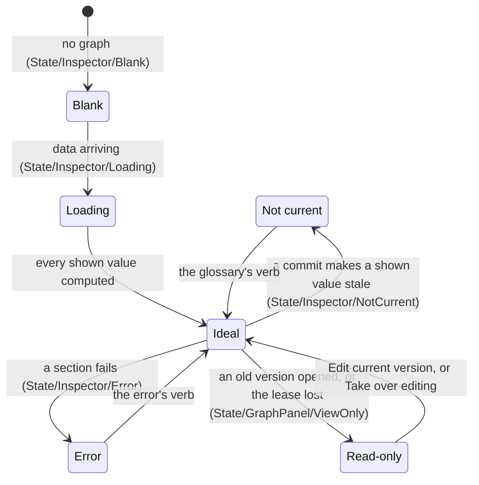
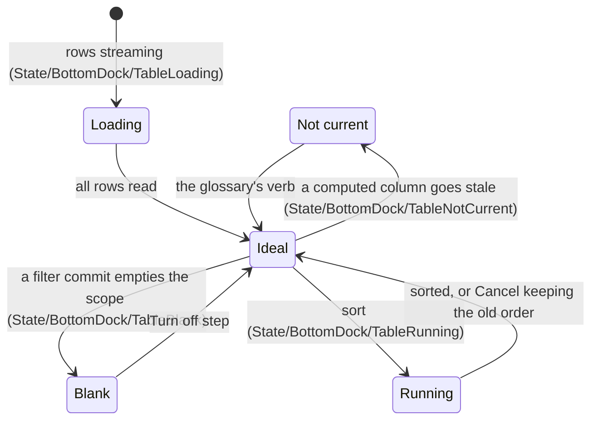

# State matrix

**Job.** Say what changes with graph size, collection size, state, window size and mode: the size
invariant (1), the surface states (2), a cell per place and state with the story that proves it
(3), transitions (3.3), the scale rules (4), each scale concern by level (`scale-levels.md`), windows and modes (8).
**Not here:** every other behavior rule (`interaction-patterns.md`), the run lifecycle among them
(`interaction-patterns.md` 3.8); strings, layouts and legends, each in its own document; which mark wins and where it is drawn
(`glossary.md` 10); inspector caps and target counts
(`interface-specification.md` 4.1a); small-sample and stability conventions
(`graph-conventions.md` 4); the values of the limits (graphty-element's `src/session/limits.ts`)
and where they came from (`research/scale-measurements.md` 6); departures from Figma
(`figma-crosswalk.md` 4); element needs (`element-needs.md`). **Owner:** interaction designer,
with the front-end architect. **Ceiling:** the README's table. **Validated by:** section 9.

**A projection, not a copy.** Every state maps what graphty-element publishes to a surface state
and its fixture; a state the element does not publish is an element need, never an app rule.

## 1. How to read this document

**The invariant**, owned here. Size may change whether a command is offered, what it costs, which
method runs and how its result is presented. It never changes a result silently: every
size-dependent refusal is stated before the click with a route that fits, and every approximation
is labeled wherever its number is read. Every cell is reviewed against these two sentences.

**Three matrices and lookup tables, never multiplied.** Place by state (3), concern by level (5)
and collection by count (7); channel readability (6), modes and window classes (8). Multiplying
them gives thousands of untestable cells; where two axes interact, the case is listed once in 8.

**Cells record departures.** Each state has a default, owned by the document section 2 names. A
cell is written only where a place departs from it. The coverage grid (3.1) marks every place
against every state, so an unwritten cell reads "checked, follows the default", never "not
considered".

**The fields of a cell.**

| Field | Meaning |
|---|---|
| Parent | a place of `information-architecture.md` 4, spelled as there; a device is filed under the place whose state it shows (the load step and Export form under Canvas, the project name under Graph panel, a rail button under its panel, an editor under the place it opens from) |
| Place | the part of the parent the cell is about |
| Sees | what is on screen, in one clause |
| Can do | the actions still available, each enabled or disabled with its reason |
| Rule | the section that owns the rule: a section of another document, or of section 2, 4 or 5 here ("section 2.1", "rule 4.x"); a value without a section number fails review |
| Fig | **adopt**, Figma's form; **adapt**, a changed Figma form, whose Rule cites its row in `figma-crosswalk.md` 4 ("crosswalk 4.1, <the row's opening words>"); **--**, no Figma counterpart |
| Owner | **E**, graphty-element draws it; **A**, app chrome only; **E>A**, the element publishes the state and the app draws the control |
| Basis | **implemented** (file); **declared number only** (a default nothing reads); **measured** (with the machine); **proposed**; **decided** (settled where the Rule points, on no people test); **defect** (the element lacks or contradicts it: its `element-needs.md` row's opening words); **unvalidated** (waits on a named people test, section 9 or IA 12) |
| Fixture | `State/<Parent>/<Case>`, `Scale/<Concern>/<Level>`, `Count/<Collection>/<Class>`, `Window/<Class>` or `Cross/<Case>`; `<Parent>` is the parent's name without spaces |

**Where a fixture lives.** **E** in graphty-element's Storybook; **A** and **E>A** in the graphty
app's, and an **E>A** cell also needs the element test that publishes its state.

**Two review rules.** A cell with no fixture fails, and a defect cell's fixture fails until its row
is done. An app cell that compares a graph count or pixel size with a limit fails (`CLAUDE.md`,
"The app MUST NOT work around graphty-element"); a chrome list's length is not covered.

## 2. Surface states

Hurff's UI stack (blank, loading, partial, ideal, error) plus the states the element reports. The
Figma column gives each state's verdict: **adopt**, Figma's form unchanged; **adapt**, with the
ledger row in `figma-crosswalk.md` 4 that records the change; **none**, no Figma counterpart, with
the reason.

| State | Definition | Default | Owner of the default | Figma |
|---|---|---|---|---|
| Blank | nothing exists here yet | the empty surface (`content-design.md` 4, the one statement of it) | `content-design.md` 4; rule 4.9 | adopt: a new file's empty Layers list |
| Loading | data is arriving: a load, an import, a refresh, rows streaming, a file's size being read | progress where the data will be, with Cancel; other places stay usable | `interaction-pattern-entries.md` 7.1; rule 4.3 | adapt: crosswalk 4.1, "A file opens behind one blocked-UI loading indicator" |
| Running | a computation over data already held is in flight: a run, a layout, a sort, a repaint past the style-cost limit | a row state and the one running notice | `interaction-patterns.md` 3.5, `interaction-pattern-entries.md` 7.1 | adapt: Figma's single "Running [plugin name]" toast with Cancel (`research/figma.md` 4.9), with progress on each row because several runs go at once (crosswalk 4.3, "No progress is drawn on an object") |
| Partial | part of the answer is available | the available part shown, the missing part counted | `interface-templates.md` 13 (the not-drawn line); rule 4.2 | adapt: crosswalk 4.1, "The canvas carries no chrome"; the count follows Figma's missing-fonts count (N missing, with a route to resolve, crosswalk 4.2, "The Missing-fonts dialog"), as the import report's "{N} unmatched" does |
| Ideal | everything is present | as specified | `interface-specification.md` | adopt |
| Error | the operation failed | the place keeps its prior content; the row or field that failed enters Error with the previous value kept and marked, and one recovery | `interaction-pattern-entries.md` 8.1; section 2.1 | adopt |
| Not current | a value's freshness is not current | the old value readable and marked where it is read, with the state's one verb (`glossary.md` 10); the Results rail button counts them | `glossary.md` 10; `interaction-pattern-entries.md` 7.2 | adapt: a result is to its run as an instance is to its main component. Out of date adapts library updates, Re-run accepting the update (crosswalk 4.3, "An instance whose main component changed"); Detached adopts Restore Component (`research/figma.md` 2.7); the rail count is crosswalk 4.1, "Library updates wait". Values not kept, Cannot evaluate: none, as Figma never drops or fails to read a value it holds |
| Unsupported | the capability cannot apply on this host or to this data | hide or disable | `interaction-patterns.md` 3.7 | adapt: crosswalk 4.1, "An unsupported browser gets one message for the whole app" |
| Read-only | an old version is open in Version history, or another tab holds the autosave lease | a View only chip once, beside the project name in the left panel header; no edit affordances; select, inspect, Find and export still work; Edit current version returns | `interaction-patterns.md` 3.7 | adapt: crosswalk 4.1, "The left header names the file and its location" (the chip), and for the lease "Any number of sessions edit a file at once" |

**Which state takes a whole place.** Error, Unsupported, Loading and Blank can, and so can Partial
in one case: the canvas past the node drawing limit, where the data is held, searchable and counted
but nothing is drawn, which is why it is not Blank. Only states competing for the same region are
ranked; in the canvas region the order is `error > unsupported > partial (undrawn) > loading >
blank`, each in its own form (an error at the smallest scope, Unsupported as the reason in the
region, Loading as progress where the data will be). **Read-only is orthogonal**: it removes the
edit affordances and adds the View only chip, and the canvas region still shows whichever ranked
state applies (`Cross/OldVersionUndrawn`). **When the canvas is Unsupported or Partial (undrawn)**,
loading progress moves to the running notice (`Cross/AddDataUndrawn`). Running, Not current and
every other Partial are row or inline states only: a place is never out of date as a whole, its
values are, and a banner would compete with each value's mark and go stale as soon as one result
re-ran. **No place-level state hides a row's freshness mark or its Partial count.**

**Which mark wins on a row**, the one statement of it (the words are `glossary.md` 10, where each
is drawn `interface-specification.md` 3). A row carries its most urgent state or mark, in this
order: Failed, Cannot evaluate, Detached, Cannot re-run, Running, Queued, Not run, Out of date,
Changed since applied, Data changed since applied, Earlier data, Earlier run, Values not kept, Not
computed, the scope when it differs, ~, missing attribute, then the rest. The state line shows the
first, then the scope when it differs from the chip's, then Details. Mixed outranks the
missing-value words.

### 2.1 Where each error class surfaces

graphty-element publishes each error's recovery class and verb (`element-needs.md`, "A recovery
class and a chosen verb on every error"; door 87, Host names for reader text);
which code yields which class is the element's (`src/errors/codes.ts` and that row's test). The app
maps a class to a surface, which is chrome; the words are `content-design.md` 4. A failed row
shows Failed, with the element's sentence and verb on its state line; out of sight it becomes an
error notice whose one action opens the object (`interaction-patterns.md` 3.5).

| Recovery class | Surface |
|---|---|
| fix-field | under the field; a duplicate name reverts, and its rule shows as an error notice because the rename has closed |
| fix-file | the load step |
| choose-policy | an issue row in the load step, with a policy select |
| narrow-scope | the failed row; a scope that resolves to nothing is Blank, not an error; raised by a load (memory), the load step |
| over-budget | the failed row, as a choice of Run exactly, the sampled method or a fitting scope (3, Result row, Error) |
| not-converged | the failed row with Re-run; a mark at the value once the element publishes a non-converged result |
| `accelerator` (the recovery class) | the failed row; its state line gives size and the WebGPU limit |
| hard-limit | the failed row; raised by a load past a drawing ceiling, the load step |
| retry | the failed row; after a GPU loss mid-run, Re-run runs on the path the element holds at that moment, named on the row before the click (3.3, Acceleration path), never on the CPU unannounced |
| export-other | the export form |
| needs-version | Cannot evaluate, reading "Needs {name}" |
| detached | Detached on the row |
| accept-state | the engine report line; the canvas card |
| report | an error notice with Report |

Which mark wins on a row, and where each mark is drawn, are `glossary.md` 10.

## 3. Matrix one: place by state

"rule" is a section of this document, "options" `options-and-encodings.md`, "IA"
`information-architecture.md`, "crosswalk" `figma-crosswalk.md`, "entries"
`interaction-pattern-entries.md`, "patterns" `interaction-patterns.md`, "needs" `element-needs.md`.

| Parent | Place | State | Sees | Can do | Rule | Fig | Owner | Basis | Fixture |
|---|---|---|---|---|---|---|---|---|---|
| Start screen | Start screen | Ideal | no project open: Open..., Open sample, Recent projects, Connect to data source... (IA 6) | each door | IA 6 | adopt | A | decided | `State/StartScreen/Ideal` |
| Canvas | Canvas | Ideal | reopened project: everything as saved; the camera fitted; nothing selected; the Last import row and Version history say what changed | everything | IA 5, 6; `conceptual-model.md` 2 | adopt | E>A | decided | `State/Canvas/Reopened` |
| Canvas | Canvas | Ideal | first render: the element's grays, no legend, labels by the label budget; one paint, no repaint | everything | rule 4.3; `canvas-drawing.md` 1 | adopt | E | decided | `State/Canvas/FirstRender` |
| Canvas | Canvas | Ideal | past the node limit, a Filter to step on the chip: its nodes drawn and laid out; the chip says "Filtered: N of M"; scale levels follow it | remove the step; grow it | rule 4.2; entries 6.9 | adopt | E>A | defect (needs, "Per-step filter membership"; "Layouts honor the filtered graph"); door 25, One kind of filter step or two | `State/Canvas/Narrowed` |
| Canvas | Load step | Loading | reading the file's size: progress and Cancel; Load disabled until the size is known, because the size decides the notices | Cancel | rule 4.3 | -- | E>A | defect (needs, "A graph's size read from the file") | `State/Canvas/LoadStepReading` |
| Canvas | Load step | Ideal | the size graphty-element read from the file; a concern the load would cross named ("edges will not be drawn"); a filter at import offered | Load, Filter at import, Cancel | rule 4.3 | -- | E>A | defect (needs, "A graph's size read from the file") | `State/Canvas/LoadStepSizeRead` |
| Canvas | Load step | Ideal | Add data or Join: the size after the merge, and the concern and level it would cross | Load still commits; Filter at import | rule 4.3 | -- | E>A | defect (needs, "A graph's size read") | `State/Canvas/LoadStepCrossesOnAdd` |
| Canvas | Load step | Ideal | over the node drawing limit: the step says the graph opens undrawn, with Narrow the graph... first | Load, Filter at import | rule 4.2, 4.3 | -- | E>A | defect (needs, "Separate the most the element can hold"); unvalidated (the undrawn-canvas recovery task, section 9) | `State/Canvas/LoadStepHuge` |
| Canvas | Load step | Partial | the element's serialized-size estimate is over what the store can hold: a caution "will not be autosaved", with the routes | Load; Filter at import; after Load, Download project file saves | rule 4.3 | -- | E>A | defect (needs, "Memory and file size as capacity concerns") | `State/Canvas/LoadStepNoAutosave` |
| Canvas | Load step | Error | what failed and where; a load that cannot fit in memory, or passes a drawing ceiling, refused before it starts, with the element's routes back; a failure after commit reopens the step, the project unchanged | Filter at import, Cancel | entries 8.1; section 2.1; rule 4.3 | -- | E>A | defect (needs, "A graph's size read from the file"; "A load refusal that names its routes back") | `State/Canvas/LoadStepError` |
| Canvas | Canvas | Blank | a recipe or style pending: asks for data; the Styles list and Results show the pending layers and runs; the binding step comes next | Add data | IA 6 | adopt | E>A | decided | `State/Canvas/BlankPending` |
| Canvas | Canvas | Blank | the scope resolves to nothing: nothing drawn (`E_SCOPE_EMPTY` is blank, not an error) | the filter chip's Turn off step | section 2.1 | adopt | E>A | decided | `State/Canvas/BlankScope` |
| Canvas | Canvas | Loading | a load: the progress card on the canvas region only, ingestion and painting counted apart; Cancel keeps nothing that arrived, because a half-read file is a subset chosen by no rule | Cancel; the table and inspector fill as data arrives | rule 4.3; crosswalk 4.1, "A file opens behind one blocked-UI" | adapt | E>A | measured: 10,000 nodes and 100,000 edges in about 10 s, one desktop (#388, PR #404); painting count defect (needs, "A painting-progress event") | `State/Canvas/Loading` |
| Canvas | Canvas | Running | the drawing moving; the Layout row's progress and Stop | a drag pins the node | entries 6.3, 7.1; crosswalk 4.3, "Canvas content never animates" | adapt | E | implemented (`pinOnDrag`) | `State/Canvas/Running` |
| Canvas | Canvas | Partial | over the node drawing limit, whole place: nothing drawn; the not-drawn line gives the count and concern and one action, Narrow the graph..., opening the filter chip's popover of offered steps; Find stays on the Graphs header | Narrow the graph...; Find; a found node's neighborhood or an offered step, each an undoable Filter to step | rule 4.2; crosswalk 4.1, "The canvas carries no chrome" | adapt | E>A | defect: the element refuses the load instead; the offered steps (needs, "Named filter steps offered past the drawing limit"); door 58, The legend and not-drawn notice | `State/Canvas/Partial` |
| Canvas | Canvas | Partial | Hide on canvas: the hidden elements not drawn and not pickable; every count unchanged; a selected hidden element in the hollow selected-and-hidden form (`canvas-drawing.md` 6) | Show all on the not-drawn line, which counts them | entries 6.9; crosswalk 4.2, "Any layer can be hidden" | adapt | E | defect (needs, "Whether an element is drawn"); door 86, Whether an element is drawn | `State/Canvas/Hidden` |
| Canvas | Canvas | Partial | a selection over the cap: one selection-banded hull and a count badge (`canvas-drawing.md` 6); every id held | everything a selection can do | entries 4.1; crosswalk 4.3, "Multi-selection: an outline per member" | adapt | E | defect (needs, "A selection over the cap holds every id"); door 39, Selection as element state, and the cap | `State/Canvas/OutlineCollapsed` |
| Canvas | Canvas | Not current | the previous layout's positions; the Layout row marked | Run layout | entries 7.2; crosswalk 4.3, "An instance whose main component changed" | adapt | E>A | decided | `State/Canvas/NotCurrent` |
| Canvas | Canvas | Error | rendering lost: a card on the canvas | Restart viewer, on the session held in memory | entries 8.1 | adopt | E>A | defect (needs, "Restart the renderer on the session held in memory") | `State/Canvas/Error` |
| Canvas | Canvas | Unsupported | no WebGL: the reason in the canvas region; data still loads, its progress in the running notice; the table and inspector lead; a bare embed shows the element's own message | all but pointing at the drawing | patterns 3.7, entries 8.1; crosswalk 4.1, "An unsupported browser gets one message" | adapt | E | decided | `State/Canvas/Unsupported` |
| Canvas | Canvas | Read-only | an old version's drawing, without drawing tools | select, hover, inspect, Find, export | patterns 3.7; crosswalk 4.1, "The left header names the file" | adapt | E>A | decided | `State/Canvas/OldVersion` |
| Canvas | Legend | Blank | absent when no layer is bound | -- | options 6 | -- | E | decided | `State/Canvas/LegendBlank` |
| Canvas | Legend | Loading | absent until a layer binds; the first paint is final | -- | rule 4.3 | -- | E | decided | `State/Canvas/LegendLoading` |
| Canvas | Legend | Ideal | the notes of rule 4.1 and `scale-levels.md` 4: sampled, direction not drawn, "zoom to read" on a key nobody can see at this zoom; a note clears when its reading changes | select by swatch | options 6; rule 4.1; `scale-levels.md` 4; crosswalk 4.1, "The canvas carries no chrome" | adapt | E | proposed; door 58 | `State/Canvas/LegendNotes` |
| Canvas | Legend | Error | a failing layer's error on its own block | open the layer | entries 8.1 | -- | E>A | decided | `State/Canvas/LegendError` |
| Canvas | Legend | Not current | the domain from the previous data, marked | the glossary's verb | entries 7.2 | -- | E>A | decided | `State/Canvas/LegendNotCurrent` |
| Canvas | Export form | Not current | the state line counting every kind not current the export would carry (Out of date, Values not kept, Detached; `export.outOfDate`), never a dialog; no column is silently empty | Re-run, Restore, Export | patterns 3.4; rule 4.7; crosswalk 4.3, "An instance whose main component changed" | adapt | E>A | decided | `State/Canvas/ExportNotCurrent`, `Cross/ExportAfterMemoryDrop` |
| Canvas | Export form | Partial | an exported view whose drawn elements exceed a drawing limit: the reduction stated in the form and in the file's caption | Export, narrow | rule 4.7 | -- | E>A | proposed | `State/Canvas/ExportReduced` |
| Graph panel | Project name | Error | Not saved: the autosave failed (quota, private window, project too large) | Download project file | patterns 3.4; crosswalk 4.1, "The left header names the file" | adapt | E>A | unvalidated (the Not saved recovery task, section 9) | `State/GraphPanel/NotSaved` |
| Graph panel | Project name | Read-only | View only, once, beside the project name: an old version, or another tab holds the autosave lease | Edit current version; Take over editing (the lease) | patterns 3.7; crosswalk 4.1, "Any number of sessions edit a file at once" | adapt | A | unvalidated (the lease recovery task, section 9) | `State/GraphPanel/ViewOnly` |
| Graph panel | Object list | Blank | the section header with its +; the list under it blank; the Graphs section always has a row, as Figma's Pages list always holds a page | + | rule 4.9 | adopt | E>A | decided | `State/GraphPanel/Blank` |
| Graph panel | Graph row | Error (row) | a refreshing source unreachable: the graph stays as last loaded; the row and the inspector's type row marked | Reconnect | entries 8.1 | -- | E>A | proposed | `State/GraphPanel/Disconnected` |
| Inspector | Inspector | Blank | a project with no graph: one command | Add data | IA 6 | adopt | A | decided | `State/Inspector/Blank` |
| Inspector | Inspector | Ideal | nothing selected: the graph's sections | anything on the graph | IA 4.1; crosswalk 4.1, "The page's inspector is thin" | adapt | E>A | decided | `State/Inspector/Graph` |
| Inspector | Inspector | Loading | skeleton rows only for values not yet computed; a count not yet computed reads "not yet measured" | the rest as ideal | rule 4.9 | -- | E>A | decided | `State/Inspector/Loading` |
| Inspector | Inspector | Error | the failing section's error inside that section | the error's one verb (`content-design.md` 4) | entries 8.1 | adopt | E>A | decided | `State/Inspector/Error` |
| Inspector | Inspector | Not current | the value with its freshness mark | the glossary's verb | entries 7.2; crosswalk 4.3, "An instance whose main component changed" | adapt | E>A | decided | `State/Inspector/NotCurrent` |
| Inspector | Inspector | Partial | a Find hit outside the filtered graph, selected: the element with "filtered out" and its step; not drawn | Add selection to step | patterns 3.1 | -- | E>A | proposed | `State/Inspector/OutOfScope` |
| Graph panel | Styles list | Blank | the Base style layer only, as the last row, visible | add a layer | options 8; crosswalk 4.2, "A frame's default look is its own fill" | adapt | E>A | decided | `State/Inspector/StyleBlank` |
| Graph panel | Styles list | Partial (row) | a layer whose attribute is missing or whose run has not produced its column: flagged, kept, painting nothing | fix the selector, run | entries 8.1 | -- | E>A | decided | `State/Inspector/StylePartial` |
| Graph panel | Styles list | Error (row) | a calculated value fails on some elements: those keep the layers beneath; other layers keep painting | open the layer | entries 8.1 | -- | E | defect (needs, "A calculated value that fails on some elements") | `State/Inspector/StyleError` |
| Graph panel | Styles list | Running (row) | the repaint estimate past the live line: a drag or scrub applies on release, and the layer's row shows the repaint running; never held for Run | Cancel returns the previous value | `scale-levels.md`.2, Style cost; crosswalk 4.2, "A property drag previews on every frame" | adapt | E>A | defect (needs, "A cost estimate for a style edit") | `State/Inspector/StyleRepaint` |
| Inspector | Layout editor | Running | the layout estimate under the live line: an option edit applies live, re-settling from the current positions (the superseding exemption); progress and Stop | Stop, keeping the current positions; edit | patterns 3.3; crosswalk 4.2, "Every property edit applies live" | adapt | E>A | defect (needs, "A layout Stop that keeps the current positions") | `State/Inspector/LayoutLive` |
| Inspector | Layout editor | Not current | the layout estimate past the live line, or no estimate on a graph past `edgesDrawn`: the edit held, the field marked changed, Run layout with its band word; a layout is deferred, never refused by the gate | Run layout, edit | patterns 3.3; rule 4.10; `scale-levels.md`.2, Layout; crosswalk 4.2, "Every property edit applies live" | adapt | E>A | defect (needs, "a layout estimate and a style-edit estimate") | `State/Inspector/LayoutHeld`, `Scale/Layout/EdgeHeavy` |
| Inspector | Layout editor | Ideal | the engine that ran (WebGPU or CPU) named on the row; when edges in scope are not drawn, the row says the layout used them | run | `CLAUDE.md`, WebGPU; `scale-levels.md`.2, Layout | -- | E>A | decided | `State/Inspector/LayoutPath` |
| Inspector | Layout editor | Error | the positions before the failed run stay; the reason on the row | Run layout | entries 8.1 | adopt | E>A | decided | `State/Inspector/LayoutError` |
| Inspector | Layout editor | Error | the GPU failed mid-layout: the positions before stay; the row says so and names the path Run layout takes now (3.3, Acceleration path); never finished on the CPU silently | Run layout, on the named path | entries 8.1; section 2.1; `CLAUDE.md`, WebGPU | -- | E>A | defect (needs, "The GPU policy") | `State/Inspector/LayoutGpuLost` |
| Assistant | Rail button | Unsupported | disabled without a configured provider, its reason naming Preferences, because a configuration would enable it | Add a provider in Preferences | patterns 3.7 | adopt | A | decided | `State/Assistant/NoProvider` |
| Assistant | Assistant | Loading | the reply streaming | Stop | entries 7.1 | -- | A | proposed | `State/Assistant/Loading` |
| Assistant | Assistant | Error | the provider's failure in the conversation | Send again | entries 8.1 | -- | A | proposed | `State/Assistant/Error` |
| Results panel | Results | Ideal | a new project: In this project holds only Connected components; the catalog below; the overview recipe is in the graph's Statistics, not here | run it, browse | IA 3; crosswalk 4.1, "Variables and the Tools panel are separate places" | adapt | E>A | decided | `State/ResultsPanel/NewProject` |
| Results panel | Rail button | Not current | a count badge of the results pinned Error or Not current; each value keeps its own mark | open the panel on the pinned list | crosswalk 4.1, "Library updates wait behind one badged button" | adapt | E>A | proposed | `State/ResultsPanel/RailBadge` |
| Results panel | Result row | Blank (row) | created unrun (rule 4.10): Run focused, with its band word or the no-model word | Run, Change parameters | patterns 3.3; crosswalk 4.2, "Tools-panel rows run on click" | adapt | E>A | defect: `session.estimate` returns seconds only (needs, "a layout estimate and a style-edit estimate"); door 42, Cost bands and the cost gate's default | `State/ResultsPanel/Unrun` |
| Results panel | Result row | Running | queued: its place in the line and Cancel; the previous value visible | keep working | entries 7.1; crosswalk 4.3, "One plugin runs at a time" | adapt | E>A | decided | `State/ResultsPanel/Queued` |
| Results panel | Result row | Running | running: progress, Cancel and the engine (WebGPU or CPU); the previous value visible | keep working | entries 7.1; crosswalk 4.3, "No progress is drawn on an object" | adapt | E>A | decided | `State/ResultsPanel/Running` |
| Results panel | Result row | Ideal | a sampled result: "(sampled)" in its name wherever its number is read, and on a bound layer's legend block | Run exactly | `principles.md` 2; crosswalk 4.3, "Figma marks no value as estimated" | adapt | E>A | decided | `State/ResultsPanel/Sampled` |
| Results panel | Result row | Error (row) | a run failed: the previous value kept and marked; Failed and the element's sentence on the state line | Re-run | entries 8.1 | adopt | E>A | decided | `State/ResultsPanel/Failed` |
| Results panel | Result row | Error (row) | refused by the gate: Run exactly and the sampled method, each with its band word, then the fitting scopes; a structural refusal states its reason | Run exactly, the sampled method, a fitting scope | patterns 3.7, entries 8.1; `element-contract.md` 3 | -- | E>A | defect (needs, "The cost gate never swaps a method"); unvalidated (the refused-run recovery task, section 9) | `State/ResultsPanel/Refused` |
| Results panel | Result row | Error (row) | the GPU failed mid-run: the previous value kept and marked; the row says the GPU run failed and names the path Re-run will take now | Re-run, on the named path | entries 8.1; section 2.1; `CLAUDE.md`, WebGPU | -- | E>A | defect (needs, "The GPU policy") | `State/ResultsPanel/GpuLost` |
| Results panel | Result row | Unsupported | an entry this data cannot satisfy, disabled with the action that would | the named action | patterns 3.7 | -- | E>A | decided | `State/ResultsPanel/NeedsInput` |
| Results panel | Result row | Ideal | no WebGPU: the CPU path ran, named on the row | run | `CLAUDE.md`, WebGPU | -- | E>A | decided | `State/ResultsPanel/CpuPath` |
| Results panel | Results | Error, Not current | every failed or not-current result pinned above the list in latest-run order | the glossary's verb, Change parameters | entries 7.2 | -- | E>A | decided | `State/ResultsPanel/Pinned` |
| Results panel | Result editor | Running | options editable; an edit is held and Run queues a run with it | Cancel, edit, Run | patterns 3.3, entries 7.1; crosswalk 4.2, "Every property edit applies live" | adapt | E>A | decided | `State/ResultsPanel/EditorRunning` |
| Results panel | Result editor | Error | a field that changes meaning keeps the text with one line under it, Run disabled; a visual field reverts silently, as in Figma | correct it | patterns 3.2; crosswalk 4.2, "An invalid field reverts silently" | adapt | E>A | decided | `State/ResultsPanel/EditorError` |
| Results panel | Result editor | Blank | an entry with no options: no form | Run | patterns 3.3 | -- | E>A | decided | `State/ResultsPanel/EditorBlank` |
| Bottom dock | Table | Blank | the scope resolves to nothing: headers and the scope that emptied it | Turn off step | section 2.1; crosswalk 4.1, "Figma has no dock table" | adapt | E>A | decided | `State/BottomDock/TableBlank` |
| Bottom dock | Table | Loading | headers first, rows streaming, "at least N"; sort disabled until done | read, select | entries 7.1; crosswalk 4.1, "Figma has no dock table" | adapt | E>A | proposed | `State/BottomDock/TableLoading` |
| Bottom dock | Table | Running | a sort: rows keep the old order until it lands | Cancel | entries 7.1; crosswalk 4.1, "Figma has no dock table" | adapt | E>A | proposed | `State/BottomDock/TableRunning` |
| Bottom dock | Table | Error | rows the import could not read, as a filterable column counted in the import report | filter to them | `glossary.md` 10; crosswalk 4.1, "Figma has no dock table" | adapt | E>A | defect (needs, "The import and restore reports") | `State/BottomDock/TableError` |
| Bottom dock | Table | Not current | a computed column's header marked | the glossary's verb | entries 7.2; crosswalk 4.1, "Figma has no dock table" | adapt | E>A | decided | `State/BottomDock/TableNotCurrent` |
| Bottom dock | Time slider | Unsupported | absent without a time attribute, with every per-window scope | -- | patterns 3.7 | -- | E>A | decided | `State/BottomDock/TimeAbsent` |
| Bottom dock | Time slider | Running | playing, with the levels and domains of rule 4.5 held; past a limit, the canvas says so before Play | Pause | rule 4.5 | -- | E>A | proposed | `State/BottomDock/TimePlaying` |
| Bottom dock | Time slider | Loading | a window's results computing: the previous window's values shown, marked | scrub | entries 7.1 | -- | E>A | proposed | `State/BottomDock/TimeLoading` |
| Bottom dock | Time slider | Not current | windows whose results are not computed marked on the track | Run for all windows, its band word from the combined estimate shown on it | entries 7.2; rule 4.5 | -- | E>A | proposed | `State/BottomDock/TimeNotCurrent`, `Cross/RunAllWindows` |
| Version history | Version history | Error | a restore that failed, with its report | the error's one verb; keep current | entries 8.1 | -- | E>A | proposed | `State/VersionHistory/Error` |
| Version history | Version history | Unsupported | the store is unavailable: restore disabled with the reason | Download project file | patterns 3.7 | -- | A | proposed | `State/VersionHistory/StoreUnavailable` |
| Comparison surface | Comparison | Partial | the two sides together past the shared drawing budget: neither drawn, each side's count stated | one filter step applied to both sides | rule 4.6 | -- | E>A | defect (needs, "Readings and the drawing budget per side of a comparison") | `State/ComparisonSurface/OverBudget` |
| Comparison surface | Comparison | Unsupported | blocked until one session can attach to two views | -- | rule 4.6 | -- | E>A | defect (needs, "Readings and the drawing budget") | `State/ComparisonSurface/Blocked` |
| Preferences | GPU policy | Unsupported | no WebGPU adapter, or webgpu-graph-algorithms not installed: "Use WebGPU" disabled with the reason; the CPU path named | -- | patterns 3.7; `CLAUDE.md`, WebGPU | -- | E>A | defect (needs, "The GPU policy") | `State/Preferences/NoWebGpu` |
| Preferences | Assistant provider | Error | a provider that fails validation: the field keeps the text with one line under it | correct it | patterns 3.2; crosswalk 4.2, "An invalid field reverts silently" | adapt | A | proposed | `State/Preferences/ProviderInvalid` |

The Style-layer and Edges editors follow the Result editor's Error and Blank rows; a value that
differs across a multi-selection reads Mixed (`interface-specification.md` 3.1).

### 3.1 Coverage grid

**W** written above, **D** follows the default of section 2, **--** cannot occur. The first column
is the place table of `information-architecture.md` 4; the grid is generated from the rows of
section 3 (section 9), never edited by hand. Devices and navigation systems are counted under the
place that hosts them (section 1, Parent).

| Place | Blank | Loading | Running | Partial | Ideal | Error | Not current | Unsupported | Read-only |
|---|---|---|---|---|---|---|---|---|---|
| Graph panel | W | D | D | D | D | W | D | -- | W |
| Results panel | W | D | W | D | W | W | W | W | D |
| Notes panel | D | D | -- | -- | D | D | -- | -- | D |
| Assistant | D | W | -- | -- | D | W | -- | W | D |
| Inspector | W | W | W | W | W | W | W | D | D |
| Canvas | W | W | W | W | W | W | W | W | W |
| Start screen | -- | D | -- | -- | W | D | -- | -- | -- |
| Bottom dock | W | W | W | D | D | W | W | W | D |
| Version history | D | D | -- | -- | D | W | -- | W | D |
| Comparison surface | -- | D | D | W | D | D | D | W | D |
| Preferences | -- | -- | -- | -- | D | W | -- | W | -- |
| Shortcuts panel | -- | -- | -- | -- | D | -- | -- | -- | -- |

### 3.2 The inspector at rest

Caps, target counts and the arithmetic at 19 layers are `interface-specification.md` 4.1a's;
fixtures `State/Inspector/OneNodeAtRest` and `State/Inspector/NineteenLayers`.

### 3.3 Transitions

For each place a state can take whole, each arrow names its trigger and, in parentheses, the
fixture that asserts it: a `State/` fixture's cell has the arrow's end state, a `Cross/` fixture
asserts both ends. Three rules cover every diagram:

- **A computation in flight reads a frozen scope** (`element-contract.md` 6). A commit during it,
  an undo included, re-reads the scale levels at once and lets the computation finish; its value
  lands Not current. Undo of the step that started it cancels it instead
  (`interaction-patterns.md` 3.4).
- **An error keeps what was there.** The place keeps its prior content; the row that failed enters
  Error with the previous value kept and marked. A failed load returns the place to the state it
  held before the load, and its report opens in the load step.
- **Switching the current graph re-reads that graph's levels** (rule 4.1), so a switch can cross a
  limit as a commit can.

**Canvas.**

```mermaid
stateDiagram-v2
  state "Not current" as NotCurrent
  state "Read-only" as ReadOnly
  [*] --> Blank: no data, or a recipe pending
  [*] --> Unsupported: no WebGL (State/Canvas/Unsupported)
  Blank --> Loading: Load committed (State/Canvas/Loading)
  Ideal --> Loading: Add data, Join, Replace data, a refresh
  Partial --> Loading: Add data, Join, Replace data (Cross/AddDataUndrawn)
  Loading --> Blank: Cancel or failure on the first load (Cross/CancelFirstLoad)
  Loading --> Ideal: data within the limits, or Cancel or failure from Ideal (State/Canvas/FirstRender, Cross/CancelAddData)
  Loading --> Partial: data past the node drawing limit, or Cancel or failure from Partial (State/Canvas/Partial)
  Ideal --> Partial: a commit, graph switch or refresh crosses a limit (Cross/DataCrossesBoundary, Cross/GraphSwitchCrossesLimit)
  Partial --> Ideal: a filter step or a graph switch brings it within (State/Canvas/Narrowed)
  Ideal --> Running: Run layout (State/Canvas/Running)
  Running --> Ideal: settled, Stop keeping positions, or failed with positions kept (Cross/LayoutEnds)
  Ideal --> NotCurrent: a scope or data commit (State/Canvas/NotCurrent)
  NotCurrent --> Running: Run layout
  Ideal --> Error: rendering lost (State/Canvas/Error)
  Partial --> Error: rendering lost (Cross/ErrorOverLimit)
  Error --> Ideal: Restart viewer
  Ideal --> ReadOnly: open an old version (State/Canvas/OldVersion)
  Partial --> ReadOnly: open an old version of an undrawn graph (Cross/OldVersionUndrawn)
  ReadOnly --> Ideal: Edit current version, or Done
  Unsupported --> Unsupported: data loads; the table leads (State/Canvas/Unsupported)
```

**Load step** (a device under Canvas).

```mermaid
stateDiagram-v2
  [*] --> Loading: a file chosen (State/Canvas/LoadStepReading)
  Loading --> Ideal: size read (State/Canvas/LoadStepSizeRead)
  Loading --> Error: the read fails (State/Canvas/LoadStepError)
  Loading --> [*]: Cancel
  Ideal --> Partial: store estimate over capacity (State/Canvas/LoadStepNoAutosave)
  Ideal --> Error: cannot fit in memory, or past a drawing ceiling (State/Canvas/LoadStepError)
  Partial --> [*]: Load, and the canvas is Loading
  Ideal --> [*]: Load, and the canvas is Loading; or Cancel
  Error --> Ideal: Filter at import
  Error --> [*]: Cancel
```

**Inspector.**

**Table** (the bottom dock).

**Result row.** The run and result lifecycles are `interaction-patterns.md` 3.8's; this table maps
their states onto section 2's. Which clicks start a run is rule 4.10.

| Lifecycle state (patterns 3.8) | Surface state | Fixture |
|---|---|---|
| result Unrun | Blank (row); Error (row) when the gate refused it | `State/ResultsPanel/Unrun`, `State/ResultsPanel/Refused` |
| run Queued | Running | `State/ResultsPanel/Queued` |
| run Running; UndoPending | Running | `State/ResultsPanel/Running`, `Cross/UndoUncancellable` |
| run Done | Ideal | `State/ResultsPanel/Sampled`, `State/ResultsPanel/CpuPath` |
| run Failed | Error (row), the previous value kept and marked | `State/ResultsPanel/Failed`, `State/ResultsPanel/GpuLost` |
| result OutOfDate | Not current | `Cross/NotCurrentRunning` |
| run Canceled; Removed | the result's run before it, as Ideal, or Blank (row) when there is none | `Cross/CancelKeepsEarlier`, `Cross/CancelFirstRun` |

**Acceleration path.** After a GPU loss graphty-element reattaches in the background. The path the
next Re-run or Run layout takes (GPU, CPU, reattaching) is published element state shown on the
row before the click; "GPU reattached" and "reattach failed" change the word, never the row's state
(`Cross/GpuReattach`). Basis: defect (needs, "The GPU policy"); a per-run choice is needs, "A
per-run engine choice".

## 4. Scale rules

Graph size decides which route leads, never what a gesture means. **One exception is permitted,
and named**: a Catalog click runs at once when the estimate is under the live line and is created
unrun above it, because running a costly analysis on a click would freeze the reader's work; the
band shows on hover and focus before the click, and an entry that arrives unrun says why
(`interaction-patterns.md` 3.3). Option and layout-parameter edits are not an exception: in the
first release they wait for Run at every size, and the Run line says so before the edit. These are
the rules the cells of section 3 and `scale-levels.md` test; the limits are named in
`scale-levels.md` 1 and their values are
graphty-element's.

### 4.1 Kinds of scale level, and what re-reads each

| Kind | Concerns | Read from | Re-read on |
|---|---|---|---|
| Capacity | node drawing, edge drawing, layout, the selection mark, algorithm runs, style cost, memory, file size | counts on the current graph's filtered graph; for style cost, the style stack; for layout, the element's layout estimate | each committed change to the scope or the data (an import, an expansion, a filter step, an undo, a refresh), a switch of the current graph, and for style cost each committed style change; never during a gesture |
| Legibility | edge detail, the label budget, edge overdraw, each channel's readability | screen measures at the current view: mark size in pixels, median drawn edge length, label boxes that fit | the end of a zoom, pan or resize; a switch of the current graph; a committed style change to a size, opacity or edge channel; a layout settle |
| Scale domain | each bound layer's domain | the scope in force when the layer was made | only an explicit Fit domain to current scope (`options-and-encodings.md` 5) |

- **Capacity** is whether graphty-element can draw or compute without freezing; it differs per
  machine. Levels are per graph; memory and file size are per project, and the memory budget
  covers every graph the project holds. A commit is as in `interaction-patterns.md` 3.2. **What is
  drawn is the filtered graph minus the hidden elements**, the one statement of it: hiding narrows
  the view and a filter step narrows the analysis, at every size, so hiding everything outside a
  region (Find or the table, then Hide others) brings a graph under the drawing limit without
  changing a number. A Show on canvas or Show all that would pass the limit is refused by the
  element, with its reason and a filter step offered (`element-needs.md`, "Drawn is the filtered
  graph minus the hidden elements"). There is no hysteresis margin, because a margin is a second
  number that can be wrong.
- **Legibility** is whether a reader can decode a mark, the way a map changes its level of detail.
  It listens to the encoding and the layout as well as the camera. It is a view level: never an
  undo step and never Not current.
- **Both are the element's.** graphty-element publishes one level per concern with its boundaries,
  scope, route back and a change event carrying the trigger (`element-needs.md`, "Per-concern scale
  levels"); the app never compares a count or a pixel size with a number of its own. There is no
  single size class: EdgeHeavy is past the edge ceiling and within every node limit. The names Small
  to Huge are fixture names (`scale-levels.md` 2), never on screen; the not-drawn line names the concern ("edges not
  drawn"), most severe first.
- **No styling keyed to scale.** Scale drops detail (arrows, captions, labels); it never changes a
  style value, so a saved recipe looks the same at 1,900 and 2,100 nodes. **One named exception**:
  past the edge-overdraw boundary the element fades unstyled edges with a drawn opacity multiplier
  that stores nothing and never touches an edge a layer colors or a marked edge
  (`canvas-drawing.md` 1).
- **Overdraw is said, never fixed silently.** Past the element's edge-overdraw boundary
  (`element-needs.md`, "An edge-overdraw reading"), overlapping edges hide node color, and the
  legend says so with undoable routes: an edge-opacity layer, a filter step, or the aggregate view.
  Arrows dropped on a directed graph are noted the same way (`canvas-drawing.md` 8).
- **Style cost is a capacity concern with one boundary**: the element's repaint estimate for the
  stack, compared with the live line. An edit repaints only its dirty elements, from the bottom of
  the stack through every layer, so its cost is the dirty set times the stack's depth, never the
  whole graph (`src/session/styles/repaint.ts`); a full repaint (a load, a Look swap, a filter
  change) is every drawn element times the depth, and material setters cost the size of the scene
  per element. It decides only when a repaint applies, never a
  style value: binning is by channel role at every size (`options-and-encodings.md` 5). A style edit
  is never held for Run, because each repaint supersedes the last.

### 4.2 Past the node drawing limit

These rules wait on two element needs, "Separate the most the element can hold" and "An aggregate
view past the drawing limit" (`element-needs.md`); the drawing limit has been measured once, on one
desktop, and the benchmark that supplies the missing figures is `research/scale-measurements.md` 7.

- **Nothing is drawn until a filter step or Hide others narrows it.** The element's not-drawn line states the
  count and the concern and carries one action, Narrow the graph..., which opens the filter chip's
  popover of offered steps; Find stays on the Graphs header. A canvas showing only a count after a
  successful load would read as a failed load (`figma-crosswalk.md` 4.1). The table and inspector
  work unchanged. The graph's Statistics carry the component-size list at every size; the aggregate
  drawing is an element need (`element-needs.md`, "An aggregate view past the drawing limit").
- **Routes that need no prior knowledge.** Find and the filter chip assume the reader knows a name
  or an attribute, so the element offers named steps from its own statistics: "Largest component"
  when it fits the limit; "Top N by degree with neighbors", N sized by the element from its
  legibility level so the first view reads at the fitted zoom, not merely draws, and editable on
  the step. Each is an
  ordinary, undoable Filter to step. Neither sample is neutral: degree over-represents hubs and
  inflates density and clustering, so each carries the
  caution in its name and every statistic on its scope says it describes a sample
  (`principles.md` 1).
- **Choosing a found node's neighborhood adds a Filter to step** (`interaction-pattern-entries.md`
  6.9), one undo step; the drawing, layout, levels and runs follow it. No whole-graph layout runs.
- **Hide others draws a region and changes no number**, so it is the route for a reader whose
  scores are the evidence (`user-journeys.md` 3). **Hiding never narrows what a layout reads**:
  after Hide others the Layout row states how many nodes the layout will read and how many of them
  are hidden ("lays out 1,200,000 nodes, 1,190,000 hidden"); when that read scope is past the
  layout's capacity level, Run layout is unavailable with its reason and the row offers **Filter to
  drawn**, a filter step keeping what is drawn. The layout never silently reads a million hidden
  nodes (`Cross/LayoutAfterHideOthers`).
- **The bottom dock opens at two thirds of the canvas column**, never under five rows, as the
  working surface; a height the reader set still wins.
- **Above `largeGraphThreshold` and within the drawing limit** the layout starts random and settles
  off the frame loop, with progress and Stop on the Layout row (`session/layout.ts`).
- **Over the selection cap** the selection is one mark with a count
  (`interaction-pattern-entries.md` 4.1); a highlight past the drawing limit lands in the table.

### 4.3 The load step and size

- **Every data door passes the load step** (`information-architecture.md` 6): Open, Add data, Add
  as another graph, Join and Replace data. While the element reads the file's size the step is
  Loading, Load disabled, because the size decides the notices; then it is a decision screen,
  Ideal with notices, showing the size the element read (`element-needs.md`, "A
  graph's size read from the file") and, for Add data and Join, the size after the merge. Where
  that size crosses a boundary the step names the concern ("edges will not be drawn") and offers a
  filter at import; Load still commits. Over the node drawing limit it says the graph opens
  undrawn, with Narrow the graph... first (4.2). A load that cannot fit in memory is refused.
- **Autosave capacity** is a caution, not a refusal: when the element's serialized-size estimate
  exceeds what the store can hold, the step says "will not be autosaved" with the routes, so Not
  saved shows from the first edit, not after an hour's work.
- **A load blocks the canvas region only**; the table and inspector fill as data arrives. **The
  first paint is final**: the General overview declares no style layers, so the drawing starts in
  the element's grays, and color arrives only when the analyst binds data or a run paints.

### 4.4 Neighborhood commands

Every neighborhood command shows its exact count before it commits, because counting ids is cheap
next to drawing them (`interaction-pattern-entries.md` 4.6), and expansion size depends on the
start node's degree, its neighbors' degrees and the density, so no fixed rule predicts it
(`research/scale-measurements.md` 1). The count names any capacity limit the result would cross,
from the element's level ("12,400 nodes: will not be drawn"), and offers one hop fewer or a filter
by attribute; a 2-hop neighborhood of a hub is the usual case. Repeating the command never silently
re-adds. Fixtures `Scale/Selection/PreviewAtCap`, `Cross/PreviewOverLimit`.

### 4.5 Time playback

Before Play two things are fixed for the whole playback, over different ranges because they answer
different questions. **Capacity levels are taken over the largest single window**, since playback
draws one window at a time: a network whose union passes a limit while every window fits plays
drawn, and only a window past a limit plays undrawn, said before Play. **Color and size domains are
fixed over the union**, so a value keeps its color from frame to frame and the animation shows the
data changing, not the scale. Legibility keeps following zoom; levels are taken again where Pause
lands. The window count is a graph fact the element publishes (section 7). **Run for all windows**
is one operation classed by its combined estimate: its band word shows on the action before the
click, it takes the decision list of 4.10 once, and each window's run shows on its own row
(`Cross/RunAllWindows`).

### 4.6 Comparison

Levels are per side and the sides share one drawing budget, so both are drawn or neither, and one
filter step narrows both. One scale domain, because a comparison is only honest on one scale. A
selection mirrored onto a side where the node is not drawn is counted there, never dropped.

### 4.7 Figure export

A figure renders the full encoding at the export resolution, with the element's label culling and
legend; a reduction past a drawing limit is stated in the form and the file's caption. Every value
not current that an export carries (Out of date, Values not kept, Detached) is counted in the form,
and no column is ever silently empty. The rest is `output-homes.md` 3.1's.

### 4.8 A recipe over a limit

Each run takes its own gate decision on its own row. The recipe's row counts the outcome
(`recipe.outcome`), offers the fitting scope once for all and Run on the unrun rows
(`interaction-patterns.md` 3.3). Layers bound to runs that did not happen paint nothing, flagged.

### 4.9 Collections, empty states and small graphs

- **An empty collection** shows its section header with its + and nothing else, as a new Figma
  file's Layers does (`content-design.md` 4, Empty surface). Two lists are never empty: Graphs
  always has a row, as Figma's Pages list holds a page, and the style stack ends in Base style, as
  a frame has its own fill (`figma-crosswalk.md` 4.2, "A frame's default look is its own fill").
- **A value not yet computed** fills the not-computed slot, never 0; a count reads "not yet
  measured".
- **Small graphs** keep every behavior. An entry the element reports unavailable is disabled with
  its reason; one that runs but means little at that size carries a precondition mark
  (`content-design.md` 6), never disabled. **Many rows** follow `interaction-pattern-entries.md` 6.8.

### 4.10 Cost and waiting

The response classes are `interaction-patterns.md` 3.3's, read from the element's estimate
(`session.estimate`), never a node count. A decision list: the first row that matches wins.

| Order | When | The cell | Fixture |
|---|---|---|---|
| 1 | a gated algorithm entry whose estimate is past `exactComputationSeconds`, or an "unbounded" entry (its estimate is infinite); this row wins over the band, so an "under a minute" run past the cap is refused | the gate's refusal, keeping Run exactly as an explicit choice | `State/ResultsPanel/Refused` |
| 2 | a catalog click on an entry that needs an argument, has no cost model, whose estimate says `cancellable: false` or `blocksFrame: true`, or whose band is "a few minutes" or longer | the result created unrun with Run focused and its band or the no-model word | `Scale/Cost/Unrun` |
| 3 | under the live line (1 s) | the result applies; nothing extra | `Scale/Cost/Live` |
| 4 | 1 to 10 s | the running state on the row, with Cancel | `Scale/Cost/InPlace` |
| 5 | over the background line (10 s) | runs in the background, cancellable, the band word before and during | `Scale/Cost/Background` |

The gate applies to algorithm entries only. A layout is never refused: an edit is live under the
live line or with no layout estimate (the superseding exemption), and held for Run layout past it
(the Layout editor rows of section 3). A style edit follows the Style cost row of `scale-levels.md` 2. Each row has
a fixture on each side of its boundary. Why no row asks for confirmation is
`interaction-patterns.md` 10.2. The estimate returns its band and the gate's verdict together, so no
surface compares the two (door 42, Cost bands and the cost gate's default).

## 7. Matrix three: collection by count

Organization never changes with count (IA 3); search fields are `interaction-pattern-entries.md`
6.8's. A threshold is app presentation (A) unless the count is a graph fact the element publishes.

| Collection | What changes with count | Owner | Basis | Fixture |
|---|---|---|---|---|
| Style layers (the Styles list) | the count cut is `interaction-pattern-entries.md` 6.8's. **Up to 4**: every layer a row; **more than 4**: four rows at rest (Overrides when used, the top layers, Base style) and "N more", because the list shares the left panel with Sets and paths (section 8, the Laptop cell); a run of layers that paint nothing collapses in place; with several graphs each row says how many graphs it paints (door 5, Project parts and graph parts); layer names are Find hits (IA 7) at every count | E>A | unvalidated (the timed layer-find task and the reorder-after-eight-runs task, IA 12) | `Count/Layers/Four`, `Count/Layers/Fourteen`, `Count/Layers/Twenty`, `Count/Layers/TwoHundred` |
| Attributes, per element kind | the schemes are IA 3's (the table's columns; the binding picker's, a different collection); what changes with count: past a screen, the picker's field and the Attributes section's filter field | E>A | proposed, genomics persona (10 to 40 columns) | `Count/Attributes/Many` |
| Categories in one attribute | three boundaries (`options-and-encodings.md` 5): past the palette's `capacity`, the binding's overflow, "other" by default; past the legend's `SWATCH_CAP`, "N more"; an identifier is decided by a declared measurement level, `ATTRIBUTE_UNIQUE_CAP` only capping how far the element counts | E | declared; the identifier test is a defect (`element-needs.md`, "A declared measurement level") | `Count/Categories/PastPalette`, `Count/Categories/PastSwatches`, `Count/Categories/Identifier` |
| Categories past the palette, legacy helpers | never a reused color: two categories in one hue read as one group; a partition of 50 or more groups follows the Other-share rule (`options-and-encodings.md` 5), fixture `Count/Categories/FiftyCommunities` | E | defect: `utils/styleHelpers/color/categorical.ts` wraps with a modulo (`element-needs.md`, "Categorical colors never cycle") | `Count/Categories/Wrap` |
| Results; catalog | one list at every count; the catalog under the element's family headings | A | decided | `Count/Results/Many` |
| Overlapping hulls | past a cap (measured, `research/study-schedule.md`, "Visual language") only the selected object's hull is drawn; the rest counted in a badge | E | proposed | `Count/Hulls/Cap` |
| Sets and paths | one flat list at every count; a loaded set collection is one folded row with its count; a run's groups and found paths stay in its item tab (IA 3) | E>A | decided | `Count/Sets/Many` |
| Filter steps | the chip states the net effect and a count; the steps open as a list | A | proposed | `Count/Filters/Many` |
| Time windows | a tick per window up to about 20; labeled intervals to about 200; beyond, a density strip. The count and its class come from the data's time attribute, so the element publishes them | E>A | proposed (`element-needs.md`, "The time-window count and its class") | `Count/Windows/<Class>` |
| Connected components listed | up to `COMPONENT_SIZE_CAP`, then a count of the rest | E | declared (`session/types.ts`) | `Count/Components/Capped` |
| Histogram bins | up to `HISTOGRAM_BIN_CAP`; the axis transform is the column's one scale verdict (`options-and-encodings.md` 5), the max-over-median ratio of 100 being the interim | E | declared (`statistics.ts`) | `Count/Bins/Log` |
| Selected elements | the inspector's kinds by count are `interface-specification.md` 3.1 and 4.0; over the selection cap: the same inspector, one hull; past the drawing limit: the same inspector, the table leads | E>A | decided (`research/figma.md` 4.7) | `Count/Selection/<Class>` |
| Simultaneous highlights | three drawn as rings, a fourth and later by index badge (`canvas-drawing.md` 6) | E | unvalidated (the badged-highlight misreading test, section 9) | `Count/Highlights/Fourth` |
| Canvas legend blocks | a height budget of a third of the canvas height (proposed), whole blocks past it folding behind "N more"; which blocks stay is `options-and-encodings.md` 6's; an exported legend has no cap | E | unvalidated (the first-click legend task, IA 12); door 58, The legend and not-drawn notice | `Count/Legend/More`, `Count/Legend/Laptop` at 1366 by 768 |

## 8. Modes, and cases where axes meet

| Mode | What changes | When unavailable | Rule |
|---|---|---|---|
| 2D, 3D | a document edit: the Layout row's dimension, one undo step; the kept depth is redrawn and the layout does not rerun, but when the kept positions have no spread in the new dimension or were computed in the other, the Layout row reads Out of date and offers Run layout (`conceptual-model.md` 5.2). The opening default (2D on a flat screen) applies only to a graph with no saved dimension, and entering VR or AR draws in 3D without writing the saved dimension | -- | crosswalk 4.3, "The mode control shows every mode"; `interaction-patterns.md` 3.3 |
| VR, AR | the drawing and input; the table and inspector are not in the headset | hidden with no WebXR; with WebXR but no device session, disabled with its reason (`command.disabledReason`) | `interaction-patterns.md` 3.7 |
| Version history | replaces the inspector; the canvas shows the old version read-only; Edit current version returns | -- | `interaction-patterns.md` 3.7; `research/figma.md` 4.15 |
| Live refresh (deferred until door 28, Refreshing sources and data versions) | a refresh never re-chooses what is drawn: arrivals past a limit are counted in the not-drawn line, with a filter step and Pause refresh as routes | -- | door 28 |
| Comparison | replaces the canvas with two sides and the inspector with the difference list | blocked (`element-needs.md`, "Readings and the drawing budget per side of a comparison") | IA 4; `research/figma.md` 4.4 |

**Window and embed size.** Figma never collapses a panel on its own, and Minimize UI (its chord, the app keymap)
leaves a file-name pill (`design/ui/figma/header-and-modes/README.md`); graphty departs only in
the Narrow class, because its dock also takes canvas height (crosswalk 4.1, "At narrow widths").
The classes are ranges of CSS viewport covering every size; when width and height disagree the
smaller class wins. Dock heights are in table rows (`interface-specification.md` 1.3). Basis:
unvalidated (the first-click task at 1280 by 720 and 1366 by 768, IA 12).

| Class | Viewport | What yields | Fixture |
|---|---|---|---|
| Desktop | width 1440 px or more and height 860 px or more | nothing: rail, left panel, canvas, inspector and dock all show | `Window/Desktop` |
| Laptop | width 1100 to 1439 px, or height under 860 px | the dock opens at its minimum, five table rows plus its tab strip, header and scope line; the canvas takes the rest; the inspector scrolls on its own; the comparison's difference list sits behind a toggle. **The Graph panel** (measured on paper at 1366 by 768, about 640 px of panel under the header): Graphs a short fixed list; Views collapsed to its header (it costs one set row, and each expanded view row another); Sets and paths and Styles share the rest through the split handle, the Styles list cut to four rows at rest, which leaves about five set rows; at 1280 by 720 both lose about one and a half rows. **The canvas furniture**: the legend (bottom left) and the floating toolbar (bottom center) never overlap: the legend's width is capped at the space left of the toolbar, and past it the legend folds its widest block behind "N more"; together the furniture covers at most `visual-language.md` A6's share, the minimap yielding first | `Window/Laptop` at 1366 by 768 and 1280 by 720; `Window/LaptopLeftPanel` with 20 sets and 14 layers, asserting four style rows and at least four set rows |
| Narrow | width under 1100 px, where the rail and both 240 px panels would leave the canvas under about 570 px | the left panel collapses to the rail, opening over the canvas; the file-name pill keeps the project name, Not saved or View only, and the filter chip, file-wide state every number depends on. While the left panel is open over the canvas, the legend folds to its header and its not-drawn count, and unfolds when the panel closes | `Window/Narrow` at 1024 by 768, asserting the chip visible and the legend's count readable with the panel open |

**Display preferences**, each crossed with both themes and with `GraphStyle.background` set and
unset (`visual-language.md` A8; `canvas-drawing.md` 1, 10):

| Preference | What changes | Fixture |
|---|---|---|
| Reduced motion | camera moves cut, layouts show settled positions, edge flow stops | `Display/ReducedMotion` |
| Forced colors | chrome takes system colors; the DOM legend and not-drawn line keep their marks as forms | `Display/ForcedColors` |
| Browser zoom 200% | text resizes with no loss (WCAG 1.4.4); the window class is read from CSS px | `Display/Zoom200` |
| Browser zoom 400% at 1280 px | reflow at 320 CSS px (1.4.10): the canvas and table keep the two-dimensional exception, the panels collapse to the rail | `Display/Zoom400` |

**A bare embed below about 320 by 240 px** draws the graph and the legend only; the not-drawn
line, the minimap and note markers drop, and the element says so in its accessible name. The
number is the element's (`element-needs.md`, "Element roles for every surface").

**Where two axes meet**, listed only where it happens, each with the rule it tests:

| Case | What happens | Rule | Fixture |
|---|---|---|---|
| Not current while running | the previous value stays, marked; the row shows progress | entries 7.1, 7.2 | `Cross/NotCurrentRunning` |
| Error over the drawing limit | the error takes the region; the not-drawn count stays in the not-drawn line | section 2 | `Cross/ErrorOverLimit` |
| Rendering lost while Not saved | Restart viewer keeps the session in memory; until the element can, the card offers Download project file first | entries 8.1 | `Cross/NotSavedRenderLost` |
| Cancel during a load | the canvas returns to its state before the load; nothing that arrived is kept | 3.3 | `Cross/CancelFirstLoad`, `Cross/CancelAddData` |
| A neighborhood preview at the cap or over a limit | the count shows before commit and names the limit; the selection holds every id with one hull; repeating never silently re-adds | rule 4.4 | `Cross/PreviewCap`, `Cross/PreviewOverLimit` |
| A change that crosses a capacity boundary (a filter step, an import, an expansion, an undo, a graph switch), including during a run | levels change once, on commit; a run in flight lands Not current | rule 4.1; 3.3 | `Cross/ScopeCommit`, `Cross/DataCrossesBoundary`, `Cross/GraphSwitchCrossesLimit`, `Cross/UndoDuringRun`, `Cross/RefreshNearLimit` |
| A zoom that crosses a legibility boundary | arrows, captions, labels and channel rows change once, at the end of the zoom; nothing enters the undo history | rule 4.1 | `Cross/ZoomCrossesLegibility` |
| A style change that crosses a legibility boundary | an edge-opacity layer past the overdraw boundary clears the legend note on commit; a layout settle re-reads edge detail | rule 4.1 | `Cross/OpacityClearsOverdraw` |
| Highlights past the drawing limit | a highlight lands in the table and Find | rule 4.2 | `Cross/HighlightHuge` |
| Playback over a limit | a union of windows past a limit with every window under it plays drawn; a single window past it plays undrawn, said before Play; a value keeps its color | rule 4.5 | `Cross/PlaybackGrows` |
| The GPU lost during playback or a recipe | the window's or step's run fails on its own row, Re-run naming its path; playback pauses; the recipe's row counts it failed | 3.3, Acceleration path; rule 4.8 | `Cross/GpuLostMidSequence` |
| Comparison and scale | per-side levels, one shared drawing budget, one scale domain | rule 4.6 | `Cross/CompareOverLimit`, `State/ComparisonSurface/OverBudget` |
| An export after memory dropped values | the form counts the values not kept with Restore; no column is silently empty | rule 4.7 | `Cross/ExportAfterMemoryDrop` |
| A recipe applied over a limit | the recipe's row counts runs computed, needing a narrower scope, and left unrun; an overview recipe's rows past O(n+m) read Not computed until asked (`files-and-recipes.md` 2) | rule 4.8 | `Cross/RecipeOverLimit` |
| A 2D or 3D switch | one undo step; the kept depth redrawn, no layout rerun; a flat or other-dimension drawing reads Out of date with Run layout offered; undo restores the dimension (`conceptual-model.md` 5.2) | section 8, Mode | `Cross/DimensionSwitch`, `Cross/DimensionSwitchFlat` |
| Hide others, then Run layout past the drawing limit | the Layout row counts the hidden nodes it would read; past the layout's capacity Run layout is unavailable and Filter to drawn is offered | rule 4.2 | `Cross/LayoutAfterHideOthers` |
| An autosave while a layout runs | the running layout is uncommitted: the autosave writes the positions from before the run, and the settled positions are one write when it settles, stops or fails; a tab closed mid-layout reopens on the earlier positions | `element-contract.md` 15 | `Cross/AutosaveDuringLayout` |
| A laptop past the drawing limit | the dock opens at two thirds of the canvas column, never under five rows; the canvas keeps the not-drawn line | rule 4.2 | `Window/LaptopOverLimit`, asserting the line, five table rows and the inspector's first section at once |
| A laptop reading data and style at once | a node, its table row and its Appearance rows visible together: the dock keeps five rows, the inspector scrolls, the canvas yields | section 8, Window | `Window/LaptopDataAndStyle`, at 1366 by 768 and 1280 by 720 |

## 9. Validation

- **Coverage.** A script regenerates the grid of 3.1 from section 3 and fails if the written grid
  differs. It also fails when a Parent is not a place of IA 4, or a fixture's place segment differs
  from its Parent; a Rule names no existing heading (here, only in 2, 4 or 5); a crosswalk citation
  names no row of `figma-crosswalk.md` 4, or an adapt cell cites none; a cited door is not open in
  `one-way-doors.md` or missing from section 10; a defect quotes no `element-needs.md` row; an
  arrow's end state in 3.3 differs from its fixture's cell; a boundary is a bare number where a
  limit name exists; or a fixture has no story.
- **Assertion, not presence.** Each story's play function asserts the cell: every Can-do action
  enabled, or disabled with its reason, and the Sees mark present. A transition's fixture asserts
  the state before and after its trigger. Once scale levels exist (`element-needs.md`, "Per-concern
  scale levels"), a story feeds a fixed scale level to the real component, so no cell depends on
  the machine.
- **Boundaries.** Every boundary has a fixture on each side, from the one seeded generator shared
  with the element's tests, so both cross a limit at the same count.
- **Heuristic walkthrough, recorded.** Two reviewers, the interaction designer and one who did not
  write the cell, score every written cell against the invariant of section 1 and Nielsen's heuristic
  "help users recognize, diagnose and recover from errors", pass or fail with a one-line reason, in
  `research/study-schedule.md`. A cell that fails either reviewer is revised before its fixture is
  built.
- **Recovery, with people.** A moderated task for each whole-place and refusal cell, with the
  novice and one expert (the investigator or the threat hunter), measured by recovery without help,
  time, and the route taken: a refused run (Run exactly, the sampled method or a fitting scope,
  `State/ResultsPanel/Refused`); the undrawn canvas (reach a drawn view and name one thing it
  shows, `State/Canvas/Partial`); a load refusal (`State/Canvas/LoadStepError`); the lease lost to
  another tab (`State/GraphPanel/ViewOnly`); and Not saved (`State/GraphPanel/NotSaved`). Until each
  runs, its cells read unvalidated.
- **Calibration and legibility.** The frame-time protocol that turns "declared number only" into
  "measured", and the palette-by-mark-size study that brackets both proposed legibility boundaries,
  are `research/scale-measurements.md` 7.
- **Misreading.** A moderated test, including the novice, of the chosen unreadable-channel form
  (normal ink with "zoom to read") against the dimmed form, measured as the share who misread the
  channel's state; and of a badged fourth highlight (`research/study-schedule.md`).

Find-first on a huge graph, the timed find tasks by count, and the first-click tasks on window
classes and legend blocks test findability and flows, so they are `information-architecture.md` 12.

## 10. Doors and needs

Open doors the cells cite (`one-way-doors.md`): 25, One kind of filter step or two; 39, Selection as element state, and the cap; 42, Cost bands and the cost gate's default; 58, The legend and not-drawn notice; 86, Whether an element is drawn; 87, Host names for reader text. Needs are rows of `element-needs.md`. The additive names
the cells rest on are recommended in `element-needs.md` 3.

## Sources

- Hurff, "Why your user interface is awkward" (2015), the UI stack
- Nielsen, "Response Times: The 3 Important Limits" (1993)
- Munzner, *Visualization Analysis and Design* (2014), ch. 5 and 14 (reduce, aggregate, navigate)
- Healey, "Choosing effective colours for data visualization" (1996)
  (https://vis.cs.brown.edu/docs/pdf/Healey-1996-CEC.pdf)
- Szafir, "Modeling Color Difference for Visualization Design" (2018), abstract
  (https://pubmed.ncbi.nlm.nih.gov/28866544/)
- Figma Help, "Reduce memory usage in files": the memory meter, the 90% alert and the lock at 100%
  (https://help.figma.com/hc/en-us/articles/360040528173-Reduce-memory-usage-in-files)
- Figma Help, "What can I do offline in Figma?"
  (https://help.figma.com/hc/en-us/articles/360040328553-What-can-I-do-offline-in-Figma)
- graphty-element `src/`: `managers/DataManager.ts`, `acceleration/AccelerationController.ts`
  (`#onDeviceLost`), `catalog/palettes.ts`, `errors/codes.ts`, `utils/styleHelpers/color/categorical.ts`;
  `session/`: `limits.ts`, `cost/estimate.ts`, `layout.ts`, `types.ts`, `styles/legend.ts`,
  `results/statistics.ts`
- Issues #388 and #405, PR #404 (the 10,000-node load and the drawing cliff)
- `research/document-set-trials.md`, `research/scale-measurements.md`, `research/figma.md` 1.2,
  2.7, 4.4, 4.7 to 4.10, 4.15; `design/ui/figma/header-and-modes/README.md`
- `design/designloom/workflows/` (fraud ring investigation, threat hunting, network evolution,
  condition comparison, findings communication, reproducible publication)
- Open decisions cited (`one-way-doors.md`): 25, One kind of filter step or two; 39, Selection as element state, and the cap
