# Task flows

**Job.** The step sequence of each top task and end-to-end route, inside one sitting, through the
places the information architecture names, with the step count from rest. **Not here:** work
across sessions (`user-journeys.md`); behavior (`interaction-patterns.md`); presentation, such as
sizes, column orders or "top 5 then N more" (`interface-specification.md`); what a surface does in
each state and scale class (`state-matrix.md`); strings (`content-design.md`); model rules
(`conceptual-model.md`, `graph-conventions.md`); what graphty-element must add
(`element-needs.md`). **Owner:** interaction designer. **Ceiling:** the README's table. **Validated by:**
the link and label check, cognitive walkthroughs, and task-based tests on a prototype (section 12).
**Growth:** past its ceiling, this document splits by the tiers of `top-tasks.md`, and a sub-flow
stays with the flow it starts from (8.2 with 8). The frame (section 1), the gaps (11) and
validation (12) stay here, and the second file cites section 1 without restating it. In the same
edit, `check-flows.mjs` reads both files, journey links become file plus section, and the
self-test runs again; a split that skips this halves what the check covers without anyone seeing
it.

**Flows and journeys are two documents** because they count different things: a journey is a
piece of work across sessions and names tasks, objects and places, never a click; a flow is one
task in one sitting and names places, devices and commands (Nielsen Norman Group, "User journeys
vs. user flows"). **The stage-to-flow rule**, whose one home is here: each journey stage inside a
sitting names, in its Flow column, a flow of this document by section number; `10.3`, when its
route is still owed, and then a 10.3 row names that journey and stage; or `journey N`, when another
journey's stages serve it. Between-session rows name none. Each flow lists the stages it serves
under "Serves", and each 10.3 row names its stage, so every link runs both ways;
`research/scripts/check-flows.mjs` enforces it.

**Everything here is a hypothesis**, drawn from workflows marked `validated: false` over an outline
that has not been tree-tested. Step counts are desk counts, made on paper.

A flow **cites** a pattern and never says what it does. A step with no pattern is a missing
pattern; a step graphty-element cannot do is a row of `element-needs.md`. A flow never keeps
its own list of needs, and never draws a route around a gap, because that would be designing a
workaround in the app. **A flow tests the structure and never adds to it**: a label a flow needs
that the outline lacks is listed in section 11 for the information architecture to settle.

## 1. The frame every flow uses

**Rest** is the graph's inspector with nothing selected and the rail on Graph.

| Shape | Mermaid | Means | Its label comes from |
|---|---|---|---|
| rectangle | `["Place: label"]` | somewhere the analyst is | the outline, `information-architecture.md` 4.1 |
| stadium | `(["Device"])` | a dialog, the editor popover, a menu, a picker, Quick actions or Find | the devices of `information-architecture.md` 4; the editor popover is `interaction-pattern-entries.md` 6.2, placed as Figma's settings popover (`design/ui/figma/flows.md` 5) |
| diamond | `{"Question?"}` | a decision in the analyst's words, a named failure, or the size branch | -- |
| hexagon | `{{"Check"}}` | a **trust check** | the state the element publishes |
| parallelogram | `[/"Committed"/]` | a committed change: one undo entry, one line in the record | the command register, `output-homes.md` 3, the one list of command labels |
| dashed | `:::gap` | it waits on an `element-needs.md` row, or its label or pattern is missing | section 11 |

**A trust check** is what the analyst must see before believing a number: the chip's scope, a cost,
a declared weight role, an unmatched count, the named statistic. It is visible without navigating
and is never a dialog to dismiss. A flow fails if a number reaches an export or a note without
passing one. Trust checks are hexagons because a shape survives grayscale print and color-blind
reading.

**Pattern numbers.** A step table's Pattern column names each pattern with its section, 3 in
`interaction-patterns.md` and 4 to 9 in `interaction-pattern-entries.md`.

**Labels.** An edge carries a command name, capitalized, or the analyst's answer out of a diamond,
in lower case. After a place's colon, capitalized text is an interface label and lower-case text
is a description. The label check reads exactly that difference (section 12). Undo labels live in
the step tables.

**Header.** Task and rank; **Serves**, the stages of `user-journeys.md` it serves (journey number
and stage); start state; scale class; **Figma route**, the analogous route in
`design/ui/figma/flows.md` or `research/figma.md`, counted in the same unit as graphty's, selection
included on both sides; **Claim**, what the analyst can assert at the end; **Record**, the undo
entries, notes and recipe steps that let someone else reproduce the claim. Where graphty's route
is longer than Figma's, each extra step is either a trust check, named as one, or a row of the
departures ledger (`figma-crosswalk.md` 4), naming its graph fact; a header's "Departure:" names
that row by its Figma cell, and the check reads it (section 12). Anything else is reviewed as a possible defect; a matching
count is a prompt, not a rule, because Figma's routes make no claims about data.

**One diagram of at most 15 nodes.** Branches are drawn only where the route changes: a decision,
a named failure, or the size branch. The size branch appears only where the first step is a click
on the canvas, and at loading; its boundary is the drawing limit (`scale-levels.md` 1). Every other state difference is a `state-matrix.md` cell. Failure branches
come from what the element declares (the catalog's `requires`, the cost estimate, the import
report, an unbound slot); an undeclared precondition is drawn as a gap. Every diamond draws all of
its exits.

**Step table.** Step, place, command, pattern (an `interaction-patterns.md` entry, or **missing**),
undo label (or "no undo entry"), trust check, **Built by**, and **Element need**.

- **Built by** takes one of three values: Element, App (chrome only), or Element surfaced by the
  app, written **Surfaced** (`README.md`, the owner rule).
- **Element need** names the graphty-element call that does the step, or says **missing** and
  quotes the start of the `element-needs.md` row it waits for; it never describes what the element
  does now.
- **Undo.** Every undo label assumes graphty-element's undo, designed on the feat/element-undo
  branch (`design/undo/undo-design.md` on branch feat/element-undo); master has none. Where even that design has no slice for the object (a
  filter step, a note, a data version, a layout scope), Element need quotes that row too.
- **The test rule.** For an Element or surfaced row, the command and its result must be reachable
  through graphty-element's API on a bare embed, and are tested at element level through that
  call. The place column names the app's control for it; it never asks for the place to move into
  the element. App and surfaced rows also get a Storybook interaction test through the named place.

**Keyboard.** Every command is in Quick actions (`output-homes.md` 3), so its keyboard route is
Quick actions. Each flow's **Keyboard** line names the route of every other step (a canvas click, a
picker choice, a drop) by its pattern, or says it is owed, and section 11 lists what is owed: the
WCAG 2.2 2.1.1 test. A keyboard route more than twice the pointer route suggests a missing pattern.

**Desk count.** A **step** is one command invoked or one choice made (a file, a value, an answer in
a choice step, a node picked). Clicks that only reach it (opening a menu, a panel, a section) are
**travel**, counted separately. Counts are written as lists, from rest unless the header says
otherwise.

**First failure**, named; **where the analyst stalls**, one to three walkthrough questions (a
walkthrough that disagrees wins); **re-entry**, usually rest, because analysis is a loop.

## 2. Load, then characterize under the overview recipe

**Task:** load (bookend) and 1. **Serves:** 1 Arrive; 1 Triage. **Start:** the start screen, or a
file dropped on an open project. **Scale:** branches in the load step over the working drawing
limit. **Figma route:** open a file, 2 steps (Open; the file); Figma has no load step, a departure
(`figma-crosswalk.md` 4.2, '"+" adds first with defaults, for data'). **Claim:** "This graph is what I think
it is: its size, direction, weight role, isolates and loops." **Record:** the load's undo entry and
the import report on the data version.

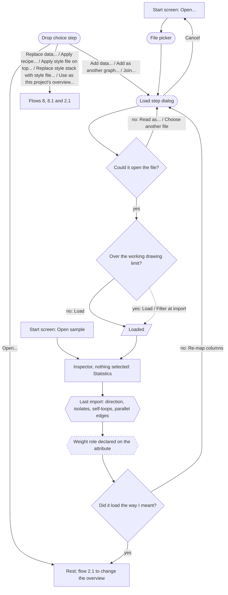

| Step | Place | Command | Pattern | Undo label | Trust check | Built by | Element need |
|---|---|---|---|---|---|---|---|
| open | start screen; File | Open...; Open sample | the command register (`output-homes.md` 3) | no undo entry | -- | Surfaced | -- |
| drop | canvas | a drop, one choice by profile | Paste and drop (4.5) | no undo entry | the profile the element read | Surfaced | **missing**: "Reading a file's profile (project, recipe, style, data) before opening it" |
| map and load | load step dialog | Load; Filter at import; Read as...; Choose another file; Cancel | the load step, a departure (`information-architecture.md` 6, 11); a file that will not open, `message-catalog.md` (`open.failed`) | "Load march.csv" | the preview: rows read as nodes or edges, key column, a sample, the size | Surfaced | loading exists; **missing**: "A load preview before commit"; size **missing**: "A graph's size read from the file"; **missing**: "Filter at import" |
| read the overview | Statistics | -- | -- | no undo entry | the import checks, which no recipe removes | Surfaced | `session.data.statistics()`, `session.data.lastImport()`; the overview recipe **missing**: "Not yet in the element at all" |
| re-map | Last import | Re-map columns | **missing** | "Re-map columns" | the report's counts | Surfaced | **missing**: "Re-map columns"; the data version's undo **missing**: "Undo slices for graph entries" |

**Desk count.** A file: 3 steps, 0 travel (Open...; the file; Load). A sample: 1 step (Open sample),
since samples never pass the load step. Characterizing: 0 steps once loaded. **First failure**, one
per class: the file will not open (a parse error, an unknown format), and the load step stays open
on the error; or it opened wrongly, an edge list read as a node list or a weight column read as
text. **Re-entry:** rest; over the working limit nothing is drawn and flow 6's Find route leads
(`state-matrix.md` 4.2).

**Where the analyst stalls.** Dropping next week's export on the open project, does the drop
choice step lead with Replace data when the columns match? Does "Overview: General" read as a
label with Replace beside it, or as jargon?

**Keyboard.** A drop's route is the same commands from File, or a paste (4.5); the load step is a
dialog (3.6).

### 2.1 Replace the overview recipe

**Task:** 1. **Serves:** 4 Make it the default. **Start:** the Statistics section's Overview row, or
a recipe dropped on the open project. **For every project that names no overview**, the Replace
menu's Use as default overview sets the reader's preference, the trust check reading "projects
without their own overview open under X; this project's own choice unchanged", and Preferences'
Default overview row shows it with Reset to default (the rule, `files-and-recipes.md` 2; the element
property is door 33, Choosing the overview recipe). **Scale:** the same at every scale class. **Figma
route:** Swap library, which matches assets by name only and offers no hand choice
(`research/figma.md` 2.7), 2 steps (Swap library; the library). Departure: the binding step lets
the analyst bind an unmatched slot by hand (`figma-crosswalk.md` 4.2, "Swap library matches by name only").
**Claim:** "These readings answer my field's question, under the overview the row names."
**Record:** the undo entry and the overview named in the project file.

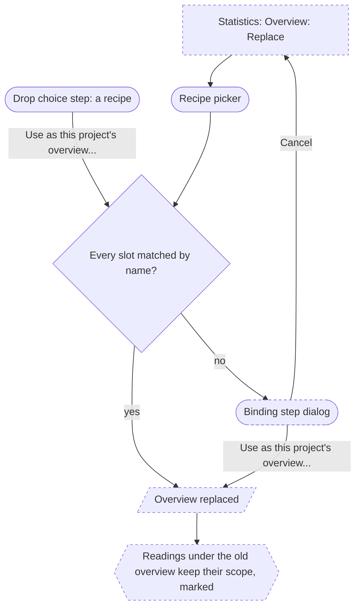

| Step | Place | Command | Pattern | Undo label | Trust check | Built by | Element need |
|---|---|---|---|---|---|---|---|
| choose | Overview row; recipe picker | Replace; a recipe | Bring a recipe or style in (6.10) | no undo entry | the recipe's name and what it carries | Surfaced | **missing**: "Registered recipes, Looks and samples" |
| bind | binding step dialog | one choice per unmatched slot | the binding step, after the missing-fonts dialog (`figma-crosswalk.md`) | no undo entry | matched and unmatched counts | Surfaced | **missing**: "Not yet in the element at all" |
| commit | binding step dialog | Use as this project's overview... | Undo instead of asking (3.4) | "Use Community overview as this project's overview" | old readings kept and marked | Surfaced | **missing**: "A consumer-configured default overview recipe" |

**Desk count:** 2 steps, 0 travel when every slot matches (Replace; the recipe), plus one choice per
unmatched slot. **First failure:** a recipe that names an attribute this graph lacks, left unbound
and listed. **Stall:** does the analyst see why the modularity row read a minute ago is now marked,
without reading "out of date" as "wrong"? **Re-entry:** rest.

**Keyboard.** The picker and the binding step are dialogs (3.6).

### 2.2 Reopen a project and re-enter

**Task:** load (bookend), reopened. **Serves:** 2 Re-enter. **Start:** the start screen's Recent
projects, a week after the last session. **Scale:** the same at every scale class; past the drawing
limit the reopened graph is drawn as its saved filter steps allow (`state-matrix.md` 4.2). **Figma
route:** open a recent file, 1 step; Figma shows what changed in its version history, as here.
**Claim:** "This is last week's analysis, as I left it, and I know what changed since." **Record:**
nothing; reopening changes nothing.

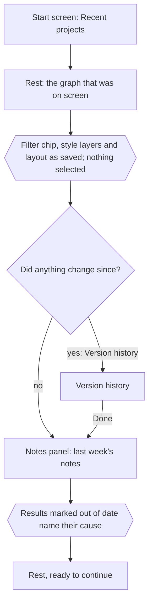

| Step | Place | Command | Pattern | Undo label | Trust check | Built by | Element need |
|---|---|---|---|---|---|---|---|
| reopen | start screen | Recent projects | the command register (`output-homes.md` 3) | no undo entry | the project name and the graph that was on screen | Surfaced | **missing**: "Not yet in the element at all" |
| what changed | Last import; Version history | Version history | Version history mode (`interaction-patterns.md` 3.7) | no undo entry | data versions since the last session | Surfaced | **missing**: "Not yet in the element at all" |
| pick up | Notes panel; Results panel | -- | Freshness (`interaction-pattern-entries.md` 7.2) | no undo entry | last week's notes and each result's state | Surfaced | **missing**: "A notes collection with targets, citations and quoted values marked when the live value differs" |

**Desk count:** 1 step (Recent projects), 0 travel to rest; reading what changed is 1 more.
**First failure:** a result read as current that went out of date when its data was replaced.
**Stall:** does the analyst trust that the screen is last week's without a line saying so?
**Re-entry:** rest.

**Keyboard.** The start screen's list is one Tab stop; Version history's exit is Done (3.6).

## 3. Run a measure and read it

**Task:** 2 (rank by centrality) and 3 (communities), which share one run mechanism
(`top-tasks.md`). This flow answers how algorithm options are managed; layout options are flow
3.1. **Serves:** 1 Try a measure; 2 Follow up. **Start:** rest. **Scale:** the same route at every
scale class; only the cost gate's answer changes. **Figma route:** a Tools-panel row runs a plugin
on click, with one toast and Cancel (`research/figma.md` 4.9, 4.10), 1 step. Departures: runs queue
and rows carry state, and a row that needs an argument or costs minutes opens unrun
(`principles.md`). **Claim:** "These are the top nodes by this measure, on this scope, with these
options, computed exactly or approximated." **Record:** the run's undo entry and its run record,
with every resolved option and the seed used (`options-and-encodings.md` 9.4).

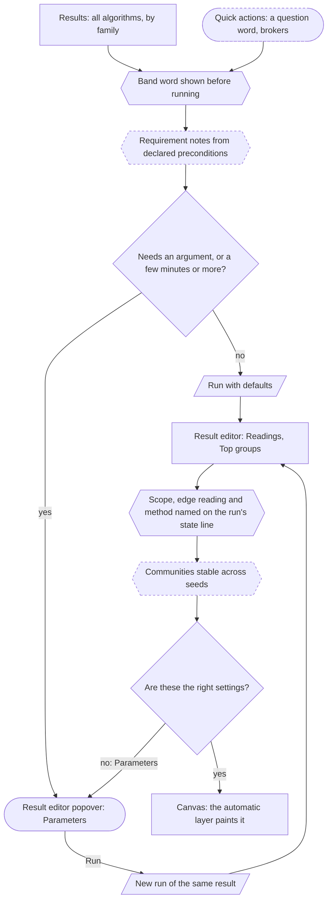

**Options.** Defaults run first; options follow in the result editor popover's Parameters, in the
order of `options-and-encodings.md` 9.1. When an edit applies live and when it waits for Run is
`interaction-patterns.md` 3.3; the diagram draws only that branch. A saved set of option values is
recipe data (`options-and-encodings.md` 9.6).

| Step | Place | Command | Pattern | Undo label | Trust check | Built by | Element need |
|---|---|---|---|---|---|---|---|
| choose | Results catalog; Quick actions | a catalog row | Add with defaults (6.1); Cost (3.3) | "Run PageRank" | band word before running | Surfaced | `session.runs.start`; band from `estimateCommand` (`src/session/planning.ts`); the question-word search **missing**: "Aliases and a per-category display label" |
| preconditions | above Run | -- | requirement notes (`options-and-encodings.md` 9.3) | no undo entry | "14 components: closeness (WF-corrected)", with Harmonic centrality from the variant word | Surfaced | **missing**: "Declared preconditions on catalog entries" |
| read | the result editor's Top nodes; the Nodes tab sorted by its column | -- | A number, a legend entry or a bar selects what it stands for (4.3) | no undo entry | scope and method named | Surfaced | `session.results`; which steps were read **missing**: "A run records which filter steps it read" |
| retune | result editor popover | an option; Run | Cost (3.3) | "Change resolution of Louvain"; "Run Louvain" | a held edit's cost on the Run line (3.3) | Surfaced | `session.runs.start` with params; the seed used **missing**: "Every run records the seed it used" |
| stability | result's Statistics | -- | **missing** | no undo entry | agreement across seeds | Surfaced | **missing**: "A partition-similarity measure" |
| paint | canvas; legend | -- | Edit in the inspector and one popover (6.2), the automatic layer; door 26, Whether a finished run paints | part of the run's entry | the legend names the layer | Element | exists, with a defect: "Automatic paint suppressed only" |

**Desk count.** Rank: 1 step, 2 travel (Results; the family; the row), or 1 step, 1 travel by the
Quick actions. Communities: the same, plus 1 step per retune; characterizing the partition (sizes, the edges between groups, each group's statistics) continues through Profile groups in the result editor's overflow, a flow owed after the first studies. **First failure**, before the Wasserman-Faust convention lands: closeness
on a disconnected graph, where a node in a two-node component scores 1.0 and tops the ranking
(`graph-conventions.md` 2). Search by question word makes a wrong choice easier too, so the
requirement note shows before the run. **Re-entry:**
the result, or rest.

**Where the analyst stalls.** Can the analyst pick the measure that answers their question from
the catalog's families, or only by name? Does the analyst, used to Gephi's settings-first
runs, tell a row that ran from one that opened unrun? After retuning, which run is current?

When stability is reported by default and when on request is `graph-conventions.md` 4.

**Keyboard.** Catalog rows are commands; the popover's fields follow 6.2 and 3.6; Members are
stepped by 4.8.

### 3.1 Make the layout readable

**Task:** 7. Layout options live on the graph's Layout row, never in a result
(`information-architecture.md` 2, rule 6). **Serves:** 2 Follow up. **Start:** rest, or
a set, group or partition selected. **Scale:** past the drawing limit only the filtered graph is laid
out (`element-needs.md`, "Draw nothing past the node drawing limit"). **Figma route:** select,
then Tidy up, 2 steps (`research/figma.md`, Tidy up); departure: a layout runs once over a frozen
scope with a record and a seed (`figma-crosswalk.md` 4.2, "Auto layout reflows live"). **Claim:** "This
picture was laid out by this method, on this scope, from these positions, with these pins."
**Record:** the layout run's undo entry, with method, options, seed, scope and start.

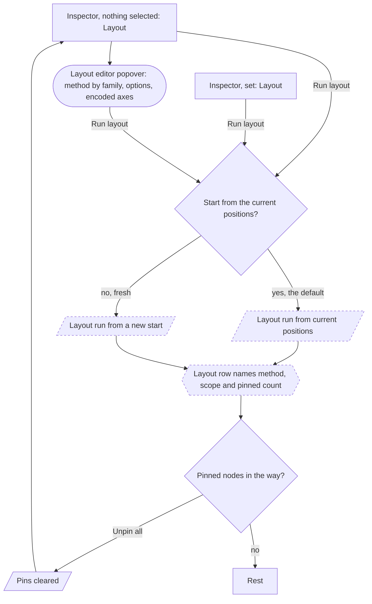

| Step | Place | Command | Pattern | Undo label | Trust check | Built by | Element need |
|---|---|---|---|---|---|---|---|
| run as is | Layout row | Run layout | Long-running work (7.1) | "Run layout" | scope named on the Layout row | Surfaced | `setLayout`; scope **missing**: "Layouts honor the filtered graph"; its undo **missing**: "Not yet in the element at all" (a layout scope as undoable state) |
| method and options | layout editor popover | a method; an option | Edit in the inspector and one popover (6.2); Cost (3.3), layout parameters live | "Change layout to ForceAtlas2" | the method's family and size rating (`options-and-encodings.md` 9.3) | Surfaced | `setLayout(type, opts)` with the catalog's schema (`src/catalog/layouts.ts`); on a running layout **missing**: "apply new options to a running layout" |
| place by attribute | layout editor popover | encoded axes | **missing** | "Change encoded axes to longitude and latitude" | the projection named | Surfaced | **missing**: "Encoded axes with a named projection" |
| a set's layout | set's Layout row | Run layout | Long-running work (7.1) | "Run layout on Watchlist" | the set named as scope | Surfaced | **missing**: "A layout scope carried in the one layout settings per graph"; sets `session.sets` (master) |
| start | layout editor popover | fresh, or not | **missing** | part of the run's entry | the Layout row says which | Surfaced | **missing**: "Run layout from the current positions" |
| pins | Layout row's pinned count | Unpin all | A number, a legend entry or a bar selects what it stands for (4.3) | "Unpin all" | the count | Surfaced | pins by drag (`pinOnDrag`); **missing**: "Set a node's position and pin it" |

**Desk count.** Re-run: 1 step, 0 travel. Another method: 2 steps, 1 travel (the editor; the
method; Run layout). A set: 2 steps (the set; Run layout). **First failure:** laying out after a
filter moves the whole graph, because the element lays out everything unless given a scope; or a
fresh start throws away the picture the analyst had learned. **Re-entry:** rest.

**Where the analyst stalls.** Does the analyst look for layout options on the graph's Layout row,
or in Results beside the algorithms? After changing a force parameter, does the analyst know the
layout restarted from the current positions?

**Keyboard.** The method and option fields follow 6.2 and 3.6; the pinned count follows 4.3.

## 4. Narrow, hide or paint: the router

**Task:** the fork between 6 and 8; it answers the owner's question about two kinds of filter
(`conceptual-model.md` 4.4). **Serves:** 2 Follow up. **Start:** a set, a legend entry or a column
value standing for type X, or a selection. **Scale:** the same at every scale class. **Figma
route:** the layers panel's filter with a type filter, then select and hide with the eye or the hide
chord (`design/ui/figma/flows.md` 7), 2 steps. graphty keeps both of Figma's moves and names them by
consequence: narrowing changes what is computed, hiding changes only the drawing
(`figma-crosswalk.md` 4.2). **Claim:** "These numbers describe type X only", or "type X is out of
the picture, and every number still describes the whole graph." **Record:** the step's or layer's
undo entry and its rule.

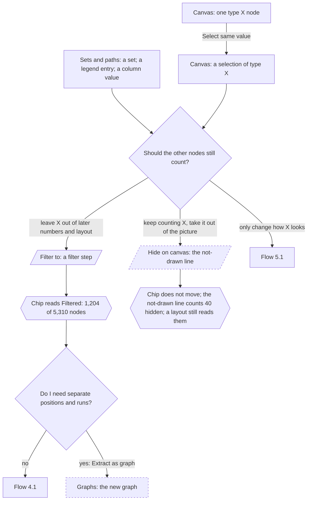

The exits are labeled by consequence, not by tool; the model's nouns sit on the landing places.
**One mechanism narrows**: a filter step, whether it starts from a set, an entry, a value or a
selection. **Hiding is not paint and not a filter**: Hide on canvas sets whether elements are drawn
(`conceptual-model.md` 5.1); it adds no layer and changes no number. A derived
graph is offered only after narrowing, when separate positions and runs are needed.

| Step | Place | Command | Pattern | Undo label | Trust check | Built by | Element need |
|---|---|---|---|---|---|---|---|
| start | Sets and paths; legend; column; canvas | Select same value | Select (4.1); A number, a legend entry or a bar selects what it stands for (4.3); Grow the selection (4.6) | no undo entry | the count of type X | Surfaced | `session.selection.apply` |
| narrow | a set's actions; legend; column header; the selection's actions | Filter to | Narrow, grow and hide (6.9) | "Filter to Type = X" | chip reads "Filtered" | Surfaced | `session.visibility.set`; ordered steps **missing**: "Ordered filter steps (`FilterStep`)"; undo **missing**: "Undo slices for graph entries" |
| hide | the selection's overflow; a set's overflow; a legend entry; the hide chord | Hide on canvas | Narrow, grow and hide (6.9) | "Hide 40 nodes on canvas" | the not-drawn line's hidden count; the chip unchanged; the Layout row names the hidden nodes taking part, and Filter out is the way to leave them out | Surfaced | **missing**: "Whether an element is drawn, as its own per-element state" |
| extract | Graphs: New graph from | Extract as graph | Add with defaults (6.1) | "Extract Type X as graph" | the new graph's Created from | Surfaced | **missing**: "Not yet in the element at all" |

**Desk count:** 2 steps, 0 travel from rest (the set; Filter to), the same as Figma's; hiding the
same, 2 steps. From one node: 3 steps (the node; Select same value; Filter to). **First
failure:** choosing the hide exit when later numbers should have excluded the other nodes, or the
reverse; the chip, moved or not, shows which happened. **Re-entry:** flow 4.1, 5.1 or 6.

**Where the analyst stalls.** An expert editor user presses the hide chord on the type X nodes, and it runs
Hide on canvas, as in Figma (`interaction-pattern-entries.md` 9.3). Does the analyst who wanted later
numbers to exclude them notice that the chip did not change, and reach for Filter out instead?

**Keyboard.** Set rows follow the tree keys (6.8); a legend entry as a start is owed; Quick actions
reaches Filter to and Hide on canvas.

### 4.1 Filter, then characterize

**Task:** 6. **Serves:** 2 Follow up. **Start:** rest. **Scale:** the same at every scale class,
except that a filter can bring a graph under the drawing limit (`scale-levels.md`). **Figma
route:** the layers panel's filter with a type filter, 2 steps (the filter; a type), which changes
only what the panel lists. Departure: a filter step changes what is computed and counted
(`figma-crosswalk.md` 4.1, "The layers panel's filter changes only what is listed"), so the chip's count is this flow's trust check.
**Claim:** "N of M nodes remain, and these statistics describe them." **Record:** each filter step,
with its rule, as an undo entry.

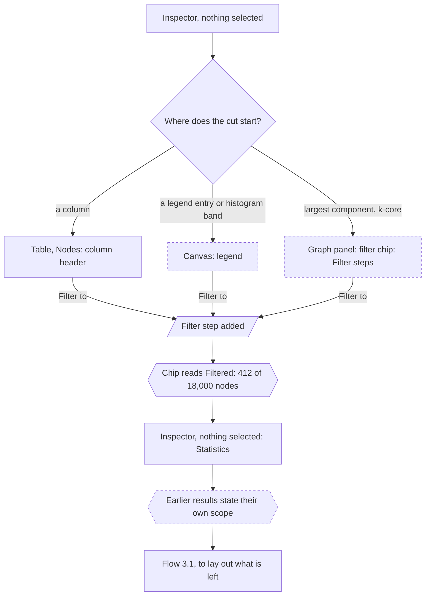

| Step | Place | Command | Pattern | Undo label | Trust check | Built by | Element need |
|---|---|---|---|---|---|---|---|
| cut | column header; legend; Filter steps | Filter to | A number, a legend entry or a bar selects what it stands for (4.3) | "Filter to Type = X" | chip count | Surfaced | `session.visibility.set`; undo **missing**: "Undo slices for graph entries" |
| read | Statistics | -- | -- | no undo entry | each reading names its scope | Surfaced | `session.data.statistics()`; per-run scope **missing**: "A run records which filter steps it read" |

**Desk count:** 1 step, 1 travel from a column (the header menu; Filter to). **First failure:** a
run started before the filter still describes the whole graph; it says so and is not "out of date"
(`conceptual-model.md` 4.5). **Re-entry:** rest, or flow 3.1, which stops at the element's layout
scope gap rather than route around it.

**Keyboard.** A column header's menu opens by Shift+F10 or the Menu key (6.7); a legend entry is
owed.

## 5. Color or size by a value

**Task:** 8. **Serves:** 2 Publish. **Start:** a result selected, or the table. **Scale:** the same;
past the edge drawing limit an edge channel is not drawn and says so (`scale-levels.md` 4).
**Figma route:** Effects "+" adds, then configures (`design/ui/figma/flows.md` 6), and the variable
affordance on a property row binds it, 2 steps. **Claim:** "Color encodes log fold change on a
diverging scale centered on zero; values missing: N, drawn as the layers beneath, counted in the
legend." **Record:** the layer's undo entry and its
encoding. Seeing data and style together is `information-architecture.md` 8.1's answer.

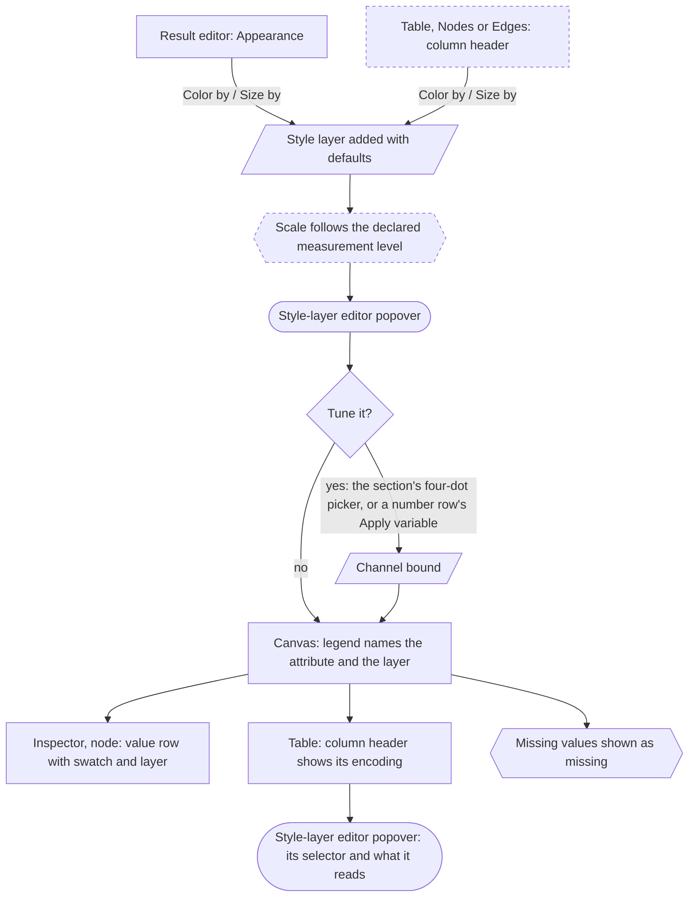

| Step | Place | Command | Pattern | Undo label | Trust check | Built by | Element need |
|---|---|---|---|---|---|---|---|
| add | the result editor's Appearance; column header | Color by; Size by | Add with defaults (6.1) | "Color by log fold change" | the layer on top of the stack | Surfaced | `session.styles.encode` |
| check the scale | style-layer editor popover | -- | encoding kinds (`options-and-encodings.md` 5) | no undo entry | scale kind named | Surfaced | **missing**: "A declared measurement level" |
| tune | a channel row | the section's four-dot picker, or a number row's Apply variable | Bind a property to an attribute (6.6) | "Size by degree" | the bound pill | Surfaced | `session.styles.update` |
| read back | legend; value row; column header | -- | From a painted value to its layer and its datum (4.7) | no undo entry | all three read the resolved paint | Surfaced | `session.styles.legend()`, `session.styles.explain` |

**Desk count:** 1 step, 1 travel from a result (Appearance; Color by) or a column (the header menu;
Color by), plus 1 step per channel tuned. **First failure:** community ids offered a color ramp;
a declared measurement level prevents it (`options-and-encodings.md` 5, "Who picks the scale").
**Re-entry:** the legend, or rest.

**Where the analyst stalls.** The analyst looks for Color by on the Type column's header menu,
where it sits beside Partition by and Filter to. Is it found first time, and from a column, can the
analyst find the way back from the layer to the column it reads?

**Keyboard.** A column header's menu follows 6.7; the four-dot picker is a control in its section header (3.6).

### 5.1 Paint a set, or bind it to a value

**Task:** 8, with a literal value or a binding; the owner's "all nodes of type X, then a style".
**Serves:** 2 Publish. **Start:** a set selected, or flow 4's paint exit; several nodes are a
branch. **Scale:** the same. **Figma route:** select, then the fill chit and a color in the picker
(`design/ui/figma/flows.md` 5, 6): 2 steps (the object; the color), 1 travel; or the variable
affordance on the selection's property row, 3 steps. Departure: the write goes through a style
layer scoped to the set, never into the nodes (`figma-crosswalk.md` 4.2, "A multi-selection lists every property").
**Claim:** "Type X is drawn red, or sized by degree, by a layer anyone can see, reorder or remove."
**Record:** the layer's undo entry; its selector names the set.

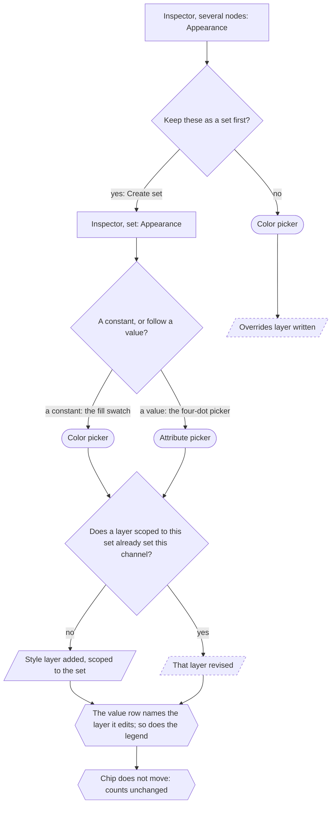

A second color on the set revises the layer the first added, and a picker drag is one undo step
(`interaction-pattern-entries.md` 6.2, 6.6), so the paved path never grows the stack.

| Step | Place | Command | Pattern | Undo label | Trust check | Built by | Element need |
|---|---|---|---|---|---|---|---|
| open | set's Appearance | the fill swatch; the four-dot picker | Edit in the inspector and one popover (6.2); Bind a property to an attribute (6.6) | no undo entry | the value, or "Mixed" | Surfaced | `session.styles.explain` |
| first write | color picker; attribute picker | a color; an attribute | Bind a property to an attribute (6.6) | "Add style layer Type X"; "Size by degree on Type X" | the layer appears on top | Surfaced | `session.styles.add` with a `{ match: "member" }` selector on the set (master) |
| later writes | color picker | a color | Bind a property to an attribute (6.6) | "Change color of Type X" | the value row names the layer being edited | Surfaced | `session.styles.update`; finding the set's layer **missing**: "encoding a data attribute, keyed so a repeated verb edits its earlier layer" |
| hand edit | several nodes' Appearance | a color | Commit, the write rule and Mixed (3.2) | "Override color of 6 nodes" | the Overrides row counts them | Surfaced | **missing**: "The **Overrides** layer" |

**Desk count:** 2 steps, 1 travel (the set; the color), the same as Figma's; binding, 3 steps (the
set; the four-dot picker; the attribute). **First failure:** an expert editor user types a color on several
nodes' Appearance and expects the nodes changed; does the resulting layer show? **Re-entry:** the
legend, or rest.

**Keyboard.** The color picker's hex field and the attribute picker follow 6.2 and 3.6.

## 6. Find, inspect and expand from seeds

**Task:** 4, including the investigation's expansion loop. **Serves:** 1 Sample; 2 Follow up; 3
Find the seed; 3 Expand. **Start:** rest, or a finding from flow 6.1. **Scale:** Find is an entry
at every scale; only the canvas click branches at the working drawing limit
(`state-matrix.md` 4.2).
**Figma route:** Find, then Enter selects and zooms (`design/ui/figma/flows.md` 7, Find), 2 steps
(the name; the hit); Select neighbors has no counterpart (`interaction-pattern-entries.md` 4.6).
**Claim:** "These nodes within k hops of the seed are my investigation's boundary, and every number
describes them." **Record:** the filter step and its labeled additions, each an undo entry named by
its command.

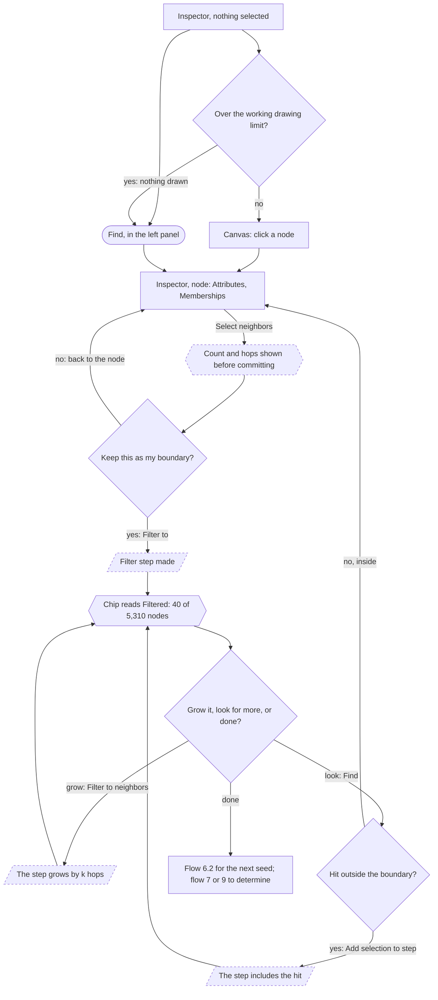

| Step | Place | Command | Pattern | Undo label | Trust check | Built by | Element need |
|---|---|---|---|---|---|---|---|
| find | Find; canvas | -- | Select (4.1) | no undo entry | a hit excluded by a step is marked with it | Surfaced | `session.selection.apply`; **missing**: "Paged id listings over a scope" |
| read | inspector, node; the table, the same rows selected | -- | -- | no undo entry | the same count in the table, the inspector and the chip; the node's rank | Surfaced | `session.data.node`; **missing**: "Scoped reads for the inspector"; rank **missing**: "Rank over the run's scope" |
| grow the selection | node actions | Select neighbors | Grow the selection (4.6) | no undo entry (Previous selection returns) | count before commit | Surfaced | `session.selection.apply` with a neighborhood target; count **missing**: "An exact neighborhood count" |
| bound | several nodes' actions | Filter to | Narrow, grow and hide (6.9) | "Filter to 40 nodes" | chip reads "Filtered" | Surfaced | **missing**: "Per-step filter membership"; undo **missing**: "Undo slices for graph entries" |
| grow the boundary | several nodes' actions | Filter to neighbors | Narrow, grow and hide (6.9) | "Filter to neighbors, 2 hops" | count before commit; chip | Surfaced | **missing**: "Ordered filter steps (`FilterStep`)" |
| include | Find results | Add selection to step | Narrow, grow and hide (6.9) | "Add 3 nodes to step" | the hit marked outside | Surfaced | **missing**: "Add selection to step from outside the step" |

**Desk count.** Find and read: 2 steps, 1 travel (Find; the name; the hit); on the canvas, 1 step.
Each expansion round: 1 step, 1 travel (the node actions; Filter to neighbors, one hop by default),
plus 1 choice for more hops. **A whole case**, "Fraud Ring Investigation" on a 1,000,000-node
transaction graph with three expansion rounds: 9 steps, 6 travel (the seed, 2; the boundary, 1;
three rounds, 3; a note, 1; the evidence file, 2). When each round also finds a node outside the
boundary and includes it, 15 steps, 9 travel. **First failure:** a 2-hop expansion through a hub
takes most of the graph; the exact count shows before committing, also past the selection cap
(`state-matrix.md` 4.4). **Re-entry:** the boundary, or rest.

**Where the analyst stalls.** Does the analyst see how large a hop is before taking it? Does the
analyst reach for Select neighbors to grow the boundary, when it changes only the selection? Is a
hit outside the boundary known to be outside it?

"Who is connected to both A and B" takes about six steps without Select common neighbors (neighbors saved as sets, then
Intersect), and the "circular flows" check of "Fraud Ring Investigation" has no route.

**Keyboard.** Picking a node is Find, or Enter in the canvas walk (9.2); the hop count is a field in
the command's options (6.2).

### 6.1 Triage a ranked list

**Task:** 4, over the findings of task 2 or of a rule set. **Serves:** 3 Triage the matches.
**Start:** a metric result's Top nodes, a sorted table column, or Find's hits. **Scale:** the same; a
finding outside what is drawn is still selected and counted (`interaction-pattern-entries.md` 4.8).
**Figma route:** Find's next and previous match, 1 step per match (`interaction-pattern-entries.md` 4.8).
**Claim:** "I looked at the top 40 by anomaly score, and these 3 need a closer look." **Record:**
the notes and sets made on the way; stepping is not a step.

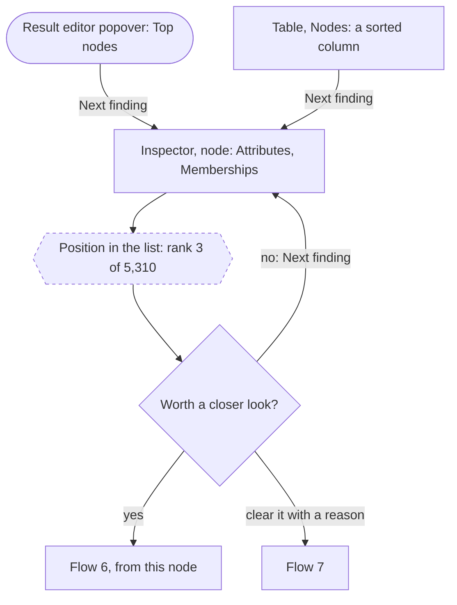

| Step | Place | Command | Pattern | Undo label | Trust check | Built by | Element need |
|---|---|---|---|---|---|---|---|
| step | Members; table; canvas | Next finding; Previous finding | Step through findings (4.8) | no undo entry | the position in the list | Surfaced | **missing**: "Next finding and Previous finding"; rank **missing**: "Rank over the run's scope" |

**Desk count:** 1 step per finding, 0 travel once the list has focus; 40 findings, 40 steps.
**First failure:** stepping a list sorted by a column computed on another scope; the rank names its
scope. **Re-entry:** the list, at the finding last selected.

**Keyboard.** The arrows in the list and the Next finding chord on the canvas (4.8).

### 6.2 The next seed

**Task:** 4. **Serves:** 3 The next alert. **Start:** a boundary (a Filter to step) from flow 6.
**Scale:** the same. **Figma route:** none; Figma keeps no working boundary to replace. **Claim:** "The previous
investigation is kept as a set with a note, and its evidence exported; this one starts from the new
seed." **Record:** the kept set, the note, and the two undo entries (Delete, Filter to).
Views are not used: they are the report's pages, and fifty a day would bury the report.

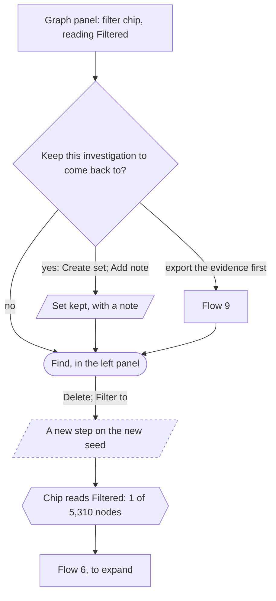

| Step | Place | Command | Pattern | Undo label | Trust check | Built by | Element need |
|---|---|---|---|---|---|---|---|
| keep | the filter step's menu; Sets and paths | Create set; Add note | Add with defaults (6.1) | "Create set Alert 4471" | the set listed in Sets and paths | Surfaced | `session.sets.createFrom` (master); notes **missing**: "A notes collection" |
| replace | the filter step's menu; Find results | Delete; Filter to | Delete (6.4); Narrow, grow and hide (6.9) | "Delete step Alert 4471"; "Filter to ACC-9921" | the chip's count | Surfaced | **missing**: "Per-step filter membership"; undo **missing**: "Undo slices for graph entries" |

**Desk count:** 4 steps, 1 travel (Delete; Find; the name; Filter to), plus 2 steps to keep
the previous one: about 300 steps at 50 alerts a day. **Budget: at most 3 steps** to keep the
previous boundary and start the next, measured first in the prototype tests; over it, one undoable
macro is the fallback, not a new persona verb. The journey is reachable only from the slice that
separates what the element holds from what it draws (`element-needs.md`, "Separate the most the
element can hold from the most it draws"), which `implementation-mapping.md` 9 lists under slice 1.
**First failure:** replacing an unkept boundary. **Re-entry:** flow 6.

**Keyboard.** Find and the commands; no other step.

## 7. Take a note

**Task:** 5. **Serves:** 1 Decide; 2 Write it down; 3 Determine; 3 Keep suspects. **Start:** an
object selected, or rest. **Scale:** the same. **Figma route:** the Comment tool, a click on the
canvas, then typing and Enter (`design/ui/figma/flows.md` 11), 2 steps plus typing. A Figma comment
is created only when Enter posts it, and graphty follows that. Departure: a note anchors to graph
objects and can be written on the selection (`figma-crosswalk.md` 4.3, "Comments anchor to a canvas
position"). **Claim:** "This finding is about these objects and rests on these results."
**Record:** the note's undo entry, its targets and its cited runs.

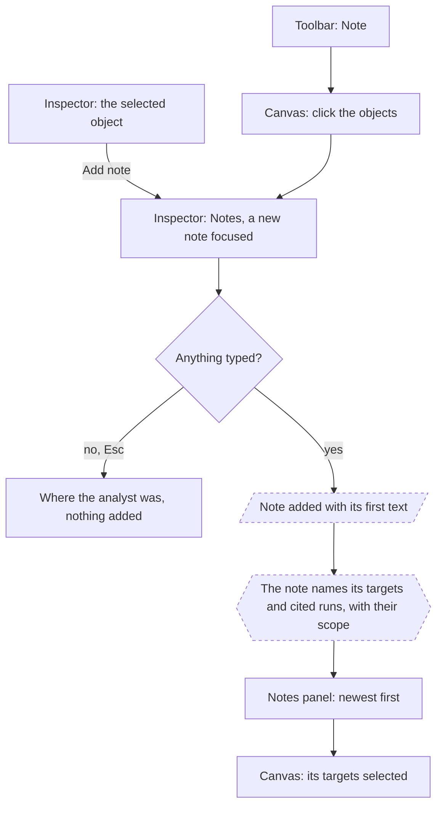

| Step | Place | Command | Pattern | Undo label | Trust check | Built by | Element need |
|---|---|---|---|---|---|---|---|
| start | an object's overflow; Selection; toolbar | Add note; the Note tool | Add with defaults (6.1), a note's exception; Modes and tools (5) | no undo entry until text is committed | the targets named | Surfaced | **missing**: "A notes collection with targets" |
| write | the note | typing | Edit in the inspector and one popover (6.2) | "Add note" | cited runs and their scope | Surfaced | **missing** (same row); undo **missing**: "Undo slices for graph entries" |
| read later | Notes panel; a target's Notes | -- | Select (4.1) | no undo entry | a cited run's freshness | Surfaced | **missing** (same row) |

**Desk count:** 1 step, 1 travel plus typing (the overflow; Add note); by the tool, 2 steps plus
typing. **First failure:** a note written with nothing selected attaches to the graph, not to the
set the analyst meant. **Stall:** an expert editor user expects a note at a canvas position; after a
relayout, is it found on its objects? **Re-entry:** where the analyst was.

**Keyboard.** The Note tool's click has a keyboard route through Add note on a selection made by
Find or the canvas walk (9.2).

## 8. Reuse an analysis: Replace data and Apply recipe

**Task:** 12, and the bookend "start from a recipe". **Serves:** 1 Decide; 2 Swap the data; 4 Apply
it. **Start:** File, Recipes, the start screen or a drop. **Scale:** the same. The two directions
reach one state (`files-and-recipes.md` 1). **Figma route:** for Apply recipe, Swap
library, 2 steps, whose match by name is the model for the binding step's match by name
(`research/figma.md` 2.7); the missing-fonts dialog is the precedent for one choice per unresolved
slot (`figma-crosswalk.md`). Departure: an unmatched slot can be bound by hand (`figma-crosswalk.md`
4.2, "Swap library matches by name only"). For Replace data Figma has no counterpart: it never swaps
content under kept styling. **Claim:** "Last week's analysis on this week's data: these replayed,
these did not", or "412 of 430 genes matched; these 18 did not." **Record:** one undo entry, the
recipe's identity, the binding choices, the data version.

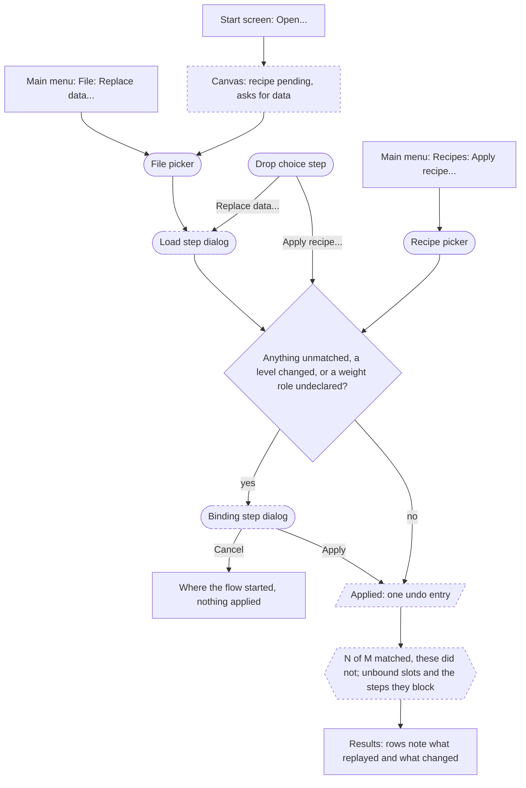

**Replace data binds only when it must.** It matches columns by name; the binding step opens only
when a slot fails to match, a measurement level changed, or a weight column has no declared role.
The choice budget is one choice per such slot and none otherwise. These are choices, not
confirmations (`interaction-patterns.md` 3.4).

| Step | Place | Command | Pattern | Undo label | Trust check | Built by | Element need |
|---|---|---|---|---|---|---|---|
| choose | File; Recipes; a drop; start screen | Replace data...; Apply recipe...; Open... | the command register (`output-homes.md` 3); Paste and drop (4.5) | no undo entry | -- | App | -- |
| pending | canvas, a recipe with no data (`state-matrix.md` 3, Canvas, Blank) | -- | -- | no undo entry | the pending layers and runs listed | Surfaced | **missing**: "Not yet in the element at all" (recipe apply) |
| load | load step dialog | Load | the load step, a departure (`information-architecture.md` 6, 11) | part of the apply entry | the preview; size before loading | Surfaced | loading exists; **missing**: "A load preview before commit"; data versions **missing**: "Not yet in the element at all" |
| pick | recipe picker | a recipe | Bring a recipe or style in (6.10) | no undo entry | what the recipe holds | Surfaced | **missing**: "Registered recipes, Looks and samples" |
| bind | binding step dialog | one choice per slot | the binding step, after the missing-fonts dialog (`figma-crosswalk.md`) | no undo entry | matched and unmatched counts | Surfaced | **missing**: "Not yet in the element at all" |
| commit | load step; binding step | Load; Apply | Undo instead of asking (3.4) | "Replace data with april.csv"; "Apply recipe Expression overlay" | unbound slots listed | Surfaced | **missing** (same row); undo **missing**: "Undo slices for graph entries" |
| read the replay | Results panel | -- | Freshness (7.2) | no undo entry | runs forked to the new version; under Replace data, hand-made sets and notes carried over by id | Surfaced | **missing** (same row) |

**Desk count.**
- Replace data, every column matched: 3 steps, 2 travel (Replace data...; the file; Load); by a
  drop, 3 steps (the drop; Replace data; Load). This meets task 12's bar in `top-tasks.md`.
- Apply recipe to open data: 2 steps, 2 travel (Apply recipe...; the recipe), plus Apply and one
  choice per slot when the binding step opens.
- Recipe first from the start screen: 4 steps (Open...; the recipe; the data file; Load), plus the
  binding step once.

**First failure:** an attribute left unbound, listed with the step it switches off, never skipped
silently. **Re-entry:** the Results panel, then flow 8.2.

**Where the analyst stalls.** "Slot", "measurement level" and "weight role" are not the analyst's
words. Can the analyst say how many genes matched, and which did not, without opening anything?

**Keyboard.** A drop's route is the same commands from File or Recipes (4.5); the pickers and steps
are dialogs (3.6).

### 8.1 Apply a style file

**Task:** the bookend "start from a recipe", with a style file, which is a recipe holding only style
layers (`top-tasks.md`). **Serves:** 4 Apply it. **Start:** a style file dropped on the project, or
Recipes. **Scale:** the same. **Figma route:** enabling a library in the libraries dialog, 1 step, 1
travel, which makes its styles available beside the file's own and replaces none
(`research/figma.md` 2.1, Library). Departure: Replace style stack swaps the analyst's layers for
the file's (`figma-crosswalk.md` 4.2, "Enabling a library only adds"). **Claim:** "Our
lab's colors are on this graph; these layers are new, and these are unbound." **Record:** one undo
entry and the style file's identity on each added layer.

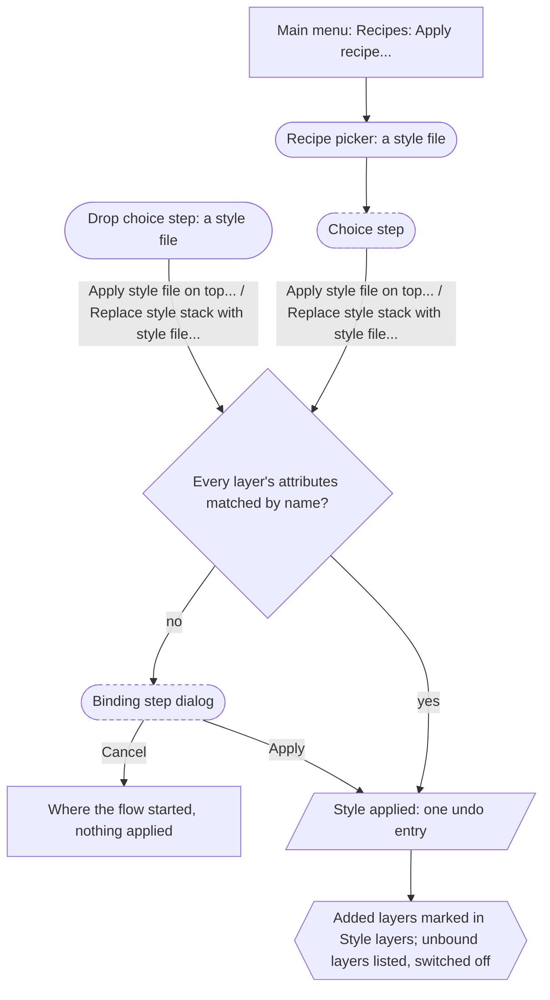

| Step | Place | Command | Pattern | Undo label | Trust check | Built by | Element need |
|---|---|---|---|---|---|---|---|
| choose | drop choice step; choice step | Apply style file on top...; Replace style stack with style file... | Paste and drop (4.5); Undo instead of asking (3.4) | no undo entry | the file's profile | Surfaced | **missing**: "Reading a file's profile (project, recipe, style, data) before opening it" |
| bind | binding step dialog | one choice per unbound layer | the binding step (`options-and-encodings.md` 10) | no undo entry | unbound layers listed | Surfaced | `TemplateReport.unbound` from `session.styles.applyTemplate`; then `session.styles.update` |
| commit | choice step; binding step | Apply style file on top...; Replace style stack with style file...; Apply | Undo instead of asking (3.4) | "Apply style file Lab colors on top"; "Replace style stack with Lab colors" | added layers marked | Surfaced | on top: `session.styles.applyTemplate`; **missing**: "Replace style stack" |

**Desk count:** by a drop, 2 steps (the drop; Apply style file on top...), plus one choice per unbound layer; from
Recipes, 3 steps, 1 travel. **First failure:** Replace style stack with style file... chosen when Apply style file on top... was
meant; one undo reverses it, and the added layers are marked. **Re-entry:** the Styles list.

**Keyboard.** The same commands from Recipes; the choice step and binding step are dialogs (3.6).

### 8.2 Compare with the previous data version

**Task:** 10, drawn ahead of its tier because it carries journey 2's defining question.
**Serves:** 2 Read what changed. **Start:** a result after Replace data, whose runs forked to the
new version. **Scale:** both sides share one drawing budget (`state-matrix.md` 4.6).
**Figma route:** branch review, the comparison surface's counterpart (`figma-crosswalk.md`,
Branch), 1 step, 1 travel. **Claim:** "Community 4 grew by 30 nodes, and that change is larger
than a re-run on the same data produces (AMI 0.71 against 0.93)." **Record:** the saved
comparison, with its statistic, its sides and its unmatched counts.

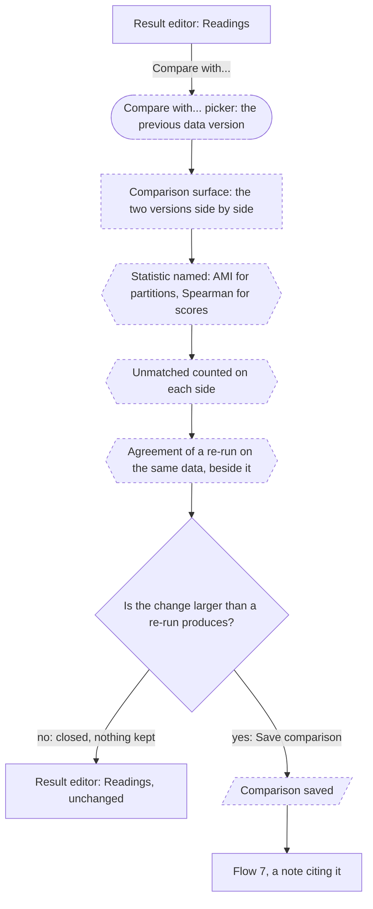

| Step | Place | Command | Pattern | Undo label | Trust check | Built by | Element need |
|---|---|---|---|---|---|---|---|
| compare | result's actions; a data version's row | Compare with...; the previous version | Compare two states side by side (4.9) | no undo entry | the two sides named | Surfaced | **missing**: "Compare with... over sets or groups, runs of one result"; data versions **missing**: "Not yet in the element at all" |
| read | comparison surface | -- | Compare two states side by side (4.9) | no undo entry | the statistic (`graph-conventions.md` 3); unmatched counts; the re-run's agreement | Surfaced | **missing**: "A partition-similarity measure"; **missing**: "Readings and the drawing budget per side of a comparison"; **missing**: "One scale domain held over a playback range and across both sides of a comparison" |
| keep | comparison surface | Save comparison | Add with defaults (6.1) | "Save comparison" | the run under the comparison result's row | Surfaced | **missing** (the Compare row) |

**Desk count:** 2 steps, 1 travel (the actions; Compare with...; the version), plus Save comparison
when kept; inside task 10's budget of 0 to 2 steps from the result. **First failure:** a stochastic
partition's change read as real when a re-run on the same data differs as much (`graph-conventions.md`
4). **Stall:** does the analyst look for this on the result, or in Version history?
**Re-entry:** the result.

**Keyboard.** Compare with... and Save comparison are commands; moving between the surface's two
sides is `interaction-pattern-entries.md` 4.9.

## 9. Export and report

**Task:** export (bookend), and the tail task of saving a starting point. **Serves:** 2 Publish; 3
Determine; 3 Hand over; 4 Save the starting point. **Start:** rest, or an object selected.
**Scale:** the same route; figure export past a limit is `state-matrix.md` 4.7. **Figma
route:** the Export dialog with every row checked, or an object's Export section (`figma-crosswalk.md` 4.1,
"Share is the filled header button"), 2 steps; a library is made by publish library
(`research/figma.md` 4.1), whose counterpart is Recipes: Export recipe... (`figma-crosswalk.md`).
**Claim:** "This figure, table or file shows this value on this scope, with its legend and method."
**Record:** an export freezes what it wrote (`information-architecture.md` 6); the methods text is
written from the records.

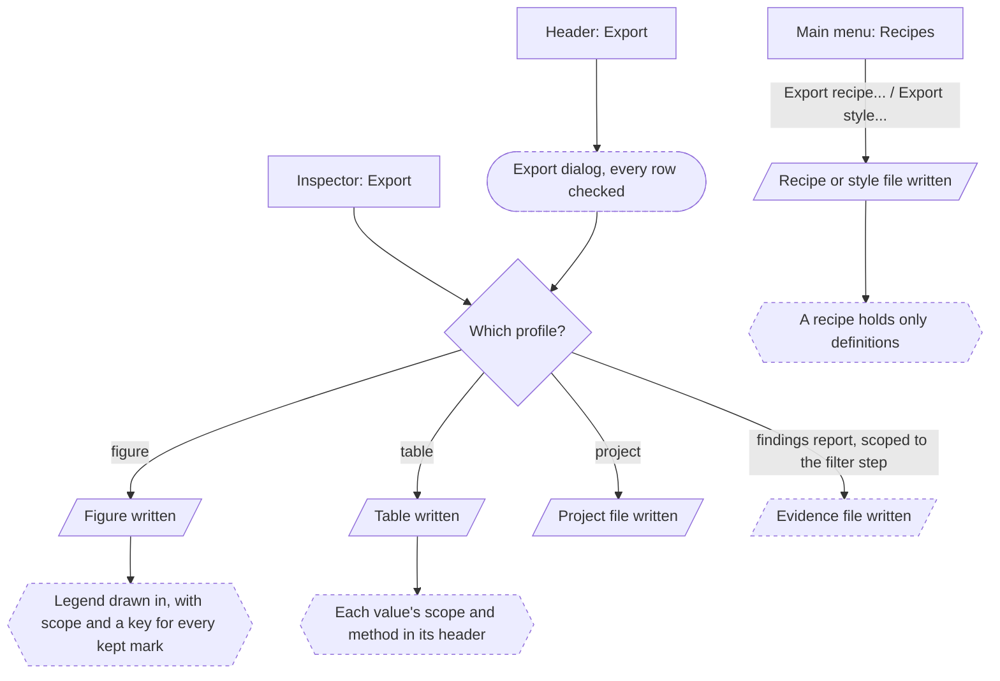

| Step | Place | Command | Pattern | Undo label | Trust check | Built by | Element need |
|---|---|---|---|---|---|---|---|
| open | header; File; an object's Export | Export...; Export | the command register (`output-homes.md` 3) | no undo entry | every row checked | Surfaced | -- |
| figure | Export dialog; Export section | Export; Copy as PNG | Export and file writes (6.11) | no undo entry | legend and scope drawn in | Surfaced | **missing**: "Exported figures" |
| table | a table tab; a Statistics section | Export table | Export and file writes (6.11) | no undo entry | scope in headers; method beside freshness | Surfaced | **missing**: "Each exported result's method" |
| project | Export dialog; chevron menu | Download project file | Export and file writes (6.11) | no undo entry | -- | Surfaced | **missing**: "Saved project parts beyond the style stack" |
| starting point | Recipes; Style layers menu | Export recipe...; Export style... | Export and file writes (6.11) | no undo entry | a recipe holds only definitions | Surfaced | style: `session.styles.toDocument()`; recipe **missing**: "Saved project parts beyond the style stack" |
| findings report, or the evidence file | Export dialog | Export... | Export and file writes (6.11) | no undo entry | the saved views in page order, the notes, the methods text; scoped to the step, its members (`files-and-recipes.md` 3) | Surfaced | **missing**: "Not yet in the element at all" |

**Desk count:** an object's figure, 1 step, 1 travel; the whole project, 2 steps (Export...;
Export); a recipe, 1 step, 1 travel (Recipes; Export recipe...), plus its name. **First failure:**
a figure written without its legend or scope, so a reader cannot tell what the color means or
what was filtered. **Stall:** does "Export" in the header mean the current view or the whole
project? **Re-entry:** rest.

**Keyboard.** Commands, and the dialog (3.6).

## 10. Sets and paths

### 10.1 Create and combine sets

**Task:** 9. **Serves:** 3 Keep suspects. **Start:** a selection, a group in a result's item tab, a
filter step or a histogram band. **Scale:** the same at every scale class; a selection over the cap
keeps every id (`interaction-pattern-entries.md` 4.1). **Figma route:** select layers, then the group chord,
1 step; a Boolean operation from the right sidebar on two selected groups, 2 steps. **Claim:**
"These ten are kept as Hubs, and four of them are also on the Watchlist." **Record:** Create set's
and the combination's undo entries; each set's Created from.

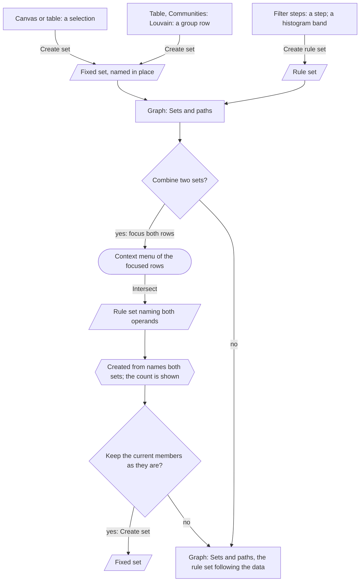

| Step | Place | Command | Pattern | Undo label | Trust check | Built by | Element need |
|---|---|---|---|---|---|---|---|
| keep | the selection's type row; an item row's menu | Create set | Add with defaults (6.1) | "Create set Hubs" | the count on the new row | Surfaced | `session.sets.createFrom` (master) |
| keep a rule | a filter step's menu; a band's menu | Create rule set | Add with defaults (6.1) | "Create rule set Degree > 10" | the rule on the Rule row | Surfaced | `session.sets.create` with a rule definition (master) |
| focus | Sets and paths | Shift+click or Mod+click on rows | Focus rows (3.1) | no undo entry | both rows focused, the inspector unchanged | App | -- |
| combine | the focused rows' context menu | Intersect | Many rows (6.8) | "Intersect Watchlist and Hubs" | Created from names the operands | Surfaced | `session.sets.combine` (master) writes a fixed set; the following form **missing**: "A live set operation" |
| freeze | the rule set's type row | Create set | Add with defaults (6.1) | "Create set Watchlist and Hubs" | the kind glyph turns fixed | Surfaced | `session.sets.createFrom` (master) |

**Desk count:** keeping a selection, 2 steps (the selection; Create set), as Figma's; combining, 3
steps (focus two rows; the menu; Intersect), one more than Figma's, because the operation acts on
focused rows and never on the canvas selection (`interaction-patterns.md` 3.1). **First failure:**
reading a rule set's members as fixed and expecting them to stay; its kind glyph and the Rule row
say it follows the data. **Re-entry:** Sets and paths.

**Keyboard.** The tree keys focus rows (Shift with the arrows); Shift+F10 opens the focused rows'
menu (6.7).

### 10.2 Find the shortest path

**Task:** 11. **Serves:** 3 Connect. **Start:** one node selected, or rest. **Scale:** the same;
past the drawing limit the found path is drawn once the boundary holds it, and is listed in its
result either way. **Figma route:** none: a path is graph content with no Figma counterpart.
**Claim:** "A reaches B in 4 hops, distance 7.5 hours, reading the transfer delay in hours as a
distance, inside the filtered graph." **Record:** the query run with its scope and weight reading; the kept path.

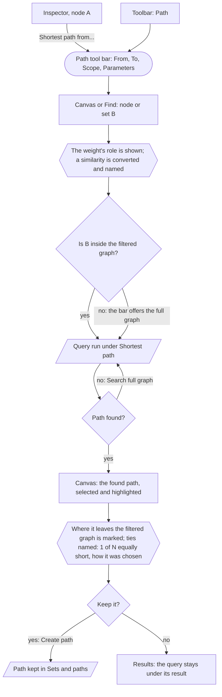

| Step | Place | Command | Pattern | Undo label | Trust check | Built by | Element need |
|---|---|---|---|---|---|---|---|
| arm | node type row; toolbar | Shortest path from...; the Path tool | Modes and tools (5) | no undo entry | From is named | Surfaced | the app's bar over `session.runs` |
| choose B | canvas; Find | a click or a hit | Select (4.1) | no undo entry | B named in the bar | Surfaced | `session.selection` |
| read the scope | the bar | the scope field | Narrow, grow and hide (6.9) | no undo entry | Filtered graph or Full graph stated | Surfaced | **missing**: "Ordered filter steps (`FilterStep`)" |
| run | the bar | Run | Long-running work (7.1) | "Shortest path Alice to Bob" | the weight role and its conversion on the result | Surfaced | the `shortest-path` run with its scope (master); Bellman-Ford never picked **missing**: "Defect: `shortest-path` never picks Bellman-Ford" |
| keep | the found path's type row | Create path | Add with defaults (6.1) | "Create path Alice to Bob" | the derived kind on the type row | Surfaced | `session.sets.createPath` (master) |

While a found path cannot be selected as a whole, keep runs from its row's menu in the result's item
tab (`implementation-mapping.md` 7, "Selection of one primary object as a whole").

**Desk count:** 3 steps from a selected node (Shortest path from...; B; Run), 4 from rest. **First
failure:** a similarity read as a distance, which makes the strongest ties the longest; the result's
Weight row names the role and conversion. A second: a search that silently stayed inside the
boundary; the bar states the scope before the run. **Re-entry:** the found path, or rest.

**Keyboard.** Find picks B; the bar's fields follow 6.2 and 3.6; Run is Enter in the bar.

### 10.3 Routes not yet drawn

**The rule:** a route is drawn in order of how often it is taken times how many personas share it.
Two kinds are drawn first whatever their tier: a stage that carries its journey's defining
question, and a route where a wrong conclusion is likely. A label the tree test may move is drawn
dashed rather than waited for, because a relabel is an edit.

| Route | Task | Desk budget | Branches that change the route |
|---|---|---|---|
| Compare with..., the other six cases | 10 | 0 to 2 steps | a router over sets or groups, runs, results, a randomized baseline, two attributes and partitions; the statistic named (`graph-conventions.md` 3); stability (`graph-conventions.md` 4) |
| Time | tail | 2 steps | only with a time attribute |
| Test against a randomized baseline (journey 3, Test) | 10 | 2 steps | the statistic named with its null model; a set chosen by that statistic cannot be tested on it (`graph-conventions.md` 3); drawn first, because a wrong conclusion is likely |
| Merge nodes (duplicates) | tail | 2 steps | which node's attributes win; edges that become multi-edges |

## 11. Gaps the flows found

Each is recorded in its home; this section only points.

- **graphty-element** (`element-needs.md`): the rows the step tables quote.
- **Patterns owed** (`interaction-patterns.md` 1.4): Re-map columns; placing nodes by attribute; a
  layout's fresh start; readings under a replaced overview.
- **Already covered elsewhere:** the command labels are one list, the register
  (`output-homes.md` 3); the narrowing, growing and hiding pattern is `interaction-pattern-entries.md` 6.9;
  the Edges tab's header menu is the Nodes tab's with Width by for Size by; a node's rank reads on
  its metric's Attributes row; Select neighbors grows one hop per press, with a hops field in its
  split button.

**Labels the check finds.** Every label a flow draws that is not in the outline, with the list that
does hold it. The label check fails when this table and the drawings differ in either direction
(section 12).

| Label | Held by | Recommendation |
|---|---|---|
| Next finding | register only | a keyboard command; it has no place of its own, so the outline does not list it |
| Apply | neither | the binding step's commit button, which completes Apply recipe...; a dialog's button, not a command of its own |
| Delete | register only | on an object's row (the Delete key on a focused row, and its context menu), never on a type row, as in Figma's layers panel; the outline lists type-row commands |
| Find | register only | a device over the left panel, bracketed in the outline because the tree test scores places and objects only |
| Shortest path from... | register only | a verb of a node's type row; verbs are `interface-specification.md` 4.2's, not the outline's |
| Search full graph | register only | the one verb of a search result that found nothing inside the filtered graph; placed on that result, not in the outline |

**Places and devices the check finds.** Every place or device a node starts with that neither the
outline nor the place inventory (`information-architecture.md` 4) names. Devices are listed in the
outline only where they open and are scored only as routes, so most devices land here by design;
a place here is a gap for the information architecture.

| Place or device | Kind | Recommendation |
|---|---|---|
| File picker | device | the operating system's file dialog |
| Load step dialog | device | the load step (`information-architecture.md` 4) |
| Drop choice step | device | the load step's choice when a file is dropped |
| Choice step | device | the same choice, reached from a menu |
| Binding step dialog | device | the binding step (`information-architecture.md` 4) |
| Result editor popover | device | the result editor, opened from a result's row |
| Layout editor popover | device | an editor popover (`interaction-pattern-entries.md` 6.2) |
| Style-layer editor popover | device | an editor popover (`interaction-pattern-entries.md` 6.2) |
| Color picker | device | a device inside an editor popover |
| Attribute picker | device | a device inside an editor popover |
| Compare with... picker | device | the picker the Compare with... command opens |
| Context menu of the focused rows | device | the Sets and paths context menu in the outline |
| Path tool bar | device | the outline's "the Path tool's bar" |

**Found by hand**, which the check cannot see:

- **The model or the specification:** attribute completeness as a reading on the graph's Statistics
  ("First Exploration"); "list everything the file contains before saving" ("Reproducible
  Session").

## 12. Validation

1. **The link and label check**, `research/scripts/check-flows.mjs`, which the framework lint runs
   with `--self-test` first (README.md, "Validation of the set"). It enforces the stage-to-flow
   rule of this document's header; that every workflow has a row
   in `user-journeys.md`, "Workflows and where they run"; that every quoted `element-needs.md` row
   exists; that every label drawn on an edge (a diamond's included) or after a place's colon is a
   whole outline item or sits in section 11's label table with the list that holds it; that every place or
   device a node starts with is in the outline or the place inventory, or in section 11's place
   and device table; that neither table holds anything the drawings do not; that every flow
   has its Keyboard line and its Figma route; and that every "Departure:" in a header names a row
   of `figma-crosswalk.md` 4 by its Figma cell. It does not read the step tables' Command column,
   and it does not judge whether a Figma route is the right analogue or its count is right; a label
   in the outline but in the wrong place is beyond it too; those are section 11's hand-kept rows and
   review.
2. **Cognitive walkthrough** of each flow against its workflows: will the analyst try the right
   thing, see the control, connect it to the result and see progress (Wharton, Rieman, Lewis and
   Polson, 1994)? "Will the analyst know this is the right action?" outranks the step count.
3. **Task-based tests on a prototype**, measuring success rate and time on task against
   `top-tasks.md`, most-repeated routes first (6.1, 6.2 and 3). For analysis tasks, also **insight
   accuracy**: a known answer is planted in the test data (a planted community, a seeded fraud
   ring, a known path) and the analyst's conclusion is scored against it, because finishing a task
   does not show the conclusion was right. Desk counts are the paper check before these tests; a
   difference of one step decides nothing.
4. **First-click tests** only for labeling and findability questions:

| Question | Study | Rule |
|---|---|---|
| Color by on the column header? | first click on "make the Type values different colors", from the table, grayscale wireframe | keep the header entry if more than 60% click it |
| Fork labels by consequence or by tool? | split first-click test on "just the type X nodes, then lay them out", scoring the panel filter, the hide chord and the eye as first moves, 93 per arm (`research/study-schedule.md`, "Flows and journeys studies") | consequence labels if they score higher and the difference is significant at 0.05; run qualitatively, it decides nothing |
| The catalog by family or by question? | the one Catalog study (`information-architecture.md` 12): first click on "who brokers between groups?" from the Results panel, with the families as headings against questions as headings, participants apart from any card sort | a win for question headings by 20 points or more is filed as an element need (catalog aliases or display labels), never an app regrouping |
| Layout options on the Layout row? | first click on "spread these nodes out more", from rest | keep the row if more than 60% click it |

5. **Graph-task coverage**, a completeness check against the taxonomy of Lee, Plaisant, Parr, Fekete
   and Henry (2006) and Saket, Simonetto and Kobourov (2014), via `research/graph-analysis.md`. It
   finds missing flows; it validates none.

| Task type | Flow | Status |
|---|---|---|
| Adjacency; accessibility within n hops | 6 | drawn |
| Common connection | 6 | gap: element need |
| Connectivity: paths, components, bridges | 4.1; 10.2 | shortest path drawn (10.2); the largest component as a filter step (4.1); bridges not drawn (the tail) |
| Attribute-based, including edge attributes | 4.1; 5 | drawn |
| Browsing, revisiting | 6.1; 6.2; Previous selection | drawn |
| Overview | 2 | drawn |
| Change over time, comparing graphs | 8.2; Compare; Time | one case drawn |
| Duplicates | Merge nodes | not drawn (10.3) |
| Group level, overlapping groups | 3; a set's Memberships | overlap needs a branch |

**The limit of this validation.** The flows are built on the outline, so walking them well does not
validate the outline. The tree test runs first, or at the latest alongside the first walkthroughs,
and walkthrough reviewers are kept out of its participant pool (`research/study-schedule.md`,
"Participant pools").

## Sources

- `design/designloom/workflows/`: "First Exploration - Quick Data Assessment", "Data Import and
  Validation", "Fraud Ring Investigation", "Anomaly Detection", "Hub Investigation", "Gene List to
  Interaction Network with Expression Overlay", "Reproducible Session and Network Publication", as
  quoted.
- `top-tasks.md`; `user-journeys.md`; `information-architecture.md` 2, 4, 6, 7, 11;
  `output-homes.md` 2, 3; `state-matrix.md` 3; `scale-levels.md` 4; `interaction-patterns.md` 3, 10; `interaction-pattern-entries.md` 9;
  `interaction-pattern-entries.md` 4 to 8;
  `options-and-encodings.md` 5, 9, 10; `graph-conventions.md` 3; `conceptual-model.md` 3.3, 4.4,
  4.5, 8; `message-catalog.md` (`open.failed`); `element-needs.md`; `principles.md`,
  departures; `figma-crosswalk.md`.
- `design/ui/figma/flows.md` 5, 6, 7, 11; `research/figma.md` 2.1, 2.7, 4.1, 4.9 to 4.11, and
  its note on Tidy up.
- graphty-element `src/session/`: `GraphSession.ts`, `runs/RunsApi.ts`, `selection/SelectionApi.ts`,
  `visibility/VisibilityApi.ts`, `styles/StylesApi.ts`, `data.ts`, `planning.ts`; and
  `src/graphty-element.ts` (`setLayout`).
- Wharton, Rieman, Lewis and Polson, "The cognitive walkthrough method: a practitioner's guide"
  (1994), cited from knowledge.
- Lee, Plaisant, Parr, Fekete and Henry (2006); Saket, Simonetto and Kobourov (2014); via
  `research/graph-analysis.md`.
- W3C, WCAG 2.2, success criterion 2.1.1.
