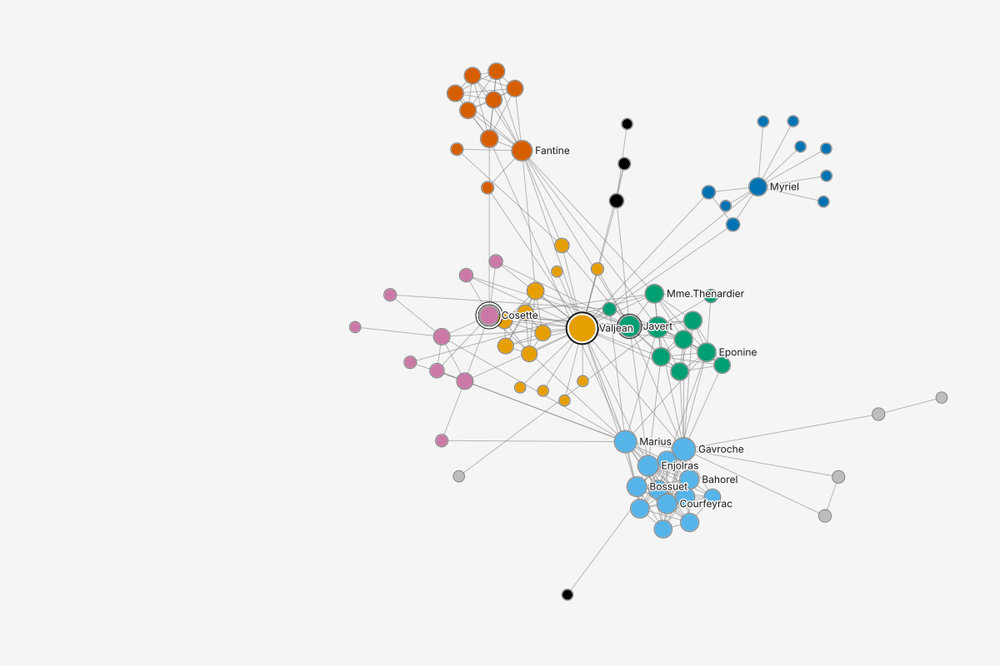
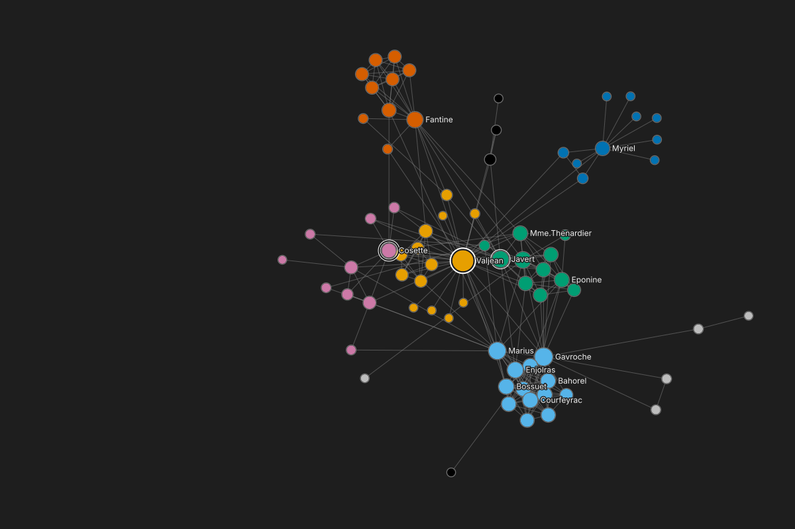

# The mock kit

Everything a graphty mock needs, so every storyboard, flow and screen looks like one product and
uses the same data. Plain HTML and CSS plus one kit script (`kit.js`), no network: pages work offline and at
http://dev.ato.ms:9825/.

- **See it:** `kit/index.html` (every component, light and dark), `kit/template.html` (the whole
  app), `kit/canvas.html` (every canvas drawing).
- **Start a screen:** copy `kit/template.html` to `screens/<id>.html`, change the content, shoot it.
  All paths in the template are `../kit/...`, so it works unchanged from `screens/`, `storyboards/`,
  `flows/` and `study/`.

## Files

| File | What it is | Edit? |
|---|---|---|
| `cm.css` | compact-mantine's real global CSS from the PR #409 worktree: every `--cm-*` token (light and dark through `light-dark()`), the accessible-contrast values the app always uses, the Inter face | no: generated by `build-cm-css.mjs` |
| `kit.css` | the wireframe components (`k-*` classes), drawn only with `--cm-*` tokens | yes |
| `icons.svg` | lucide icon sprite (108 icons) | no: add a name to `build-icons.mjs` and run it |
| `canvas/*.svg` | canvas drawings, a `-light` and `-dark` file each | no: generated by `gen-canvas.mjs` |
| `fixtures.json` | every number a page shows: the datasets (counts, attributes, top nodes, table rows, anchors), one entry per study task (`tasks`), and one entry per scenario whose numbers need their own run (`scenarios`) | no: `gen-canvas.mjs` writes `datasets` and `tasks`; each `scenarios` entry is written by its own script (below, "Data") |
| `alerts.json`, `canvas/alerts-*.svg` | the alert-triage fixture: August transfers with the monitoring system's 50 alerts (most benign) and a 12-account ring, and the same month for the whole bank (1,000,000 accounts, counted only) | no: generated by `gen-alerts.mjs` |
| `fonts/` | Inter (OFL) | no |
| `kit.js` | the one script every page loads: numbers from the fixtures, tooltips, unwired controls marked (below, "kit.js") | yes |
| `check.mjs` | the kit check and the gate: every page against the fixtures, the term sheet and the frame, and every task's refs (below, "The kit check" and "The gate") | yes |
| `terms.json` | the term sheet the gate reads: retired strings, and required strings mapped to a page and state (below, "The gate") | yes |
| `prove-gate.mjs` | plants one violation of each gate rule in a page that passes and expects the check to fail on it | yes |
| `shell.mjs` | the frame of every task screen (rail, one right panel, no avatar, no header Export); generators pass their pages through it | yes |
| `shoot.mjs` | renders pages to PNGs | yes |
| `template.html`, `index.html`, `canvas.html` | reference pages | yes |

Regenerate after a change upstream: `node kit/build-cm-css.mjs`, `node kit/build-icons.mjs`,
`node kit/gen-canvas.mjs`, `node kit/gen-alerts.mjs` (all run from `design/ui/prototype/`; each takes a few seconds).

## Page skeleton

```html
<!doctype html>
<html lang="en">
<head>
<meta charset="utf-8">
<title>Open a transaction file</title>
<link rel="stylesheet" href="../kit/cm.css">
<link rel="stylesheet" href="../kit/kit.css"><script src="../kit/kit.js" defer></script>
</head>
<body> ... </body>
</html>
```

**Theme.** Pages follow the viewer's system theme. Force one with `<html data-theme="dark">` (or
`"light"`); `shoot.mjs --dark` sets it. Chrome colors come only from `var(--cm-*)`; never write a
hex color for chrome; ink on the dark menu and tooltip is `var(--k-menu-ink2)` (secondary) and
`var(--k-menu-ink3)` (disabled), and the canvas is `var(--k-canvas)` and `var(--k-canvas-ink)`. A mark a page draws over a drawing in CSS or
inline SVG (a selection ring, a hull, focus bands, a badge on the canvas) takes the drawings' own two-tone band,
`var(--k-mark-out)` outside and `var(--k-mark-in)` inside, and a fill edge is `var(--k-fill-edge)`. Data colors (chits, legend entries, table swatches) use the values in
`fixtures.json` (Okabe-Ito first, `#808080` unstyled, `#BDBDBD` Other: a light grey kept apart from black and from the unstyled grey, and every legend names what Other holds).

**Icons.** `<svg class="k-i"><use href="../kit/icons.svg#search"/></svg>`; sizes `k-i-sm` (12),
default (16), `k-i-lg` (24, toolbar tools). The list of names is in `build-icons.mjs`.

**Type scale.** Product UI uses compact-mantine's roles, with one change: nothing a reader reads is
set below 11 px. 11/16 body (550 for emphasis, never a bigger size, never the browser's 700: the kit
sets `b` and `strong` to 550), 13/22 small heading, 15/25 empty-state heading. The 9/14 caption role
is not used: captions, rail labels, table header summaries, axis figures and badges are 11/16 in
secondary ink, through `var(--k-caption-fs)` and `var(--k-caption-lh)` when a page sets its own
(never a literal 9 or 10; framework-changes.md, "The smallest product text is 11 px"). Canvas labels
are 12, as the drawings set them; an exported file's preview keeps the file's own print sizes.
Captions are typed in sentence case: nothing is uppercase, by CSS or by typing. Monospace is `var(--cm-font-family-mono)`.
Document pages (storyboards, flows, study, a screen page's intro) title with the `k-doc` h1, 24/32
at 600. Annotation text is 11 or 12 (`k-annot-note`). Use only tokens `cm.css` defines; a
`var(--cm-x, fallback)` for a token that does not exist silently draws the fallback.

**Keys.** A key printed on a page (`k-kbd`, a menu's `k-shortcut`, an announcement) joins its keys
with + in the order Ctrl, Alt, Shift, key: `Ctrl+Shift+Z`, `Shift+Enter`, `Delete`, `Esc`. Menus
and announcements name the platform's modifier (Ctrl; Cmd on a Mac); only design prose says Mod.
The main menu and the project-name menu hold the same items, in the same order, with the same keys
on every page (`framework-changes.md`, "One main menu and one project menu, with their keys").
The keys every page uses: Ctrl+Z undo, Ctrl+Shift+Z redo (the Edit menu prints this one; Ctrl+Y
also redoes off macOS, and the key sheet lists both), Ctrl+K Quick actions (a node's exact name
is the row "Go to {name}", which moves the walk there and selects nothing), Ctrl+F Find from every
region (proposed; Enter or a click on a hit puts the walk's focus on it and selects nothing, and Enter
again selects; a hit that is not drawn is selected at once), Ctrl+A select
all, Ctrl+G create set, Ctrl+] and Ctrl+[ move a row up and down, Shift+F10 a menu, F6 the
next region, ? the key sheet; on the canvas, Shift with the arrows walks (Shift+Down or
Shift+Right starts, or goes on from a kept walk, Shift+Enter goes back and Shift+Up does too,
Shift+Home returns to the start, O switches the neighbor order (proposed)), plain arrows move the
camera, Enter adds the focused node to the selection and never replaces or removes it, Space
released adds or removes it, Alt+Enter (Option+Enter on a Mac; proposed) visits the inspector
without changing the selection, ] and [ step through the selection, Esc leaves the walk, then
disarms a tool, then clears the selection (saying "Selection cleared (3 nodes). Ctrl+Z brings it back.", on every page, while the undo line shows the
same words with Bring it back; Ctrl+Z brings it back, saying "Selection restored (3 nodes).", only while nothing else has changed since), and Tab
leaves the canvas for the table. Leaving never loses the walk: its start and the node it left off
on are kept, and arriving says "Graph drawing. Walk kept: on {node}, from {start}." (the long
welcome is said once per project). The regions a reader hears are Graph drawing, Nodes table,
Inspector, Graph panel and Tools, and every arrival announcement starts with that name; in the
walk it is "Walking the drawing". An undo or redo line, like every notice, clears when the reader moves to another node or filter
step, never on a timer, and Undos in a row add to it ("Undone: Filter out group 8 and Filter to degree >= 5"). A filter step's name is the same in
its row, its undo label and Undo history ("Filter out group 8"); one step is taken out with its own delete on the filter chip.
A question with a few fixed answers, such as "For amount, a higher number means...", is a radio
group with nothing chosen, its answers in the same order on every page (a closer or stronger link, a
longer or costlier step, more can pass through, Don't use {column}); Enter and Run do nothing until
one is chosen, and the arrows move and choose as in any radio group. A stepper ("Route 1 of 2")
steps with its previous and next buttons, and with Left and Right while it has focus. A link that
opens another place (a style layer's "From run:") moves focus to that place's heading, and that place's back
arrow or Esc returns focus to the link. When an action's button leaves with it (Bring it back),
focus goes back to where the reader came from, never to the page body. A commit a sighted reader
sees in place is still spoken ("Note added to Mule ring. Ctrl+Z removes it.").

**Type helpers.** `k-num` (tabular figures on every number that sits in a column or changes),
`k-id` (identifiers: slashed zero, distinct l and I), `k-mono` (expressions), `k-secondary`,
`k-tertiary`, `k-strong`, `k-danger`, `k-grow`, `k-ellipsis`.

## The frame

`k-app` is the four-column frame: rail (57), left panel (241), canvas column, right column (241).
`data-left="closed"` or `data-right="closed"` on it hides a side. Copy it from `template.html`.

```html
<div class="k-app">
  <nav class="k-rail">...</nav>
  <aside class="k-panel">
    <div class="k-panel-head">
      <div class="k-title-line"><span class="k-project">Les Miserables</span></div>
      <a class="k-privacy">Nothing has been sent from this project</a>  <!-- the privacy line: body ink, a link to Data > Sent and saved; the same class in every frame -->
      <span class="k-chip k-chip-btn" role="button">Full graph<svg class="k-i k-i-sm k-caret"><use href="../kit/icons.svg#chevron-down"/></svg></span>  <!-- the filter chip: a button with a caret; aria-expanded="true" when open. A file chip is a plain k-chip -->
    </div>
    <div class="k-scroll"> sections </div>
  </aside>
  <main class="k-main">
    <div class="k-canvas"> ... </div>
    <section class="k-dock"> ... </section>             <!-- optional -->
  </main>
  <aside class="k-right">
    <div class="k-header1"><span class="k-grow"></span><span class="k-btn k-btn-ghost">100%</span></div>   <!-- one header row: zoom at the right; no Export button, no avatar -->
    <div class="k-typerow"><svg class="k-i"><use href="../kit/icons.svg#circle-dot"/></svg><span class="k-name k-id">Valjean</span><span class="k-secondary">Node</span></div>
    <div class="k-scroll"> sections </div>
  </aside>
</div>
```

The rail, top to bottom: the main menu, Graph, Data, Results, Notes, the Assistant (`template.html` has the markup). Results is the rail place that holds runs, "every run of a measure, with its settings and date"; a value is read on its node, in the inspector and the table, and the inspector with nothing selected has no Results section. Styles are the inspector's Style stack section, not a rail place. Never write the frame by hand: `node kit/shell.mjs <page>` brings a page's frames to it (the rail, the privacy line under the project name, the Assistant's off form, the right column's header), and a generator passes its output through `toShell` (`import { toShell } from "../kit/shell.mjs"`).
Rail button: `<div class="k-rail-btn" aria-pressed="true"><span class="k-rail-pill"><svg class="k-i">...</svg></span>Graph</div>`
(`k-rail-sep` between groups).
**Type row** (`k-typerow`, the right column's first row) is two lines, as `interface-specification.md` 4.2 draws it: the kind glyph and the name at full width, then everything written after the name (the kind word, a stepper, the verbs and the overflow) on line 2. Write it in that order, `<svg/><span class="k-name">..</span><span class="k-secondary">Node</span><span class="k-grow"></span>verbs`; kit.css makes the break, and a row with nothing after the name stays one line. The Assistant without a provider has no icon and says so: `<div class="k-rail-btn k-asst-off" title="Assistant: off until you set a provider in Preferences">Assistant<span class="k-asst-cap">Off. Nothing is sent.</span></div>`.

## Sections and rows

The panel grid is compact-mantine's: 16 pad, two 88 fields with 8 between, 8, a 24 trailing slot,
8 pad = 240. Rows sit on a 32 pitch; controls are 24 tall.

```html
<section class="k-section">                      <!-- data-empty: header in secondary ink; data-collapsed -->
  <div class="k-section-head">Styles<span class="k-grow"></span>
    <span class="k-icon-btn"><svg class="k-i"><use href="../kit/icons.svg#plus"/></svg></span></div>
  ... rows ...
</section>
```

**List and tree rows** (graphs, sets, paths, style layers, views, filter steps). One leading mark:
a glyph for a set or path, a chit for a style layer. States: `aria-selected="true"`, `data-hover`,
`data-member` (member of the selected set), `data-off` (turned off), `data-level="2"` (nested).

```html
<ul class="k-list">
  <li class="k-item"><svg class="k-i"><use href="../kit/icons.svg#group"/></svg>
    <span class="k-ellipsis">The barricade</span><span class="k-kind">rule</span>
    <span class="k-trail"><span class="k-paint-slot"><span class="k-chit" style="background:#56B4E9"></span></span><span class="k-num">13</span></span></li>
  <li class="k-item" data-hover><span class="k-chit" style="background:#E69F00"></span>
    <span class="k-ellipsis">Group color</span><span class="k-kind">made here</span>
    <span class="k-trail k-show-hover"><span class="k-icon-btn"><svg class="k-i"><use href="../kit/icons.svg#eye"/></svg></span></span></li>
</ul>
```

`k-show-hover` content only appears on a hovered row (`data-hover` to draw it in a static mock).

**Plain row** (a result, a catalog entry, an action): `<div class="k-row">...</div>`, same states.

**Field row** (legend above, fields on the grid): classes `k-span` (both fields), `k-span3` (both
plus the trail), `k-trail-slot`.

```html
<div class="k-fieldrow">
  <span class="k-legend">Color <span class="k-tertiary">-- Group color</span></span>
  <div class="k-fields">
    <span class="k-field k-span"><span class="k-pill"><span class="k-chit" style="background:#E69F00"></span>group</span></span>
  </div>
</div>
<div class="k-fieldrow"><span class="k-legend">Fill</span>
  <div class="k-fields"><span class="k-field"><span class="k-chit" style="background:#009E73"></span>009E73</span>
    <span class="k-field k-num">100%</span><span class="k-icon-btn">...</span></div></div>
```

Field states: `data-focus`, `data-error`, `data-disabled`, `data-placeholder`; a dropdown adds
`<svg class="k-i k-i-sm k-caret"><use href="../kit/icons.svg#chevron-down"/></svg>`. Caption above a
column: `k-caption`.

**Controls:** `k-btn` (primary), `k-btn k-btn-secondary`, `k-btn k-btn-ghost`, `aria-disabled="true"`;
`k-icon-btn` (`aria-pressed="true"`, `data-hover`); `k-check` and `k-switch` with
`aria-checked="true"`; segmented `<span class="k-seg k-seg-fill k-span"><span aria-pressed="true">Name</span><span>Id</span></span>`;
pill tabs `<span class="k-tabs"><span class="k-tab" aria-selected="true">Nodes</span>...</span>`;
`k-badge`, `k-kbd`, `k-dot`, `k-warn-glyph` (the yellow warning mark: `<span class="k-warn-glyph">!</span>`; `k-warn-glyph k-err-glyph` is its error form, a failed run in a list),
`k-progress` (`<div class="k-progress"><i style="width:40%"></i></div>`).
A count on a rail button (results that failed or are out of date, on Results):
`<span class="k-rail-pill"><svg class="k-i">...</svg><span class="k-rail-badge k-num">1</span></span>`.

**Values:** `k-chit` (12 px color square; `k-chit-round`), `k-ramp` (a sequential strip;
`k-ramp-wide`), `k-pill` (a channel bound to an attribute).
A ramp names its palette, low value first: `k-ramp k-ramp-measure` (graphty-element's
measurement default, orange to brown), `k-ramp-redblue` (its red-to-blue diverging palette as shipped:
red is low), `k-ramp-bluered` (the same reversed); bare `k-ramp` is viridis. A ramp whose stops sit on
a data domain (0 placed where the data puts it) writes its own gradient with the palette's colors.

**Layer chips** (`canvas-drawing.md` 3): a categorical layer leads with stacked chits, largest
category last in the markup so it sits in front,
`<span class="k-stack"><span class="k-chit" style="background:#009E73"></span><span class="k-chit" style="background:#56B4E9"></span><span class="k-chit" style="background:#E69F00"></span></span>`;
a size or width layer with the graduated glyph,
`<svg class="k-sizechip" viewBox="0 0 16 12"><circle cx="3" cy="8" r="2" fill="#808080"/><circle cx="10" cy="6" r="5" fill="#808080"/></svg>`;
a ramp layer with `k-ramp` at `width:16px`. A legend's size block uses graduated marks:
`<div class="k-size-marks"><div><b style="width:9px;height:9px"></b>1</div>...</div>`.

**Readings:**

```html
<div class="k-data"><span class="k-name">betweenness</span><span class="k-value" data-fx="datasets.lesmis.rows.11.betweenness">0.57</span></div>
<div class="k-metrics"><div class="k-metric"><span class="k-secondary">nodes</span><span class="k-big">3,000</span></div> ... </div>
<div class="k-hist"><i style="height:90%"></i> ... <i data-on style="height:4%"></i></div>   <!-- data-on: the selected bin -->
<div class="k-prose">Degree over 300 proteins.</div>
```

Search field at the top of a panel: `<div class="k-search"><span class="k-field"><svg class="k-i k-i-sm">...</svg>Find</span></div>`.

## Canvas

Put the drawing in a **stage**, which keeps the drawing's 3:2 box fitted and centered at any
canvas size, so anything placed by a `fixtures.json` anchor (percent of the drawing) lands on its
node:

```html
<div class="k-canvas">
  <div class="k-stage">
    
    
    <div class="k-tooltip" style="left:62.9%;top:49%;transform:translate(12px,-120%)"><b>Javert</b><br><span class="k-secondary">group 4, degree 17</span></div>
  </div>
  <div class="k-legend-card">
    <div class="k-lg-title">Group color <span class="k-secondary">group</span></div>
    <div class="k-lg-row"><span class="k-chit" style="background:#E69F00"></span>2<span class="k-value">14</span></div>
    <div class="k-lg-row k-secondary">6 more</div>
    <div class="k-notdrawn">12 nodes not drawn. <a>Select hidden</a></div>   <!-- only while something is not drawn -->
  </div>
  <div class="k-toolbar-dock"> [k-secondary-bar] <div class="k-toolbar"> ... </div></div>
  <span class="k-help"><svg class="k-i"><use href="../kit/icons.svg#circle-help"/></svg></span>
</div>
```

`k-at` centers any element on an anchor (`style="left:58.2%;top:49.3%"`), for an annotation box
or a cursor. `k-minimap` is the minimap box, top right.

**The drawings** (each `<name>-light.svg` and `<name>-dark.svg`, 1200 x 800):

| Name | Graph | Shows |
|---|---|---|
| `karate-plain` | Zachary's karate club, 34 members, 78 ties | first render: all gray, every label |
| `karate-faction` | same | colored by faction; Mr. Hi selected, Officer hovered, member 3 keyboard-focused |
| `lesmis-plain` | Les Miserables, 77 characters, 254 co-appearances | first render: gray, 18 labels (the label budget) |
| `lesmis-groups` | same | colored by group, sized by degree; Valjean selected, Javert hovered, Cosette focused |
| `lesmis-walk` | same | Valjean selected, Cosette keyboard-focused, nothing hovered, only those two labeled: the selection ring beside the focus mark |
| `lesmis-neighbors` | same | Valjean selected, his 36 neighbors carrying the member ring |
| `ppi-plain` | 300 human proteins, 1,262 interactions | first render |
| `ppi-modules` | same | colored by module (Other for unassigned), sized by degree; TP53 selected |
| `ppi-modules-rest` | same | the same with nothing selected |
| `ppi-tp53` | the protein graph filtered to TP53 and its 32 neighbors (33 nodes, 59 edges) | colored by module, sized by degree, every label; TP53 selected. `ppi.tp53Slice` holds each node's neighbors in walk order (edge confidence, then name), degree rank and anchors |
| `ppi-betweenness` | the protein graph | colored by betweenness (the element's orange-to-brown measurement ramp over log(1 + x / c), c the smallest value above 0), sized by degree in five steps, the 12 hubs labeled. Numbers in `ppi.encodings.betweenness` |
| `ppi-stacked`, `ppi-stacked-tp53` | same | the same plus the shortest path TP53 to SMAD3 as highlight 1; the second with TP53 selected |
| `transactions-density` | 3,000 accounts, 9,113 transfers | drawn as neutral hexbin density |
| `transactions-flagged` | same | density with the 14 flagged mule-ring accounts drawn over it, selected |
| `transactions-sets-focus`, `transactions-sets-intersect`, `transactions-path` | March transfers | the 37 payers of merchant ACC-893168 selected (hull in the selection band) with the 164 members of two focused sets hover-marked; the 16-account intersection selected; the shortest path ACC-271813 to ACC-233575 selected, zoomed to 300%. Numbers in `transactions.setsAndPaths` |
| `transactions-march-communities` | March transfers | every account as a dot, colored by Louvain community (7 colors, then Other), sized by degree |
| `transactions-march-communities-sel` | March transfers | the same, with the 14 flagged accounts selected (selection ring): the project as it closed in March |
| `transactions-april-communities` | April transfers (`datasets.transactionsApril`, the next data version) | the same, March positions kept, new accounts placed beside their counterparties, community names and colors carried over by overlap |
| `transactions-compare-march`, `transactions-compare-april` | both | the two sides of the month-to-month comparison, the ring's community (Community 33) with the member ring |
| `transactions-april-pagerank`, `transactions-april-pagerank-path` | April | colored by PageRank on a log scale; then the shortest path from a payroll account into the ring as highlight 1 |
| `citations-narrowed` | the citation graph after the rule "category is Drugs and medical AND citationsReceived >= 25": 612 patents, 1,843 citations (`citations.narrowed`) | first paint, gray, with arrows; the giant component at left, the 12 small components and 31 isolates packed at right; the 10 most cited labels that fit |
| `citations-sample` | the offered step "Top 3 by degree, with neighbors": 586 patents, 893 citations (`citations.degreeSample`) | the three hubs and their neighbors, gray, with arrows |
| `transactions-compare-march-sel`, `transactions-compare-april-sel` | both | the comparison's sides after a difference-list row is selected: the ring's community (Community 33) with the selection ring, only-in-March and only-in-April accounts with the comparison half-ring, zoomed 300% on the new accounts with marks at screen size for a 450 px side (`transactionsApril.compareSelection`) |
| `transactions-april-ring-new` | April | colored by community, the 7 new accounts of the ring's community selected (`transactionsApril.newAccountFlows`) |
| `transactions-april-upstream-pagerank`, `transactions-april-upstream-path` | April, filtered | the ring's community and two steps upstream (157 accounts, 213 transfers), laid out again on the filter, colored by PageRank on a log scale fitted to the filter; then the shortest path ACC-347291 to ACC-642959 selected and highlighted with its end badges (`transactionsApril.upstream`) |
| `transactions-april-flagged` | April | density with the March mule ring's 14 accounts drawn over it, selected (anchor `transactionsApril.anchors.ringCenter`; the ring's April PageRank in `transactionsApril.pagerank.ring`) |

The marks follow `design/ui/framework/canvas-drawing.md`: selection is a two-tone ring (the band
with more contrast against the canvas outside), member a thin two-tone ring, hover a one-tone
hairline after a 2 px gap, keyboard focus three bands after a 2 px gap; labels have a halo in the
canvas color, culled by collision (when two label boxes meet, the lower-degree one is dropped;
marked nodes keep theirs); when any fill of a drawing is under 3:1 against the canvas, every node
carries the one-tone fill edge (`canvas-drawing.md` 4), which is what keeps Okabe-Ito black
readable on the dark canvas; nothing on the canvas uses the accent blue.

**Past the drawing limit** nothing is drawn: an empty `k-canvas` with the not-drawn message
centered on it (a line in the legend corner goes unseen on a large blank canvas), its title the count, then the reason
with the limit, then one button. Once anything draws, the message goes back to the legend's
not-drawn line. Use the citation graph from `fixtures.json` (124,318 nodes, 1,480,221 edges);
screens/past-drawing-limit.html has the markup (`p-nd`).

Its numbers are all in `datasets.citations`: `stats` (the General overview readings and the component-size list for the full graph; they add up), `rows` and `profiles` (the table and its header summaries), `narrowed` and `degreeSample` (the same for the two parts that draw, each with its computed `degreeDistribution`), `degreeDistribution` (the full graph's in- and out-degree distributions, modeled: complementary cumulative points and the count at 0), `isolates` (the table's first rows when the isolates count is opened), `ruleCounts` (what the rule editor's count line says for three rules) and `drawingLimit`. Read them, never retype them: screens/past-drawing-limit.html fetches the file.

## kit.js

Every page loads it right after `kit.css` (the skeleton above). It does five things, and a page
writes no code for them.

**Numbers on a page come from the fixtures, through one formatter.** Put the fixture's key on the
element and type the text the formatter writes; the typed text is what shows offline:

```html
<span data-fx="datasets.ppi.nodes" data-fx-noun="proteins">300 proteins</span>
<span data-fx="datasets.ppi.filtered.nodes" data-fx-of="datasets.ppi.nodes" data-fx-noun="proteins">56 of 300 proteins</span>
<span data-fx="datasets.lesmis.stats.density" data-fx-digits="4">0.0868</span>
<span data-fx="alerts:august.alerts.length" data-fx-noun="alerts">50 alerts</span>        <!-- alerts: reads kit/alerts.json -->

<div data-fx-if="datasets.{ds}.frame.legend"> ... </div>           <!-- hidden when the value is empty -->
```

**The scope formatter.** At least eight confirmed round-6 findings were one defect: a number that
does not say what it was counted on (degree 40 against 41, units dropped after a filter, "Export
again" with no version, an agreement sentence against "0 of the top 50"). So one formatter, in
kit.js, writes every count and measure a participant reads, always the same way:

| Part | Attribute | Written as |
|---|---|---|
| the value | `data-fx="<key>"` | the fixture's value, commas on integers, a range as "-2.52 to 3.15" |
| a fixed precision | (by measure) or `data-fx-digits` | a computed measure (betweenness, closeness, PageRank, density, average degree, modularity) at 3 significant figures, a non-zero value under 0.001 in its own e-notation, as `content-design.md` 5 sets it: 0.570, 0.0868, 7.70, 3.85e-4; money in cents; one measure never shows at two precisions |
| the counted noun or unit | `data-fx-noun="proteins"`, `data-fx-unit="USD"` (`"$"` goes before) | "1 protein", "300 proteins" (`"person|people"` names both forms) |
| part of a whole | `data-fx-of="<key of the whole>"` | "56 of 300 proteins" |
| the data version | automatic; `data-fx-version="named"` when the words beside it already name it | a value from another version than the one on screen says so: "3,000 accounts (March 2026 data)" on an April page. The version is the one the dataset's title names |
| the set | `data-fx-set`, `data-fx-measure` | ", on: filtered graph" (below) |
| the set's message key | `data-fx-msg="graphty.<area>.<message>"` (script: `count(key, { msg })`) | required on every count that names its set: the set is a parameter of that message, never app-written text. kit.js fails a count that names its set without one, and in the facilitator view its tooltip shows the key and its parameters (`graphty.inspector.attribute { value: "16", set: "full graph" }`) |

**Which set is current.** A count names its set when the set differs from the current one, and the
current set is the frame's: the nearest `[data-set]` around the count (a filtered frame on a page of
several, as `screens/find.html` marks its filtered inspector `data-set="filtered graph"`), else
`<body data-set>`, else "full graph". So on the filtered frame Thenardier's degree reads "11" and,
beside it, "16, on: full graph", both from the formatter.

**Degree on a directed graph** is always labelled in, out or total ("total degree", "average total
degree", "Size: total degree"), in legends, field and data labels, table headers and metric labels;
a label whose row offers the choice ("Degree distribution" over Total, In, Out) says it already.
The gate fails a bare "degree" in any frame whose drawing and bound counts are all of directed
datasets (the transfers, April's transfers, the patents, the alert month).

**When the typed text differs from what the formatter writes, or the key does not exist, the page
throws**, the element gets an annotation-ink outline, and `shoot.mjs` and `check.mjs` fail and name
both. So two pages can never show two numbers for the same fixture value. `{ds}` in a key is the
page's dataset: `?dataset=<id>` in the URL, else the dataset of `?task=<id>`, else `<body
data-dataset="...">`. The typed text is only checked when the page shows its own dataset. Markup a
page's script draws after load (a state it switches to on a click) is bound the same way.

**The gate fails every count the formatter did not write** (`check.mjs`, read in the participant
view inside product frames): a number with a counted noun ("1,262 interactions"), "N of M" on its
own ("27 of 77"), or a statistic after its label ("density 0.296"), unless every number in it
sits inside a `data-fx` element. Not read: table cells (rows from the fixtures), SVG text, a
threshold in prose ("past about 2,000 accounts", "top 10", "first 5 of 150"), 0 and 1 (they cannot
disagree between pages), "N of M" that counts steps, routes, runs or results replayed, a place in a
list ("rank 247 of 300", "neighbor 2 of 6", "2 of 6 from RPA2", "rows 1 to 7 of 1,863", a stepper's
"4 of 10"), "N node names". A number the reader set rather than the data (a top-N length, "18 of
100"; the reader's own selection announced by a live region) is typed inside `data-fx-param`, and
only that. Every number binds to a key that means it: a count derived from other fixture values
(a path's other proteins, a selection's memberships, a hop's kinds) is computed by
`screens/counts-numbers.mjs` into `fixtures.scenarios.onScreen`, never bound to a key that merely
holds the same value. A page that builds its markup in a script calls `count()` (below) or types
`<span data-fx=...>`; a live simulator (`screens/filter-chip.html`) binds each drawn state to
`scenarios.filterChip` (`screens/filter-chip-numbers.mjs`, which fails unless the page's own model
agrees with `datasets.lesmis.filterSteps`, `datasets.ppi.filtered` and `scenarios.failureAndRecovery`),
and passes its own count as `expect`, so kit.js reports any disagreement.

**Generated pages.** The counts on these pages were bound in the page itself, and their generators
do not emit the bindings yet: `screens/styles-list.gen.mjs`, `inspector.gen.mjs`, `table-dock.gen.mjs`,
`export-dialog.gen.mjs`, `version-history.gen.mjs`, `notes-panel.gen.mjs`,
`preferences.gen.mjs`, `results-panel.py`, `run-and-read.py`, `option-form-cost.py`,
`alert-triage/src/build.py`, `find-and-expand/build.mjs`, `storyboards/weekly-return.gen.mjs` and
`flows/sets-and-paths.gen.py`. Several of those pages were also edited by hand after they were last
generated. Before running one, port the page's `data-fx` spans into it (the generator writes
`<span data-fx=... data-fx-noun=...>`, or the shared `count()` shape); run as it is, it drops them
and the gate fails the page.

**Markup built from the fixtures** (a legend, a list): listen for the event kit.js sends once the
fixtures are loaded, and check the typed markup with `expect`:

```html
<script>
document.addEventListener("kit:fixtures", ({ detail: { get, ds, fmt, expect, count } }) => {
  const f = get(`datasets.${ds}.frame`);   // a missing key is a kit problem, as with data-fx
  el.innerHTML = `Filtered: ${count("datasets.ppi.filtered.nodes", { of: "datasets.ppi.nodes", noun: "proteins" })}`;
  ...
});
</script>
```

`count(key, { noun, of, unit, digits, set, version, expect })` is the formatter for a page's own script (also `window.kitCount` once the fixtures load, and `window.kitValue(key)`): it
returns the bound markup (`<span data-fx=...>56 of 300 proteins</span>`), so a count a script writes
is the formatter's too. A page script that renders before the fixtures load writes the same
`<span data-fx ...>` markup with the text typed, and kit.js binds and checks it when it appears.

**Tooltips.** Every `k-icon-btn`, `k-tool`, `k-tool-caret`, `k-help` and `[data-tip]` shows a
tooltip on hover (after 400 ms) and on keyboard focus, drawn as compact-mantine's: dark, one line.
Its text is `data-tip`, else `aria-label`, else `title` (moved aside so the browser's own tooltip
does not also show), else a name made from the icon and the row or section it sits in ("Add to
Styles", "About Betweenness", "Select  V"). Give a button its own words with `aria-label` whenever
the made-up one is not what the design says. An icon kit.js has no name for is a kit problem.
`data-tip-open` draws a tooltip open for a static shot.

**Controls the mock does not wire.** Click any control (button, icon button, tool, chip, check,
switch, tab, menu item, row, link) and nothing happens: kit.js outlines it in annotation ink and
says "Not working in this mock", and its tooltip says so from then on. It knows a control is wired
when the click changes the page, the URL hash, focus or scroll, or the control is a real link, label
or form control. `data-not-in-mock` marks one in advance, visibly, at rest. `data-wired` on an
element (or an ancestor) turns the detection off, for a control whose response is slower than a
third of a second.

**Roles, names and keyboard paths.** Whatever a page leaves out, kit.js fills in, and it never
overrides a `role`, name or `tabindex` the page wrote (the table in "Roles, names and focus" below):
the role that owns each state attribute; a name for a control without words (from its tooltip name,
or a checkbox's row); a Tab stop on every control, with Enter and Space clicking it; one Tab stop per
group of tabs, options, tree rows or menu items, moved by the arrows, Home and End; the drawing in
each `k-stage` as one Tab stop (`role="application"`, "graph drawing", named by its `alt`); a Tab
stop on a scroll area with nothing focusable in it; `inert` on a scaled or cropped, pointer-less copy
of a screen in a storyboard, and on any copy inside a link, so Tab and a screen reader skip its
controls and read the caption; while a dialog's `k-backdrop` shows, `aria-modal` on the dialog and
`inert` on the app behind it, as compact-mantine's Modal traps focus (redone when the `#state`
changes); in
every app frame, the project name as the top heading (level 1 on a whole-frame screen, 2 on a page
with its own h1) with each section, popover and dialog header one level under it (a header's own
buttons stay beside the heading), the rail, panels, canvas and dock named as regions, and a first
Tab stop, shown only while focused, "Skip to the graph drawing. F6 moves between regions."; the
same alt on a drawing's dark twin as on its light one; and a hidden level-1 heading from the page
title on a page that still has none, or whose own h1 the #state shown hides (checked again after load and on every hash change, as is a scroll area that only overflows in that state). So every mock can be walked
with the keyboard, and `node kit/a11y.mjs` checks what a real page would expose.

**The study view.** Add `?study` to a page's URL (or `node kit/shoot.mjs --study`) and it shows as a
participant sees it: numbered steps, callouts, dashed boxes, "proposed" and "waits on
graphty-element" tags and state switchers are hidden. kit.js hides the kit's annotation classes
(`k-step`, `k-annot-*`, `k-cursor`) and anything a page drew in annotation ink (its own note classes
included), and drops an annotation outline from a product element. Render every PNG a participant
will see this way: round 2's participants read the design notes as broken product.

- **Product frames.** Headings and paragraphs outside a product frame are narration and are hidden.
  The frames are the kit's product classes (`k-app`, `k-menu`, `k-popover`, `k-modal`, `k-dock` and
  the other overlays) and anything marked `data-kit-frame`. A page that draws its mock window in its
  own class (the start screen's `ss-win`, the data page's `dl-win`, `ls-win`, `lt-win`, `fl-win`,
  `ins-screen`, `ne-screen`, `wr-screen`, `x-frame`) must mark it `data-kit-frame`, or its title and
  text vanish with the notes: in round 3 that hid the start screen's "Open a graph" and both lines
  about where data goes.
- **State switchers.** Every mock control outside the frames goes: state tabs and `#` links, the
  gallery link, annotation and theme toggles, selects and labels. kit.js hides the largest box round
  such a control that holds no product frame. A page can mark one by hand with `data-kit-switcher`,
  and a design note the ink rule cannot see (a spec table, a key) with `data-kit-note`.
- **Dead controls** keep their "Not working in this mock" tooltip and cursor but lose the dashed
  outline, which round 3's participants read as design chrome.
- **The way out.** `?study`, or `study` among a page's `#hash` states (`screens/undo.html#s3&study`)
  on a page with no element whose id is `study` (there `#study` is a section link), is the
  participant view. It shows a small, faint control in the bottom-right corner of the visible screen
  (a 32 px touch target, pinned there however far a tablet is zoomed or panned), and Esc does the
  same: both drop `study` from the address and reload, keeping the page's other states. A desktop
  scripted render (`kit/shoot.mjs --study`) shows no control. Checked at iPad width, 768 by 1024
  with touch: `kit/shoot.mjs --touch` always renders the participant view (it implies `--study`),
  corner control included, and writes `...--study--768-touch.png`.

**The Esc rule** (every page). In round 6 one Esc both closed the undo page's steps list and reset
the page, which cost four sessions. So:

1. A handler that closes, cancels or clears something (a menu, a popover, a steps list, a gesture,
   a selection) calls `e.preventDefault()`.
2. Esc does one thing per press, starting with the innermost open item: a menu inside a popover
   closes before the popover, the popover before the selection is cleared.
3. The participant view is left only by an Esc with nothing open: when no handler marked the key
   and the press changed nothing on the page. kit.js waits until every listener has run, and takes
   any change to the page (outside its own tooltip) as the key used, so a handler that forgot
   `preventDefault()` still does not reset the page.
4. A handler that has nothing to close does not use the key (no `preventDefault()`, no redraw), so
   Esc from rest always leaves.

`check.mjs` checks both halves on every page: from rest, up to five presses must leave the view;
after each control that opens something (a chip, a menu button, anything with `aria-haspopup` or
`aria-expanded`) is clicked, one Esc must not. `prove-gate.mjs` opens the undo page's steps list,
presses Esc, and requires the page to still be in the participant view with the list closed.

## The kit check

```bash
node kit/check.mjs --all                 # every page; exit 1 on any problem
node kit/check.mjs screens/frame-at-rest.html "screens/frame-at-rest.html?dataset=ppi"
```

`node kit/check.mjs --tasks` walks every study task's screens (`fixtures.tasks.<id>.pages`), each
opened with `?task=<id>&study`, and fails when a screen draws or binds another dataset than the task's
(a drawing names its dataset by its file name; a page that holds one dataset says so with
`<body data-dataset>`; the start screen, which shows every sample on purpose, carries
`<body data-any-dataset>`), or types a count the task's dataset, its refs and the scenarios do not
hold. A page that stacks its states is read at the state its `#hash` names: the section with that
id, or, where the id is on a state heading (`<div class="x-state-h" id=...>` followed by its frame),
the heading and everything up to the next heading of its kind. A state on another dataset than its
page's says so on its own section (`<section id="runs-lesmis" data-dataset="lesmis">` in
`screens/comparison.html`), and a task reads that state by its `#hash`, never the whole page. Run it
before a round.

It loads each page in Chromium and fails on: a script error; a page that does not load kit.js; a
typed number that is not its fixture's; a fixture key that does not exist; an icon button with no
tooltip; two pages that show different text for the same fixture value; and a task in
`fixtures.json` whose dataset or refs do not exist. It also fails on every typed number no fixture
holds anywhere (in `fixtures.json` or `alerts.json`), read from the page's source and from its text
as drawn, so a number a page's script computes counts too: a count on one line ("1,904 edges", not
"node pairs"), and a statistic after its label ("modularity 0.716", "density 0.0281", "components
3", "average degree 7.70"; 7.70 matches 7.7). A threshold in prose ("past about 2,000 accounts") is
design, not data. Every number two pages share must trace to the fixtures: bind it with `data-fx`,
or add it to the fixtures from the script that computes it (`fixtures.scenarios.<name>`). The check
takes this list as problems; `--typed` and `--strict` are accepted and do nothing more.

## The gate

Before a study round, every task screen passes the gate, and the round does not start until it does:

```bash
node kit/check.mjs --all        # every page: no problem
node kit/check.mjs --tasks      # every task's screens: no problem, and more than 0 screens checked
node kit/prove-gate.mjs         # every rule still fails on a planted violation: "all N proofs hold"
```

The facilitator pastes the output of all three into the round's file (`study/round-N/gate.md`)
before the first session or first click. Any failure stops the round: a gate that checked nothing
passed nothing (round 6 ran on "0 problems on 0 pages", and every mock defect participants hit
survived). `--tasks` exits 1 when it checks 0 task screens, and a run that checks no page at all
exits 1. `--task=<id>` limits `--tasks` to some tasks. The
check reads each page as rendered (every state it switches to by `#hash` or `?query` included; the
states it stacks are all on the page at once) and fails it on:

1. **A retired string** anywhere on the page, design prose included: prose that describes a retired
   control as current misleads the owner as much as the control misleads a participant. The list
   is `retired` in `kit/terms.json` ("Export files", an avatar letter, "Style files", "Undo back to
   here", the Previous selection key, "Default for new runs", "weight 0.98", the Print look's
   "within ... of 0 drawn as no change", "result" used to mean a value, the invented tie rule's
   "within 1%" and "near #8", a column's "not used yet", and "Change..." on a data source; the note
   editor's "Saving as: Marcus. Change..." is the author setting and stays). `study/index.html` and
   `study/coverage.html`, the records of past rounds, are exempt (they quote retired terms as history).
2. **A required string** missing from the page and state `kit/terms.json` maps it to, read inside
   product frames in the participant view, so a design note never satisfies it. One global list
   would fail every page, so each string names its states: Ctrl+Enter on the note editor, "Near
   tie" on the ranked table, "Not run:" on a refused run, "Money in" and "Links in (count)" on the
   transfers, "Selection restored" on the restore, "on 60 of 77" on a value computed on a subset.
   (The ranked table's "Near tie" is withdrawn with the invented tie rule.)
   A state the sheet names that the page does not have yet fails as "required state not drawn".
3. **A count the scope formatter did not write**, and **a count that differs from
   `kit/fixtures.json`**: a typed count no fixture holds, a bound number
   that is not its fixture's, two pages showing one fixture value differently, and, on a page that
   declares its dataset (`<body data-dataset>` or `?dataset=`), a node or edge count in the Graphs
   row, the table's scope line or a nodes or edges reading that is not that dataset's. A count bound
   to `datasets.<id>.nodes`, or inside an element with its own `data-dataset`, is read against that
   dataset.
4. **One capability in two homes**: a Results section in the inspector with nothing selected (runs
   live on the Results rail place), a Previous selection command (Ctrl+Z restores a cleared
   selection), or an Apply dialog without "Use these styles" (there is one Apply dialog).

5. **The Esc rule** (above, "The Esc rule").

And on **the old frame**: a rail other than main menu, Graph, Data, Results, Notes, Assistant (a
rail with only the main menu is the start screen's), two right columns, an avatar, an Export
button in a header row, Styles in the Graph panel, a Note tool on the toolbar (there is no Note
tool: a note starts from Add note... or the Notes panel), or a left panel header with the project
name and no privacy line under it (every head a panel switches by state, too; `kit/shell.mjs` adds
it to static frames, and a page that builds its frame in a script writes it).

6. **Degree on a directed graph without in, out or total** (above, "The scope formatter").
7. **Two columns of one table with one display name**: the header's own name (its group row's name
   before it, without the profile line), so "degree" on the filtered graph and "degree" on the full
   graph are "degree (filtered graph)" and "degree (full graph)".

**Before frames.** A frame kept to show what a design replaced carries `data-frame="before"`. The
gate and the shell skip it, `kit.css` captions it "Before", and the participant view hides it.

**Proof.** `node kit/prove-gate.mjs` serves pages that pass with one violation planted
(`check.mjs --plant <page>@<text>@<replacement>[@*]`, `@*` for every occurrence; any served file,
`kit/kit.js` included; nothing on disk changes) and expects each to fail with its named problem: a
retired string (and the same string inside a Before frame, which passes) and each of the four new
ones, a required string (the note editor's "Ctrl+Enter": the page as drawn passes, and removing it
from one state fails that state alone), a count against the page's dataset, a typed count, a bound
number, a count the formatter did not write, each of the three two-homes rules, an avatar, a rail
without Results, a Note tool, a frame with no privacy line, a bare "degree" on the April transfers'
size legend, a count that names its set without its message key, two columns named alike, `--tasks` checking nothing, and the
Esc rule (the steps list closes on Esc and the page stays in the participant view; with the page's
`preventDefault()` and kit.js's net both removed, the check fails). A plant whose text is no longer
on the page stops the check with "the anchor is stale" (exit 2), so a proof can never pass or fail
for the wrong reason; the proofs plant on the resting frame's Overview section head.

## Tasks: `fixtures.tasks`

One fixture per study task, keyed by the task's id (the prefix of its session files in
`study/round-1/sessions/`): the `question` the moderator reads, the `dataset` every screen of the
task shows from the first to the last, the `file` the participant opens, the `facts` the task turns
on, and `refs` into `datasets` that the check resolves. A task's pages take `?task=<id>` (or
`<body data-dataset>`), so the screen after Load is always the file just loaded. The ones round 1
needed most:

- `worth-an-afternoon`: the protein evidence file, `ppi-core-300-evidence.tsv`. The file names 300
  proteins, and it loads 300: GSK3B and NOTCH1 have no interaction, sit on rows with an empty partner
  and load unconnected (`datasets.ppi.load`), so the graph has 3 components. The GraphML loads the
  same 300.
- `flagged-account`, `how-connected`, `remember-why`: the March transfers with the flagged account
  ACC-365386 (the same account opens the alert queue in `alerts.json`). Each of the 14 flagged
  accounts carries its alert as columns of the accounts file: `alertRule` ("Structuring: 3 or more
  transfers of 9,000 to 9,999 USD out in 30 days") and `alertTime` (ACC-365386: 2026-03-09T02:10:00Z,
  the overnight batch). Every node column names its file (`attributes[].source`,
  `accounts-2026-03.csv`); riskScore is the bank's own score, "from accounts-2026-03.csv, not
  computed by graphty" (`sourceNote`).
- `read-the-numbers`: the proteins filtered to one module, `datasets.ppi.filtered`: "Filter to module
  = Ribosome" keeps 56 of 300 nodes and 217 of 1,262 edges (69 edges leave the module), one
  component, no isolates, degree 1 to 14 on the filtered graph, the top 10 by that degree beside
  each protein's full-graph degree. No screen draws it yet: the filter chip mock is Les Miserables.
- `quiet-weight-trap`, `narrow-or-paint`, `get-back`, `fix-wrong-middle-step`: Les Miserables.
  `datasets.lesmis.filterSteps.statsByState` holds the Statistics for every on/off combination of the
  three filter steps ("1-3" is steps 1 and 3 on), so the filter chip mock's live numbers trace to
  the fixtures.
- `keyboard-walk`, `keyboard-walk-shift-arrow`: the proteins, TP53 and its neighbors, the graph the
  walk mock loads (Shift+Arrow walks; plain arrows stay on the camera).
- Rounds 4 and 5 ran eleven tasks with no entry, so `--tasks` never saw their screens; they have
  one now, with the moderator's wording: `calculation-stopped`, `dated-trace`, `gray-figure-signed`,
  `money-in-and-out`, `notes-with-names`, `restyle-two-groups`, `team-colors-file`,
  `top-200-past-limit`, `two-runs-compared`, `weekly-update`, `weight-end-to-end`, and round 6's
  `load-a-messy-export` and `real-change-or-noise`. Each names the dataset its question is about;
  a screen it borrows from another dataset is reported by `--tasks`, not hidden.
- Each task also lists its `pages`, the screens it shows first to last (with a `#state` where a page
  stacks several), which `check.mjs --tasks` walks. A task never borrows a screen of another dataset:
  where one is missing, the check says so, and the screen is the work, not the task.
- `groups-differ`: a finished Louvain run on the proteins, `datasets.ppi.louvain`: confidence read as
  a similarity, resolution 1, seed 7, modularity 0.716, 10 communities (2 of them the proteins with
  no interaction). Each group has its size, edges inside and out, density, mean log2FoldChange
  against the rest, its hub, and the file's module most of its members carry, so a detected group
  is never mistaken for an imported one.

**The resting frame per dataset:** `datasets.<id>.frame` (lesmis, ppi, transactions) holds what
`screens/frame-at-rest.html?dataset=<id>` shows: header, drawing, legend, Statistics rows and the
degree bars (log-spaced when the maximum passes 100). `datasets.lesmis.stats` has `selfLoops` (0: the published
graph has none).

## Data: `fixtures.json`

`datasets.<id>` for `karate`, `lesmis`, `ppi`, `transactions`, `citations`, each with `title`,
`file` (a realistic file name), `source`, `nodes`, `edges`, `directed`, `attributes` (name, kind,
category counts or ranges), `stats` (components, density, average and max degree, isolated nodes,
modularity of the given grouping), top nodes by degree or betweenness, `rows` (ready for a table),
`anchors` (percent positions of the marked nodes on the drawing) and `drawings`. The protein and
transaction graphs are generated from a fixed seed with real gene symbols and plausible accounts;
their numbers never change unless `gen-canvas.mjs` changes. **Quote numbers from this file, never
invent them**, so every mock of the same graph agrees.

**The evidence file as loaded: `datasets.ppiEvidence`.** `ppi-core-300-evidence.tsv` read with Keep
all: 300 proteins (GSK3B and NOTCH1, which have no interaction, load unconnected from their rows with an
empty partner), 2,298 edges of which 1,036 are parallel rows, no weight (150 confidence scores read NA),
no module column. Its drawing is `canvas/ppi-evidence-plain-{theme}.svg` and its resting frame
`ppiEvidence.frame`, so `frame-at-rest.html?task=worth-an-afternoon` shows the file that was just loaded.

**Scenarios: `fixtures.scenarios`.** Numbers a scenario needs from its own run live here too, so a
page never reads a side file: `failureAndRecovery` (NetworkX on the published Les Miserables:
weighted betweenness both ways, closeness with and without the correction, the three filter steps;
`python3 screens/failure-and-recovery-numbers.py`), `comparison` (the March and April ranks;
`node screens/comparison-numbers.mjs`), `tableDock` (every account's row, unrounded measures;
`node screens/table-dock-numbers.mjs`), `pastLimitTop200` (the 200 most cited patents a "Keep top rows" step keeps, their citations and drawing, modeled; `node screens/past-drawing-limit-numbers.mjs`, which also writes `screens/img/pdl-top200-{theme}.svg`), `filterChip` (each drawn state of the filter chip mock; `node screens/filter-chip-numbers.mjs`), `twoRunsLesmis` (the two Betweenness runs on Les Miserables compared, full graph against the 60 left by the first filter step: overlap, Spearman, the difference list; `node screens/two-runs-lesmis-numbers.mjs`), `onScreen` (counts derived from other fixture values, such as a path's other proteins or a selection's memberships; `node screens/counts-numbers.mjs`, run last). Each script sets its own entry and leaves the rest;
`gen-canvas.mjs` keeps them when it rewrites the file. Run `gen-canvas.mjs` first, then the scripts.
`datasets.alertsAugust` names the alert queue's month so a task can point at it; its numbers stay in
`alerts.json`.

For a load step: `transactions.columns` and `.firstRows` (the transfer file's own rows), `citations.firstRows`, and `ppi.evidence` (the protein network exported one row per pair and evidence source: 2,298 rows, 1,036 extra parallel edges that merge by max of confidence back to 1,262, and 150 `NA` scores).

`transactions.withoutMerchants` is the March graph with its 60 merchants filtered out (2,940 nodes, 3,811 transfers, maximum degree 14) and the 5,302 transfers that hiding the merchants stops drawing.

`citations.sampledBetweenness` is a finished Betweenness (sampled) on the patents (50 sources, seed 7): distribution, middle, highest and the top 10, modeled rather than computed (the sample has no edge list); show every value with ~.

April's transfers (`datasets.transactionsApril`) are the March accounts one month on: 2,961 kept, 132 new, 39 closed; its `versionDiff`, `louvain` (both months, AMI between them and for a re-run, the communities that grew with how firmly each holds), `watchlist`, `pagerank`, `path` and `legends` feed the weekly-return storyboard. April arrives as two files like March (`files`: an account table and a transfer list); 26 March accounts have no April transfer (`dormant`: they make 27 weak components and 26 single-account communities); `louvain.unmatchedMarch` lists the March groups with no April match and the April group holding most of each, `louvain.unmatchedAprilSilent` counts the new groups that are one account with no transfers, and `agreement.stayTogether` says the agreement in words (of the pairs of accounts sharing a group in one run, how many in 10 share one in the other); `agreement` has the month-to-month AMI on the accounts in both, without the silent ones, and each month's range over its five seeded re-runs; `newAccountFlows` lists every transfer of the ring's 7 new accounts with sums; `upstream` describes the filtered figure.

**Alert triage data: `alerts.json`** (from `gen-alerts.mjs`, which reuses `gen-canvas.mjs`'s helpers and does not touch `fixtures.json`). `august` is a separate 3,000-account month with realistic monitoring output: `alerts` (50, in queue order, with `alertId` and `alertScenario`; 42 are benign: tuition just under 10,000 USD, payroll runs, one big supplier, salary in and rent out, new accounts), `ring` (12 accounts passing 9,000 to 9,999 USD around, 8 alerted and 4 not), `seed` (ACC-365386: its 1-hop transfers, hop sizes by direction, what makes 2 hops large, the 2-hop step's alerted accounts and transfers of 9,000 to 9,999), `ringSet`, `distractor` (an alerted lookalike), `tuitionCase`, `nextCase`, `path`, `rule` and `anchors`. Its drawings are `canvas/alerts-{density,points,tuition-hop1,seed-hop1,seed-hop2,band,band-set,band-path,rule,next}-{theme}.svg`; alerted accounts are orange diamonds, so they read in grayscale. `bank` is the whole bank's month, 1,000,000 accounts containing the same 3,000, past the drawing limit: statistics, component sizes, alert count, the seed's hop sizes and the offered steps' sizes.

Each flagged March account's position is in `transactions.anchors.flagged`; the graph's own name (the Graphs row, "About the graph Transfers") is `graphName`.
Notable facts to use: Les Miserables is the published graph (Knuth 1993, as networkx's
`les_miserables_graph`): one component, nobody isolated, Old Man's one edge goes to Myriel, and the
four co-appearances graph-io's test corpus reads as 0 are 9 (`lesmis.corpusDiffersFromPublished`
records what the corpus changes; `gen-canvas.mjs` corrects it on load). Valjean has degree 36 and the
highest betweenness (0.57), then Myriel (0.177) and Gavroche (0.165). The filter-step scenario is
Filter to degree >= 2 (60 left), Filter to degree >= 5 (40, degree read live on what the first step
left), Filter out group 8 (27). Karate's faction split has modularity 0.371; the protein network has
3 components and TP53 sits in DNA repair; the transaction network is directed, one weak component,
with the busiest merchant at degree 907. Patent ids are text: plain digits, never "6,117,075", in
every table, list and file.

## Overlays

```html
<div class="k-menu" style="left:..;top:..">            <!-- dark in both themes -->
  <div class="k-menu-item"><span class="k-check-col"></span>Select neighbors<span class="k-shortcut">Shift N</span></div>
  <div class="k-menu-item" data-hover><span class="k-check-col"></span>Create set from selection</div>
  <div class="k-menu-sep"></div>
  <div class="k-menu-item"><span class="k-check-col">&#10003;</span>Labels on canvas</div>
  <div class="k-menu-item" aria-disabled="true"><span class="k-check-col"></span>Minimap</div>
</div>

<div class="k-popover" style="left:..;top:..">         <!-- editor popover, 240 wide -->
  <div class="k-popover-head">Module color<span class="k-grow"></span><span class="k-icon-btn">...x...</span></div>
  <div class="k-popover-body"> field rows, data rows </div>
</div>

<div class="k-tooltip" style="left:..;top:.."><b>Valjean</b><br><span class="k-secondary">group 2, degree 36</span></div>

<div class="k-toast">Removed 14 nodes<span class="k-toast-action">Undo</span></div>   <!-- the notice; place it in k-toolbar-dock above the toolbar -->
<div class="k-toast">Undone: Create set Friends of Valjean<span class="k-toast-action">Redo</span><span class="k-toast-x"><svg class="k-i k-i-sm"><use href="../kit/icons.svg#x"/></svg></span></div>   <!-- with the dismiss segment -->

<div class="k-issue"><svg class="k-i"><use href="../kit/icons.svg#circle-x"/></svg>   <!-- an error slot in a step or dialog; k-warn-glyph for a warning -->
  <div class="k-issue-body"><b>Could not open ppi-core-300.graphml:</b><span class="k-secondary">the file is a web page, not GraphML <a class="k-link">Details</a></span></div></div>

<div class="k-canvas-card" role="status">                 <!-- inside k-canvas when there is no drawing -->
  <div class="k-canvas-card-title"><svg class="k-i">...</svg>Canvas not available</div>
  <div class="k-secondary">...</div><div class="k-canvas-card-acts"><span class="k-btn">...</span></div></div>

<span class="k-rail-pill k-rail-marked">...</span>        <!-- a rail button with a mark (unseen failure) -->

<div class="k-backdrop"><div class="k-modal">             <!-- k-modal-wide for 720 -->
  <div class="k-modal-head">Open transfers-2026-03.csv</div>
  <div class="k-modal-body"> rows </div>
  <div class="k-modal-foot"><span class="k-btn k-btn-secondary">Cancel</span><span class="k-btn">Open</span></div>
</div></div>

<div class="k-quick">                                  <!-- Quick actions, above the toolbar -->
  <div class="k-quick-input"><svg class="k-i">...</svg>between</div>
  <div class="k-quick-list"><div class="k-group-head">Commands</div>
    <div class="k-result" aria-selected="true">Run betweenness</div></div>
</div>
```

Overlays are `position: absolute`; place them with `left`/`top` inside the nearest positioned
region (`k-canvas`, `k-main`, `k-stage`).

**Variants:** a menu or select option that must state its result gets a second line:
`<div class="k-menu-item" data-described><span class="k-check-col"></span><span class="k-grow">Keep all: 2,298 edges<span class="k-menu-desc">One edge per row...</span></span></div>`
(proposed to compact-mantine; see `framework-changes.md`). The issue row is the one error slot for a step or dialog: its verb is the footer's primary, never a second filled button in the row. The canvas card and the rail mark are proposed to compact-mantine too. `<div class="k-backdrop" data-clear>`
places a dialog without dimming what is behind it, as most Figma dialogs do. `data-focus-ring` on
any control draws compact-mantine's keyboard focus ring in a static mock. `k-link` is an inline
text command (Anchor).

**Toolbar:** Select (with its caret), Path, Quick actions, the view mode. There is no Note tool.

**Status bar:** the design has none. Running work is the notice, and what is not drawn is the
legend's not-drawn line. `k-status` exists only for a mock that proposes one.

## Bottom dock and table

```html
<section class="k-dock">
  <div class="k-timeslider"><span class="k-icon-btn">...play...</span><div class="k-track"><span class="k-window" style="left:30%;width:20%"></span></div><span class="k-num">Mar 8 to Mar 14</span></div>  <!-- optional -->
  <div class="k-dock-tabs"><span class="k-tab" aria-selected="true">Nodes</span><span class="k-tab">Edges</span></div>
  <div class="k-scope">Full graph: 77 nodes. Sorted by degree.</div>
  <div class="k-table-wrap"><table class="k-table">
    <thead><tr><th>label</th><th class="k-n">degree <span class="k-profile">1 to 36</span></th></tr></thead>
    <tbody><tr aria-selected="true"><td class="k-id">Valjean</td><td class="k-n">36</td></tr></tbody>
  </table></div>
</section>
```

Row states: `aria-selected="true"`, `data-hover`, `data-member`. Numbers right (`k-n`), text left;
a color column puts a `k-chit` before the value.

## Start screen

`k-start` (centered column), `k-thumbs` with `k-thumb` cards (`` of a drawing plus
`<div class="k-thumb-label">`); recents and actions as `k-row`s.

## Storyboards, flows and study pages (not product UI)

Documents use `<div class="k-doc">` (readable prose, `k-lede` for the opening paragraph).

**Storyboard:** a grid of frames. A frame shows either a PNG from `shots/` or a live mock scaled
down; set `--k-scale` to the frame width divided by 1440 (a 340 px frame: 0.2366).

```html
<div class="k-board">
  <figure class="k-frame">
    <div class="k-frame-shot" style="--k-scale:0.2366">
      <iframe class="k-frame-live" src="../screens/open-file.html" title="The load step" loading="lazy"></iframe>
      <span class="k-annot-box" style="left:60%;top:40%;width:12%;height:14%"></span>
      <span class="k-cursor" style="left:67%;top:48%"></span>
    </div>
    <figcaption><span class="k-step">1</span>Sarah drops the March file.<span class="k-said">"Three thousand accounts and it just opened."</span></figcaption>
  </figure>
</div>
```

Annotations (`k-step`, `k-annot-box`, `k-annot-note`, and `k-annot-tag`, the one tag for a
design note: "proposed", "waits on graphty-element", "new") use a magenta annotation ink that is never a
product color, so nobody reads an annotation as UI. Fills and strokes use `var(--k-annot)`; annotation text uses
`var(--k-annot-ink)`, which lifts to a lighter pink in dark mode so it stays readable. `k-cursor` draws a pointer.

**Flow:** `k-flow` of `k-flow-step` cards separated by `<div class="k-flow-arrow">&rarr;</div>`;
`data-branch` marks an error or alternative branch.

**Study:** `k-cards` of `k-card`s for personas; `k-quote` with a `<cite>` for what a participant
said; `k-tag` for themes.

## Roles, names and focus (accessibility)

The state attributes the kit styles (`aria-pressed`, `aria-selected`, `aria-checked`,
`aria-expanded`) are real ARIA, so give the element the role that owns the state, and give every
control without visible text a name. `kit/template.html` is marked up this way; copy from it.

| Kit class | Role and state | Name |
|---|---|---|
| `k-rail-btn` | `role="button"`, `aria-pressed` | its word; the menu button `aria-label="Main menu"` |
| `k-tool` | `role="button"`, `aria-pressed` | `aria-label` = the tool ("Select", "Path") |
| `k-tool-caret` | `role="button"`, `aria-haspopup="menu"` | "More tools", "View mode options" |
| `k-icon-btn` | `role="button"`; in the product a toggle adds `aria-pressed`, but in a mock `aria-pressed="true"` draws the brand fill, so leave it off a layer's eye | what it does to what: "Add a style layer", "Hide Degree color" |
| `k-chip` | `role="button"`, `aria-expanded` | its text |
| `k-tab` | `role="tab"`, `aria-selected`, inside a `role="tablist"` that holds only tabs | its text |
| `k-switch` | `role="switch"`, `aria-checked` | the row's label |
| `k-check` | `role="checkbox"`, `aria-checked` | the row it turns on: "Filter to degree >= 5" |
| `k-item` in Graphs | `role="option"` in a `role="listbox"` | the row text |
| `k-item` in Styles, filter steps, or any list whose rows hold a button or checkbox | `role="treeitem"` in a `role="tree"` (an option may not hold a control; the product's `Tree` has a treegrid mode, `implementation-mapping.md`) | the row text |
| `k-menu-item` | `menuitem`, or `menuitemradio` with `aria-checked` when it shows a check (kit.js gives an unchecked one `aria-checked="false"`) | its text |
| `k-seg` segment that picks one of several | `role="radio"` with `aria-checked` in a `role="radiogroup"`; the checked segment draws as pressed, so never add `aria-pressed` to a radio | its text |
| a canvas `img` | `alt` on the light AND the dark twin: the same sentence | what the drawing shows |

**Focus.** Draw keyboard focus in a static mock with `data-focus-ring` (the 1px ring). Its color
is `--cm-border-selected`, which `kit.css` lifts in dark so it measures 3:1 on a selected row. Live
keyboard focus (`:focus-visible`) draws the same ring on every page.

kit.js also keeps focus off the page body on every page, as `framework-changes.md` ("Focus never
falls to the page body") asks: after a redraw it puts focus back on the same control, or, when
the control left with its action, on the one the reader was on before; an opened `k-backdrop`
dialog takes focus on its first control once the reader has pressed or clicked anything; a #state
switch that hides the pressed control focuses the new state's `data-focus-ring` control, else the
state itself. A page that means focus to land somewhere else sets it itself, in the same event.
A page's own sticky bar never hides the focused control or a #state's top (WCAG 2.4.11).
Every `k-chit` gets its color in words as its name (`framework-changes.md`, "A legend swatch says
its color"); give one an `aria-label` only to say something more specific.

**No control inside a control.** A row's own button (Style by this, Select painted, an info
button) sits beside the row's button, never inside it; a split button's `aria-expanded` goes on its
caret. Inside a picture (`role="img"`, the walk's focus pill) nothing is a control: draw a pressed
segment with `data-pressed`, not `aria-pressed`.

**A fact the reader acts on is body ink.** Where the data is, the filter chip, a scope suffix
("on: filtered graph"), the not-drawn line and the table's scope line are set in `--cm-text`
(`k-chip`, `k-notdrawn`, `k-scope` do it; `k-fact` for any other). Secondary and tertiary ink are
for truly secondary notes; round 1 showed readers skip small gray text even when it is the answer.

**Contrast.** Never write gray text as a hex or dim a live row with `opacity`: an off layer, a
waiting binding or a "paints nothing" row keeps secondary ink (`k-secondary`), because it is still
a control someone can act on. Only a disabled control (`data-disabled`, `aria-disabled`) may drop
below 4.5:1. Annotation text is `--k-annot-ink`, never `--k-annot`, which is a fill.

**Targets.** Anything clickable is at least 24 x 24 px, or has 24 px of clear space around it.
`k-check` is a 12 px box with a 24 px hit area (a transparent border the margin takes back, so it
lays out as 12); a toolbar or split-button caret is 24 wide and starts where its button ends.

**Check a page:** `node kit/a11y.mjs screens/x.html` runs axe-core with the WCAG 2.2 AA rules in
light and dark and prints one line per problem. Rules about page landmarks on a page that shows
several app frames side by side are noise; everything else is real.

## Screenshots: `shoot.mjs`

```bash
cd design/ui/prototype
node kit/shoot.mjs screens/open-file.html                 # 1440 x 900, light
node kit/shoot.mjs --dark screens/open-file.html          # dark (sets data-theme="dark")
node kit/shoot.mjs --width 1366 --height 768 screens/open-file.html
node kit/shoot.mjs --full storyboards/first-look.html     # the whole scrolling page
node kit/shoot.mjs --out open-file-hover.png screens/open-file.html
node kit/shoot.mjs index.html screens/a.html screens/b.html   # several at once
node kit/shoot.mjs --study screens/find.html              # the study view: design notes hidden, ...--study.png
node kit/shoot.mjs --touch screens/undo.html             # 768 x 1024, touch, as on an iPad, participant view: shots/screens__undo--study--768-touch.png
node kit/shoot.mjs --all --touch                          # one such shot for every page check.mjs --all reads
node kit/shoot.mjs --stale --dry                          # list every PNG older than its page or the kit
node kit/shoot.mjs --stale                                # render them again, and move out of the top of shots/ what no page can render
```

It serves the prototype folder from a throwaway loopback server (so the icon sprite loads as it
does on the live site), renders with Playwright's Chromium at device scale 1, and writes
`shots/<path with / as __>[--dark][--study][--<width>].png`, printing each path. It exits non-zero and
names the page when a file 404s or a script throws, so a broken link, and every kit problem kit.js
finds (a number that is not the fixture's, a missing key), is caught at the shot. A query string
works and names the shot: `"screens/frame-at-rest.html?dataset=ppi"` writes
`screens__frame-at-rest-dataset-ppi.png`. Read
the PNG to check the page; never judge a screenshot by asking an image model.

Every shot is recorded in `shots/manifest.json` (page with its query and #state, theme, size, study
view, full page), so `--stale` renders it again exactly. A PNG with no record is traced from its
standard name, or from the page link wrapped around it on the gallery, a storyboard or a flow;
`--stale` names the ones it cannot trace. A PNG that only a study session cites is the record of
what a participant saw: `--stale` never renders it again, moves it to `shots/record/`, and points the
session files that cite it there. A PNG at the top of `shots/` that no page state can render and
nothing in the prototype cites (an old `--out` trial) moves to `shots/retired/`. So after `--stale`
every PNG at the top of `shots/` is newer than its page:
`find shots -maxdepth 1 -name 'screens__find*.png' ! -newer screens/find.html` prints nothing once
`screens/find.html` has been shot again. Nothing re-renders a shot on its own when a page changes, so
`node kit/check.mjs --all` fails while any shot is stale and names the first few; run
`node kit/shoot.mjs --stale` after editing pages, before the check. A session that cites a shot copies it into `shots/record/`
(or its own folder under `shots/`) and cites that copy.

## What the kit does not have

- **Screenshots of real compact-mantine components.** Skipped: `cm.css` already is the library's
  own token and primitive CSS, and the `k-*` components follow its figma-spec sizes, so a picture
  of the Storybook adds little. If a mock needs pixel fidelity to one component, render its story
  from `compact-mantine/storybook-static` in the PR #409 worktree.
- **A business-shaped sample** (accounts and the integrations between them) that the first-time
  user hypotheses call for. Add it to `gen-canvas.mjs` when a storyboard needs it, so its numbers
  land in `fixtures.json` with the rest.
- **3D drawings.** Every drawing is 2D.
