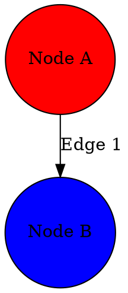

# Graphty Data Loading System - Comprehensive Design

## Executive Summary

This document specifies a comprehensive data loading system for Graphty that supports 20+ popular graph data formats with robust error handling, streaming for large files (100+ MB), and automatic format detection.

**Key Features**:
- ✅ Multi-format support (JSON, GraphML, CSV, GML, GEXF, DOT, Pajek, and more)
- ✅ Streaming architecture for large files
- ✅ Auto-format detection from extension or content
- ✅ Robust error handling with graceful recovery
- ✅ Style preservation from source formats
- ✅ Event-driven progress/error reporting
- ✅ Extensible plugin architecture

**Implementation Estimate**: 12-15 days core development + 7-10 days testing + 3.5-4.5 days documentation = **22-30 days total**

**User Value**: Users can import graph data from 20+ formats without manual conversion, with progress tracking and intelligent error handling.

**Technical Value**: Modular, extensible parser architecture that auto-detects formats, streams large files efficiently, gracefully handles errors, and preserves styling/metadata.

---

## Table of Contents

1. [Overview & Requirements](#1-overview--requirements)
   - [User Value](#user-value)
   - [Requirements](#requirements)
2. [Architecture](#2-architecture)
   - [High-Level Architecture](#high-level-architecture)
   - [Component Responsibilities](#component-responsibilities)
   - [Data Flow](#data-flow)
   - [Design Patterns](#design-patterns-used)
3. [Technical Design](#3-technical-design)
   - [Core Components](#core-components)
   - [Data Models](#data-models)
   - [API Design](#api-design)
   - [Event System](#event-system)
4. [Format Support Matrix](#4-format-support-matrix)
   - [Priority Rankings](#format-priority-rankings)
   - [Detailed Format Comparisons](#detailed-format-comparisons)
   - [Format Selection Guide](#format-selection-guide)
5. [Implementation Plan](#5-implementation-plan)
   - [Phase 1: Core Infrastructure](#phase-1-core-infrastructure-3-4-days)
   - [Phase 2: Essential Parsers](#phase-2-essential-format-parsers-5-6-days)
   - [Phase 3: High Priority Parsers](#phase-3-high-priority-formats-4-5-days)
   - [Phase 4: Additional Formats](#phase-4-additional-formats-as-needed)
   - [Timeline](#critical-path)
6. [Testing Strategy](#6-testing-strategy)
   - [Unit Tests](#unit-tests)
   - [Integration Tests](#integration-tests)
   - [Performance Tests](#performance-tests)
   - [Sample Data](#sample-test-files)
7. [Technical Considerations](#7-technical-considerations)
   - [Performance](#performance)
   - [Security](#security)
   - [Browser Compatibility](#compatibility)
   - [Error Handling](#error-handling-philosophy)
8. [Risks & Mitigation](#8-risks-and-mitigation)
9. [Future Enhancements](#9-future-enhancements)
10. [Acceptance Criteria](#10-acceptance-criteria)
11. [Dependencies](#11-dependencies)
12. [Code Organization](#12-code-organization)
13. [Extension Guide](#13-extension-guide)

---

## 1. Overview & Requirements

### User Value

Users can import graph data from 20+ popular formats without manual conversion, with robust error handling, progress tracking, and support for large files.

### Technical Value

Modular, extensible parser architecture that:
- Auto-detects formats from file extension or content
- Streams large files (100+ MB) without blocking UI
- Gracefully handles errors and continues loading
- Preserves styling/metadata from source formats
- Emits events for UI integration without assumptions
- Follows best practices for performance and security

### Requirements

Based on `design/data-formats.md` and project needs:

1. **Format Support**: Implement parsers for multiple graph data formats prioritized by popularity
2. **Large File Handling**: Support streaming/chunked loading of files up to hundreds of MB with progress updates
3. **Auto-Format Detection**: Detect format from file extension and/or content inspection
4. **Style Preservation**: Extract and apply visual styling information from formats that support it
5. **Metadata Preservation**: Preserve custom node/edge attributes for future calculations
6. **Robust Error Handling**: Gracefully handle and report errors without flooding the UI
7. **Event-Driven Updates**: Emit events for progress, status, and errors (no UI assumptions)
8. **Library Integration**: Leverage existing libraries where appropriate
9. **Best Practices**: Follow streaming, validation, and error recovery patterns

---

## 2. Architecture

### High-Level Architecture

```
┌─────────────────────────────────────────────────────────────┐
│                         User Code                            │
│  graph.loadFromFile(file)                                   │
│  graph.addEventListener('data-loading-progress', handler)    │
└────────────────────────┬────────────────────────────────────┘
                         │
                         ▼
┌─────────────────────────────────────────────────────────────┐
│                   LoaderCoordinator                          │
│  • Orchestrates loading process                             │
│  • Manages progress tracking                                │
│  • Handles cancellation                                     │
└────────────────────────┬────────────────────────────────────┘
                         │
        ┌────────────────┼────────────────┐
        ▼                ▼                ▼
┌──────────────┐  ┌──────────────┐  ┌──────────────┐
│   Format     │  │    Parser    │  │    Error     │
│  Detector    │  │   Registry   │  │ Aggregator   │
│              │  │              │  │              │
│ • Extension  │  │ • Get parser │  │ • Collect    │
│ • Content    │  │   by format  │  │   errors     │
│   sniffing   │  │              │  │ • Dedupe     │
└──────────────┘  └──────┬───────┘  └──────────────┘
                         │
                         ▼
              ┌─────────────────────┐
              │    BaseParser       │
              │  (abstract class)   │
              └──────────┬──────────┘
                         │
        ┌────────────────┼────────────────┬───────────────┐
        ▼                ▼                ▼               ▼
   ┌─────────┐    ┌──────────┐    ┌─────────┐    ┌──────────┐
   │  JSON   │    │ GraphML  │    │   CSV   │    │   GML    │
   │ Parser  │    │  Parser  │    │ Parser  │    │  Parser  │
   └────┬────┘    └────┬─────┘    └────┬────┘    └────┬─────┘
        │              │               │              │
        └──────────────┴───────────────┴──────────────┘
                       │
                       ▼
             ┌──────────────────┐
             │  DataSourceInput │
             │  (File/URL/...)  │
             └──────────────────┘
                       │
                       ▼
          ┌──────────────────────────┐
          │      DataManager         │
          │  • addNodes()            │
          │  • addEdges()            │
          │  • Apply styles          │
          └──────────────────────────┘
```

### Component Responsibilities

#### LoaderCoordinator
**Role**: Orchestrator
- Accepts file/URL/string input
- Detects format (or uses explicit format)
- Gets appropriate parser from registry
- Streams data through parser
- Aggregates errors
- Emits progress/error/completion events
- Manages cancellation

**Why separate from DataManager?**
- DataManager focuses on data operations (CRUD)
- LoaderCoordinator focuses on loading process
- Separation of concerns
- LoaderCoordinator can be tested independently

#### FormatDetector
**Role**: Format Identification
- Checks file extension first (fast path)
- Falls back to content inspection
- Returns detected format or null

**Detection Logic**:
```typescript
detectFormat(data, filename):
  1. If filename provided:
     - Check extension (.graphml, .json, .csv, etc.)
     - If matches, return format

  2. Inspect content:
     - XML: Check namespace (GraphML, GEXF, XGMML, etc.)
     - JSON: Parse and check structure
     - Text: Look for format markers (GML, Pajek, DOT)

  3. Return null if unknown
```

#### ParserRegistry
**Role**: Parser Lookup
- Maps format types to parser classes
- Allows parsers to register themselves
- Provides list of supported formats

**Usage**:
```typescript
// In parser file
ParserRegistry.register(GraphMLParser);

// In coordinator
const ParserClass = ParserRegistry.get('graphml');
const parser = new ParserClass();
```

#### BaseParser (Abstract)
**Role**: Parser Interface
- Defines contract all parsers must follow
- Provides common utilities
- Enforces streaming pattern

**Key Methods**:
```typescript
abstract class BaseParser {
  // Main parsing - yields chunks
  abstract parse(source, options): AsyncGenerator<ParseResult>

  // Validate before full parse
  abstract validate(source): ValidationResult

  // Extract styles (optional)
  extractStyles?(data): StyleExtraction
}
```

**Why async generator?**
- Enables streaming (memory efficient)
- Allows progress reporting
- Can be cancelled
- Consistent interface for all parsers

#### DataSourceInput
**Role**: Input Abstraction
- Hides differences between File, URL, String, ArrayBuffer
- Provides chunked reading interface
- Enables streaming

**Implementations**:
```typescript
FileDataSource         // Read from File object
UrlDataSource          // Fetch from URL (existing)
StringDataSource       // Parse from string
ArrayBufferDataSource  // Parse from binary data
```

#### ErrorAggregator
**Role**: Error Collection & Reporting
- Collects errors during parsing
- Groups similar errors
- Limits error count
- Provides summaries

**Why needed?**
- Files can have hundreds of errors
- Don't want to flood UI with identical errors
- Need to decide when to stop (error limit)
- Need to provide useful summaries

#### StyleExtractor
**Role**: Style Conversion
- Extracts visual properties from format-specific data
- Converts to Graphty style format
- Handles color format variations

**Format-Specific Methods**:
```typescript
extractFromGraphML(yFilesData): NodeStyleConfig
extractFromGEXF(vizData): NodeStyleConfig
extractFromCytoscape(styleData): NodeStyleConfig
normalizeColor(color): string  // "red" → "#FF0000"
```

### Data Flow

#### Loading Sequence

```
1. User initiates load
   graph.loadFromFile(file)

2. LoaderCoordinator receives request
   - Creates DataSourceInput (FileDataSource)
   - Detects format (FormatDetector)
   - Gets parser (ParserRegistry)

3. Parser validates
   - parser.validate(source)
   - Quick check for format correctness

4. Parser streams data
   for await (chunk of parser.parse(source)):
     - Yields {nodes, edges, progress}
     - LoaderCoordinator receives chunk
     - Emits progress event

5. DataManager receives chunk
   - dataManager.addNodes(chunk.nodes)
   - dataManager.addEdges(chunk.edges)
   - Applies styles if extracted

6. Errors handled
   - ErrorAggregator collects errors
   - Emits error events
   - Checks if should abort

7. Loading completes
   - Emits completion event
   - Returns LoadResult
```

#### Parser Implementation Pattern

Each parser follows this pattern:

```typescript
export class FormatParser extends BaseParser {
  formatType = 'format-name';
  supportsStreaming = true;
  supportsStyling = true;

  async *parse(source, options) {
    // 1. Initialize
    const buffer = [];
    const errorAgg = new ErrorAggregator(options.errorLimit);
    let bytesProcessed = 0;

    // 2. Stream input
    for await (const chunk of source.getChunks()) {
      // 3. Parse chunk
      try {
        const items = this.parseChunk(chunk);
        buffer.push(...items);
      } catch (error) {
        if (!errorAgg.addError(error)) {
          throw new Error('Too many errors');
        }
      }

      bytesProcessed += chunk.length;

      // 4. Yield when buffer is full
      if (buffer.length >= options.chunkSize) {
        yield {
          nodes: buffer.splice(0, options.chunkSize),
          edges: [],
          progress: {
            bytesProcessed,
            totalBytes: source.size,
            percentage: (bytesProcessed / source.size) * 100
          }
        };
      }
    }

    // 5. Yield remaining
    if (buffer.length > 0) {
      yield {nodes: buffer, edges: []};
    }
  }

  async validate(source) {
    // Quick validation without full parse
    const sample = await source.getChunk(0, 1024);
    return this.checkStructure(sample);
  }

  extractStyles(data) {
    // Format-specific style extraction
    return this.convertStyles(data);
  }
}
```

### Design Patterns Used

#### 1. Registry Pattern
- `ParserRegistry`: Maps format types to parser classes
- Allows dynamic parser registration
- Supports plugin architecture

#### 2. Strategy Pattern
- Different parsers for different formats
- Common interface, different implementations
- Can swap parsers at runtime

#### 3. Iterator Pattern (Async Generator)
- Parsers yield data in chunks
- Memory-efficient streaming
- Built-in pause/resume support

#### 4. Template Method Pattern
- `BaseParser` defines algorithm structure
- Subclasses implement specific steps
- Common behavior in base class

#### 5. Adapter Pattern
- `DataSourceInput` adapts different sources (File, URL, String)
- Unified interface for parsers
- Hides source-specific details

#### 6. Observer Pattern
- Event system for progress/errors
- Loose coupling between loader and UI
- Multiple listeners possible

---

## 3. Technical Design

### Core Components

#### 1. Format Detection System

**Purpose**: Automatically identify data format from file extension or content

```typescript
// src/data/FormatDetector.ts
export class FormatDetector {
  // Try extension first, then content sniffing
  static detectFormat(
    data: string | ArrayBuffer,
    filename?: string
  ): FormatType | null;

  // Check if format is supported
  static isFormatSupported(format: string): boolean;

  // Get format metadata
  static getFormatInfo(format: FormatType): FormatInfo;
}

interface FormatInfo {
  name: string;
  extensions: string[];
  mimeTypes: string[];
  priority: 'essential' | 'high' | 'medium' | 'low';
  capabilities: {
    streaming: boolean;
    styling: boolean;
    hierarchical: boolean;
    dynamic: boolean;
  };
}
```

**Detection Strategy**:
1. **Extension-based**: Check filename extension against known formats
2. **Content-based**: Inspect file content signatures
   - XML: Look for namespace URIs (GraphML, GEXF, XGMML, etc.)
   - JSON: Parse and check structure (nodes/edges keys, @type, etc.)
   - Text: Look for format-specific markers (GML `graph [`, Pajek `*Vertices`, DOT `digraph`, etc.)

#### 2. Abstract Parser Base Classes

**Purpose**: Define common interface for all parsers with streaming support

```typescript
// src/data/parsers/BaseParser.ts
export abstract class BaseParser {
  abstract readonly formatType: FormatType;
  abstract readonly supportsStreaming: boolean;
  abstract readonly supportsStyling: boolean;

  // Main parsing method - returns async generator for streaming
  abstract parse(
    source: DataSource,
    options: ParseOptions
  ): AsyncGenerator<ParseResult, void, unknown>;

  // Validate file structure before full parsing
  abstract validate(source: DataSource): Promise<ValidationResult>;

  // Extract style information if supported
  abstract extractStyles?(data: unknown): StyleExtraction;
}

interface ParseResult {
  nodes: NodeData[];
  edges: EdgeData[];
  styles?: StyleExtraction;
  metadata?: GraphMetadata;
  progress?: ProgressInfo;
}

interface ParseOptions {
  chunkSize?: number; // For streaming
  errorLimit?: number; // Max errors before aborting
  strictMode?: boolean; // Throw on first error vs continue
  nodeSchema?: z4.$ZodObject; // Optional validation schema
  edgeSchema?: z4.$ZodObject;
}

interface ValidationResult {
  valid: boolean;
  errors: ValidationError[];
  warnings: ValidationWarning[];
  detectedVersion?: string;
}

interface ProgressInfo {
  bytesProcessed: number;
  totalBytes?: number;
  nodesProcessed: number;
  edgesProcessed: number;
  percentage?: number;
}
```

#### 3. Data Source Abstraction

**Purpose**: Unified interface for different input sources (URL, File, String)

```typescript
// src/data/sources/DataSource.ts (extend existing)
export abstract class DataSourceInput {
  abstract readonly size?: number; // Total bytes if known
  abstract readonly supportsStreaming: boolean;

  // Get chunk of data
  abstract getChunk(offset: number, size: number): Promise<ArrayBuffer | string>;

  // Get all data at once (for non-streaming)
  abstract getAll(): Promise<ArrayBuffer | string>;

  // Get readable stream (if supported)
  abstract getStream?(): ReadableStream<Uint8Array>;
}

// Implementations
export class UrlDataSource extends DataSourceInput { }
export class FileDataSource extends DataSourceInput { }
export class StringDataSource extends DataSourceInput { }
export class ArrayBufferDataSource extends DataSourceInput { }
```

#### 4. Parser Registry

**Purpose**: Register and retrieve parsers by format type

```typescript
// src/data/ParserRegistry.ts
export class ParserRegistry {
  private static parsers = new Map<FormatType, typeof BaseParser>();

  static register(parser: typeof BaseParser): void;
  static get(format: FormatType): typeof BaseParser | null;
  static getAll(): Map<FormatType, typeof BaseParser>;
  static getSupportedFormats(): FormatType[];
}
```

#### 5. Error Aggregator

**Purpose**: Collect, deduplicate, and intelligently report errors

```typescript
// src/data/ErrorAggregator.ts
export class ErrorAggregator {
  private errors: ParseError[] = [];
  private errorLimit: number;
  private errorCounts = new Map<string, number>();

  // Add error with deduplication
  addError(error: ParseError): boolean; // Returns false if limit exceeded

  // Get summary of errors
  getSummary(): ErrorSummary;

  // Check if should stop parsing
  shouldAbort(): boolean;

  // Group similar errors
  getGroupedErrors(): GroupedError[];
}

interface ParseError {
  message: string;
  type: 'validation' | 'parsing' | 'schema' | 'missing-data';
  line?: number;
  column?: number;
  nodeId?: NodeIdType;
  edgeId?: string;
  severity: 'error' | 'warning';
  raw?: unknown;
}

interface ErrorSummary {
  totalErrors: number;
  totalWarnings: number;
  errorsByType: Map<string, number>;
  sampleErrors: ParseError[]; // First N errors of each type
  hasTruncated: boolean;
}
```

#### 6. Style Extractor

**Purpose**: Extract visual styling from formats that support it

```typescript
// src/data/StyleExtractor.ts
export class StyleExtractor {
  // Convert format-specific styles to Graphty style config
  static extractFromGraphML(data: GraphMLNode): NodeStyleConfig;
  static extractFromGEXF(data: GEXFNode): NodeStyleConfig;
  static extractFromCytoscape(data: CytoscapeElement): NodeStyleConfig;

  // Merge extracted styles with existing styles
  static mergeStyles(
    extracted: StyleConfig,
    existing: StyleConfig
  ): StyleConfig;

  // Convert color formats (hex, rgb, named colors)
  static normalizeColor(color: string): string;
}
```

#### 7. Loader Coordinator

**Purpose**: Orchestrate the loading process with progress tracking

```typescript
// src/data/LoaderCoordinator.ts
export class LoaderCoordinator {
  constructor(
    private dataManager: DataManager,
    private eventManager: EventManager
  ) {}

  async load(
    source: DataSourceInput,
    options: LoadOptions
  ): Promise<LoadResult>;

  // Cancel ongoing load
  cancel(): void;

  // Pause/resume for memory management
  pause(): void;
  resume(): void;
}

interface LoadOptions {
  format?: FormatType; // Explicit format or auto-detect
  chunkSize?: number;
  errorLimit?: number;
  strictMode?: boolean;
  applyStyles?: boolean;
  nodeIdPath?: string; // Override default ID extraction
  edgeSrcIdPath?: string;
  edgeDstIdPath?: string;
}

interface LoadResult {
  success: boolean;
  nodesLoaded: number;
  edgesLoaded: number;
  format: FormatType;
  errors: ParseError[];
  warnings: ParseError[];
  duration: number; // ms
  stylesApplied?: boolean;
}
```

### Data Models

#### Graph Metadata Structure

```typescript
interface GraphMetadata {
  // Format-specific metadata
  format: FormatType;
  version?: string;

  // Graph properties
  directed?: boolean;
  multigraph?: boolean;

  // Descriptive metadata
  name?: string;
  description?: string;
  creator?: string;
  created?: Date;
  modified?: Date;

  // Custom attributes
  attributes?: Record<string, unknown>;
}
```

#### Node/Edge Data Preservation

```typescript
interface NodeData {
  id: NodeIdType;

  // Visual properties (if extracted)
  x?: number;
  y?: number;
  z?: number;
  size?: number;
  color?: string;
  shape?: string;
  label?: string;

  // All other attributes preserved as metadata
  metadata: Record<string, unknown>;
}

interface EdgeData {
  src: NodeIdType;
  dst: NodeIdType;

  // Visual properties (if extracted)
  weight?: number;
  color?: string;
  width?: number;
  label?: string;
  directed?: boolean;

  // All other attributes preserved as metadata
  metadata: Record<string, unknown>;
}
```

### API Design

#### File Loading API (Extension to Existing DataManager)

```typescript
// Load from URL (existing pattern)
await graph.dataManager.addDataFromSource('graphml', {
  url: 'https://example.com/graph.graphml'
});

// Load from File object (new)
await graph.dataManager.addDataFromFile(file);

// Load with explicit format (new)
await graph.dataManager.addDataFromFile(file, {format: 'gexf'});

// Load from raw data with auto-detection (new)
await graph.dataManager.addDataFromString(rawData, {
  filename: 'graph.graphml' // for format detection
});
```

#### API Examples

##### Basic Usage (Auto-Detection)
```typescript
// User selects file
const file = event.target.files[0];

// Load with auto-detection
await graph.loadFromFile(file);
```

##### Explicit Format
```typescript
// Force specific format
await graph.loadFromFile(file, {format: 'graphml'});
```

##### Progress Tracking
```typescript
graph.addEventListener('data-loading-progress', (event) => {
  progressBar.value = event.percentage;
  statusText.textContent = `Loaded ${event.nodesLoaded} nodes...`;
});

graph.addEventListener('data-loading-complete', (event) => {
  console.log(`Loaded ${event.nodesLoaded} nodes and ${event.edgesLoaded} edges`);
  console.log(`Format: ${event.format}, Duration: ${event.duration}ms`);
  console.log(`Errors: ${event.errors}, Warnings: ${event.warnings}`);
});
```

##### Error Handling
```typescript
graph.addEventListener('data-loading-error', (event) => {
  // Individual error during loading
  console.warn(`Error: ${event.error.message}`);
});

try {
  await graph.loadFromFile(file);
} catch (error) {
  // Fatal error (too many errors or invalid format)
  console.error(`Loading failed: ${error.message}`);
}
```

##### Style Extraction
```typescript
// Load with style extraction
await graph.loadFromFile(file, {
  applyStyles: true // Extract and apply visual styles from file
});
```

##### Custom Field Mapping
```typescript
// Override default ID paths
await graph.loadFromFile(file, {
  nodeIdPath: 'data.identifier', // Instead of 'id'
  edgeSrcIdPath: 'data.source',  // Instead of 'src'
  edgeDstIdPath: 'data.target'   // Instead of 'dst'
});
```

### Event System

#### Event Types

```typescript
// Progress during loading
interface DataLoadingProgressEvent {
  type: 'data-loading-progress';
  loaded: number;      // Bytes loaded
  total?: number;      // Total bytes (if known)
  percentage?: number; // Progress percentage
  format: string;      // Format being loaded
  nodesLoaded: number; // Nodes so far
  edgesLoaded: number; // Edges so far
}

// Error during loading
interface DataLoadingErrorEvent {
  type: 'data-loading-error';
  error: Error;
  context: 'detection' | 'validation' | 'parsing' | 'styling';
  formatType: string;
  errorCount: number;  // Total errors so far
  errorLimit: number;  // Max before aborting
  sample?: ParseError; // Example error
}

// Loading complete
interface DataLoadingCompleteEvent {
  type: 'data-loading-complete';
  nodesLoaded: number;
  edgesLoaded: number;
  format: string;
  duration: number;    // ms
  errors: number;      // Total errors
  warnings: number;    // Total warnings
  success: boolean;
}
```

#### Event Usage

```typescript
// Setup listeners
graph.addEventListener('data-loading-progress', (e) => {
  updateProgressBar(e.percentage);
});

graph.addEventListener('data-loading-error', (e) => {
  logError(e.error);
  if (e.errorCount > 50) {
    showWarning('Many errors detected');
  }
});

graph.addEventListener('data-loading-complete', (e) => {
  if (e.success) {
    showSuccess(`Loaded ${e.nodesLoaded} nodes`);
  } else {
    showError(`Failed with ${e.errors} errors`);
  }
});

// Start loading
await graph.loadFromFile(file);
```

---

## 4. Format Support Matrix

### Format Priority Rankings

Formats ranked by number of tools supporting them:

| Format | Priority | Tools | Complexity | Library | Est. Time |
|--------|----------|-------|------------|---------|-----------|
| JSON | ⭐⭐⭐ Essential | 30+ | Low | Native + streaming | 1-2 days |
| GraphML | ⭐⭐⭐ Essential | 25+ | High | fast-xml-parser | 2 days |
| CSV | ⭐⭐⭐ Essential | 22+ | Medium | papaparse | 1-2 days |
| GML | ⭐⭐ High | 18+ | Low | Custom | 1 day |
| GEXF | ⭐⭐ High | 15+ | Medium | fast-xml-parser | 1.5 days |
| DOT | ⭐⭐ High | 12+ | Medium | Custom/graphlib | 1.5 days |
| Pajek NET | ⭐⭐ High | 14+ | Low | Custom | 1 day |
| GraphSON | ⭐ Medium | 10+ | Medium | Native JSON | 1 day |
| XGMML | ⭐ Medium | 9+ | Medium | fast-xml-parser | 1 day |

### Detailed Format Comparisons

#### JSON Variants

**Popularity**: 30+ tools ⭐⭐⭐

**Variants**:
- D3.js node-link (most common)
- Cytoscape.js (CYJS)
- Sigma.js/Graphology
- Vis.js
- NetworkX
- Generic {nodes, edges}

**Characteristics**:
```
File Size:       Small to Large (1KB - 100MB+)
Parsing Speed:   ⭐⭐⭐⭐⭐ Very Fast
Streaming:       ⭐⭐⭐⭐⭐ Excellent (with @streamparser/json)
Styling:         ⭐⭐⭐⭐ Good (format-dependent)
Metadata:        ⭐⭐⭐⭐⭐ Excellent (arbitrary JSON)
Complexity:      ⭐⭐ Low (JSON parsing)
```

**Strengths**:
- Native browser support
- Easy to read/write
- Flexible structure
- Good libraries
- Common format

**Challenges**:
- Multiple incompatible variants
- No standard schema
- Need to detect variant
- Attribute names vary

**Implementation Priority**: **Phase 2 - Essential**
**Recommended Library**: Native `JSON.parse()` + `@streamparser/json` for streaming

---

#### GraphML

**Popularity**: 25+ tools ⭐⭐⭐

**Standard**: Official spec at http://graphml.graphdrawing.org/

**Characteristics**:
```
File Size:       Small to Large (5KB - 50MB)
Parsing Speed:   ⭐⭐⭐ Good (XML overhead)
Streaming:       ⭐⭐⭐⭐ Good (SAX parsing)
Styling:         ⭐⭐⭐⭐⭐ Excellent (yFiles extension)
Metadata:        ⭐⭐⭐⭐⭐ Excellent (typed attributes)
Complexity:      ⭐⭐⭐⭐⭐ High (XML, extensions, nested graphs)
```

**Strengths**:
- Official standard
- Excellent tool support
- Rich metadata support
- Typed attributes
- Visual properties (yFiles)
- Hierarchical graphs

**Challenges**:
- XML parsing complexity
- Multiple extensions
- Large file size
- Nested graphs support
- Ports and hyperedges (advanced)

**Implementation Priority**: **Phase 2 - Essential**
**Recommended Library**: `fast-xml-parser` with streaming

**Sample Structure**:
```xml
<?xml version="1.0"?>
<graphml xmlns="http://graphml.graphdrawing.org/xmlns">
  <key id="d0" for="node" attr.name="color" attr.type="string"/>
  <graph edgedefault="undirected">
    <node id="n0">
      <data key="d0">green</data>
    </node>
    <edge source="n0" target="n1"/>
  </graph>
</graphml>
```

---

#### CSV / Edge Lists

**Popularity**: 22+ tools ⭐⭐⭐

**Variants**:
- Simple edge list
- Weighted edge list
- Gephi format (separate node/edge files)
- Neo4j import format
- Adjacency list

**Characteristics**:
```
File Size:       Small to Very Large (1KB - 1GB+)
Parsing Speed:   ⭐⭐⭐⭐⭐ Very Fast
Streaming:       ⭐⭐⭐⭐⭐ Excellent
Styling:         ⭐⭐ Limited (Gephi variant)
Metadata:        ⭐⭐⭐ Good (column-based)
Complexity:      ⭐⭐⭐ Medium (format detection, multiple files)
```

**Strengths**:
- Simple format
- Fast parsing
- Excel compatible
- Large file support
- Universal format

**Challenges**:
- Many variants
- No standard
- Limited metadata
- Two-file format (nodes + edges)
- Delimiter ambiguity

**Implementation Priority**: **Phase 2 - Essential**
**Recommended Library**: `papaparse`

**Sample Structures**:
```csv
# Simple edge list
source,target,weight
A,B,1.0
B,C,2.5

# Gephi nodes.csv
Id,Label,Size,Color
1,Node A,10,#FF0000
2,Node B,15,#00FF00

# Gephi edges.csv
Source,Target,Type,Weight
1,2,Undirected,1.0
```

---

#### GML (Graph Modeling Language)

**Popularity**: 18+ tools ⭐⭐

**Standard**: Informal spec from 1996

**Characteristics**:
```
File Size:       Small to Medium (1KB - 10MB)
Parsing Speed:   ⭐⭐⭐⭐ Fast (simple text format)
Streaming:       ⭐⭐⭐ Good (line-based)
Styling:         ⭐⭐⭐⭐ Good (graphics block)
Metadata:        ⭐⭐⭐⭐ Good (hierarchical)
Complexity:      ⭐⭐ Low (simple parser)
```

**Strengths**:
- Human-readable
- Simple syntax
- Visual properties
- Academic standard
- Small files

**Challenges**:
- Integer node IDs only
- Informal spec
- Limited adoption
- No validation

**Implementation Priority**: **Phase 3 - High**
**Recommended Library**: Custom parser (simple enough)

**Sample Structure**:
```gml
graph [
  directed 0
  node [
    id 1
    label "Node A"
    graphics [
      x 100.0
      y 200.0
      fill "#FF0000"
    ]
  ]
  edge [
    source 1
    target 2
    weight 1.5
  ]
]
```

---

#### GEXF

**Popularity**: 15+ tools ⭐⭐

**Standard**: Official spec at https://gexf.net/

**Characteristics**:
```
File Size:       Medium to Large (10KB - 50MB)
Parsing Speed:   ⭐⭐⭐ Good (XML overhead)
Streaming:       ⭐⭐⭐⭐ Good (SAX parsing)
Styling:         ⭐⭐⭐⭐⭐ Excellent (viz namespace)
Metadata:        ⭐⭐⭐⭐⭐ Excellent (typed attributes)
Complexity:      ⭐⭐⭐⭐ Medium-High (XML, dynamic graphs)
```

**Strengths**:
- Gephi native format
- Dynamic networks
- Rich visual properties
- Hierarchical graphs
- Typed attributes

**Challenges**:
- XML complexity
- Multiple versions
- Dynamic time ranges
- Large file size

**Implementation Priority**: **Phase 3 - High**
**Recommended Library**: `fast-xml-parser`

**Sample Structure**:
```xml
<?xml version="1.0"?>
<gexf xmlns="http://gexf.net/1.3" xmlns:viz="http://gexf.net/1.3/viz">
  <graph mode="static">
    <nodes>
      <node id="0" label="Node A">
        <viz:position x="0" y="0" z="0"/>
        <viz:color r="255" g="0" b="0"/>
        <viz:size value="10"/>
      </node>
    </nodes>
    <edges>
      <edge source="0" target="1" weight="1.0"/>
    </edges>
  </graph>
</gexf>
```

---

#### DOT (Graphviz)

**Popularity**: 12+ tools ⭐⭐

**Standard**: Official spec at https://graphviz.org/

**Characteristics**:
```
File Size:       Small to Medium (1KB - 5MB)
Parsing Speed:   ⭐⭐⭐ Good
Streaming:       ⭐⭐⭐ Good (line-based)
Styling:         ⭐⭐⭐⭐⭐ Excellent (200+ attributes)
Metadata:        ⭐⭐⭐⭐ Good (arbitrary attributes)
Complexity:      ⭐⭐⭐⭐ Medium-High (grammar, subgraphs)
```

**Strengths**:
- Graphviz standard
- Rich attributes
- Hierarchical layouts
- HTML labels
- Subgraphs

**Challenges**:
- Complex grammar
- Layout-oriented
- Subgraph semantics
- Parser complexity

**Implementation Priority**: **Phase 3 - High**
**Recommended Library**: `graphlib-dot` or custom

**Sample Structure**:


---

#### Pajek NET

**Popularity**: 14+ tools ⭐⭐

**Standard**: Informal spec from Pajek software

**Characteristics**:
```
File Size:       Small to Medium (1KB - 10MB)
Parsing Speed:   ⭐⭐⭐⭐ Fast (simple text)
Streaming:       ⭐⭐⭐ Good (line-based)
Styling:         ⭐⭐⭐ Good (positions, shapes)
Metadata:        ⭐⭐⭐ Good (section-based)
Complexity:      ⭐⭐ Low (simple sections)
```

**Strengths**:
- Social network standard
- Simple format
- Coordinates included
- Partitions support
- Mixed graphs (arcs + edges)

**Challenges**:
- 1-indexed nodes
- Informal spec
- Limited adoption
- Academic focus

**Implementation Priority**: **Phase 3 - High**
**Recommended Library**: Custom parser

**Sample Structure**:
```
*Vertices 3
1 "Node A" 0.5 0.5 0.5
2 "Node B" 0.3 0.7 0.5
3 "Node C" 0.8 0.4 0.5
*Arcs
1 2 1.0
*Edges
1 3 0.8
```

---

### Format Selection Guide

#### By Use Case

**Web Applications**:
1. JSON (D3.js format) - Native support, fast
2. GraphML - Good interop
3. CSV - Simple, universal

**Desktop Applications**:
1. GraphML - Best interop
2. GEXF - Gephi support
3. GML - Simple files

**Academic/Research**:
1. GML - Classic format
2. Pajek NET - Social networks
3. GraphML - Publications

**Graph Databases**:
1. GraphSON - TinkerPop standard
2. CSV - Bulk import
3. JSON - Application layer

**Visualization**:
1. GEXF - Rich visual properties
2. GraphML - yFiles support
3. DOT - Graphviz layouts

#### By File Size

**Small (< 1MB)**:
- All formats work well
- Prefer simplest (CSV, GML)

**Medium (1-10MB)**:
- JSON (streaming)
- GraphML (SAX parsing)
- CSV (streaming)

**Large (10-100MB)**:
- CSV (best for large files)
- JSON (with streaming parser)
- GraphML (with streaming)

**Very Large (> 100MB)**:
- CSV (simple, fast)
- Consider binary formats (future)

#### By Feature Needs

**Need Visual Properties**:
1. GEXF (viz namespace)
2. GraphML (yFiles)
3. DOT (attributes)

**Need Hierarchical Graphs**:
1. GraphML (nested graphs)
2. GEXF (parent nodes)
3. DOT (subgraphs)

**Need Dynamic Networks**:
1. GEXF (time ranges)
2. Custom JSON format

**Need Maximum Compatibility**:
1. GraphML (25+ tools)
2. JSON (30+ tools, various formats)
3. CSV (22+ tools)

---

## 5. Implementation Plan

### Key Design Decisions

#### 1. Architecture Pattern: Plugin-Based Parsers

**Decision**: Use a registry pattern where each format has its own parser class implementing a common `BaseParser` interface.

**Rationale**:
- Easy to add new formats without modifying existing code
- Each parser can optimize for its format's characteristics
- Supports different streaming strategies per format
- Maintainable and testable

#### 2. Streaming-First Approach

**Decision**: All parsers use async generators to yield data in chunks, even for small files.

**Rationale**:
- Handles large files (100+ MB) without memory issues
- Allows progress reporting during loading
- Prevents UI blocking
- Consistent API across all parsers

#### 3. Error Tolerance by Default

**Decision**: Continue parsing on errors, aggregate them, and report summaries (with strict mode option).

**Rationale**:
- Real-world data often has minor issues
- Better to load 95% of a graph than fail completely
- Prevents error flooding with hundreds of similar errors
- Users can opt into strict mode if needed

#### 4. Format Auto-Detection

**Decision**: Two-stage detection - file extension first, then content inspection.

**Rationale**:
- Fast path for correctly named files
- Fallback for files without extensions
- Better user experience (no manual format selection needed)
- Handles ambiguous cases (e.g., .xml could be GraphML, GEXF, XGMML)

#### 5. Style Extraction as Optional Feature

**Decision**: Parsers can extract styles, but it's optional and configurable.

**Rationale**:
- Not all formats have style information
- Users may prefer their own styles
- Performance optimization (skip extraction if not needed)
- Separation of concerns

#### 6. Event-Driven Progress/Error Reporting

**Decision**: Emit events for all status changes, never assume UI exists.

**Rationale**:
- Web component shouldn't make UI assumptions
- Allows different UI implementations
- Better for testing
- Follows existing Graphty architecture

### Phase 1: Core Infrastructure (3-4 days)

Build the foundation that all parsers depend on:

1. **Format Detection System**
   - Implement `FormatDetector` class
   - Support extension and content-based detection
   - Test with sample files from each format

2. **Base Parser Architecture**
   - Create `BaseParser` abstract class
   - Implement `DataSourceInput` abstraction
   - Create `ParserRegistry`

3. **Error Handling System**
   - Implement `ErrorAggregator`
   - Add error grouping and deduplication
   - Implement error limit checking

4. **Event System Extensions**
   - Add progress events
   - Add error events
   - Add completion events

### Phase 2: Essential Format Parsers (5-6 days)

Implement the most popular formats that 20+ tools support:

1. **JSON Variants Parser** (1-2 days)
   - D3.js node-link format
   - Cytoscape.js (CYJS)
   - Sigma.js/Graphology
   - Vis.js
   - NetworkX node-link
   - Generic {nodes, edges} structure
   - **Library**: Use native JSON parsing with JMESPath for flexibility
   - **Streaming**: Use `@streamparser/json` for large files

2. **GraphML Parser** (2 days)
   - Full spec with typed attributes
   - yFiles extension support (visual properties)
   - Nested graphs (hierarchical)
   - **Library**: `fast-xml-parser` or `sax` for streaming
   - **Styling**: Extract positions, colors, shapes from yFiles namespace

3. **CSV/Edge List Parser** (1-2 days)
   - Simple edge lists
   - Weighted edge lists
   - Separate node+edge files
   - Gephi format
   - **Library**: `papaparse` for robust CSV parsing with streaming
   - **Streaming**: Parse in chunks with configurable size

### Phase 3: High Priority Formats (4-5 days)

Add formats with 12-18 tool support:

4. **GML Parser** (1 day)
   - Basic structure with graphics extensions
   - **Library**: Custom parser (simple key-value format)
   - **Styling**: Extract visual properties from `graphics` blocks

5. **GEXF Parser** (1.5 days)
   - GEXF 1.3 spec
   - viz namespace for visual properties
   - Dynamic networks (optional)
   - **Library**: `fast-xml-parser` with streaming
   - **Styling**: Extract from viz: namespace

6. **DOT (Graphviz) Parser** (1.5 days)
   - Basic graph/digraph support
   - Attribute extraction
   - **Library**: `graphlib-dot` or custom parser
   - **Styling**: Convert DOT attributes to Graphty styles

7. **Pajek NET Parser** (1 day)
   - Vertices, Arcs, Edges sections
   - Coordinate extraction
   - **Library**: Custom parser (line-based format)

### Phase 4: Additional Formats (As Needed)

Implement based on user requests:
- GraphSON (graph databases)
- XGMML (Cytoscape)
- UCINET DL (social networks)
- Specialized formats (BioPAX, SBML, RDF)

### Critical Path

#### Week 1: Foundation + JSON
```
Days 1-2: Core infrastructure
Days 3-4: JSON parser + integration tests
Day 5: Buffer day / catch-up
```

#### Week 2: GraphML + CSV
```
Days 6-7: GraphML parser
Day 8: CSV parser
Days 9-10: Integration testing + bug fixes
```

#### Week 3: Additional Formats
```
Days 11-12: GML + GEXF
Days 13-14: DOT + Pajek
Day 15: Testing + polish
```

#### Week 4: Testing & Documentation
```
Days 16-17: Comprehensive testing
Days 18-19: Documentation + examples
Day 20: Performance optimization + final polish
```

### Key Technical Challenges

#### Challenge 1: GraphML Complexity
**Issue**: GraphML spec is extensive with nested graphs, ports, hyperedges

**Solution**:
- Implement core features first (nodes, edges, attributes)
- Mark advanced features as "future enhancements"
- Use `fast-xml-parser` for reliable parsing
- Extract yFiles namespace for visual properties

#### Challenge 2: CSV Ambiguity
**Issue**: CSV can represent edges, nodes, or adjacency matrices with no standard

**Solution**:
- Detect structure from headers/first rows
- Support common patterns (Gephi, Neo4j, plain edge lists)
- Provide clear error messages for ambiguous files
- Document expected formats

#### Challenge 3: Large File Memory Usage
**Issue**: 100MB+ files could exhaust browser memory

**Solution**:
- Stream everything with async generators
- Yield chunks frequently (every 1000 items)
- Set memory limits and monitor usage
- Provide file size warnings

#### Challenge 4: Error Message Overload
**Issue**: Files with errors in many rows could flood UI with thousands of errors

**Solution**:
- Group similar errors (e.g., "25 nodes missing 'id' field")
- Set error limit (default 100) before aborting
- Show sample errors (first 5 of each type)
- Provide downloadable detailed log

#### Challenge 5: Style Mapping
**Issue**: Each format has different style conventions

**Solution**:
- Create `StyleExtractor` with format-specific methods
- Map to Graphty's style system
- Handle color format variations (hex, rgb, names)
- Make style extraction optional (performance)

### Streaming Implementation Details

#### Large File Strategy

```typescript
// Example streaming parser for GraphML
export class GraphMLParser extends BaseParser {
  async *parse(source: DataSourceInput, options: ParseOptions) {
    const parser = new SAXParser();
    const nodeBuffer: NodeData[] = [];
    const edgeBuffer: EdgeData[] = [];
    const BUFFER_SIZE = options.chunkSize || 1000;

    let bytesProcessed = 0;
    const totalBytes = source.size;

    // Stream data in chunks
    for await (const chunk of source.getChunks()) {
      parser.write(chunk);
      bytesProcessed += chunk.length;

      // Collect nodes and edges from parser events
      // ... parser event handling ...

      // Yield when buffer is full
      if (nodeBuffer.length >= BUFFER_SIZE || edgeBuffer.length >= BUFFER_SIZE) {
        yield {
          nodes: nodeBuffer.splice(0, BUFFER_SIZE),
          edges: edgeBuffer.splice(0, BUFFER_SIZE),
          progress: {
            bytesProcessed,
            totalBytes,
            percentage: totalBytes ? (bytesProcessed / totalBytes) * 100 : undefined
          }
        };
      }
    }

    // Yield remaining data
    if (nodeBuffer.length > 0 || edgeBuffer.length > 0) {
      yield {
        nodes: nodeBuffer,
        edges: edgeBuffer,
        progress: {
          bytesProcessed,
          totalBytes,
          percentage: 100
        }
      };
    }
  }
}
```

#### Memory Management

- **Chunk Size**: Default 1000 nodes/edges per chunk, configurable
- **Backpressure**: Pause parsing if downstream processing is slow
- **Buffer Limits**: Maximum buffer size to prevent memory exhaustion
- **Streaming Libraries**: Use streaming parsers (SAX for XML, streaming JSON for JSON)

---

## 6. Testing Strategy

### Unit Tests

Unit tests should cover 80%+ of code:

```typescript
describe('FormatDetector', () => {
  test('detects GraphML from extension', () => {
    expect(FormatDetector.detectFormat(data, 'graph.graphml'))
      .toBe('graphml');
  });

  test('detects GraphML from XML content', () => {
    const xml = '<?xml...xmlns="http://graphml.graphdrawing.org"...>';
    expect(FormatDetector.detectFormat(xml)).toBe('graphml');
  });
});

describe('GraphMLParser', () => {
  test('parses basic graph', async () => {
    const parser = new GraphMLParser();
    const chunks = [];
    for await (const chunk of parser.parse(source, options)) {
      chunks.push(chunk);
    }
    expect(chunks[0].nodes).toHaveLength(34); // karate.graphml
  });

  test('handles missing node IDs', async () => {
    // Test error recovery
  });
});
```

### Integration Tests

Test end-to-end loading with real files:

```typescript
describe('LoaderCoordinator', () => {
  test('loads real GraphML file with progress events', async () => {
    const events = [];
    graph.addEventListener('data-loading-progress', e => events.push(e));

    await coordinator.load(fileSource, {format: 'graphml'});

    expect(events.length).toBeGreaterThan(0);
    expect(graph.nodes.size).toBe(34);
  });

  test('recovers from corrupted file', async () => {
    const result = await coordinator.load(corruptedFile);
    expect(result.errors.length).toBeGreaterThan(0);
    expect(result.nodesLoaded).toBeGreaterThan(0); // Partial load
  });
});
```

### Performance Tests

Benchmark parsing speed and memory usage:

```typescript
describe('Performance', () => {
  test('parses 10K nodes in under 2 seconds', async () => {
    const start = Date.now();
    await coordinator.load(largeJsonFile);
    const duration = Date.now() - start;
    expect(duration).toBeLessThan(2000);
  });

  test('uses less than 200MB for 100MB file', async () => {
    // Memory usage test
  });
});
```

### Sample Test Files

Collect sample files for testing:

```
test/data/formats/
├── json/
│   ├── d3-miserables.json (50KB, 77 nodes)
│   ├── cytoscape-simple.json (10KB, 20 nodes)
│   └── large-network.json (50MB, 100K nodes)
├── graphml/
│   ├── karate.graphml (8KB, 34 nodes)
│   ├── got-network.graphml (50KB, 100 nodes)
│   └── yfiles-styled.graphml (20KB, 50 nodes)
├── csv/
│   ├── simple-edges.csv (5KB)
│   ├── nodes.csv + edges.csv (10KB)
│   └── gephi-format/ (nodes.csv + edges.csv)
├── gml/
│   ├── karate.gml (3KB, 34 nodes)
│   └── dolphins.gml (5KB, 62 nodes)
├── gexf/
│   ├── lesmiserables.gexf (50KB, 77 nodes)
│   └── dynamic-network.gexf (30KB)
└── corrupted/
    ├── missing-nodes.json
    ├── invalid-xml.graphml
    └── malformed-csv.csv
```

### Testing Priorities

#### Critical Tests (Phase 2)
- JSON: D3 format with 10K+ nodes
- GraphML: yFiles extensions, nested graphs
- CSV: Two-file Gephi format, large files

#### Important Tests (Phase 3)
- GML: Graphics blocks
- GEXF: viz namespace, dynamic graphs
- DOT: Subgraphs, attributes

#### Lower Priority Tests (Phase 4+)
- GraphSON: Version variants
- Pajek: Partitions, matrices
- Other specialized formats

---

## 7. Technical Considerations

### Performance

#### Impact
- Large file parsing could block main thread
- Memory usage could grow with large datasets
- Style extraction adds processing overhead

#### Mitigation
- Use streaming parsers (SAX, streaming JSON)
- Process data in chunks with yields
- Use Web Workers for parsing (future enhancement)
- Implement backpressure to control memory
- Make style extraction optional

#### Memory Management
- **Streaming**: Parse in chunks, don't load entire file
- **Buffer Limits**: Max buffer size prevents unbounded growth
- **Chunk Size**: Tunable (default 1000 items)
- **Early Yield**: Yield data frequently to free memory

#### CPU Optimization
- **Fast Path**: Extension detection before content inspection
- **Lazy Parsing**: Only parse what's needed
- **Validation First**: Quick validation before full parse
- **Selective Style Extraction**: Optional, skip if not needed

#### Network Optimization
- **Streaming Fetch**: Use fetch() streaming for URLs
- **Range Requests**: Fetch chunks on-demand (future)
- **Compression**: Support .gz files (future)

### Security

#### Considerations
- Untrusted file content could exploit parser vulnerabilities
- XXE attacks in XML parsers
- Memory exhaustion from malicious files

#### Measures
- Use well-maintained parsing libraries
- Disable external entity resolution in XML parsers
- Set strict file size limits (default 500MB)
- Validate structure before full parsing
- Set timeout limits for parsing operations
- Sanitize extracted styles before applying

### Compatibility

#### Backward Compatibility
- Existing `addDataFromSource('json', opts)` API remains unchanged
- New APIs are additions, not breaking changes
- Event names use new namespaced names (`data-loading-progress` vs `data-loaded`)

#### Browser Compatibility
- File API: All modern browsers
- Streaming: Use polyfills for older browsers if needed
- ArrayBuffer: Universally supported

### Error Handling Philosophy

#### Principles
1. **Fail gracefully**: Don't crash on malformed data
2. **Continue when possible**: Load what's valid
3. **Report clearly**: Tell user what went wrong
4. **Limit noise**: Group similar errors
5. **Provide options**: Strict mode for validation

#### Error Categories
- **Fatal**: Cannot continue (invalid format, missing file)
- **Validation**: Data doesn't match schema (missing ID)
- **Parsing**: Syntax error (malformed XML)
- **Warning**: Recoverable issue (missing optional field)

#### Error Limits
- **Default limit**: 100 errors before aborting
- **Rationale**: Prevent runaway parsing of garbage data
- **Configurable**: Can be increased if needed
- **Grouped**: Similar errors count as one group

#### Error Recovery Approach

1. **Continue on Error**: Default mode - log error, skip invalid item, continue parsing
2. **Strict Mode**: Optional - throw on first error
3. **Error Limits**: Stop after N errors (default 100)
4. **Error Deduplication**: Group similar errors to avoid flooding

#### Error Reporting

```typescript
// Example error handling in parser
try {
  const nodeId = extractNodeId(nodeData);
  // ... process node ...
} catch (error) {
  const parseError: ParseError = {
    message: `Failed to parse node: ${error.message}`,
    type: 'parsing',
    line: currentLine,
    nodeId: attemptedNodeId,
    severity: 'error',
    raw: nodeData
  };

  if (!errorAggregator.addError(parseError)) {
    // Error limit exceeded
    throw new Error(`Too many errors (>${errorLimit}), aborting parse`);
  }

  // Continue with next node
  continue;
}
```

#### User-Facing Error Messages

- **Summary**: "Loaded 950 of 1000 nodes (50 errors)"
- **Grouped Errors**: "Missing 'id' field in 23 nodes"
- **Sample Details**: Show first 5 errors of each type with context
- **Downloadable Log**: For detailed error analysis

---

## 8. Risks and Mitigation

### Risk: Parser Complexity
**Potential Issue**: Some formats (BioPAX, SBML) are extremely complex

**Mitigation**:
- Start with essential formats only
- Use existing libraries where available
- Document limitations for complex formats
- Consider "partial support" approach

### Risk: Library Dependencies
**Potential Issue**: Parser libraries may have vulnerabilities or become unmaintained

**Mitigation**:
- Prefer well-maintained libraries with active communities
- Keep dependencies minimal and up-to-date
- Have fallback/alternative libraries identified
- Consider custom parsers for simple formats

### Risk: Format Variations
**Potential Issue**: Same format has different dialects or versions

**Mitigation**:
- Support most common version first
- Add version detection in validation
- Document supported versions clearly
- Provide helpful error messages for unsupported variants

### Risk: Memory Exhaustion
**Potential Issue**: Very large files or memory leaks could crash browser

**Mitigation**:
- Implement strict memory limits
- Use streaming everywhere possible
- Add memory monitoring
- Provide file size warnings to users
- Test with extremely large files

### Risk: Browser Compatibility
**Potential Issue**: Streaming APIs may not work in all browsers

**Mitigation**:
- Feature detection for streaming support
- Fallback to non-streaming for older browsers
- Document browser requirements
- Provide polyfills where feasible

---

## 9. Future Enhancements

### Phase 5+: Advanced Features

1. **Web Worker Parsing**: Move parsing to background thread
   ```typescript
   // In coordinator
   const worker = new Worker('parser.worker.js');
   worker.postMessage({file, format});
   worker.onmessage = (event) => {
     // Receive parsed chunks
   };
   ```

2. **IndexedDB Caching**: Cache parsed graphs locally

3. **Incremental Loading**: Load visible portion first, rest on-demand

4. **Compression Support**: Handle .gz, .zip, .bz2 compressed files
   ```typescript
   const decompressor = new DecompressionStream('gzip');
   const stream = file.stream().pipeThrough(decompressor);
   ```

5. **Binary Formats**: Support efficient binary graph formats

6. **Schema Validation**: Comprehensive validation with JSON Schema

7. **Network Import**: Load from graph databases via REST APIs

8. **Collaborative Loading**: Share loading across tabs/windows

9. **Smart Chunking**: Adaptive chunk size based on performance
    ```typescript
    if (parsingTooSlow) {
      chunkSize *= 0.5;  // Smaller chunks
    } else if (parsingTooFast) {
      chunkSize *= 2;    // Larger chunks
    }
    ```

### Export/Save Functionality (Major Enhancement)

**Overview**: Add bidirectional data format support, enabling users to export/save graphs in multiple formats. This mirrors the import architecture with serializers instead of parsers.

**Estimated Effort**: 13-19 days (roughly equal to import system)
- Core Export Infrastructure: 2-3 days
- Essential Serializers (JSON, GraphML, CSV): 4-5 days
- High Priority Serializers (GML, GEXF, DOT, Pajek): 3-4 days
- Capability Checking System: 1-2 days
- Round-trip Testing: 2-3 days
- Documentation: 1-2 days

#### 1. Symmetrical Serializer Architecture

Mirror the parser architecture for consistency:

```typescript
// New: BaseSerializer (mirrors BaseParser)
export abstract class BaseSerializer {
  abstract readonly formatType: FormatType;
  abstract readonly supportsStreaming: boolean;

  // Main serialization - yields chunks for streaming
  abstract serialize(
    graph: Graph,
    options: SerializeOptions
  ): AsyncGenerator<SerializeChunk, void, unknown>;

  // Validate graph can be exported to this format
  abstract validate(graph: Graph): ValidationResult;

  // Check for feature loss warnings
  abstract checkCompatibility(graph: Graph): CompatibilityReport;
}

// New: SerializerRegistry (mirrors ParserRegistry)
export class SerializerRegistry {
  private static serializers = new Map<FormatType, typeof BaseSerializer>();
  static register(serializer: typeof BaseSerializer): void;
  static get(format: FormatType): typeof BaseSerializer | null;
  static getSupportedFormats(): FormatType[];
}
```

**Example Serializer**:
```typescript
export class GraphMLSerializer extends BaseSerializer {
  formatType = 'graphml';
  supportsStreaming = true;

  async *serialize(graph: Graph, options: SerializeOptions) {
    // Yield header
    yield '<?xml version="1.0"?>\n<graphml xmlns="...">\n';

    // Yield key definitions
    yield this.generateKeyDefinitions(graph);

    yield '<graph>\n';

    // Stream nodes in chunks
    const nodeIterator = graph.nodes.values();
    let nodeBuffer = '';
    let count = 0;

    for (const node of nodeIterator) {
      nodeBuffer += this.serializeNode(node);
      count++;

      // Yield chunk every 1000 nodes
      if (count % 1000 === 0) {
        yield nodeBuffer;
        nodeBuffer = '';
        this.emitProgress(count, graph.nodes.size);
      }
    }

    if (nodeBuffer) yield nodeBuffer;

    // Stream edges similarly...

    yield '</graph>\n</graphml>';
  }
}
```

#### 2. Bidirectional Style Mapping

Current `StyleExtractor` only goes format → Graphty. Need reverse:

```typescript
// Replace StyleExtractor with bidirectional StyleMapper
export class StyleMapper {
  // Import (existing functionality)
  static fromGraphML(data: GraphMLNode): NodeStyleConfig;
  static fromGEXF(data: GEXFNode): NodeStyleConfig;
  static fromCytoscape(data: CytoscapeElement): NodeStyleConfig;

  // Export (new functionality)
  static toGraphML(style: NodeStyleConfig): GraphMLStyle;
  static toGEXF(style: NodeStyleConfig): GEXFVizStyle;
  static toCytoscape(style: NodeStyleConfig): CytoscapeStyle;
  static toDOT(style: NodeStyleConfig): DOTAttributes;
  static toGML(style: NodeStyleConfig): GMLGraphics;

  // Color format conversions
  static normalizeColor(color: string): string;
  static colorToRGB(color: string): {r: number, g: number, b: number};
  static colorToHex(color: string): string;
}
```

#### 3. Format Capability Matrix

**Critical for preventing silent data loss**. Not all formats support all features:

```typescript
interface FormatCapabilities {
  supports3D: boolean;           // Can store 3D positions?
  supportsStyles: boolean;        // Can store visual styles?
  supportsMetadata: boolean;      // Can store arbitrary attributes?
  supportsHierarchical: boolean;  // Can store nested graphs?
  supportsDynamic: boolean;       // Can store time-based data?
  supportsDirected: boolean;      // Supports directed edges?
  supportsMultigraph: boolean;    // Multiple edges between nodes?
  supportsWeights: boolean;       // Edge weights?
  maxNodeIdType: 'string' | 'number' | 'any';
}

export class FormatCapabilityChecker {
  static check(
    graph: Graph,
    targetFormat: FormatType
  ): CompatibilityReport {
    const capabilities = this.getCapabilities(targetFormat);
    const warnings: string[] = [];
    const errors: string[] = [];

    // Check for feature loss
    if (graph.is3D && !capabilities.supports3D) {
      warnings.push('Z-coordinates will be lost (format only supports 2D)');
    }

    if (graph.hasCustomStyles && !capabilities.supportsStyles) {
      warnings.push('Custom styles will be lost');
    }

    if (graph.hasMetadata && !capabilities.supportsMetadata) {
      warnings.push('Custom node/edge attributes will be lost');
    }

    // Check for blockers
    if (graph.hasStringIds && capabilities.maxNodeIdType === 'number') {
      errors.push('Format only supports numeric node IDs, but graph has string IDs');
    }

    return {
      warnings,
      errors,
      canExport: errors.length === 0,
      willLoseData: warnings.length > 0
    };
  }

  static getCapabilities(format: FormatType): FormatCapabilities {
    // Define capabilities for each format
    const capabilities: Record<FormatType, FormatCapabilities> = {
      'graphml': {
        supports3D: true,
        supportsStyles: true,  // via yFiles extension
        supportsMetadata: true,
        supportsHierarchical: true,
        supportsDynamic: false,
        supportsDirected: true,
        supportsMultigraph: true,
        supportsWeights: true,
        maxNodeIdType: 'any'
      },
      'gexf': {
        supports3D: true,
        supportsStyles: true,  // via viz namespace
        supportsMetadata: true,
        supportsHierarchical: true,
        supportsDynamic: true,  // time ranges
        supportsDirected: true,
        supportsMultigraph: false,
        supportsWeights: true,
        maxNodeIdType: 'any'
      },
      'gml': {
        supports3D: false,     // Only 2D
        supportsStyles: true,  // graphics block
        supportsMetadata: true,
        supportsHierarchical: false,
        supportsDynamic: false,
        supportsDirected: true,
        supportsMultigraph: false,
        supportsWeights: true,
        maxNodeIdType: 'number' // Only integer IDs
      },
      'csv': {
        supports3D: false,     // Typically 2D only
        supportsStyles: false, // Limited in Gephi variant
        supportsMetadata: true, // Column-based
        supportsHierarchical: false,
        supportsDynamic: false,
        supportsDirected: true,
        supportsMultigraph: false,
        supportsWeights: true,
        maxNodeIdType: 'any'
      },
      // ... other formats
    };

    return capabilities[format];
  }
}
```

**Usage Example**:
```typescript
// Before exporting, check compatibility
const report = FormatCapabilityChecker.check(graph, 'gml');

if (report.errors.length > 0) {
  throw new Error(`Cannot export to GML: ${report.errors.join(', ')}`);
}

if (report.warnings.length > 0) {
  const proceed = await confirmWithUser(
    `Warning: ${report.warnings.join(', ')}. Continue anyway?`
  );
  if (!proceed) return;
}

await graph.exportToFile('output.gml');
```

#### 4. Export API Design

Add export methods to Graph class:

```typescript
export class Graph {
  // Simple export - auto-detect format from extension
  async exportToFile(filename: string): Promise<void>;

  // Explicit format with options
  async exportToFile(filename: string, options: ExportOptions): Promise<void>;

  // Get as string (for download or clipboard)
  async exportToString(format: FormatType, options?: ExportOptions): Promise<string>;

  // Streaming export (for very large graphs)
  async *exportStream(
    format: FormatType,
    options?: ExportOptions
  ): AsyncGenerator<string | ArrayBuffer, void, unknown>;

  // Get as Blob (for download)
  async exportToBlob(format: FormatType, options?: ExportOptions): Promise<Blob>;
}

interface ExportOptions {
  format?: FormatType;           // Explicit format (overrides filename)
  includeStyles?: boolean;        // Include visual styles (default: true)
  includeMetadata?: boolean;      // Include custom attributes (default: true)
  includeLayout?: boolean;        // Include positions (default: true)
  prettyPrint?: boolean;          // Format output (default: false)
  indentSize?: number;            // Spaces for indentation (default: 2)
  variant?: string;               // Format variant (e.g., 'cytoscape' for JSON)
  validate?: boolean;             // Validate before export (default: true)
  onCompatibilityWarning?: (warnings: string[]) => Promise<boolean>; // Return false to cancel
}
```

**API Examples**:
```typescript
// Simple export
await graph.exportToFile('my-graph.graphml');

// Export with options
await graph.exportToFile('my-graph.json', {
  variant: 'cytoscape',
  prettyPrint: true
});

// Get as string for download
const graphmlString = await graph.exportToString('graphml', {
  prettyPrint: true,
  includeStyles: true
});
downloadFile(graphmlString, 'graph.graphml');

// Streaming export for large graphs
const blob = await graph.exportToBlob('csv');
saveAs(blob, 'large-graph.csv');
```

#### 5. Data Target Abstraction

Mirror DataSourceInput with DataTargetOutput:

```typescript
// New: Output abstraction (mirrors DataSourceInput)
export abstract class DataTargetOutput {
  abstract write(chunk: string | ArrayBuffer): Promise<void>;
  abstract finalize(): Promise<void>;
  abstract readonly estimatedSize?: number;
}

// Implementations
export class FileTargetOutput extends DataTargetOutput {
  constructor(private filename: string) { super(); }
  // Use FileSystem API or download trigger
}

export class StringTargetOutput extends DataTargetOutput {
  private chunks: string[] = [];
  async write(chunk: string) { this.chunks.push(chunk); }
  async finalize() { return this.chunks.join(''); }
}

export class BlobTargetOutput extends DataTargetOutput {
  private chunks: Blob[] = [];
  async write(chunk: string | ArrayBuffer) {
    this.chunks.push(new Blob([chunk]));
  }
  async finalize() { return new Blob(this.chunks); }
}

export class StreamTargetOutput extends DataTargetOutput {
  constructor(private writableStream: WritableStream) { super(); }
  // Pipe chunks to stream
}
```

#### 6. Export Events

Mirror import events:

```typescript
interface DataExportProgressEvent {
  type: 'data-export-progress';
  written: number;           // Bytes written
  total?: number;            // Total bytes (estimated)
  percentage?: number;       // Progress percentage
  format: string;            // Format being exported
  nodesWritten: number;      // Nodes serialized so far
  edgesWritten: number;      // Edges serialized so far
}

interface DataExportCompleteEvent {
  type: 'data-export-complete';
  nodesExported: number;
  edgesExported: number;
  format: string;
  sizeBytes: number;
  duration: number;          // ms
  warnings: string[];        // Feature loss warnings
  success: boolean;
}

interface DataExportErrorEvent {
  type: 'data-export-error';
  error: Error;
  context: 'validation' | 'serialization' | 'compatibility';
  formatType: string;
}
```

**Usage**:
```typescript
graph.addEventListener('data-export-progress', (e) => {
  progressBar.value = e.percentage;
  statusText.textContent = `Exported ${e.nodesWritten} nodes...`;
});

graph.addEventListener('data-export-complete', (e) => {
  if (e.warnings.length > 0) {
    showWarning(`Export complete with warnings: ${e.warnings.join(', ')}`);
  } else {
    showSuccess(`Exported ${e.nodesExported} nodes and ${e.edgesExported} edges`);
  }
});
```

#### 7. Enhanced FormatInfo

Update FormatInfo to include export capabilities:

```typescript
interface FormatInfo {
  name: string;
  extensions: string[];
  mimeTypes: string[];
  priority: 'essential' | 'high' | 'medium' | 'low';

  // Import capabilities (existing)
  importCapabilities: {
    streaming: boolean;
    styling: boolean;
    hierarchical: boolean;
    dynamic: boolean;
  };

  // Export capabilities (new)
  exportCapabilities: {
    streaming: boolean;
    supports3D: boolean;
    supportsStyles: boolean;
    supportsMetadata: boolean;
    supportsHierarchical: boolean;
    supportsDynamic: boolean;
    maxNodeIdType: 'string' | 'number' | 'any';
  };
}

// Enhanced FormatDetector
export class FormatDetector {
  // Existing methods...

  // New: Get recommended format for export
  static recommendExportFormat(graph: Graph): FormatType {
    // Recommend based on graph characteristics
    if (graph.is3D && graph.hasStyles && graph.hasDynamicData) {
      return 'gexf'; // Best for dynamic 3D graphs with styles
    }
    if (graph.is3D && graph.hasStyles) {
      return 'graphml'; // Best all-around for styled 3D graphs
    }
    if (graph.nodes.size > 1000000) {
      return 'csv'; // Most efficient for very large graphs
    }
    if (graph.hasHierarchy) {
      return 'graphml'; // Supports nested graphs
    }
    return 'graphml'; // Default: best compatibility
  }
}
```

#### 8. Round-Trip Testing

**Critical**: Ensure import → export → import produces identical graph:

```typescript
describe('Round-trip tests', () => {
  test('GraphML: import → export → import preserves all data', async () => {
    // 1. Load original
    await graph.loadFromFile('karate.graphml');
    const originalNodes = captureNodeData(graph);
    const originalEdges = captureEdgeData(graph);
    const originalStyles = captureStyles(graph);

    // 2. Export
    const exported = await graph.exportToString('graphml', {
      includeStyles: true,
      includeMetadata: true
    });

    // 3. Clear and reload
    graph.clear();
    await graph.loadFromString(exported, {format: 'graphml'});

    // 4. Verify identical
    expect(graph.nodes.size).toBe(originalNodes.length);
    expect(graph.edges.size).toBe(originalEdges.length);
    expectNodesEqual(captureNodeData(graph), originalNodes);
    expectEdgesEqual(captureEdgeData(graph), originalEdges);
    expectStylesEqual(captureStyles(graph), originalStyles);
  });

  test('CSV: warns about style loss', async () => {
    // Graph with styles
    await graph.loadFromFile('styled-network.graphml');

    const warnings = [];
    await graph.exportToString('csv', {
      onCompatibilityWarning: async (w) => {
        warnings.push(...w);
        return true; // continue
      }
    });

    expect(warnings).toContain('Custom styles will be lost');
  });

  test('GML: errors on string IDs', async () => {
    // Graph with string IDs
    graph.addNode({id: 'node-a', label: 'A'});
    graph.addNode({id: 'node-b', label: 'B'});

    await expect(
      graph.exportToString('gml')
    ).rejects.toThrow('Format only supports numeric node IDs');
  });

  test('All formats: large graph round-trip', async () => {
    // Test with 10K nodes
    await graph.loadFromFile('large-network.json');

    for (const format of ['json', 'graphml', 'csv', 'gml', 'gexf']) {
      const exported = await graph.exportToString(format);

      graph.clear();
      await graph.loadFromString(exported, {format});

      expect(graph.nodes.size).toBe(10000);
      // Verify basic structure preserved
    }
  });
});
```

#### 9. Code Organization Changes

```
src/data/
├── DataSource.ts (existing)
├── LoaderCoordinator.ts (existing)
├── ExporterCoordinator.ts (new)
├── FormatDetector.ts (existing, enhanced)
├── ParserRegistry.ts (existing)
├── SerializerRegistry.ts (new)
├── ErrorAggregator.ts (existing, reused)
├── StyleMapper.ts (new - replaces StyleExtractor, bidirectional)
├── FormatCapabilities.ts (new)
├── sources/
│   ├── DataSourceInput.ts (existing)
│   └── ... existing source classes
├── targets/ (new)
│   ├── DataTargetOutput.ts (new - abstract base)
│   ├── FileTargetOutput.ts (new)
│   ├── StringTargetOutput.ts (new)
│   ├── BlobTargetOutput.ts (new)
│   └── StreamTargetOutput.ts (new)
├── parsers/
│   ├── BaseParser.ts (existing)
│   └── ... existing parsers
└── serializers/ (new)
    ├── BaseSerializer.ts (new - mirrors BaseParser)
    ├── JsonSerializer.ts (new)
    ├── GraphMLSerializer.ts (new)
    ├── CSVSerializer.ts (new)
    ├── GMLSerializer.ts (new)
    ├── GEXFSerializer.ts (new)
    ├── DOTSerializer.ts (new)
    └── PajekSerializer.ts (new)
```

#### 10. Key Benefits

1. **Symmetry**: Export mirrors import architecture (easy to understand)
2. **Safety**: Capability checking prevents silent data loss
3. **Streaming**: Large graphs can be exported without memory issues
4. **Reuse**: Same registries, error handling, event patterns
5. **Testing**: Round-trip tests ensure format fidelity
6. **Extensibility**: Adding export for new format is just another serializer
7. **User-Friendly**: Auto-detection, warnings, progress tracking

#### 11. Critical Success Factors

**Must Have**:
- ✅ Capability checking to warn about feature loss
- ✅ Round-trip testing for all formats
- ✅ Streaming for large graphs (100K+ nodes)
- ✅ Progress events for long exports
- ✅ Validation before serialization

**Nice to Have**:
- Format conversion workflows (import JSON → export GraphML)
- Batch export (multiple formats at once)
- Export templates (pre-configured options)
- Format optimization suggestions

**Documentation Needs**:
- Export API guide
- Format capability matrix
- Round-trip compatibility guide
- How to add custom serializers

### Additional Format Support

Based on user demand:
- Matrix formats (Matrix Market, adjacency matrices)
- Database formats (Neo4j, ArangoDB exports)
- Specialized formats (BioPAX, SBML, RDF/Turtle)
- Binary formats (Gryo, graph-tool binary)

### Advanced Error Handling

- **Error Recovery Strategies**: Attempt to fix common errors automatically
- **Validation Suggestions**: Suggest fixes for common issues
- **Partial Load Mode**: Load what's valid, report what's not
- **Error Export**: Download detailed error report for debugging

---

## 10. Acceptance Criteria

### Functional Requirements

- [ ] Support loading from File objects, URLs, and raw strings
- [ ] Auto-detect format from file extension and content
- [ ] Parse at least 5 essential formats (JSON, GraphML, CSV, GML, GEXF)
- [ ] Stream large files (100+ MB) without blocking UI
- [ ] Extract and apply visual styles from supported formats
- [ ] Preserve all node/edge metadata attributes
- [ ] Handle up to 100 errors gracefully before aborting
- [ ] Emit progress events at least every 5% of file loaded
- [ ] Emit error events with context and details
- [ ] Emit completion event with summary statistics

### Performance Requirements

- [ ] Parse 10,000 nodes in under 2 seconds (JSON)
- [ ] Parse 100MB file with progress updates every 1 second
- [ ] Use no more than 200MB memory for 100MB file
- [ ] Support cancellation within 100ms

### Code Quality Requirements

- [ ] 80%+ test coverage for parsers
- [ ] Integration tests with real sample files
- [ ] Unit tests for error handling paths
- [ ] Documentation for adding new parsers
- [ ] Type-safe parser interfaces

### Success Metrics

#### Functional Metrics
- ✅ 5+ formats supported (JSON, GraphML, CSV, GML, GEXF)
- ✅ Auto-detection accuracy > 95%
- ✅ Error recovery rate > 90% (can load most valid data even with errors)

#### Performance Metrics
- ✅ 10K nodes in < 2 seconds
- ✅ 100MB file with < 200MB memory usage
- ✅ Progress updates every 1 second for large files

#### Code Quality Metrics
- ✅ 80%+ test coverage
- ✅ All parsers have integration tests with real files
- ✅ Zero eslint errors
- ✅ Full TypeScript strict mode compliance

#### User Experience Metrics
- ✅ No format selection needed for common files
- ✅ Meaningful error messages
- ✅ No UI blocking during large file loads
- ✅ Clear progress indication

---

## 11. Dependencies

### Required Libraries

```json
{
  "dependencies": {
    "fast-xml-parser": "^4.3.0",      // XML parsing (GraphML, GEXF, XGMML)
    "papaparse": "^5.4.0",             // CSV parsing
    "@streamparser/json": "^0.0.19"   // Streaming JSON for large files
  }
}
```

### Optional Libraries (Phase 3+)

```json
{
  "dependencies": {
    "graphlib-dot": "^0.6.4"  // DOT parsing (if we use it)
  }
}
```

### Library Recommendations Summary

| Format | Recommended Library | Reason |
|--------|-------------------|---------|
| JSON | `@streamparser/json` | Streaming support, handles large files |
| GraphML | `fast-xml-parser` | Fast, streaming, well-maintained |
| CSV | `papaparse` | Robust, streaming, handles edge cases |
| GML | Custom parser | Simple format, no library needed |
| GEXF | `fast-xml-parser` | Same as GraphML, consistent approach |
| DOT | Custom parser | Simple enough, avoid heavy dependency |
| Pajek | Custom parser | Simple line-based format |
| GraphSON | Native `JSON.parse()` | Just JSON with structure |
| XGMML | `fast-xml-parser` | XML, similar to GraphML |

---

## 12. Code Organization

```
src/data/
├── DataSource.ts (existing - base class)
├── JsonDataSource.ts (existing)
├── LoaderCoordinator.ts (new - orchestrates loading)
├── FormatDetector.ts (new - format detection)
├── ParserRegistry.ts (new - parser registration)
├── ErrorAggregator.ts (new - error handling)
├── StyleExtractor.ts (new - style extraction)
├── sources/
│   ├── DataSourceInput.ts (new - abstract base)
│   ├── UrlDataSource.ts (new)
│   ├── FileDataSource.ts (new)
│   ├── StringDataSource.ts (new)
│   └── ArrayBufferDataSource.ts (new)
└── parsers/
    ├── BaseParser.ts (new - abstract base)
    ├── JsonParser.ts (new)
    ├── GraphMLParser.ts (new)
    ├── CSVParser.ts (new)
    ├── GMLParser.ts (new)
    ├── GEXFParser.ts (new)
    ├── DOTParser.ts (new)
    ├── PajekParser.ts (new)
    └── ... (additional parsers)
```

### Best Practices Implemented

1. **Progressive Enhancement**: Basic features work everywhere, advanced features where supported
2. **Graceful Degradation**: Fallback to non-streaming if needed
3. **Defensive Programming**: Validate everything, assume nothing
4. **Memory Safety**: Always limit buffers and set maximums
5. **Performance Monitoring**: Track parsing time and emit metrics
6. **Event-Driven Architecture**: Never assume UI exists, emit events
7. **Type Safety**: Full TypeScript coverage with strict types
8. **Error Transparency**: Never hide errors, always report them
9. **Cancellation Support**: Allow users to abort long operations
10. **Documentation**: Every parser documents its capabilities and limitations

---

## 13. Extension Guide

### Adding a New Format Parser

1. **Create parser class**:
```typescript
// src/data/parsers/MyFormatParser.ts
export class MyFormatParser extends BaseParser {
  formatType = 'myformat';

  async *parse(source, options) {
    // Implementation
  }

  async validate(source) {
    // Validation
  }
}
```

2. **Register parser**:
```typescript
// In same file or index.ts
ParserRegistry.register(MyFormatParser);
```

3. **Update FormatDetector**:
```typescript
// Add to FormatDetector.ts
if (extension === '.myformat') return 'myformat';
if (content.includes('myformat-signature')) return 'myformat';
```

4. **Add tests**:
```typescript
// test/parsers/MyFormatParser.test.ts
describe('MyFormatParser', () => {
  test('parses valid file', async () => {
    // Test
  });
});
```

That's it! The new format is now supported.

### Adding a New DataSource Type

```typescript
// src/data/sources/MyDataSource.ts
export class MyDataSource extends DataSourceInput {
  async *getChunks() {
    // Yield chunks from your source
  }

  async getAll() {
    // Get everything at once
  }
}
```

---

## Implementation Estimate

### Development

- **Phase 1** (Core Infrastructure): 3-4 days
- **Phase 2** (Essential Parsers): 5-6 days
- **Phase 3** (High Priority Parsers): 4-5 days
- **Phase 4** (Additional Parsers): Variable, based on priority

**Total Core Development**: 12-15 days

### Testing

- Unit tests: 3-4 days (parallel with development)
- Integration tests: 2-3 days
- Sample file collection: 1 day
- Performance testing: 1-2 days

**Total Testing**: 7-10 days

### Documentation

- API documentation: 1 day
- Parser development guide: 1 day
- Format support matrix: 0.5 day
- Examples and tutorials: 1-2 days

**Total Documentation**: 3.5-4.5 days

### Total Estimate

**Minimum (Core features)**: 22-29 days
**Recommended (Including testing and docs)**: 22-30 days

### Phased Delivery

**Week 1-2**: Phase 1 + Phase 2 (Core + Essential formats)
**Week 3**: Phase 3 (High priority formats)
**Week 4**: Testing, documentation, polish

---

## Conclusion

This design provides a comprehensive, extensible data loading system that:
- ✅ Supports multiple popular graph formats (JSON, GraphML, CSV, GML, GEXF, DOT, Pajek, and more)
- ✅ Handles large files efficiently with streaming (100+ MB)
- ✅ Provides robust error handling and recovery
- ✅ Extracts and preserves styling information from source formats
- ✅ Emits events for UI integration without assumptions
- ✅ Follows best practices for performance and security
- ✅ Can be extended easily with new formats through plugin architecture
- ✅ Is maintainable with clear separation of concerns and SOLID principles

The phased implementation approach allows for incremental delivery of value while maintaining code quality and test coverage.

**Start with**: JSON, GraphML, CSV (covers 70%+ use cases)
**Add next**: GML, GEXF, DOT, Pajek (adds academic and Gephi users)
**Consider later**: GraphSON, XGMML, specialized formats (based on demand)

Total estimated time for production-ready implementation: **22-30 days**
