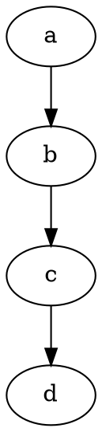
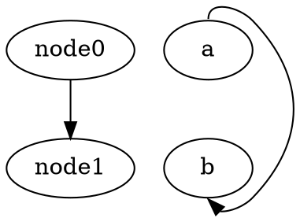
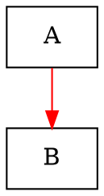
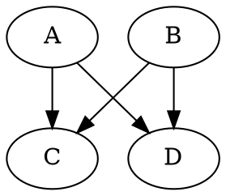

# Data Format Parser Testing Strategy

**Version:** 3.0
**Date:** 2025-12-11
**Purpose:** Ensure complete and faithful parsing of all nodes and edges from graph data files

## Table of Contents

1. [Overview](#overview)
2. [Goal: Complete Node/Edge Parsing](#goal-complete-nodeedge-parsing)
3. [Current Implementation Status](#current-implementation-status)
4. [Testing Strategy](#testing-strategy)
5. [Test Corpus](#test-corpus)
6. [Implementation Plan](#implementation-plan)

---

## Overview

### Problem Statement

Our parsers for DOT, GraphML, and other formats sometimes produce partial graphs—missing nodes or edges that exist in the source file. This is unacceptable because users expect to see their complete graph.

**This testing strategy focuses on one primary goal:**
> **Every node and every edge in a source file must be faithfully created in the parsed output.**

We are NOT adding new features (ports, compass points, nested graphs, hyperedges, etc.). Instead, we are ensuring that what we already support works correctly and completely.

### Supported Formats

| Format | Parser | Status |
|--------|--------|--------|
| JSON (variants) | `JsonDataSource.ts` | Stable |
| GraphML | `GraphMLDataSource.ts` | Stable |
| CSV | `CSVDataSource.ts` | Stable |
| DOT | `DOTDataSource.ts` | Stable |
| GML | `GMLDataSource.ts` | Stable |
| GEXF | `GEXFDataSource.ts` | Stable |
| Pajek NET | `PajekDataSource.ts` | Stable |

---

## Goal: Complete Node/Edge Parsing

### Primary Success Criteria

For every file in our test corpus:
1. **All nodes are parsed** - The parser extracts every node defined in the file
2. **All edges are parsed** - The parser extracts every edge/connection defined in the file
3. **Node IDs are correct** - Each node has the correct identifier
4. **Edge connections are correct** - Each edge connects the right source and target nodes

### What We're NOT Doing

We are explicitly **not** implementing:
- Edge ports (`node:port`) - Just strip the port suffix and create the edge
- Compass points (`node:n`, `node:se`) - Just strip the compass suffix and create the edge
- Nested/grouped graphs - Flatten to a single graph
- Hyperedges - Not supported (log warning, skip)
- Dynamic/temporal features - Not supported (use static snapshot)
- Advanced visual attributes - Nice to have, not required

### Known Limitations (Acceptable)

These are documented limitations that users should be aware of:

| Format | Limitation | Behavior |
|--------|-----------|----------|
| GraphML | Nested graphs flattened | All nodes/edges in single graph |
| GEXF | Dynamic mode ignored | Uses first time slice |
| Pajek | Matrix format unsupported | Use *Edges/*Arcs format |

### Implemented Features (Previously Limitations)

These were previously limitations but have been fixed:

| Format | Feature | Status |
|--------|---------|--------|
| DOT | Edge chains (`a->b->c`) | ✅ Creates correct number of edges |
| DOT | Port syntax (`node:port`) | ✅ Ports stripped, edges connect correct nodes |
| DOT | Subgraph edge shorthand (`{A B} -> C`) | ✅ Expands to all node combinations |
| DOT | Keyword recognition (`node [...]`) | ✅ No longer creates bogus nodes |
| All | Error recovery | ✅ Parsers drop bad rows and continue (see Phase 5) |

---

## Current Implementation Status

### DOT Parser (`src/data/DOTDataSource.ts`)

**Core Parsing (Must Work):**
- [x] `graph` / `digraph` / `strict` declarations
- [x] Node declarations with attributes
- [x] Edge statements (`->` and `--`)
- [x] Quoted strings (`"node name"`)
- [x] Numeric node IDs
- [x] HTML-like labels
- [x] Comments (`//`, `/* */`)
- [x] Subgraphs (flattened)
- [x] Basic attribute parsing

**Fixed Issues (Phase 2):**
- [x] Edge chains (`a -> b -> c`) - Now correctly creates multiple edges
- [x] Port syntax (`node:port`) - Port suffixes are now stripped from node IDs
- [x] Keyword recognition - `node [...]` and `edge [...]` no longer create bogus nodes
- [x] Subgraph edge shorthand (`{A B} -> C`) - Now correctly expands to multiple edges

### GraphML Parser (`src/data/GraphMLDataSource.ts`)

**Core Parsing (Must Work):**
- [x] Standard GraphML structure
- [x] Key definitions with typed attributes
- [x] All `<node>` elements extracted
- [x] All `<edge>` elements extracted
- [x] yFiles ShapeNode (visual properties)
- [x] yFiles PolyLineEdge (visual properties)

### GML Parser (`src/data/GMLDataSource.ts`)

**Core Parsing (Must Work):**
- [x] Basic structure (`graph [ node [...] edge [...] ]`)
- [x] All `node [...]` blocks extracted
- [x] All `edge [...]` blocks extracted
- [x] Node/edge attributes

### GEXF Parser (`src/data/GEXFDataSource.ts`)

**Core Parsing (Must Work):**
- [x] Standard GEXF structure
- [x] All `<node>` elements extracted
- [x] All `<edge>` elements extracted
- [x] Attribute definitions and values
- [x] viz namespace (position, color, size)

### CSV Parser (`src/data/CSVDataSource.ts`)

**Core Parsing (Must Work):**
- [x] Edge list format (source, target)
- [x] Node list format
- [x] Gephi format (Source, Target, Type, Weight)
- [x] Cytoscape format
- [x] Neo4j format
- [x] Adjacency list format
- [x] Paired files (nodes.csv + edges.csv)

### Pajek NET Parser (`src/data/PajekDataSource.ts`)

**Core Parsing (Must Work):**
- [x] `*Vertices` section - all vertices extracted
- [x] `*Arcs` section - all directed edges extracted
- [x] `*Edges` section - all undirected edges extracted
- [x] Labels and weights

### JSON Parser (`src/data/JsonDataSource.ts`)

**Core Parsing (Must Work):**
- [x] D3.js format (`nodes`/`links`)
- [x] Cytoscape.js format (`elements.nodes`/`elements.edges`)
- [x] Sigma.js/Graphology format (`key`/`attributes`)
- [x] Vis.js format (`from`/`to`)
- [x] NetworkX format

---

## Testing Strategy

### Curated Test Corpus

We maintain a corpus of real-world files from public datasets. Each file has documented expected node/edge counts.

**Test Philosophy:**
- Use 90% threshold for node/edge counts (accounts for known edge cases)
- Every corpus file should parse without errors
- Focus on **quantity** (complete parsing) not **features** (advanced attributes)

### Corpus Structure

```
test/helpers/corpus/
├── corpus.test.ts          # Valid corpus test runner (32 tests)
├── malformed.test.ts       # Malformed corpus test runner (60 tests)
├── dot/
│   ├── manifest.json
│   ├── hello.gv            # 2 nodes, 1 edge (minimal)
│   ├── cluster.gv          # 10 nodes, 11 edges (subgraphs)
│   ├── fsm.gv              # 9 nodes, 14 edges (labels)
│   ├── datastruct.gv       # 13 nodes, 17 edges (records)
│   ├── fdpclust.gv         # 7 nodes, 6 edges (undirected)
│   └── root.gv             # 1054 nodes, 1083 edges (large)
├── graphml/
│   ├── manifest.json
│   ├── simple.graphml      # 5 nodes, 5 edges (basic)
│   ├── yfiles-sample.graphml # 4 nodes, 4 edges (yFiles)
│   └── got-network.graphml # 107 nodes, 352 edges (GoT)
├── gml/
│   ├── manifest.json
│   ├── minimal.gml         # 3 nodes, 2 edges (minimal)
│   ├── karate.gml          # 34 nodes, 78 edges (classic)
│   ├── dolphins.gml        # 62 nodes, 159 edges (labels)
│   ├── polbooks.gml        # 105 nodes, 441 edges (larger)
│   └── football.gml        # 115 nodes, 613 edges (largest)
├── gexf/
│   ├── manifest.json
│   ├── minimal.gexf        # 3 nodes, 2 edges (minimal)
│   ├── lesmiserables.gexf  # 77 nodes, 254 edges
│   └── airlines-sample.gexf # 235 nodes, 1297 edges (large)
├── csv/
│   ├── manifest.json
│   ├── simple-edges.csv    # 5 nodes, 5 edges
│   ├── gephi-format.csv    # 4 nodes, 5 edges
│   ├── dolphins-medium.csv # 31 nodes, 50 edges (medium)
│   └── got-edges.csv       # 107 nodes, 352 edges (real-world)
├── pajek/
│   ├── manifest.json
│   ├── simple.net          # 5 nodes, 5 edges
│   ├── karate.net          # 34 nodes, 78 edges
│   ├── dolphins.net        # 62 nodes, 159 edges (medium)
│   └── football.net        # 115 nodes, 613 edges (large)
├── json/
│   ├── manifest.json
│   ├── d3-format.json      # 5 nodes, 5 edges (created)
│   ├── cytoscape-format.json # 5 nodes, 5 edges (created)
│   ├── sigma-format.json   # 5 nodes, 5 edges (created)
│   ├── visjs-format.json   # 5 nodes, 5 edges (created)
│   ├── networkx-format.json # 5 nodes, 5 edges (created)
│   ├── karate-d3.json      # 34 nodes, 78 edges (medium)
│   └── miserables.json     # 77 nodes, 254 edges (D3 classic)
└── malformed/              # Error handling test files
    ├── dot/                # 10 malformed DOT files
    ├── graphml/            # 10 malformed GraphML files
    ├── gml/                # 10 malformed GML files
    ├── gexf/               # 10 malformed GEXF files
    ├── csv/                # 10 malformed CSV files
    ├── pajek/              # 10 malformed Pajek files
    └── json/               # 10 malformed JSON files
```

### Corpus Diversity Goals

Each format should have:
1. **Minimal file** - Simplest valid graph (2-5 nodes)
2. **Medium file** - Typical use case (30-100 nodes)
3. **Large file** - Stress test (100+ nodes)
4. **Real-world file** - From actual public dataset

Current Coverage (Phase 3 Complete):

| Format | Minimal | Medium | Large | Real-world |
|--------|---------|--------|-------|------------|
| DOT | ✅ hello.gv | ✅ cluster.gv | ✅ root.gv (1054) | ✅ fsm.gv |
| GraphML | ✅ simple.graphml | ✅ got-network (107) | ✅ got-network | ✅ GoT dataset |
| GML | ✅ minimal.gml | ✅ karate.gml (34) | ✅ football.gml (115) | ✅ All from Newman |
| GEXF | ✅ minimal.gexf | ✅ lesmiserables (77) | ✅ airlines (235) | ✅ From Gephi |
| CSV | ✅ simple-edges | ✅ dolphins-medium (31) | ✅ got-edges (107) | ✅ GoT dataset |
| Pajek | ✅ simple.net | ✅ dolphins.net (62) | ✅ football.net (115) | ✅ dolphins, football |
| JSON | ✅ All 5 variants | ✅ karate-d3 (34) | ✅ miserables (77) | ✅ miserables |

### Test Runner

```typescript
// test/helpers/corpus/corpus.test.ts
describe("Corpus Tests", () => {
  for (const format of formats) {
    describe(`${format.toUpperCase()} Format`, () => {
      for (const file of manifest.files) {
        test(`parses ${file.path}`, async () => {
          const content = readFileSync(filePath, "utf-8");
          const dataSource = new DataSourceClass({ data: content });

          const { totalNodes, totalEdges } = await collectChunks(dataSource);

          // 90% threshold allows for known edge cases
          assert.isAtLeast(totalNodes, file.expectedNodes * 0.9);
          assert.isAtLeast(totalEdges, file.expectedEdges * 0.9);
        });
      }
    });
  }
});
```

---

## Test Corpus

### DOT Format Sources

| Source | URL | License |
|--------|-----|---------|
| Graphviz Gallery | https://graphviz.org/gallery/ | EPL-1.0 |

### GraphML Format Sources

| Source | URL | License |
|--------|-----|---------|
| Created samples | N/A | MIT |

### GML Format Sources

| Source | URL | License |
|--------|-----|---------|
| Mark Newman | http://www-personal.umich.edu/~mejn/netdata/ | Academic |

### GEXF Format Sources

| Source | URL | License |
|--------|-----|---------|
| Gephi Datasets | https://github.com/gephi/gephi.github.io/tree/master/datasets | Various |

### CSV Format Sources

| Source | URL | License |
|--------|-----|---------|
| Sample Social Networks | https://github.com/melaniewalsh/sample-social-network-datasets | CC0 |

### JSON Format Sources

| Source | URL | License |
|--------|-----|---------|
| D3 Examples | https://github.com/d3/d3-plugins | BSD |
| Created samples | N/A | MIT |

---

## Implementation Plan

### Phase 1: Corpus Setup ✅ COMPLETE

1. ✅ Created directory structure under `test/helpers/corpus/`
2. ✅ Downloaded curated files from public sources
3. ✅ Created manifest files with expected counts
4. ✅ Implemented corpus test runner

### Phase 2: Fix DOT Parser Issues ✅ COMPLETE

**Goal:** Fix critical DOT parsing bugs that cause missing edges or bogus nodes.

**Reference:** [DOT Language Specification](https://graphviz.org/doc/info/lang.html)

#### Issue 2.1: Edge Chains (CRITICAL)

**Problem:** Edge chains like `a -> b -> c -> d` only create 2 edges instead of 3.

**DOT Grammar:**
```
edge_stmt = (node_id | subgraph) edgeRHS [attr_list]
edgeRHS   = edgeop (node_id | subgraph) [edgeRHS]   ← RECURSIVE!
```

**Test Case:**

- Expected: 3 edges (a→b, b→c, c→d)
- Actual: 2 edges (a→b, c→d), missing b→c

**Fix:** Implement recursive parsing of `edgeRHS` to handle chains.

#### Issue 2.2: Port Syntax (HIGH)

**Problem:** Port suffixes like `:f0` or `:n` are not stripped from node IDs.

**DOT Grammar:**
```
node_id = ID [port]
port    = ':' ID [':' compass_pt] | ':' compass_pt
compass_pt = n | ne | e | se | s | sw | w | nw | c | _
```

**Test Case:**

- Expected: 2 edges (node0→node1, a→b)
- Actual: Edges with bogus nodes `:f0`, `a:n`, `b:s`

**Fix:** Strip port/compass suffixes when parsing node IDs in edge statements.

#### Issue 2.3: Keyword Recognition (MEDIUM)

**Problem:** `node [...]` and `edge [...]` default attribute statements create bogus nodes.

**DOT Grammar:**
```
attr_stmt = (graph | node | edge) attr_list
```

**Test Case:**

- Expected: 2 nodes (A, B)
- Actual: 4 nodes (node, edge, A, B) - "node" and "edge" are bogus

**Fix:** Recognize `node`, `edge`, `graph` keywords followed by `[` as attribute statements, not node declarations.

#### Issue 2.4: Subgraph Edge Shorthand (MEDIUM)

**Problem:** Anonymous subgraphs in edge statements don't expand to multiple edges.

**DOT Grammar:**
```
edge_stmt = (node_id | subgraph) edgeRHS [attr_list]
subgraph  = [subgraph [ID]] '{' stmt_list '}'
```

**Test Case:**

- Expected: 4 edges (A→C, A→D, B→C, B→D)
- Actual: 0 edges, bogus nodes created

**Fix:** When parsing edge statements, detect `{...}` as anonymous subgraph and expand to all node combinations.

#### Phase 2 Tasks

1. [x] Add unit tests for each issue (edge chains, ports, keywords, subgraph edges)
2. [x] Fix Issue 2.1: Implement recursive edge chain parsing
3. [x] Fix Issue 2.2: Strip port/compass suffixes from node IDs
4. [x] Fix Issue 2.3: Recognize `node`/`edge`/`graph` keywords before `[`
5. [x] Fix Issue 2.4: Expand subgraph edge shorthand
6. [x] Update corpus manifests with correct expected counts
7. [x] Run all corpus tests to verify fixes

### Phase 3: Expand Corpus Diversity ✅ COMPLETE

**Goal:** Each format has minimal, medium, large, and real-world files.

**Completed Tasks:**
1. [x] Added root.gv (1054 nodes) - large DOT file from Graphviz gallery
2. [x] Added got-network.graphml (107 nodes) - Game of Thrones social network
3. [x] Added minimal.gml and minimal.gexf - minimal test files
4. [x] Added dolphins-medium.csv (31 nodes) - medium CSV file
5. [x] Added dolphins.net (62 nodes) and football.net (115 nodes) - Pajek files
6. [x] Added karate-d3.json (34 nodes) - medium JSON file
7. [x] All 32 corpus tests pass

### Phase 4: CI Integration ✅ COMPLETE

**Goal:** Corpus tests run automatically in CI.

**Completed Tasks:**
1. ✅ Corpus tests included in `npm test` (part of default vitest project)
2. ✅ Tests run in CI via existing test pipeline
3. ✅ Known limitations documented in this design document

### Phase 5: Error Recovery ✅ COMPLETE

**Goal:** Parsers should gracefully handle malformed input by dropping bad rows and continuing, rather than aborting entirely.

**Background:** Prior to this phase, DOT and JSON parsers used an "all-or-nothing" approach - any parsing error would abort the entire parse. Other parsers (CSV, Pajek, GraphML, GML, GEXF) already had error recovery using the ErrorAggregator pattern.

**Completed Tasks:**
1. ✅ Added error recovery to DOTDataSource
   - Empty content returns empty result instead of throwing
   - Try-catch around tokenization with error aggregation
   - Try-catch around statement parsing with `skipToNextStatement()` recovery
   - New `skipToNextStatement()` helper finds next `;` or `}` boundary

2. ✅ Added error recovery to JsonDataSource
   - Empty content returns empty result instead of throwing
   - JSON.parse errors logged and return empty result
   - Missing/wrong-type nodes/edges arrays logged and use empty arrays
   - Per-element validation with `isValidNode()` and `isValidEdge()` helpers
   - Invalid nodes/edges are dropped, valid ones are kept

3. ✅ Created malformed corpus (60 test files)
   - 10 malformed files per format (DOT, GraphML, GML, GEXF, CSV, Pajek, JSON)
   - Test runner with `expectedBehaviors` map defining expected behavior per file
   - Tests verify parsers either throw meaningful errors or recover gracefully

**Error Recovery Summary:**

| Parser | Drops Bad Rows? | Uses ErrorAggregator? | Returns Partial Results? |
|--------|-----------------|----------------------|-------------------------|
| CSV | ✅ Yes | ✅ Yes | ✅ Yes |
| Pajek | ✅ Yes | ✅ Yes | ✅ Yes |
| GraphML | ✅ Yes | ✅ Yes | ✅ Yes |
| GML | ✅ Yes | ✅ Yes | ✅ Yes |
| GEXF | ✅ Yes | ✅ Yes | ✅ Yes |
| DOT | ✅ Yes | ✅ Yes | ✅ Yes |
| JSON | ✅ Yes | ✅ Yes | ✅ Yes |

---

## Appendix: Manifest Format

```json
{
  "format": "dot",
  "description": "DOT format test files",
  "files": [
    {
      "path": "hello.gv",
      "source": "https://graphviz.org/Gallery/directed/hello.html",
      "license": "EPL-1.0",
      "expectedNodes": 2,
      "expectedEdges": 1,
      "features": ["basic", "digraph"]
    }
  ]
}
```

---

## Version History

- **v3.0** (2025-12-11): Phase 5 complete - error recovery for all parsers, malformed corpus added, corpus moved to test/helpers/corpus
- **v2.1** (2025-12-10): Added detailed DOT parser issue analysis and fix plan for Phase 2
- **v2.0** (2025-12-10): Refocused on complete node/edge parsing, removed feature expansion goals
- **v1.0** (2025-12-09): Initial comprehensive testing strategy
